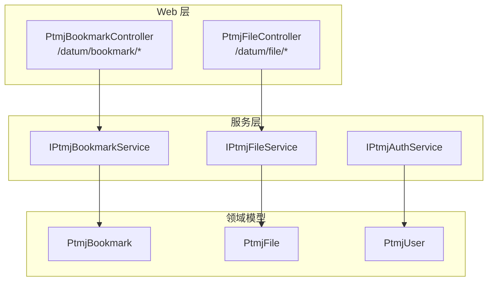
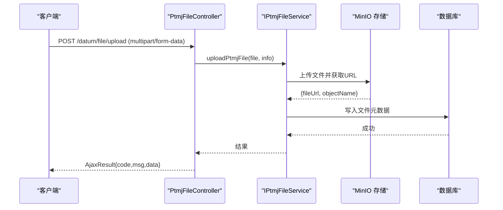
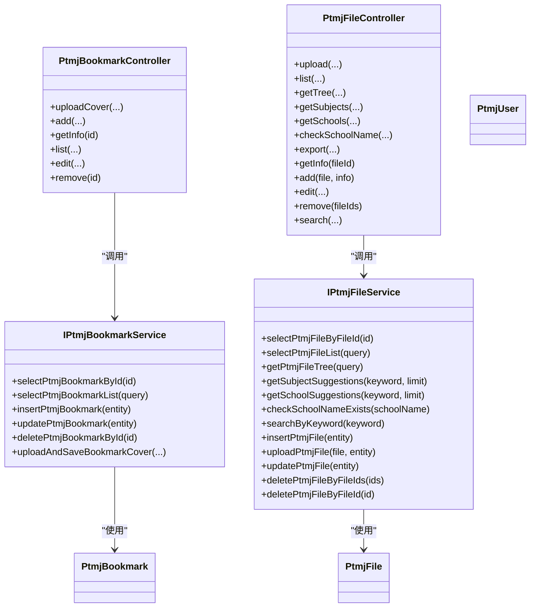

# API 接口文档

<cite>
**本文引用的文件**
- [PtmjBookmarkController.java](file://PezMax-Backend/ruoyi-admin/src/main/java/com/ruoyi/web/controller/datum/PtmjBookmarkController.java)
- [PtmjFileController.java](file://PezMax-Backend/ruoyi-admin/src/main/java/com/ruoyi/web/controller/datum/PtmjFileController.java)
- [IPtmjAuthService.java](file://PezMax-Backend/ptmj-datum/src/main/java/com/ptmj/datum/service/IPtmjAuthService.java)
- [IPtmjBookmarkService.java](file://PezMax-Backend/ptmj-datum/src/main/java/com/ptmj/datum/service/IPtmjBookmarkService.java)
- [IPtmjFileService.java](file://PezMax-Backend/ptmj-datum/src/main/java/com/ptmj/datum/service/IPtmjFileService.java)
- [PtmjUser.java](file://PezMax-Backend/ptmj-datum/src/main/java/com/ptmj/datum/domain/PtmjUser.java)
- [PtmjBookmark.java](file://PezMax-Backend/ptmj-datum/src/main/java/com/ptmj/datum/domain/PtmjBookmark.java)
- [PtmjFile.java](file://PezMax-Backend/ptmj-datum/src/main/java/com/ptmj/datum/domain/PtmjFile.java)
- [README.md](file://PezMax-Backend/README.md)
</cite>

## 目录
1. [简介](#简介)
2. [项目结构](#项目结构)
3. [核心组件](#核心组件)
4. [架构总览](#架构总览)
5. [详细接口说明](#详细接口说明)
6. [依赖关系分析](#依赖关系分析)
7. [性能与可用性](#性能与可用性)
8. [故障排查指南](#故障排查指南)
9. [结论](#结论)
10. [附录](#附录)

## 简介
本文件为 PezMax 后端 RESTful API 的完整接口文档，覆盖用户认证、文件管理、书签管理等公开能力。文档包含：
- HTTP 方法与 URL 模式
- 请求参数与响应格式
- 错误码与异常处理约定
- 认证方式与请求头设置
- 数据模型定义与字段约束
- 版本管理与兼容性说明
- 测试与调试建议（Postman/Swagger）

## 项目结构
后端采用多模块 Maven 工程，核心业务在 ptmj-datum 模块，Web 入口与控制器位于 ruoyi-admin 模块，通用能力与框架配置分别位于 ruoyi-common 与 ruoyi-framework。

图表来源
- [PtmjBookmarkController.java:1-106](file://PezMax-Backend/ruoyi-admin/src/main/java/com/ruoyi/web/controller/datum/PtmjBookmarkController.java#L1-L106)
- [PtmjFileController.java:1-273](file://PezMax-Backend/ruoyi-admin/src/main/java/com/ruoyi/web/controller/datum/PtmjFileController.java#L1-L273)
- [IPtmjBookmarkService.java:1-89](file://PezMax-Backend/ptmj-datum/src/main/java/com/ptmj/datum/service/IPtmjBookmarkService.java#L1-L89)
- [IPtmjFileService.java:1-119](file://PezMax-Backend/ptmj-datum/src/main/java/com/ptmj/datum/service/IPtmjFileService.java#L1-L119)
- [IPtmjAuthService.java:1-20](file://PezMax-Backend/ptmj-datum/src/main/java/com/ptmj/datum/service/IPtmjAuthService.java#L1-L20)
- [PtmjBookmark.java:1-218](file://PezMax-Backend/ptmj-datum/src/main/java/com/ptmj/datum/domain/PtmjBookmark.java#L1-L218)
- [PtmjFile.java:1-224](file://PezMax-Backend/ptmj-datum/src/main/java/com/ptmj/datum/domain/PtmjFile.java#L1-L224)
- [PtmjUser.java:1-139](file://PezMax-Backend/ptmj-datum/src/main/java/com/ptmj/datum/domain/PtmjUser.java#L1-L139)

章节来源
- [README.md:1-105](file://PezMax-Backend/README.md#L1-L105)

## 核心组件
- 控制器层
  - PtmjBookmarkController：提供书签增删改查与封面上传等接口
  - PtmjFileController：提供文件列表、树形结构、联想推荐、搜索、导出、上传、修改、删除等接口
- 服务层
  - IPtmjBookmarkService：书签业务逻辑与封面上传封装
  - IPtmjFileService：文件查询、树构建、联想推荐、搜索、上传、CRUD 等
  - IPtmjAuthService：登录认证（返回 token）
- 领域模型
  - PtmjBookmark：外部书签实体
  - PtmjFile：试卷文件实体
  - PtmjUser：平台用户实体

章节来源
- [PtmjBookmarkController.java:1-106](file://PezMax-Backend/ruoyi-admin/src/main/java/com/ruoyi/web/controller/datum/PtmjBookmarkController.java#L1-L106)
- [PtmjFileController.java:1-273](file://PezMax-Backend/ruoyi-admin/src/main/java/com/ruoyi/web/controller/datum/PtmjFileController.java#L1-L273)
- [IPtmjBookmarkService.java:1-89](file://PezMax-Backend/ptmj-datum/src/main/java/com/ptmj/datum/service/IPtmjBookmarkService.java#L1-L89)
- [IPtmjFileService.java:1-119](file://PezMax-Backend/ptmj-datum/src/main/java/com/ptmj/datum/service/IPtmjFileService.java#L1-L119)
- [IPtmjAuthService.java:1-20](file://PezMax-Backend/ptmj-datum/src/main/java/com/ptmj/datum/service/IPtmjAuthService.java#L1-L20)
- [PtmjBookmark.java:1-218](file://PezMax-Backend/ptmj-datum/src/main/java/com/ptmj/datum/domain/PtmjBookmark.java#L1-L218)
- [PtmjFile.java:1-224](file://PezMax-Backend/ptmj-datum/src/main/java/com/ptmj/datum/domain/PtmjFile.java#L1-L224)
- [PtmjUser.java:1-139](file://PezMax-Backend/ptmj-datum/src/main/java/com/ptmj/datum/domain/PtmjUser.java#L1-L139)

## 架构总览
整体采用 Controller -> Service -> Mapper/Storage 的分层架构。部分接口标注匿名访问，支持未登录调用；其余接口默认受 Spring Security 保护。

图表来源
- [PtmjFileController.java:78-92](file://PezMax-Backend/ruoyi-admin/src/main/java/com/ruoyi/web/controller/datum/PtmjFileController.java#L78-L92)
- [IPtmjFileService.java:86-93](file://PezMax-Backend/ptmj-datum/src/main/java/com/ptmj/datum/service/IPtmjFileService.java#L86-L93)

## 详细接口说明

### 通用约定
- 基础路径
  - 书签：/datum/bookmark
  - 文件：/datum/file
- 统一响应体
  - 成功：AjaxResult{code=200, msg="操作成功", data=...}
  - 失败：AjaxResult{code!=200, msg="错误信息", data=null}
- 分页
  - 列表接口使用 TableDataInfo 分页包装，前端需传递分页参数（如 pageNum/pageSize），由 BaseController.startPage() 驱动
- 匿名访问
  - 部分接口标注 @Anonymous，无需鉴权即可访问
- 权限控制
  - 部分接口原计划使用 @PreAuthorize，当前实现中多数已放开或注释，具体以实际注解为准

章节来源
- [PtmjBookmarkController.java:1-106](file://PezMax-Backend/ruoyi-admin/src/main/java/com/ruoyi/web/controller/datum/PtmjBookmarkController.java#L1-L106)
- [PtmjFileController.java:1-273](file://PezMax-Backend/ruoyi-admin/src/main/java/com/ruoyi/web/controller/datum/PtmjFileController.java#L1-L273)

### 用户认证接口
- 登录
  - 方法：POST
  - URL：/datum/auth/login
  - 请求体：PtmjLoginBody（用户名、密码等）
  - 响应：String（token）
  - 说明：用于获取后续请求所需的令牌
  - 参考：[IPtmjAuthService.java:1-20](file://PezMax-Backend/ptmj-datum/src/main/java/com/ptmj/datum/service/IPtmjAuthService.java#L1-L20)

注意：注册、密码重置等接口在当前代码库中未发现对应 Controller 暴露，如需接入请新增相应控制器与服务。

章节来源
- [IPtmjAuthService.java:1-20](file://PezMax-Backend/ptmj-datum/src/main/java/com/ptmj/datum/service/IPtmjAuthService.java#L1-L20)

### 书签管理接口
- 上传书签封面图
  - 方法：POST
  - URL：/datum/bookmark/uploadCover
  - 请求类型：multipart/form-data
  - 表单字段
    - file：图片文件
    - resourceType：书签类型
    - collection：专栏（可选）
    - bookmarkId：书签ID（可选）
    - bookmarkName：书签名（可选）
  - 响应：AjaxResult{data={fileUrl, objectName, fileName}}
  - 说明：内部会保存或更新书签封面图
  - 参考：[PtmjBookmarkController.java:42-52](file://PezMax-Backend/ruoyi-admin/src/main/java/com/ruoyi/web/controller/datum/PtmjBookmarkController.java#L42-L52), [IPtmjBookmarkService.java:77-87](file://PezMax-Backend/ptmj-datum/src/main/java/com/ptmj/datum/service/IPtmjBookmarkService.java#L77-L87)

- 新增书签
  - 方法：POST
  - URL：/datum/bookmark
  - 请求体：PtmjBookmark JSON
  - 响应：AjaxResult{code, msg, data}
  - 参考：[PtmjBookmarkController.java:57-62](file://PezMax-Backend/ruoyi-admin/src/main/java/com/ruoyi/web/controller/datum/PtmjBookmarkController.java#L57-L62)

- 根据 ID 查询书签详情
  - 方法：GET
  - URL：/datum/bookmark/{id}
  - 路径参数：id（Long）
  - 响应：AjaxResult{data=PtmjBookmark}
  - 匿名访问
  - 参考：[PtmjBookmarkController.java:67-72](file://PezMax-Backend/ruoyi-admin/src/main/java/com/ruoyi/web/controller/datum/PtmjBookmarkController.java#L67-L72)

- 查询书签列表（分页）
  - 方法：GET
  - URL：/datum/bookmark/list
  - 查询参数：PtmjBookmark 各字段作为过滤条件
  - 响应：TableDataInfo{rows=[PtmjBookmark], total, pageNum, pageSize}
  - 匿名访问
  - 参考：[PtmjBookmarkController.java:77-84](file://PezMax-Backend/ruoyi-admin/src/main/java/com/ruoyi/web/controller/datum/PtmjBookmarkController.java#L77-L84)

- 修改书签
  - 方法：PUT
  - URL：/datum/bookmark
  - 请求体：PtmjBookmark JSON
  - 响应：AjaxResult{code, msg, data}
  - 参考：[PtmjBookmarkController.java:89-94](file://PezMax-Backend/ruoyi-admin/src/main/java/com/ruoyi/web/controller/datum/PtmjBookmarkController.java#L89-L94)

- 删除书签
  - 方法：DELETE
  - URL：/datum/bookmark/{id}
  - 路径参数：id（Long）
  - 响应：AjaxResult{code, msg, data}
  - 参考：[PtmjBookmarkController.java:99-104](file://PezMax-Backend/ruoyi-admin/src/main/java/com/ruoyi/web/controller/datum/PtmjBookmarkController.java#L99-L104)

章节来源
- [PtmjBookmarkController.java:1-106](file://PezMax-Backend/ruoyi-admin/src/main/java/com/ruoyi/web/controller/datum/PtmjBookmarkController.java#L1-L106)
- [IPtmjBookmarkService.java:1-89](file://PezMax-Backend/ptmj-datum/src/main/java/com/ptmj/datum/service/IPtmjBookmarkService.java#L1-L89)

### 文件管理接口
- 上传文件至桶根目录
  - 方法：POST
  - URL：/datum/file/upload
  - 请求类型：multipart/form-data
  - 表单字段：file（文件）
  - 响应：AjaxResult{data={fileUrl, objectName, ...}}
  - 说明：直接上传到 MinIO 桶根目录
  - 参考：[PtmjFileController.java:78-92](file://PezMax-Backend/ruoyi-admin/src/main/java/com/ruoyi/web/controller/datum/PtmjFileController.java#L78-L92)

- 查询文件列表（分页）
  - 方法：GET
  - URL：/datum/file/list
  - 查询参数：PtmjFile 各字段作为过滤条件
  - 响应：TableDataInfo{rows=[PtmjFile], total, pageNum, pageSize}
  - 匿名访问
  - 参考：[PtmjFileController.java:97-105](file://PezMax-Backend/ruoyi-admin/src/main/java/com/ruoyi/web/controller/datum/PtmjFileController.java#L97-L105)

- 获取文件树（按科目->类型->年份聚合）
  - 方法：GET
  - URL：/datum/file/tree
  - 查询参数：PtmjFile 各字段作为过滤条件
  - 响应：AjaxResult{data=[FileTreeVo]}
  - 匿名访问
  - 参考：[PtmjFileController.java:112-119](file://PezMax-Backend/ruoyi-admin/src/main/java/com/ruoyi/web/controller/datum/PtmjFileController.java#L112-L119)

- 学科联想推荐
  - 方法：GET
  - URL：/datum/file/subjects
  - 查询参数：keyword（可选）、limit（可选）
  - 响应：AjaxResult{data=[SubjectSuggestionVo]}
  - 参考：[PtmjFileController.java:126-132](file://PezMax-Backend/ruoyi-admin/src/main/java/com/ruoyi/web/controller/datum/PtmjFileController.java#L126-L132)

- 学校联想推荐
  - 方法：GET
  - URL：/datum/file/schools
  - 查询参数：keyword（可选）、limit（可选）
  - 响应：AjaxResult{data=[SchoolSuggestionVo]}
  - 匿名访问
  - 参考：[PtmjFileController.java:137-144](file://PezMax-Backend/ruoyi-admin/src/main/java/com/ruoyi/web/controller/datum/PtmjFileController.java#L137-L144)

- 检查学校名称是否已存在
  - 方法：GET
  - URL：/datum/file/schools/check
  - 查询参数：schoolName
  - 响应：AjaxResult{data=true|false}
  - 参考：[PtmjFileController.java:149-154](file://PezMax-Backend/ruoyi-admin/src/main/java/com/ruoyi/web/controller/datum/PtmjFileController.java#L149-L154)

- 导出文件列表（Excel）
  - 方法：POST
  - URL：/datum/file/export
  - 请求体：PtmjFile 作为过滤条件
  - 响应：Excel 文件流
  - 参考：[PtmjFileController.java:161-168](file://PezMax-Backend/ruoyi-admin/src/main/java/com/ruoyi/web/controller/datum/PtmjFileController.java#L161-L168)

- 获取文件详细信息
  - 方法：GET
  - URL：/datum/file/{fileId}
  - 路径参数：fileId（Long）
  - 响应：AjaxResult{data=PtmjFile}
  - 匿名访问
  - 参考：[PtmjFileController.java:174-179](file://PezMax-Backend/ruoyi-admin/src/main/java/com/ruoyi/web/controller/datum/PtmjFileController.java#L174-L179)

- 新增文件（上传并入库）
  - 方法：POST
  - URL：/datum/file
  - 请求类型：multipart/form-data
  - 表单字段：file（文件）、以及 PtmjFile 各字段（如 fileName、fileFormat、fileYear、fileType、fileSchool、fileSubject 等）
  - 响应：AjaxResult{code, msg, data}
  - 参考：[PtmjFileController.java:187-192](file://PezMax-Backend/ruoyi-admin/src/main/java/com/ruoyi/web/controller/datum/PtmjFileController.java#L187-L192)

- 修改文件
  - 方法：PUT
  - URL：/datum/file
  - 请求体：PtmjFile JSON
  - 响应：AjaxResult{code, msg, data}
  - 参考：[PtmjFileController.java:221-226](file://PezMax-Backend/ruoyi-admin/src/main/java/com/ruoyi/web/controller/datum/PtmjFileController.java#L221-L226)

- 批量删除文件
  - 方法：DELETE
  - URL：/datum/file/{fileIds}
  - 路径参数：fileIds（Long[]）
  - 响应：AjaxResult{code, msg, data}
  - 参考：[PtmjFileController.java:232-237](file://PezMax-Backend/ruoyi-admin/src/main/java/com/ruoyi/web/controller/datum/PtmjFileController.java#L232-L237)

- 关键词搜索文件（文件名+学科，学科命中优先）
  - 方法：GET
  - URL：/datum/file/search
  - 查询参数：keyword（可选）
  - 响应：List<PtmjFile>
  - 参考：[PtmjFileController.java:242-246](file://PezMax-Backend/ruoyi-admin/src/main/java/com/ruoyi/web/controller/datum/PtmjFileController.java#L242-L246)

章节来源
- [PtmjFileController.java:1-273](file://PezMax-Backend/ruoyi-admin/src/main/java/com/ruoyi/web/controller/datum/PtmjFileController.java#L1-L273)
- [IPtmjFileService.java:1-119](file://PezMax-Backend/ptmj-datum/src/main/java/com/ptmj/datum/service/IPtmjFileService.java#L1-L119)

### 系统管理接口
当前仓库未暴露系统管理相关控制器（用户管理、角色菜单、字典等）。若需开放，请在 ruoyi-system 或 ruoyi-admin 下新增 Controller 并遵循现有规范。

## 依赖关系分析
- 控制器依赖服务接口，服务接口再依赖领域模型与持久化层
- 文件上传流程涉及 MinIO 对象存储
- 部分接口允许匿名访问，降低鉴权开销

图表来源
- [PtmjBookmarkController.java:1-106](file://PezMax-Backend/ruoyi-admin/src/main/java/com/ruoyi/web/controller/datum/PtmjBookmarkController.java#L1-L106)
- [PtmjFileController.java:1-273](file://PezMax-Backend/ruoyi-admin/src/main/java/com/ruoyi/web/controller/datum/PtmjFileController.java#L1-L273)
- [IPtmjBookmarkService.java:1-89](file://PezMax-Backend/ptmj-datum/src/main/java/com/ptmj/datum/service/IPtmjBookmarkService.java#L1-L89)
- [IPtmjFileService.java:1-119](file://PezMax-Backend/ptmj-datum/src/main/java/com/ptmj/datum/service/IPtmjFileService.java#L1-L119)
- [PtmjBookmark.java:1-218](file://PezMax-Backend/ptmj-datum/src/main/java/com/ptmj/datum/domain/PtmjBookmark.java#L1-L218)
- [PtmjFile.java:1-224](file://PezMax-Backend/ptmj-datum/src/main/java/com/ptmj/datum/domain/PtmjFile.java#L1-L224)
- [PtmjUser.java:1-139](file://PezMax-Backend/ptmj-datum/src/main/java/com/ptmj/datum/domain/PtmjUser.java#L1-L139)

## 性能与可用性
- 列表与树接口支持分页与过滤，避免一次性加载大量数据
- 文件树接口按“科目->类型->年份”聚合，适合前端树形展示
- 联想推荐接口支持 keyword 与 limit 参数，减少不必要的数据传输
- 文件上传走 MinIO，减轻应用服务器 IO 压力
- 匿名接口可提升未登录用户的访问效率

## 故障排查指南
- 上传失败
  - 检查 MinIO 服务状态与桶策略
  - 确认文件大小与类型限制
  - 查看服务端日志中的异常堆栈
- 列表/树为空
  - 检查过滤条件是否正确
  - 确认数据库中是否存在有效记录
- 搜索无结果
  - 检查 keyword 是否为空或匹配不到
  - 确认学科与文件名字段是否包含目标内容
- 权限问题
  - 确认接口是否被 @Anonymous 放行
  - 若需要鉴权，确保携带有效的认证令牌

## 结论
本 API 文档基于现有控制器与服务接口整理，覆盖了书签与文件两大核心域的主要能力。认证接口仅暴露登录能力，注册与密码重置尚未开放。建议在后续迭代中补充系统管理接口，并完善统一的鉴权与错误码规范。

## 附录

### 数据模型定义
- PtmjUser（用户）
  - 关键字段：userId、userName、avatar、count、status、creatBy
  - 备注：password 字段仅写不读（序列化时隐藏）
  - 参考：[PtmjUser.java:1-139](file://PezMax-Backend/ptmj-datum/src/main/java/com/ptmj/datum/domain/PtmjUser.java#L1-L139)

- PtmjBookmark（书签）
  - 关键字段：id、userId、url、title、description、coverImage、subject、resourceType、collection、status、delFlag、keyword
  - 参考：[PtmjBookmark.java:1-218](file://PezMax-Backend/ptmj-datum/src/main/java/com/ptmj/datum/domain/PtmjBookmark.java#L1-L218)

- PtmjFile（文件）
  - 关键字段：fileId、userId、fileName、fileUrl、fileSize、fileFormat、fileYear、fileType、fileSchool、fileSubject、reviewer、fileStatus、delFlag
  - 参考：[PtmjFile.java:1-224](file://PezMax-Backend/ptmj-datum/src/main/java/com/ptmj/datum/domain/PtmjFile.java#L1-L224)

### 接口版本与兼容性
- 当前版本：v1.0.0（参见 README）
- 向后兼容策略
  - 新增字段保持可选，避免破坏旧客户端
  - 变更字段命名前进行废弃标记与过渡期支持
  - 接口路径保持稳定，必要时通过新路径发布新版本

### 测试与调试
- Postman
  - 建议创建集合，按“认证/书签/文件”分组导入接口
  - 对 multipart/form-data 接口使用 form-data 模式上传文件
- Swagger/OpenAPI
  - 当前仓库未集成在线文档生成器，可在后续引入 SpringDoc 或 Knife4j 自动生成文档