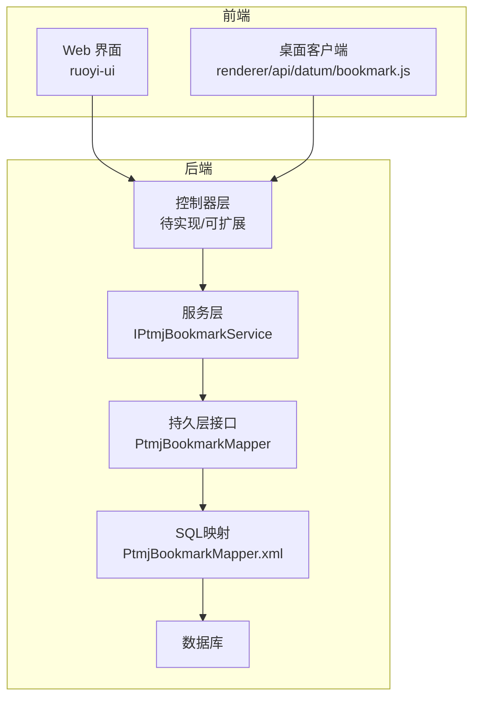
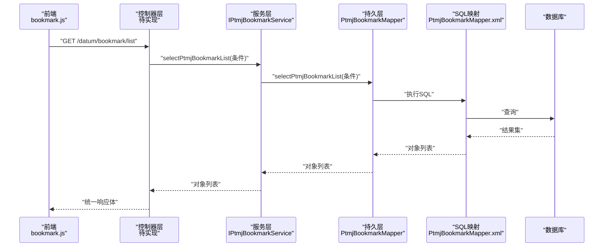
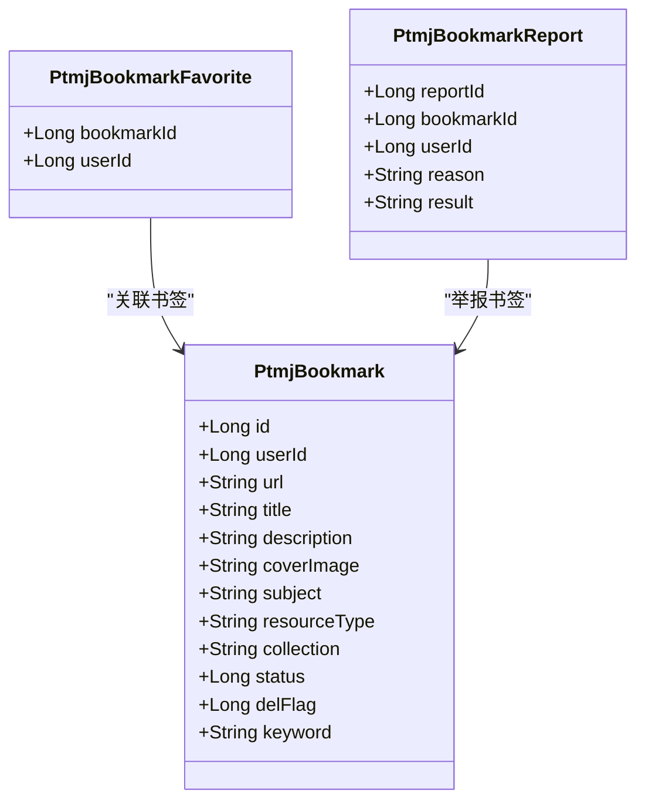
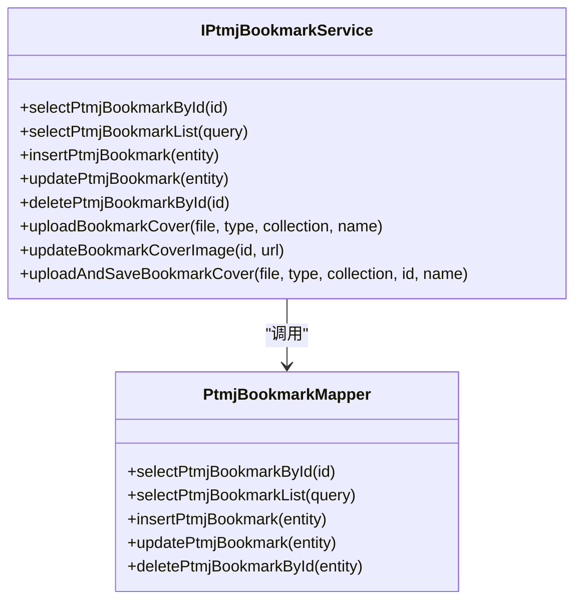
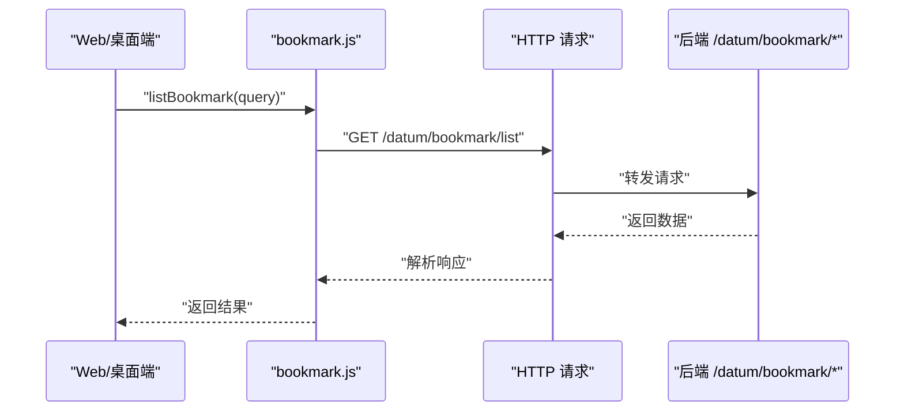
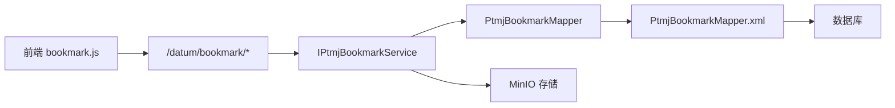

# 书签管理接口

<cite>
**本文引用的文件**   
- [PtmjBookmark.java](file://PezMax-Backend/ptmj-datum/src/main/java/com/ptmj/datum/domain/PtmjBookmark.java)
- [PtmjBookmarkMapper.java](file://PezMax-Backend/ptmj-datum/src/main/java/com/ptmj/datum/mapper/PtmjBookmarkMapper.java)
- [PtmjBookmarkMapper.xml](file://PezMax-Backend/ptmj-datum/src/main/resources/mapper/datum/PtmjBookmarkMapper.xml)
- [IPtmjBookmarkService.java](file://PezMax-Backend/ptmj-datum/src/main/java/com/ptmj/datum/service/IPtmjBookmarkService.java)
- [PtmjBookmarkFavorite.java](file://PezMax-Backend/ptmj-datum/src/main/java/com/ptmj/datum/domain/PtmjBookmarkFavorite.java)
- [PtmjBookmarkReport.java](file://PezMax-Backend/ptmj-datum/src/main/java/com/ptmj/datum/domain/PtmjBookmarkReport.java)
- [bookmark.js（Web端）](file://PezMax-Backend/ruoyi-ui/src/api/bookmark/bookmark.js)
- [bookmark.js（桌面端）](file://PezMax-Desktop/src/renderer/api/datum/bookmark.js)
</cite>

## 目录
1. [简介](#简介)
2. [项目结构](#项目结构)
3. [核心组件](#核心组件)
4. [架构总览](#架构总览)
5. [详细组件分析](#详细组件分析)
6. [依赖分析](#依赖分析)
7. [性能考虑](#性能考虑)
8. [故障排查指南](#故障排查指南)
9. [结论](#结论)
10. [附录](#附录)

## 简介
本文件面向“书签管理”相关 API 的设计与实现，覆盖以下能力：
- 书签增删改查：添加、编辑、删除、查询列表与详情
- 分类与标签：学科/专栏/资源类型等维度组织书签
- 导入导出：批量导入与导出为文件（基于通用 Excel 工具）
- 分享与权限：生成分享链接与访问控制（建议方案）
- 同步与去重：多端同步策略与重复检测
- 安全与体验：安全性检查、恶意链接检测、用户体验优化

说明：
- 当前代码已提供书签数据模型、基础 CRUD 的 Service/Mapper 以及前端调用封装。
- 导入导出、收藏、举报等能力在领域模型与接口中已有支撑点，具体 Controller 层可根据业务扩展。

## 项目结构
后端采用分层架构：Controller → Service → Mapper → XML SQL；前端通过 REST 调用后端接口。

图表来源
- [PtmjBookmarkMapper.java:1-51](file://PezMax-Backend/ptmj-datum/src/main/java/com/ptmj/datum/mapper/PtmjBookmarkMapper.java#L1-L51)
- [PtmjBookmarkMapper.xml](file://PezMax-Backend/ptmj-datum/src/main/resources/mapper/datum/PtmjBookmarkMapper.xml)
- [IPtmjBookmarkService.java:1-89](file://PezMax-Backend/ptmj-datum/src/main/java/com/ptmj/datum/service/IPtmjBookmarkService.java#L1-L89)
- [bookmark.js（Web端）:1-45](file://PezMax-Backend/ruoyi-ui/src/api/bookmark/bookmark.js#L1-L45)
- [bookmark.js（桌面端）](file://PezMax-Desktop/src/renderer/api/datum/bookmark.js)

章节来源
- [PtmjBookmarkMapper.java:1-51](file://PezMax-Backend/ptmj-datum/src/main/java/com/ptmj/datum/mapper/PtmjBookmarkMapper.java#L1-L51)
- [PtmjBookmarkMapper.xml](file://PezMax-Backend/ptmj-datum/src/main/resources/mapper/datum/PtmjBookmarkMapper.xml)
- [IPtmjBookmarkService.java:1-89](file://PezMax-Backend/ptmj-datum/src/main/java/com/ptmj/datum/service/IPtmjBookmarkService.java#L1-L89)
- [bookmark.js（Web端）:1-45](file://PezMax-Backend/ruoyi-ui/src/api/bookmark/bookmark.js#L1-L45)
- [bookmark.js（桌面端）](file://PezMax-Desktop/src/renderer/api/datum/bookmark.js)

## 核心组件
- 数据模型
  - PtmjBookmark：书签实体，包含用户ID、URL、标题、描述、封面图、学科/分类、资源类型、专栏、状态、逻辑删除标记、关键字等字段。
  - PtmjBookmarkFavorite：书签收藏关系（书签ID + 用户ID）。
  - PtmjBookmarkReport：书签举报记录（书签ID、用户ID、原因、审核结果）。
- 服务接口
  - IPtmjBookmarkService：提供查询、新增、修改、删除、封面上传与更新等方法。
- 持久层
  - PtmjBookmarkMapper：定义单条查询、列表查询、新增、修改、逻辑删除等 DAO 方法。
  - PtmjBookmarkMapper.xml：对应 SQL 实现（含分页、条件过滤等）。
- 前端调用
  - Web 端 bookmark.js：封装 list/get/add/update/delete 等请求。
  - 桌面端 bookmark.js：同构封装，供 Electron 渲染进程使用。

章节来源
- [PtmjBookmark.java:1-218](file://PezMax-Backend/ptmj-datum/src/main/java/com/ptmj/datum/domain/PtmjBookmark.java#L1-L218)
- [PtmjBookmarkFavorite.java:1-49](file://PezMax-Backend/ptmj-datum/src/main/java/com/ptmj/datum/domain/PtmjBookmarkFavorite.java#L1-L49)
- [PtmjBookmarkReport.java:1-103](file://PezMax-Backend/ptmj-datum/src/main/java/com/ptmj/datum/domain/PtmjBookmarkReport.java#L1-L103)
- [IPtmjBookmarkService.java:1-89](file://PezMax-Backend/ptmj-datum/src/main/java/com/ptmj/datum/service/IPtmjBookmarkService.java#L1-L89)
- [PtmjBookmarkMapper.java:1-51](file://PezMax-Backend/ptmj-datum/src/main/java/com/ptmj/datum/mapper/PtmjBookmarkMapper.java#L1-L51)
- [PtmjBookmarkMapper.xml](file://PezMax-Backend/ptmj-datum/src/main/resources/mapper/datum/PtmjBookmarkMapper.xml)
- [bookmark.js（Web端）:1-45](file://PezMax-Backend/ruoyi-ui/src/api/bookmark/bookmark.js#L1-L45)
- [bookmark.js（桌面端）](file://PezMax-Desktop/src/renderer/api/datum/bookmark.js)

## 架构总览
从前端到后端的典型调用链路如下：

图表来源
- [bookmark.js（Web端）:1-45](file://PezMax-Backend/ruoyi-ui/src/api/bookmark/bookmark.js#L1-L45)
- [IPtmjBookmarkService.java:1-89](file://PezMax-Backend/ptmj-datum/src/main/java/com/ptmj/datum/service/IPtmjBookmarkService.java#L1-L89)
- [PtmjBookmarkMapper.java:1-51](file://PezMax-Backend/ptmj-datum/src/main/java/com/ptmj/datum/mapper/PtmjBookmarkMapper.java#L1-L51)
- [PtmjBookmarkMapper.xml](file://PezMax-Backend/ptmj-datum/src/main/resources/mapper/datum/PtmjBookmarkMapper.xml)

## 详细组件分析

### 数据模型与分类体系
- 书签主表（PtmjBookmark）
  - 关键字段：id、userId、url、title、description、coverImage、subject（学科）、resourceType（资源类型）、collection（专栏）、status（状态）、delFlag（逻辑删除）、keyword（模糊搜索关键字）。
  - 设计要点：
    - subject/resourceType/collection 构成多维分类体系，便于筛选与聚合。
    - status 支持启用/停用等生命周期控制。
    - delFlag 用于软删除，保障历史数据可追溯。
    - keyword 作为统一检索入口，匹配标题或描述。
- 收藏关系（PtmjBookmarkFavorite）
  - 书签ID + 用户ID 唯一约束，避免重复收藏。
- 举报记录（PtmjBookmarkReport）
  - 记录举报人、被举报书签、原因与审核结果，便于内容治理。

图表来源
- [PtmjBookmark.java:1-218](file://PezMax-Backend/ptmj-datum/src/main/java/com/ptmj/datum/domain/PtmjBookmark.java#L1-L218)
- [PtmjBookmarkFavorite.java:1-49](file://PezMax-Backend/ptmj-datum/src/main/java/com/ptmj/datum/domain/PtmjBookmarkFavorite.java#L1-L49)
- [PtmjBookmarkReport.java:1-103](file://PezMax-Backend/ptmj-datum/src/main/java/com/ptmj/datum/domain/PtmjBookmarkReport.java#L1-L103)

章节来源
- [PtmjBookmark.java:1-218](file://PezMax-Backend/ptmj-datum/src/main/java/com/ptmj/datum/domain/PtmjBookmark.java#L1-L218)
- [PtmjBookmarkFavorite.java:1-49](file://PezMax-Backend/ptmj-datum/src/main/java/com/ptmj/datum/domain/PtmjBookmarkFavorite.java#L1-L49)
- [PtmjBookmarkReport.java:1-103](file://PezMax-Backend/ptmj-datum/src/main/java/com/ptmj/datum/domain/PtmjBookmarkReport.java#L1-L103)

### 服务与持久层接口
- 服务层（IPtmjBookmarkService）
  - 提供 selectPtmjBookmarkById、selectPtmjBookmarkList、insertPtmjBookmark、updatePtmjBookmark、deletePtmjBookmarkById。
  - 提供封面图片上传与更新能力：uploadBookmarkCover、updateBookmarkCoverImage、uploadAndSaveBookmarkCover。
- 持久层（PtmjBookmarkMapper）
  - 定义单条查询、列表查询、新增、修改、逻辑删除等 DAO 方法。
  - 实际 SQL 位于 PtmjBookmarkMapper.xml。

图表来源
- [IPtmjBookmarkService.java:1-89](file://PezMax-Backend/ptmj-datum/src/main/java/com/ptmj/datum/service/IPtmjBookmarkService.java#L1-L89)
- [PtmjBookmarkMapper.java:1-51](file://PezMax-Backend/ptmj-datum/src/main/java/com/ptmj/datum/mapper/PtmjBookmarkMapper.java#L1-L51)

章节来源
- [IPtmjBookmarkService.java:1-89](file://PezMax-Backend/ptmj-datum/src/main/java/com/ptmj/datum/service/IPtmjBookmarkService.java#L1-L89)
- [PtmjBookmarkMapper.java:1-51](file://PezMax-Backend/ptmj-datum/src/main/java/com/ptmj/datum/mapper/PtmjBookmarkMapper.java#L1-L51)
- [PtmjBookmarkMapper.xml](file://PezMax-Backend/ptmj-datum/src/main/resources/mapper/datum/PtmjBookmarkMapper.xml)

### 前端 API 封装
- Web 端（ruoyi-ui）
  - 提供 listBookmark、getBookmark、addBookmark、updateBookmark、delBookmark 五个函数，分别对应 GET/POST/PUT/DELETE。
- 桌面端（Electron renderer）
  - 提供同构封装，复用相同路径与方法。

图表来源
- [bookmark.js（Web端）:1-45](file://PezMax-Backend/ruoyi-ui/src/api/bookmark/bookmark.js#L1-L45)
- [bookmark.js（桌面端）](file://PezMax-Desktop/src/renderer/api/datum/bookmark.js)

章节来源
- [bookmark.js（Web端）:1-45](file://PezMax-Backend/ruoyi-ui/src/api/bookmark/bookmark.js#L1-L45)
- [bookmark.js（桌面端）](file://PezMax-Desktop/src/renderer/api/datum/bookmark.js)

### 书签增删改查接口规范
- 查询列表
  - 路径：GET /datum/bookmark/list
  - 参数：分页与筛选（如 keyword、subject、resourceType、collection、status、delFlag 等）
  - 返回：分页数据（参考 RuoYi 通用 TableDataInfo）
- 查询详情
  - 路径：GET /datum/bookmark/{id}
  - 返回：书签对象
- 新增
  - 路径：POST /datum/bookmark
  - 入参：书签对象（必填：userId、url、title；可选：description、coverImage、subject、resourceType、collection、status）
  - 返回：操作结果
- 修改
  - 路径：PUT /datum/bookmark
  - 入参：书签对象（需包含 id）
  - 返回：操作结果
- 删除
  - 路径：DELETE /datum/bookmark/{id}
  - 行为：逻辑删除（delFlag=1）
  - 返回：操作结果

章节来源
- [bookmark.js（Web端）:1-45](file://PezMax-Backend/ruoyi-ui/src/api/bookmark/bookmark.js#L1-L45)
- [IPtmjBookmarkService.java:1-89](file://PezMax-Backend/ptmj-datum/src/main/java/com/ptmj/datum/service/IPtmjBookmarkService.java#L1-89)
- [PtmjBookmarkMapper.java:1-51](file://PezMax-Backend/ptmj-datum/src/main/java/com/ptmj/datum/mapper/PtmjBookmarkMapper.java#L1-51)

### 分类与标签体系
- 分类维度
  - 学科（subject）：按知识域划分，如数学、物理、计算机等。
  - 资源类型（resourceType）：如文档、视频、课程、工具等。
  - 专栏（collection）：按专题/系列组织，便于聚合展示。
- 标签系统（建议）
  - 可在书签表中增加 tags 字段（逗号分隔或 JSON 数组），或在独立标签表中进行多对多关联。
  - 标签建议标准化命名，并提供自动补全与去重合并。

章节来源
- [PtmjBookmark.java:1-218](file://PezMax-Backend/ptmj-datum/src/main/java/com/ptmj/datum/domain/PtmjBookmark.java#L1-218)

### 导入与导出
- 导出
  - 利用 @Excel 注解字段进行导出（见 PtmjBookmark 中的注解）。
  - 可通过通用 Excel 工具将书签列表导出为 .xlsx。
- 导入
  - 建议提供模板下载，校验必填字段（userId、url、title），并处理重复与异常行。
  - 导入流程：读取文件 → 解析行 → 校验 → 批量插入/更新 → 汇总结果。

章节来源
- [PtmjBookmark.java:1-218](file://PezMax-Backend/ptmj-datum/src/main/java/com/ptmj/datum/domain/PtmjBookmark.java#L1-218)

### 分享与权限控制（建议方案）
- 分享链接
  - 为书签生成一次性或带过期时间的分享令牌，绑定访问白名单与有效期。
- 权限控制
  - 公开分享：无需登录即可访问摘要信息。
  - 受限分享：需要登录且具备指定角色/权限。
  - 审计日志：记录分享访问与下载行为。

[本节为概念性设计，不直接分析具体文件]

### 同步机制与去重策略
- 多端同步
  - 以 userId 为维度，增量同步（基于 updateTime 或版本号）。
  - 冲突解决：服务端优先或时间戳较新者胜出。
- 去重策略
  - 唯一键：userId + url（或归一化后的 URL）。
  - 归一化规则：去除尾部斜杠、忽略大小写、规范化协议与端口。
  - 导入时先查重，再决定插入或更新。

[本节为概念性设计，不直接分析具体文件]

### 安全性检查与恶意链接检测（建议方案）
- URL 校验
  - 白名单域名、禁止内网地址、限制协议（仅 http/https）。
- 内容安全
  - 对标题/描述进行 XSS 过滤与长度限制。
- 风险识别
  - 接入外部威胁情报或黑名单库，拦截高风险域名。
  - 对短链进行展开校验。

[本节为概念性设计，不直接分析具体文件]

### 用户体验优化建议
- 封面图异步上传与预览，失败重试与降级显示默认图。
- 搜索建议：关键词联想、最近搜索、热门搜索。
- 批量操作：多选删除、批量移动至专栏。
- 空态与错误提示：友好的空状态与错误码说明。

[本节为概念性设计，不直接分析具体文件]

## 依赖分析
- 模块耦合
  - 前端 bookmark.js 依赖后端 /datum/bookmark/* 路由。
  - 服务层依赖持久层接口与 SQL 映射。
- 外部依赖
  - MinIO 存储：用于封面图片上传与访问。
  - Excel 工具：用于导入导出。

图表来源
- [bookmark.js（Web端）:1-45](file://PezMax-Backend/ruoyi-ui/src/api/bookmark/bookmark.js#L1-L45)
- [IPtmjBookmarkService.java:1-89](file://PezMax-Backend/ptmj-datum/src/main/java/com/ptmj/datum/service/IPtmjBookmarkService.java#L1-89)
- [PtmjBookmarkMapper.java:1-51](file://PezMax-Backend/ptmj-datum/src/main/java/com/ptmj/datum/mapper/PtmjBookmarkMapper.java#L1-51)
- [PtmjBookmarkMapper.xml](file://PezMax-Backend/ptmj-datum/src/main/resources/mapper/datum/PtmjBookmarkMapper.xml)

章节来源
- [bookmark.js（Web端）:1-45](file://PezMax-Backend/ruoyi-ui/src/api/bookmark/bookmark.js#L1-L45)
- [IPtmjBookmarkService.java:1-89](file://PezMax-Backend/ptmj-datum/src/main/java/com/ptmj/datum/service/IPtmjBookmarkService.java#L1-89)
- [PtmjBookmarkMapper.java:1-51](file://PezMax-Backend/ptmj-datum/src/main/java/com/ptmj/datum/mapper/PtmjBookmarkMapper.java#L1-51)
- [PtmjBookmarkMapper.xml](file://PezMax-Backend/ptmj-datum/src/main/resources/mapper/datum/PtmjBookmarkMapper.xml)

## 性能考虑
- 索引建议
  - 书签表：userId、status、delFlag、subject、resourceType、collection、updateTime 建立合适索引。
  - 收藏表：bookmarkId、userId 联合唯一索引。
- 查询优化
  - 列表查询按需选择字段，避免大字段回表。
  - 关键词搜索结合全文索引或搜索引擎。
- 缓存策略
  - 热门书签详情与分类树可加入 Redis 缓存。
- 并发与限流
  - 导入导出与封面上传接口加限流与幂等保护。

[本节为通用性能建议，不直接分析具体文件]

## 故障排查指南
- 常见问题定位
  - 列表为空：检查分页参数、筛选条件、delFlag 过滤。
  - 新增失败：校验必填字段、URL 合法性、唯一性冲突。
  - 删除无效：确认是否逻辑删除、是否存在外键引用。
  - 封面上传失败：检查 MinIO 配置、文件大小与类型限制。
- 日志与监控
  - 关键操作打点：新增/修改/删除/导入/导出/上传。
  - 错误码统一返回，便于前端提示与追踪。

[本节为通用排障建议，不直接分析具体文件]

## 结论
本项目已具备书签管理的核心数据模型与服务接口，前端也已封装常用 CRUD 调用。建议在现有基础上完善：
- 控制器层路由与参数校验
- 导入导出与分享功能的具体实现
- 安全与性能加固（索引、缓存、限流、XSS/URL 校验）
- 收藏与举报功能的完整闭环

[本节为总结性内容，不直接分析具体文件]

## 附录

### 书签数据结构定义
- 主键：id
- 用户标识：userId
- 目标链接：url
- 标题：title
- 描述：description
- 封面图：coverImage
- 学科/分类：subject
- 资源类型：resourceType
- 所属专栏：collection
- 状态：status（0-默认，1-启用，2-停用）
- 删除标记：delFlag（0-未删除，1-已删除）
- 统一关键字：keyword（匹配标题或描述）

章节来源
- [PtmjBookmark.java:1-218](file://PezMax-Backend/ptmj-datum/src/main/java/com/ptmj/datum/domain/PtmjBookmark.java#L1-218)

### 收藏与举报模型
- 收藏：PtmjBookmarkFavorite（bookmarkId、userId）
- 举报：PtmjBookmarkReport（reportId、bookmarkId、userId、reason、result）

章节来源
- [PtmjBookmarkFavorite.java:1-49](file://PezMax-Backend/ptmj-datum/src/main/java/com/ptmj/datum/domain/PtmjBookmarkFavorite.java#L1-49)
- [PtmjBookmarkReport.java:1-103](file://PezMax-Backend/ptmj-datum/src/main/java/com/ptmj/datum/domain/PtmjBookmarkReport.java#L1-103)

### 前端 API 清单
- 列表：GET /datum/bookmark/list
- 详情：GET /datum/bookmark/{id}
- 新增：POST /datum/bookmark
- 修改：PUT /datum/bookmark
- 删除：DELETE /datum/bookmark/{id}

章节来源
- [bookmark.js（Web端）:1-45](file://PezMax-Backend/ruoyi-ui/src/api/bookmark/bookmark.js#L1-L45)