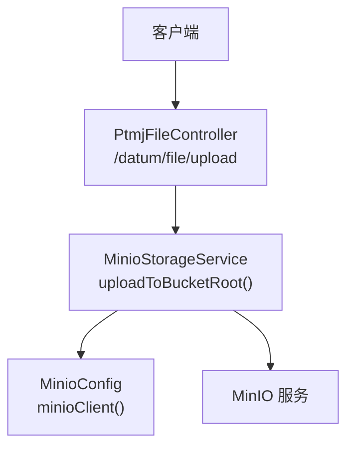
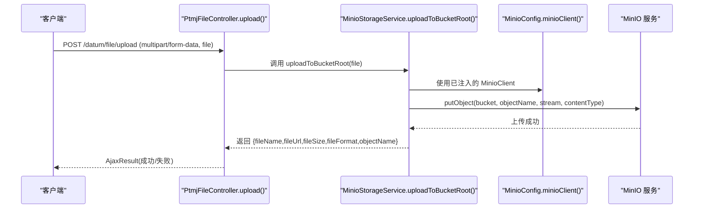
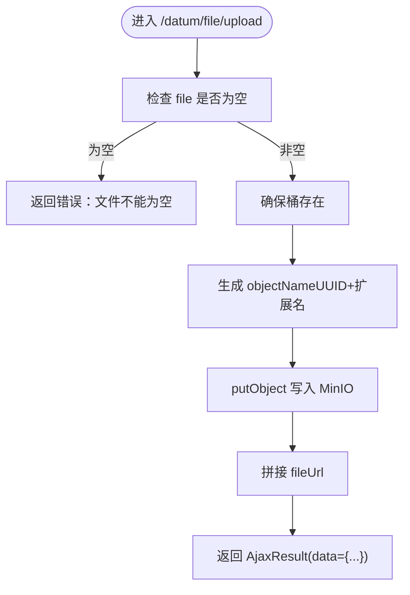
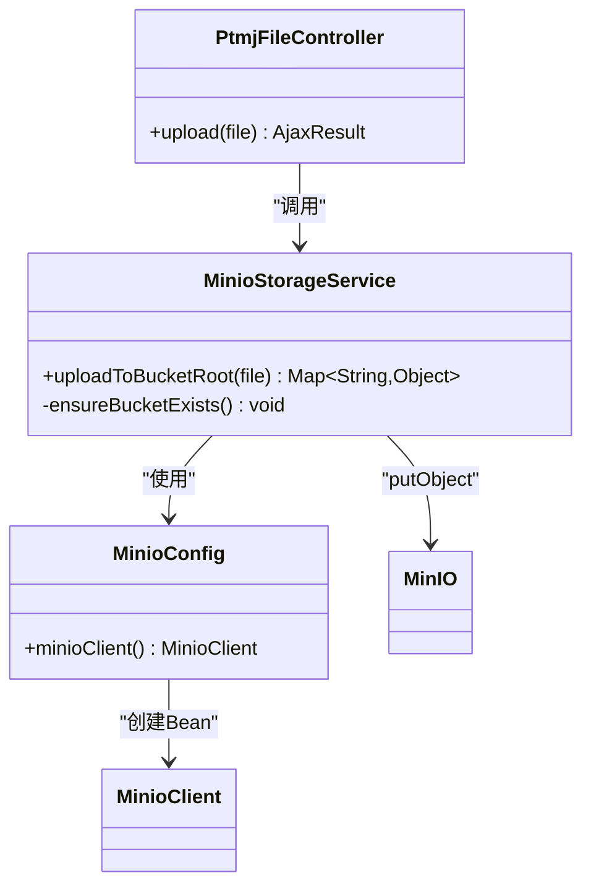

# 文件上传接口

<cite>
**本文引用的文件**   
- [PtmjFileController.java](file://PezMax-Backend/ruoyi-admin/src/main/java/com/ruoyi/web/controller/datum/PtmjFileController.java)
- [MinioStorageService.java](file://PezMax-Backend/ruoyi-common/src/main/java/com/ruoyi/common/utils/file/MinioStorageService.java)
- [MinioConfig.java](file://PezMax-Backend/ruoyi-common/src/main/java/com/ruoyi/common/config/MinioConfig.java)
- [后端接口列表.md](file://后端接口列表.md)
</cite>

## 目录
1. [简介](#简介)
2. [项目结构](#项目结构)
3. [核心组件](#核心组件)
4. [架构总览](#架构总览)
5. [详细组件分析](#详细组件分析)
6. [依赖分析](#依赖分析)
7. [性能考虑](#性能考虑)
8. [故障排查指南](#故障排查指南)
9. [结论](#结论)
10. [附录](#附录)

## 简介
本文件面向“文件上传接口”的对接与实现说明，覆盖：
- 单文件上传接口（POST /datum/file/upload）
- 批量上传接口的现状与建议
- MinIO 对象存储集成方式（桶配置、路径规则、访问权限控制）
- 文件类型验证、大小限制、并发上传处理
- 断点续传与分片上传的高级能力说明
- 完整的请求与响应示例（成功与失败场景）

## 项目结构
本项目为基于 RuoYi 的 Spring Boot 多模块工程。与文件上传相关的关键代码位于：
- 控制器层：PtmjFileController（提供 /datum/file/* 接口）
- 存储层：MinioStorageService（封装 MinIO 客户端操作）
- 配置层：MinioConfig（注入 MinioClient Bean）
- 接口清单：后端接口列表.md（对外暴露的接口约定）

图表来源
- [PtmjFileController.java:74-92](file://PezMax-Backend/ruoyi-admin/src/main/java/com/ruoyi/web/controller/datum/PtmjFileController.java#L74-L92)
- [MinioStorageService.java:35-77](file://PezMax-Backend/ruoyi-common/src/main/java/com/ruoyi/common/utils/file/MinioStorageService.java#L35-L77)
- [MinioConfig.java:20-26](file://PezMax-Backend/ruoyi-common/src/main/java/com/ruoyi/common/config/MinioConfig.java#L20-L26)

章节来源
- [后端接口列表.md:92-106](file://后端接口列表.md#L92-L106)

## 核心组件
- PtmjFileController
  - 提供 /datum/file/upload 单文件上传入口，接收表单字段 file，调用 MinioStorageService 完成上传并返回统一结果。
- MinioStorageService
  - 负责与 MinIO 交互：确保桶存在、生成 objectName、设置 contentType、写入对象、拼接可访问 URL，并返回包含 fileName、fileUrl、fileSize、fileFormat、objectName 的结果集。
- MinioConfig
  - 通过 minio.url、minio.accessKey、minio.secretKey 构建 MinioClient Bean。

章节来源
- [PtmjFileController.java:74-92](file://PezMax-Backend/ruoyi-admin/src/main/java/com/ruoyi/web/controller/datum/PtmjFileController.java#L74-L92)
- [MinioStorageService.java:35-77](file://PezMax-Backend/ruoyi-common/src/main/java/com/ruoyi/common/utils/file/MinioStorageService.java#L35-L77)
- [MinioConfig.java:20-26](file://PezMax-Backend/ruoyi-common/src/main/java/com/ruoyi/common/config/MinioConfig.java#L20-L26)

## 架构总览
下图展示了从客户端到 MinIO 的完整调用链及数据流向。

图表来源
- [PtmjFileController.java:74-92](file://PezMax-Backend/ruoyi-admin/src/main/java/com/ruoyi/web/controller/datum/PtmjFileController.java#L74-L92)
- [MinioStorageService.java:35-77](file://PezMax-Backend/ruoyi-common/src/main/java/com/ruoyi/common/utils/file/MinioStorageService.java#L35-L77)
- [MinioConfig.java:20-26](file://PezMax-Backend/ruoyi-common/src/main/java/com/ruoyi/common/config/MinioConfig.java#L20-L26)

## 详细组件分析

### 单文件上传接口（POST /datum/file/upload）
- 功能
  - 将单个文件上传至 MinIO 指定桶的根目录，返回文件元信息与可访问 URL。
- 鉴权
  - 当前实现未强制登录校验；若需限制，可在控制器上添加权限注解或全局安全策略。
- 请求
  - Content-Type: multipart/form-data
  - 表单字段名：file（必填）
- 响应
  - 统一包装 AjaxResult，data 中包含：
    - fileName：原始文件名
    - fileUrl：可直接访问的 URL（由 minio.url + bucketName + objectName 拼接）
    - fileSize：文件大小（字节）
    - fileFormat：扩展名小写形式
    - objectName：MinIO 中的对象名（UUID 加扩展名）
- 错误处理
  - 当传入文件为空或上传异常时，返回错误消息（包含异常信息）。

图表来源
- [PtmjFileController.java:74-92](file://PezMax-Backend/ruoyi-admin/src/main/java/com/ruoyi/web/controller/datum/PtmjFileController.java#L74-L92)
- [MinioStorageService.java:35-77](file://PezMax-Backend/ruoyi-common/src/main/java/com/ruoyi/common/utils/file/MinioStorageService.java#L35-L77)

章节来源
- [PtmjFileController.java:74-92](file://PezMax-Backend/ruoyi-admin/src/main/java/com/ruoyi/web/controller/datum/PtmjFileController.java#L74-L92)
- [MinioStorageService.java:35-77](file://PezMax-Backend/ruoyi-common/src/main/java/com/ruoyi/common/utils/file/MinioStorageService.java#L35-L77)

### 批量上传接口
- 现状
  - 当前 /datum/file/upload 仅支持单文件上传。
- 建议方案
  - 新增 /datum/file/uploads 接口，接收 files 数组，循环调用 MinioStorageService.uploadToBucketRoot 进行逐个上传，聚合结果后返回。
  - 为保证一致性，建议在事务外逐条记录上传结果，失败项单独标记，整体仍返回成功状态码并附带明细。
  - 前端侧可并行发起多个单文件请求或使用新的批量接口。

章节来源
- [后端接口列表.md:92-106](file://后端接口列表.md#L92-L106)

### MinIO 对象存储集成
- 配置项
  - minio.url：MinIO 服务端点
  - minio.accessKey：访问密钥
  - minio.secretKey：密钥
  - minio.bucketName：目标桶名称（在 MinioStorageService 中注入）
- 初始化
  - MinioConfig 根据上述配置创建 MinioClient Bean。
- 桶策略与访问控制
  - 当前实现自动检测并创建桶（不存在则创建），未显式设置桶策略。
  - 如需公开读取，请在 MinIO 控制台或通过 SDK 设置桶策略为允许匿名 GET；否则需通过签名 URL 或内网访问。
- 对象命名与路径规则
  - objectName 采用 UUID 去横杠 + 扩展名小写，直接置于桶根目录。
  - 原始文件名被保留用于展示，但不会作为对象路径的一部分。
- 访问 URL 构造
  - fileUrl = minio.url（去除尾部斜杠） + "/" + bucketName + "/" + objectName

章节来源
- [MinioConfig.java:10-26](file://PezMax-Backend/ruoyi-common/src/main/java/com/ruoyi/common/config/MinioConfig.java#L10-L26)
- [MinioStorageService.java:27-31](file://PezMax-Backend/ruoyi-common/src/main/java/com/ruoyi/common/utils/file/MinioStorageService.java#L27-L31)
- [MinioStorageService.java:42-76](file://PezMax-Backend/ruoyi-common/src/main/java/com/ruoyi/common/utils/file/MinioStorageService.java#L42-L76)

### 文件类型验证与大小限制
- 现状
  - 当前实现未对文件类型与大小做前置校验，contentType 直接使用客户端提供的值。
- 建议方案
  - 类型白名单：在 MinioStorageService 中增加扩展名校验（如 pdf、docx、xlsx、png、jpg 等）。
  - 大小限制：在 Controller 层或通用过滤器中限制最大文件大小（例如 50MB），避免大文件导致内存压力。
  - 内容探测：结合文件头 Magic Number 校验，防止伪造扩展名。

章节来源
- [MinioStorageService.java:58-66](file://PezMax-Backend/ruoyi-common/src/main/java/com/ruoyi/common/utils/file/MinioStorageService.java#L58-L66)

### 并发上传处理
- 现状
  - 单文件上传为同步阻塞流程；批量上传可通过多线程或异步任务提升吞吐。
- 建议方案
  - 使用线程池执行批量上传，限制并发度以避免打满网络/磁盘 IO。
  - 对每个分片/文件独立捕获异常，汇总成功与失败计数。
  - 结合限流与重试机制，提高稳定性。

章节来源
- [PtmjFileController.java:74-92](file://PezMax-Backend/ruoyi-admin/src/main/java/com/ruoyi/web/controller/datum/PtmjFileController.java#L74-L92)

### 断点续传与分片上传（高级功能）
- 现状
  - 当前未实现分片上传与断点续传。
- 设计建议
  - 分片上传流程：
    - 初始化分片：POST /datum/file/initiate，返回 uploadId
    - 上传分片：POST /datum/file/part，携带 uploadId、partNumber、chunk
    - 合并分片：POST /datum/file/complete，携带 uploadId 与所有 part ETag
    - 取消分片：POST /datum/file/abort
  - 断点续传：
    - 记录本地分片进度（uploadId、已完成 partNumbers）
    - 断线重连后查询未完成分片继续上传
  - 幂等性与一致性：
    - 使用 uploadId 保证会话唯一性
    - 合并前校验各分片完整性（ETag/校验和）
  - 安全与鉴权：
    - 所有分片接口均需鉴权
    - 限制分片大小与总数，防止滥用

[本节为概念性设计，不直接对应具体源码]

## 依赖分析
- 组件耦合
  - PtmjFileController 依赖 MinioStorageService 完成上传
  - MinioStorageService 依赖 MinioConfig 提供的 MinioClient
- 外部依赖
  - MinIO 客户端 SDK（io.minio.*）
  - Spring Web（MultipartFile、@RestController 等）

图表来源
- [PtmjFileController.java:74-92](file://PezMax-Backend/ruoyi-admin/src/main/java/com/ruoyi/web/controller/datum/PtmjFileController.java#L74-L92)
- [MinioStorageService.java:35-86](file://PezMax-Backend/ruoyi-common/src/main/java/com/ruoyi/common/utils/file/MinioStorageService.java#L35-L86)
- [MinioConfig.java:20-26](file://PezMax-Backend/ruoyi-common/src/main/java/com/ruoyi/common/config/MinioConfig.java#L20-L26)

章节来源
- [PtmjFileController.java:74-92](file://PezMax-Backend/ruoyi-admin/src/main/java/com/ruoyi/web/controller/datum/PtmjFileController.java#L74-L92)
- [MinioStorageService.java:35-86](file://PezMax-Backend/ruoyi-common/src/main/java/com/ruoyi/common/utils/file/MinioStorageService.java#L35-L86)
- [MinioConfig.java:20-26](file://PezMax-Backend/ruoyi-common/src/main/java/com/ruoyi/common/config/MinioConfig.java#L20-L26)

## 性能考虑
- 传输优化
  - 合理设置分片大小（建议 5–10MB），平衡重试成本与吞吐
  - 启用连接复用与 HTTP/2（若 MinIO 支持）
- 资源限制
  - 限制单次上传大小与并发数，避免 OOM 或带宽拥塞
- 缓存与命中
  - 对于相同 objectName 的重复上传可做幂等判断（可选）
- 监控与告警
  - 记录上传耗时、失败率、分片数量等指标

[本节为通用指导，不直接分析具体文件]

## 故障排查指南
- 常见问题
  - 文件为空：抛出参数非法异常，返回错误消息
  - 桶不存在：自动创建桶；若创建失败，检查 MinIO 权限与网络连通性
  - 无法访问 fileUrl：确认 MinIO 桶策略是否允许匿名 GET，或改用签名 URL
- 定位步骤
  - 查看 Controller 层异常捕获日志
  - 检查 MinioStorageService 的 ensureBucketExists 与 putObject 调用链路
  - 核对 minio.url、bucketName、accessKey、secretKey 配置是否正确

章节来源
- [PtmjFileController.java:83-91](file://PezMax-Backend/ruoyi-admin/src/main/java/com/ruoyi/web/controller/datum/PtmjFileController.java#L83-L91)
- [MinioStorageService.java:79-86](file://PezMax-Backend/ruoyi-common/src/main/java/com/ruoyi/common/utils/file/MinioStorageService.java#L79-L86)

## 结论
- 当前单文件上传接口已可用，返回标准 AjaxResult 并包含必要元信息
- 批量上传、类型与大小校验、分片与断点续传尚未实现，可按建议逐步完善
- MinIO 集成简洁清晰，建议补充桶策略与访问控制以满足生产安全要求

[本节为总结，不直接分析具体文件]

## 附录

### 接口定义与约定
- 基础路径：/datum/file
- 单文件上传：POST /datum/file/upload
  - 请求体：multipart/form-data，字段名为 file
  - 响应：AjaxResult，data 包含 fileName、fileUrl、fileSize、fileFormat、objectName
- 其他相关接口（参考）
  - 文件列表、树形结构、搜索等见接口清单

章节来源
- [后端接口列表.md:92-106](file://后端接口列表.md#L92-L106)

### 请求与响应示例

- 成功场景
  - 请求
    - 方法：POST
    - 路径：/datum/file/upload
    - Content-Type：multipart/form-data
    - 表单字段：file=xxx.pdf
  - 响应
    - code：200
    - msg：操作成功
    - data：
      - fileName：原始文件名
      - fileUrl：可直接访问的 URL
      - fileSize：文件大小（字节）
      - fileFormat：扩展名小写
      - objectName：MinIO 对象名

- 失败场景
  - 请求
    - 同上，但 file 为空或上传异常
  - 响应
    - code：非 200（如 500）
    - msg：上传失败：具体异常信息
    - data：null 或空对象

[本节为示例说明，不直接分析具体文件]