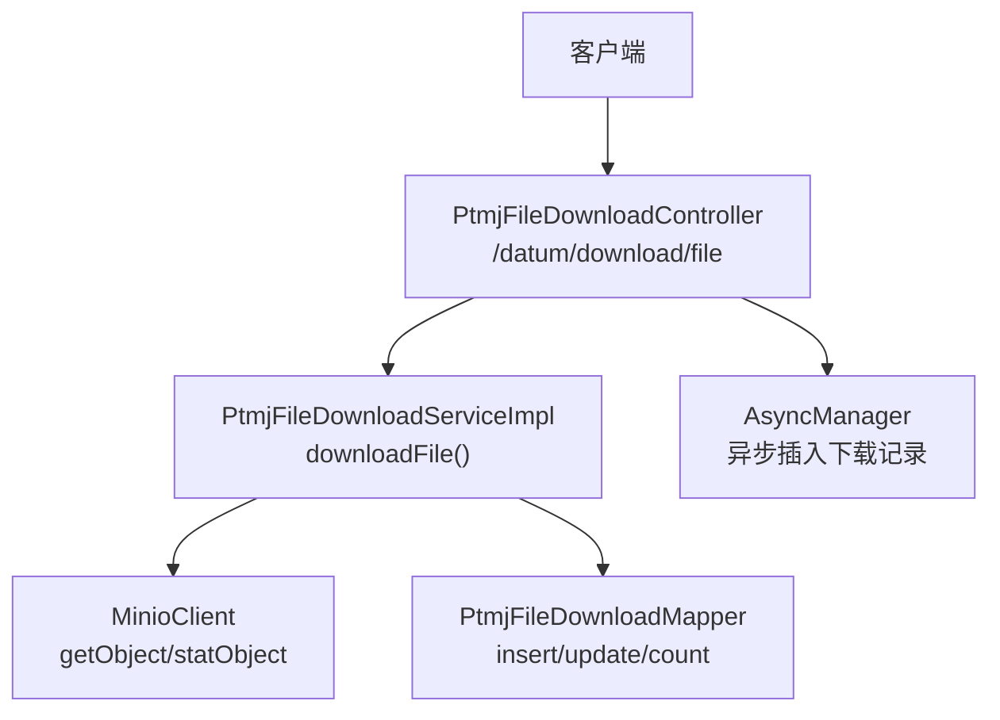
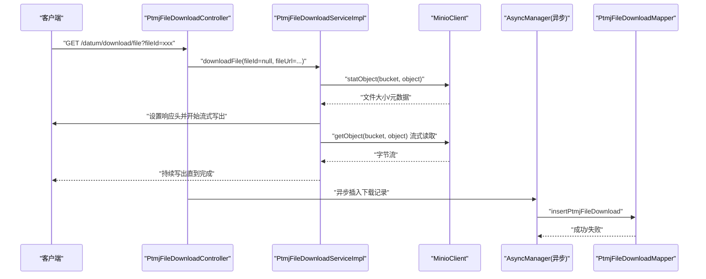
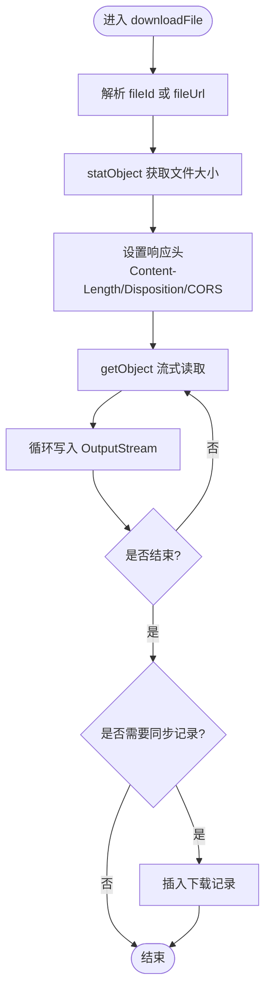
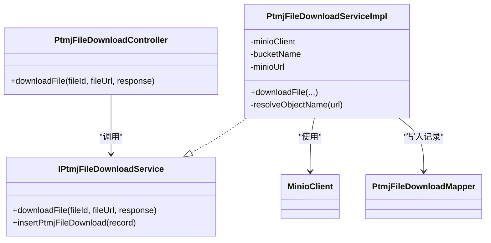

# 文件下载接口

<cite>
**本文引用的文件**   
- [PtmjFileDownloadController.java](file://PezMax-Backend/ruoyi-admin/src/main/java/com/ruoyi/web/controller/datum/PtmjFileDownloadController.java)
- [IPtmjFileDownloadService.java](file://PezMax-Backend/ptmj-datum/src/main/java/com/ptmj/datum/service/IPtmjFileDownloadService.java)
- [PtmjFileDownloadServiceImpl.java](file://PezMax-Backend/ptmj-datum/src/main/java/com/ptmj/datum/service/impl/PtmjFileDownloadServiceImpl.java)
- [PtmjFileDownloadMapper.xml](file://PezMax-Backend/ptmj-datum/src/main/resources/mapper/datum/PtmjFileDownloadMapper.xml)
- [MinioConfig.java](file://PezMax-Backend/ruoyi-common/src/main/java/com/ruoyi/common/config/MinioConfig.java)
- [MinioStorageService.java](file://PezMax-Backend/ruoyi-common/src/main/java/com/ruoyi/common/utils/file/MinioStorageService.java)
- [download.js（Web前端）](file://PezMax-Backend/ruoyi-ui/src/api/datum/download.js)
- [index.vue（桌面端下载页）](file://PezMax-Desktop/src/renderer/views/datum/download/index.vue)
- [后端接口列表.md](file://后端接口列表.md)
</cite>

## 目录
1. [简介](#简介)
2. [项目结构](#项目结构)
3. [核心组件](#核心组件)
4. [架构总览](#架构总览)
5. [详细组件分析](#详细组件分析)
6. [依赖关系分析](#依赖关系分析)
7. [性能与优化](#性能与优化)
8. [安全策略](#安全策略)
9. [客户端集成指南](#客户端集成指南)
10. [API 规范与示例](#api-规范与示例)
11. [错误处理方案](#错误处理方案)
12. [故障排查](#故障排查)
13. [结论](#结论)

## 简介
本文件面向“文件下载”能力，覆盖以下目标：
- 直接下载接口：GET /datum/download/{fileId}（通过统一入口 GET /datum/download/file 支持 fileId 或 fileUrl）
- 流式下载与大文件优化：基于 MinIO 的流式读取、分块写入响应输出流
- 权限验证机制：结合框架安全上下文获取当前用户并记录下载流水
- 访问日志与下载次数统计：异步无感记录下载行为到数据库，提供可见计数查询
- 安全策略：防盗链、临时访问令牌、Referer 校验等建议
- 客户端集成：进度跟踪、断点续传、多线程下载的参考实现思路
- API 调用示例与错误处理方案

## 项目结构
围绕下载能力的后端关键路径如下：
- Controller 层：接收请求、参数解析、异步记录下载流水
- Service 层：解析文件对象名、设置响应头、从 MinIO 流式拉取并写出
- Storage 配置：MinIO 客户端与桶信息
- Mapper 层：下载记录的增删改查 SQL
- 前端：Web 与桌面端调用下载接口的方式

图表来源
- [PtmjFileDownloadController.java:132-183](file://PezMax-Backend/ruoyi-admin/src/main/java/com/ruoyi/web/controller/datum/PtmjFileDownloadController.java#L132-L183)
- [PtmjFileDownloadServiceImpl.java:87-135](file://PezMax-Backend/ptmj-datum/src/main/java/com/ptmj/datum/service/impl/PtmjFileDownloadServiceImpl.java#L87-L135)
- [PtmjFileDownloadMapper.xml:35-55](file://PezMax-Backend/ptmj-datum/src/main/resources/mapper/datum/PtmjFileDownloadMapper.xml#L35-L55)

章节来源
- [PtmjFileDownloadController.java:1-209](file://PezMax-Backend/ruoyi-admin/src/main/java/com/ruoyi/web/controller/datum/PtmjFileDownloadController.java#L1-L209)
- [PtmjFileDownloadServiceImpl.java:1-260](file://PezMax-Backend/ptmj-datum/src/main/java/com/ptmj/datum/service/impl/PtmjFileDownloadServiceImpl.java#L1-L260)
- [PtmjFileDownloadMapper.xml:1-88](file://PezMax-Backend/ptmj-datum/src/main/resources/mapper/datum/PtmjFileDownloadMapper.xml#L1-L88)
- [MinioConfig.java:1-28](file://PezMax-Backend/ruoyi-common/src/main/java/com/ruoyi/common/config/MinioConfig.java#L1-L28)

## 核心组件
- 控制器 PtmjFileDownloadController
  - 暴露下载入口 GET /datum/download/file，支持 fileId 或 fileUrl 二选一
  - 使用框架日志注解记录业务操作
  - 在返回响应后，异步记录下载流水，避免阻塞 IO
- 服务 IPtmjFileDownloadService / PtmjFileDownloadServiceImpl
  - 解析 fileId 或 fileUrl 得到对象名
  - 设置响应头（Content-Length、Content-Disposition、CORS 暴露头）
  - 使用 MinIO 客户端 stat/get 进行元数据与流式读取
  - 可选同步插入下载记录（当传入 fileId 时）
- 存储配置 MinioConfig
  - 注入 MinIO 客户端 Bean，提供 endpoint 与凭据
- 持久化 PtmjFileDownloadMapper.xml
  - 提供下载记录的插入、更新、删除、计数等 SQL

章节来源
- [PtmjFileDownloadController.java:132-183](file://PezMax-Backend/ruoyi-admin/src/main/java/com/ruoyi/web/controller/datum/PtmjFileDownloadController.java#L132-L183)
- [IPtmjFileDownloadService.java:32-39](file://PezMax-Backend/ptmj-datum/src/main/java/com/ptmj/datum/service/IPtmjFileDownloadService.java#L32-L39)
- [PtmjFileDownloadServiceImpl.java:87-135](file://PezMax-Backend/ptmj-datum/src/main/java/com/ptmj/datum/service/impl/PtmjFileDownloadServiceImpl.java#L87-L135)
- [MinioConfig.java:1-28](file://PezMax-Backend/ruoyi-common/src/main/java/com/ruoyi/common/config/MinioConfig.java#L1-L28)
- [PtmjFileDownloadMapper.xml:35-86](file://PezMax-Backend/ptmj-datum/src/main/resources/mapper/datum/PtmjFileDownloadMapper.xml#L35-L86)

## 架构总览
下图展示了从客户端发起下载到服务端落库的完整链路。

图表来源
- [PtmjFileDownloadController.java:132-183](file://PezMax-Backend/ruoyi-admin/src/main/java/com/ruoyi/web/controller/datum/PtmjFileDownloadController.java#L132-L183)
- [PtmjFileDownloadServiceImpl.java:87-135](file://PezMax-Backend/ptmj-datum/src/main/java/com/ptmj/datum/service/impl/PtmjFileDownloadServiceImpl.java#L87-L135)
- [PtmjFileDownloadMapper.xml:35-55](file://PezMax-Backend/ptmj-datum/src/main/resources/mapper/datum/PtmjFileDownloadMapper.xml#L35-L55)

## 详细组件分析

### 控制器：PtmjFileDownloadController
- 职责
  - 统一下载入口：GET /datum/download/file，支持 fileId 或 fileUrl 二选一
  - 若仅传入 fileId，则先解析出实际 fileUrl，再交由服务层执行下载
  - 使用框架日志注解记录业务类型
  - 主线程不等待下载完成，立即触发异步任务记录下载流水
- 关键点
  - 为避免阻塞大文件 IO，Controller 将 fileId 置空传给 Service，由 Service 跳过同步插入逻辑
  - 异步任务中提前捕获当前用户信息，确保子线程可写入下载记录

章节来源
- [PtmjFileDownloadController.java:132-183](file://PezMax-Backend/ruoyi-admin/src/main/java/com/ruoyi/web/controller/datum/PtmjFileDownloadController.java#L132-L183)

### 服务：PtmjFileDownloadServiceImpl
- 职责
  - 解析 fileId 或 fileUrl，确定对象名与文件名
  - 设置响应头：Content-Type、Content-Length、Content-Disposition、CORS 暴露头
  - 使用 MinIO 客户端 stat 获取大小，getObject 流式读取并写入响应输出流
  - 当传入 fileId 时，同步插入下载记录；否则由 Controller 异步插入
- 算法流程（对象名解析）
  - 支持多种 URL 格式：minio://、http(s)://、相对路径等
  - 自动剥离 bucket 前缀，提取对象名

图表来源
- [PtmjFileDownloadServiceImpl.java:87-135](file://PezMax-Backend/ptmj-datum/src/main/java/com/ptmj/datum/service/impl/PtmjFileDownloadServiceImpl.java#L87-L135)
- [PtmjFileDownloadServiceImpl.java:186-258](file://PezMax-Backend/ptmj-datum/src/main/java/com/ptmj/datum/service/impl/PtmjFileDownloadServiceImpl.java#L186-L258)

章节来源
- [PtmjFileDownloadServiceImpl.java:87-135](file://PezMax-Backend/ptmj-datum/src/main/java/com/ptmj/datum/service/impl/PtmjFileDownloadServiceImpl.java#L87-L135)
- [PtmjFileDownloadServiceImpl.java:186-258](file://PezMax-Backend/ptmj-datum/src/main/java/com/ptmj/datum/service/impl/PtmjFileDownloadServiceImpl.java#L186-L258)

### 持久化：PtmjFileDownloadMapper.xml
- 提供下载记录的增删改查与可见计数
- 可见计数用于统计用户未隐藏的下载数量

章节来源
- [PtmjFileDownloadMapper.xml:35-86](file://PezMax-Backend/ptmj-datum/src/main/resources/mapper/datum/PtmjFileDownloadMapper.xml#L35-L86)

### 存储配置：MinioConfig 与 MinioStorageService
- MinioConfig：创建 MinioClient Bean，注入 endpoint 与凭据
- MinioStorageService：上传相关能力（与下载解耦），展示桶存在性检查与对象命名策略

章节来源
- [MinioConfig.java:1-28](file://PezMax-Backend/ruoyi-common/src/main/java/com/ruoyi/common/config/MinioConfig.java#L1-L28)
- [MinioStorageService.java:1-88](file://PezMax-Backend/ruoyi-common/src/main/java/com/ruoyi/common/utils/file/MinioStorageService.java#L1-L88)

## 依赖关系分析
- 控制器依赖服务接口与文件服务（用于 fileId -> fileUrl 解析）
- 服务依赖 MinIO 客户端与 MyBatis Mapper
- 异步记录依赖框架异步管理器与 Spring 容器工具

图表来源
- [PtmjFileDownloadController.java:132-183](file://PezMax-Backend/ruoyi-admin/src/main/java/com/ruoyi/web/controller/datum/PtmjFileDownloadController.java#L132-L183)
- [IPtmjFileDownloadService.java:32-39](file://PezMax-Backend/ptmj-datum/src/main/java/com/ptmj/datum/service/IPtmjFileDownloadService.java#L32-L39)
- [PtmjFileDownloadServiceImpl.java:87-135](file://PezMax-Backend/ptmj-datum/src/main/java/com/ptmj/datum/service/impl/PtmjFileDownloadServiceImpl.java#L87-L135)
- [PtmjFileDownloadMapper.xml:35-55](file://PezMax-Backend/ptmj-datum/src/main/resources/mapper/datum/PtmjFileDownloadMapper.xml#L35-L55)

## 性能与优化
- 流式传输
  - 使用 MinIO getObject 流式读取，配合固定大小缓冲区写入响应输出流，降低内存占用
- 响应头优化
  - 预置 Content-Length，便于浏览器显示进度条
  - 设置 Access-Control-Expose-Headers 允许前端读取长度与文件名
- 异步记录
  - 下载完成后异步插入下载记录，避免阻塞 IO 线程
- 大文件优化建议
  - 启用 HTTP Range 支持以实现断点续传（需扩展 Service 与 Controller）
  - 考虑 CDN 缓存热点小文件，减少源站压力
  - 合理调整 MinIO 连接池与超时参数

[本节为通用指导，无需代码来源]

## 安全策略
- 权限验证
  - 通过框架安全上下文获取当前用户 ID 与用户名，写入下载记录
  - 可在网关或过滤器层增加鉴权拦截
- 防盗链
  - 校验 Referer 白名单（可通过现有 RefererFilter 扩展）
  - 对直链访问增加签名校验
- 临时访问令牌
  - 生成一次性短时效 token，服务端校验后放行下载
  - 将 token 与用户、文件绑定，限制 IP 与时间窗口
- 速率限制与风控
  - 针对同一用户/文件的短时间高频下载进行限流
  - 异常 IP 或 UA 黑名单拦截

[本节为通用指导，无需代码来源]

## 客户端集成指南

### Web 前端（浏览器）
- 基本下载
  - 使用封装的下载方法，传入 fileId 与保存路径、文件名
  - 参考路径：[download.js（Web前端）](file://PezMax-Backend/ruoyi-ui/src/api/datum/download.js)
- 进度跟踪
  - 利用响应头 Content-Length 与 XHR/Axios 的 onDownloadProgress 计算百分比
- 断点续传
  - 浏览器侧通过 Range 请求头发起分段请求，服务端需支持 Range 解析与部分响应
- 多线程下载
  - 浏览器环境不建议多线程并行下载同一文件，易被限流且难以合并

章节来源
- [download.js（Web前端）:46-47](file://PezMax-Backend/ruoyi-ui/src/api/datum/download.js#L46-L47)

### 桌面端（Electron）
- 下载页面调用
  - 构造下载链接并触发下载，参考路径：[index.vue（桌面端下载页）](file://PezMax-Desktop/src/renderer/views/datum/download/index.vue)
- 本地记录
  - 下载完成后将结果写入本地 SQLite，便于管理历史下载

章节来源
- [index.vue（桌面端下载页）:259-276](file://PezMax-Desktop/src/renderer/views/datum/download/index.vue#L259-L276)
- [index.vue（桌面端下载页）:321-322](file://PezMax-Desktop/src/renderer/views/datum/download/index.vue#L321-L322)

## API 规范与示例

### 接口定义
- 下载文件（流式）
  - 方法：GET
  - 路径：/datum/download/file
  - 参数：
    - fileId：Long，可选
    - fileUrl：String，可选（与 fileId 二选一）
  - 响应：二进制流（application/octet-stream）
  - 说明：
    - 若传入 fileId，Controller 会先解析出 fileUrl，再交给 Service 执行下载
    - 下载成功后异步记录下载流水
  - 参考：
    - [PtmjFileDownloadController.java:132-183](file://PezMax-Backend/ruoyi-admin/src/main/java/com/ruoyi/web/controller/datum/PtmjFileDownloadController.java#L132-L183)
    - [后端接口列表.md:116](file://后端接口列表.md#L116)

- 下载列表（分页）
  - 方法：GET
  - 路径：/datum/download/list
  - 说明：分页查询下载记录
  - 参考：
    - [后端接口列表.md:110](file://后端接口列表.md#L110)

- 下载详情
  - 方法：GET
  - 路径：/datum/download/{downloadId}
  - 说明：根据下载记录 ID 查询详情
  - 参考：
    - [后端接口列表.md:112](file://后端接口列表.md#L112)

- 桌面端-隐藏下载记录
  - 方法：DELETE
  - 路径：/datum/desktop/download/{userId}/{fileId}
  - 说明：按用户与文件隐藏对应下载记录
  - 参考：
    - [后端接口列表.md:118](file://后端接口列表.md#L118)

### 调用示例（概念性）
- 浏览器
  - 使用封装函数传入 fileId、保存路径与文件名，触发下载
  - 参考：[download.js（Web前端）:46-47](file://PezMax-Backend/ruoyi-ui/src/api/datum/download.js#L46-L47)
- 桌面端
  - 拼接基础地址与 /datum/download/file?fileId=xxx 并触发下载
  - 参考：[index.vue（桌面端下载页）:259](file://PezMax-Desktop/src/renderer/views/datum/download/index.vue#L259)

章节来源
- [PtmjFileDownloadController.java:132-183](file://PezMax-Backend/ruoyi-admin/src/main/java/com/ruoyi/web/controller/datum/PtmjFileDownloadController.java#L132-L183)
- [后端接口列表.md:110-118](file://后端接口列表.md#L110-L118)
- [download.js（Web前端）:46-47](file://PezMax-Backend/ruoyi-ui/src/api/datum/download.js#L46-L47)
- [index.vue（桌面端下载页）:259](file://PezMax-Desktop/src/renderer/views/datum/download/index.vue#L259)

## 错误处理方案
- 参数校验
  - 未传入 fileId 或 fileUrl：抛出非法参数异常
  - fileId 不存在或文件地址为空：抛出非法参数异常
  - 参考：
    - [PtmjFileDownloadServiceImpl.java:186-209](file://PezMax-Backend/ptmj-datum/src/main/java/com/ptmj/datum/service/impl/PtmjFileDownloadServiceImpl.java#L186-L209)
- 存储访问异常
  - MinIO 不可用或对象不存在：应捕获并返回友好错误码
  - 建议在 Service 层统一包装异常，由全局异常处理器返回标准错误体
- 异步记录失败
  - 异步插入下载记录失败不影响下载，仅记录错误日志
  - 参考：
    - [PtmjFileDownloadController.java:159-181](file://PezMax-Backend/ruoyi-admin/src/main/java/com/ruoyi/web/controller/datum/PtmjFileDownloadController.java#L159-L181)

章节来源
- [PtmjFileDownloadServiceImpl.java:186-209](file://PezMax-Backend/ptmj-datum/src/main/java/com/ptmj/datum/service/impl/PtmjFileDownloadServiceImpl.java#L186-L209)
- [PtmjFileDownloadController.java:159-181](file://PezMax-Backend/ruoyi-admin/src/main/java/com/ruoyi/web/controller/datum/PtmjFileDownloadController.java#L159-L181)

## 故障排查
- 无法下载或文件名乱码
  - 检查 Content-Disposition 编码是否正确
  - 确认浏览器对中文文件名的兼容性
- 进度条不显示
  - 确认响应头 Content-Length 已正确设置
  - 确认前端监听下载进度事件
- 下载记录未写入
  - 检查异步任务是否执行成功
  - 查看应用日志中的异步插入错误信息
- 跨域问题
  - 确认 Access-Control-Expose-Headers 包含 Content-Length 与 Content-Disposition

[本节为通用指导，无需代码来源]

## 结论
- 当前下载接口采用流式传输与异步记录，兼顾性能与可观测性
- 通过统一的 /datum/download/file 入口，灵活支持 fileId 与 fileUrl 两种模式
- 后续可扩展 Range 支持以完善断点续传，并结合安全策略增强防盗链与临时令牌能力

[本节为总结性内容，无需代码来源]