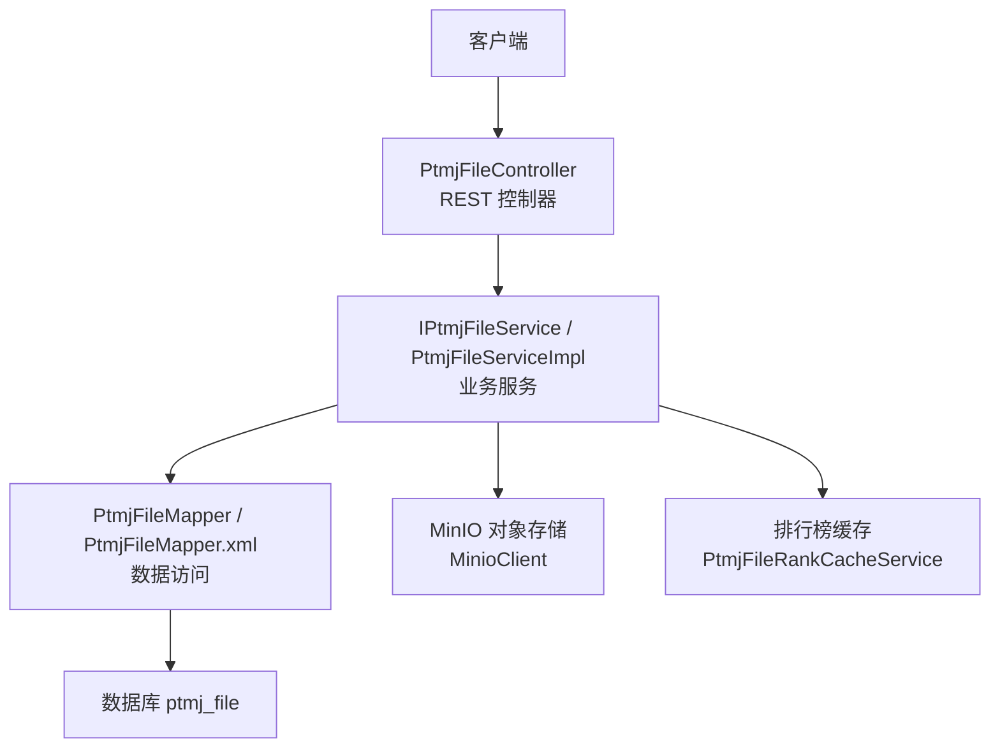
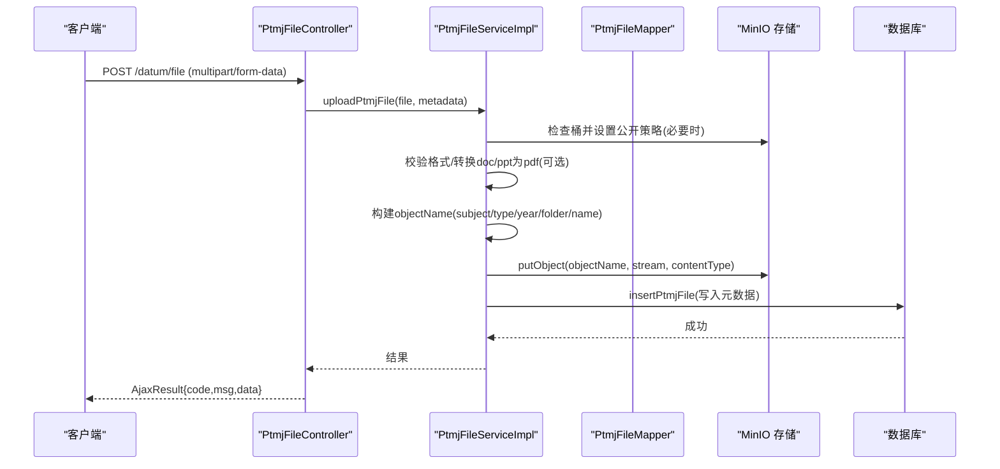
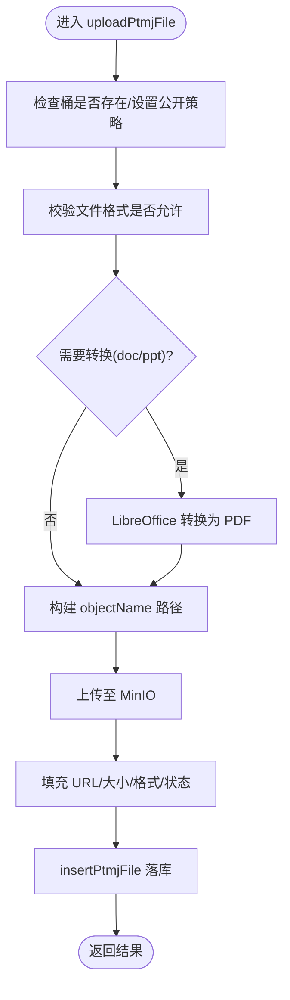
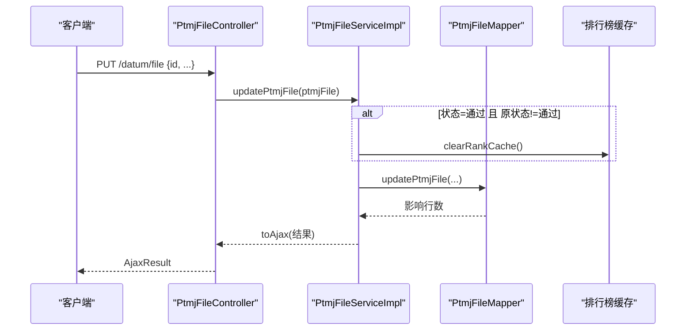
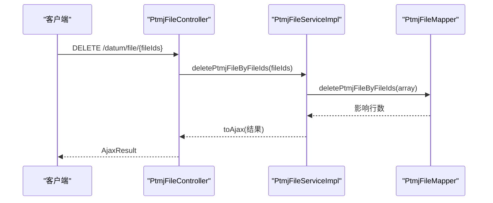
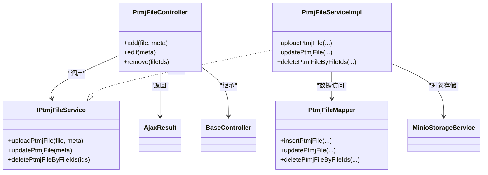

# 文件操作接口

<cite>
**本文引用的文件**   
- [PtmjFileController.java](file://PezMax-Backend/ruoyi-admin/src/main/java/com/ruoyi/web/controller/datum/PtmjFileController.java)
- [IPtmjFileService.java](file://PezMax-Backend/ptmj-datum/src/main/java/com/ptmj/datum/service/IPtmjFileService.java)
- [PtmjFileServiceImpl.java](file://PezMax-Backend/ptmj-datum/src/main/java/com/ptmj/datum/service/impl/PtmjFileServiceImpl.java)
- [PtmjFileMapper.java](file://PezMax-Backend/ptmj-datum/src/main/java/com/ptmj/datum/mapper/PtmjFileMapper.java)
- [PtmjFileMapper.xml](file://PezMax-Backend/ptmj-datum/src/main/resources/mapper/datum/PtmjFileMapper.xml)
- [PtmjFile.java](file://PezMax-Backend/ptmj-datum/src/main/java/com/ptmj/datum/domain/PtmjFile.java)
- [MinioStorageService.java](file://PezMax-Backend/ruoyi-common/src/main/java/com/ruoyi/common/utils/file/MinioStorageService.java)
- [AjaxResult.java](file://PezMax-Backend/ruoyi-common/src/main/java/com/ruoyi/common/core/domain/AjaxResult.java)
- [BaseController.java](file://PezMax-Backend/ruoyi-common/src/main/java/com/ruoyi/common/core/controller/BaseController.java)
</cite>

## 目录
1. [简介](#简介)
2. [项目结构](#项目结构)
3. [核心组件](#核心组件)
4. [架构总览](#架构总览)
5. [详细组件分析](#详细组件分析)
6. [依赖关系分析](#依赖关系分析)
7. [性能与扩展性](#性能与扩展性)
8. [故障排查指南](#故障排查指南)
9. [结论](#结论)
10. [附录：接口规范与示例](#附录接口规范与示例)

## 简介
本文件面向“文件操作接口”的完整文档，覆盖以下能力：
- 文件新增（POST /datum/file）
- 文件修改（PUT /datum/file）
- 文件删除（DELETE /datum/file/{fileIds}）
- 文件状态管理、版本控制、审核流程的业务逻辑说明
- 文件移动、复制、重命名等高级操作的实现机制建议
- 批量操作、事务处理、异常回滚的技术方案
- 文件元数据管理、标签系统、分类管理的接口规范建议
- 完整的请求响应示例与错误码说明

## 项目结构
后端采用分层架构：Controller 层暴露 REST 接口，Service 层承载业务逻辑，Mapper 层负责数据访问。对象模型使用领域实体 PtmjFile，持久化通过 MyBatis XML 映射。文件存储采用 MinIO 对象存储，支持上传、转换与公开访问策略。

图示来源
- [PtmjFileController.java:58-273](file://PezMax-Backend/ruoyi-admin/src/main/java/com/ruoyi/web/controller/datum/PtmjFileController.java#L58-L273)
- [IPtmjFileService.java:16-119](file://PezMax-Backend/ptmj-datum/src/main/java/com/ptmj/datum/service/IPtmjFileService.java#L16-L119)
- [PtmjFileServiceImpl.java:55-604](file://PezMax-Backend/ptmj-datum/src/main/java/com/ptmj/datum/service/impl/PtmjFileServiceImpl.java#L55-L604)
- [PtmjFileMapper.java:18-111](file://PezMax-Backend/ptmj-datum/src/main/java/com/ptmj/datum/mapper/PtmjFileMapper.java#L18-L111)
- [PtmjFileMapper.xml:1-200](file://PezMax-Backend/ptmj-datum/src/main/resources/mapper/datum/PtmjFileMapper.xml#L1-L200)

章节来源
- [PtmjFileController.java:58-273](file://PezMax-Backend/ruoyi-admin/src/main/java/com/ruoyi/web/controller/datum/PtmjFileController.java#L58-L273)
- [PtmjFileServiceImpl.java:55-604](file://PezMax-Backend/ptmj-datum/src/main/java/com/ptmj/datum/service/impl/PtmjFileServiceImpl.java#L55-L604)
- [PtmjFileMapper.xml:1-200](file://PezMax-Backend/ptmj-datum/src/main/resources/mapper/datum/PtmjFileMapper.xml#L1-L200)

## 核心组件
- 控制器：提供文件增删改查、树形结构、联想推荐、导出、搜索等接口
- 服务：封装上传、转换、路径构建、状态变更、缓存清理等核心逻辑
- 数据访问：MyBatis 接口与 XML 映射，支持条件查询、模糊匹配、排序与分页
- 对象模型：PtmjFile 包含文件标识、元数据、审核状态、删除标记等字段
- 存储：MinIO 桶策略、对象上传、公开访问 URL 生成
- 工具：统一返回 AjaxResult、分页 TableDataInfo、日志注解等

章节来源
- [PtmjFileController.java:58-273](file://PezMax-Backend/ruoyi-admin/src/main/java/com/ruoyi/web/controller/datum/PtmjFileController.java#L58-L273)
- [IPtmjFileService.java:16-119](file://PezMax-Backend/ptmj-datum/src/main/java/com/ptmj/datum/service/IPtmjFileService.java#L16-L119)
- [PtmjFileServiceImpl.java:55-604](file://PezMax-Backend/ptmj-datum/src/main/java/com/ptmj/datum/service/impl/PtmjFileServiceImpl.java#L55-L604)
- [PtmjFile.java:16-224](file://PezMax-Backend/ptmj-datum/src/main/java/com/ptmj/datum/domain/PtmjFile.java#L16-L224)
- [MinioStorageService.java](file://PezMax-Backend/ruoyi-common/src/main/java/com/ruoyi/common/utils/file/MinioStorageService.java)
- [AjaxResult.java](file://PezMax-Backend/ruoyi-common/src/main/java/com/ruoyi/common/core/domain/AjaxResult.java)
- [BaseController.java](file://PezMax-Backend/ruoyi-common/src/main/java/com/ruoyi/common/core/controller/BaseController.java)

## 架构总览
下图展示从 HTTP 请求到存储与数据库的端到端调用链，以及关键分支（如格式转换、权限校验、缓存清理）。

图示来源
- [PtmjFileController.java:186-192](file://PezMax-Backend/ruoyi-admin/src/main/java/com/ruoyi/web/controller/datum/PtmjFileController.java#L186-L192)
- [PtmjFileServiceImpl.java:388-556](file://PezMax-Backend/ptmj-datum/src/main/java/com/ptmj/datum/service/impl/PtmjFileServiceImpl.java#L388-L556)
- [PtmjFileMapper.xml:96-136](file://PezMax-Backend/ptmj-datum/src/main/resources/mapper/datum/PtmjFileMapper.xml#L96-L136)

## 详细组件分析

### 文件新增接口（POST /datum/file）
- 功能概述
  - 接收 multipart/form-data，包含文件流与文件元数据（名称、类型、年份、科目、学校、自定义目录等）
  - 自动校验允许格式；对 doc/docx/ppt/pptx 进行 PDF 转换
  - 构建对象存储路径 subject/type/year/[folder]/name.ext
  - 写入 MinIO 后落库元数据，默认状态为未审核
- 关键参数
  - file：MultipartFile
  - fileName、fileType、fileYear、fileSubject、fileSchool、remark（用作自定义目录）
- 返回
  - AjaxResult，包含 code、msg、data（可为空或返回部分信息）
- 事务与回滚
  - 方法标注事务，任何异常将回滚数据库写入
- 注意事项
  - LibreOffice 需启动且配置正确，否则转换失败
  - 若前端传入的 fileName 缺少扩展名，会自动补全

图示来源
- [PtmjFileServiceImpl.java:388-556](file://PezMax-Backend/ptmj-datum/src/main/java/com/ptmj/datum/service/impl/PtmjFileServiceImpl.java#L388-L556)
- [PtmjFileMapper.xml:96-136](file://PezMax-Backend/ptmj-datum/src/main/resources/mapper/datum/PtmjFileMapper.xml#L96-L136)

章节来源
- [PtmjFileController.java:186-192](file://PezMax-Backend/ruoyi-admin/src/main/java/com/ruoyi/web/controller/datum/PtmjFileController.java#L186-L192)
- [PtmjFileServiceImpl.java:388-556](file://PezMax-Backend/ptmj-datum/src/main/java/com/ptmj/datum/service/impl/PtmjFileServiceImpl.java#L388-L556)
- [PtmjFileMapper.xml:96-136](file://PezMax-Backend/ptmj-datum/src/main/resources/mapper/datum/PtmjFileMapper.xml#L96-L136)

### 文件修改接口（PUT /datum/file）
- 功能概述
  - 更新文件元数据（名称、类型、年份、科目、学校、备注等）
  - 当状态变更为“通过”时，触发排行榜缓存清理
- 事务与回滚
  - 方法标注事务，异常将回滚
- 注意
  - 仅更新传入字段，未传字段不变更

图示来源
- [PtmjFileController.java:221-226](file://PezMax-Backend/ruoyi-admin/src/main/java/com/ruoyi/web/controller/datum/PtmjFileController.java#L221-L226)
- [PtmjFileServiceImpl.java:564-578](file://PezMax-Backend/ptmj-datum/src/main/java/com/ptmj/datum/service/impl/PtmjFileServiceImpl.java#L564-L578)
- [PtmjFileMapper.xml:138-160](file://PezMax-Backend/ptmj-datum/src/main/resources/mapper/datum/PtmjFileMapper.xml#L138-L160)

章节来源
- [PtmjFileController.java:221-226](file://PezMax-Backend/ruoyi-admin/src/main/java/com/ruoyi/web/controller/datum/PtmjFileController.java#L221-L226)
- [PtmjFileServiceImpl.java:564-578](file://PezMax-Backend/ptmj-datum/src/main/java/com/ptmj/datum/service/impl/PtmjFileServiceImpl.java#L564-L578)
- [PtmjFileMapper.xml:138-160](file://PezMax-Backend/ptmj-datum/src/main/resources/mapper/datum/PtmjFileMapper.xml#L138-L160)

### 文件删除接口（DELETE /datum/file/{fileIds}）
- 功能概述
  - 根据主键数组批量删除记录
- 事务与回滚
  - 当前实现直接调用批量删除，如需与对象存储同步删除，应在服务层增加事务包裹与异常回滚
- 注意
  - 当前 SQL 为物理删除，如需软删除可改为更新 del_flag

图示来源
- [PtmjFileController.java:232-237](file://PezMax-Backend/ruoyi-admin/src/main/java/com/ruoyi/web/controller/datum/PtmjFileController.java#L232-L237)
- [PtmjFileServiceImpl.java:586-590](file://PezMax-Backend/ptmj-datum/src/main/java/com/ptmj/datum/service/impl/PtmjFileServiceImpl.java#L586-L590)
- [PtmjFileMapper.xml:166-171](file://PezMax-Backend/ptmj-datum/src/main/resources/mapper/datum/PtmjFileMapper.xml#L166-L171)

章节来源
- [PtmjFileController.java:232-237](file://PezMax-Backend/ruoyi-admin/src/main/java/com/ruoyi/web/controller/datum/PtmjFileController.java#L232-L237)
- [PtmjFileServiceImpl.java:586-590](file://PezMax-Backend/ptmj-datum/src/main/java/com/ptmj/datum/service/impl/PtmjFileServiceImpl.java#L586-L590)
- [PtmjFileMapper.xml:166-171](file://PezMax-Backend/ptmj-datum/src/main/resources/mapper/datum/PtmjFileMapper.xml#L166-L171)

### 文件状态管理与审核流程
- 状态定义
  - 0：未审核
  - 1：通过
  - 2：未通过
  - 3：被举报
- 审核流程建议
  - 新增默认状态为未审核
  - 管理员审核通过后更新状态为通过，并触发排行榜缓存清理
  - 未通过或被举报的文件在列表与搜索中应过滤不可见
- 相关实现
  - 新增时默认状态为 0
  - 修改时若由非通过变为通过，则清理排行榜缓存

章节来源
- [PtmjFile.java:62-64](file://PezMax-Backend/ptmj-datum/src/main/java/com/ptmj/datum/domain/PtmjFile.java#L62-L64)
- [PtmjFileServiceImpl.java:564-578](file://PezMax-Backend/ptmj-datum/src/main/java/com/ptmj/datum/service/impl/PtmjFileServiceImpl.java#L564-L578)
- [PtmjFileMapper.xml:174-192](file://PezMax-Backend/ptmj-datum/src/main/resources/mapper/datum/PtmjFileMapper.xml#L174-L192)

### 版本控制
- 现状
  - 当前模型无显式版本号字段，同一文件多次上传会生成多条记录
- 建议方案
  - 引入 version 字段，配合唯一约束（例如：fileName + fileType + fileYear + fileSubject + version）
  - 新增时按规则递增 version；修改时可选择追加新版本或原地更新
  - 对外提供“最新版本”查询视图或接口

[本节为概念性建议，无需源码引用]

### 文件移动、复制、重命名
- 移动
  - 更新 remark（自定义目录）、subject/type/year 等元数据，保持旧路径兼容
  - 若需迁移对象存储路径，应先复制新路径对象，再删除旧对象，最后更新元数据
- 复制
  - 读取原对象内容，以新文件名与新路径写入对象存储，插入新记录
- 重命名
  - 仅更新 fileName 与 objectName（URL），并在对象存储中执行 rename（复制+删除）
- 事务与一致性
  - 上述操作涉及对象存储与数据库双写，建议使用事务边界与补偿机制保证一致性

[本节为概念性建议，无需源码引用]

### 批量操作、事务处理、异常回滚
- 批量删除
  - 已支持按 ID 数组批量删除
- 事务
  - 新增与修改方法已标注事务，异常将回滚
- 建议
  - 批量移动/复制/重命名建议拆分为子任务，结合消息队列与重试机制
  - 对对象存储与数据库的双写，建议引入幂等键与补偿任务

章节来源
- [PtmjFileServiceImpl.java:388-390](file://PezMax-Backend/ptmj-datum/src/main/java/com/ptmj/datum/service/impl/PtmjFileServiceImpl.java#L388-L390)
- [PtmjFileServiceImpl.java:564-566](file://PezMax-Backend/ptmj-datum/src/main/java/com/ptmj/datum/service/impl/PtmjFileServiceImpl.java#L564-L566)
- [PtmjFileMapper.xml:166-171](file://PezMax-Backend/ptmj-datum/src/main/resources/mapper/datum/PtmjFileMapper.xml#L166-L171)

### 文件元数据、标签、分类管理
- 现有元数据
  - 名称、URL、大小、格式、年份、类型、学校、科目、审核人、状态、删除标记、备注（用于自定义目录）
- 标签系统建议
  - 新增标签表与文件-标签关联表，提供标签 CRUD 与按标签检索接口
- 分类管理建议
  - 复用 fileType 与 type-map 配置，支持动态扩展分类映射
  - 可在 remark 中维护多级目录，形成灵活分类体系

章节来源
- [PtmjFile.java:20-67](file://PezMax-Backend/ptmj-datum/src/main/java/com/ptmj/datum/domain/PtmjFile.java#L20-L67)
- [PtmjFileServiceImpl.java:132-148](file://PezMax-Backend/ptmj-datum/src/main/java/com/ptmj/datum/service/impl/PtmjFileServiceImpl.java#L132-L148)
- [PtmjFileServiceImpl.java:463-498](file://PezMax-Backend/ptmj-datum/src/main/java/com/ptmj/datum/service/impl/PtmjFileServiceImpl.java#L463-L498)

## 依赖关系分析
- 控制器依赖服务接口
- 服务依赖 Mapper 与外部存储（MinIO）、缓存服务
- Mapper 依赖 XML 映射与数据库
- 工具类提供统一返回与基础能力

图示来源
- [PtmjFileController.java:58-273](file://PezMax-Backend/ruoyi-admin/src/main/java/com/ruoyi/web/controller/datum/PtmjFileController.java#L58-L273)
- [IPtmjFileService.java:16-119](file://PezMax-Backend/ptmj-datum/src/main/java/com/ptmj/datum/service/IPtmjFileService.java#L16-L119)
- [PtmjFileServiceImpl.java:55-604](file://PezMax-Backend/ptmj-datum/src/main/java/com/ptmj/datum/service/impl/PtmjFileServiceImpl.java#L55-L604)
- [PtmjFileMapper.java:18-111](file://PezMax-Backend/ptmj-datum/src/main/java/com/ptmj/datum/mapper/PtmjFileMapper.java#L18-L111)
- [MinioStorageService.java](file://PezMax-Backend/ruoyi-common/src/main/java/com/ruoyi/common/utils/file/MinioStorageService.java)
- [AjaxResult.java](file://PezMax-Backend/ruoyi-common/src/main/java/com/ruoyi/common/core/domain/AjaxResult.java)
- [BaseController.java](file://PezMax-Backend/ruoyi-common/src/main/java/com/ruoyi/common/core/controller/BaseController.java)

章节来源
- [PtmjFileController.java:58-273](file://PezMax-Backend/ruoyi-admin/src/main/java/com/ruoyi/web/controller/datum/PtmjFileController.java#L58-L273)
- [PtmjFileServiceImpl.java:55-604](file://PezMax-Backend/ptmj-datum/src/main/java/com/ptmj/datum/service/impl/PtmjFileServiceImpl.java#L55-L604)

## 性能与扩展性
- 上传性能
  - 大文件建议分片上传与断点续传（服务端可扩展）
  - 转换过程耗时较长，建议异步化与进度回调
- 存储路径
  - 合理划分 subject/type/year/folder 层级，避免单目录过大
- 缓存
  - 排行榜缓存随审核状态变化而清理，避免脏读
- 并发与限流
  - 可增加重复提交拦截与速率限制，防止恶意上传

[本节为通用建议，无需源码引用]

## 故障排查指南
- 上传失败
  - 检查 MinIO 桶是否存在及策略是否正确
  - 检查允许格式配置与文件大小限制
- 转换失败
  - 确认 LibreOffice 服务已启动且 office-home 配置正确
  - 查看临时文件是否成功创建与删除
- 列表/搜索为空
  - 确认文件状态为“通过”，关键词匹配范围包括学校、科目、文件名
- 删除无效
  - 确认传入的 fileIds 有效且未被其他逻辑占用

章节来源
- [PtmjFileServiceImpl.java:388-556](file://PezMax-Backend/ptmj-datum/src/main/java/com/ptmj/datum/service/impl/PtmjFileServiceImpl.java#L388-L556)
- [PtmjFileMapper.xml:174-192](file://PezMax-Backend/ptmj-datum/src/main/resources/mapper/datum/PtmjFileMapper.xml#L174-L192)

## 结论
文件操作接口已具备完善的增删改能力，支持格式转换与公开访问策略，具备基本的状态管理与缓存联动。后续可在版本控制、标签与分类、批量高级操作等方面进一步增强，以提升系统的可用性与可维护性。

[本节为总结，无需源码引用]

## 附录：接口规范与示例

### 公共约定
- 统一返回体：AjaxResult
  - code：整数状态码
  - msg：提示信息
  - data：业务数据（可为空）
- 分页：TableDataInfo（列表接口）
- 鉴权：部分接口已开放匿名访问，敏感接口可按需启用权限注解

章节来源
- [AjaxResult.java](file://PezMax-Backend/ruoyi-common/src/main/java/com/ruoyi/common/core/domain/AjaxResult.java)
- [PtmjFileController.java:98-105](file://PezMax-Backend/ruoyi-admin/src/main/java/com/ruoyi/web/controller/datum/PtmjFileController.java#L98-L105)

### 新增文件（POST /datum/file）
- 请求头
  - Content-Type: multipart/form-data
- 表单字段
  - file：二进制文件
  - fileName：显示名称（可选，缺失时取原始文件名）
  - fileType：文件类型（必填）
  - fileYear：年份（可选，越界时回退默认）
  - fileSubject：科目（可选）
  - fileSchool：学校（可选）
  - remark：自定义目录（可选，支持多级，使用 / 分隔）
- 响应
  - AjaxResult，data 可为空或包含部分信息

示例请求（示意）
- 表单字段：file=[二进制], fileType=1, fileYear=2024, fileSubject=高等数学, fileSchool=齐鲁工业大学, remark=期末/第一章
- 响应示例（示意）
  - { "code": 200, "msg": "操作成功", "data": null }

章节来源
- [PtmjFileController.java:186-192](file://PezMax-Backend/ruoyi-admin/src/main/java/com/ruoyi/web/controller/datum/PtmjFileController.java#L186-L192)
- [PtmjFileServiceImpl.java:388-556](file://PezMax-Backend/ptmj-datum/src/main/java/com/ptmj/datum/service/impl/PtmjFileServiceImpl.java#L388-L556)

### 修改文件（PUT /datum/file）
- 请求体
  - JSON：包含 fileId 与待更新字段
- 响应
  - AjaxResult

示例请求（示意）
- { "fileId": 123, "fileStatus": 1 }
- 响应示例（示意）
  - { "code": 200, "msg": "操作成功", "data": null }

章节来源
- [PtmjFileController.java:221-226](file://PezMax-Backend/ruoyi-admin/src/main/java/com/ruoyi/web/controller/datum/PtmjFileController.java#L221-L226)
- [PtmjFileServiceImpl.java:564-578](file://PezMax-Backend/ptmj-datum/src/main/java/com/ptmj/datum/service/impl/PtmjFileServiceImpl.java#L564-L578)

### 删除文件（DELETE /datum/file/{fileIds}）
- 路径参数
  - fileIds：长整型数组（多个 ID 以逗号分隔或由框架解析）
- 响应
  - AjaxResult

示例请求（示意）
- DELETE /datum/file/1,2,3
- 响应示例（示意）
  - { "code": 200, "msg": "操作成功", "data": null }

章节来源
- [PtmjFileController.java:232-237](file://PezMax-Backend/ruoyi-admin/src/main/java/com/ruoyi/web/controller/datum/PtmjFileController.java#L232-L237)
- [PtmjFileServiceImpl.java:586-590](file://PezMax-Backend/ptmj-datum/src/main/java/com/ptmj/datum/service/impl/PtmjFileServiceImpl.java#L586-L590)

### 错误码说明（建议）
- 200：成功
- 400：参数错误或格式不支持
- 401：未登录或令牌失效
- 403：无权限
- 500：服务器内部错误（如转换失败、存储异常）
- 业务错误：由 AjaxResult.msg 描述具体原因

[本节为通用约定，无需源码引用]

### 文件模型（PtmjFile）关键字段
- fileId：主键
- userId：上传者
- fileName：文件名
- fileUrl：访问地址
- fileSize：大小
- fileFormat：格式
- fileYear：年份
- fileType：类型
- fileSchool：学校
- fileSubject：科目
- reviewer：审核人
- fileStatus：状态
- delFlag：删除标记
- remark：备注（用于自定义目录）

章节来源
- [PtmjFile.java:20-67](file://PezMax-Backend/ptmj-datum/src/main/java/com/ptmj/datum/domain/PtmjFile.java#L20-L67)