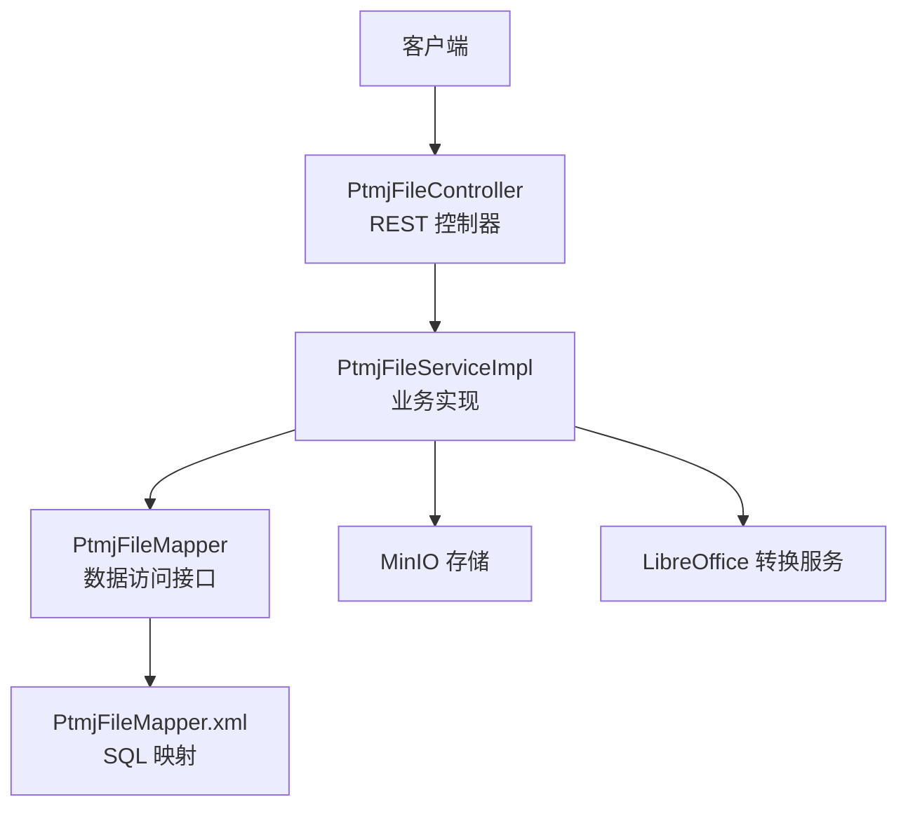
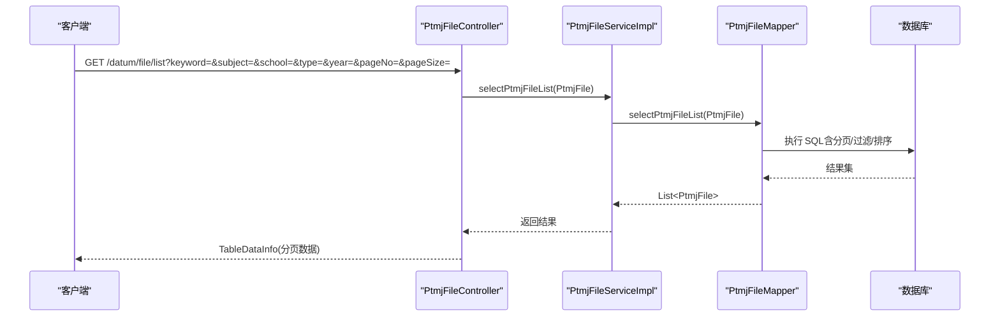
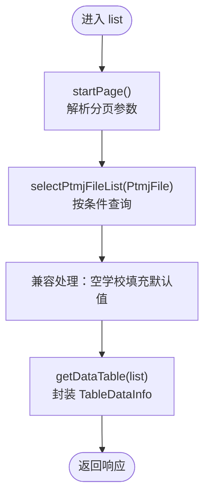
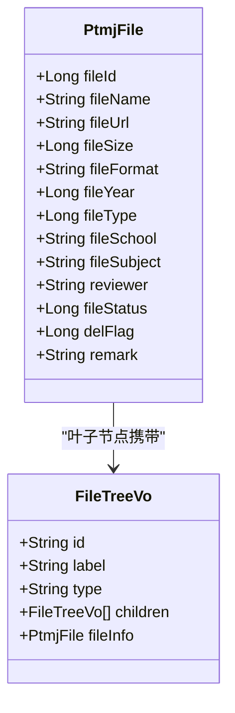
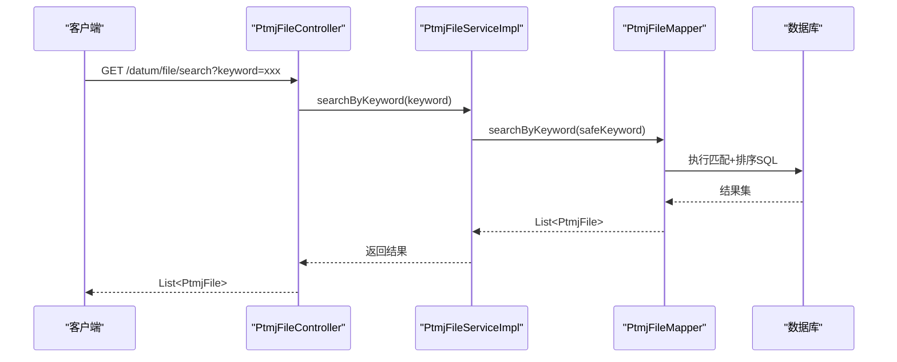
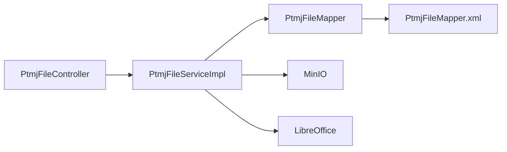

# 文件查询接口

<cite>
**本文引用的文件**   
- [PtmjFileController.java](file://PezMax-Backend/ruoyi-admin/src/main/java/com/ruoyi/web/controller/datum/PtmjFileController.java)
- [PtmjFileServiceImpl.java](file://PezMax-Backend/ptmj-datum/src/main/java/com/ptmj/datum/service/impl/PtmjFileServiceImpl.java)
- [PtmjFileMapper.java](file://PezMax-Backend/ptmj-datum/src/main/java/com/ptmj/datum/mapper/PtmjFileMapper.java)
- [PtmjFileMapper.xml](file://PezMax-Backend/ptmj-datum/src/main/resources/mapper/datum/PtmjFileMapper.xml)
- [PtmjFile.java](file://PezMax-Backend/ptmj-datum/src/main/java/com/ptmj/datum/domain/PtmjFile.java)
- [FileTreeVo.java](file://PezMax-Backend/ptmj-datum/src/main/java/com/ptmj/datum/domain/vo/FileTreeVo.java)
- [SubjectSuggestionVo.java](file://PezMax-Backend/ptmj-datum/src/main/java/com/ptmj/datum/domain/vo/SubjectSuggestionVo.java)
- [SchoolSuggestionVo.java](file://PezMax-Backend/ptmj-datum/src/main/java/com/ptmj/datum/domain/vo/SchoolSuggestionVo.java)
- [BaseController.java](file://PezMax-Backend/ruoyi-common/src/main/java/com/ruoyi/common/core/controller/BaseController.java)
- [TableDataInfo.java](file://PezMax-Backend/ruoyi-common/src/main/java/com/ruoyi/common/core/page/TableDataInfo.java)
</cite>

## 目录
1. [简介](#简介)
2. [项目结构](#项目结构)
3. [核心组件](#核心组件)
4. [架构总览](#架构总览)
5. [详细组件分析](#详细组件分析)
6. [依赖分析](#依赖分析)
7. [性能考虑](#性能考虑)
8. [故障排查指南](#故障排查指南)
9. [结论](#结论)
10. [附录：API 规范与示例](#附录api-规范与示例)

## 简介
本文件面向“文件查询”相关能力，覆盖以下接口与功能：
- 文件列表查询（GET /datum/file/list）：分页、条件过滤、排序
- 文件树形结构查询（GET /datum/file/tree）：实现原理与数据结构
- 关键词搜索（GET /datum/file/search）：全文检索算法与优化策略
- 学科联想推荐（GET /datum/file/subjects）与学校联想推荐（GET /datum/file/schools）
- 文件详情获取、批量删除、导出等完整 API 规范与使用示例

## 项目结构
后端采用分层架构：Controller 层暴露 REST 接口，Service 层封装业务逻辑，Mapper 层对接数据库。通用分页与响应封装来自公共模块。

图表来源
- [PtmjFileController.java:58-119](file://PezMax-Backend/ruoyi-admin/src/main/java/com/ruoyi/web/controller/datum/PtmjFileController.java#L58-L119)
- [PtmjFileServiceImpl.java:55-77](file://PezMax-Backend/ptmj-datum/src/main/java/com/ptmj/datum/service/impl/PtmjFileServiceImpl.java#L55-L77)
- [PtmjFileMapper.java:18-101](file://PezMax-Backend/ptmj-datum/src/main/java/com/ptmj/datum/mapper/PtmjFileMapper.java#L18-L101)
- [PtmjFileMapper.xml](file://PezMax-Backend/ptmj-datum/src/main/resources/mapper/datum/PtmjFileMapper.xml)

章节来源
- [PtmjFileController.java:58-119](file://PezMax-Backend/ruoyi-admin/src/main/java/com/ruoyi/web/controller/datum/PtmjFileController.java#L58-L119)
- [PtmjFileServiceImpl.java:55-77](file://PezMax-Backend/ptmj-datum/src/main/java/com/ptmj/datum/service/impl/PtmjFileServiceImpl.java#L55-L77)
- [PtmjFileMapper.java:18-101](file://PezMax-Backend/ptmj-datum/src/main/java/com/ptmj/datum/mapper/PtmjFileMapper.java#L18-L101)

## 核心组件
- PtmjFileController：定义 /datum/file 下的所有文件相关接口，包括列表、树、搜索、联想、详情、导出等。
- PtmjFileServiceImpl：实现具体业务逻辑，包含列表查询、树构建、联想推荐、关键词搜索、上传与转换等。
- PtmjFileMapper + PtmjFileMapper.xml：提供 SQL 映射，支撑列表、搜索、联想等查询。
- 领域模型与 VO：PtmjFile 为实体；FileTreeVo、SubjectSuggestionVo、SchoolSuggestionVo 为视图对象。
- 通用分页与响应：BaseController.startPage() 与 TableDataInfo 用于分页封装。

章节来源
- [PtmjFileController.java:58-119](file://PezMax-Backend/ruoyi-admin/src/main/java/com/ruoyi/web/controller/datum/PtmjFileController.java#L58-L119)
- [PtmjFileServiceImpl.java:183-216](file://PezMax-Backend/ptmj-datum/src/main/java/com/ptmj/datum/service/impl/PtmjFileServiceImpl.java#L183-L216)
- [PtmjFileMapper.java:18-101](file://PezMax-Backend/ptmj-datum/src/main/java/com/ptmj/datum/mapper/PtmjFileMapper.java#L18-L101)
- [PtmjFile.java:16-67](file://PezMax-Backend/ptmj-datum/src/main/java/com/ptmj/datum/domain/PtmjFile.java#L16-L67)
- [FileTreeVo.java](file://PezMax-Backend/ptmj-datum/src/main/java/com/ptmj/datum/domain/vo/FileTreeVo.java)
- [SubjectSuggestionVo.java](file://PezMax-Backend/ptmj-datum/src/main/java/com/ptmj/datum/domain/vo/SubjectSuggestionVo.java)
- [SchoolSuggestionVo.java](file://PezMax-Backend/ptmj-datum/src/main/java/com/ptmj/datum/domain/vo/SchoolSuggestionVo.java)
- [BaseController.java](file://PezMax-Backend/ruoyi-common/src/main/java/com/ruoyi/common/core/controller/BaseController.java)
- [TableDataInfo.java](file://PezMax-Backend/ruoyi-common/src/main/java/com/ruoyi/common/core/page/TableDataInfo.java)

## 架构总览
下图展示从请求到响应的关键路径，以及树构建与搜索的核心流程。

图表来源
- [PtmjFileController.java:98-105](file://PezMax-Backend/ruoyi-admin/src/main/java/com/ruoyi/web/controller/datum/PtmjFileController.java#L98-L105)
- [PtmjFileServiceImpl.java:183-194](file://PezMax-Backend/ptmj-datum/src/main/java/com/ptmj/datum/service/impl/PtmjFileServiceImpl.java#L183-L194)
- [PtmjFileMapper.java:34-35](file://PezMax-Backend/ptmj-datum/src/main/java/com/ptmj/datum/mapper/PtmjFileMapper.java#L34-L35)
- [PtmjFileMapper.xml](file://PezMax-Backend/ptmj-datum/src/main/resources/mapper/datum/PtmjFileMapper.xml)

## 详细组件分析

### 文件列表查询（GET /datum/file/list）
- 功能说明
  - 支持分页：通过 BaseController.startPage() 注入分页参数，返回 TableDataInfo。
  - 支持条件过滤：以 PtmjFile 作为查询条件对象，字段如 fileName、fileSubject、fileSchool、fileType、fileYear、fileStatus、delFlag 等均可参与过滤。
  - 支持排序：由前端传入排序字段与方向，底层 MyBatis 动态拼接 ORDER BY。
- 处理流程
  - Controller 调用 startPage() 后，进入 Service 的 selectPtmjFileList，再委托 Mapper 执行 SQL。
  - Service 对历史数据进行兼容性处理：若 fileSchool 为空则填充默认值。
- 关键要点
  - 分页参数约定：通常包含 pageNo、pageSize、orderByColumn、isAsc 等（由 BaseController 解析）。
  - 返回结构：TableDataInfo 包含 records、total、pageNum、pageSize 等。

图表来源
- [PtmjFileController.java:98-105](file://PezMax-Backend/ruoyi-admin/src/main/java/com/ruoyi/web/controller/datum/PtmjFileController.java#L98-L105)
- [PtmjFileServiceImpl.java:183-194](file://PezMax-Backend/ptmj-datum/src/main/java/com/ptmj/datum/service/impl/PtmjFileServiceImpl.java#L183-L194)
- [PtmjFileMapper.java:34-35](file://PezMax-Backend/ptmj-datum/src/main/java/com/ptmj/datum/mapper/PtmjFileMapper.java#L34-L35)
- [PtmjFileMapper.xml](file://PezMax-Backend/ptmj-datum/src/main/resources/mapper/datum/PtmjFileMapper.xml)

章节来源
- [PtmjFileController.java:98-105](file://PezMax-Backend/ruoyi-admin/src/main/java/com/ruoyi/web/controller/datum/PtmjFileController.java#L98-L105)
- [PtmjFileServiceImpl.java:183-194](file://PezMax-Backend/ptmj-datum/src/main/java/com/ptmj/datum/service/impl/PtmjFileServiceImpl.java#L183-L194)
- [PtmjFileMapper.java:34-35](file://PezMax-Backend/ptmj-datum/src/main/java/com/ptmj/datum/mapper/PtmjFileMapper.java#L34-L35)
- [PtmjFile.java:20-67](file://PezMax-Backend/ptmj-datum/src/main/java/com/ptmj/datum/domain/PtmjFile.java#L20-L67)
- [BaseController.java](file://PezMax-Backend/ruoyi-common/src/main/java/com/ruoyi/common/core/controller/BaseController.java)
- [TableDataInfo.java](file://PezMax-Backend/ruoyi-common/src/main/java/com/ruoyi/common/core/page/TableDataInfo.java)

### 文件树形结构查询（GET /datum/file/tree）
- 功能说明
  - 将扁平的文件列表聚合为多级目录树，层级顺序为：科目 → 学校 → 类型 → 年份 → 自定义目录（remark）→ 文件。
  - 支持基于 PtmjFile 的条件过滤，先查列表再在内存中构建树。
- 数据结构
  - FileTreeVo：节点包含 id、label、type（folder/file）、children、以及可选的 fileInfo（文件元信息）。
- 实现原理
  - 读取所有符合条件的文件，逐条解析路径片段，动态插入 Trie 式树结构。
  - 类型映射通过配置项 type-map 解析得到中文名称。
  - 年份校验：小于最小年份或大于当前年份时回退至默认年份。
  - remark 字段被复用为自定义目录路径，支持多级子目录。

图表来源
- [PtmjFile.java:16-67](file://PezMax-Backend/ptmj-datum/src/main/java/com/ptmj/datum/domain/PtmjFile.java#L16-L67)
- [FileTreeVo.java](file://PezMax-Backend/ptmj-datum/src/main/java/com/ptmj/datum/domain/vo/FileTreeVo.java)
- [PtmjFileServiceImpl.java:281-352](file://PezMax-Backend/ptmj-datum/src/main/java/com/ptmj/datum/service/impl/PtmjFileServiceImpl.java#L281-L352)

章节来源
- [PtmjFileController.java:112-119](file://PezMax-Backend/ruoyi-admin/src/main/java/com/ruoyi/web/controller/datum/PtmjFileController.java#L112-L119)
- [PtmjFileServiceImpl.java:281-352](file://PezMax-Backend/ptmj-datum/src/main/java/com/ptmj/datum/service/impl/PtmjFileServiceImpl.java#L281-L352)
- [PtmjFile.java:16-67](file://PezMax-Backend/ptmj-datum/src/main/java/com/ptmj/datum/domain/PtmjFile.java#L16-L67)
- [FileTreeVo.java](file://PezMax-Backend/ptmj-datum/src/main/java/com/ptmj/datum/domain/vo/FileTreeVo.java)

### 关键词搜索（GET /datum/file/search）
- 功能说明
  - 同时匹配文件名与学科名称，命中学科的结果优先排列。
- 算法与实现
  - Service 层对 keyword 进行安全清洗（trim），为空则置 null。
  - 调用 Mapper.searchByKeyword(keyword)，由 SQL 完成匹配与排序。
  - 返回结果同样进行兼容性处理：空学校填充默认值。
- 性能优化策略
  - 建议对 fileName、fileSubject 建立索引以提升 LIKE 或全文匹配效率。
  - 控制 keyword 长度与复杂度，避免正则或过度模糊导致全表扫描。
  - 可结合缓存热点词结果（需评估一致性要求）。

图表来源
- [PtmjFileController.java:242-246](file://PezMax-Backend/ruoyi-admin/src/main/java/com/ruoyi/web/controller/datum/PtmjFileController.java#L242-L246)
- [PtmjFileServiceImpl.java:204-216](file://PezMax-Backend/ptmj-datum/src/main/java/com/ptmj/datum/service/impl/PtmjFileServiceImpl.java#L204-L216)
- [PtmjFileMapper.java:96-101](file://PezMax-Backend/ptmj-datum/src/main/java/com/ptmj/datum/mapper/PtmjFileMapper.java#L96-L101)
- [PtmjFileMapper.xml](file://PezMax-Backend/ptmj-datum/src/main/resources/mapper/datum/PtmjFileMapper.xml)

章节来源
- [PtmjFileController.java:242-246](file://PezMax-Backend/ruoyi-admin/src/main/java/com/ruoyi/web/controller/datum/PtmjFileController.java#L242-L246)
- [PtmjFileServiceImpl.java:204-216](file://PezMax-Backend/ptmj-datum/src/main/java/com/ptmj/datum/service/impl/PtmjFileServiceImpl.java#L204-L216)
- [PtmjFileMapper.java:96-101](file://PezMax-Backend/ptmj-datum/src/main/java/com/ptmj/datum/mapper/PtmjFileMapper.java#L96-L101)

### 学科联想推荐（GET /datum/file/subjects）
- 功能说明
  - 根据关键字模糊匹配学科，返回 Top N 个候选。
- 参数
  - keyword：可选，模糊关键字
  - limit：可选，返回条数上限（默认 10，最大 20）
- 实现细节
  - Service 层限制 limit 范围并清理 keyword。
  - 调用 Mapper.selectSubjectSuggestions 执行 SQL 模糊查询。

章节来源
- [PtmjFileController.java:126-132](file://PezMax-Backend/ruoyi-admin/src/main/java/com/ruoyi/web/controller/datum/PtmjFileController.java#L126-L132)
- [PtmjFileServiceImpl.java:227-237](file://PezMax-Backend/ptmj-datum/src/main/java/com/ptmj/datum/service/impl/PtmjFileServiceImpl.java#L227-L237)
- [PtmjFileMapper.java:44-44](file://PezMax-Backend/ptmj-datum/src/main/java/com/ptmj/datum/mapper/PtmjFileMapper.java#L44-L44)
- [SubjectSuggestionVo.java](file://PezMax-Backend/ptmj-datum/src/main/java/com/ptmj/datum/domain/vo/SubjectSuggestionVo.java)

### 学校联想推荐（GET /datum/file/schools）
- 功能说明
  - 根据关键字模糊匹配学校，返回 Top N 个候选。
- 参数
  - keyword：可选，模糊关键字
  - limit：可选，返回条数上限（默认 10，最大 20）
- 实现细节
  - Service 层限制 limit 范围并清理 keyword。
  - 调用 Mapper.selectSchoolSuggestions 执行 SQL 模糊查询。
  - 提供额外接口 /datum/file/schools/check 检查学校名是否已存在。

章节来源
- [PtmjFileController.java:137-154](file://PezMax-Backend/ruoyi-admin/src/main/java/com/ruoyi/web/controller/datum/PtmjFileController.java#L137-L154)
- [PtmjFileServiceImpl.java:246-272](file://PezMax-Backend/ptmj-datum/src/main/java/com/ptmj/datum/service/impl/PtmjFileServiceImpl.java#L246-L272)
- [PtmjFileMapper.java:53-61](file://PezMax-Backend/ptmj-datum/src/main/java/com/ptmj/datum/mapper/PtmjFileMapper.java#L53-L61)
- [SchoolSuggestionVo.java](file://PezMax-Backend/ptmj-datum/src/main/java/com/ptmj/datum/domain/vo/SchoolSuggestionVo.java)

### 文件详情获取（GET /datum/file/{fileId}）
- 功能说明
  - 根据 fileId 获取文件详细信息。
- 兼容性处理
  - 若 fileSchool 为空，填充默认值以保证前端显示一致。

章节来源
- [PtmjFileController.java:174-179](file://PezMax-Backend/ruoyi-admin/src/main/java/com/ruoyi/web/controller/datum/PtmjFileController.java#L174-L179)
- [PtmjFileServiceImpl.java:166-175](file://PezMax-Backend/ptmj-datum/src/main/java/com/ptmj/datum/service/impl/PtmjFileServiceImpl.java#L166-L175)
- [PtmjFileMapper.java:27-27](file://PezMax-Backend/ptmj-datum/src/main/java/com/ptmj/datum/mapper/PtmjFileMapper.java#L27-L27)

### 导出功能（POST /datum/file/export）
- 功能说明
  - 根据查询条件导出 Excel，使用 Apache POI 工具类生成工作簿并写入响应流。
- 注意事项
  - 大数据量导出可能占用较多内存，建议合理设置过滤条件与分页。

章节来源
- [PtmjFileController.java:160-168](file://PezMax-Backend/ruoyi-admin/src/main/java/com/ruoyi/web/controller/datum/PtmjFileController.java#L160-L168)

### 批量删除（DELETE /datum/file/{fileIds}）
- 功能说明
  - 根据主键数组批量删除文件记录。

章节来源
- [PtmjFileController.java:232-237](file://PezMax-Backend/ruoyi-admin/src/main/java/com/ruoyi/web/controller/datum/PtmjFileController.java#L232-L237)
- [PtmjFileServiceImpl.java:586-590](file://PezMax-Backend/ptmj-datum/src/main/java/com/ptmj/datum/service/impl/PtmjFileServiceImpl.java#L586-L590)
- [PtmjFileMapper.java:92-93](file://PezMax-Backend/ptmj-datum/src/main/java/com/ptmj/datum/mapper/PtmjFileMapper.java#L92-L93)

## 依赖分析
- 组件耦合
  - Controller 仅依赖 Service 与通用分页/响应工具，职责单一。
  - Service 依赖 Mapper 与外部系统（MinIO、LibreOffice），并通过配置项控制行为。
  - Mapper 与 XML 解耦，便于维护 SQL。
- 外部依赖
  - MinIO：对象存储，用于文件上传与访问。
  - LibreOffice：文档格式转换（doc/docx/ppt/pptx → pdf）。
- 潜在循环依赖
  - 当前未见循环引用，层次清晰。

图表来源
- [PtmjFileController.java:58-119](file://PezMax-Backend/ruoyi-admin/src/main/java/com/ruoyi/web/controller/datum/PtmjFileController.java#L58-L119)
- [PtmjFileServiceImpl.java:55-77](file://PezMax-Backend/ptmj-datum/src/main/java/com/ptmj/datum/service/impl/PtmjFileServiceImpl.java#L55-L77)
- [PtmjFileMapper.java:18-101](file://PezMax-Backend/ptmj-datum/src/main/java/com/ptmj/datum/mapper/PtmjFileMapper.java#L18-L101)

章节来源
- [PtmjFileController.java:58-119](file://PezMax-Backend/ruoyi-admin/src/main/java/com/ruoyi/web/controller/datum/PtmjFileController.java#L58-L119)
- [PtmjFileServiceImpl.java:55-77](file://PezMax-Backend/ptmj-datum/src/main/java/com/ptmj/datum/service/impl/PtmjFileServiceImpl.java#L55-L77)
- [PtmjFileMapper.java:18-101](file://PezMax-Backend/ptmj-datum/src/main/java/com/ptmj/datum/mapper/PtmjFileMapper.java#L18-L101)

## 性能考虑
- 列表查询
  - 确保常用过滤字段（fileName、fileSubject、fileSchool、fileType、fileYear、fileStatus、delFlag）具备合适索引。
  - 分页参数合理设置 pageSize，避免过大导致内存压力。
- 树构建
  - 树构建在内存中进行，数据量大时注意 JVM 堆空间；必要时增加过滤条件减少数据集。
- 搜索
  - 对 fileName、fileSubject 建立索引；避免超长 keyword 与复杂模糊模式。
- 导出
  - 大数据量导出建议使用分批导出或异步任务，降低峰值内存。

## 故障排查指南
- 列表无数据
  - 检查分页参数是否正确传入；确认过滤条件是否过严。
  - 查看 SQL 日志，确认 WHERE 条件与索引命中情况。
- 树为空或不完整
  - 检查 remark 字段是否为空或包含非法字符；确认类型映射配置 type-map 是否生效。
  - 观察年份是否在允许范围内，否则会被替换为默认年份。
- 搜索不命中
  - 确认 keyword 是否被 trim 为空；检查数据库是否存在匹配记录。
  - 关注索引与 SQL 执行计划，必要时调整匹配策略。
- 导出失败
  - 检查内存占用与超时时间；适当缩小导出数据范围。

## 结论
文件查询接口围绕“列表、树、搜索、联想、详情、导出、删除”形成完整闭环。通过清晰的层次化设计与必要的兼容性处理，既保证了易用性，也兼顾了扩展性与稳定性。后续可在索引优化、缓存策略与异步导出方面进一步演进。

## 附录：API 规范与示例

### 通用约定
- 基础路径：/datum/file
- 分页参数：pageNo、pageSize、orderByColumn、isAsc（由 BaseController 解析）
- 统一响应：AjaxResult 或 TableDataInfo

### 接口清单
- 文件列表查询
  - 方法：GET
  - 路径：/datum/file/list
  - 参数：PtmjFile 字段作为过滤条件，配合分页参数
  - 返回：TableDataInfo
- 文件树形结构查询
  - 方法：GET
  - 路径：/datum/file/tree
  - 参数：PtmjFile 字段作为过滤条件
  - 返回：List<FileTreeVo>
- 关键词搜索
  - 方法：GET
  - 路径：/datum/file/search
  - 参数：keyword
  - 返回：List<PtmjFile>
- 学科联想推荐
  - 方法：GET
  - 路径：/datum/file/subjects
  - 参数：keyword、limit
  - 返回：List<SubjectSuggestionVo>
- 学校联想推荐
  - 方法：GET
  - 路径：/datum/file/schools
  - 参数：keyword、limit
  - 返回：List<SchoolSuggestionVo>
- 学校名称查重
  - 方法：GET
  - 路径：/datum/file/schools/check
  - 参数：schoolName
  - 返回：boolean
- 文件详情获取
  - 方法：GET
  - 路径：/datum/file/{fileId}
  - 参数：fileId（路径参数）
  - 返回：PtmjFile
- 导出
  - 方法：POST
  - 路径：/datum/file/export
  - 参数：PtmjFile 字段作为过滤条件
  - 返回：Excel 文件流
- 批量删除
  - 方法：DELETE
  - 路径：/datum/file/{fileIds}
  - 参数：fileIds（路径参数，多个 ID）
  - 返回：操作结果

章节来源
- [PtmjFileController.java:98-105](file://PezMax-Backend/ruoyi-admin/src/main/java/com/ruoyi/web/controller/datum/PtmjFileController.java#L98-L105)
- [PtmjFileController.java:112-119](file://PezMax-Backend/ruoyi-admin/src/main/java/com/ruoyi/web/controller/datum/PtmjFileController.java#L112-L119)
- [PtmjFileController.java:126-132](file://PezMax-Backend/ruoyi-admin/src/main/java/com/ruoyi/web/controller/datum/PtmjFileController.java#L126-L132)
- [PtmjFileController.java:137-154](file://PezMax-Backend/ruoyi-admin/src/main/java/com/ruoyi/web/controller/datum/PtmjFileController.java#L137-L154)
- [PtmjFileController.java:160-168](file://PezMax-Backend/ruoyi-admin/src/main/java/com/ruoyi/web/controller/datum/PtmjFileController.java#L160-L168)
- [PtmjFileController.java:174-179](file://PezMax-Backend/ruoyi-admin/src/main/java/com/ruoyi/web/controller/datum/PtmjFileController.java#L174-L179)
- [PtmjFileController.java:232-237](file://PezMax-Backend/ruoyi-admin/src/main/java/com/ruoyi/web/controller/datum/PtmjFileController.java#L232-L237)
- [PtmjFileController.java:242-246](file://PezMax-Backend/ruoyi-admin/src/main/java/com/ruoyi/web/controller/datum/PtmjFileController.java#L242-L246)