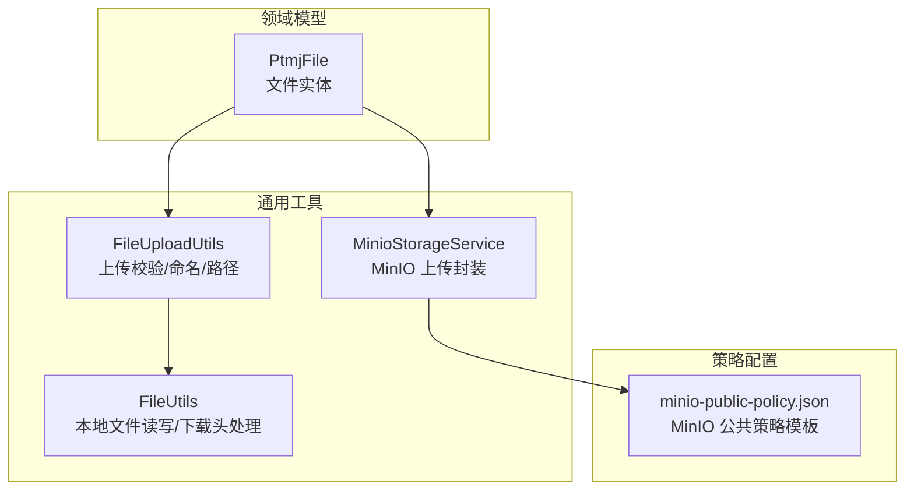
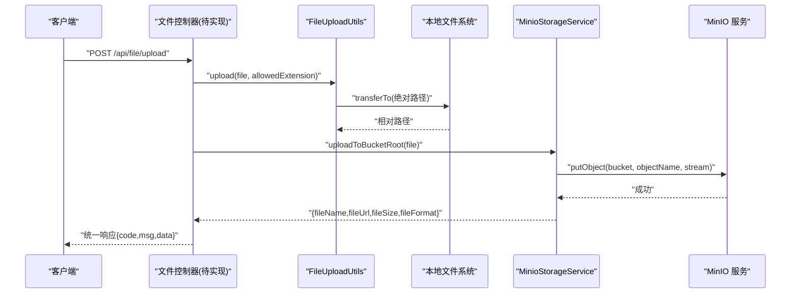
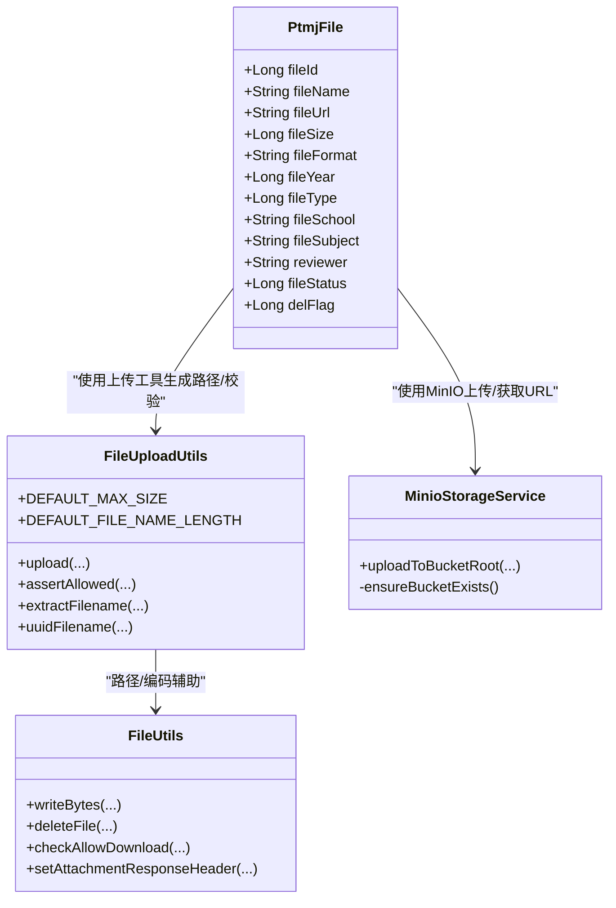

# 文件管理接口

<cite>
**本文引用的文件**   
- [PtmjFile.java](file://PezMax-Backend/ptmj-datum/src/main/java/com/ptmj/datum/domain/PtmjFile.java)
- [MinioStorageService.java](file://PezMax-Backend/ruoyi-common/src/main/java/com/ruoyi/common/utils/file/MinioStorageService.java)
- [FileUploadUtils.java](file://PezMax-Backend/ruoyi-common/src/main/java/com/ruoyi/common/utils/file/FileUploadUtils.java)
- [FileUtils.java](file://PezMax-Backend/ruoyi-common/src/main/java/com/ruoyi/common/utils/file/FileUtils.java)
- [minio-public-policy.json](file://PezMax-Backend/ptmj-datum/src/main/resources/minio-public-policy.json)
</cite>

## 目录
1. [简介](#简介)
2. [项目结构](#项目结构)
3. [核心组件](#核心组件)
4. [架构总览](#架构总览)
5. [详细组件分析](#详细组件分析)
6. [依赖分析](#依赖分析)
7. [性能考虑](#性能考虑)
8. [故障排查指南](#故障排查指南)
9. [结论](#结论)
10. [附录](#附录)

## 简介
本文件面向“文件管理相关 API 接口”的完整文档，覆盖上传、下载、操作、查询与预览等能力，并说明文件类型与大小限制、存储路径规则、MinIO 对象存储集成与安全策略，以及审核流程、版本管理与缓存策略的接口设计建议。本文基于仓库中已实现的通用文件工具与 MinIO 客户端封装进行梳理，并结合领域模型给出可扩展的接口规范。

## 项目结构
后端采用分层架构：
- 领域模型层：定义文件实体（如 PtmjFile），承载文件元数据与业务属性。
- 通用工具层：提供文件上传校验、本地文件读写、MinIO 上传封装等能力。
- 资源策略层：提供 MinIO 公共访问策略模板，用于控制公开桶的读取权限。

图示来源
- [PtmjFile.java:1-224](file://PezMax-Backend/ptmj-datum/src/main/java/com/ptmj/datum/domain/PtmjFile.java#L1-L224)
- [FileUploadUtils.java:1-261](file://PezMax-Backend/ruoyi-common/src/main/java/com/ruoyi/common/utils/file/FileUploadUtils.java#L1-L261)
- [FileUtils.java:1-304](file://PezMax-Backend/ruoyi-common/src/main/java/com/ruoyi/common/utils/file/FileUtils.java#L1-L304)
- [MinioStorageService.java:1-88](file://PezMax-Backend/ruoyi-common/src/main/java/com/ruoyi/common/utils/file/MinioStorageService.java#L1-L88)
- [minio-public-policy.json:1-17](file://PezMax-Backend/ptmj-datum/src/main/resources/minio-public-policy.json#L1-L17)

章节来源
- [PtmjFile.java:1-224](file://PezMax-Backend/ptmj-datum/src/main/java/com/ptmj/datum/domain/PtmjFile.java#L1-L224)
- [FileUploadUtils.java:1-261](file://PezMax-Backend/ruoyi-common/src/main/java/com/ruoyi/common/utils/file/FileUploadUtils.java#L1-L261)
- [FileUtils.java:1-304](file://PezMax-Backend/ruoyi-common/src/main/java/com/ruoyi/common/utils/file/FileUtils.java#L1-L304)
- [MinioStorageService.java:1-88](file://PezMax-Backend/ruoyi-common/src/main/java/com/ruoyi/common/utils/file/MinioStorageService.java#L1-L88)
- [minio-public-policy.json:1-17](file://PezMax-Backend/ptmj-datum/src/main/resources/minio-public-policy.json#L1-L17)

## 核心组件
- 文件实体 PtmjFile：包含文件标识、名称、URL、大小、格式、年份、类型、学校、科目、审核人、状态、删除标记等字段，作为文件全生命周期管理的核心数据载体。
- 上传工具 FileUploadUtils：负责默认大小限制、文件名长度限制、扩展名白名单校验、生成日期分目录与序列号命名的相对路径，以及将 MultipartFile 持久化到本地磁盘。
- 文件工具 FileUtils：提供本地文件的写入、删除、下载响应头设置、允许下载的文件类型检查、编码转换等能力。
- MinIO 服务 MinioStorageService：封装 MinIO 客户端，自动创建桶、生成唯一 objectName、推断 contentType、返回可访问 URL 及元信息。
- MinIO 公共策略 minio-public-policy.json：定义对指定桶的只读访问策略（GetObject）与桶位置查询（GetBucketLocation）。

章节来源
- [PtmjFile.java:1-224](file://PezMax-Backend/ptmj-datum/src/main/java/com/ptmj/datum/domain/PtmjFile.java#L1-L224)
- [FileUploadUtils.java:1-261](file://PezMax-Backend/ruoyi-common/src/main/java/com/ruoyi/common/utils/file/FileUploadUtils.java#L1-L261)
- [FileUtils.java:1-304](file://PezMax-Backend/ruoyi-common/src/main/java/com/ruoyi/common/utils/file/FileUtils.java#L1-L304)
- [MinioStorageService.java:1-88](file://PezMax-Backend/ruoyi-common/src/main/java/com/ruoyi/common/utils/file/MinioStorageService.java#L1-L88)
- [minio-public-policy.json:1-17](file://PezMax-Backend/ptmj-datum/src/main/resources/minio-public-policy.json#L1-L17)

## 架构总览
下图展示从请求进入、上传校验、对象存储写入到返回访问 URL 的整体流程，以及后续下载与预览的访问路径。

图示来源
- [FileUploadUtils.java:58-139](file://PezMax-Backend/ruoyi-common/src/main/java/com/ruoyi/common/utils/file/FileUploadUtils.java#L58-L139)
- [MinioStorageService.java:35-77](file://PezMax-Backend/ruoyi-common/src/main/java/com/ruoyi/common/utils/file/MinioStorageService.java#L35-L77)

## 详细组件分析

### 上传接口
- 单文件上传
  - 功能要点：支持本地落盘与 MinIO 上传；返回标准元信息（名称、URL、大小、格式）。
  - 限制与校验：默认最大文件大小 50MB；文件名长度上限 100；扩展名需通过白名单校验。
  - 路径规则：本地路径按“日期/原文件名_序列.后缀”或“日期/UUID.后缀”组织；MinIO 使用 UUID 作为 objectName 并保留扩展名。
  - 参考实现路径：
    - [FileUploadUtils.upload(...):58-139](file://PezMax-Backend/ruoyi-common/src/main/java/com/ruoyi/common/utils/file/FileUploadUtils.java#L58-L139)
    - [MinioStorageService.uploadToBucketRoot(...):35-77](file://PezMax-Backend/ruoyi-common/src/main/java/com/ruoyi/common/utils/file/MinioStorageService.java#L35-L77)

- 批量上传
  - 建议设计：前端循环调用单文件上传接口，或在服务端接收多文件列表后逐条处理；注意并发与限流。
  - 错误处理：任一文件失败应记录并继续处理其他文件，最终汇总结果。

- 断点续传
  - 现状：当前未实现分片与续传逻辑。
  - 建议方案：引入分片上传（initiate multipart upload）、分片上传（uploadPart）、合并（complete multipart upload）；以 objectName 为会话键，结合 Redis 记录进度。

章节来源
- [FileUploadUtils.java:186-224](file://PezMax-Backend/ruoyi-common/src/main/java/com/ruoyi/common/utils/file/FileUploadUtils.java#L186-L224)
- [FileUploadUtils.java:144-155](file://PezMax-Backend/ruoyi-common/src/main/java/com/ruoyi/common/utils/file/FileUploadUtils.java#L144-L155)
- [MinioStorageService.java:35-77](file://PezMax-Backend/ruoyi-common/src/main/java/com/ruoyi/common/utils/file/MinioStorageService.java#L35-L77)

### 下载接口
- 直接下载
  - 本地文件：通过 FileUtils.writeBytes 输出字节流，配合 setAttachmentResponseHeader 设置下载头。
  - MinIO 文件：直接使用返回的 fileUrl 进行浏览器直链下载。
  - 参考实现路径：
    - [FileUtils.writeBytes(...):39-66](file://PezMax-Backend/ruoyi-common/src/main/java/com/ruoyi/common/utils/file/FileUtils.java#L39-L66)
    - [FileUtils.setAttachmentResponseHeader(...):212-227](file://PezMax-Backend/ruoyi-common/src/main/java/com/ruoyi/common/utils/file/FileUtils.java#L212-L227)

- 流式下载与大文件处理
  - 本地大文件：建议使用分段读取与流式写出，避免一次性加载至内存。
  - MinIO 大文件：优先使用预签名 URL 或 CDN 加速；若经应用转发，务必使用流式传输并设置合适的超时与缓冲。

- 安全校验
  - 使用 FileUtils.checkAllowDownload 校验允许下载的文件类型，防止越权访问。
  - 参考实现路径：
    - [FileUtils.checkAllowDownload(...):153-169](file://PezMax-Backend/ruoyi-common/src/main/java/com/ruoyi/common/utils/file/FileUtils.java#L153-L169)

章节来源
- [FileUtils.java:39-66](file://PezMax-Backend/ruoyi-common/src/main/java/com/ruoyi/common/utils/file/FileUtils.java#L39-L66)
- [FileUtils.java:212-227](file://PezMax-Backend/ruoyi-common/src/main/java/com/ruoyi/common/utils/file/FileUtils.java#L212-L227)
- [FileUtils.java:153-169](file://PezMax-Backend/ruoyi-common/src/main/java/com/ruoyi/common/utils/file/FileUtils.java#L153-L169)

### 文件操作接口
- 删除
  - 本地文件：调用 FileUtils.deleteFile 删除物理文件；同时更新数据库 delFlag 为已删除。
  - MinIO 文件：需额外实现删除 objectName 的逻辑（当前未提供封装方法）。
  - 参考实现路径：
    - [FileUtils.deleteFile(...):124-134](file://PezMax-Backend/ruoyi-common/src/main/java/com/ruoyi/common/utils/file/FileUtils.java#L124-L134)

- 移动/复制/重命名
  - 本地文件：基于 FileUtils 的路径工具组合实现。
  - MinIO 文件：需借助 MinIO SDK 的 copyObject/rename 能力（当前未提供封装方法）。

章节来源
- [FileUtils.java:124-134](file://PezMax-Backend/ruoyi-common/src/main/java/com/ruoyi/common/utils/file/FileUtils.java#L124-L134)

### 文件查询接口
- 列表查询
  - 建议参数：页码、每页数量、关键词、年份、类型、学校、科目、状态等。
  - 返回字段：基于 PtmjFile 实体映射，包含 fileId、fileName、fileUrl、fileSize、fileFormat、fileYear、fileType、fileSchool、fileSubject、fileStatus 等。
  - 参考模型路径：
    - [PtmjFile 字段定义:20-67](file://PezMax-Backend/ptmj-datum/src/main/java/com/ptmj/datum/domain/PtmjFile.java#L20-L67)

- 详情获取
  - 根据 fileId 返回完整元数据与访问链接。

- 搜索过滤
  - 支持模糊匹配文件名、精确匹配年份/类型/学校/科目/状态等条件。

章节来源
- [PtmjFile.java:20-67](file://PezMax-Backend/ptmj-datum/src/main/java/com/ptmj/datum/domain/PtmjFile.java#L20-L67)

### 文件预览接口
- 图片预览
  - 本地图片：通过静态资源映射或流式输出，设置正确的 Content-Type。
  - MinIO 图片：使用公开策略下的直链 URL 或 CDN 地址。

- 文档预览
  - 在线预览：可将 PDF/Office 转换为 HTML 或使用第三方预览服务；返回预览页面 URL。
  - 安全策略：仅允许预览已通过审核且未被删除的文件。

[本节为概念性说明，不直接分析具体文件]

### 文件类型与大小限制、存储路径规则
- 大小限制
  - 默认最大文件大小：50MB（常量 DEFAULT_MAX_SIZE）。
  - 参考实现路径：
    - [FileUploadUtils.DEFAULT_MAX_SIZE:27-29](file://PezMax-Backend/ruoyi-common/src/main/java/com/ruoyi/common/utils/file/FileUploadUtils.java#L27-L29)

- 文件名长度限制
  - 默认最大长度：100（常量 DEFAULT_FILE_NAME_LENGTH）。
  - 参考实现路径：
    - [FileUploadUtils.DEFAULT_FILE_NAME_LENGTH:32-34](file://PezMax-Backend/ruoyi-common/src/main/java/com/ruoyi/common/utils/file/FileUploadUtils.java#L32-L34)

- 扩展名校验
  - 通过 assertAllowed 与 isAllowedExtension 进行白名单校验，不同类型（图片、视频、媒体、Flash）抛出对应异常。
  - 参考实现路径：
    - [FileUploadUtils.assertAllowed(...):186-224](file://PezMax-Backend/ruoyi-common/src/main/java/com/ruoyi/common/utils/file/FileUploadUtils.java#L186-L224)
    - [FileUploadUtils.isAllowedExtension(...):233-243](file://PezMax-Backend/ruoyi-common/src/main/java/com/ruoyi/common/utils/file/FileUploadUtils.java#L233-L243)

- 本地存储路径规则
  - 日期分目录 + 原文件名_序列.后缀 或 日期/UUID.后缀。
  - 参考实现路径：
    - [FileUploadUtils.extractFilename(...):144-147](file://PezMax-Backend/ruoyi-common/src/main/java/com/ruoyi/common/utils/file/FileUploadUtils.java#L144-L147)
    - [FileUploadUtils.uuidFilename(...):152-155](file://PezMax-Backend/ruoyi-common/src/main/java/com/ruoyi/common/utils/file/FileUploadUtils.java#L152-L155)

- MinIO 存储规则
  - objectName 使用 UUID 并保留扩展名；自动确保桶存在；返回可访问 URL。
  - 参考实现路径：
    - [MinioStorageService.uploadToBucketRoot(...):35-77](file://PezMax-Backend/ruoyi-common/src/main/java/com/ruoyi/common/utils/file/MinioStorageService.java#L35-L77)

章节来源
- [FileUploadUtils.java:27-34](file://PezMax-Backend/ruoyi-common/src/main/java/com/ruoyi/common/utils/file/FileUploadUtils.java#L27-L34)
- [FileUploadUtils.java:186-243](file://PezMax-Backend/ruoyi-common/src/main/java/com/ruoyi/common/utils/file/FileUploadUtils.java#L186-L243)
- [FileUploadUtils.java:144-155](file://PezMax-Backend/ruoyi-common/src/main/java/com/ruoyi/common/utils/file/FileUploadUtils.java#L144-L155)
- [MinioStorageService.java:35-77](file://PezMax-Backend/ruoyi-common/src/main/java/com/ruoyi/common/utils/file/MinioStorageService.java#L35-L77)

### MinIO 对象存储集成与安全策略
- 接入方式
  - 通过 MinioStorageService 注入 MinioClient，使用 bucketName 与 url 配置完成上传与 URL 拼接。
  - 参考实现路径：
    - [MinioStorageService 类与字段:21-31](file://PezMax-Backend/ruoyi-common/src/main/java/com/ruoyi/common/utils/file/MinioStorageService.java#L21-L31)

- 访问权限控制
  - 公共策略模板 minio-public-policy.json 允许匿名用户执行 GetObject 与 GetBucketLocation，适用于公开桶。
  - 参考实现路径：
    - [minio-public-policy.json:1-17](file://PezMax-Backend/ptmj-datum/src/main/resources/minio-public-policy.json#L1-L17)

- 安全建议
  - 私有桶：移除匿名 Principal，改为基于鉴权的临时凭证或预签名 URL。
  - 防盗链：结合 Referer 白名单与域名绑定。
  - 审计：开启 MinIO 访问日志，结合应用侧审计日志。

章节来源
- [MinioStorageService.java:21-31](file://PezMax-Backend/ruoyi-common/src/main/java/com/ruoyi/common/utils/file/MinioStorageService.java#L21-L31)
- [minio-public-policy.json:1-17](file://PezMax-Backend/ptmj-datum/src/main/resources/minio-public-policy.json#L1-L17)

### 文件审核流程
- 状态机
  - 未审核 -> 通过/未通过 -> 被举报（可回退）。
  - 参考字段：
    - [PtmjFile.fileStatus:62-64](file://PezMax-Backend/ptmj-datum/src/main/java/com/ptmj/datum/domain/PtmjFile.java#L62-L64)
    - [PtmjFile.reviewer:58-60](file://PezMax-Backend/ptmj-datum/src/main/java/com/ptmj/datum/domain/PtmjFile.java#L58-L60)

- 接口建议
  - 提交审核：上传完成后默认置为“未审核”。
  - 审核通过/拒绝：管理员调用审核接口更新 fileStatus 与 reviewer。
  - 举报处理：用户触发举报后标记“被举报”，暂停公开访问。

章节来源
- [PtmjFile.java:58-64](file://PezMax-Backend/ptmj-datum/src/main/java/com/ptmj/datum/domain/PtmjFile.java#L58-L64)

### 版本管理
- 现状：当前未实现版本化存储。
- 建议方案：
  - 在 PtmjFile 增加 version 字段，每次更新递增。
  - MinIO objectName 追加版本号（如 {uuid}_v{version}.{ext}）。
  - 提供历史版本列表与回滚接口。

[本节为概念性说明，不直接分析具体文件]

### 缓存策略
- 建议缓存项
  - 文件树缓存：按学校/年份/科目构建目录树，减少重复查询。
  - 热门文件缓存：Redis 缓存高频访问文件的元信息与短链。
  - 统计缓存：下载次数、评分等指标。

[本节为概念性说明，不直接分析具体文件]

## 依赖分析

图示来源
- [PtmjFile.java:1-224](file://PezMax-Backend/ptmj-datum/src/main/java/com/ptmj/datum/domain/PtmjFile.java#L1-L224)
- [FileUploadUtils.java:1-261](file://PezMax-Backend/ruoyi-common/src/main/java/com/ruoyi/common/utils/file/FileUploadUtils.java#L1-L261)
- [FileUtils.java:1-304](file://PezMax-Backend/ruoyi-common/src/main/java/com/ruoyi/common/utils/file/FileUtils.java#L1-L304)
- [MinioStorageService.java:1-88](file://PezMax-Backend/ruoyi-common/src/main/java/com/ruoyi/common/utils/file/MinioStorageService.java#L1-L88)

章节来源
- [PtmjFile.java:1-224](file://PezMax-Backend/ptmj-datum/src/main/java/com/ptmj/datum/domain/PtmjFile.java#L1-L224)
- [FileUploadUtils.java:1-261](file://PezMax-Backend/ruoyi-common/src/main/java/com/ruoyi/common/utils/file/FileUploadUtils.java#L1-L261)
- [FileUtils.java:1-304](file://PezMax-Backend/ruoyi-common/src/main/java/com/ruoyi/common/utils/file/FileUtils.java#L1-L304)
- [MinioStorageService.java:1-88](file://PezMax-Backend/ruoyi-common/src/main/java/com/ruoyi/common/utils/file/MinioStorageService.java#L1-L88)

## 性能考虑
- 上传
  - 启用连接池与线程池，避免阻塞主线程。
  - 大文件优先走 MinIO 直传或分片上传，减少应用服务器带宽压力。
- 下载
  - 本地文件使用流式输出；MinIO 文件优先直链或 CDN。
  - 合理设置响应头与压缩策略。
- 缓存
  - 热点文件元信息缓存；CDN 缓存静态资源。
- 存储
  - 定期清理无效分片与临时文件；归档冷数据。

[本节为通用指导，不直接分析具体文件]

## 故障排查指南
- 上传失败
  - 检查文件大小是否超过 50MB、扩展名是否在白名单内。
  - 参考路径：
    - [FileUploadUtils.assertAllowed(...):186-224](file://PezMax-Backend/ruoyi-common/src/main/java/com/ruoyi/common/utils/file/FileUploadUtils.java#L186-L224)
- 下载异常
  - 确认 checkAllowDownload 放行规则与 Content-Disposition 设置。
  - 参考路径：
    - [FileUtils.checkAllowDownload(...):153-169](file://PezMax-Backend/ruoyi-common/src/main/java/com/ruoyi/common/utils/file/FileUtils.java#L153-L169)
    - [FileUtils.setAttachmentResponseHeader(...):212-227](file://PezMax-Backend/ruoyi-common/src/main/java/com/ruoyi/common/utils/file/FileUtils.java#L212-L227)
- MinIO 访问问题
  - 核对桶是否存在、策略是否允许匿名读取、URL 拼接是否正确。
  - 参考路径：
    - [MinioStorageService.ensureBucketExists(...):79-86](file://PezMax-Backend/ruoyi-common/src/main/java/com/ruoyi/common/utils/file/MinioStorageService.java#L79-L86)
    - [minio-public-policy.json:1-17](file://PezMax-Backend/ptmj-datum/src/main/resources/minio-public-policy.json#L1-L17)

章节来源
- [FileUploadUtils.java:186-224](file://PezMax-Backend/ruoyi-common/src/main/java/com/ruoyi/common/utils/file/FileUploadUtils.java#L186-L224)
- [FileUtils.java:153-169](file://PezMax-Backend/ruoyi-common/src/main/java/com/ruoyi/common/utils/file/FileUtils.java#L153-L169)
- [FileUtils.java:212-227](file://PezMax-Backend/ruoyi-common/src/main/java/com/ruoyi/common/utils/file/FileUtils.java#L212-L227)
- [MinioStorageService.java:79-86](file://PezMax-Backend/ruoyi-common/src/main/java/com/ruoyi/common/utils/file/MinioStorageService.java#L79-L86)
- [minio-public-policy.json:1-17](file://PezMax-Backend/ptmj-datum/src/main/resources/minio-public-policy.json#L1-L17)

## 结论
本项目已具备完善的文件上传校验与本地文件处理能力，并提供 MinIO 上传封装与公开策略模板。在此基础上，建议补充断点续传、版本管理、更细粒度的权限控制与缓存策略，以满足大规模文件管理与高可用访问需求。

[本节为总结性内容，不直接分析具体文件]

## 附录
- 关键常量与默认值
  - 默认最大文件大小：50MB
  - 默认文件名最大长度：100
  - 参考路径：
    - [FileUploadUtils.DEFAULT_MAX_SIZE:27-29](file://PezMax-Backend/ruoyi-common/src/main/java/com/ruoyi/common/utils/file/FileUploadUtils.java#L27-L29)
    - [FileUploadUtils.DEFAULT_FILE_NAME_LENGTH:32-34](file://PezMax-Backend/ruoyi-common/src/main/java/com/ruoyi/common/utils/file/FileUploadUtils.java#L32-L34)

- 文件实体字段速览
  - 关键字段：fileId、fileName、fileUrl、fileSize、fileFormat、fileYear、fileType、fileSchool、fileSubject、reviewer、fileStatus、delFlag
  - 参考路径：
    - [PtmjFile 字段:20-67](file://PezMax-Backend/ptmj-datum/src/main/java/com/ptmj/datum/domain/PtmjFile.java#L20-L67)

[本节为概览性内容，不直接分析具体文件]