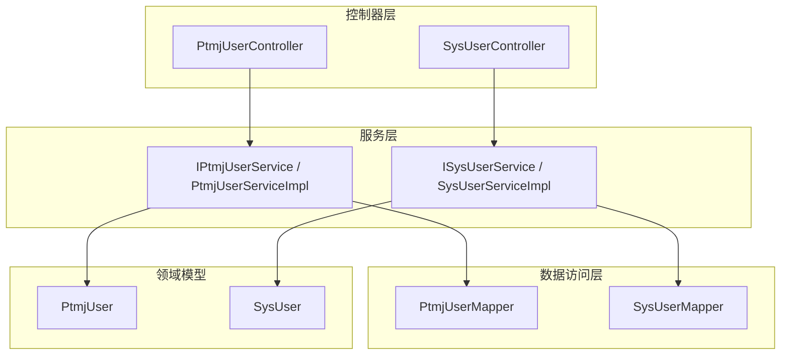
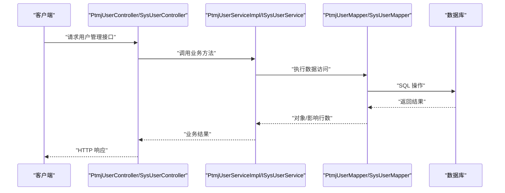
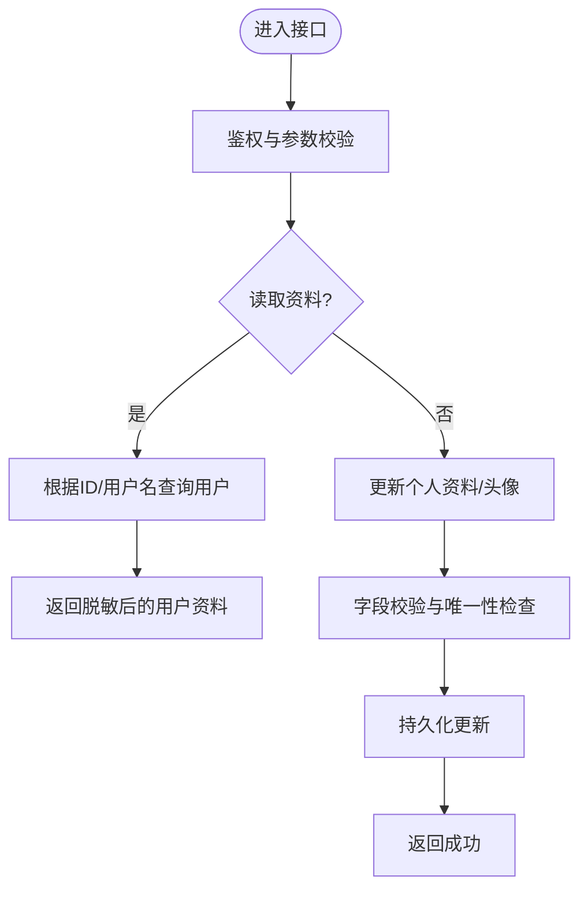
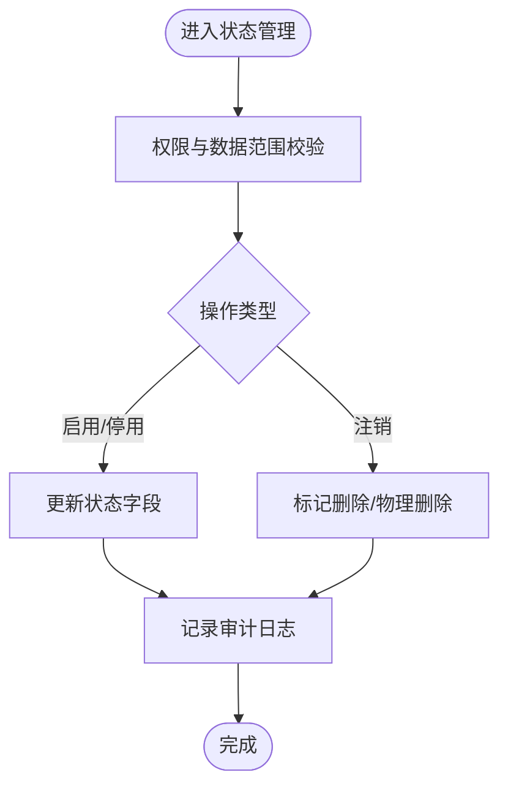
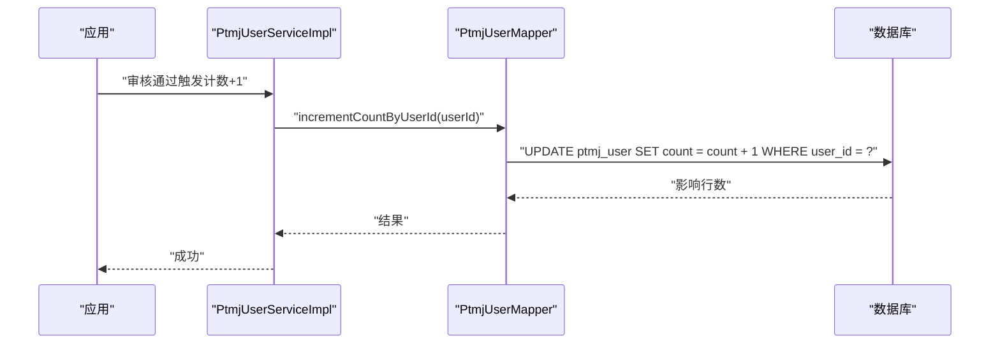
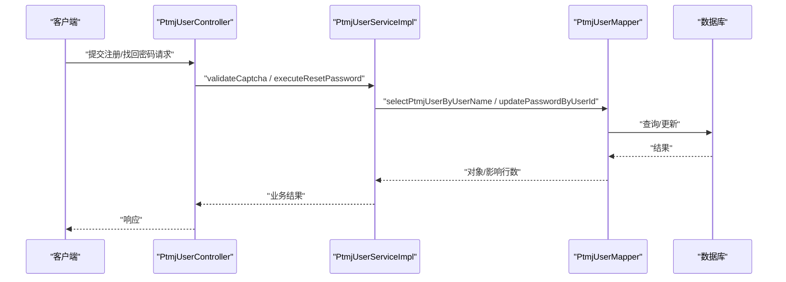
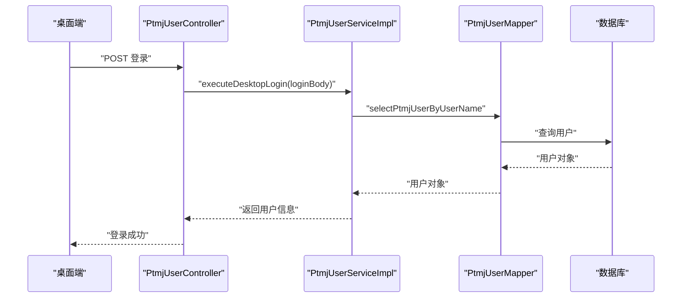
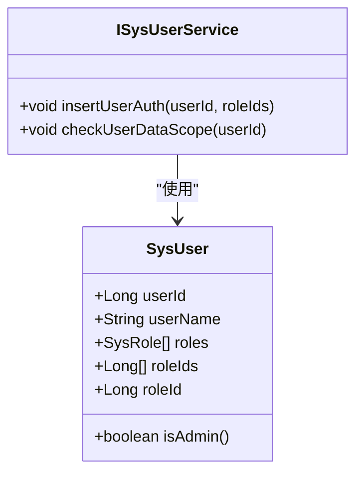
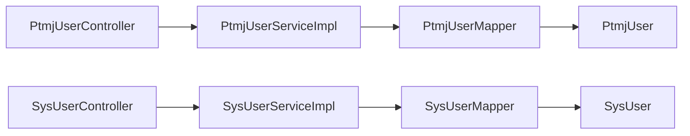

# 用户管理接口

<cite>
**本文引用的文件**   
- [PtmjUser.java](file://PezMax-Backend/ptmj-datum/src/main/java/com/ptmj/datum/domain/PtmjUser.java)
- [IPtmjUserService.java](file://PezMax-Backend/ptmj-datum/src/main/java/com/ptmj/datum/service/IPtmjUserService.java)
- [PtmjUserServiceImpl.java](file://PezMax-Backend/ptmj-datum/src/main/java/com/ptmj/datum/service/impl/PtmjUserServiceImpl.java)
- [PtmjUserMapper.java](file://PezMax-Backend/ptmj-datum/src/main/java/com/ptmj/datum/mapper/PtmjUserMapper.java)
- [SysUser.java](file://PezMax-Backend/ruoyi-common/src/main/java/com/ruoyi/common/core/domain/entity/SysUser.java)
- [ISysUserService.java](file://PezMax-Backend/ruoyi-system/src/main/java/com/ruoyi/system/service/ISysUserService.java)
- [SysUserServiceImpl.java](file://PezMax-Backend/ruoyi-system/src/main/java/com/ruoyi/system/service/impl/SysUserServiceImpl.java)
- [SysUserMapper.java](file://PezMax-Backend/ruoyi-system/src/main/java/com/ruoyi/system/mapper/SysUserMapper.java)
- [PtmjUserController.java](file://PezMax-Backend/ruoyi-admin/src/main/java/com/ruoyi/web/controller/datum/PtmjUserController.java)
- [SysUserController.java](file://PezMax-Backend/ruoyi-admin/src/main/java/com/ruoyi/web/controller/system/SysUserController.java)
</cite>

## 目录
1. [简介](#简介)
2. [项目结构](#项目结构)
3. [核心组件](#核心组件)
4. [架构总览](#架构总览)
5. [详细组件分析](#详细组件分析)
6. [依赖关系分析](#依赖关系分析)
7. [性能考虑](#性能考虑)
8. [故障排查指南](#故障排查指南)
9. [结论](#结论)
10. [附录](#附录)

## 简介
本文件面向“用户管理相关 API 接口”的完整文档，覆盖以下范围：
- 用户信息管理：用户资料查看、个人信息修改、头像上传
- 用户状态管理：激活、禁用、注销（软删除）
- 用户统计：活跃度与贡献统计（以上传计数为例）
- 用户关系：关注、好友、黑名单（概念性说明）
- 角色权限体系、数据权限控制、隐私保护机制
- 数据迁移、批量操作、备份恢复策略
- 行为审计、异常检测与安全策略

说明：
- 本项目包含两套用户域：平台业务用户 PtmjUser 与系统管理用户 SysUser。前者用于业务侧用户信息与管理，后者为 RuoYi 框架的系统用户模型。
- 部分能力（如关注/好友/黑名单）在现有代码中未直接实现，本节提供概念设计与对接建议。

## 项目结构
围绕用户管理的后端分层如下：
- 控制器层：暴露 HTTP 接口
- 服务层：封装业务逻辑
- 数据访问层：MyBatis Mapper 映射到数据库
- 领域模型：PtmjUser、SysUser 等实体

图表来源
- [PtmjUserController.java](file://PezMax-Backend/ruoyi-admin/src/main/java/com/ruoyi/web/controller/datum/PtmjUserController.java)
- [SysUserController.java](file://PezMax-Backend/ruoyi-admin/src/main/java/com/ruoyi/web/controller/system/SysUserController.java)
- [IPtmjUserService.java](file://PezMax-Backend/ptmj-datum/src/main/java/com/ptmj/datum/service/IPtmjUserService.java)
- [PtmjUserServiceImpl.java](file://PezMax-Backend/ptmj-datum/src/main/java/com/ptmj/datum/service/impl/PtmjUserServiceImpl.java)
- [ISysUserService.java](file://PezMax-Backend/ruoyi-system/src/main/java/com/ruoyi/system/service/ISysUserService.java)
- [SysUserServiceImpl.java](file://PezMax-Backend/ruoyi-system/src/main/java/com/ruoyi/system/service/impl/SysUserServiceImpl.java)
- [PtmjUserMapper.java](file://PezMax-Backend/ptmj-datum/src/main/java/com/ptmj/datum/mapper/PtmjUserMapper.java)
- [SysUserMapper.java](file://PezMax-Backend/ruoyi-system/src/main/java/com/ruoyi/system/mapper/SysUserMapper.java)
- [PtmjUser.java](file://PezMax-Backend/ptmj-datum/src/main/java/com/ptmj/datum/domain/PtmjUser.java)
- [SysUser.java](file://PezMax-Backend/ruoyi-common/src/main/java/com/ruoyi/common/core/domain/entity/SysUser.java)

章节来源
- [PtmjUserController.java](file://PezMax-Backend/ruoyi-admin/src/main/java/com/ruoyi/web/controller/datum/PtmjUserController.java)
- [SysUserController.java](file://PezMax-Backend/ruoyi-admin/src/main/java/com/ruoyi/web/controller/system/SysUserController.java)
- [IPtmjUserService.java](file://PezMax-Backend/ptmj-datum/src/main/java/com/ptmj/datum/service/IPtmjUserService.java)
- [ISysUserService.java](file://PezMax-Backend/ruoyi-system/src/main/java/com/ruoyi/system/service/ISysUserService.java)

## 核心组件
- 平台用户模型 PtmjUser：包含用户ID、用户名、密码（仅写入）、头像、上传计数、账号状态、创建者等字段；密码字段通过注解禁止序列化输出，保障隐私。
- 系统用户模型 SysUser：RuoYi 系统用户实体，包含部门、角色、岗位、登录信息、状态、删除标志等，支持唯一性校验与管理员判断。
- 平台用户服务 IPtmjUserService：提供注册、按用户名查询、密保重置、验证码校验、桌面端登录、获取客户端信息、生成验证码图片、审核通过时上传计数+1 等业务方法。
- 系统用户服务 ISysUserService：提供用户增删改查、角色授权、状态更新、头像更新、登录信息更新、密码重置、导入等系统级用户管理能力。
- 数据访问层：PtmjUserMapper 与 SysUserMapper 分别对应各自实体的 CRUD 与扩展查询（如按用户名查询、更新头像、更新状态、更新登录信息、重置密码、批量删除、上传计数+1 等）。

章节来源
- [PtmjUser.java](file://PezMax-Backend/ptmj-datum/src/main/java/com/ptmj/datum/domain/PtmjUser.java)
- [SysUser.java](file://PezMax-Backend/ruoyi-common/src/main/java/com/ruoyi/common/core/domain/entity/SysUser.java)
- [IPtmjUserService.java](file://PezMax-Backend/ptmj-datum/src/main/java/com/ptmj/datum/service/IPtmjUserService.java)
- [ISysUserService.java](file://PezMax-Backend/ruoyi-system/src/main/java/com/ruoyi/system/service/ISysUserService.java)
- [PtmjUserMapper.java](file://PezMax-Backend/ptmj-datum/src/main/java/com/ptmj/datum/mapper/PtmjUserMapper.java)
- [SysUserMapper.java](file://PezMax-Backend/ruoyi-system/src/main/java/com/ruoyi/system/mapper/SysUserMapper.java)

## 架构总览
下图展示从控制器到服务再到数据层的调用链，以及关键的用户管理与安全流程。

图表来源
- [PtmjUserController.java](file://PezMax-Backend/ruoyi-admin/src/main/java/com/ruoyi/web/controller/datum/PtmjUserController.java)
- [SysUserController.java](file://PezMax-Backend/ruoyi-admin/src/main/java/com/ruoyi/web/controller/system/SysUserController.java)
- [PtmjUserServiceImpl.java](file://PezMax-Backend/ptmj-datum/src/main/java/com/ptmj/datum/service/impl/PtmjUserServiceImpl.java)
- [ISysUserService.java](file://PezMax-Backend/ruoyi-system/src/main/java/com/ruoyi/system/service/ISysUserService.java)
- [PtmjUserMapper.java](file://PezMax-Backend/ptmj-datum/src/main/java/com/ptmj/datum/mapper/PtmjUserMapper.java)
- [SysUserMapper.java](file://PezMax-Backend/ruoyi-system/src/main/java/com/ruoyi/system/mapper/SysUserMapper.java)

## 详细组件分析

### 用户信息管理接口
- 用户资料查看
  - 平台用户：通过用户ID或用户名查询 PtmjUser，注意密码字段不对外输出。
  - 系统用户：通过用户ID或用户名查询 SysUser，可结合角色与部门信息。
- 个人信息修改
  - 平台用户：支持更新用户名、头像、状态等字段。
  - 系统用户：支持更新昵称、邮箱、手机号、性别、头像等，并提供唯一性校验。
- 头像上传
  - 平台用户：更新头像地址字段。
  - 系统用户：提供专用头像更新接口，便于统一处理存储路径。

章节来源
- [IPtmjUserService.java](file://PezMax-Backend/ptmj-datum/src/main/java/com/ptmj/datum/service/IPtmjUserService.java)
- [ISysUserService.java](file://PezMax-Backend/ruoyi-system/src/main/java/com/ruoyi/system/service/ISysUserService.java)
- [PtmjUserMapper.java](file://PezMax-Backend/ptmj-datum/src/main/java/com/ptmj/datum/mapper/PtmjUserMapper.java)
- [SysUserMapper.java](file://PezMax-Backend/ruoyi-system/src/main/java/com/ruoyi/system/mapper/SysUserMapper.java)
- [PtmjUser.java](file://PezMax-Backend/ptmj-datum/src/main/java/com/ptmj/datum/domain/PtmjUser.java)
- [SysUser.java](file://PezMax-Backend/ruoyi-common/src/main/java/com/ruoyi/common/core/domain/entity/SysUser.java)

### 用户状态管理接口
- 激活/禁用
  - 平台用户：通过状态字段控制封禁/正常。
  - 系统用户：提供 updateUserStatus 接口，支持启用/停用。
- 注销（软删除）
  - 系统用户：delFlag 标记删除，提供 deleteUserByIds 批量删除。
  - 平台用户：提供 deletePtmjUserByUserId 与 deletePtmjUserByUserIds。

章节来源
- [IPtmjUserService.java](file://PezMax-Backend/ptmj-datum/src/main/java/com/ptmj/datum/service/IPtmjUserService.java)
- [ISysUserService.java](file://PezMax-Backend/ruoyi-system/src/main/java/com/ruoyi/system/service/ISysUserService.java)
- [SysUserMapper.java](file://PezMax-Backend/ruoyi-system/src/main/java/com/ruoyi/system/mapper/SysUserMapper.java)
- [PtmjUserMapper.java](file://PezMax-Backend/ptmj-datum/src/main/java/com/ptmj/datum/mapper/PtmjUserMapper.java)
- [SysUser.java](file://PezMax-Backend/ruoyi-common/src/main/java/com/ruoyi/common/core/domain/entity/SysUser.java)

### 用户统计接口
- 活跃度与贡献统计
  - 上传计数：审核通过时调用 incrementCountByUserId 对用户上传计数+1。
  - 排行榜：提供 selectTopUploaders 查询上传次数前 N 的用户ID（VO 对象），可用于活跃度排名。

图表来源
- [IPtmjUserService.java](file://PezMax-Backend/ptmj-datum/src/main/java/com/ptmj/datum/service/IPtmjUserService.java)
- [PtmjUserMapper.java](file://PezMax-Backend/ptmj-datum/src/main/java/com/ptmj/datum/mapper/PtmjUserMapper.java)

章节来源
- [IPtmjUserService.java](file://PezMax-Backend/ptmj-datum/src/main/java/com/ptmj/datum/service/IPtmjUserService.java)
- [PtmjUserMapper.java](file://PezMax-Backend/ptmj-datum/src/main/java/com/ptmj/datum/mapper/PtmjUserMapper.java)

### 用户关系接口（关注、好友、黑名单）
- 现状：当前仓库未发现关注、好友、黑名单相关的实体与服务实现。
- 建议设计：
  - 新增关系表：follow（关注）、friend（好友）、blacklist（黑名单），包含主键、双方用户ID、状态、时间戳等。
  - 新增 Service/Mapper：提供添加/取消关注、申请/接受好友、加入/移除黑名单、列表查询等接口。
  - 权限与防刷：基于角色与频率限制，防止恶意拉黑与刷关注。
  - 审计与通知：记录操作日志并推送通知。

[本节为概念性设计，无具体源码引用]

### 用户注册与找回密码流程
- 注册
  - 输入 DTO 进行校验，生成用户并返回 userId 与 userName。
- 找回密码
  - 支持验证码校验与三条密保问题验证，完成后重置密码。
  - 管理员可按用户名重置密保答案。

图表来源
- [IPtmjUserService.java](file://PezMax-Backend/ptmj-datum/src/main/java/com/ptmj/datum/service/IPtmjUserService.java)
- [PtmjUserMapper.java](file://PezMax-Backend/ptmj-datum/src/main/java/com/ptmj/datum/mapper/PtmjUserMapper.java)

章节来源
- [IPtmjUserService.java](file://PezMax-Backend/ptmj-datum/src/main/java/com/ptmj/datum/service/IPtmjUserService.java)
- [PtmjUserMapper.java](file://PezMax-Backend/ptmj-datum/src/main/java/com/ptmj/datum/mapper/PtmjUserMapper.java)

### 桌面端登录与客户端信息
- 桌面端登录：executeDesktopLogin 返回客户端用户信息。
- 获取当前登录用户信息：executeGetClientInfo 返回当前上下文用户详情。

图表来源
- [IPtmjUserService.java](file://PezMax-Backend/ptmj-datum/src/main/java/com/ptmj/datum/service/IPtmjUserService.java)
- [PtmjUserMapper.java](file://PezMax-Backend/ptmj-datum/src/main/java/com/ptmj/datum/mapper/PtmjUserMapper.java)

章节来源
- [IPtmjUserService.java](file://PezMax-Backend/ptmj-datum/src/main/java/com/ptmj/datum/service/IPtmjUserService.java)

### 角色权限体系与数据权限控制
- 角色权限
  - 系统用户模型 SysUser 包含 roles、roleIds、roleId 等字段，支持角色组与岗位组管理。
  - 提供 insertUserAuth 为用户授权角色。
- 数据权限
  - 提供 checkUserDataScope 校验用户数据权限范围，确保只访问允许的数据集。
- 管理员判断
  - SysUser.isAdmin 用于快速判断是否为管理员。

图表来源
- [SysUser.java](file://PezMax-Backend/ruoyi-common/src/main/java/com/ruoyi/common/core/domain/entity/SysUser.java)
- [ISysUserService.java](file://PezMax-Backend/ruoyi-system/src/main/java/com/ruoyi/system/service/ISysUserService.java)

章节来源
- [SysUser.java](file://PezMax-Backend/ruoyi-common/src/main/java/com/ruoyi/common/core/domain/entity/SysUser.java)
- [ISysUserService.java](file://PezMax-Backend/ruoyi-system/src/main/java/com/ruoyi/system/service/ISysUserService.java)

### 隐私保护机制
- 密码字段不输出：PtmjUser 与 SysUser 均对 password 设置仅写入，避免响应泄露。
- 敏感信息脱敏：可通过通用工具类进行脱敏处理（如邮箱、手机号）。
- 最小化返回：接口仅返回必要字段，避免过度暴露。

章节来源
- [PtmjUser.java](file://PezMax-Backend/ptmj-datum/src/main/java/com/ptmj/datum/domain/PtmjUser.java)
- [SysUser.java](file://PezMax-Backend/ruoyi-common/src/main/java/com/ruoyi/common/core/domain/entity/SysUser.java)

### 数据迁移、批量操作、备份恢复
- 数据迁移
  - 建议在变更前后进行全量导出与增量对比，使用幂等脚本进行增量更新。
  - 针对用户表，优先采用“先写后切”的策略，降低停机时间。
- 批量操作
  - 平台用户：deletePtmjUserByUserIds 批量删除。
  - 系统用户：deleteUserByIds 批量删除，importUser 批量导入。
- 备份恢复
  - 定期全量备份用户表与关联表，保留多版本快照。
  - 恢复时先回滚事务，再导入备份，最后校验一致性。

章节来源
- [IPtmjUserService.java](file://PezMax-Backend/ptmj-datum/src/main/java/com/ptmj/datum/service/IPtmjUserService.java)
- [ISysUserService.java](file://PezMax-Backend/ruoyi-system/src/main/java/com/ruoyi/system/service/ISysUserService.java)

### 用户行为审计、异常检测与安全策略
- 行为审计
  - 登录信息更新：updateLoginInfo 记录最后登录 IP 与时间。
  - 建议增加操作日志记录（如状态变更、密码重置、批量删除）。
- 异常检测
  - 频繁失败登录、异常时间段登录、异地登录等场景应触发告警。
- 安全策略
  - 验证码校验：register/reset 流程强制验证码。
  - 限流与防重：重复提交拦截与速率限制。
  - XSS 防护：输入过滤与输出转义。

章节来源
- [ISysUserService.java](file://PezMax-Backend/ruoyi-system/src/main/java/com/ruoyi/system/service/ISysUserService.java)
- [SysUserMapper.java](file://PezMax-Backend/ruoyi-system/src/main/java/com/ruoyi/system/mapper/SysUserMapper.java)
- [IPtmjUserService.java](file://PezMax-Backend/ptmj-datum/src/main/java/com/ptmj/datum/service/IPtmjUserService.java)

## 依赖关系分析
- 控制器依赖服务：PtmjUserController 与 SysUserController 分别依赖各自的服务接口。
- 服务依赖 Mapper：PtmjUserServiceImpl 依赖 PtmjUserMapper；SysUserServiceImpl 依赖 SysUserMapper。
- 实体与 Mapper 一一对应：PtmjUser 与 PtmjUserMapper；SysUser 与 SysUserMapper。

图表来源
- [PtmjUserController.java](file://PezMax-Backend/ruoyi-admin/src/main/java/com/ruoyi/web/controller/datum/PtmjUserController.java)
- [SysUserController.java](file://PezMax-Backend/ruoyi-admin/src/main/java/com/ruoyi/web/controller/system/SysUserController.java)
- [PtmjUserServiceImpl.java](file://PezMax-Backend/ptmj-datum/src/main/java/com/ptmj/datum/service/impl/PtmjUserServiceImpl.java)
- [SysUserServiceImpl.java](file://PezMax-Backend/ruoyi-system/src/main/java/com/ruoyi/system/service/impl/SysUserServiceImpl.java)
- [PtmjUserMapper.java](file://PezMax-Backend/ptmj-datum/src/main/java/com/ptmj/datum/mapper/PtmjUserMapper.java)
- [SysUserMapper.java](file://PezMax-Backend/ruoyi-system/src/main/java/com/ruoyi/system/mapper/SysUserMapper.java)
- [PtmjUser.java](file://PezMax-Backend/ptmj-datum/src/main/java/com/ptmj/datum/domain/PtmjUser.java)
- [SysUser.java](file://PezMax-Backend/ruoyi-common/src/main/java/com/ruoyi/common/core/domain/entity/SysUser.java)

章节来源
- [PtmjUserController.java](file://PezMax-Backend/ruoyi-admin/src/main/java/com/ruoyi/web/controller/datum/PtmjUserController.java)
- [SysUserController.java](file://PezMax-Backend/ruoyi-admin/src/main/java/com/ruoyi/web/controller/system/SysUserController.java)
- [PtmjUserServiceImpl.java](file://PezMax-Backend/ptmj-datum/src/main/java/com/ptmj/datum/service/impl/PtmjUserServiceImpl.java)
- [SysUserServiceImpl.java](file://PezMax-Backend/ruoyi-system/src/main/java/com/ruoyi/system/service/impl/SysUserServiceImpl.java)

## 性能考虑
- 索引优化：对用户名、状态、更新时间等高频查询字段建立索引。
- 分页与排序：列表查询务必分页，避免一次性加载大量数据。
- 缓存策略：热点用户资料与排行榜可引入缓存，减少数据库压力。
- 批量操作：尽量使用批量插入/更新/删除，减少往返开销。
- 连接池与线程池：合理配置 Druid 连接池与异步任务线程池。

[本节为通用指导，不涉及具体源码]

## 故障排查指南
- 常见问题
  - 登录失败：检查验证码是否过期、用户名是否存在、密码是否正确。
  - 状态更新失败：确认权限与数据范围，检查状态值是否合法。
  - 头像上传失败：检查存储路径与权限，确认返回的 URL 格式正确。
- 定位步骤
  - 查看控制器日志与服务层异常堆栈。
  - 核对 Mapper SQL 与参数绑定。
  - 检查数据库约束与唯一性校验。
- 安全事件
  - 发现异常登录或暴力破解，立即启用限流与封禁策略，并记录审计日志。

章节来源
- [IPtmjUserService.java](file://PezMax-Backend/ptmj-datum/src/main/java/com/ptmj/datum/service/IPtmjUserService.java)
- [ISysUserService.java](file://PezMax-Backend/ruoyi-system/src/main/java/com/ruoyi/system/service/ISysUserService.java)

## 结论
本项目已具备完善的用户信息管理、状态管理、统计与基础安全能力。建议后续补充用户关系模块（关注/好友/黑名单），完善审计与异常检测，并结合缓存与索引优化提升性能与可用性。

[本节为总结，不涉及具体源码]

## 附录
- 术语
  - 平台用户：业务侧用户，对应 PtmjUser。
  - 系统用户：管理侧用户，对应 SysUser。
- 参考接口清单
  - 平台用户：注册、按用户名查询、密保重置、验证码校验、桌面端登录、获取客户端信息、上传计数+1、列表/新增/修改/删除。
  - 系统用户：用户增删改查、角色授权、状态更新、头像更新、登录信息更新、密码重置、导入、批量删除。

[本节为补充说明，不涉及具体源码]