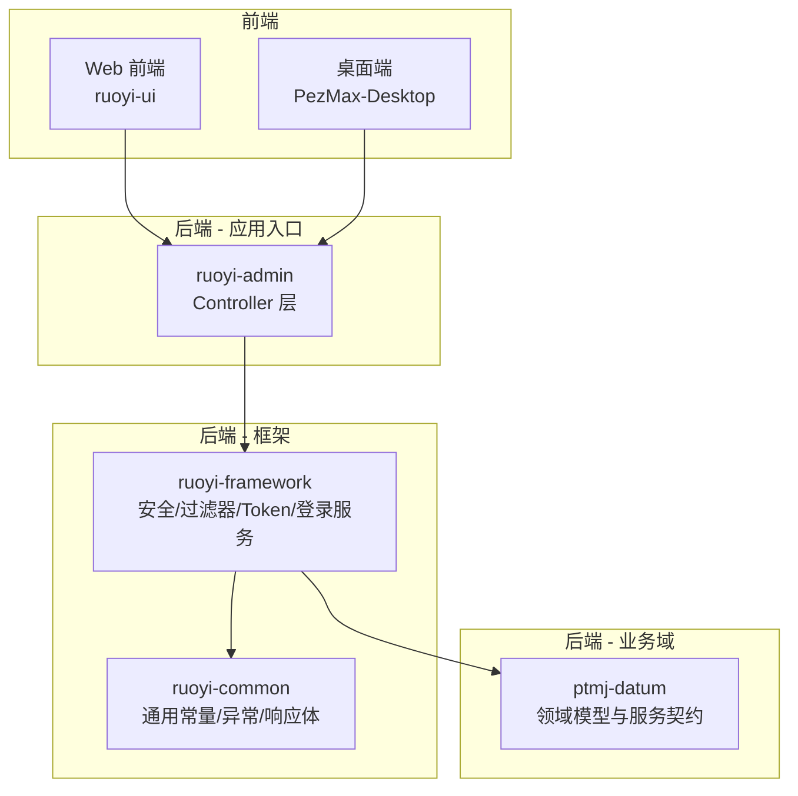
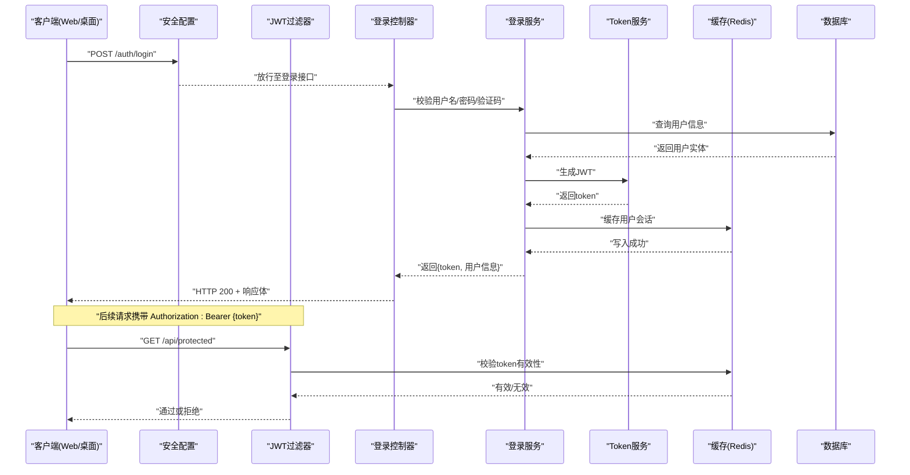
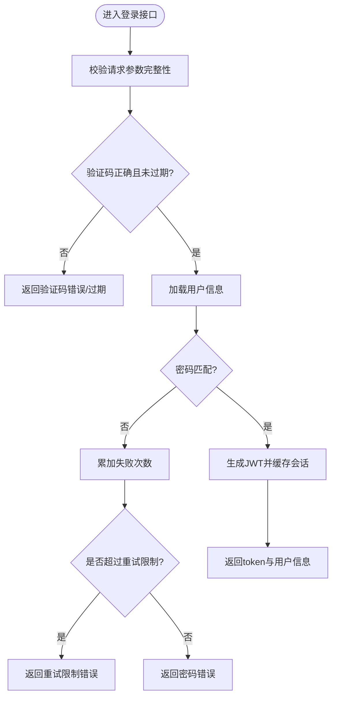
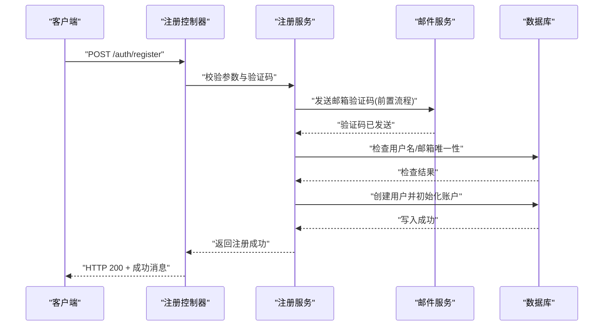
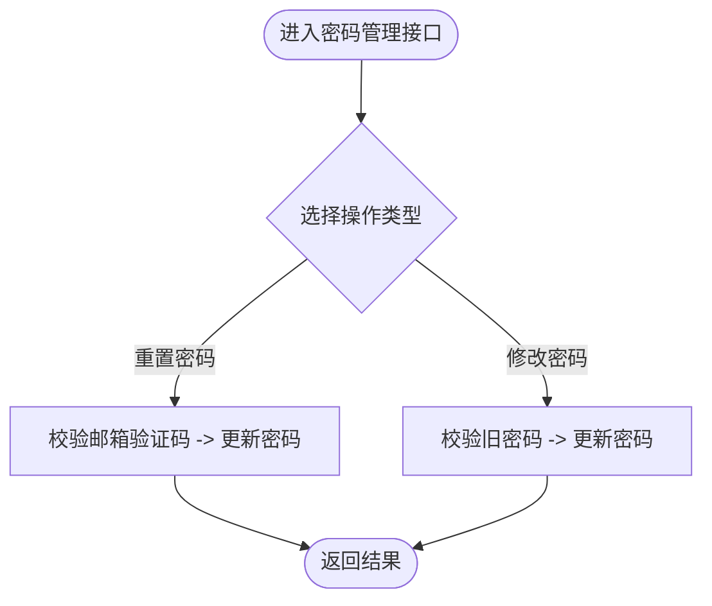
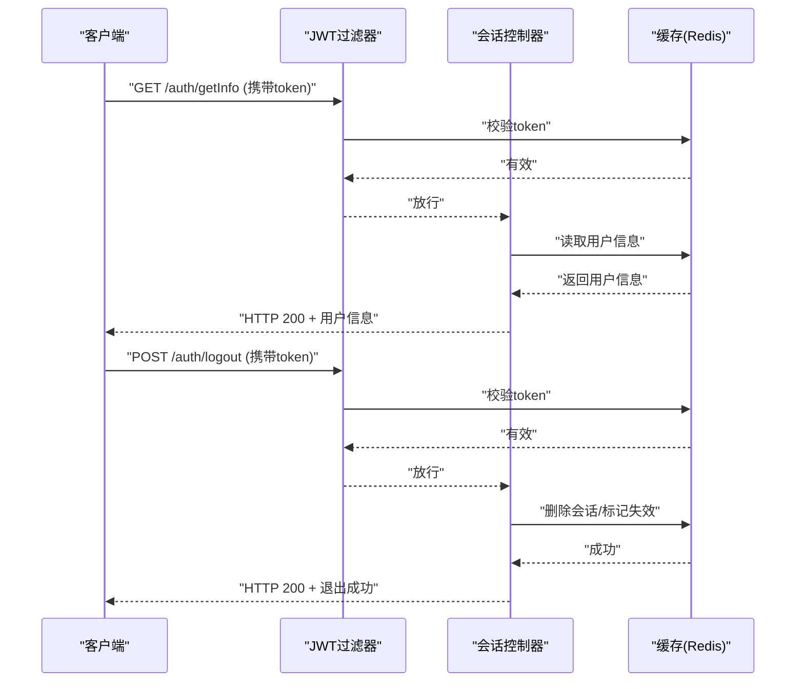
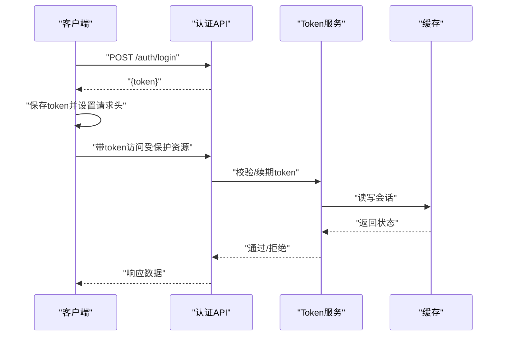
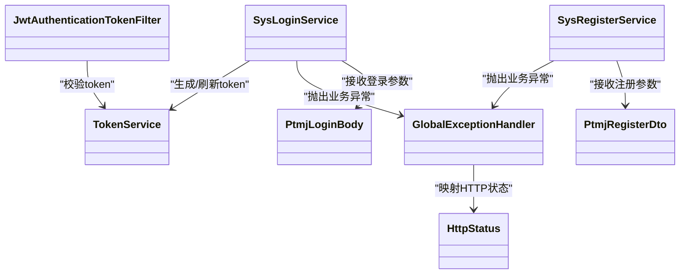

# 用户认证接口

<cite>
**本文引用的文件**   
- [PtmjLoginBody.java](file://PezMax-Backend/ptmj-datum/src/main/java/com/ptmj/datum/domain/PtmjLoginBody.java)
- [PtmjRegisterDto.java](file://PezMax-Backend/ptmj-datum/src/main/java/com/ptmj/datum/dto/PtmjRegisterDto.java)
- [IPtmjAuthService.java](file://PezMax-Backend/ptmj-datum/src/main/java/com/ptmj/datum/service/IPtmjAuthService.java)
- [IDesktopAuthService.java](file://PezMax-Backend/ptmj-datum/src/main/java/com/ptmj/datum/service/IDesktopAuthService.java)
- [SysLoginService.java](file://PezMax-Backend/ruoyi-framework/src/main/java/com/ruoyi/framework/web/service/SysLoginService.java)
- [SysRegisterService.java](file://PezMax-Backend/ruoyi-framework/src/main/java/com/ruoyi/framework/web/service/SysRegisterService.java)
- [TokenService.java](file://PezMax-Backend/ruoyi-framework/src/main/java/com/ruoyi/framework/web/service/TokenService.java)
- [JwtAuthenticationTokenFilter.java](file://PezMax-Backend/ruoyi-framework/src/main/java/com/ruoyi/framework/security/filter/JwtAuthenticationTokenFilter.java)
- [SecurityConfig.java](file://PezMax-Backend/ruoyi-framework/src/main/java/com/ruoyi/framework/config/SecurityConfig.java)
- [GlobalExceptionHandler.java](file://PezMax-Backend/ruoyi-framework/src/main/java/com/ruoyi/framework/web/exception/GlobalExceptionHandler.java)
- [CaptchaException.java](file://PezMax-Backend/ruoyi-common/src/main/java/com/ruoyi/common/exception/user/CaptchaException.java)
- [CaptchaExpireException.java](file://PezMax-Backend/ruoyi-common/src/main/java/com/ruoyi/common/exception/user/CaptchaExpireException.java)
- [UserPasswordNotMatchException.java](file://PezMax-Backend/ruoyi-common/src/main/java/com/ruoyi/common/exception/user/UserPasswordNotMatchException.java)
- [UserPasswordRetryLimitExceedException.java](file://PezMax-Backend/ruoyi-common/src/main/java/com/ruoyi/common/exception/user/UserPasswordRetryLimitExceedException.java)
- [BlackListException.java](file://PezMax-Backend/ruoyi-common/src/main/java/com/ruoyi/common/exception/user/BlackListException.java)
- [HttpStatus.java](file://PezMax-Backend/ruoyi-common/src/main/java/com/ruoyi/common/enums/HttpStatus.java)
- [CacheConstants.java](file://PezMax-Backend/ruoyi-common/src/main/java/com/ruoyi/common/constant/CacheConstants.java)
- [R.java](file://PezMax-Backend/ruoyi-common/src/main/java/com/ruoyi/common/core/domain/R.java)
- [AjaxResult.java](file://PezMax-Backend/ruoyi-common/src/main/java/com/ruoyi/common/core/domain/AjaxResult.java)
- [login.js（Web前端）](file://PezMax-Backend/ruoyi-ui/src/api/login.js)
- [login.vue（Web前端）](file://PezMax-Backend/ruoyi-ui/src/views/login.vue)
- [login.js（桌面端）](file://PezMax-Desktop/src/renderer/api/login.js)
- [login.vue（桌面端）](file://PezMax-Desktop/src/renderer/views/login.vue)
</cite>

## 目录
1. [简介](#简介)
2. [项目结构](#项目结构)
3. [核心组件](#核心组件)
4. [架构总览](#架构总览)
5. [详细组件分析](#详细组件分析)
6. [依赖分析](#依赖分析)
7. [性能考虑](#性能考虑)
8. [故障排查指南](#故障排查指南)
9. [结论](#结论)
10. [附录](#附录)

## 简介
本文件面向后端与前后端开发者，系统化梳理“用户认证相关 API”的接口规范、数据模型、安全机制与最佳实践。内容覆盖：
- 登录接口：用户名+密码登录、验证码校验
- 注册接口：新用户注册、邮箱验证流程说明
- 密码管理接口：重置密码、修改密码
- 会话管理接口：获取当前用户信息、退出登录
- JWT 令牌获取与使用：请求头设置、刷新策略
- 安全与防暴力破解策略及最佳实践

## 项目结构
本项目采用多模块分层架构，认证能力由框架层与安全配置提供，业务层在 ptmj-datum 中定义服务契约，控制器位于 ruoyi-admin 模块（按包路径组织），通用异常与响应封装在 ruoyi-common，前端 Web 与桌面端分别通过各自 api/login.js 调用后端接口。

图表来源
- [SecurityConfig.java](file://PezMax-Backend/ruoyi-framework/src/main/java/com/ruoyi/framework/config/SecurityConfig.java)
- [JwtAuthenticationTokenFilter.java](file://PezMax-Backend/ruoyi-framework/src/main/java/com/ruoyi/framework/security/filter/JwtAuthenticationTokenFilter.java)
- [SysLoginService.java](file://PezMax-Backend/ruoyi-framework/src/main/java/com/ruoyi/framework/web/service/SysLoginService.java)
- [TokenService.java](file://PezMax-Backend/ruoyi-framework/src/main/java/com/ruoyi/framework/web/service/TokenService.java)
- [IPtmjAuthService.java](file://PezMax-Backend/ptmj-datum/src/main/java/com/ptmj/datum/service/IPtmjAuthService.java)
- [PtmjLoginBody.java](file://PezMax-Backend/ptmj-datum/src/main/java/com/ptmj/datum/domain/PtmjLoginBody.java)
- [PtmjRegisterDto.java](file://PezMax-Backend/ptmj-datum/src/main/java/com/ptmj/datum/dto/PtmjRegisterDto.java)

章节来源
- [SecurityConfig.java](file://PezMax-Backend/ruoyi-framework/src/main/java/com/ruoyi/framework/config/SecurityConfig.java)
- [JwtAuthenticationTokenFilter.java](file://PezMax-Backend/ruoyi-framework/src/main/java/com/ruoyi/framework/security/filter/JwtAuthenticationTokenFilter.java)
- [SysLoginService.java](file://PezMax-Backend/ruoyi-framework/src/main/java/com/ruoyi/framework/web/service/SysLoginService.java)
- [TokenService.java](file://PezMax-Backend/ruoyi-framework/src/main/java/com/ruoyi/framework/web/service/TokenService.java)
- [IPtmjAuthService.java](file://PezMax-Backend/ptmj-datum/src/main/java/com/ptmj/datum/service/IPtmjAuthService.java)
- [PtmjLoginBody.java](file://PezMax-Backend/ptmj-datum/src/main/java/com/ptmj/datum/domain/PtmjLoginBody.java)
- [PtmjRegisterDto.java](file://PezMax-Backend/ptmj-datum/src/main/java/com/ptmj/datum/dto/PtmjRegisterDto.java)

## 核心组件
- 登录服务：负责校验用户名/密码、验证码、生成并缓存 Token、记录登录日志等。
- 注册服务：负责新用户注册、邮箱验证流程编排。
- Token 服务：负责 JWT 签发、解析、刷新与过期处理。
- 安全过滤器：全局拦截受保护资源，校验请求携带的 JWT。
- 统一异常处理器：将业务异常转换为标准 HTTP 响应。
- 领域模型与 DTO：登录请求体、注册请求体等数据结构定义。

章节来源
- [SysLoginService.java](file://PezMax-Backend/ruoyi-framework/src/main/java/com/ruoyi/framework/web/service/SysLoginService.java)
- [SysRegisterService.java](file://PezMax-Backend/ruoyi-framework/src/main/java/com/ruoyi/framework/web/service/SysRegisterService.java)
- [TokenService.java](file://PezMax-Backend/ruoyi-framework/src/main/java/com/ruoyi/framework/web/service/TokenService.java)
- [JwtAuthenticationTokenFilter.java](file://PezMax-Backend/ruoyi-framework/src/main/java/com/ruoyi/framework/security/filter/JwtAuthenticationTokenFilter.java)
- [GlobalExceptionHandler.java](file://PezMax-Backend/ruoyi-framework/src/main/java/com/ruoyi/framework/web/exception/GlobalExceptionHandler.java)
- [PtmjLoginBody.java](file://PezMax-Backend/ptmj-datum/src/main/java/com/ptmj/datum/domain/PtmjLoginBody.java)
- [PtmjRegisterDto.java](file://PezMax-Backend/ptmj-datum/src/main/java/com/ptmj/datum/dto/PtmjRegisterDto.java)

## 架构总览
下图展示一次典型的用户登录流程：前端发起登录请求，经过安全配置放行到登录控制器，调用登录服务完成校验与 Token 签发，随后客户端在后续请求中携带 JWT 访问受保护资源，过滤器对每个请求进行鉴权。

图表来源
- [SecurityConfig.java](file://PezMax-Backend/ruoyi-framework/src/main/java/com/ruoyi/framework/config/SecurityConfig.java)
- [JwtAuthenticationTokenFilter.java](file://PezMax-Backend/ruoyi-framework/src/main/java/com/ruoyi/framework/security/filter/JwtAuthenticationTokenFilter.java)
- [SysLoginService.java](file://PezMax-Backend/ruoyi-framework/src/main/java/com/ruoyi/framework/web/service/SysLoginService.java)
- [TokenService.java](file://PezMax-Backend/ruoyi-framework/src/main/java/com/ruoyi/framework/web/service/TokenService.java)
- [CacheConstants.java](file://PezMax-Backend/ruoyi-common/src/main/java/com/ruoyi/common/constant/CacheConstants.java)

## 详细组件分析

### 登录接口（用户名+密码 + 验证码）
- 方法：POST
- 路径：/auth/login
- 请求体字段（参考登录请求体模型）：
  - username：用户名
  - password：密码
  - code：验证码
  - uuid：验证码唯一标识
- 响应体：包含 token 与必要用户信息（具体字段以 R/AjaxResult 封装为准）
- 错误码与异常：
  - 验证码错误或过期：抛出 CaptchaException/CaptchaExpireException
  - 密码不匹配：抛出 UserPasswordNotMatchException
  - 连续失败超限：抛出 UserPasswordRetryLimitExceedException
  - 黑名单用户：抛出 BlackListException
  - 其他系统异常：由 GlobalExceptionHandler 统一处理为 HTTP 状态码与消息

图表来源
- [SysLoginService.java](file://PezMax-Backend/ruoyi-framework/src/main/java/com/ruoyi/framework/web/service/SysLoginService.java)
- [TokenService.java](file://PezMax-Backend/ruoyi-framework/src/main/java/com/ruoyi/framework/web/service/TokenService.java)
- [CaptchaException.java](file://PezMax-Backend/ruoyi-common/src/main/java/com/ruoyi/common/exception/user/CaptchaException.java)
- [CaptchaExpireException.java](file://PezMax-Backend/ruoyi-common/src/main/java/com/ruoyi/common/exception/user/CaptchaExpireException.java)
- [UserPasswordNotMatchException.java](file://PezMax-Backend/ruoyi-common/src/main/java/com/ruoyi/common/exception/user/UserPasswordNotMatchException.java)
- [UserPasswordRetryLimitExceedException.java](file://PezMax-Backend/ruoyi-common/src/main/java/com/ruoyi/common/exception/user/UserPasswordRetryLimitExceedException.java)
- [BlackListException.java](file://PezMax-Backend/ruoyi-common/src/main/java/com/ruoyi/common/exception/user/BlackListException.java)

章节来源
- [PtmjLoginBody.java](file://PezMax-Backend/ptmj-datum/src/main/java/com/ptmj/datum/domain/PtmjLoginBody.java)
- [SysLoginService.java](file://PezMax-Backend/ruoyi-framework/src/main/java/com/ruoyi/framework/web/service/SysLoginService.java)
- [TokenService.java](file://PezMax-Backend/ruoyi-framework/src/main/java/com/ruoyi/framework/web/service/TokenService.java)
- [GlobalExceptionHandler.java](file://PezMax-Backend/ruoyi-framework/src/main/java/com/ruoyi/framework/web/exception/GlobalExceptionHandler.java)
- [HttpStatus.java](file://PezMax-Backend/ruoyi-common/src/main/java/com/ruoyi/common/enums/HttpStatus.java)

### 注册接口（新用户注册 + 邮箱验证）
- 方法：POST
- 路径：/auth/register
- 请求体字段（参考注册 DTO）：
  - username：用户名
  - email：邮箱地址
  - password：密码
  - code：邮箱验证码
  - uuid：验证码唯一标识
- 响应体：注册结果（成功/失败提示）
- 错误码与异常：
  - 邮箱已存在：业务异常
  - 邮箱验证码错误或过期：CaptchaException/CaptchaExpireException
  - 参数校验失败：统一异常处理

图表来源
- [SysRegisterService.java](file://PezMax-Backend/ruoyi-framework/src/main/java/com/ruoyi/framework/web/service/SysRegisterService.java)
- [PtmjRegisterDto.java](file://PezMax-Backend/ptmj-datum/src/main/java/com/ptmj/datum/dto/PtmjRegisterDto.java)
- [CaptchaException.java](file://PezMax-Backend/ruoyi-common/src/main/java/com/ruoyi/common/exception/user/CaptchaException.java)
- [CaptchaExpireException.java](file://PezMax-Backend/ruoyi-common/src/main/java/com/ruoyi/common/exception/user/CaptchaExpireException.java)

章节来源
- [PtmjRegisterDto.java](file://PezMax-Backend/ptmj-datum/src/main/java/com/ptmj/datum/dto/PtmjRegisterDto.java)
- [SysRegisterService.java](file://PezMax-Backend/ruoyi-framework/src/main/java/com/ruoyi/framework/web/service/SysRegisterService.java)
- [GlobalExceptionHandler.java](file://PezMax-Backend/ruoyi-framework/src/main/java/com/ruoyi/framework/web/exception/GlobalExceptionHandler.java)

### 密码管理接口（重置密码、修改密码）
- 重置密码
  - 方法：POST
  - 路径：/auth/reset-password
  - 请求体：email、code、uuid、newPassword
  - 行为：校验邮箱验证码后更新密码
- 修改密码
  - 方法：POST
  - 路径：/auth/change-password
  - 请求体：oldPassword、newPassword
  - 行为：校验旧密码后更新为新密码
- 错误码与异常：
  - 验证码错误/过期：CaptchaException/CaptchaExpireException
  - 旧密码不正确：UserPasswordNotMatchException
  - 新密码不符合策略：业务异常

图表来源
- [SysLoginService.java](file://PezMax-Backend/ruoyi-framework/src/main/java/com/ruoyi/framework/web/service/SysLoginService.java)
- [UserPasswordNotMatchException.java](file://PezMax-Backend/ruoyi-common/src/main/java/com/ruoyi/common/exception/user/UserPasswordNotMatchException.java)
- [CaptchaException.java](file://PezMax-Backend/ruoyi-common/src/main/java/com/ruoyi/common/exception/user/CaptchaException.java)
- [CaptchaExpireException.java](file://PezMax-Backend/ruoyi-common/src/main/java/com/ruoyi/common/exception/user/CaptchaExpireException.java)

章节来源
- [SysLoginService.java](file://PezMax-Backend/ruoyi-framework/src/main/java/com/ruoyi/framework/web/service/SysLoginService.java)
- [GlobalExceptionHandler.java](file://PezMax-Backend/ruoyi-framework/src/main/java/com/ruoyi/framework/web/exception/GlobalExceptionHandler.java)

### 会话管理接口（获取用户信息、退出登录）
- 获取当前用户信息
  - 方法：GET
  - 路径：/auth/getInfo
  - 鉴权：需要有效的 JWT
  - 响应体：当前用户基本信息与权限集合
- 退出登录
  - 方法：POST
  - 路径：/auth/logout
  - 鉴权：需要有效的 JWT
  - 行为：清除本地/服务端会话缓存，使现有 Token 失效（或标记过期）

图表来源
- [JwtAuthenticationTokenFilter.java](file://PezMax-Backend/ruoyi-framework/src/main/java/com/ruoyi/framework/security/filter/JwtAuthenticationTokenFilter.java)
- [TokenService.java](file://PezMax-Backend/ruoyi-framework/src/main/java/com/ruoyi/framework/web/service/TokenService.java)
- [CacheConstants.java](file://PezMax-Backend/ruoyi-common/src/main/java/com/ruoyi/common/constant/CacheConstants.java)

章节来源
- [JwtAuthenticationTokenFilter.java](file://PezMax-Backend/ruoyi-framework/src/main/java/com/ruoyi/framework/security/filter/JwtAuthenticationTokenFilter.java)
- [TokenService.java](file://PezMax-Backend/ruoyi-framework/src/main/java/com/ruoyi/framework/web/service/TokenService.java)

### JWT 令牌获取与使用
- 获取方式：登录成功后从响应体中获取 token
- 请求头设置：Authorization: Bearer {token}
- 刷新机制：
  - 建议实现“无感刷新”：当检测到 token 即将过期时，使用 refresh-token 或重新登录换取新 token
  - 服务端侧可通过 TokenService 提供的刷新逻辑续期会话缓存
- 前端集成示例：
  - Web 前端：参考 login.js 中的登录调用与请求拦截器设置
  - 桌面端：参考 login.js 中的登录调用与请求拦截器设置

图表来源
- [TokenService.java](file://PezMax-Backend/ruoyi-framework/src/main/java/com/ruoyi/framework/web/service/TokenService.java)
- [JwtAuthenticationTokenFilter.java](file://PezMax-Backend/ruoyi-framework/src/main/java/com/ruoyi/framework/security/filter/JwtAuthenticationTokenFilter.java)
- [login.js（Web前端）](file://PezMax-Backend/ruoyi-ui/src/api/login.js)
- [login.js（桌面端）](file://PezMax-Desktop/src/renderer/api/login.js)

章节来源
- [TokenService.java](file://PezMax-Backend/ruoyi-framework/src/main/java/com/ruoyi/framework/web/service/TokenService.java)
- [JwtAuthenticationTokenFilter.java](file://PezMax-Backend/ruoyi-framework/src/main/java/com/ruoyi/framework/security/filter/JwtAuthenticationTokenFilter.java)
- [login.js（Web前端）](file://PezMax-Backend/ruoyi-ui/src/api/login.js)
- [login.js（桌面端）](file://PezMax-Desktop/src/renderer/api/login.js)

### 安全考虑与防暴力破解策略
- 验证码防护：登录与注册均要求验证码，防止自动化攻击
- 重试限制：连续密码错误达到阈值后锁定一段时间，避免暴力破解
- 黑名单机制：对恶意 IP/账号加入黑名单，直接拒绝访问
- 最小权限原则：仅暴露必要的公开接口，其余均需鉴权
- 传输安全：强制 HTTPS，敏感字段加密传输
- 日志审计：记录登录、注册、密码变更等关键操作日志

章节来源
- [UserPasswordRetryLimitExceedException.java](file://PezMax-Backend/ruoyi-common/src/main/java/com/ruoyi/common/exception/user/UserPasswordRetryLimitExceedException.java)
- [BlackListException.java](file://PezMax-Backend/ruoyi-common/src/main/java/com/ruoyi/common/exception/user/BlackListException.java)
- [CaptchaException.java](file://PezMax-Backend/ruoyi-common/src/main/java/com/ruoyi/common/exception/user/CaptchaException.java)
- [CaptchaExpireException.java](file://PezMax-Backend/ruoyi-common/src/main/java/com/ruoyi/common/exception/user/CaptchaExpireException.java)

### 最佳实践示例
- 前端登录页面：
  - Web 前端：参考 login.vue 的表单提交与错误提示
  - 桌面端：参考 login.vue 的表单提交与错误提示
- 请求拦截器：
  - 自动附加 Authorization 头
  - 统一处理 401/403 跳转登录页
- 错误处理：
  - 捕获业务异常并展示友好提示
  - 记录关键错误日志用于排障

章节来源
- [login.vue（Web前端）](file://PezMax-Backend/ruoyi-ui/src/views/login.vue)
- [login.vue（桌面端）](file://PezMax-Desktop/src/renderer/views/login.vue)
- [login.js（Web前端）](file://PezMax-Backend/ruoyi-ui/src/api/login.js)
- [login.js（桌面端）](file://PezMax-Desktop/src/renderer/api/login.js)

## 依赖分析
- 控制器依赖登录/注册服务；登录服务依赖 Token 服务与缓存；过滤器依赖 Token 服务与缓存；异常处理器统一捕获业务异常并映射为 HTTP 状态码。
- 领域模型与 DTO 作为输入输出契约，确保前后端一致。

图表来源
- [SysLoginService.java](file://PezMax-Backend/ruoyi-framework/src/main/java/com/ruoyi/framework/web/service/SysLoginService.java)
- [SysRegisterService.java](file://PezMax-Backend/ruoyi-framework/src/main/java/com/ruoyi/framework/web/service/SysRegisterService.java)
- [TokenService.java](file://PezMax-Backend/ruoyi-framework/src/main/java/com/ruoyi/framework/web/service/TokenService.java)
- [JwtAuthenticationTokenFilter.java](file://PezMax-Backend/ruoyi-framework/src/main/java/com/ruoyi/framework/security/filter/JwtAuthenticationTokenFilter.java)
- [PtmjLoginBody.java](file://PezMax-Backend/ptmj-datum/src/main/java/com/ptmj/datum/domain/PtmjLoginBody.java)
- [PtmjRegisterDto.java](file://PezMax-Backend/ptmj-datum/src/main/java/com/ptmj/datum/dto/PtmjRegisterDto.java)
- [GlobalExceptionHandler.java](file://PezMax-Backend/ruoyi-framework/src/main/java/com/ruoyi/framework/web/exception/GlobalExceptionHandler.java)
- [HttpStatus.java](file://PezMax-Backend/ruoyi-common/src/main/java/com/ruoyi/common/enums/HttpStatus.java)

章节来源
- [SysLoginService.java](file://PezMax-Backend/ruoyi-framework/src/main/java/com/ruoyi/framework/web/service/SysLoginService.java)
- [SysRegisterService.java](file://PezMax-Backend/ruoyi-framework/src/main/java/com/ruoyi/framework/web/service/SysRegisterService.java)
- [TokenService.java](file://PezMax-Backend/ruoyi-framework/src/main/java/com/ruoyi/framework/web/service/TokenService.java)
- [JwtAuthenticationTokenFilter.java](file://PezMax-Backend/ruoyi-framework/src/main/java/com/ruoyi/framework/security/filter/JwtAuthenticationTokenFilter.java)
- [PtmjLoginBody.java](file://PezMax-Backend/ptmj-datum/src/main/java/com/ptmj/datum/domain/PtmjLoginBody.java)
- [PtmjRegisterDto.java](file://PezMax-Backend/ptmj-datum/src/main/java/com/ptmj/datum/dto/PtmjRegisterDto.java)
- [GlobalExceptionHandler.java](file://PezMax-Backend/ruoyi-framework/src/main/java/com/ruoyi/framework/web/exception/GlobalExceptionHandler.java)
- [HttpStatus.java](file://PezMax-Backend/ruoyi-common/src/main/java/com/ruoyi/common/enums/HttpStatus.java)

## 性能考虑
- 验证码与 Token 缓存于 Redis，降低数据库压力
- 登录失败重试限制基于缓存计数，避免频繁查库
- 合理设置 JWT 过期时间与刷新策略，减少重复登录
- 对高频接口启用限流注解（如 RateLimiter）与幂等控制（如 RepeatSubmit）

[本节为通用指导，无需特定文件引用]

## 故障排查指南
- 常见问题定位：
  - 验证码错误/过期：检查验证码生成与校验逻辑、Redis 键值与 TTL
  - 密码错误：确认密码加密算法与存储一致性
  - 登录被锁：查看重试计数与解锁策略
  - 401/403：检查 Authorization 头是否正确、Token 是否过期或被拉黑
- 统一异常处理：
  - 所有业务异常经 GlobalExceptionHandler 转为标准响应体与状态码
  - 参考 HttpStatus 枚举确定 HTTP 状态语义

章节来源
- [GlobalExceptionHandler.java](file://PezMax-Backend/ruoyi-framework/src/main/java/com/ruoyi/framework/web/exception/GlobalExceptionHandler.java)
- [HttpStatus.java](file://PezMax-Backend/ruoyi-common/src/main/java/com/ruoyi/common/enums/HttpStatus.java)
- [CaptchaException.java](file://PezMax-Backend/ruoyi-common/src/main/java/com/ruoyi/common/exception/user/CaptchaException.java)
- [CaptchaExpireException.java](file://PezMax-Backend/ruoyi-common/src/main/java/com/ruoyi/common/exception/user/CaptchaExpireException.java)
- [UserPasswordNotMatchException.java](file://PezMax-Backend/ruoyi-common/src/main/java/com/ruoyi/common/exception/user/UserPasswordNotMatchException.java)
- [UserPasswordRetryLimitExceedException.java](file://PezMax-Backend/ruoyi-common/src/main/java/com/ruoyi/common/exception/user/UserPasswordRetryLimitExceedException.java)
- [BlackListException.java](file://PezMax-Backend/ruoyi-common/src/main/java/com/ruoyi/common/exception/user/BlackListException.java)

## 结论
本认证体系以“验证码 + 密码 + JWT”为核心，结合缓存与会话管理，实现了安全的登录、注册、密码管理与会话控制。通过统一的异常处理与前端拦截器，提升了用户体验与可维护性。建议在生产环境强化 HTTPS、限流与审计日志，持续优化安全与性能。

[本节为总结，无需特定文件引用]

## 附录
- 统一响应体：
  - R：通用响应封装
  - AjaxResult：传统响应封装
- 常量与缓存键：
  - CacheConstants：缓存键命名规范
- 前端调用示例：
  - Web 前端：login.js、login.vue
  - 桌面端：login.js、login.vue

章节来源
- [R.java](file://PezMax-Backend/ruoyi-common/src/main/java/com/ruoyi/common/core/domain/R.java)
- [AjaxResult.java](file://PezMax-Backend/ruoyi-common/src/main/java/com/ruoyi/common/core/domain/AjaxResult.java)
- [CacheConstants.java](file://PezMax-Backend/ruoyi-common/src/main/java/com/ruoyi/common/constant/CacheConstants.java)
- [login.js（Web前端）](file://PezMax-Backend/ruoyi-ui/src/api/login.js)
- [login.vue（Web前端）](file://PezMax-Backend/ruoyi-ui/src/views/login.vue)
- [login.js（桌面端）](file://PezMax-Desktop/src/renderer/api/login.js)
- [login.vue（桌面端）](file://PezMax-Desktop/src/renderer/views/login.vue)