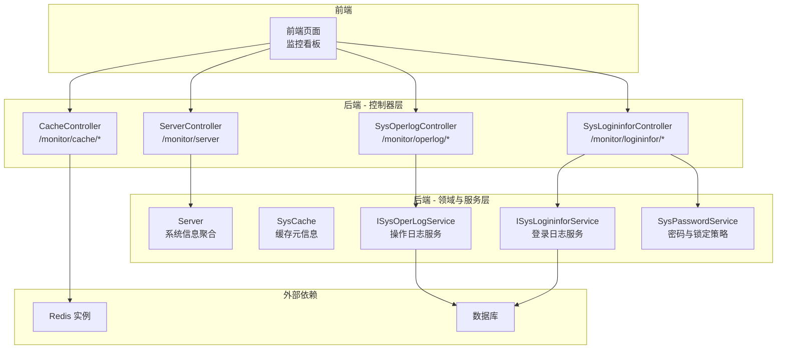
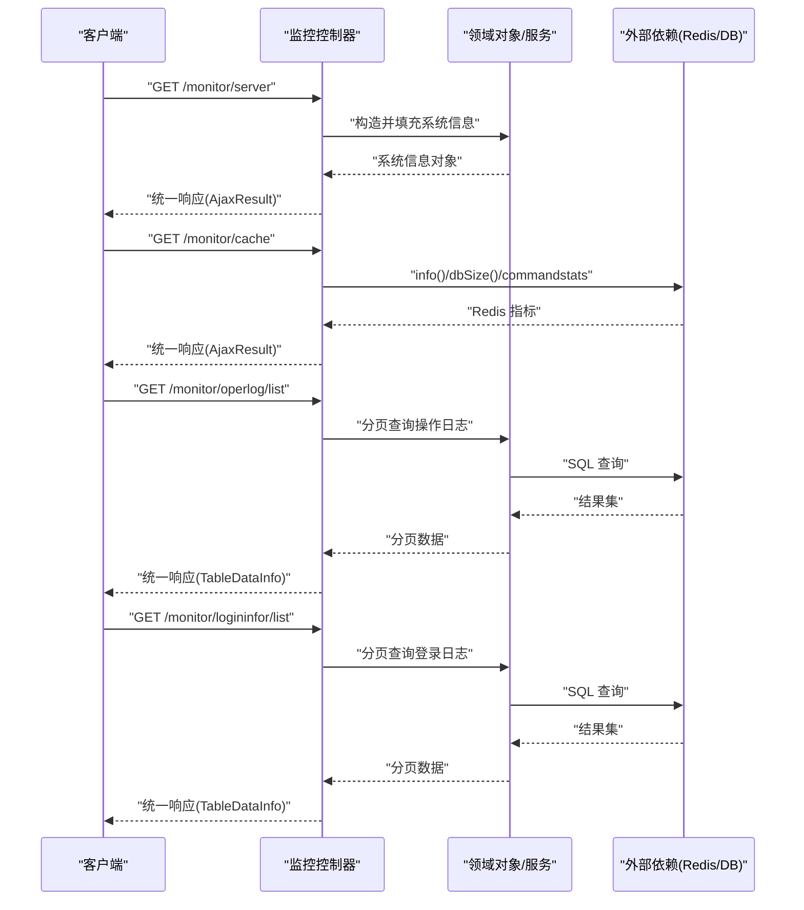
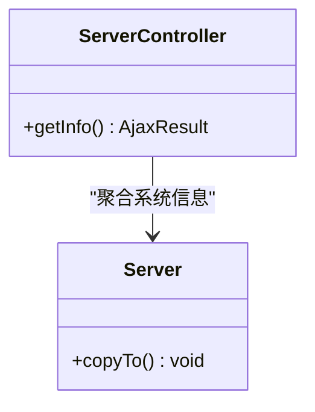
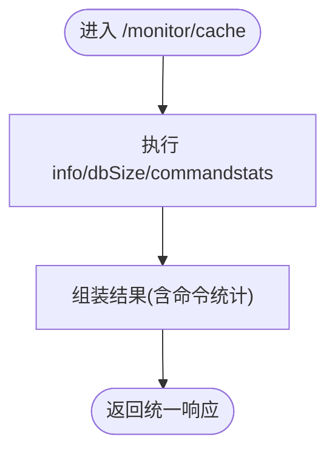
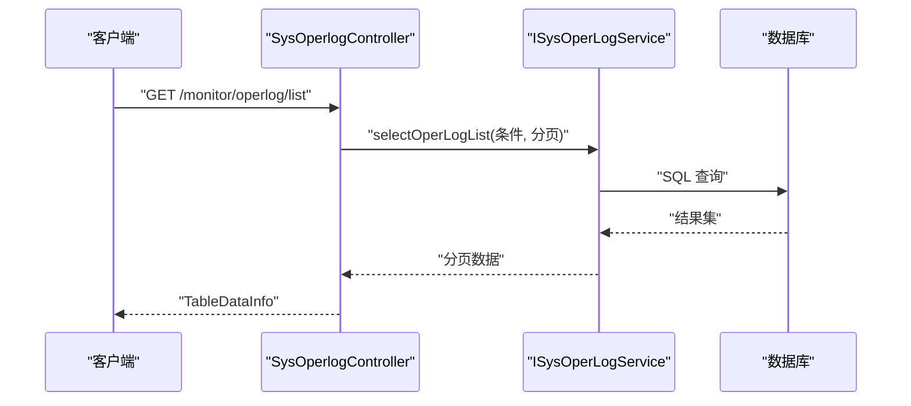
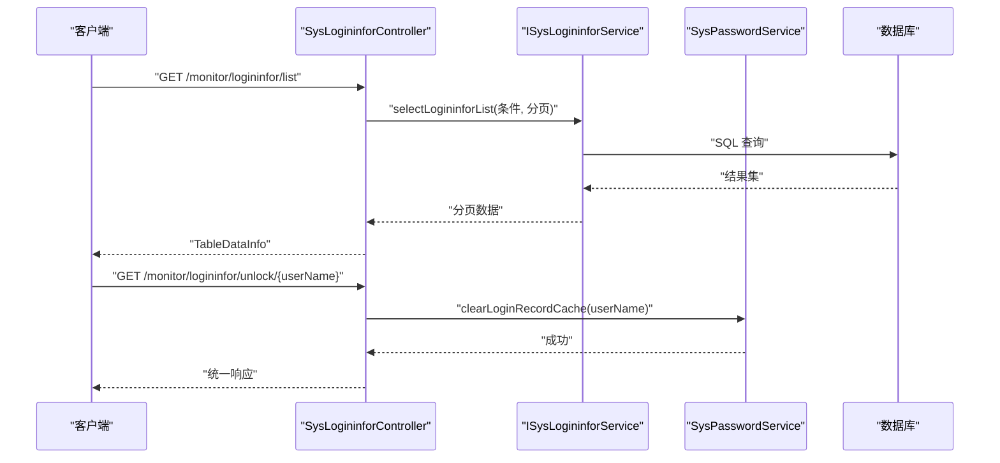
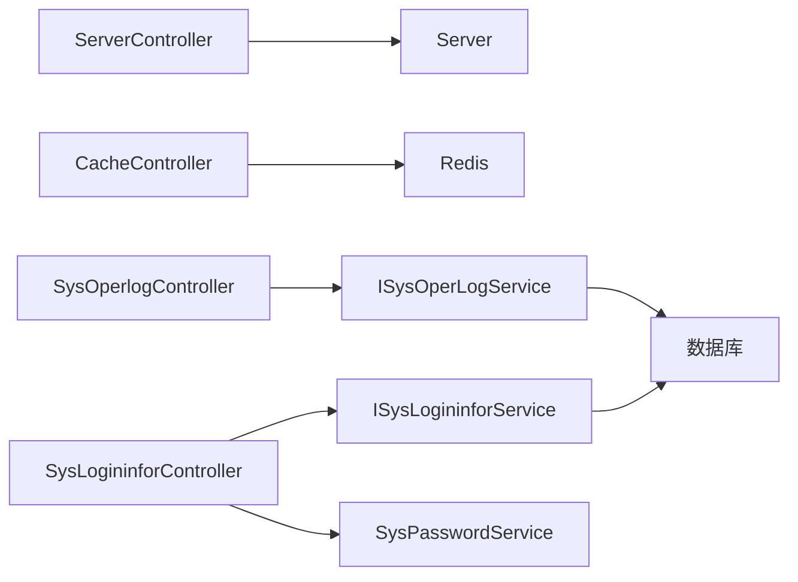

# 监控运维接口

<cite>
**本文引用的文件**   
- [ServerController.java](file://PezMax-Backend/ruoyi-admin/src/main/java/com/ruoyi/web/controller/monitor/ServerController.java)
- [CacheController.java](file://PezMax-Backend/ruoyi-admin/src/main/java/com/ruoyi/web/controller/monitor/CacheController.java)
- [SysOperlogController.java](file://PezMax-Backend/ruoyi-admin/src/main/java/com/ruoyi/web/controller/monitor/SysOperlogController.java)
- [SysLogininforController.java](file://PezMax-Backend/ruoyi-admin/src/main/java/com/ruoyi/web/controller/monitor/SysLogininforController.java)
- [Server.java](file://PezMax-Backend/ruoyi-framework/src/main/java/com/ruoyi/framework/web/domain/Server.java)
- [SysCache.java](file://PezMax-Backend/ruoyi-system/src/main/java/com/ruoyi/system/domain/SysCache.java)
- [ISysOperLogService.java](file://PezMax-Backend/ruoyi-system/src/main/java/com/ruoyi/system/service/ISysOperLogService.java)
- [ISysLogininforService.java](file://PezMax-Backend/ruoyi-system/src/main/java/com/ruoyi/system/service/ISysLogininforService.java)
- [SysPasswordService.java](file://PezMax-Backend/ruoyi-framework/src/main/java/com/ruoyi/framework/web/service/SysPasswordService.java)
</cite>

## 目录
1. [简介](#简介)
2. [项目结构](#项目结构)
3. [核心组件](#核心组件)
4. [架构总览](#架构总览)
5. [详细组件分析](#详细组件分析)
6. [依赖关系分析](#依赖关系分析)
7. [性能考虑](#性能考虑)
8. [故障诊断指南](#故障诊断指南)
9. [结论](#结论)
10. [附录](#附录)

## 简介
本文件面向“监控运维”相关 API 接口的文档化，覆盖以下能力：
- 服务器监控：CPU、内存、磁盘、网络等系统级指标
- 应用监控：JVM 状态、线程池、连接池、GC 统计（通过扩展点与配置接入）
- 缓存监控：Redis 状态、命令统计、键值浏览与清理
- 日志监控：操作日志、登录访问日志的查询、导出、清理与解锁

同时给出指标定义建议、采集频率建议、阈值告警建议、可视化方案、安全与访问控制说明以及性能优化建议。

## 项目结构
后端采用分层架构，监控相关控制器位于 ruoyi-admin 模块的 monitor 包下；数据模型与服务层分别位于 framework 与 system 模块。

图表来源
- [ServerController.java:15-26](file://PezMax-Backend/ruoyi-admin/src/main/java/com/ruoyi/web/controller/monitor/ServerController.java#L15-L26)
- [CacheController.java:30-71](file://PezMax-Backend/ruoyi-admin/src/main/java/com/ruoyi/web/controller/monitor/CacheController.java#L30-L71)
- [SysOperlogController.java:27-41](file://PezMax-Backend/ruoyi-admin/src/main/java/com/ruoyi/web/controller/monitor/SysOperlogController.java#L27-L41)
- [SysLogininforController.java:28-45](file://PezMax-Backend/ruoyi-admin/src/main/java/com/ruoyi/web/controller/monitor/SysLogininforController.java#L28-L45)
- [Server.java](file://PezMax-Backend/ruoyi-framework/src/main/java/com/ruoyi/framework/web/domain/Server.java)
- [SysCache.java](file://PezMax-Backend/ruoyi-system/src/main/java/com/ruoyi/system/domain/SysCache.java)
- [ISysOperLogService.java](file://PezMax-Backend/ruoyi-system/src/main/java/com/ruoyi/system/service/ISysOperLogService.java)
- [ISysLogininforService.java](file://PezMax-Backend/ruoyi-system/src/main/java/com/ruoyi/system/service/ISysLogininforService.java)
- [SysPasswordService.java](file://PezMax-Backend/ruoyi-framework/src/main/java/com/ruoyi/framework/web/service/SysPasswordService.java)

章节来源
- [ServerController.java:15-26](file://PezMax-Backend/ruoyi-admin/src/main/java/com/ruoyi/web/controller/monitor/ServerController.java#L15-L26)
- [CacheController.java:30-71](file://PezMax-Backend/ruoyi-admin/src/main/java/com/ruoyi/web/controller/monitor/CacheController.java#L30-L71)
- [SysOperlogController.java:27-41](file://PezMax-Backend/ruoyi-admin/src/main/java/com/ruoyi/web/controller/monitor/SysOperlogController.java#L27-L41)
- [SysLogininforController.java:28-45](file://PezMax-Backend/ruoyi-admin/src/main/java/com/ruoyi/web/controller/monitor/SysLogininforController.java#L28-L45)

## 核心组件
- 服务器监控控制器：提供系统资源概览（CPU、内存、磁盘、网络等），由 Server 对象聚合返回。
- 缓存监控控制器：对接 Redis，提供 info、dbSize、命令统计、键名列表、键值读取与批量清理。
- 操作日志控制器：分页查询、导出 Excel、删除、清空。
- 登录日志控制器：分页查询、导出 Excel、删除、清空、账户解锁。

章节来源
- [ServerController.java:15-26](file://PezMax-Backend/ruoyi-admin/src/main/java/com/ruoyi/web/controller/monitor/ServerController.java#L15-L26)
- [CacheController.java:30-121](file://PezMax-Backend/ruoyi-admin/src/main/java/com/ruoyi/web/controller/monitor/CacheController.java#L30-L121)
- [SysOperlogController.java:27-69](file://PezMax-Backend/ruoyi-admin/src/main/java/com/ruoyi/web/controller/monitor/SysOperlogController.java#L27-L69)
- [SysLogininforController.java:28-82](file://PezMax-Backend/ruoyi-admin/src/main/java/com/ruoyi/web/controller/monitor/SysLogininforController.java#L28-L82)

## 架构总览
监控 API 的请求链路如下：前端调用控制器 → 控制器校验权限并执行业务逻辑 → 访问外部依赖（Redis/DB）→ 返回统一响应体。

图表来源
- [ServerController.java:19-26](file://PezMax-Backend/ruoyi-admin/src/main/java/com/ruoyi/web/controller/monitor/ServerController.java#L19-L26)
- [CacheController.java:48-71](file://PezMax-Backend/ruoyi-admin/src/main/java/com/ruoyi/web/controller/monitor/CacheController.java#L48-L71)
- [SysOperlogController.java:34-41](file://PezMax-Backend/ruoyi-admin/src/main/java/com/ruoyi/web/controller/monitor/SysOperlogController.java#L34-L41)
- [SysLogininforController.java:38-45](file://PezMax-Backend/ruoyi-admin/src/main/java/com/ruoyi/web/controller/monitor/SysLogininforController.java#L38-L45)

## 详细组件分析

### 服务器监控接口
- 基础信息
  - 路径：GET /monitor/server
  - 权限：需要具备“monitor:server:list”权限
  - 功能：返回当前服务器的运行概况（CPU、内存、磁盘、网络等）
  - 返回：统一响应体，包含系统信息对象
- 指标定义建议
  - CPU：使用率、负载（1/5/15分钟）、进程数
  - 内存：已用/总量、堆/非堆使用、交换分区
  - 磁盘：各挂载点使用率、剩余空间
  - 网络：入/出流量、连接数
- 数据采集频率建议
  - 前端轮询：10~30秒一次
  - 服务端：按需计算，避免频繁系统调用
- 性能阈值建议
  - CPU 使用率持续 > 80% 超过 5 分钟
  - 内存使用率 > 85% 或 GC 频繁
  - 磁盘使用率 > 90%
  - 网络丢包/错误率异常升高
- 可视化建议
  - 折线图展示趋势，柱状图展示分布，仪表盘展示实时占比
- 告警规则建议
  - 基于时间窗口的连续超限触发告警
  - 支持分级告警（警告/严重）

图表来源
- [ServerController.java:19-26](file://PezMax-Backend/ruoyi-admin/src/main/java/com/ruoyi/web/controller/monitor/ServerController.java#L19-L26)
- [Server.java](file://PezMax-Backend/ruoyi-framework/src/main/java/com/ruoyi/framework/web/domain/Server.java)

章节来源
- [ServerController.java:15-26](file://PezMax-Backend/ruoyi-admin/src/main/java/com/ruoyi/web/controller/monitor/ServerController.java#L15-L26)

### 缓存监控接口（Redis）
- 基础信息
  - 路径前缀：/monitor/cache
  - 权限：需要具备“monitor:cache:list”权限
  - 主要能力：
    - GET /monitor/cache：获取 Redis info、dbSize、命令统计
    - GET /monitor/cache/getNames：获取内置缓存名称列表
    - GET /monitor/cache/getKeys/{cacheName}：按前缀列出键
    - GET /monitor/cache/getValue/{cacheName}/{cacheKey}：读取指定键值
    - DELETE /monitor/cache/clearCacheName/{cacheName}：按前缀清理
    - DELETE /monitor/cache/clearCacheKey/{cacheKey}：清理单个键
    - DELETE /monitor/cache/clearCacheAll：清理全部键
- 指标定义建议
  - Redis 版本、持久化状态、内存使用、连接数
  - 命令调用次数与耗时（来自 commandstats）
  - 命中率（需结合业务键设计进行估算）
- 数据采集频率建议
  - 概览指标：10~30秒
  - 键扫描与全量清理：谨慎使用，生产环境不建议高频
- 性能阈值建议
  - 内存碎片率过高、慢查询增多、主从延迟增大
  - keys 命令在大库中可能阻塞，建议使用 scan 替代
- 可视化建议
  - 饼图展示命令调用分布，折线图展示内存与连接趋势
- 告警规则建议
  - 内存接近上限、连接数突增、慢命令比例上升

图表来源
- [CacheController.java:48-71](file://PezMax-Backend/ruoyi-admin/src/main/java/com/ruoyi/web/controller/monitor/CacheController.java#L48-L71)

章节来源
- [CacheController.java:30-121](file://PezMax-Backend/ruoyi-admin/src/main/java/com/ruoyi/web/controller/monitor/CacheController.java#L30-L121)
- [SysCache.java](file://PezMax-Backend/ruoyi-system/src/main/java/com/ruoyi/system/domain/SysCache.java)

### 操作日志接口
- 基础信息
  - 路径前缀：/monitor/operlog
  - 权限：
    - 列表：monitor:operlog:list
    - 导出：monitor:operlog:export
    - 删除/清理：monitor:operlog:remove
  - 主要能力：
    - GET /monitor/operlog/list：分页查询
    - POST /monitor/operlog/export：导出 Excel
    - DELETE /monitor/operlog/{operIds}：批量删除
    - DELETE /monitor/operlog/clean：清空历史
- 指标定义建议
  - 记录维度：用户、模块、方法、IP、耗时、状态、错误信息等
- 数据采集频率建议
  - 写入：同步或异步落库（建议异步）
  - 查询：分页限制条数，避免大结果集
- 性能阈值建议
  - 单页最大条数限制（如 200）
  - 导出任务限流与超时保护
- 可视化建议
  - 表格+筛选器，支持按时间范围、用户、模块过滤
- 告警规则建议
  - 错误日志占比突增、异常耗时请求增多

图表来源
- [SysOperlogController.java:34-41](file://PezMax-Backend/ruoyi-admin/src/main/java/com/ruoyi/web/controller/monitor/SysOperlogController.java#L34-L41)
- [ISysOperLogService.java](file://PezMax-Backend/ruoyi-system/src/main/java/com/ruoyi/system/service/ISysOperLogService.java)

章节来源
- [SysOperlogController.java:27-69](file://PezMax-Backend/ruoyi-admin/src/main/java/com/ruoyi/web/controller/monitor/SysOperlogController.java#L27-L69)

### 登录日志接口
- 基础信息
  - 路径前缀：/monitor/logininfor
  - 权限：
    - 列表：monitor:logininfor:list
    - 导出：monitor:logininfor:export
    - 删除/清理：monitor:logininfor:remove
    - 解锁：monitor:logininfor:unlock
  - 主要能力：
    - GET /monitor/logininfor/list：分页查询
    - POST /monitor/logininfor/export：导出 Excel
    - DELETE /monitor/logininfor/{infoIds}：批量删除
    - DELETE /monitor/logininfor/clean：清空历史
    - GET /monitor/logininfor/unlock/{userName}：清除登录失败计数并解锁
- 指标定义建议
  - 登录成功/失败次数、失败原因、来源 IP、设备信息
- 数据采集频率建议
  - 写入：每次登录尝试后记录
  - 查询：分页限制，避免全表扫描
- 性能阈值建议
  - 失败次数阈值触发临时锁定（由密码服务管理）
- 可视化建议
  - 登录成功率趋势、失败原因分布、Top 失败用户/IP
- 告警规则建议
  - 短时间大量失败登录、同一账号多次失败

图表来源
- [SysLogininforController.java:38-45](file://PezMax-Backend/ruoyi-admin/src/main/java/com/ruoyi/web/controller/monitor/SysLogininforController.java#L38-L45)
- [SysLogininforController.java:74-81](file://PezMax-Backend/ruoyi-admin/src/main/java/com/ruoyi/web/controller/monitor/SysLogininforController.java#L74-L81)
- [ISysLogininforService.java](file://PezMax-Backend/ruoyi-system/src/main/java/com/ruoyi/system/service/ISysLogininforService.java)
- [SysPasswordService.java](file://PezMax-Backend/ruoyi-framework/src/main/java/com/ruoyi/framework/web/service/SysPasswordService.java)

章节来源
- [SysLogininforController.java:28-82](file://PezMax-Backend/ruoyi-admin/src/main/java/com/ruoyi/web/controller/monitor/SysLogininforController.java#L28-L82)

### 应用监控接口（扩展建议）
- 现状说明
  - 仓库未直接暴露 JVM、线程池、连接池、GC 统计的控制器
- 扩展建议
  - 新增控制器 /monitor/app，聚合 Spring Boot Actuator 端点或自定义指标
  - 指标建议：
    - JVM：堆/非堆内存、GC 次数与耗时、类加载数
    - 线程池：活跃/队列长度/拒绝次数
    - 连接池：活跃/空闲/等待/创建失败
    - GC：Young/Old GC 次数与耗时
  - 采集频率：10~30秒
  - 阈值建议：根据压测基线设定，关注持续增长与突变
  - 可视化：折线图、热力图、分位数曲线
  - 告警：GC 停顿过长、连接池耗尽、线程池饱和

[本节为概念性扩展建议，不直接分析具体文件]

## 依赖关系分析
- 控制器到领域对象/服务
  - ServerController 依赖 Server 聚合系统信息
  - CacheController 依赖 RedisTemplate 直接与 Redis 交互
  - SysOperlogController 依赖 ISysOperLogService 访问数据库
  - SysLogininforController 依赖 ISysLogininforService 与 SysPasswordService
- 外部依赖
  - Redis：缓存监控的核心依赖
  - 数据库：日志持久化存储

图表来源
- [ServerController.java:19-26](file://PezMax-Backend/ruoyi-admin/src/main/java/com/ruoyi/web/controller/monitor/ServerController.java#L19-L26)
- [CacheController.java:34-71](file://PezMax-Backend/ruoyi-admin/src/main/java/com/ruoyi/web/controller/monitor/CacheController.java#L34-L71)
- [SysOperlogController.java:31-41](file://PezMax-Backend/ruoyi-admin/src/main/java/com/ruoyi/web/controller/monitor/SysOperlogController.java#L31-L41)
- [SysLogininforController.java:32-45](file://PezMax-Backend/ruoyi-admin/src/main/java/com/ruoyi/web/controller/monitor/SysLogininforController.java#L32-L45)

章节来源
- [ServerController.java:15-26](file://PezMax-Backend/ruoyi-admin/src/main/java/com/ruoyi/web/controller/monitor/ServerController.java#L15-L26)
- [CacheController.java:30-121](file://PezMax-Backend/ruoyi-admin/src/main/java/com/ruoyi/web/controller/monitor/CacheController.java#L30-L121)
- [SysOperlogController.java:27-69](file://PezMax-Backend/ruoyi-admin/src/main/java/com/ruoyi/web/controller/monitor/SysOperlogController.java#L27-L69)
- [SysLogininforController.java:28-82](file://PezMax-Backend/ruoyi-admin/src/main/java/com/ruoyi/web/controller/monitor/SysLogininforController.java#L28-L82)

## 性能考虑
- 服务器监控
  - 避免在热点路径重复采集系统指标，可引入本地短时缓存
- 缓存监控
  - 慎用 keys 命令，生产环境建议改用 scan；全量清理仅在维护窗口执行
  - 对命令统计采样做节流，避免频繁调用
- 日志监控
  - 分页查询必须带索引字段（如时间、用户、模块）
  - 导出任务异步化，限制单次导出大小
- 通用
  - 统一响应体序列化开销控制
  - 接口限流与熔断保护

[本节为通用性能建议，不直接分析具体文件]

## 故障诊断指南
- 常见问题定位
  - 无法访问监控接口：检查权限标识是否授予（如 monitor:server:list、monitor:cache:list 等）
  - Redis 指标为空或报错：检查 Redis 连通性与权限，确认 info/commandstats 可用
  - 日志查询缓慢：检查分页参数与 SQL 索引，避免无索引全表扫描
  - 登录失败过多导致锁定：使用解锁接口清除失败计数
- 排查步骤
  - 查看统一响应体中的错误码与消息
  - 核对权限配置与角色分配
  - 检查外部依赖（Redis/DB）健康状态
  - 开启调试日志，定位异常堆栈

章节来源
- [SysLogininforController.java:74-81](file://PezMax-Backend/ruoyi-admin/src/main/java/com/ruoyi/web/controller/monitor/SysLogininforController.java#L74-L81)
- [CacheController.java:48-71](file://PezMax-Backend/ruoyi-admin/src/main/java/com/ruoyi/web/controller/monitor/CacheController.java#L48-L71)

## 结论
本项目已提供服务器、缓存、操作日志与登录日志的基础监控能力。建议在现有基础上扩展应用监控（JVM/线程池/连接池/GC），并结合统一的可视化与告警平台形成闭环运维体系。同时强化数据安全与访问控制，确保监控数据的机密性与完整性。

[本节为总结性内容，不直接分析具体文件]

## 附录

### 接口清单与安全要求
- 服务器监控
  - GET /monitor/server
  - 权限：monitor:server:list
- 缓存监控
  - GET /monitor/cache
  - GET /monitor/cache/getNames
  - GET /monitor/cache/getKeys/{cacheName}
  - GET /monitor/cache/getValue/{cacheName}/{cacheKey}
  - DELETE /monitor/cache/clearCacheName/{cacheName}
  - DELETE /monitor/cache/clearCacheKey/{cacheKey}
  - DELETE /monitor/cache/clearCacheAll
  - 权限：monitor:cache:list
- 操作日志
  - GET /monitor/operlog/list
  - POST /monitor/operlog/export
  - DELETE /monitor/operlog/{operIds}
  - DELETE /monitor/operlog/clean
  - 权限：monitor:operlog:list/export/remove
- 登录日志
  - GET /monitor/logininfor/list
  - POST /monitor/logininfor/export
  - DELETE /monitor/logininfor/{infoIds}
  - DELETE /monitor/logininfor/clean
  - GET /monitor/logininfor/unlock/{userName}
  - 权限：monitor:logininfor:list/export/remove/unlock

章节来源
- [ServerController.java:19-26](file://PezMax-Backend/ruoyi-admin/src/main/java/com/ruoyi/web/controller/monitor/ServerController.java#L19-L26)
- [CacheController.java:48-121](file://PezMax-Backend/ruoyi-admin/src/main/java/com/ruoyi/web/controller/monitor/CacheController.java#L48-L121)
- [SysOperlogController.java:34-69](file://PezMax-Backend/ruoyi-admin/src/main/java/com/ruoyi/web/controller/monitor/SysOperlogController.java#L34-L69)
- [SysLogininforController.java:38-82](file://PezMax-Backend/ruoyi-admin/src/main/java/com/ruoyi/web/controller/monitor/SysLogininforController.java#L38-L82)