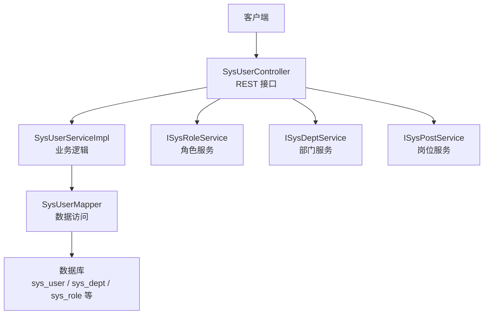
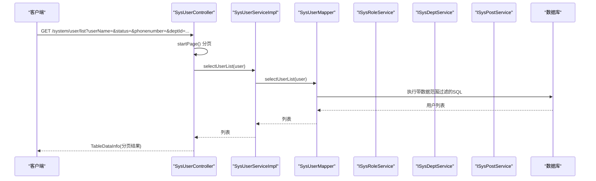
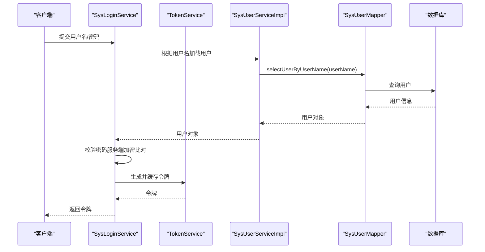
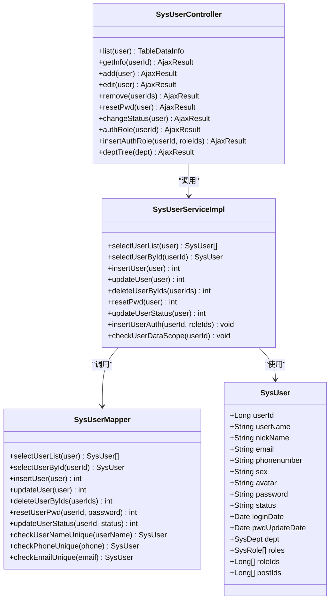
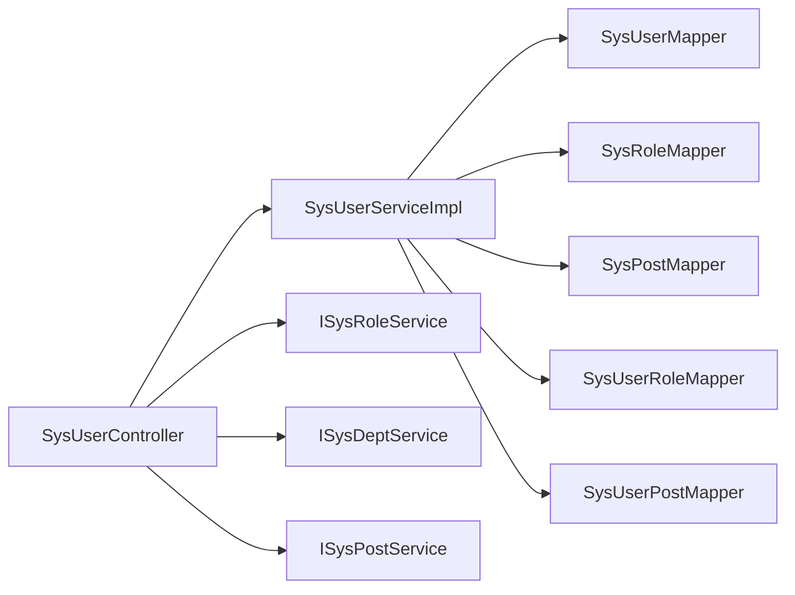

# 用户管理接口

<cite>
**本文引用的文件**   
- [SysUserController.java](file://PezMax-Backend/ruoyi-admin/src/main/java/com/ruoyi/web/controller/system/SysUserController.java)
- [SysUserServiceImpl.java](file://PezMax-Backend/ruoyi-system/src/main/java/com/ruoyi/system/service/impl/SysUserServiceImpl.java)
- [SysUserMapper.java](file://PezMax-Backend/ruoyi-system/src/main/java/com/ruoyi/system/mapper/SysUserMapper.java)
- [SysUserMapper.xml](file://PezMax-Backend/ruoyi-system/src/main/resources/mapper/system/SysUserMapper.xml)
- [SysUser.java](file://PezMax-Backend/ruoyi-common/src/main/java/com/ruoyi/common/core/domain/entity/SysUser.java)
- [SysLoginService.java](file://PezMax-Backend/ruoyi-framework/src/main/java/com/ruoyi/framework/web/service/SysLoginService.java)
- [TokenService.java](file://PezMax-Backend/ruoyi-framework/src/main/java/com/ruoyi/framework/web/service/TokenService.java)
</cite>

## 目录
1. [简介](#简介)
2. [项目结构](#项目结构)
3. [核心组件](#核心组件)
4. [架构总览](#架构总览)
5. [详细组件分析](#详细组件分析)
6. [依赖关系分析](#依赖关系分析)
7. [性能考虑](#性能考虑)
8. [故障排查指南](#故障排查指南)
9. [结论](#结论)
10. [附录](#附录)

## 简介
本文件面向后端“用户管理”相关 API，覆盖以下能力：
- 用户基本信息管理：新增、修改、删除（含批量）、查询（含分页与条件筛选）
- 用户状态控制：启用/禁用、密码重置
- 用户角色分配：查看已授权角色、为用户授权角色
- 用户部门管理：获取部门树
- 认证与安全：登录认证流程、密码加密存储、会话与令牌管理
- 数据权限与审计：基于角色的数据范围过滤、操作日志记录
- 请求响应示例与错误码说明

## 项目结构
用户管理功能采用典型的分层架构：
- 控制器层：暴露 REST 接口，负责参数校验、权限注解、统一返回封装
- 服务层：业务编排、事务控制、数据权限校验、唯一性校验等
- 持久层：MyBatis Mapper 接口与 XML SQL 定义
- 实体模型：用户对象及关联的部门、角色等

图示来源
- [SysUserController.java:1-257](file://PezMax-Backend/ruoyi-admin/src/main/java/com/ruoyi/web/controller/system/SysUserController.java#L1-L257)
- [SysUserServiceImpl.java:1-566](file://PezMax-Backend/ruoyi-system/src/main/java/com/ruoyi/system/service/impl/SysUserServiceImpl.java#L1-L566)
- [SysUserMapper.java:1-148](file://PezMax-Backend/ruoyi-system/src/main/java/com/ruoyi/system/mapper/SysUserMapper.java#L1-L148)
- [SysUserMapper.xml:1-227](file://PezMax-Backend/ruoyi-system/src/main/resources/mapper/system/SysUserMapper.xml#L1-L227)

章节来源
- [SysUserController.java:1-257](file://PezMax-Backend/ruoyi-admin/src/main/java/com/ruoyi/web/controller/system/SysUserController.java#L1-L257)
- [SysUserServiceImpl.java:1-566](file://PezMax-Backend/ruoyi-system/src/main/java/com/ruoyi/system/service/impl/SysUserServiceImpl.java#L1-L566)
- [SysUserMapper.java:1-148](file://PezMax-Backend/ruoyi-system/src/main/java/com/ruoyi/system/mapper/SysUserMapper.java#L1-L148)
- [SysUserMapper.xml:1-227](file://PezMax-Backend/ruoyi-system/src/main/resources/mapper/system/SysUserMapper.xml#L1-L227)

## 核心组件
- SysUserController：提供用户管理的 REST 接口，包含列表、详情、新增、修改、删除、导入导出、状态变更、密码重置、角色授权、部门树等。
- SysUserServiceImpl：实现用户业务逻辑，包括唯一性校验、数据权限校验、事务性增删改、批量处理、导入逻辑等。
- SysUserMapper + SysUserMapper.xml：定义用户表及相关联表的 SQL 映射，支持分页、条件查询、唯一性检查、更新登录信息等。
- SysUser：用户领域模型，包含账号、昵称、邮箱、手机、性别、头像、密码、状态、删除标志、最后登录信息、部门与角色集合等。

章节来源
- [SysUserController.java:1-257](file://PezMax-Backend/ruoyi-admin/src/main/java/com/ruoyi/web/controller/system/SysUserController.java#L1-L257)
- [SysUserServiceImpl.java:1-566](file://PezMax-Backend/ruoyi-system/src/main/java/com/ruoyi/system/service/impl/SysUserServiceImpl.java#L1-L566)
- [SysUserMapper.java:1-148](file://PezMax-Backend/ruoyi-system/src/main/java/com/ruoyi/system/mapper/SysUserMapper.java#L1-L148)
- [SysUserMapper.xml:1-227](file://PezMax-Backend/ruoyi-system/src/main/resources/mapper/system/SysUserMapper.xml#L1-L227)
- [SysUser.java:1-337](file://PezMax-Backend/ruoyi-common/src/main/java/com/ruoyi/common/core/domain/entity/SysUser.java#L1-L337)

## 架构总览
下图展示用户管理接口的调用链路与关键安全点（权限、数据范围、审计）。

图示来源
- [SysUserController.java:59-66](file://PezMax-Backend/ruoyi-admin/src/main/java/com/ruoyi/web/controller/system/SysUserController.java#L59-L66)
- [SysUserServiceImpl.java:75-80](file://PezMax-Backend/ruoyi-system/src/main/java/com/ruoyi/system/service/impl/SysUserServiceImpl.java#L75-L80)
- [SysUserMapper.xml:60-87](file://PezMax-Backend/ruoyi-system/src/main/resources/mapper/system/SysUserMapper.xml#L60-L87)

## 详细组件分析

### 接口清单与使用说明
- 基础路径：/system/user
- 通用返回：AjaxResult（成功/失败封装），列表接口返回 TableDataInfo（分页）

1) 获取用户列表（分页+条件筛选）
- 方法：GET /system/user/list
- 权限：system:user:list
- 查询参数（建议以表单或查询字符串传递）：
  - userName：模糊匹配
  - status：账号状态（0正常/1停用）
  - phonenumber：模糊匹配
  - deptId：按部门及其子部门筛选
  - params.beginTime/params.endTime：创建时间范围
- 返回：TableDataInfo（rows 为 SysUser 列表，包含 deptName、leader 等扩展字段）
- 数据权限：通过 @DataScope 在 SQL 中注入数据范围过滤

章节来源
- [SysUserController.java:59-66](file://PezMax-Backend/ruoyi-admin/src/main/java/com/ruoyi/web/controller/system/SysUserController.java#L59-L66)
- [SysUserServiceImpl.java:75-80](file://PezMax-Backend/ruoyi-system/src/main/java/com/ruoyi/system/service/impl/SysUserServiceImpl.java#L75-L80)
- [SysUserMapper.xml:60-87](file://PezMax-Backend/ruoyi-system/src/main/resources/mapper/system/SysUserMapper.xml#L60-L87)

2) 根据用户编号获取详细信息
- 方法：GET /system/user/{userId}
- 权限：system:user:query
- 返回：
  - data：SysUser
  - postIds：岗位ID数组
  - roleIds：角色ID数组
  - roles：可选角色列表（管理员可见全部，非管理员过滤掉管理员角色）
  - posts：所有岗位列表
- 注意：会进行数据权限校验

章节来源
- [SysUserController.java:100-117](file://PezMax-Backend/ruoyi-admin/src/main/java/com/ruoyi/web/controller/system/SysUserController.java#L100-L117)
- [SysUserServiceImpl.java:126-130](file://PezMax-Backend/ruoyi-system/src/main/java/com/ruoyi/system/service/impl/SysUserServiceImpl.java#L126-L130)

3) 新增用户
- 方法：POST /system/user
- 权限：system:user:add
- 请求体：SysUser（必填字段由 Bean Validation 校验；密码在服务端加密后落库）
- 业务规则：
  - 用户名、手机号、邮箱唯一性校验
  - 部门与角色数据权限校验
  - 自动设置 createBy
- 返回：toAjax 封装的结果

章节来源
- [SysUserController.java:122-144](file://PezMax-Backend/ruoyi-admin/src/main/java/com/ruoyi/web/controller/system/SysUserController.java#L122-L144)
- [SysUserServiceImpl.java:260-271](file://PezMax-Backend/ruoyi-system/src/main/java/com/ruoyi/system/service/impl/SysUserServiceImpl.java#L260-L271)
- [SysUserMapper.xml:146-178](file://PezMax-Backend/ruoyi-system/src/main/resources/mapper/system/SysUserMapper.xml#L146-L178)

4) 修改用户
- 方法：PUT /system/user
- 权限：system:user:edit
- 业务规则：
  - 禁止修改超级管理员
  - 数据权限校验
  - 唯一性校验（用户名、手机号、邮箱）
  - 自动设置 updateBy
- 返回：toAjax 封装的结果

章节来源
- [SysUserController.java:149-172](file://PezMax-Backend/ruoyi-admin/src/main/java/com/ruoyi/web/controller/system/SysUserController.java#L149-L172)
- [SysUserServiceImpl.java:292-305](file://PezMax-Backend/ruoyi-system/src/main/java/com/ruoyi/system/service/impl/SysUserServiceImpl.java#L292-L305)
- [SysUserMapper.xml:180-198](file://PezMax-Backend/ruoyi-system/src/main/resources/mapper/system/SysUserMapper.xml#L180-L198)

5) 删除用户（批量）
- 方法：DELETE /system/user/{userIds}
- 权限：system:user:remove
- 规则：当前登录用户不能删除自己；批量删除前逐条做权限与保护校验
- 返回：toAjax 封装的结果

章节来源
- [SysUserController.java:177-187](file://PezMax-Backend/ruoyi-admin/src/main/java/com/ruoyi/web/controller/system/SysUserController.java#L177-L187)
- [SysUserServiceImpl.java:475-489](file://PezMax-Backend/ruoyi-system/src/main/java/com/ruoyi/system/service/impl/SysUserServiceImpl.java#L475-L489)
- [SysUserMapper.xml:220-225](file://PezMax-Backend/ruoyi-system/src/main/resources/mapper/system/SysUserMapper.xml#L220-L225)

6) 重置密码
- 方法：PUT /system/user/resetPwd
- 权限：system:user:resetPwd
- 规则：对传入密码进行加密后更新，并记录 updateBy
- 返回：toAjax 封装的结果

章节来源
- [SysUserController.java:192-202](file://PezMax-Backend/ruoyi-admin/src/main/java/com/ruoyi/web/controller/system/SysUserController.java#L192-L202)
- [SysUserServiceImpl.java:377-381](file://PezMax-Backend/ruoyi-system/src/main/java/com/ruoyi/system/service/impl/SysUserServiceImpl.java#L377-L381)
- [SysUserMapper.xml:212-214](file://PezMax-Backend/ruoyi-system/src/main/resources/mapper/system/SysUserMapper.xml#L212-L214)

7) 状态修改（启用/禁用）
- 方法：PUT /system/user/changeStatus
- 权限：system:user:edit
- 规则：仅允许有权限的用户操作目标用户，且需通过数据权限校验
- 返回：toAjax 封装的结果

章节来源
- [SysUserController.java:207-216](file://PezMax-Backend/ruoyi-admin/src/main/java/com/ruoyi/web/controller/system/SysUserController.java#L207-L216)
- [SysUserServiceImpl.java:327-331](file://PezMax-Backend/ruoyi-system/src/main/java/com/ruoyi/system/service/impl/SysUserServiceImpl.java#L327-L331)
- [SysUserMapper.xml:200-202](file://PezMax-Backend/ruoyi-system/src/main/resources/mapper/system/SysUserMapper.xml#L200-L202)

8) 根据用户编号获取授权角色
- 方法：GET /system/user/authRole/{userId}
- 权限：system:user:query
- 返回：user 与 roles（非管理员过滤掉管理员角色）

章节来源
- [SysUserController.java:221-231](file://PezMax-Backend/ruoyi-admin/src/main/java/com/ruoyi/web/controller/system/SysUserController.java#L221-L231)

9) 用户授权角色
- 方法：PUT /system/user/authRole
- 权限：system:user:edit
- 参数：userId, roleIds[]
- 规则：先删除旧关联，再批量插入新角色关联
- 返回：success 封装

章节来源
- [SysUserController.java:236-245](file://PezMax-Backend/ruoyi-admin/src/main/java/com/ruoyi/web/controller/system/SysUserController.java#L236-L245)
- [SysUserServiceImpl.java:314-319](file://PezMax-Backend/ruoyi-system/src/main/java/com/ruoyi/system/service/impl/SysUserServiceImpl.java#L314-L319)

10) 获取部门树列表
- 方法：GET /system/user/deptTree
- 权限：system:user:list
- 返回：部门树结构

章节来源
- [SysUserController.java:250-255](file://PezMax-Backend/ruoyi-admin/src/main/java/com/ruoyi/web/controller/system/SysUserController.java#L250-L255)

11) 导入/导出
- 导出：POST /system/user/export
  - 权限：system:user:export
  - 参数：同列表查询条件
  - 行为：将当前查询结果导出 Excel
- 导入：POST /system/user/importData
  - 权限：system:user:import
  - 参数：file(MultipartFile), updateSupport(boolean)
  - 行为：解析 Excel，存在则按是否支持更新策略处理，默认初始密码从配置项读取并加密保存
- 模板下载：POST /system/user/importTemplate
  - 行为：返回导入模板

章节来源
- [SysUserController.java:68-95](file://PezMax-Backend/ruoyi-admin/src/main/java/com/ruoyi/web/controller/system/SysUserController.java#L68-L95)
- [SysUserServiceImpl.java:499-564](file://PezMax-Backend/ruoyi-system/src/main/java/com/ruoyi/system/service/impl/SysUserServiceImpl.java#L499-L564)

### 用户认证流程与会话管理
- 登录入口：由框架提供的登录服务完成认证与令牌签发
- 令牌管理：使用 TokenService 维护会话令牌（如 Redis 缓存）
- 鉴权：后续请求携带令牌，经过滤器校验后进入业务接口

图示来源
- [SysLoginService.java](file://PezMax-Backend/ruoyi-framework/src/main/java/com/ruoyi/framework/web/service/SysLoginService.java)
- [TokenService.java](file://PezMax-Backend/ruoyi-framework/src/main/java/com/ruoyi/framework/web/service/TokenService.java)
- [SysUserServiceImpl.java:114-118](file://PezMax-Backend/ruoyi-system/src/main/java/com/ruoyi/system/service/impl/SysUserServiceImpl.java#L114-L118)
- [SysUserMapper.xml:124-127](file://PezMax-Backend/ruoyi-system/src/main/resources/mapper/system/SysUserMapper.xml#L124-L127)

### 密码加密与存储
- 新增/重置密码时，服务端对明文密码进行加密后再写入数据库
- 登录时与服务端加密后的密文进行比对
- 密码字段在 JSON 序列化时设置为只写，避免泄露

章节来源
- [SysUserController.java:142-143](file://PezMax-Backend/ruoyi-admin/src/main/java/com/ruoyi/web/controller/system/SysUserController.java#L142-L143)
- [SysUserController.java:199-201](file://PezMax-Backend/ruoyi-admin/src/main/java/com/ruoyi/web/controller/system/SysUserController.java#L199-L201)
- [SysUserServiceImpl.java:520-522](file://PezMax-Backend/ruoyi-system/src/main/java/com/ruoyi/system/service/impl/SysUserServiceImpl.java#L520-L522)
- [SysUser.java:200-209](file://PezMax-Backend/ruoyi-common/src/main/java/com/ruoyi/common/core/domain/entity/SysUser.java#L200-L209)

### 数据权限控制
- 列表查询通过 @DataScope 注解在 SQL 中动态注入数据范围过滤条件，限制用户只能看到其权限范围内的数据
- 修改/删除等操作通过 checkUserDataScope 再次校验目标资源是否在权限范围内

章节来源
- [SysUserServiceImpl.java:75-80](file://PezMax-Backend/ruoyi-system/src/main/java/com/ruoyi/system/service/impl/SysUserServiceImpl.java#L75-L80)
- [SysUserServiceImpl.java:239-252](file://PezMax-Backend/ruoyi-system/src/main/java/com/ruoyi/system/service/impl/SysUserServiceImpl.java#L239-L252)
- [SysUserMapper.xml:86](file://PezMax-Backend/ruoyi-system/src/main/resources/mapper/system/SysUserMapper.xml#L86)

### 操作审计日志
- 关键接口使用 @Log 注解标注，记录操作标题、业务类型等，便于审计追踪

章节来源
- [SysUserController.java:68-76](file://PezMax-Backend/ruoyi-admin/src/main/java/com/ruoyi/web/controller/system/SysUserController.java#L68-L76)
- [SysUserController.java:78-88](file://PezMax-Backend/ruoyi-admin/src/main/java/com/ruoyi/web/controller/system/SysUserController.java#L78-L88)
- [SysUserController.java:122-144](file://PezMax-Backend/ruoyi-admin/src/main/java/com/ruoyi/web/controller/system/SysUserController.java#L122-L144)
- [SysUserController.java:149-172](file://PezMax-Backend/ruoyi-admin/src/main/java/com/ruoyi/web/controller/system/SysUserController.java#L149-L172)
- [SysUserController.java:177-187](file://PezMax-Backend/ruoyi-admin/src/main/java/com/ruoyi/web/controller/system/SysUserController.java#L177-L187)
- [SysUserController.java:192-202](file://PezMax-Backend/ruoyi-admin/src/main/java/com/ruoyi/web/controller/system/SysUserController.java#L192-L202)
- [SysUserController.java:207-216](file://PezMax-Backend/ruoyi-admin/src/main/java/com/ruoyi/web/controller/system/SysUserController.java#L207-L216)
- [SysUserController.java:236-245](file://PezMax-Backend/ruoyi-admin/src/main/java/com/ruoyi/web/controller/system/SysUserController.java#L236-L245)

### 类关系图（代码级）

图示来源
- [SysUserController.java:1-257](file://PezMax-Backend/ruoyi-admin/src/main/java/com/ruoyi/web/controller/system/SysUserController.java#L1-L257)
- [SysUserServiceImpl.java:1-566](file://PezMax-Backend/ruoyi-system/src/main/java/com/ruoyi/system/service/impl/SysUserServiceImpl.java#L1-L566)
- [SysUserMapper.java:1-148](file://PezMax-Backend/ruoyi-system/src/main/java/com/ruoyi/system/mapper/SysUserMapper.java#L1-L148)
- [SysUser.java:1-337](file://PezMax-Backend/ruoyi-common/src/main/java/com/ruoyi/common/core/domain/entity/SysUser.java#L1-L337)

## 依赖关系分析
- 控制器依赖服务接口：ISysUserService、ISysRoleService、ISysDeptService、ISysPostService
- 服务实现依赖 MyBatis Mapper 与多个关联表（角色、岗位、部门）
- 数据范围通过 AOP 注解在 SQL 层注入，减少业务侵入

图示来源
- [SysUserController.java:1-257](file://PezMax-Backend/ruoyi-admin/src/main/java/com/ruoyi/web/controller/system/SysUserController.java#L1-L257)
- [SysUserServiceImpl.java:1-566](file://PezMax-Backend/ruoyi-system/src/main/java/com/ruoyi/system/service/impl/SysUserServiceImpl.java#L1-L566)

## 性能考虑
- 列表查询使用分页，建议在高频场景下合理设置页大小
- 条件查询利用索引字段（如 user_name、phonenumber、email、dept_id）提升检索效率
- 批量导入时采用分批处理与异常聚合，避免长事务导致锁竞争
- 角色/岗位关联采用批量插入，降低多次往返开销

## 故障排查指南
- 常见错误
  - 账号/手机号/邮箱重复：新增或修改时触发唯一性校验失败
  - 无权限访问：未具备对应权限标识或数据范围不满足
  - 当前用户不可删除：尝试删除自身账户
  - 不允许操作超级管理员：尝试修改或删除管理员
- 定位建议
  - 检查接口权限标识是否正确配置
  - 核对数据范围配置与用户所属部门
  - 查看操作日志与异常堆栈，确认具体失败环节

章节来源
- [SysUserController.java:129-140](file://PezMax-Backend/ruoyi-admin/src/main/java/com/ruoyi/web/controller/system/SysUserController.java#L129-L140)
- [SysUserController.java:158-169](file://PezMax-Backend/ruoyi-admin/src/main/java/com/ruoyi/web/controller/system/SysUserController.java#L158-L169)
- [SysUserController.java:182-186](file://PezMax-Backend/ruoyi-admin/src/main/java/com/ruoyi/web/controller/system/SysUserController.java#L182-L186)
- [SysUserServiceImpl.java:226-232](file://PezMax-Backend/ruoyi-system/src/main/java/com/ruoyi/system/service/impl/SysUserServiceImpl.java#L226-L232)
- [SysUserServiceImpl.java:239-252](file://PezMax-Backend/ruoyi-system/src/main/java/com/ruoyi/system/service/impl/SysUserServiceImpl.java#L239-L252)

## 结论
本用户管理模块遵循清晰的分层设计与安全规范，提供完整的用户生命周期管理与权限控制能力。通过数据范围过滤、操作审计、密码加密等手段，保障系统的安全性与可运维性。建议在实际使用中结合业务需求完善前端交互与错误提示，并对高频接口做好监控与告警。

## 附录

### 请求与响应示例（摘要）
- 列表查询
  - 请求：GET /system/user/list?userName=admin&status=0&phonenumber=138&deptId=100
  - 响应：{ code: 200, msg: "操作成功", rows: [...], total: N }
- 新增用户
  - 请求：POST /system/user { userName, nickName, email, phonenumber, sex, avatar, password, deptId, roleIds[], postIds[] }
  - 响应：{ code: 200, msg: "操作成功" }
- 修改用户
  - 请求：PUT /system/user { userId, ... }
  - 响应：{ code: 200, msg: "操作成功" }
- 删除用户（批量）
  - 请求：DELETE /system/user/1,2,3
  - 响应：{ code: 200, msg: "操作成功" }
- 重置密码
  - 请求：PUT /system/user/resetPwd { userId, password }
  - 响应：{ code: 200, msg: "操作成功" }
- 状态修改
  - 请求：PUT /system/user/changeStatus { userId, status }
  - 响应：{ code: 200, msg: "操作成功" }
- 授权角色
  - 请求：PUT /system/user/authRole?userId=1&roleIds[]=10&roleIds[]=20
  - 响应：{ code: 200, msg: "操作成功" }
- 部门树
  - 请求：GET /system/user/deptTree
  - 响应：{ code: 200, msg: "操作成功", data: [...] }

### 错误码说明（常见）
- 200：操作成功
- 500：服务器内部错误或业务异常
- 403：无权限或数据范围不足
- 401：未登录或令牌无效
- 其他：由全局异常处理器统一封装返回

[本节为通用说明，不直接分析具体文件]