# 系统管理接口

<cite>
**本文引用的文件**   
- [README.md](file://PezMax-Backend/README.md)
- [pezmax.sql](file://PezMax-Backend/sql/pezmax.sql)
</cite>

## 目录
1. [简介](#简介)
2. [项目结构](#项目结构)
3. [核心组件](#核心组件)
4. [架构总览](#架构总览)
5. [详细组件分析](#详细组件分析)
6. [依赖分析](#依赖分析)
7. [性能考虑](#性能考虑)
8. [故障排查指南](#故障排查指南)
9. [结论](#结论)
10. [附录](#附录)

## 简介
本文件面向系统管理员与后端开发者，系统化梳理并说明“系统管理相关 API 接口”的设计与使用说明。内容覆盖：
- 用户管理（管理员用户的增删改查、角色分配）
- 角色管理（角色定义、权限配置、数据范围控制）
- 菜单管理（菜单树构建、动态路由、按钮级权限绑定）
- 部门管理（组织架构维护、数据权限控制）
- RBAC 权限模型实现、数据权限过滤、接口级权限控制
- 系统配置管理、操作日志查询、监控告警接口使用
- 安全策略、审计追踪与合规性要求

本项目基于 RuoYi-Vue 架构进行深度定制，采用 Spring Security + JWT + Redis 的安全体系，结合 MyBatis 持久化与 MySQL 数据库，提供完善的系统管理能力。

## 项目结构
从仓库根目录可见，后端采用多模块组织方式，系统管理相关能力主要分布在以下模块：
- ruoyi-system：系统基础管理（用户、角色、菜单、字典、部门等）
- ruoyi-framework：框架配置与安全拦截（Spring Security、JWT、Redis、全局异常处理等）
- ruoyi-common：通用注解与工具（如 @DataScope、@Log、分页封装、统一响应体等）
- ruoyi-admin：Web 入口与 Controller 层
- ptmj-datum：业务领域（书签、文件、通知等）
- sql：数据库初始化脚本（包含系统表与业务表）

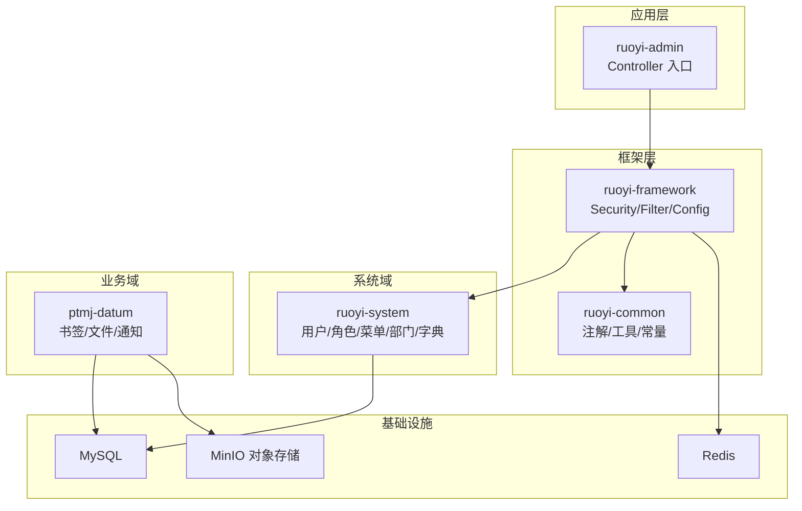

图表来源
- [README.md:76-89](file://PezMax-Backend/README.md#L76-L89)

章节来源
- [README.md:1-105](file://PezMax-Backend/README.md#L1-L105)

## 核心组件
围绕系统管理，核心组件包括：
- 用户管理：用户实体、登录认证、密码策略、状态管理
- 角色管理：角色定义、权限字符串、数据范围、菜单与部门关联
- 菜单管理：菜单树、路由路径、按钮权限标识
- 部门管理：层级组织、负责人、状态、软删除
- 系统配置：键值对配置项，支持内置/自定义类型
- 操作日志：记录关键操作的请求参数、返回结果、耗时与错误信息
- 登录日志：记录登录成功/失败、IP、浏览器、操作系统等信息
- 定时任务：任务调度与执行日志

上述组件的数据模型由数据库脚本定义，涵盖 sys_user、sys_role、sys_menu、sys_dept、sys_config、sys_oper_log、sys_logininfor、sys_job、sys_job_log 等表。

章节来源
- [pezmax.sql:466-481](file://PezMax-Backend/sql/pezmax.sql#L466-L481)
- [pezmax.sql:484-503](file://PezMax-Backend/sql/pezmax.sql#L484-L503)
- [pezmax.sql:604-629](file://PezMax-Backend/sql/pezmax.sql#L604-L629)
- [pezmax.sql:663-688](file://PezMax-Backend/sql/pezmax.sql#L663-L688)
- [pezmax.sql:585-601](file://PezMax-Backend/sql/pezmax.sql#L585-L601)
- [pezmax.sql:546-582](file://PezMax-Backend/sql/pezmax.sql#L546-L582)
- [pezmax.sql:709-728](file://PezMax-Backend/sql/pezmax.sql#L709-L728)
- [pezmax.sql:751-776](file://PezMax-Backend/sql/pezmax.sql#L751-L776)

## 架构总览
系统管理 API 的请求链路遵循典型的分层架构：前端通过 HTTP 调用 Controller，进入框架层的鉴权与拦截器（Spring Security + JWT），随后进入 Service 层执行业务逻辑，最终通过 MyBatis 访问数据库。RBAC 权限校验在框架层完成，数据权限通过注解与 AOP 切面注入 SQL 条件。

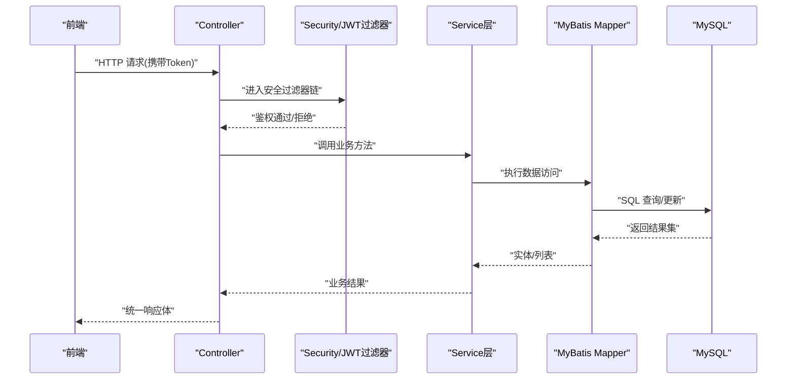

图表来源
- [README.md:17-21](file://PezMax-Backend/README.md#L17-L21)
- [pezmax.sql:604-629](file://PezMax-Backend/sql/pezmax.sql#L604-L629)

## 详细组件分析

### 用户管理接口
- 功能范围
  - 管理员用户新增、修改、删除、查询（含分页与条件筛选）
  - 用户状态管理（启用/停用）、密码重置、头像更新
  - 用户与角色、岗位、部门的关联关系维护
- 关键数据模型
  - 用户表：用户ID、账号、昵称、邮箱、手机号、性别、头像、密码、状态、最后登录信息、创建/更新时间等
  - 用户-角色关联表：用户ID与角色ID的映射
  - 用户-岗位关联表：用户ID与岗位ID的映射
- 接口设计建议
  - 列表查询：支持按用户名、状态、部门、时间范围等条件筛选，返回分页数据
  - 详情获取：根据用户ID返回完整信息与关联角色/部门
  - 新增/修改：校验唯一性（用户名）、密码强度、必填字段；批量导入导出
  - 删除：软删除标记或物理删除（依据业务策略）
  - 角色分配：批量为用户分配/移除角色
- 权限控制
  - 需具备“用户管理”菜单权限及相应按钮权限（如“新增”、“编辑”、“删除”、“分配角色”）
  - 数据权限：仅允许操作当前用户及其下属部门范围内的用户（可配置）

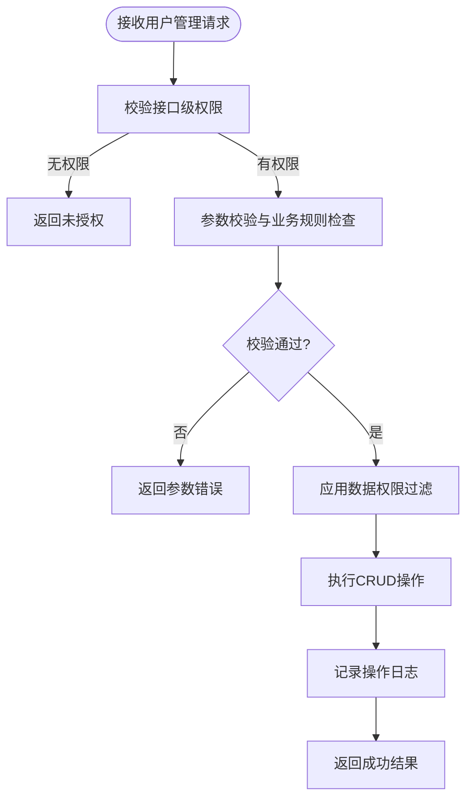

图表来源
- [pezmax.sql:751-776](file://PezMax-Backend/sql/pezmax.sql#L751-L776)
- [pezmax.sql:789-796](file://PezMax-Backend/sql/pezmax.sql#L789-L796)
- [pezmax.sql:779-786](file://PezMax-Backend/sql/pezmax.sql#L779-L786)

章节来源
- [pezmax.sql:751-776](file://PezMax-Backend/sql/pezmax.sql#L751-L776)
- [pezmax.sql:789-796](file://PezMax-Backend/sql/pezmax.sql#L789-L796)
- [pezmax.sql:779-786](file://PezMax-Backend/sql/pezmax.sql#L779-L786)

### 角色管理接口
- 功能范围
  - 角色定义：名称、权限字符串、显示顺序、状态、备注
  - 权限配置：为角色分配菜单权限（含按钮级 perms）
  - 数据范围：全部数据、自定义部门、本部门、本部门及以下
  - 角色与部门关联：限定角色可访问的部门范围
- 关键数据模型
  - 角色表：角色ID、名称、权限字符串、排序、数据范围、菜单/部门选择严格模式、状态、删除标志等
  - 角色-菜单关联表：角色ID与菜单ID的映射
  - 角色-部门关联表：角色ID与部门ID的映射
- 接口设计建议
  - 列表查询：支持按角色名、状态、数据范围筛选
  - 详情获取：返回角色基本信息、已分配的菜单与部门
  - 新增/修改：校验权限字符串唯一性与格式；保存菜单与部门关联
  - 删除：检查是否被用户引用，避免破坏一致性
  - 数据范围：根据 data_scope 字段生成数据权限 SQL 片段
- 权限控制
  - 需具备“角色管理”菜单权限及相应按钮权限
  - 数据权限：受角色自身数据范围限制

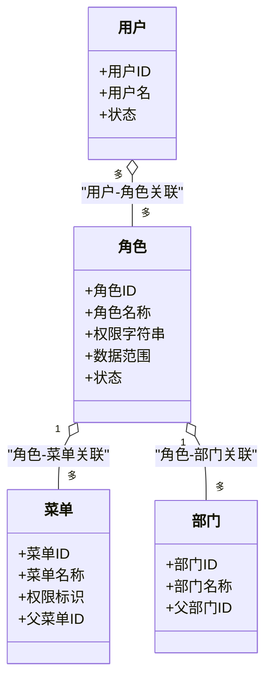

图表来源
- [pezmax.sql:709-728](file://PezMax-Backend/sql/pezmax.sql#L709-L728)
- [pezmax.sql:604-629](file://PezMax-Backend/sql/pezmax.sql#L604-L629)
- [pezmax.sql:484-503](file://PezMax-Backend/sql/pezmax.sql#L484-L503)
- [pezmax.sql:789-796](file://PezMax-Backend/sql/pezmax.sql#L789-L796)

章节来源
- [pezmax.sql:709-728](file://PezMax-Backend/sql/pezmax.sql#L709-L728)
- [pezmax.sql:604-629](file://PezMax-Backend/sql/pezmax.sql#L604-L629)
- [pezmax.sql:484-503](file://PezMax-Backend/sql/pezmax.sql#L484-L503)
- [pezmax.sql:789-796](file://PezMax-Backend/sql/pezmax.sql#L789-L796)

### 菜单管理接口
- 功能范围
  - 菜单树构建：递归组装父子关系，返回树形结构
  - 动态路由：根据菜单 path、component、query、route_name 生成前端路由
  - 权限绑定：菜单 perms 标识用于按钮级权限控制
- 关键数据模型
  - 菜单表：菜单ID、名称、父菜单ID、排序、路由地址、组件路径、路由参数、路由名称、外链/缓存标志、菜单类型（目录/菜单/按钮）、可见性、状态、权限标识、图标等
- 接口设计建议
  - 树形列表：返回完整的菜单树，支持按状态、类型筛选
  - 详情获取：返回菜单节点及子节点
  - 新增/修改：校验父子关系、路由唯一性、perms 格式
  - 删除：检查是否存在子菜单或被角色引用
  - 动态路由：将菜单转换为前端路由配置，结合权限指令控制展示
- 权限控制
  - 需具备“菜单管理”菜单权限及相应按钮权限
  - 前端通过 perms 控制按钮显隐与点击行为

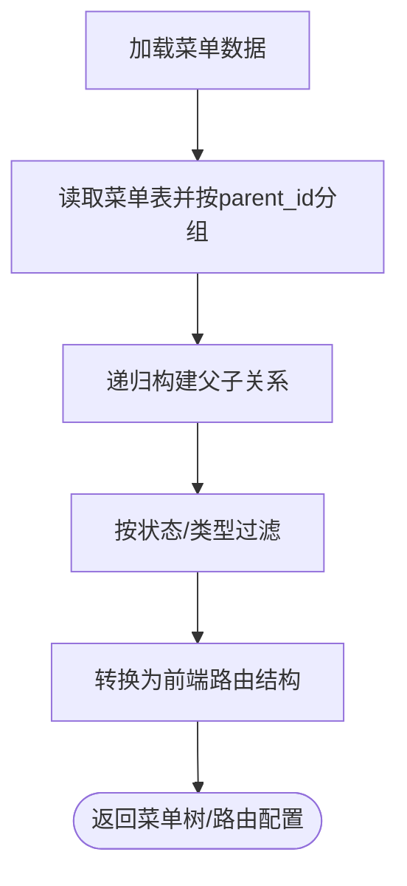

图表来源
- [pezmax.sql:604-629](file://PezMax-Backend/sql/pezmax.sql#L604-L629)

章节来源
- [pezmax.sql:604-629](file://PezMax-Backend/sql/pezmax.sql#L604-L629)

### 部门管理接口
- 功能范围
  - 组织架构维护：部门新增、修改、删除、查询（树形结构）
  - 数据权限控制：结合角色的数据范围与部门关联，限制可访问数据
- 关键数据模型
  - 部门表：部门ID、父部门ID、祖级列表、部门名称、排序、负责人、电话、邮箱、状态、删除标志等
- 接口设计建议
  - 树形列表：返回部门树，支持按名称、状态筛选
  - 详情获取：返回部门信息及子部门
  - 新增/修改：校验父子关系、祖级列表更新、负责人与联系方式
  - 删除：检查是否存在子部门或被用户/角色引用
  - 数据权限：根据 data_scope 与角色-部门关联生成 SQL 条件
- 权限控制
  - 需具备“部门管理”菜单权限及相应按钮权限
  - 数据权限：受角色数据范围与部门关联影响

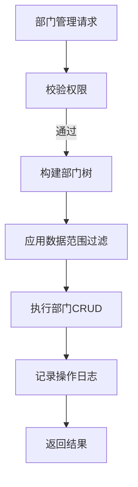

图表来源
- [pezmax.sql:484-503](file://PezMax-Backend/sql/pezmax.sql#L484-L503)

章节来源
- [pezmax.sql:484-503](file://PezMax-Backend/sql/pezmax.sql#L484-L503)

### RBAC 权限模型实现
- 模型要点
  - 用户-角色-菜单三层关系，用户通过角色获得菜单与按钮权限
  - 菜单 perms 作为接口级权限标识，配合注解与拦截器进行校验
  - 数据范围 data_scope 控制数据可见性，结合角色-部门关联细化
- 实现流程
  - 登录成功后加载用户角色与菜单，生成权限集合（含 perms）
  - 接口访问时，Security 过滤器解析 Token，校验用户是否具备所需 perms
  - 数据查询时，AOP 切面根据 data_scope 注入 SQL 条件（如 dept_id IN (...)）

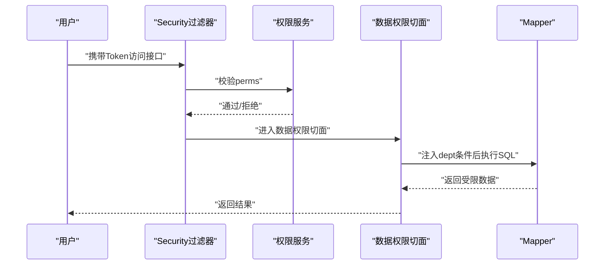

图表来源
- [pezmax.sql:709-728](file://PezMax-Backend/sql/pezmax.sql#L709-L728)
- [pezmax.sql:604-629](file://PezMax-Backend/sql/pezmax.sql#L604-L629)
- [pezmax.sql:789-796](file://PezMax-Backend/sql/pezmax.sql#L789-L796)

章节来源
- [pezmax.sql:709-728](file://PezMax-Backend/sql/pezmax.sql#L709-L728)
- [pezmax.sql:604-629](file://PezMax-Backend/sql/pezmax.sql#L604-L629)
- [pezmax.sql:789-796](file://PezMax-Backend/sql/pezmax.sql#L789-L796)

### 数据权限过滤
- 数据范围类型
  - 全部数据权限：不附加部门条件
  - 自定义数据权限：根据角色-部门关联限定
  - 本部门数据权限：仅当前用户所属部门
  - 本部门及以下数据权限：当前部门及其所有下级部门
- 实现机制
  - 通过注解与 AOP 切面在方法执行前解析 data_scope
  - 根据角色-部门关联表生成 dept_id 列表，拼接 SQL 条件
  - 确保所有涉及敏感数据的查询均经过数据权限切面

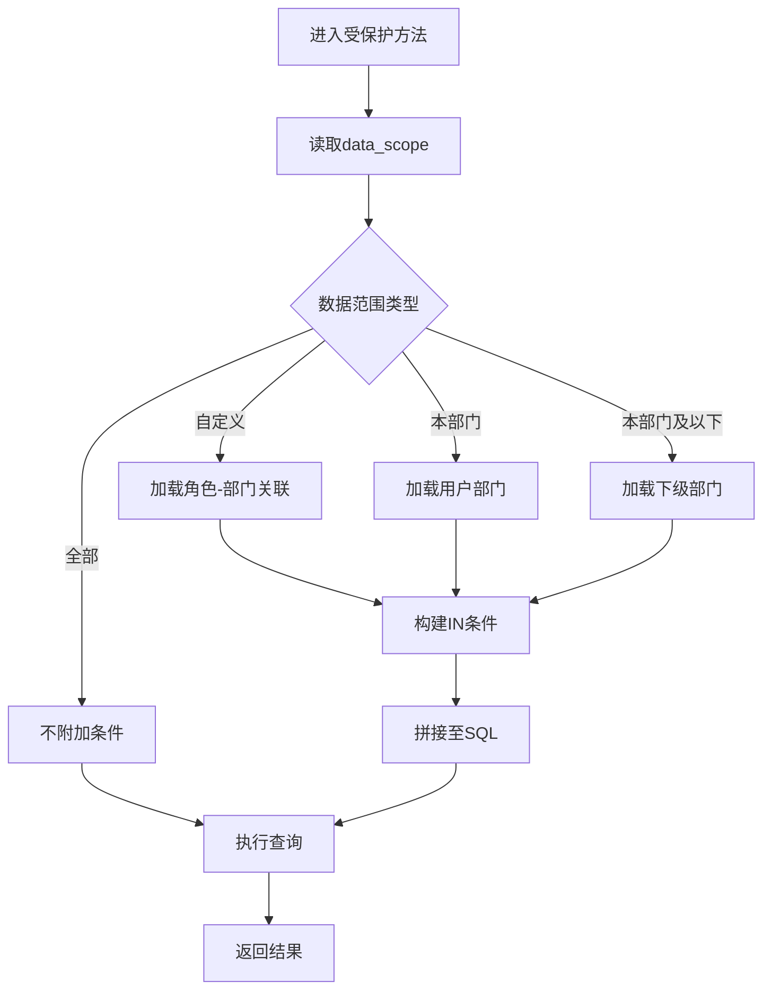

图表来源
- [pezmax.sql:709-728](file://PezMax-Backend/sql/pezmax.sql#L709-L728)
- [pezmax.sql:731-738](file://PezMax-Backend/sql/pezmax.sql#L731-L738)

章节来源
- [pezmax.sql:709-728](file://PezMax-Backend/sql/pezmax.sql#L709-L728)
- [pezmax.sql:731-738](file://PezMax-Backend/sql/pezmax.sql#L731-L738)

### 接口级权限控制
- 控制点
  - 基于菜单 perms 的接口级权限校验
  - 结合 Spring Security 自定义表达式或注解进行声明式控制
- 使用建议
  - 为每个菜单/按钮设置唯一 perms 标识
  - 在 Controller 方法上使用权限注解，指定所需 perms
  - 前端通过 v-permission 等指令控制按钮显隐与交互

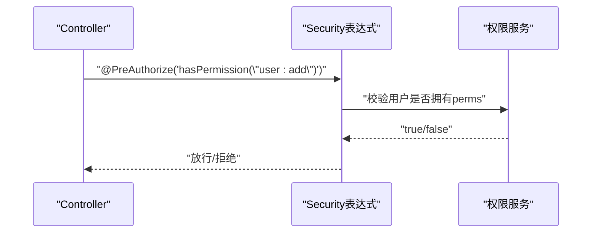

图表来源
- [pezmax.sql:604-629](file://PezMax-Backend/sql/pezmax.sql#L604-L629)

章节来源
- [pezmax.sql:604-629](file://PezMax-Backend/sql/pezmax.sql#L604-L629)

### 系统配置管理
- 功能范围
  - 键值对配置项的新增、修改、删除、查询
  - 支持内置/自定义类型，便于运行时调整系统行为
- 关键数据模型
  - 配置表：配置ID、名称、键名、键值、类型、创建/更新时间、备注等
- 接口设计建议
  - 列表查询：支持按名称、键名、类型筛选
  - 详情获取：返回配置项完整信息
  - 新增/修改：校验键名唯一性与格式
  - 删除：检查是否被其他配置引用
  - 缓存：常用配置项可缓存至 Redis 提升性能

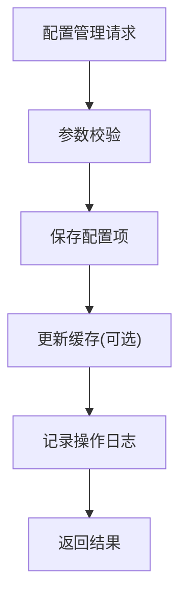

图表来源
- [pezmax.sql:466-481](file://PezMax-Backend/sql/pezmax.sql#L466-L481)

章节来源
- [pezmax.sql:466-481](file://PezMax-Backend/sql/pezmax.sql#L466-L481)

### 操作日志查询
- 功能范围
  - 记录关键操作的模块标题、业务类型、方法名、请求方式、操作人员、部门、URL、IP、地点、参数、返回结果、状态、错误消息、耗时等
- 关键数据模型
  - 操作日志表：日志主键、标题、业务类型、方法、请求方式、操作类别、操作人员、部门、URL、IP、地点、参数、返回结果、状态、错误消息、操作时间、耗时等
- 接口设计建议
  - 列表查询：支持按模块、业务类型、状态、时间范围、操作人员筛选
  - 详情获取：返回完整日志信息
  - 清理：定期归档或删除历史日志，控制表大小
  - 审计：结合登录日志进行交叉分析

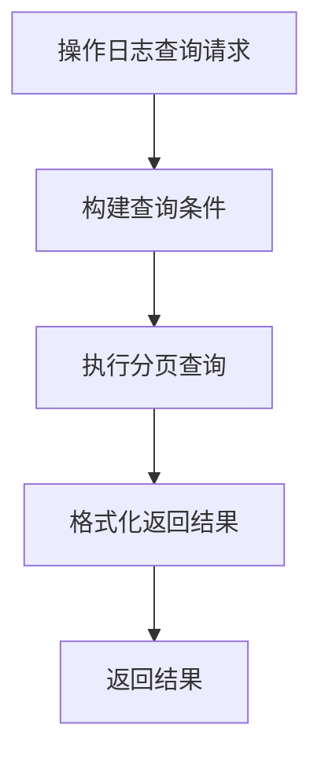

图表来源
- [pezmax.sql:663-688](file://PezMax-Backend/sql/pezmax.sql#L663-L688)

章节来源
- [pezmax.sql:663-688](file://PezMax-Backend/sql/pezmax.sql#L663-L688)

### 监控告警接口
- 功能范围
  - 定时任务管理：任务的创建、修改、启动、暂停、删除
  - 任务日志：查看任务执行日志、异常信息、开始/结束时间
  - 告警：结合任务执行状态与外部通知渠道（如邮件、短信）实现告警
- 关键数据模型
  - 任务表：任务ID、名称、组名、调用目标、cron表达式、错误策略、并发控制、状态、创建/更新时间、备注等
  - 任务日志表：日志ID、任务名称、组名、调用目标、日志信息、状态、异常信息、开始/结束时间、创建时间等
- 接口设计建议
  - 任务列表：支持按名称、组名、状态筛选
  - 任务详情：返回任务配置与最近执行记录
  - 任务日志：支持按任务名称、状态、时间范围筛选
  - 告警策略：根据任务失败次数、异常信息阈值触发告警

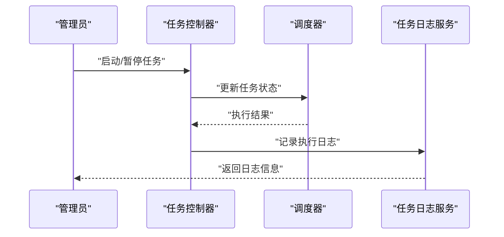

图表来源
- [pezmax.sql:546-582](file://PezMax-Backend/sql/pezmax.sql#L546-L582)

章节来源
- [pezmax.sql:546-582](file://PezMax-Backend/sql/pezmax.sql#L546-L582)

### 安全策略、审计追踪与合规性
- 安全策略
  - 登录认证：JWT 令牌签发与校验，支持刷新与过期处理
  - 密码策略：复杂度校验、加密存储、定期更换提示
  - 会话管理：在线用户管理、强制下线、会话超时
  - 防重放与限流：重复提交拦截、接口频率限制
- 审计追踪
  - 登录日志：记录登录成功/失败、IP、浏览器、操作系统、时间
  - 操作日志：记录关键业务操作，支持回溯与审计
  - 变更追踪：重要配置与权限变更留痕
- 合规性要求
  - 数据最小化：仅收集必要信息
  - 访问控制：严格的 RBAC 与数据权限
  - 日志留存：满足审计周期要求，脱敏敏感信息
  - 备份与恢复：定期备份数据库与配置文件

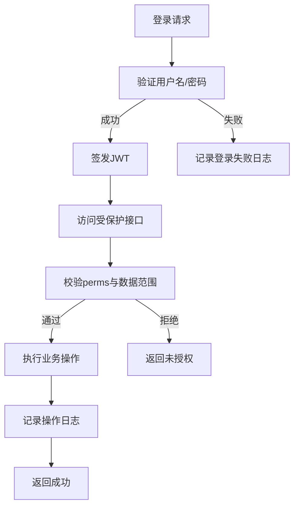

图表来源
- [pezmax.sql:585-601](file://PezMax-Backend/sql/pezmax.sql#L585-L601)
- [pezmax.sql:663-688](file://PezMax-Backend/sql/pezmax.sql#L663-L688)

章节来源
- [pezmax.sql:585-601](file://PezMax-Backend/sql/pezmax.sql#L585-L601)
- [pezmax.sql:663-688](file://PezMax-Backend/sql/pezmax.sql#L663-L688)

## 依赖分析
- 模块耦合
  - ruoyi-admin 依赖 ruoyi-framework 与 ruoyi-system
  - ruoyi-framework 依赖 ruoyi-common 与第三方库（Spring Security、Redis、Druid 等）
  - ruoyi-system 依赖数据库与缓存
- 外部依赖
  - MySQL：持久化存储
  - Redis：缓存与会话管理
  - MinIO：对象存储（业务域）
- 潜在风险
  - 循环依赖：确保模块间单向依赖
  - 性能瓶颈：高频查询需加索引与缓存
  - 安全漏洞：输入校验、SQL 注入防护、XSS 过滤

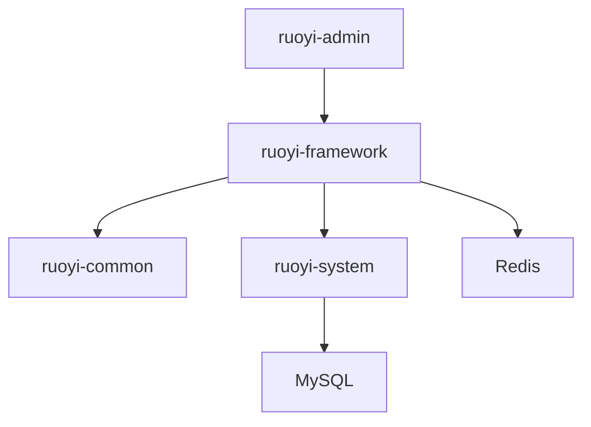

图表来源
- [README.md:76-89](file://PezMax-Backend/README.md#L76-L89)

章节来源
- [README.md:76-89](file://PezMax-Backend/README.md#L76-L89)

## 性能考虑
- 数据库优化
  - 为常用查询字段建立索引（如用户名、状态、时间范围）
  - 分页查询避免全表扫描，合理设置页大小
- 缓存策略
  - 菜单树、字典、配置项等热点数据缓存至 Redis
  - 缓存失效策略：写操作后主动更新或设置 TTL
- 连接池与线程池
  - 合理配置 Druid 连接池大小与超时时间
  - 异步任务使用线程池，避免阻塞主线程
- 日志与监控
  - 操作日志异步写入，降低接口延迟
  - 关键指标监控（CPU、内存、GC、慢查询）

[本节为通用指导，无需特定文件来源]

## 故障排查指南
- 常见问题
  - 登录失败：检查用户名/密码、账号状态、验证码、IP 白名单
  - 权限不足：确认用户角色与菜单 perms 配置是否正确
  - 数据权限异常：检查 data_scope 与角色-部门关联
  - 任务执行失败：查看任务日志中的异常信息
- 排查步骤
  - 查看登录日志与操作日志，定位问题时间点
  - 检查数据库索引与慢查询，优化 SQL
  - 检查 Redis 缓存命中率与键空间
  - 检查 MinIO 桶策略与网络连通性

章节来源
- [pezmax.sql:585-601](file://PezMax-Backend/sql/pezmax.sql#L585-L601)
- [pezmax.sql:663-688](file://PezMax-Backend/sql/pezmax.sql#L663-L688)
- [pezmax.sql:546-582](file://PezMax-Backend/sql/pezmax.sql#L546-L582)

## 结论
本系统管理接口文档基于仓库提供的 README 与数据库脚本，梳理了用户、角色、菜单、部门、配置、日志、任务等核心管理能力，并结合 RBAC 模型、数据权限过滤与接口级权限控制，提供了清晰的架构视图与实现建议。建议在开发过程中严格遵循权限与数据范围策略，完善日志与监控，保障系统安全与可审计性。

[本节为总结性内容，无需特定文件来源]

## 附录
- 术语解释
  - RBAC：基于角色的访问控制
  - perms：权限标识，用于接口级权限控制
  - data_scope：数据范围，控制数据可见性
  - 菜单类型：目录、菜单、按钮
- 参考链接
  - 平台简介与技术栈参见 README
  - 数据库表结构参见 pezmax.sql

章节来源
- [README.md:13-44](file://PezMax-Backend/README.md#L13-L44)
- [pezmax.sql:604-629](file://PezMax-Backend/sql/pezmax.sql#L604-L629)