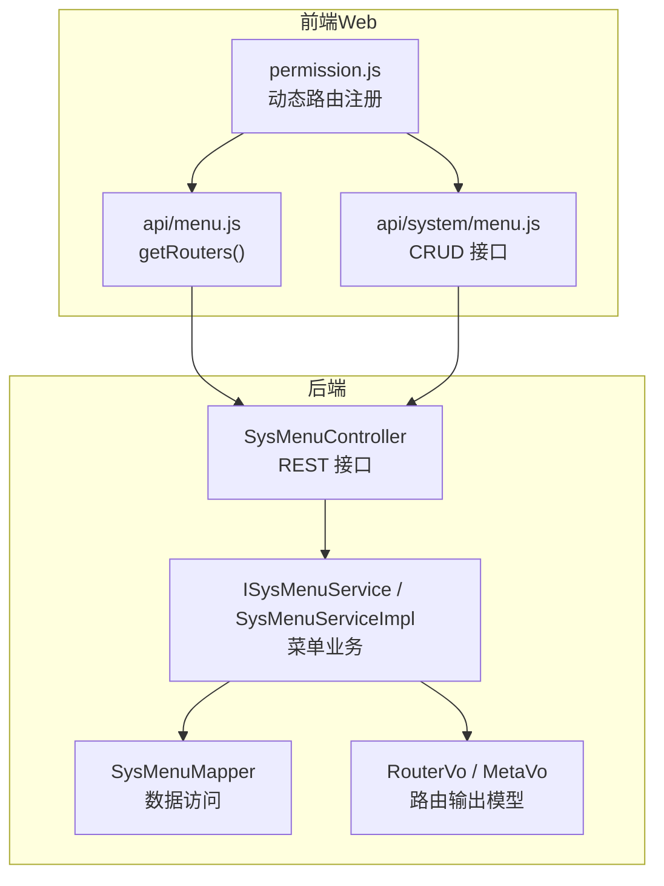
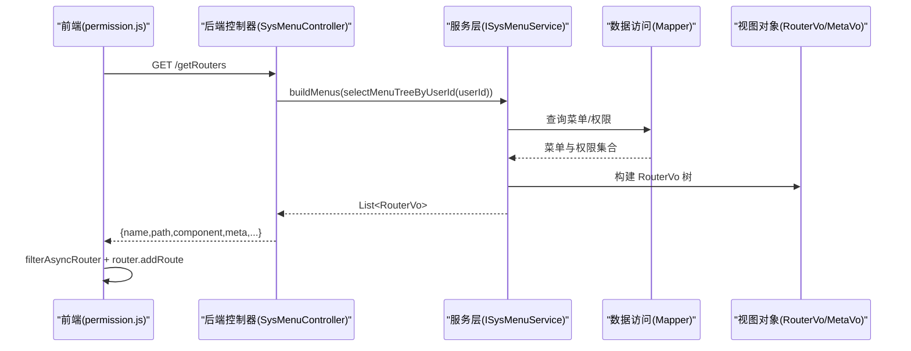
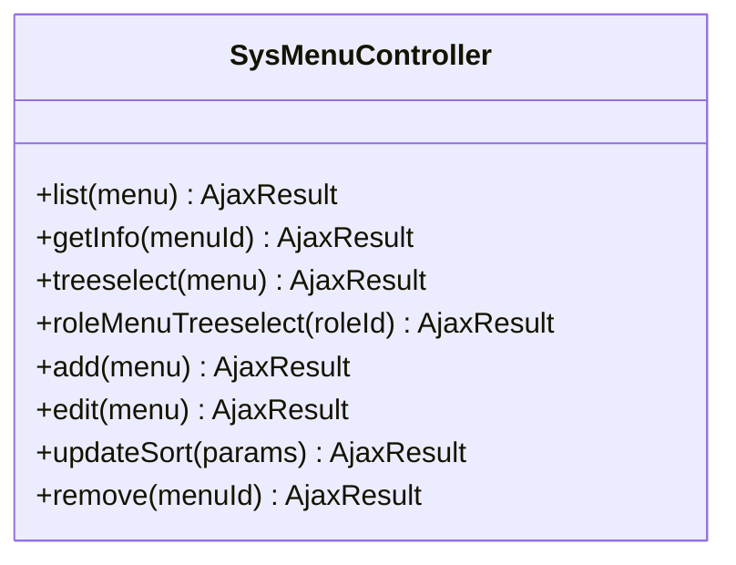
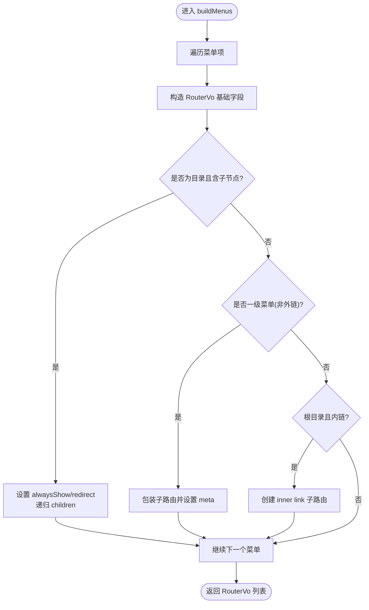
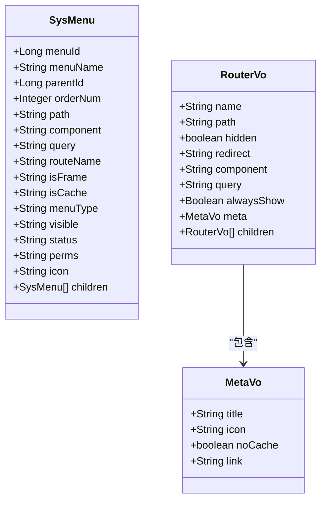
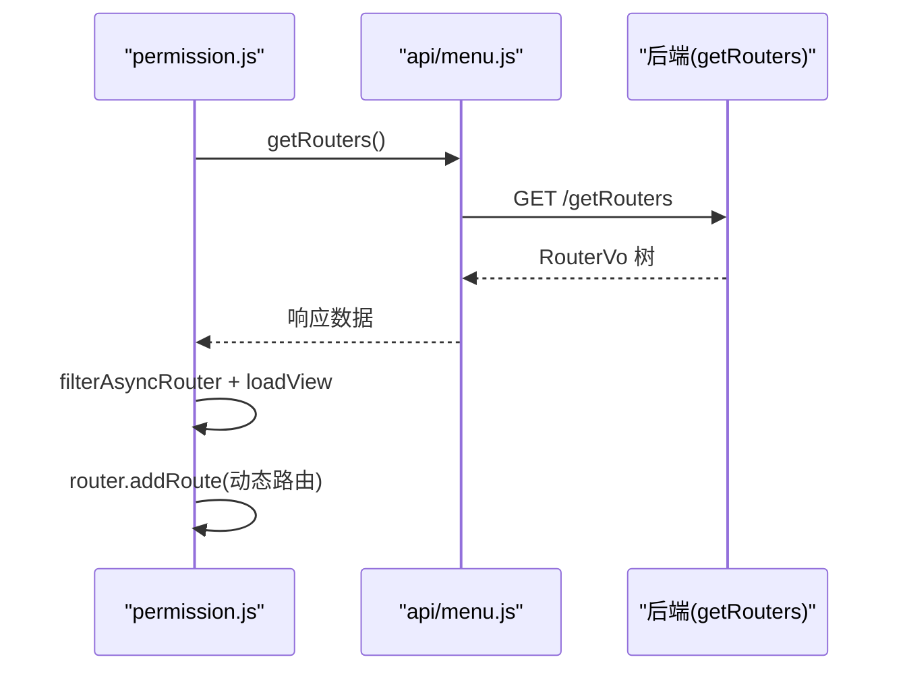
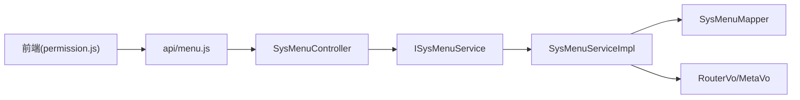

# 菜单管理接口

<cite>
**本文引用的文件**
- [SysMenuController.java](file://PezMax-Backend/ruoyi-admin/src/main/java/com/ruoyi/web/controller/system/SysMenuController.java)
- [ISysMenuService.java](file://PezMax-Backend/ruoyi-system/src/main/java/com/ruoyi/system/service/ISysMenuService.java)
- [SysMenuServiceImpl.java](file://PezMax-Backend/ruoyi-system/src/main/java/com/ruoyi/system/service/impl/SysMenuServiceImpl.java)
- [SysMenu.java](file://PezMax-Backend/ruoyi-common/src/main/java/com/ruoyi/common/core/domain/entity/SysMenu.java)
- [RouterVo.java](file://PezMax-Backend/ruoyi-system/src/main/java/com/ruoyi/system/domain/vo/RouterVo.java)
- [MetaVo.java](file://PezMax-Backend/ruoyi-system/src/main/java/com/ruoyi/system/domain/vo/MetaVo.java)
- [menu.js（后端UI）](file://PezMax-Backend/ruoyi-ui/src/api/menu.js)
- [system/menu.js（后端UI）](file://PezMax-Backend/ruoyi-ui/src/api/system/menu.js)
- [permission.js（后端UI）](file://PezMax-Backend/ruoyi-ui/src/store/modules/permission.js)
</cite>

## 目录
1. [简介](#简介)
2. [项目结构](#项目结构)
3. [核心组件](#核心组件)
4. [架构总览](#架构总览)
5. [详细组件分析](#详细组件分析)
6. [依赖关系分析](#依赖关系分析)
7. [性能与缓存策略](#性能与缓存策略)
8. [故障排查指南](#故障排查指南)
9. [结论](#结论)
10. [附录：API 定义与前端示例](#附录api-定义与前端示例)

## 简介
本文件面向“菜单管理”相关 API 的完整文档，覆盖以下能力：
- 菜单树构建、下拉树选择
- 动态路由生成（后端 RouterVo/MetaVo 到前端可执行路由）
- 菜单权限绑定（角色-菜单-权限标识）
- 菜单排序管理（批量更新 orderNum）
- 前端路由配置、菜单图标管理、外链/内链处理
- 层级结构与父子关系维护、菜单状态控制
- 菜单缓存策略与性能优化方案
- 动态菜单加载、权限过滤、国际化支持实现要点

## 项目结构
围绕菜单管理的代码主要分布在后端 Controller/Service/VO/Entity 以及前端 UI 的 API 与权限模块中。整体分层清晰：
- 控制器层：暴露 REST 接口，负责鉴权与参数校验
- 服务层：业务逻辑（树构建、路由生成、权限聚合、排序更新等）
- 数据模型：实体 SysMenu 与视图对象 RouterVo/MetaVo
- 前端：调用 /getRouters 获取动态路由，结合 store 完成动态注册与渲染

图表来源
- [SysMenuController.java:1-165](file://PezMax-Backend/ruoyi-admin/src/main/java/com/ruoyi/web/controller/system/SysMenuController.java#L1-L165)
- [ISysMenuService.java:1-161](file://PezMax-Backend/ruoyi-system/src/main/java/com/ruoyi/system/service/ISysMenuService.java#L1-L161)
- [SysMenuServiceImpl.java:1-619](file://PezMax-Backend/ruoyi-system/src/main/java/com/ruoyi/system/service/impl/SysMenuServiceImpl.java#L1-L619)
- [RouterVo.java:1-149](file://PezMax-Backend/ruoyi-system/src/main/java/com/ruoyi/system/domain/vo/RouterVo.java#L1-L149)
- [MetaVo.java:1-107](file://PezMax-Backend/ruoyi-system/src/main/java/com/ruoyi/system/domain/vo/MetaVo.java#L1-L107)
- [menu.js（后端UI）:1-9](file://PezMax-Backend/ruoyi-ui/src/api/menu.js#L1-L9)
- [system/menu.js（后端UI）:1-69](file://PezMax-Backend/ruoyi-ui/src/api/system/menu.js#L1-L69)
- [permission.js（后端UI）:1-132](file://PezMax-Backend/ruoyi-ui/src/store/modules/permission.js#L1-L132)

章节来源
- [SysMenuController.java:1-165](file://PezMax-Backend/ruoyi-admin/src/main/java/com/ruoyi/web/controller/system/SysMenuController.java#L1-L165)
- [ISysMenuService.java:1-161](file://PezMax-Backend/ruoyi-system/src/main/java/com/ruoyi/system/service/ISysMenuService.java#L1-L161)
- [SysMenuServiceImpl.java:1-619](file://PezMax-Backend/ruoyi-system/src/main/java/com/ruoyi/system/service/impl/SysMenuServiceImpl.java#L1-L619)
- [SysMenu.java:1-275](file://PezMax-Backend/ruoyi-common/src/main/java/com/ruoyi/common/core/domain/entity/SysMenu.java#L1-L275)
- [RouterVo.java:1-149](file://PezMax-Backend/ruoyi-system/src/main/java/com/ruoyi/system/domain/vo/RouterVo.java#L1-L149)
- [MetaVo.java:1-107](file://PezMax-Backend/ruoyi-system/src/main/java/com/ruoyi/system/domain/vo/MetaVo.java#L1-L107)
- [menu.js（后端UI）:1-9](file://PezMax-Backend/ruoyi-ui/src/api/menu.js#L1-L9)
- [system/menu.js（后端UI）:1-69](file://PezMax-Backend/ruoyi-ui/src/api/system/menu.js#L1-L69)
- [permission.js（后端UI）:1-132](file://PezMax-Backend/ruoyi-ui/src/store/modules/permission.js#L1-L132)

## 核心组件
- 控制器层
  - 提供菜单列表、详情、下拉树、角色菜单树、新增/修改/删除、排序保存等接口，并内置权限注解保护。
- 服务层
  - 实现菜单查询（按用户/角色）、权限集合计算、菜单树构建、前端路由构建（RouterVo）、排序批量更新、唯一性校验（名称、路由组合）。
- 数据模型
  - SysMenu：菜单实体，包含路径、组件、类型、可见性、状态、权限标识、图标、父子关系等。
  - RouterVo/MetaVo：前端路由元信息，包括 name/path/component/query/hidden/redirect/meta(children)。
- 前端
  - permission.js 通过 getRouters 拉取后端生成的路由树，转换为 Vue Router 可执行结构，并注入常量路由与动态路由。

章节来源
- [SysMenuController.java:1-165](file://PezMax-Backend/ruoyi-admin/src/main/java/com/ruoyi/web/controller/system/SysMenuController.java#L1-L165)
- [ISysMenuService.java:1-161](file://PezMax-Backend/ruoyi-system/src/main/java/com/ruoyi/system/service/ISysMenuService.java#L1-L161)
- [SysMenuServiceImpl.java:1-619](file://PezMax-Backend/ruoyi-system/src/main/java/com/ruoyi/system/service/impl/SysMenuServiceImpl.java#L1-L619)
- [SysMenu.java:1-275](file://PezMax-Backend/ruoyi-common/src/main/java/com/ruoyi/common/core/domain/entity/SysMenu.java#L1-L275)
- [RouterVo.java:1-149](file://PezMax-Backend/ruoyi-system/src/main/java/com/ruoyi/system/domain/vo/RouterVo.java#L1-L149)
- [MetaVo.java:1-107](file://PezMax-Backend/ruoyi-system/src/main/java/com/ruoyi/system/domain/vo/MetaVo.java#L1-L107)
- [permission.js（后端UI）:1-132](file://PezMax-Backend/ruoyi-ui/src/store/modules/permission.js#L1-L132)

## 架构总览
从请求到响应的关键链路如下：
- 前端发起 /getRouters 获取动态路由；或调用 /system/menu/* 进行菜单 CRUD。
- 控制器接收请求，调用服务层完成业务处理。
- 服务层根据用户/角色权限筛选菜单，构建菜单树与前端路由结构。
- 返回给前端后，permission.js 将路由注入 Vue Router，完成页面渲染与导航。

图表来源
- [SysMenuController.java:1-165](file://PezMax-Backend/ruoyi-admin/src/main/java/com/ruoyi/web/controller/system/SysMenuController.java#L1-L165)
- [ISysMenuService.java:1-161](file://PezMax-Backend/ruoyi-system/src/main/java/com/ruoyi/system/service/ISysMenuService.java#L1-L161)
- [SysMenuServiceImpl.java:1-619](file://PezMax-Backend/ruoyi-system/src/main/java/com/ruoyi/system/service/impl/SysMenuServiceImpl.java#L1-L619)
- [RouterVo.java:1-149](file://PezMax-Backend/ruoyi-system/src/main/java/com/ruoyi/system/domain/vo/RouterVo.java#L1-L149)
- [MetaVo.java:1-107](file://PezMax-Backend/ruoyi-system/src/main/java/com/ruoyi/system/domain/vo/MetaVo.java#L1-L107)
- [menu.js（后端UI）:1-9](file://PezMax-Backend/ruoyi-ui/src/api/menu.js#L1-L9)
- [permission.js（后端UI）:1-132](file://PezMax-Backend/ruoyi-ui/src/store/modules/permission.js#L1-L132)

## 详细组件分析

### 控制器层：菜单管理 REST 接口
- 功能清单
  - 菜单列表：GET /system/menu/list
  - 菜单详情：GET /system/menu/{menuId}
  - 下拉树：GET /system/menu/treeselect
  - 角色菜单树：GET /system/menu/roleMenuTreeselect/{roleId}
  - 新增菜单：POST /system/menu
  - 修改菜单：PUT /system/menu
  - 保存排序：PUT /system/menu/updateSort
  - 删除菜单：DELETE /system/menu/{menuId}
- 权限控制
  - 使用 @PreAuthorize 注解对每个接口进行细粒度权限校验。
- 输入校验与业务规则
  - 新增/修改时校验菜单名称唯一、外链地址必须以 http(s) 开头、路由名称/路径唯一性、父级不能为自身等。
- 排序更新
  - 接收 menuIds 与 orderNums 数组，批量更新 orderNum。

图表来源
- [SysMenuController.java:1-165](file://PezMax-Backend/ruoyi-admin/src/main/java/com/ruoyi/web/controller/system/SysMenuController.java#L1-L165)

章节来源
- [SysMenuController.java:1-165](file://PezMax-Backend/ruoyi-admin/src/main/java/com/ruoyi/web/controller/system/SysMenuController.java#L1-L165)

### 服务层：菜单树构建与动态路由生成
- 菜单树构建
  - selectMenuList/selectMenuTreeByUserId：按管理员/普通用户分别查询菜单。
  - buildMenuTree/buildMenuTreeSelect：递归组装父子关系，供下拉树与表单选择使用。
- 动态路由生成
  - buildMenus：将菜单集合转换为 RouterVo 树，处理：
    - 隐藏路由、重定向、alwaysShow
    - 组件映射（Layout/ParentView/InnerLink/自定义组件）
    - 外链/内链处理（isInnerLink/isMenuFrame/isParentView）
    - 路由名与路径推导（getRouteName/getRouterPath）
    - 缓存标记（noCache）
- 权限聚合
  - selectMenuPermsByUserId/selectMenuPermsByRoleId：合并权限字符串为 Set。
- 排序与唯一性校验
  - updateMenuSort：事务内批量更新 orderNum。
  - checkMenuNameUnique/checkRouteConfigUnique：防止同名与路由冲突。

图表来源
- [SysMenuServiceImpl.java:167-222](file://PezMax-Backend/ruoyi-system/src/main/java/com/ruoyi/system/service/impl/SysMenuServiceImpl.java#L167-L222)
- [SysMenuServiceImpl.java:459-503](file://PezMax-Backend/ruoyi-system/src/main/java/com/ruoyi/system/service/impl/SysMenuServiceImpl.java#L459-L503)
- [SysMenuServiceImpl.java:511-537](file://PezMax-Backend/ruoyi-system/src/main/java/com/ruoyi/system/service/impl/SysMenuServiceImpl.java#L511-L537)

章节来源
- [ISysMenuService.java:1-161](file://PezMax-Backend/ruoyi-system/src/main/java/com/ruoyi/system/service/ISysMenuService.java#L1-L161)
- [SysMenuServiceImpl.java:1-619](file://PezMax-Backend/ruoyi-system/src/main/java/com/ruoyi/system/service/impl/SysMenuServiceImpl.java#L1-L619)

### 数据模型：SysMenu、RouterVo、MetaVo
- SysMenu
  - 关键字段：menuId、parentId、orderNum、path、component、query、routeName、isFrame、isCache、menuType、visible、status、perms、icon、children。
- RouterVo
  - 关键字段：name、path、hidden、redirect、component、query、alwaysShow、meta、children。
- MetaVo
  - 关键字段：title、icon、noCache、link（仅当以 http(s) 开头时生效）。

图表来源
- [SysMenu.java:1-275](file://PezMax-Backend/ruoyi-common/src/main/java/com/ruoyi/common/core/domain/entity/SysMenu.java#L1-L275)
- [RouterVo.java:1-149](file://PezMax-Backend/ruoyi-system/src/main/java/com/ruoyi/system/domain/vo/RouterVo.java#L1-L149)
- [MetaVo.java:1-107](file://PezMax-Backend/ruoyi-system/src/main/java/com/ruoyi/system/domain/vo/MetaVo.java#L1-L107)

章节来源
- [SysMenu.java:1-275](file://PezMax-Backend/ruoyi-common/src/main/java/com/ruoyi/common/core/domain/entity/SysMenu.java#L1-L275)
- [RouterVo.java:1-149](file://PezMax-Backend/ruoyi-system/src/main/java/com/ruoyi/system/domain/vo/RouterVo.java#L1-L149)
- [MetaVo.java:1-107](file://PezMax-Backend/ruoyi-system/src/main/java/com/ruoyi/system/domain/vo/MetaVo.java#L1-L107)

### 前端：动态路由加载与权限过滤
- 动态路由获取
  - 通过 api/menu.js 的 getRouters 调用后端 /getRouters 接口，获取 RouterVo 树。
- 路由转换与注入
  - permission.js 中的 filterAsyncRouter 将后端组件名映射为实际组件（Layout/ParentView/InnerLink/动态 import），并处理 ParentView 的子路由扁平化。
  - 将动态路由与常量路由合并，注册到 Vue Router。
- 权限过滤
  - 动态路由可根据 permissions/roles 进行前端侧过滤（filterDynamicRoutes）。

图表来源
- [menu.js（后端UI）:1-9](file://PezMax-Backend/ruoyi-ui/src/api/menu.js#L1-L9)
- [permission.js（后端UI）:1-132](file://PezMax-Backend/ruoyi-ui/src/store/modules/permission.js#L1-L132)

章节来源
- [menu.js（后端UI）:1-9](file://PezMax-Backend/ruoyi-ui/src/api/menu.js#L1-L9)
- [permission.js（后端UI）:1-132](file://PezMax-Backend/ruoyi-ui/src/store/modules/permission.js#L1-L132)

## 依赖关系分析
- 控制器依赖服务层接口 ISysMenuService，具体由 SysMenuServiceImpl 实现。
- 服务层依赖 Mapper 进行数据访问，依赖常量与工具类进行校验与格式化。
- 前端依赖后端提供的 /getRouters 与 /system/menu/* 接口，并通过 store 完成路由注入。

图表来源
- [SysMenuController.java:1-165](file://PezMax-Backend/ruoyi-admin/src/main/java/com/ruoyi/web/controller/system/SysMenuController.java#L1-L165)
- [ISysMenuService.java:1-161](file://PezMax-Backend/ruoyi-system/src/main/java/com/ruoyi/system/service/ISysMenuService.java#L1-L161)
- [SysMenuServiceImpl.java:1-619](file://PezMax-Backend/ruoyi-system/src/main/java/com/ruoyi/system/service/impl/SysMenuServiceImpl.java#L1-L619)
- [menu.js（后端UI）:1-9](file://PezMax-Backend/ruoyi-ui/src/api/menu.js#L1-L9)
- [permission.js（后端UI）:1-132](file://PezMax-Backend/ruoyi-ui/src/store/modules/permission.js#L1-L132)

章节来源
- [SysMenuController.java:1-165](file://PezMax-Backend/ruoyi-admin/src/main/java/com/ruoyi/web/controller/system/SysMenuController.java#L1-L165)
- [ISysMenuService.java:1-161](file://PezMax-Backend/ruoyi-system/src/main/java/com/ruoyi/system/service/ISysMenuService.java#L1-L161)
- [SysMenuServiceImpl.java:1-619](file://PezMax-Backend/ruoyi-system/src/main/java/com/ruoyi/system/service/impl/SysMenuServiceImpl.java#L1-L619)
- [menu.js（后端UI）:1-9](file://PezMax-Backend/ruoyi-ui/src/api/menu.js#L1-L9)
- [permission.js（后端UI）:1-132](file://PezMax-Backend/ruoyi-ui/src/store/modules/permission.js#L1-L132)

## 性能与缓存策略
- 菜单树构建复杂度
  - 基于内存的递归组装，时间复杂度近似 O(n)，空间复杂度 O(n)。对于大规模菜单建议：
    - 在数据库层预排序（orderNum）
    - 减少不必要的字段传输
    - 前端按需懒加载深层路由（已支持动态 import）
- 路由生成优化
  - 避免重复解析组件路径，permission.js 已采用 glob 匹配与延迟加载。
- 缓存策略建议
  - 后端可在 Redis 缓存当前用户的菜单树与权限集合，键前缀区分用户/角色维度，设置合理过期时间与失效策略（如菜单变更时主动清理）。
  - 前端可在本地存储最近一次的路由树，配合版本号或时间戳判断是否需要刷新。
- 排序更新性能
  - updateMenuSort 使用事务批量更新，注意大批量场景下分批提交，避免长事务锁表。

[本节为通用性能建议，不直接分析具体文件]

## 故障排查指南
- 新增/修改失败
  - 常见原因：菜单名称重复、外链地址未以 http(s) 开头、路由名称/路径冲突、父级选择自身。
  - 定位方法：查看控制器层的校验分支与服务层唯一性校验日志。
- 删除失败
  - 常见原因：存在子菜单、菜单已被角色分配。
  - 定位方法：检查 hasChildByMenuId 与 checkMenuExistRole 返回值。
- 动态路由不显示
  - 常见原因：后端未返回对应 RouterVo、前端组件映射失败、权限不足被过滤。
  - 定位方法：确认 /getRouters 返回结构、检查 permission.js 的 filterAsyncRouter 与 loadView 逻辑。
- 外链/内链异常
  - 常见原因：isInnerLink 判定条件不满足、innerLinkReplaceEach 替换规则不符合预期。
  - 定位方法：核对菜单 isFrame、path 与父级关系。

章节来源
- [SysMenuController.java:84-131](file://PezMax-Backend/ruoyi-admin/src/main/java/com/ruoyi/web/controller/system/SysMenuController.java#L84-L131)
- [SysMenuController.java:150-164](file://PezMax-Backend/ruoyi-admin/src/main/java/com/ruoyi/web/controller/system/SysMenuController.java#L150-L164)
- [SysMenuServiceImpl.java:371-422](file://PezMax-Backend/ruoyi-system/src/main/java/com/ruoyi/system/service/impl/SysMenuServiceImpl.java#L371-L422)
- [SysMenuServiceImpl.java:534-537](file://PezMax-Backend/ruoyi-system/src/main/java/com/ruoyi/system/service/impl/SysMenuServiceImpl.java#L534-L537)
- [SysMenuServiceImpl.java:613-617](file://PezMax-Backend/ruoyi-system/src/main/java/com/ruoyi/system/service/impl/SysMenuServiceImpl.java#L613-L617)
- [permission.js（后端UI）:63-132](file://PezMax-Backend/ruoyi-ui/src/store/modules/permission.js#L63-L132)

## 结论
本项目实现了完整的菜单管理与动态路由体系：后端通过控制器与服务层提供菜单 CRUD、树构建与路由生成能力；前端通过 store 将后端路由树转换为可执行路由并完成权限过滤。该设计具备良好的扩展性与可维护性，适合在多角色、多租户场景下持续演进。

[本节为总结性内容，不直接分析具体文件]

## 附录：API 定义与前端示例

### 后端菜单管理接口一览
- GET /system/menu/list
  - 说明：获取菜单列表（支持按条件查询）
  - 权限：system:menu:list
- GET /system/menu/{menuId}
  - 说明：根据 ID 获取菜单详情
  - 权限：system:menu:query
- GET /system/menu/treeselect
  - 说明：获取菜单下拉树结构
- GET /system/menu/roleMenuTreeselect/{roleId}
  - 说明：获取角色对应的菜单树与已勾选菜单
- POST /system/menu
  - 说明：新增菜单
  - 权限：system:menu:add
- PUT /system/menu
  - 说明：修改菜单
  - 权限：system:menu:edit
- PUT /system/menu/updateSort
  - 说明：批量保存菜单排序
  - 权限：system:menu:edit
- DELETE /system/menu/{menuId}
  - 说明：删除菜单
  - 权限：system:menu:remove

章节来源
- [SysMenuController.java:37-164](file://PezMax-Backend/ruoyi-admin/src/main/java/com/ruoyi/web/controller/system/SysMenuController.java#L37-L164)
- [system/menu.js（后端UI）:1-69](file://PezMax-Backend/ruoyi-ui/src/api/system/menu.js#L1-L69)

### 动态路由接口
- GET /getRouters
  - 说明：获取当前用户可访问的动态路由树（RouterVo 结构）
  - 前端调用：api/menu.js 的 getRouters

章节来源
- [menu.js（后端UI）:1-9](file://PezMax-Backend/ruoyi-ui/src/api/menu.js#L1-L9)

### 前端动态路由加载示例
- 步骤
  - 调用 getRouters 获取后端路由树
  - 使用 filterAsyncRouter 将组件名映射为实际组件
  - 将动态路由与常量路由合并，注册到 Vue Router
- 关键点
  - Layout/ParentView/InnerLink 特殊处理
  - ParentView 子路由扁平化
  - 动态 import 懒加载组件

章节来源
- [permission.js（后端UI）:1-132](file://PezMax-Backend/ruoyi-ui/src/store/modules/permission.js#L1-L132)

### 菜单图标与外链处理
- 图标管理
  - 通过 SysMenu.icon 指定图标资源路径，MetaVo.icon 传递给前端展示。
- 外链/内链
  - isInnerLink：当 isFrame 为非外链且 path 以 http(s) 开头时视为内链。
  - innerLinkReplaceEach：对内链域名进行规范化替换，便于作为路由路径使用。

章节来源
- [SysMenuServiceImpl.java:534-537](file://PezMax-Backend/ruoyi-system/src/main/java/com/ruoyi/system/service/impl/SysMenuServiceImpl.java#L534-L537)
- [SysMenuServiceImpl.java:613-617](file://PezMax-Backend/ruoyi-system/src/main/java/com/ruoyi/system/service/impl/SysMenuServiceImpl.java#L613-L617)
- [MetaVo.java:56-65](file://PezMax-Backend/ruoyi-system/src/main/java/com/ruoyi/system/domain/vo/MetaVo.java#L56-L65)

### 菜单状态控制与层级维护
- 状态控制
  - visible：控制是否在侧边栏显示
  - status：控制菜单启用/停用
- 层级维护
  - parentId 与 children 维护父子关系
  - buildMenuTree 递归组装树结构

章节来源
- [SysMenu.java:54-70](file://PezMax-Backend/ruoyi-common/src/main/java/com/ruoyi/common/core/domain/entity/SysMenu.java#L54-L70)
- [SysMenuServiceImpl.java:230-263](file://PezMax-Backend/ruoyi-system/src/main/java/com/ruoyi/system/service/impl/SysMenuServiceImpl.java#L230-L263)

### 权限过滤与国际化支持要点
- 权限过滤
  - 后端：selectMenuPermsByUserId 聚合权限标识
  - 前端：filterDynamicRoutes 根据 permissions/roles 过滤动态路由
- 国际化支持
  - 建议在 MetaVo.title 中传入 i18n key，前端根据当前语言环境解析显示文本。

章节来源
- [ISysMenuService.java:34-47](file://PezMax-Backend/ruoyi-system/src/main/java/com/ruoyi/system/service/ISysMenuService.java#L34-L47)
- [SysMenuServiceImpl.java:96-130](file://PezMax-Backend/ruoyi-system/src/main/java/com/ruoyi/system/service/impl/SysMenuServiceImpl.java#L96-L130)
- [permission.js（后端UI）:104-118](file://PezMax-Backend/ruoyi-ui/src/store/modules/permission.js#L104-L118)
- [MetaVo.java:14-30](file://PezMax-Backend/ruoyi-system/src/main/java/com/ruoyi/system/domain/vo/MetaVo.java#L14-L30)