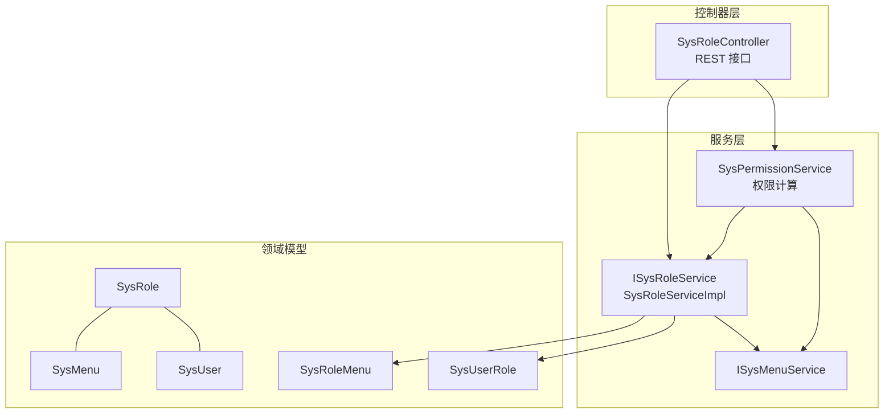
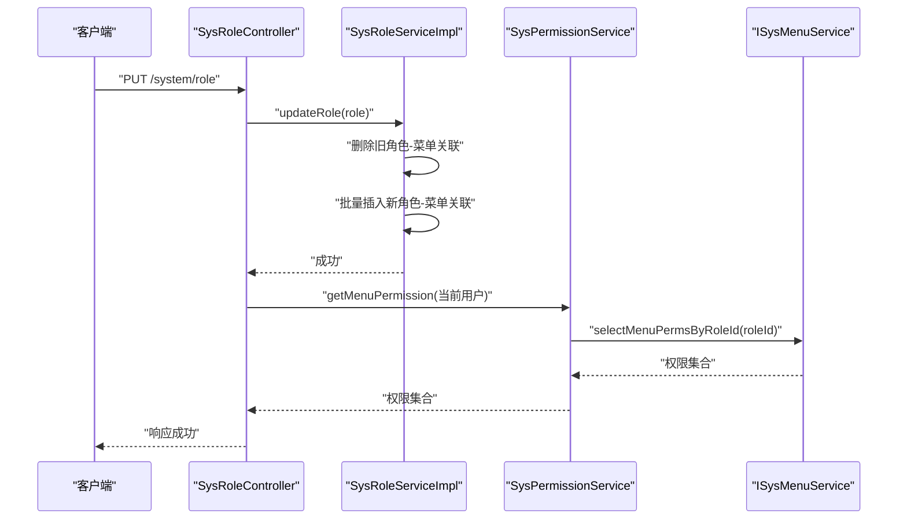
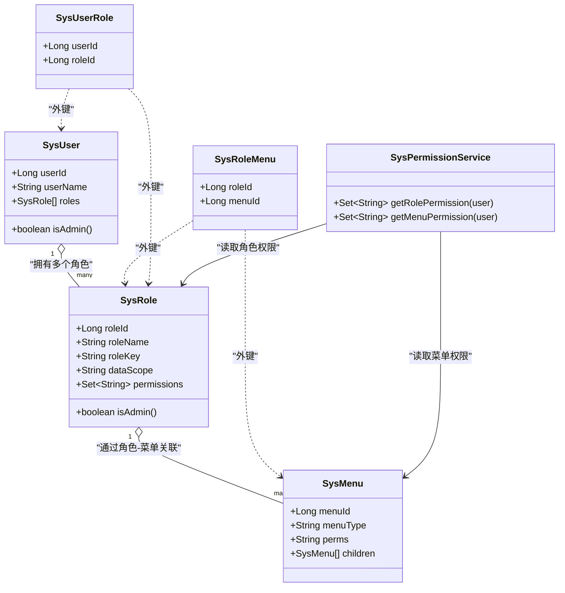
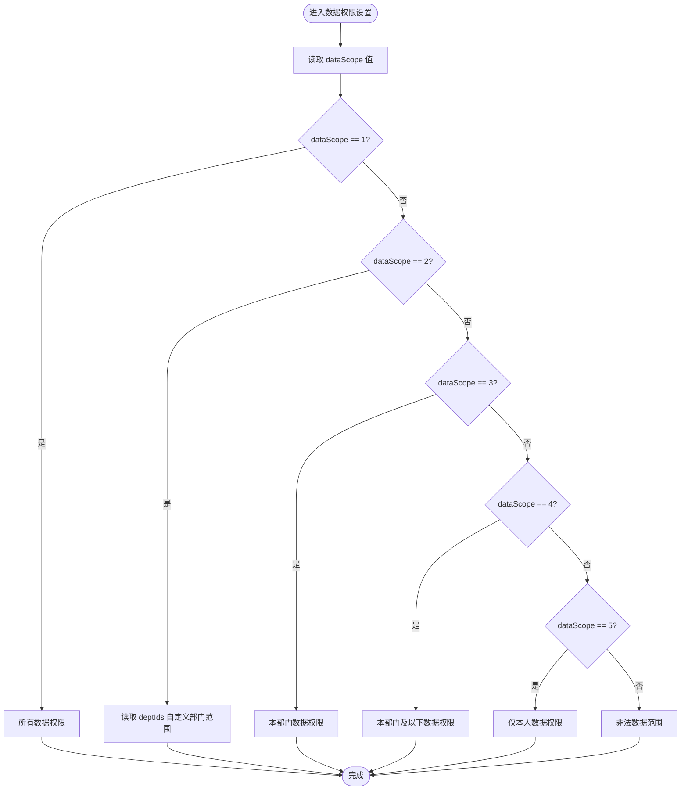
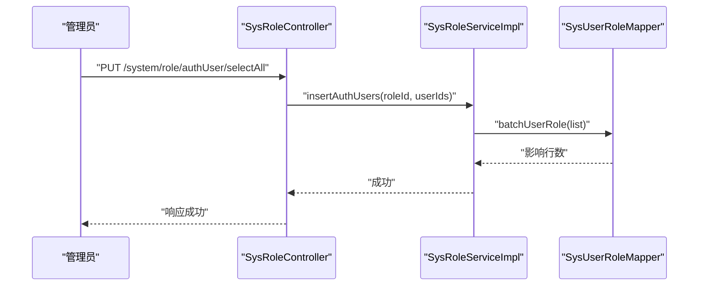
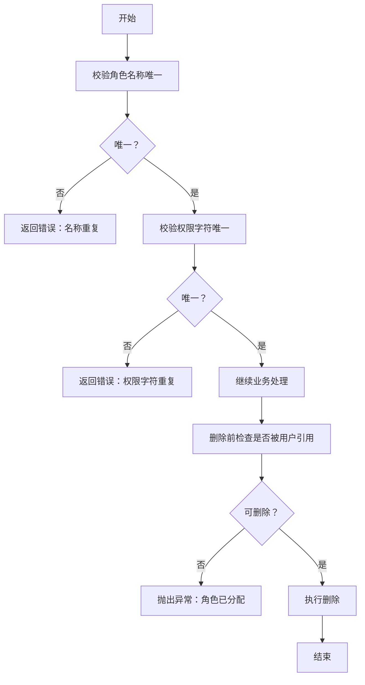
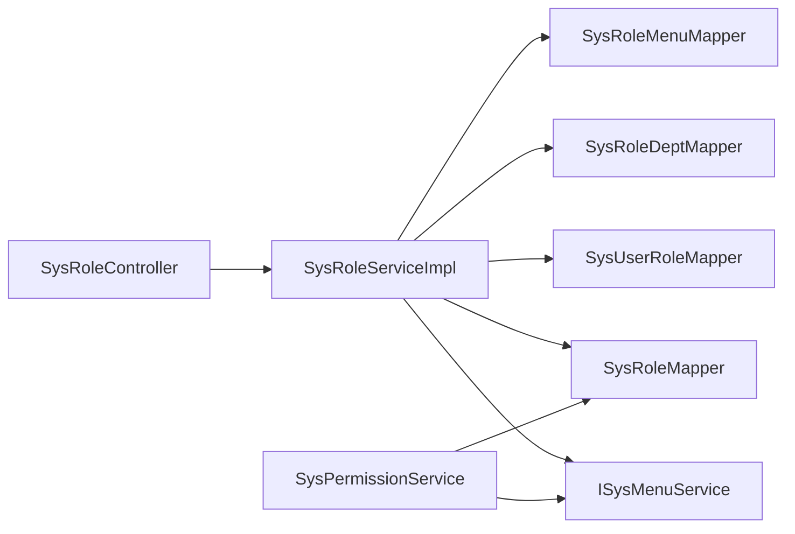

# 角色管理接口

<cite>
**本文引用的文件**
- [SysRoleController.java](file://PezMax-Backend/ruoyi-admin/src/main/java/com/ruoyi/web/controller/system/SysRoleController.java)
- [SysRoleServiceImpl.java](file://PezMax-Backend/ruoyi-system/src/main/java/com/ruoyi/system/service/impl/SysRoleServiceImpl.java)
- [SysPermissionService.java](file://PezMax-Backend/ruoyi-framework/src/main/java/com/ruoyi/framework/web/service/SysPermissionService.java)
- [SysRole.java](file://PezMax-Backend/ruoyi-common/src/main/java/com/ruoyi/common/core/domain/entity/SysRole.java)
- [SysMenu.java](file://PezMax-Backend/ruoyi-common/src/main/java/com/ruoyi/common/core/domain/entity/SysMenu.java)
- [SysUser.java](file://PezMax-Backend/ruoyi-common/src/main/java/com/ruoyi/common/core/domain/entity/SysUser.java)
- [SysRoleMenu.java](file://PezMax-Backend/ruoyi-system/src/main/java/com/ruoyi/system/domain/SysRoleMenu.java)
- [SysUserRole.java](file://PezMax-Backend/ruoyi-system/src/main/java/com/ruoyi/system/domain/SysUserRole.java)
</cite>

## 目录
1. [简介](#简介)
2. [项目结构](#项目结构)
3. [核心组件](#核心组件)
4. [架构总览](#架构总览)
5. [详细组件分析](#详细组件分析)
6. [依赖关系分析](#依赖关系分析)
7. [性能考虑](#性能考虑)
8. [故障排查指南](#故障排查指南)
9. [结论](#结论)
10. [附录](#附录)

## 简介
本文件面向“角色管理”相关 API 的完整文档，覆盖以下能力：
- 角色定义管理（增删改查）
- 角色权限配置（菜单与按钮级权限）
- 角色数据权限范围设置
- 角色用户绑定（授权/取消授权）
- RBAC 权限模型实现、自定义权限标识
- 安全机制：角色校验、权限校验、冲突检测
- 权限矩阵配置示例与最佳实践

## 项目结构
角色管理在后台采用分层架构：控制器层暴露 REST 接口；服务层封装业务逻辑与事务；领域实体承载数据模型；权限服务负责权限计算与缓存更新。

图表来源
- [SysRoleController.java:1-263](file://PezMax-Backend/ruoyi-admin/src/main/java/com/ruoyi/web/controller/system/SysRoleController.java#L1-L263)
- [SysRoleServiceImpl.java:1-427](file://PezMax-Backend/ruoyi-system/src/main/java/com/ruoyi/system/service/impl/SysRoleServiceImpl.java#L1-L427)
- [SysPermissionService.java:1-90](file://PezMax-Backend/ruoyi-framework/src/main/java/com/ruoyi/framework/web/service/SysPermissionService.java#L1-L90)
- [SysRole.java:1-242](file://PezMax-Backend/ruoyi-common/src/main/java/com/ruoyi/common/core/domain/entity/SysRole.java#L1-L242)
- [SysMenu.java:1-275](file://PezMax-Backend/ruoyi-common/src/main/java/com/ruoyi/common/core/domain/entity/SysMenu.java#L1-L275)
- [SysUser.java:1-337](file://PezMax-Backend/ruoyi-common/src/main/java/com/ruoyi/common/core/domain/entity/SysUser.java#L1-L337)
- [SysRoleMenu.java:1-47](file://PezMax-Backend/ruoyi-system/src/main/java/com/ruoyi/system/domain/SysRoleMenu.java#L1-L47)
- [SysUserRole.java:1-47](file://PezMax-Backend/ruoyi-system/src/main/java/com/ruoyi/system/domain/SysUserRole.java#L1-L47)

章节来源
- [SysRoleController.java:1-263](file://PezMax-Backend/ruoyi-admin/src/main/java/com/ruoyi/web/controller/system/SysRoleController.java#L1-L263)
- [SysRoleServiceImpl.java:1-427](file://PezMax-Backend/ruoyi-system/src/main/java/com/ruoyi/system/service/impl/SysRoleServiceImpl.java#L1-L427)
- [SysPermissionService.java:1-90](file://PezMax-Backend/ruoyi-framework/src/main/java/com/ruoyi/framework/web/service/SysPermissionService.java#L1-L90)

## 核心组件
- SysRoleController：提供角色管理的 REST 接口，包含分页查询、导出、新增、修改、状态变更、删除、部门树、用户授权等。
- SysRoleServiceImpl：实现角色 CRUD、唯一性校验、数据权限范围、菜单/部门关联、用户授权等事务性操作。
- SysPermissionService：根据用户角色计算菜单权限集合，支持管理员全量权限与多角色合并。
- 领域模型：
  - SysRole：角色主数据，含名称、权限字符、排序、数据范围、严格联动标志、状态等。
  - SysMenu：菜单/按钮节点，含类型（目录/菜单/按钮）、权限标识 perms、父子关系等。
  - SysUser：用户实体，包含角色列表与角色组。
  - SysRoleMenu：角色-菜单关联。
  - SysUserRole：用户-角色关联。

章节来源
- [SysRoleController.java:1-263](file://PezMax-Backend/ruoyi-admin/src/main/java/com/ruoyi/web/controller/system/SysRoleController.java#L1-L263)
- [SysRoleServiceImpl.java:1-427](file://PezMax-Backend/ruoyi-system/src/main/java/com/ruoyi/system/service/impl/SysRoleServiceImpl.java#L1-L427)
- [SysPermissionService.java:1-90](file://PezMax-Backend/ruoyi-framework/src/main/java/com/ruoyi/framework/web/service/SysPermissionService.java#L1-L90)
- [SysRole.java:1-242](file://PezMax-Backend/ruoyi-common/src/main/java/com/ruoyi/common/core/domain/entity/SysRole.java#L1-L242)
- [SysMenu.java:1-275](file://PezMax-Backend/ruoyi-common/src/main/java/com/ruoyi/common/core/domain/entity/SysMenu.java#L1-L275)
- [SysUser.java:1-337](file://PezMax-Backend/ruoyi-common/src/main/java/com/ruoyi/common/core/domain/entity/SysUser.java#L1-L337)
- [SysRoleMenu.java:1-47](file://PezMax-Backend/ruoyi-system/src/main/java/com/ruoyi/system/domain/SysRoleMenu.java#L1-L47)
- [SysUserRole.java:1-47](file://PezMax-Backend/ruoyi-system/src/main/java/com/ruoyi/system/domain/SysUserRole.java#L1-L47)

## 架构总览
RBAC 权限模型在本系统中的落地方式：
- 用户-角色：通过 SysUserRole 建立多对多关系。
- 角色-菜单：通过 SysRoleMenu 建立多对多关系，菜单节点包含 perms 作为按钮级权限标识。
- 权限计算：登录或权限刷新时，由 SysPermissionService 汇总用户所有角色的菜单权限集合，并写入当前会话上下文。
- 数据权限：角色 dataScope 控制数据可见范围，结合部门树进行过滤。

图表来源
- [SysRoleController.java:112-142](file://PezMax-Backend/ruoyi-admin/src/main/java/com/ruoyi/web/controller/system/SysRoleController.java#L112-L142)
- [SysRoleServiceImpl.java:247-256](file://PezMax-Backend/ruoyi-system/src/main/java/com/ruoyi/system/service/impl/SysRoleServiceImpl.java#L247-L256)
- [SysPermissionService.java:58-88](file://PezMax-Backend/ruoyi-framework/src/main/java/com/ruoyi/framework/web/service/SysPermissionService.java#L58-L88)

## 详细组件分析

### 角色管理 API 清单与说明
- 获取角色列表
  - 方法：GET
  - 路径：/system/role/list
  - 功能：分页查询角色列表，支持按条件筛选
  - 鉴权：需要 system:role:list 权限
- 导出角色
  - 方法：POST
  - 路径：/system/role/export
  - 功能：将角色列表导出为 Excel
  - 鉴权：需要 system:role:export 权限
- 获取角色详情
  - 方法：GET
  - 路径：/system/role/{roleId}
  - 功能：根据角色 ID 获取详细信息
  - 鉴权：需要 system:role:query 权限
- 新增角色
  - 方法：POST
  - 路径：/system/role
  - 功能：新增角色，校验名称与权限字符唯一性
  - 鉴权：需要 system:role:add 权限
- 修改角色
  - 方法：PUT
  - 路径：/system/role
  - 功能：修改角色信息，成功后刷新当前用户权限缓存
  - 鉴权：需要 system:role:edit 权限
- 修改数据权限范围
  - 方法：PUT
  - 路径：/system/role/dataScope
  - 功能：设置角色数据范围及可选部门范围
  - 鉴权：需要 system:role:edit 权限
- 修改角色状态
  - 方法：PUT
  - 路径：/system/role/changeStatus
  - 功能：启用/停用角色
  - 鉴权：需要 system:role:edit 权限
- 删除角色
  - 方法：DELETE
  - 路径：/system/role/{roleIds}
  - 功能：批量删除角色（需满足未被用户引用等约束）
  - 鉴权：需要 system:role:remove 权限
- 获取角色选项
  - 方法：GET
  - 路径：/system/role/optionselect
  - 功能：返回所有角色用于下拉选择
  - 鉴权：需要 system:role:query 权限
- 已分配用户列表
  - 方法：GET
  - 路径：/system/role/authUser/allocatedList
  - 功能：分页查询已分配该角色的用户
  - 鉴权：需要 system:role:list 权限
- 未分配用户列表
  - 方法：GET
  - 路径：/system/role/authUser/unallocatedList
  - 功能：分页查询未分配该角色的用户
  - 鉴权：需要 system:role:list 权限
- 取消授权用户
  - 方法：PUT
  - 路径：/system/role/authUser/cancel
  - 功能：取消单个用户的角色
  - 鉴权：需要 system:role:edit 权限
- 批量取消授权用户
  - 方法：PUT
  - 路径：/system/role/authUser/cancelAll
  - 功能：批量取消用户角色
  - 鉴权：需要 system:role:edit 权限
- 批量选择用户授权
  - 方法：PUT
  - 路径：/system/role/authUser/selectAll
  - 功能：批量为用户授予角色
  - 鉴权：需要 system:role:edit 权限
- 获取角色部门树
  - 方法：GET
  - 路径：/system/role/deptTree/{roleId}
  - 功能：返回角色已选部门与全部部门树，用于数据权限配置
  - 鉴权：需要 system:role:query 权限

章节来源
- [SysRoleController.java:58-261](file://PezMax-Backend/ruoyi-admin/src/main/java/com/ruoyi/web/controller/system/SysRoleController.java#L58-L261)

### RBAC 权限模型与权限计算
- 角色-菜单-按钮
  - 菜单节点类型包含目录、菜单、按钮，按钮级权限通过 perms 标识。
  - 角色通过 SysRoleMenu 与菜单建立关联，从而获得对应菜单与按钮权限。
- 权限集合计算
  - 管理员拥有全部权限。
  - 非管理员：聚合其所有角色的菜单权限集合，得到最终权限集。
- 权限缓存与刷新
  - 修改角色后，若当前用户不是管理员，会重新加载用户信息与权限集合，并更新到 Token 会话中。

图表来源
- [SysUser.java:86-89](file://PezMax-Backend/ruoyi-common/src/main/java/com/ruoyi/common/core/domain/entity/SysUser.java#L86-L89)
- [SysRole.java:64-66](file://PezMax-Backend/ruoyi-common/src/main/java/com/ruoyi/common/core/domain/entity/SysRole.java#L64-L66)
- [SysMenu.java:54-64](file://PezMax-Backend/ruoyi-common/src/main/java/com/ruoyi/common/core/domain/entity/SysMenu.java#L54-L64)
- [SysRoleMenu.java:13-17](file://PezMax-Backend/ruoyi-system/src/main/java/com/ruoyi/system/domain/SysRoleMenu.java#L13-L17)
- [SysUserRole.java:13-17](file://PezMax-Backend/ruoyi-system/src/main/java/com/ruoyi/system/domain/SysUserRole.java#L13-L17)
- [SysPermissionService.java:37-88](file://PezMax-Backend/ruoyi-framework/src/main/java/com/ruoyi/framework/web/service/SysPermissionService.java#L37-L88)

章节来源
- [SysPermissionService.java:37-88](file://PezMax-Backend/ruoyi-framework/src/main/java/com/ruoyi/framework/web/service/SysPermissionService.java#L37-L88)
- [SysRoleServiceImpl.java:92-104](file://PezMax-Backend/ruoyi-system/src/main/java/com/ruoyi/system/service/impl/SysRoleServiceImpl.java#L92-L104)
- [SysMenu.java:54-64](file://PezMax-Backend/ruoyi-common/src/main/java/com/ruoyi/common/core/domain/entity/SysMenu.java#L54-L64)

### 数据权限范围设置
- 数据范围枚举
  - 1：所有数据权限
  - 2：自定义数据权限
  - 3：本部门数据权限
  - 4：本部门及以下数据权限
  - 5：仅本人数据权限
- 自定义数据权限
  - 当 dataScope=2 时，可通过 deptIds 指定允许访问的部门集合。
- 接口
  - PUT /system/role/dataScope：保存角色的数据范围与部门范围。
- 生效范围
  - 查询接口使用 @DataScope 注解进行 SQL 注入式数据范围过滤（具体 SQL 拼接由框架处理）。

图表来源
- [SysRole.java:38-40](file://PezMax-Backend/ruoyi-common/src/main/java/com/ruoyi/common/core/domain/entity/SysRole.java#L38-L40)
- [SysRoleServiceImpl.java:277-286](file://PezMax-Backend/ruoyi-system/src/main/java/com/ruoyi/system/service/impl/SysRoleServiceImpl.java#L277-L286)

章节来源
- [SysRole.java:38-40](file://PezMax-Backend/ruoyi-common/src/main/java/com/ruoyi/common/core/domain/entity/SysRole.java#L38-L40)
- [SysRoleServiceImpl.java:277-286](file://PezMax-Backend/ruoyi-system/src/main/java/com/ruoyi/system/service/impl/SysRoleServiceImpl.java#L277-L286)

### 角色用户绑定（授权/取消授权）
- 已分配/未分配用户查询
  - GET /system/role/authUser/allocatedList
  - GET /system/role/authUser/unallocatedList
- 授权/取消授权
  - PUT /system/role/authUser/selectAll：批量授权
  - PUT /system/role/authUser/cancel：取消单个用户授权
  - PUT /system/role/authUser/cancelAll：批量取消授权
- 内部实现
  - 通过 SysUserRole 维护用户与角色关联，支持批量插入与批量删除。

图表来源
- [SysRoleController.java:241-248](file://PezMax-Backend/ruoyi-admin/src/main/java/com/ruoyi/web/controller/system/SysRoleController.java#L241-L248)
- [SysRoleServiceImpl.java:412-425](file://PezMax-Backend/ruoyi-system/src/main/java/com/ruoyi/system/service/impl/SysRoleServiceImpl.java#L412-L425)

章节来源
- [SysRoleController.java:195-248](file://PezMax-Backend/ruoyi-admin/src/main/java/com/ruoyi/web/controller/system/SysRoleController.java#L195-L248)
- [SysRoleServiceImpl.java:386-425](file://PezMax-Backend/ruoyi-system/src/main/java/com/ruoyi/system/service/impl/SysRoleServiceImpl.java#L386-L425)

### 安全机制与冲突检测
- 角色唯一性校验
  - 角色名称唯一：checkRoleNameUnique
  - 角色权限字符唯一：checkRoleKeyUnique
- 超级管理员保护
  - 禁止修改或删除超级管理员角色（roleId=1）。
- 数据权限访问控制
  - checkRoleDataScope：非管理员操作角色时需具备相应数据范围。
- 删除前检查
  - 删除角色前检查是否已被用户引用，避免破坏一致性。
- 权限刷新
  - 修改角色后，若非管理员，自动刷新当前用户权限至 Token。

图表来源
- [SysRoleServiceImpl.java:147-175](file://PezMax-Backend/ruoyi-system/src/main/java/com/ruoyi/system/service/impl/SysRoleServiceImpl.java#L147-L175)
- [SysRoleServiceImpl.java:182-212](file://PezMax-Backend/ruoyi-system/src/main/java/com/ruoyi/system/service/impl/SysRoleServiceImpl.java#L182-L212)
- [SysRoleServiceImpl.java:360-378](file://PezMax-Backend/ruoyi-system/src/main/java/com/ruoyi/system/service/impl/SysRoleServiceImpl.java#L360-L378)

章节来源
- [SysRoleServiceImpl.java:147-212](file://PezMax-Backend/ruoyi-system/src/main/java/com/ruoyi/system/service/impl/SysRoleServiceImpl.java#L147-L212)
- [SysRoleServiceImpl.java:360-378](file://PezMax-Backend/ruoyi-system/src/main/java/com/ruoyi/system/service/impl/SysRoleServiceImpl.java#L360-L378)

### 菜单权限分配与按钮级控制
- 菜单类型
  - M：目录
  - C：菜单
  - F：按钮
- 权限标识
  - 每个菜单节点可设置 perms，作为按钮级权限标识。
- 角色-菜单关联
  - 通过 SysRoleMenu 将角色与菜单节点关联，从而赋予菜单与按钮权限。
- 权限计算
  - 登录或刷新时，系统聚合角色对应的菜单权限集合，形成用户最终权限集。

章节来源
- [SysMenu.java:54-64](file://PezMax-Backend/ruoyi-common/src/main/java/com/ruoyi/common/core/domain/entity/SysMenu.java#L54-L64)
- [SysRoleMenu.java:13-17](file://PezMax-Backend/ruoyi-system/src/main/java/com/ruoyi/system/domain/SysRoleMenu.java#L13-L17)
- [SysPermissionService.java:58-88](file://PezMax-Backend/ruoyi-framework/src/main/java/com/ruoyi/framework/web/service/SysPermissionService.java#L58-L88)

### 角色继承关系
- 当前实现未提供显式的“角色继承”机制。
- 如需近似效果，可通过以下方式实现：
  - 将基础角色权限赋给多个子角色，或通过用户同时拥有多个角色来叠加权限。
  - 在业务层维护角色层级映射，并在权限计算时递归聚合父角色权限（需扩展权限服务）。

[本节为概念性说明，不直接分析具体文件]

## 依赖关系分析
- 控制器依赖服务层与权限服务，服务层依赖 Mapper 与领域模型。
- 权限服务依赖角色服务与菜单服务，负责权限集合计算。
- 角色与菜单、用户之间通过中间表建立多对多关系。

图表来源
- [SysRoleController.java:43-56](file://PezMax-Backend/ruoyi-admin/src/main/java/com/ruoyi/web/controller/system/SysRoleController.java#L43-L56)
- [SysRoleServiceImpl.java:35-45](file://PezMax-Backend/ruoyi-system/src/main/java/com/ruoyi/system/service/impl/SysRoleServiceImpl.java#L35-L45)
- [SysPermissionService.java:25-29](file://PezMax-Backend/ruoyi-framework/src/main/java/com/ruoyi/framework/web/service/SysPermissionService.java#L25-L29)

章节来源
- [SysRoleController.java:43-56](file://PezMax-Backend/ruoyi-admin/src/main/java/com/ruoyi/web/controller/system/SysRoleController.java#L43-L56)
- [SysRoleServiceImpl.java:35-45](file://PezMax-Backend/ruoyi-system/src/main/java/com/ruoyi/system/service/impl/SysRoleServiceImpl.java#L35-L45)
- [SysPermissionService.java:25-29](file://PezMax-Backend/ruoyi-framework/src/main/java/com/ruoyi/framework/web/service/SysPermissionService.java#L25-L29)

## 性能考虑
- 权限集合计算
  - 建议将用户权限集合缓存至 Redis，减少频繁数据库查询。
- 批量操作
  - 授权/取消授权使用批量接口，降低往返次数。
- 数据权限
  - 合理设置 dataScope，避免过宽的自定义部门范围导致查询膨胀。
- 事务边界
  - 角色与菜单/部门/用户关联的写操作应置于事务中，保证一致性。

[本节提供通用指导，不直接分析具体文件]

## 故障排查指南
- 常见错误
  - 角色名称或权限字符重复：检查唯一性校验逻辑与输入参数。
  - 无法删除角色：确认是否已被用户引用。
  - 修改角色后权限未刷新：确认是否为管理员，以及 Token 是否更新。
- 定位步骤
  - 查看控制器日志与业务日志。
  - 核对角色状态与数据范围配置。
  - 检查角色-菜单、用户-角色关联是否存在。

章节来源
- [SysRoleController.java:94-142](file://PezMax-Backend/ruoyi-admin/src/main/java/com/ruoyi/web/controller/system/SysRoleController.java#L94-L142)
- [SysRoleServiceImpl.java:360-378](file://PezMax-Backend/ruoyi-system/src/main/java/com/ruoyi/system/service/impl/SysRoleServiceImpl.java#L360-L378)

## 结论
本系统基于标准 RBAC 模型，实现了角色定义管理、菜单与按钮级权限配置、数据权限范围、用户授权与权限刷新等核心能力。通过严格的唯一性与冲突检测、管理员保护与数据权限控制，保障了权限体系的安全性与一致性。建议在大规模部署中引入权限缓存与异步刷新策略，以提升性能与用户体验。

[本节为总结性内容，不直接分析具体文件]

## 附录

### 权限矩阵配置示例（概念性）
- 角色与权限标识
  - 管理员：拥有全部权限标识
  - 普通角色：按需分配菜单与按钮权限标识
- 示例矩阵（示意）
  - 角色A：menu:view, button:edit, button:delete
  - 角色B：menu:view, button:edit
  - 角色C：menu:view
- 说明
  - 上述标识应与菜单节点的 perms 字段一致。
  - 前端通过权限指令或路由守卫控制显示与交互。

[本节为概念性示例，不直接分析具体文件]

### 最佳实践指南
- 命名规范
  - 角色名称简洁明确，权限字符遵循模块:资源:动作风格。
- 最小权限原则
  - 仅授予必要的菜单与按钮权限。
- 数据权限
  - 优先使用内置数据范围，必要时谨慎使用自定义部门范围。
- 变更流程
  - 角色变更后及时刷新权限缓存，确保在线用户即时生效。
- 审计与监控
  - 记录关键权限变更操作，便于审计与回溯。

[本节为通用指导，不直接分析具体文件]