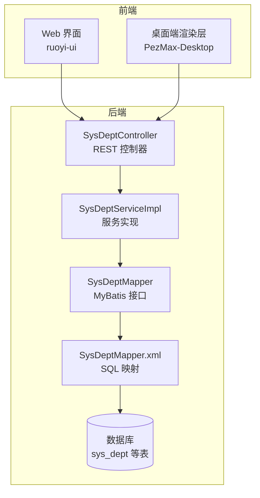
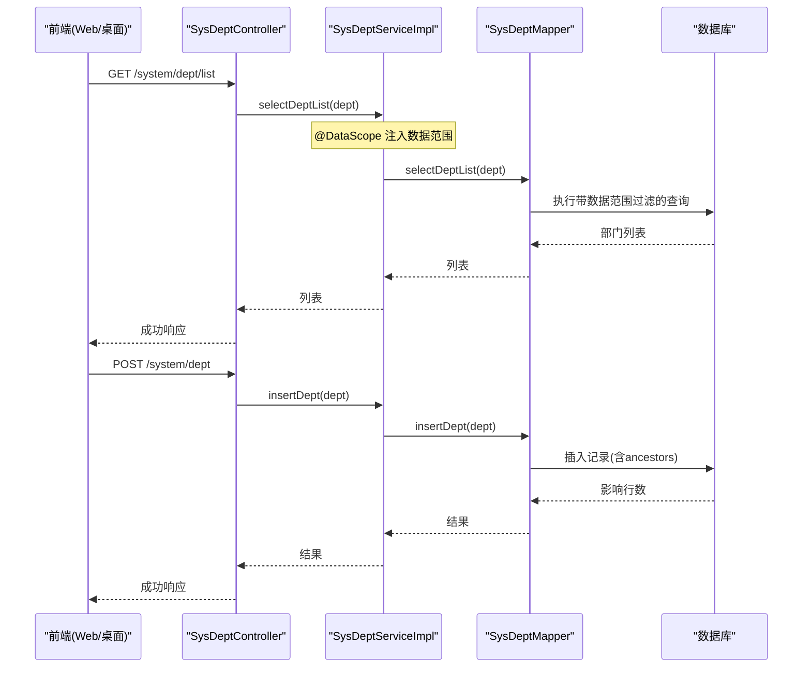
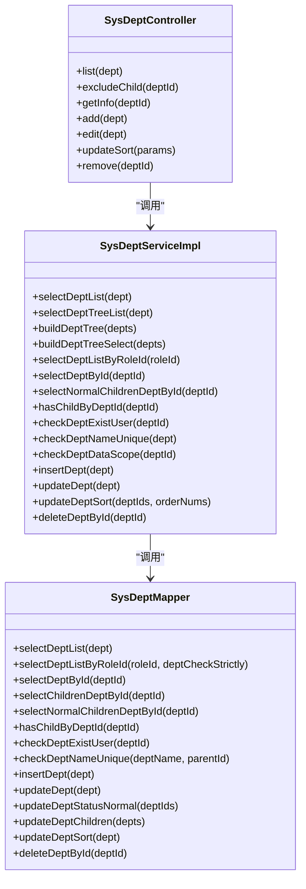

# 部门管理接口

<cite>
**本文引用的文件**   
- [SysDeptController.java](file://PezMax-Backend/ruoyi-admin/src/main/java/com/ruoyi/web/controller/system/SysDeptController.java)
- [SysDeptServiceImpl.java](file://PezMax-Backend/ruoyi-system/src/main/java/com/ruoyi/system/service/impl/SysDeptServiceImpl.java)
- [SysDeptMapper.java](file://PezMax-Backend/ruoyi-system/src/main/java/com/ruoyi/system/mapper/SysDeptMapper.java)
- [SysDeptMapper.xml](file://PezMax-Backend/ruoyi-system/src/main/resources/mapper/system/SysDeptMapper.xml)
- [SysDept.java](file://PezMax-Backend/ruoyi-common/src/main/java/com/ruoyi/common/core/domain/entity/SysDept.java)
- [DataScope.java](file://PezMax-Backend/ruoyi-common/src/main/java/com/ruoyi/common/annotation/DataScope.java)
- [dept.js（Web端）](file://PezMax-Backend/ruoyi-ui/src/api/system/dept.js)
- [dept.js（桌面端）](file://PezMax-Desktop/src/renderer/api/system/dept.js)
</cite>

## 目录
1. [简介](#简介)
2. [项目结构](#项目结构)
3. [核心组件](#核心组件)
4. [架构总览](#架构总览)
5. [详细组件分析](#详细组件分析)
6. [依赖关系分析](#依赖关系分析)
7. [性能与扩展性](#性能与扩展性)
8. [故障排查指南](#故障排查指南)
9. [结论](#结论)
10. [附录：接口清单与数据模型](#附录接口清单与数据模型)

## 简介
本文件面向“部门管理”相关 API，覆盖组织架构维护（增删改查）、树形结构展示、层级关系维护、部门负责人设置、数据权限控制与隔离、跨部门访问规则、排序保存、状态管理、以及操作审计日志等。同时提供复杂组织变更（迁移、合并、拆分）的处理方案建议，并给出统计信息（成员数量、部门状态）的落地方式与实现要点。

## 项目结构
后端采用典型分层架构：控制器层暴露 REST 接口，服务层封装业务逻辑与事务，数据访问层通过 MyBatis 映射到数据库；前端 Web 与桌面端均调用同一套后端接口。

图表来源
- [SysDeptController.java:1-148](file://PezMax-Backend/ruoyi-admin/src/main/java/com/ruoyi/web/controller/system/SysDeptController.java#L1-L148)
- [SysDeptServiceImpl.java:1-365](file://PezMax-Backend/ruoyi-system/src/main/java/com/ruoyi/system/service/impl/SysDeptServiceImpl.java#L1-L365)
- [SysDeptMapper.java:1-126](file://PezMax-Backend/ruoyi-system/src/main/java/com/ruoyi/system/mapper/SysDeptMapper.java#L1-L126)
- [SysDeptMapper.xml:1-163](file://PezMax-Backend/ruoyi-system/src/main/resources/mapper/system/SysDeptMapper.xml#L1-L163)

章节来源
- [SysDeptController.java:1-148](file://PezMax-Backend/ruoyi-admin/src/main/java/com/ruoyi/web/controller/system/SysDeptController.java#L1-L148)
- [SysDeptServiceImpl.java:1-365](file://PezMax-Backend/ruoyi-system/src/main/java/com/ruoyi/system/service/impl/SysDeptServiceImpl.java#L1-L365)
- [SysDeptMapper.java:1-126](file://PezMax-Backend/ruoyi-system/src/main/java/com/ruoyi/system/mapper/SysDeptMapper.java#L1-L126)
- [SysDeptMapper.xml:1-163](file://PezMax-Backend/ruoyi-system/src/main/resources/mapper/system/SysDeptMapper.xml#L1-L163)

## 核心组件
- 控制器层：统一处理 HTTP 请求、鉴权注解、参数校验、日志切面、返回结果封装。
- 服务层：实现部门树构建、祖先路径维护、子节点级联更新、数据权限检查、排序批量更新等。
- 数据访问层：提供列表查询、唯一性校验、存在性检查、软删除、批量更新等 SQL 映射。
- 实体模型：部门对象包含层级字段 ancestors、父子关系、状态、负责人等。
- 数据权限：基于 @DataScope 注解在查询时注入数据范围过滤条件。

章节来源
- [SysDeptController.java:1-148](file://PezMax-Backend/ruoyi-admin/src/main/java/com/ruoyi/web/controller/system/SysDeptController.java#L1-L148)
- [SysDeptServiceImpl.java:1-365](file://PezMax-Backend/ruoyi-system/src/main/java/com/ruoyi/system/service/impl/SysDeptServiceImpl.java#L1-L365)
- [SysDeptMapper.java:1-126](file://PezMax-Backend/ruoyi-system/src/main/java/com/ruoyi/system/mapper/SysDeptMapper.java#L1-L126)
- [SysDept.java:1-204](file://PezMax-Backend/ruoyi-common/src/main/java/com/ruoyi/common/core/domain/entity/SysDept.java#L1-L204)
- [DataScope.java:1-34](file://PezMax-Backend/ruoyi-common/src/main/java/com/ruoyi/common/annotation/DataScope.java#L1-L34)

## 架构总览
下图展示了从前端到数据库的完整调用链，包括数据权限注入与树形结构构建。

图表来源
- [SysDeptController.java:38-86](file://PezMax-Backend/ruoyi-admin/src/main/java/com/ruoyi/web/controller/system/SysDeptController.java#L38-L86)
- [SysDeptServiceImpl.java:44-222](file://PezMax-Backend/ruoyi-system/src/main/java/com/ruoyi/system/service/impl/SysDeptServiceImpl.java#L44-L222)
- [SysDeptMapper.xml:30-116](file://PezMax-Backend/ruoyi-system/src/main/resources/mapper/system/SysDeptMapper.xml#L30-L116)

## 详细组件分析

### 控制器层：SysDeptController
职责
- 暴露部门管理的 REST 接口：列表、详情、新增、修改、排序、删除、排除节点列表。
- 使用 @PreAuthorize 进行接口级权限控制。
- 使用 @Log 对关键写操作进行审计日志记录。
- 调用服务层完成业务逻辑，统一返回 AjaxResult。

关键流程
- 列表查询：支持按名称、状态、父ID筛选，并受数据权限控制。
- 详情查询：先做数据权限校验，再返回详情。
- 新增：校验名称唯一性，写入创建人。
- 修改：校验名称唯一性、上级不能是自己、停用限制（存在未停用子部门则不允许停用），写入更新人。
- 排序：批量更新 orderNum。
- 删除：前置校验是否存在子部门或用户，再做数据权限校验后软删除。

章节来源
- [SysDeptController.java:38-146](file://PezMax-Backend/ruoyi-admin/src/main/java/com/ruoyi/web/controller/system/SysDeptController.java#L38-L146)

### 服务层：SysDeptServiceImpl
职责
- 实现部门树构建与下拉树转换。
- 维护 ancestors 祖级路径，保证层级查询高效。
- 提供数据权限检查方法 checkDeptDataScope。
- 实现排序批量更新的事务保障。
- 提供角色关联部门查询能力。

重点逻辑
- 树构建：buildDeptTree 将平铺列表组装为树；buildDeptTreeSelect 转换为 TreeSelect 供前端选择器使用。
- 祖先路径：insertDept/updateDept 中根据父节点 ancestors 计算当前 ancestors；updateDeptChildren 级联更新子孙 ancestors。
- 状态联动：当启用某部门时，自动启用其所有上级部门。
- 数据权限：@DataScope 在 selectDeptList 上生效，结合 Mapper XML 中的 ${params.dataScope} 动态拼接过滤条件。

章节来源
- [SysDeptServiceImpl.java:44-365](file://PezMax-Backend/ruoyi-system/src/main/java/com/ruoyi/system/service/impl/SysDeptServiceImpl.java#L44-L365)
- [DataScope.java:1-34](file://PezMax-Backend/ruoyi-common/src/main/java/com/ruoyi/common/annotation/DataScope.java#L1-L34)

### 数据访问层：SysDeptMapper 与 SysDeptMapper.xml
职责
- 定义部门 CRUD、存在性检查、唯一性校验、子节点查询、批量更新等接口。
- 在 XML 中实现 SQL，包含数据范围占位符、级联更新、软删除等。

关键点
- 列表查询：支持多条件组合，并在末尾拼接 ${params.dataScope} 以应用数据权限。
- 子树查询：selectChildrenDeptById 使用 find_in_set 匹配 ancestors。
- 级联更新：updateDeptChildren 使用 case when 批量更新子孙 ancestors。
- 软删除：deleteDeptById 将 del_flag 置为 '2'。

章节来源
- [SysDeptMapper.java:1-126](file://PezMax-Backend/ruoyi-system/src/main/java/com/ruoyi/system/mapper/SysDeptMapper.java#L1-L126)
- [SysDeptMapper.xml:1-163](file://PezMax-Backend/ruoyi-system/src/main/resources/mapper/system/SysDeptMapper.xml#L1-L163)

### 实体模型：SysDept
字段说明
- deptId：主键
- parentId：父部门ID
- ancestors：祖级路径（逗号分隔），用于快速判断上下级关系
- deptName：部门名称
- orderNum：显示顺序
- leader：负责人（文本字段）
- phone/email：联系方式
- status：状态（正常/停用）
- delFlag：逻辑删除标记
- parentName：父部门名称（查询时填充）
- children：子节点集合（树构建时使用）

章节来源
- [SysDept.java:1-204](file://PezMax-Backend/ruoyi-common/src/main/java/com/ruoyi/common/core/domain/entity/SysDept.java#L1-L204)

### 前端接口适配
- Web 端与桌面端均提供 dept.js，封装了 list、exclude、get、add、update、updateSort、del 等方法，统一调用后端 /system/dept/* 接口。

章节来源
- [dept.js（Web端）:1-61](file://PezMax-Backend/ruoyi-ui/src/api/system/dept.js#L1-L61)
- [dept.js（桌面端）:1-61](file://PezMax-Desktop/src/renderer/api/system/dept.js#L1-L61)

## 依赖关系分析
- 控制器依赖服务接口 ISysDeptService。
- 服务实现依赖 SysDeptMapper 与 SysRoleMapper（角色关联）。
- Mapper 依赖 XML 中的 SQL 映射。
- 数据权限通过 @DataScope 注解在服务方法上生效，最终由 AOP 在 SQL 中拼接 dataScope 片段。

图表来源
- [SysDeptController.java:1-148](file://PezMax-Backend/ruoyi-admin/src/main/java/com/ruoyi/web/controller/system/SysDeptController.java#L1-L148)
- [SysDeptServiceImpl.java:1-365](file://PezMax-Backend/ruoyi-system/src/main/java/com/ruoyi/system/service/impl/SysDeptServiceImpl.java#L1-L365)
- [SysDeptMapper.java:1-126](file://PezMax-Backend/ruoyi-system/src/main/java/com/ruoyi/system/mapper/SysDeptMapper.java#L1-L126)

章节来源
- [SysDeptController.java:1-148](file://PezMax-Backend/ruoyi-admin/src/main/java/com/ruoyi/web/controller/system/SysDeptController.java#L1-L148)
- [SysDeptServiceImpl.java:1-365](file://PezMax-Backend/ruoyi-system/src/main/java/com/ruoyi/system/service/impl/SysDeptServiceImpl.java#L1-L365)
- [SysDeptMapper.java:1-126](file://PezMax-Backend/ruoyi-system/src/main/java/com/ruoyi/system/mapper/SysDeptMapper.java#L1-L126)

## 性能与扩展性
- 树形结构：通过 ancestors 字段避免递归自连接，提升层级查询效率；树构建在内存中完成，适合中小规模组织。
- 批量更新：updateDeptChildren 使用 case when 批量更新，减少往返次数。
- 数据权限：通过 AOP 动态拼接 SQL 片段，避免在 Java 层二次过滤，降低内存开销。
- 排序更新：updateDeptSort 使用事务包裹，确保一致性。
- 可扩展点：如需大规模组织树缓存，可在服务层引入 Redis 缓存树结构，并提供失效策略。

章节来源
- [SysDeptServiceImpl.java:264-308](file://PezMax-Backend/ruoyi-system/src/main/java/com/ruoyi/system/service/impl/SysDeptServiceImpl.java#L264-L308)
- [SysDeptMapper.xml:135-157](file://PezMax-Backend/ruoyi-system/src/main/resources/mapper/system/SysDeptMapper.xml#L135-L157)

## 故障排查指南
常见问题与建议
- 名称重复：新增/修改时报错“部门名称已存在”，请检查同父级下是否已有同名部门。
- 上级为自己：修改时将自身设为上级会失败，需调整 parentId。
- 停用限制：若存在未停用的子部门，不允许停用父部门，请先停用子部门或调整层级。
- 删除限制：存在子部门或部门下有用户时不允许删除，需先清理子部门或转移用户。
- 数据权限不足：查看/编辑/删除时报“没有权限访问部门数据”，确认当前用户角色与数据范围配置。
- 排序异常：批量排序抛异常会回滚，检查传入的 deptIds 与 orderNums 数组长度一致且值合法。

章节来源
- [SysDeptController.java:75-146](file://PezMax-Backend/ruoyi-admin/src/main/java/com/ruoyi/web/controller/system/SysDeptController.java#L75-L146)
- [SysDeptServiceImpl.java:173-203](file://PezMax-Backend/ruoyi-system/src/main/java/com/ruoyi/system/service/impl/SysDeptServiceImpl.java#L173-L203)

## 结论
该部门管理模块提供了完整的组织架构维护能力，具备清晰的层级关系维护机制、完善的数据权限控制与审计日志记录。通过 ancestors 与批量更新策略，兼顾了功能正确性与性能表现。对于复杂组织变更（迁移、合并、拆分），建议在服务层增加事务与校验，必要时引入异步任务与补偿机制，以保证数据一致性与可追溯性。

## 附录：接口清单与数据模型

### 接口清单
- 获取部门列表
  - 方法：GET
  - 路径：/system/dept/list
  - 权限：system:dept:list
  - 说明：支持按名称、状态、父ID筛选；受数据权限控制
- 获取部门列表（排除节点）
  - 方法：GET
  - 路径：/system/dept/list/exclude/{deptId}
  - 权限：system:dept:list
  - 说明：返回除指定节点及其后代外的全部部门
- 获取部门详情
  - 方法：GET
  - 路径：/system/dept/{deptId}
  - 权限：system:dept:query
  - 说明：先进行数据权限校验
- 新增部门
  - 方法：POST
  - 路径：/system/dept
  - 权限：system:dept:add
  - 说明：校验名称唯一性，自动设置 ancestors
- 修改部门
  - 方法：PUT
  - 路径：/system/dept
  - 权限：system:dept:edit
  - 说明：校验名称唯一性、上级不能是自己、停用限制；级联更新 ancestors
- 保存部门排序
  - 方法：PUT
  - 路径：/system/dept/updateSort
  - 权限：system:dept:edit
  - 说明：批量更新 orderNum，事务保护
- 删除部门
  - 方法：DELETE
  - 路径：/system/dept/{deptId}
  - 权限：system:dept:remove
  - 说明：前置校验子部门与用户，软删除

章节来源
- [SysDeptController.java:38-146](file://PezMax-Backend/ruoyi-admin/src/main/java/com/ruoyi/web/controller/system/SysDeptController.java#L38-L146)

### 数据模型（部门）
- 字段
  - deptId：主键
  - parentId：父部门ID
  - ancestors：祖级路径（逗号分隔）
  - deptName：部门名称
  - orderNum：显示顺序
  - leader：负责人（文本）
  - phone：联系电话
  - email：邮箱
  - status：状态（正常/停用）
  - delFlag：逻辑删除标记
  - parentName：父部门名称（查询填充）
  - children：子节点集合（树构建）

章节来源
- [SysDept.java:1-204](file://PezMax-Backend/ruoyi-common/src/main/java/com/ruoyi/common/core/domain/entity/SysDept.java#L1-L204)

### 数据权限与跨部门访问规则
- 数据权限
  - 在 selectDeptList 上使用 @DataScope 注解，配合 Mapper XML 中的 ${params.dataScope} 动态注入过滤条件，实现按角色/用户维度限制可见部门范围。
- 跨部门访问
  - 非管理员访问具体部门详情前，会调用 checkDeptDataScope 校验是否在允许范围内，否则抛出无权限异常。
- 操作审计
  - 新增、修改、删除、排序等操作使用 @Log 标注，记录操作人、时间、业务类型等信息。

章节来源
- [SysDeptServiceImpl.java:44-49](file://PezMax-Backend/ruoyi-system/src/main/java/com/ruoyi/system/service/impl/SysDeptServiceImpl.java#L44-L49)
- [SysDeptServiceImpl.java:190-203](file://PezMax-Backend/ruoyi-system/src/main/java/com/ruoyi/system/service/impl/SysDeptServiceImpl.java#L190-L203)
- [SysDeptController.java:75-146](file://PezMax-Backend/ruoyi-admin/src/main/java/com/ruoyi/web/controller/system/SysDeptController.java#L75-L146)
- [DataScope.java:1-34](file://PezMax-Backend/ruoyi-common/src/main/java/com/ruoyi/common/annotation/DataScope.java#L1-L34)

### 复杂组织变更方案（迁移、合并、拆分）
- 迁移（整树移动）
  - 步骤：校验目标父部门状态与权限 -> 计算新 ancestors -> 批量更新子树 ancestors -> 持久化
  - 注意：保持事务一致性；必要时记录审计日志
- 合并（两部门合并）
  - 步骤：确定保留部门与待合并部门 -> 将被合并部门的用户迁移至保留部门 -> 将子部门重新挂载 -> 软删除被合并部门
  - 注意：用户迁移需考虑权限继承与冲突；子部门重挂需级联更新 ancestors
- 拆分（一拆多）
  - 步骤：选定子树作为新部门 -> 为新部门分配新的 ancestors -> 更新原部门子树关系 -> 同步用户归属
  - 注意：拆分前后数据一致性校验；必要时引入补偿任务

章节来源
- [SysDeptServiceImpl.java:230-282](file://PezMax-Backend/ruoyi-system/src/main/java/com/ruoyi/system/service/impl/SysDeptServiceImpl.java#L230-L282)
- [SysDeptMapper.xml:135-157](file://PezMax-Backend/ruoyi-system/src/main/resources/mapper/system/SysDeptMapper.xml#L135-L157)

### 统计信息与状态管理
- 成员数量统计
  - 可通过查询 sys_user 表中 dept_id 分组计数得到各部门成员数，或在列表接口返回时附带 count 字段（需在 Service/Mapper 层扩展）。
- 部门状态管理
  - 正常/停用状态在实体与查询中均有体现；停用父部门时需校验是否存在未停用子部门；启用部门时会级联启用其上级部门。

章节来源
- [SysDeptMapper.xml:68-83](file://PezMax-Backend/ruoyi-system/src/main/resources/mapper/system/SysDeptMapper.xml#L68-L83)
- [SysDeptServiceImpl.java:243-262](file://PezMax-Backend/ruoyi-system/src/main/java/com/ruoyi/system/service/impl/SysDeptServiceImpl.java#L243-L262)