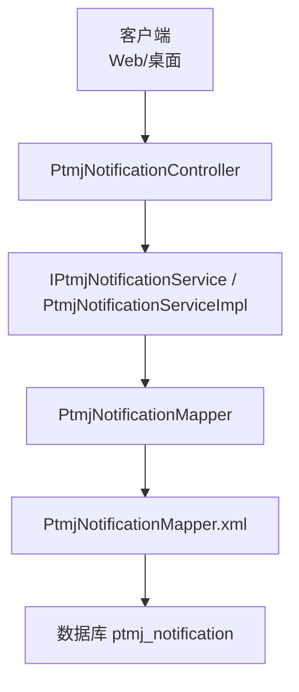
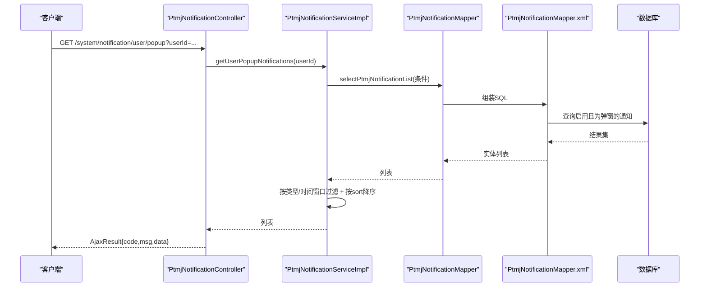
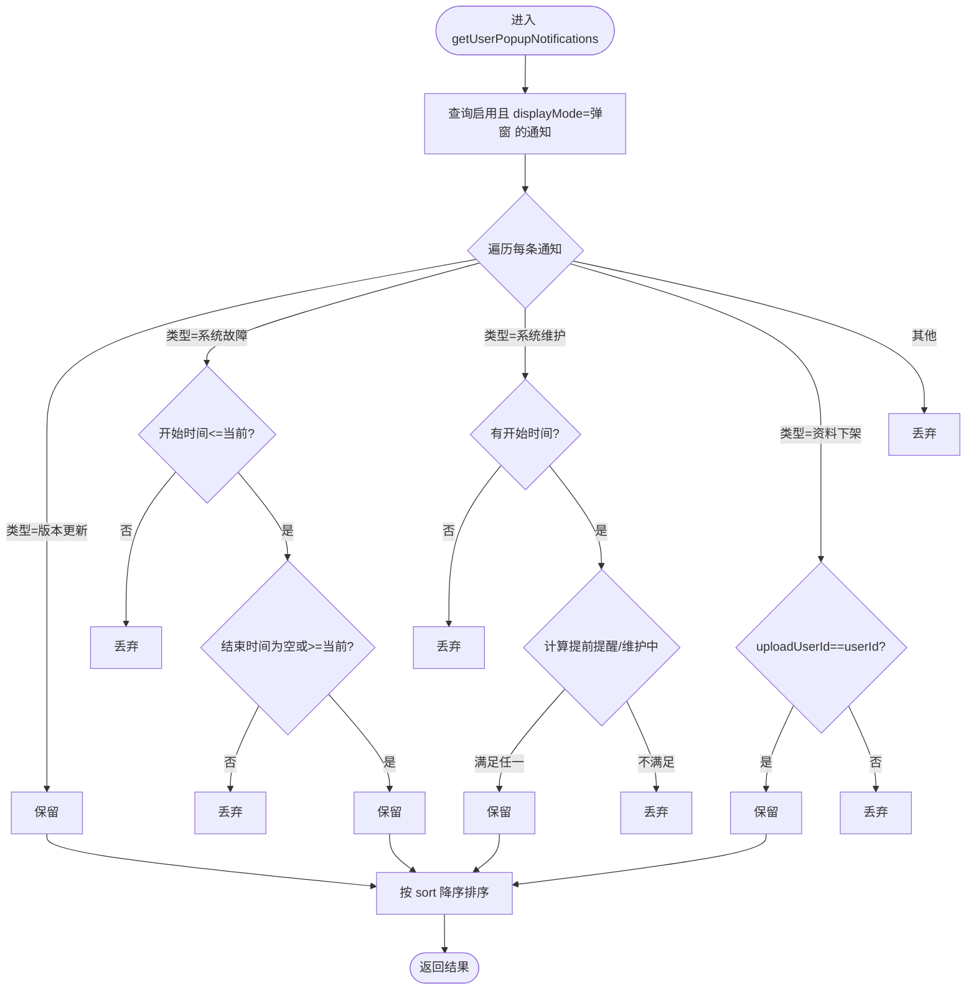
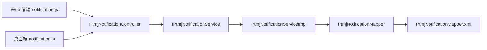

# 通知推送接口

<cite>
**本文引用的文件**
- [PtmjNotificationController.java](file://PezMax-Backend/ruoyi-admin/src/main/java/com/ruoyi/web/controller/datum/PtmjNotificationController.java)
- [IPtmjNotificationService.java](file://PezMax-Backend/ptmj-datum/src/main/java/com/ptmj/datum/service/IPtmjNotificationService.java)
- [PtmjNotificationServiceImpl.java](file://PezMax-Backend/ptmj-datum/src/main/java/com/ptmj/datum/service/impl/PtmjNotificationServiceImpl.java)
- [PtmjNotificationMapper.java](file://PezMax-Backend/ptmj-datum/src/main/java/com/ptmj/datum/mapper/PtmjNotificationMapper.java)
- [PtmjNotificationMapper.xml](file://PezMax-Backend/ptmj-datum/src/main/resources/mapper/datum/PtmjNotificationMapper.xml)
- [PtmjNotification.java](file://PezMax-Backend/ptmj-datum/src/main/java/com/ptmj/datum/domain/PtmjNotification.java)
- [notification.js（Web端）](file://PezMax-Backend/ruoyi-ui/src/api/datum/notification.js)
- [notification.js（桌面端）](file://PezMax-Desktop/src/renderer/api/datum/notification.js)
</cite>

## 目录
1. [简介](#简介)
2. [项目结构](#项目结构)
3. [核心组件](#核心组件)
4. [架构总览](#架构总览)
5. [详细组件分析](#详细组件分析)
6. [依赖分析](#依赖分析)
7. [性能考虑](#性能考虑)
8. [故障排查指南](#故障排查指南)
9. [结论](#结论)
10. [附录：API 定义与数据模型](#附录api-定义与数据模型)

## 简介
本文件面向“通知推送”相关 API，覆盖以下能力：
- 通知管理：发布、编辑、删除、查询（含分页与导出）
- 用户端展示：弹窗通知列表、滚动通知列表
- 通知类型：版本更新、系统故障、系统维护、资料下架、日常滚动
- 展示形态：弹窗、滚动字幕
- 优先级与去重：按优先级排序；资料下架类按 materialId 去重并自动转更新
- 定时与批量：基于现有调度框架可扩展定时任务；支持批量删除
- 订阅与偏好：当前代码未实现独立订阅与偏好设置表，建议扩展方案见附录

说明：
- 当前仓库未提供站内信、邮件、桌面通知等外部渠道的集成实现，亦无独立的“已读标记/未读计数/历史”表。若需这些能力，可参考附录中的扩展建议。

## 项目结构
后端采用分层架构：Controller → Service → Mapper → XML SQL。通知模块相关文件如下：
- 控制器层：对外暴露 REST 接口
- 服务层：业务逻辑（过滤、排序、去重）
- 数据访问层：MyBatis 接口与映射
- 领域模型：通知实体字段与枚举值约定

图示来源
- [PtmjNotificationController.java:23-116](file://PezMax-Backend/ruoyi-admin/src/main/java/com/ruoyi/web/controller/datum/PtmjNotificationController.java#L23-L116)
- [IPtmjNotificationService.java:12-75](file://PezMax-Backend/ptmj-datum/src/main/java/com/ptmj/datum/service/IPtmjNotificationService.java#L12-L75)
- [PtmjNotificationServiceImpl.java:24-197](file://PezMax-Backend/ptmj-datum/src/main/java/com/ptmj/datum/service/impl/PtmjNotificationServiceImpl.java#L24-L197)
- [PtmjNotificationMapper.java:12-62](file://PezMax-Backend/ptmj-datum/src/main/java/com/ptmj/datum/mapper/PtmjNotificationMapper.java#L12-L62)
- [PtmjNotificationMapper.xml:1-154](file://PezMax-Backend/ptmj-datum/src/main/resources/mapper/datum/PtmjNotificationMapper.xml#L1-L154)

章节来源
- [PtmjNotificationController.java:23-116](file://PezMax-Backend/ruoyi-admin/src/main/java/com/ruoyi/web/controller/datum/PtmjNotificationController.java#L23-L116)
- [PtmjNotificationServiceImpl.java:24-197](file://PezMax-Backend/ptmj-datum/src/main/java/com/ptmj/datum/service/impl/PtmjNotificationServiceImpl.java#L24-L197)
- [PtmjNotificationMapper.xml:37-56](file://PezMax-Backend/ptmj-datum/src/main/resources/mapper/datum/PtmjNotificationMapper.xml#L37-L56)

## 核心组件
- 控制器：统一路由前缀 /system/notification，提供管理端 CRUD、导出、用户端弹窗/滚动列表接口
- 服务：封装查询条件、时间窗口过滤、优先级排序、去重策略
- 数据访问：通用增删改查与动态条件查询
- 领域模型：定义通知类型、展示形态、时间区间、优先级等字段

章节来源
- [PtmjNotificationController.java:23-116](file://PezMax-Backend/ruoyi-admin/src/main/java/com/ruoyi/web/controller/datum/PtmjNotificationController.java#L23-L116)
- [IPtmjNotificationService.java:12-75](file://PezMax-Backend/ptmj-datum/src/main/java/com/ptmj/datum/service/IPtmjNotificationService.java#L12-L75)
- [PtmjNotificationServiceImpl.java:24-197](file://PezMax-Backend/ptmj-datum/src/main/java/com/ptmj/datum/service/impl/PtmjNotificationServiceImpl.java#L24-L197)
- [PtmjNotification.java:16-90](file://PezMax-Backend/ptmj-datum/src/main/java/com/ptmj/datum/domain/PtmjNotification.java#L16-L90)

## 架构总览
从请求到响应的调用链如下：

图示来源
- [PtmjNotificationController.java:101-105](file://PezMax-Backend/ruoyi-admin/src/main/java/com/ruoyi/web/controller/datum/PtmjNotificationController.java#L101-L105)
- [IPtmjNotificationService.java:67-67](file://PezMax-Backend/ptmj-datum/src/main/java/com/ptmj/datum/service/IPtmjNotificationService.java#L67-L67)
- [PtmjNotificationServiceImpl.java:125-173](file://PezMax-Backend/ptmj-datum/src/main/java/com/ptmj/datum/service/impl/PtmjNotificationServiceImpl.java#L125-L173)
- [PtmjNotificationMapper.java:28-28](file://PezMax-Backend/ptmj-datum/src/main/java/com/ptmj/datum/mapper/PtmjNotificationMapper.java#L28-L28)
- [PtmjNotificationMapper.xml:37-56](file://PezMax-Backend/ptmj-datum/src/main/resources/mapper/datum/PtmjNotificationMapper.xml#L37-L56)

## 详细组件分析

### 控制器层：PtmjNotificationController
- 路由前缀：/system/notification
- 管理端接口
  - 列表：GET /list（分页）
  - 详情：GET /{notifyId}
  - 新增：POST
  - 修改：PUT
  - 删除：DELETE /{notifyIds}（批量）
  - 导出：POST /export
- 用户端接口
  - 弹窗通知：GET /user/popup?userId=...
  - 滚动通知：GET /user/scroll

权限控制：使用注解进行鉴权，如 system:notification:list、add、edit、remove、query、export。

章节来源
- [PtmjNotificationController.java:33-96](file://PezMax-Backend/ruoyi-admin/src/main/java/com/ruoyi/web/controller/datum/PtmjNotificationController.java#L33-L96)
- [PtmjNotificationController.java:101-114](file://PezMax-Backend/ruoyi-admin/src/main/java/com/ruoyi/web/controller/datum/PtmjNotificationController.java#L101-L114)

### 服务层：IPtmjNotificationService 与实现
- 基础能力：查询单条、列表、新增、修改、批量删除、单条删除
- 用户端能力：
  - 获取弹窗通知列表：按启用状态、弹窗形态筛选，再按类型与时间窗口过滤，最后按 sort 降序
  - 获取滚动通知列表：仅返回类型为“日常滚动”且在发布时间段内的记录
- 去重策略：新增时若存在相同 materialId 的记录，则转为更新该记录（避免重复）

章节来源
- [IPtmjNotificationService.java:12-75](file://PezMax-Backend/ptmj-datum/src/main/java/com/ptmj/datum/service/IPtmjNotificationService.java#L12-L75)
- [PtmjNotificationServiceImpl.java:56-82](file://PezMax-Backend/ptmj-datum/src/main/java/com/ptmj/datum/service/impl/PtmjNotificationServiceImpl.java#L56-L82)
- [PtmjNotificationServiceImpl.java:125-194](file://PezMax-Backend/ptmj-datum/src/main/java/com/ptmj/datum/service/impl/PtmjNotificationServiceImpl.java#L125-L194)

#### 弹窗通知过滤与排序流程

图示来源
- [PtmjNotificationServiceImpl.java:125-173](file://PezMax-Backend/ptmj-datum/src/main/java/com/ptmj/datum/service/impl/PtmjNotificationServiceImpl.java#L125-L173)

### 数据访问层：Mapper 与 SQL
- 动态查询：支持标题模糊匹配、displayMode 精确匹配、materialId 精确匹配
- 管理端时间范围筛选：对类型2（故障）和类型3（维护）支持按传入的时间段做交集判断
- 标准 CRUD：单条/批量删除、插入、更新

章节来源
- [PtmjNotificationMapper.java:14-61](file://PezMax-Backend/ptmj-datum/src/main/java/com/ptmj/datum/mapper/PtmjNotificationMapper.java#L14-L61)
- [PtmjNotificationMapper.xml:37-56](file://PezMax-Backend/ptmj-datum/src/main/resources/mapper/datum/PtmjNotificationMapper.xml#L37-L56)
- [PtmjNotificationMapper.xml:144-153](file://PezMax-Backend/ptmj-datum/src/main/resources/mapper/datum/PtmjNotificationMapper.xml#L144-L153)

### 领域模型：PtmjNotification
关键字段与含义：
- notifyType：通知类型（1版本更新、2系统故障、3系统维护、4资料下架、5日常滚动）
- displayMode：展示形态（0弹窗、1滚动字幕）
- status：配置状态（0启用、1禁用）
- sort：排序/优先级（越大越优先弹出）
- 故障/维护时间字段：faultStartTime/faultEndTime、maintenanceStartTime/maintenanceEndTime/remindBeforeMinutes
- 资料下架字段：uploadUserId、materialId、materialTitleSnapshot
- 日常滚动字段：publishStart、publishEnd、scrollTimeInterval

章节来源
- [PtmjNotification.java:23-90](file://PezMax-Backend/ptmj-datum/src/main/java/com/ptmj/datum/domain/PtmjNotification.java#L23-L90)

## 依赖分析
- 控制器依赖服务接口，服务实现依赖 Mapper，Mapper 通过 XML 执行 SQL
- 前端 Web 与桌面端均包含对应的前端 API 文件，用于调用后端接口

图示来源
- [PtmjNotificationController.java:23-116](file://PezMax-Backend/ruoyi-admin/src/main/java/com/ruoyi/web/controller/datum/PtmjNotificationController.java#L23-L116)
- [notification.js（Web端）](file://PezMax-Backend/ruoyi-ui/src/api/datum/notification.js)
- [notification.js（桌面端）](file://PezMax-Desktop/src/renderer/api/datum/notification.js)

章节来源
- [PtmjNotificationController.java:23-116](file://PezMax-Backend/ruoyi-admin/src/main/java/com/ruoyi/web/controller/datum/PtmjNotificationController.java#L23-L116)
- [PtmjNotificationServiceImpl.java:24-197](file://PezMax-Backend/ptmj-datum/src/main/java/com/ptmj/datum/service/impl/PtmjNotificationServiceImpl.java#L24-L197)
- [PtmjNotificationMapper.java:12-62](file://PezMax-Backend/ptmj-datum/src/main/java/com/ptmj/datum/mapper/PtmjNotificationMapper.java#L12-L62)
- [PtmjNotificationMapper.xml:1-154](file://PezMax-Backend/ptmj-datum/src/main/resources/mapper/datum/PtmjNotificationMapper.xml#L1-L154)

## 性能考虑
- 列表查询使用分页（startPage），避免一次性拉取大量数据
- 服务端在内存中对结果进行过滤与排序，适合中小规模数据；当数据量增长时可考虑将过滤条件下沉至 SQL（例如按类型、时间区间直接过滤）
- 批量删除使用 IN 语句，注意参数长度限制
- 如需高频读取的用户端列表，可在服务层引入缓存（如 Redis）以降低数据库压力

[本节为通用建议，无需源码引用]

## 故障排查指南
- 权限问题：确认调用方具备相应权限标识（如 system:notification:list/add/edit/remove/query/export）
- 时间窗口不生效：检查类型2/3的时间字段是否填写正确；类型3的提前提醒分钟数默认值为60
- 资料下架通知未出现：确认 uploadUserId 与当前 userId 一致
- 滚动通知未显示：确认类型为“日常滚动”，且当前时间在 publishStart 与 publishEnd 之间
- 去重行为异常：新增时若 materialId 已存在，会转为更新；如需强制新增，请确保 materialId 唯一

章节来源
- [PtmjNotificationController.java:33-96](file://PezMax-Backend/ruoyi-admin/src/main/java/com/ruoyi/web/controller/datum/PtmjNotificationController.java#L33-L96)
- [PtmjNotificationServiceImpl.java:56-82](file://PezMax-Backend/ptmj-datum/src/main/java/com/ptmj/datum/service/impl/PtmjNotificationServiceImpl.java#L56-L82)
- [PtmjNotificationServiceImpl.java:125-194](file://PezMax-Backend/ptmj-datum/src/main/java/com/ptmj/datum/service/impl/PtmjNotificationServiceImpl.java#L125-L194)

## 结论
当前通知模块提供了完整的管理端 CRUD 与用户端展示能力，支持多类型通知、时间窗口控制、优先级排序以及资料下架类通知的去重更新。尚未实现订阅、偏好设置、已读/未读计数、消息队列与多渠道推送。建议在后续迭代中按需扩展，以满足更丰富的推送场景。

[本节为总结性内容，无需源码引用]

## 附录：API 定义与数据模型

### 管理端接口
- 列表：GET /system/notification/list
  - 功能：分页查询通知列表
  - 权限：system:notification:list
- 详情：GET /system/notification/{notifyId}
  - 功能：根据主键获取通知详情
  - 权限：system:notification:query
- 新增：POST /system/notification
  - 功能：新增通知；若 materialId 已存在则转为更新
  - 权限：system:notification:add
- 修改：PUT /system/notification
  - 功能：修改通知
  - 权限：system:notification:edit
- 删除：DELETE /system/notification/{notifyIds}
  - 功能：批量删除通知
  - 权限：system:notification:remove
- 导出：POST /system/notification/export
  - 功能：导出通知列表为 Excel
  - 权限：system:notification:export

章节来源
- [PtmjNotificationController.java:33-96](file://PezMax-Backend/ruoyi-admin/src/main/java/com/ruoyi/web/controller/datum/PtmjNotificationController.java#L33-L96)

### 用户端接口
- 弹窗通知：GET /system/notification/user/popup?userId={userId}
  - 功能：返回需要以弹窗形式展示的通知列表（按类型与时间窗口过滤，按优先级降序）
- 滚动通知：GET /system/notification/user/scroll
  - 功能：返回需要以滚动形式展示的通知列表（仅类型5且在发布时间内）

章节来源
- [PtmjNotificationController.java:101-114](file://PezMax-Backend/ruoyi-admin/src/main/java/com/ruoyi/web/controller/datum/PtmjNotificationController.java#L101-L114)
- [PtmjNotificationServiceImpl.java:125-194](file://PezMax-Backend/ptmj-datum/src/main/java/com/ptmj/datum/service/impl/PtmjNotificationServiceImpl.java#L125-L194)

### 通知类型与展示形态
- 通知类型（notifyType）
  - 1：版本更新
  - 2：系统故障
  - 3：系统维护
  - 4：资料下架
  - 5：日常滚动
- 展示形态（displayMode）
  - 0：弹窗
  - 1：滚动字幕
- 配置状态（status）
  - 0：启用
  - 1：禁用

章节来源
- [PtmjNotification.java:23-45](file://PezMax-Backend/ptmj-datum/src/main/java/com/ptmj/datum/domain/PtmjNotification.java#L23-L45)

### 数据模型（ptmj_notification）
主要字段（节选）：
- notify_id：主键
- notify_type：通知类型
- title：标题
- content：正文
- status：配置状态
- sort：排序/优先级
- display_mode：展示形态
- fault_start_time / fault_end_time：故障起止时间（类型2）
- maintenance_start_time / maintenance_end_time / remind_before_minutes：维护起止时间与提前提醒分钟数（类型3）
- upload_user_id / material_id / material_title_snapshot：资料下架相关（类型4）
- publish_start / publish_end / scroll_time_interval：日常滚动发布时段与间隔（类型5）
- create_by / create_time / update_by / update_time / remark：审计字段

章节来源
- [PtmjNotificationMapper.xml:7-31](file://PezMax-Backend/ptmj-datum/src/main/resources/mapper/datum/PtmjNotificationMapper.xml#L7-L31)

### 前端调用示例路径
- Web 端 API 文件：[notification.js（Web端）](file://PezMax-Backend/ruoyi-ui/src/api/datum/notification.js)
- 桌面端 API 文件：[notification.js（桌面端）](file://PezMax-Desktop/src/renderer/api/datum/notification.js)

章节来源
- [notification.js（Web端）](file://PezMax-Backend/ruoyi-ui/src/api/datum/notification.js)
- [notification.js（桌面端）](file://PezMax-Desktop/src/renderer/api/datum/notification.js)

### 扩展建议（不在当前代码中实现）
- 订阅与偏好设置
  - 建议新增表：用户订阅关系表（用户ID、通知类型、渠道、是否启用）、用户偏好表（用户ID、渠道开关、免打扰时段等）
- 已读/未读计数与历史
  - 建议新增表：用户通知阅读记录（用户ID、通知ID、是否已读、阅读时间）
- 推送渠道
  - 站内信：基于 WebSocket 或轮询接口
  - 邮件：集成 SMTP 服务
  - 桌面通知：结合 Electron 原生通知能力
- 消息队列
  - 引入消息中间件（如 RabbitMQ/Kafka）解耦发送流程，支持重试与幂等
- 模板管理
  - 新增通知模板表（模板编码、标题模板、正文模板、变量占位符）
- 定时推送
  - 基于 Quartz 或 Spring Scheduler 创建任务，按 publishStart/publishEnd 触发
- 批量发送
  - 提供批量创建/更新接口，结合去重策略与优先级合并

[本节为概念性扩展建议，无需源码引用]