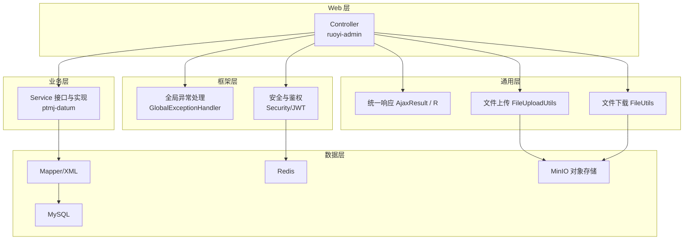
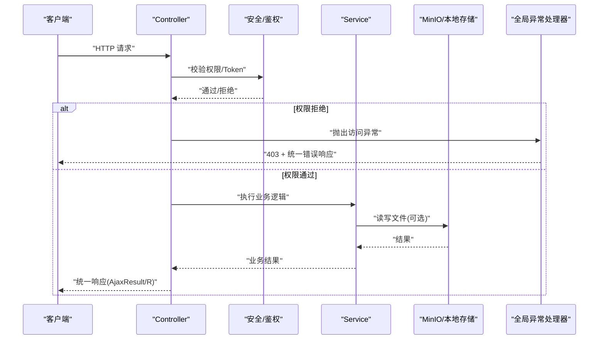
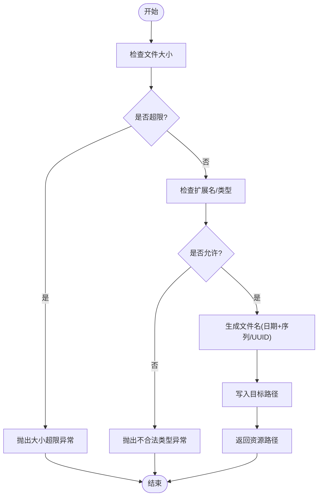
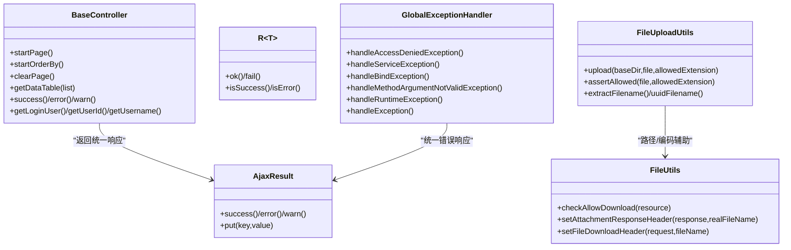

# API 设计与规范

<cite>
**本文引用的文件**
- [README.md](file://PezMax-Backend/README.md)
- [AjaxResult.java](file://PezMax-Backend/ruoyi-common/src/main/java/com/ruoyi/common/core/domain/AjaxResult.java)
- [R.java](file://PezMax-Backend/ruoyi-common/src/main/java/com/ruoyi/common/core/domain/R.java)
- [BaseController.java](file://PezMax-Backend/ruoyi-common/src/main/java/com/ruoyi/common/core/controller/BaseController.java)
- [GlobalExceptionHandler.java](file://PezMax-Backend/ruoyi-framework/src/main/java/com/ruoyi/framework/web/exception/GlobalExceptionHandler.java)
- [FileUploadUtils.java](file://PezMax-Backend/ruoyi-common/src/main/java/com/ruoyi/common/utils/file/FileUploadUtils.java)
- [FileUtils.java](file://PezMax-Backend/ruoyi-common/src/main/java/com/ruoyi/common/utils/file/FileUtils.java)
</cite>

## 目录
1. [引言](#引言)
2. [项目结构](#项目结构)
3. [核心组件](#核心组件)
4. [架构总览](#架构总览)
5. [详细组件分析](#详细组件分析)
6. [依赖分析](#依赖分析)
7. [性能考虑](#性能考虑)
8. [故障排查指南](#故障排查指南)
9. [结论](#结论)
10. [附录](#附录)

## 引言
本规范面向 PezMax 后端（基于 RuoYi-Vue 定制）的 RESTful API 设计与开发，统一响应格式、控制器层开发模式、横切关注点实现（参数校验、异常处理、日志记录、权限控制）、文件上传下载最佳实践，以及 API 版本管理与向后兼容策略。目标是让团队在统一的约定下高效协作，保证接口稳定性与可维护性。

## 项目结构
后端采用多模块分层组织：
- 业务模块 ptmj-datum：书签、文件、用户等核心业务
- Web 入口 ruoyi-admin：Controller 暴露 REST 接口
- 通用能力 ruoyi-common：统一响应体、工具类、常量、异常定义
- 框架支撑 ruoyi-framework：安全、拦截器、全局异常处理、配置
- 系统管理 ruoyi-system：用户、角色、菜单、字典等基础功能
- 代码生成 ruoyi-generator、定时任务 ruoyi-quartz

图表来源
- [README.md:76-89](file://PezMax-Backend/README.md#L76-L89)

章节来源
- [README.md:13-44](file://PezMax-Backend/README.md#L13-L44)
- [README.md:76-89](file://PezMax-Backend/README.md#L76-L89)

## 核心组件
- 统一响应体
  - AjaxResult：以键值对形式返回 code/msg/data，适合传统表单/页面交互场景
  - R<T>：泛型强类型响应体，适合前后端分离或跨语言调用
- 控制器基类 BaseController：提供分页、排序、登录用户信息获取、成功/失败快捷方法
- 全局异常处理器 GlobalExceptionHandler：集中捕获并标准化错误响应
- 文件上传/下载工具：FileUploadUtils、FileUtils，封装大小/类型校验、路径编码、下载头设置等

章节来源
- [AjaxResult.java:1-217](file://PezMax-Backend/ruoyi-common/src/main/java/com/ruoyi/common/core/domain/AjaxResult.java#L1-L217)
- [R.java:1-116](file://PezMax-Backend/ruoyi-common/src/main/java/com/ruoyi/common/core/domain/R.java#L1-L116)
- [BaseController.java:1-203](file://PezMax-Backend/ruoyi-common/src/main/java/com/ruoyi/common/core/controller/BaseController.java#L1-L203)
- [GlobalExceptionHandler.java:1-146](file://PezMax-Backend/ruoyi-framework/src/main/java/com/ruoyi/framework/web/exception/GlobalExceptionHandler.java#L1-L146)
- [FileUploadUtils.java:1-261](file://PezMax-Backend/ruoyi-common/src/main/java/com/ruoyi/common/utils/file/FileUploadUtils.java#L1-L261)
- [FileUtils.java:1-304](file://PezMax-Backend/ruoyi-common/src/main/java/com/ruoyi/common/utils/file/FileUtils.java#L1-L304)

## 架构总览
RESTful 请求从 Controller 进入，经安全与鉴权后进入业务 Service，最终通过统一响应体返回。异常由全局异常处理器统一收敛为 AjaxResult。文件上传走 FileUploadUtils，下载走 FileUtils，底层对接 MinIO 或本地存储。

图表来源
- [GlobalExceptionHandler.java:27-146](file://PezMax-Backend/ruoyi-framework/src/main/java/com/ruoyi/framework/web/exception/GlobalExceptionHandler.java#L27-L146)
- [FileUploadUtils.java:102-139](file://PezMax-Backend/ruoyi-common/src/main/java/com/ruoyi/common/utils/file/FileUploadUtils.java#L102-L139)
- [FileUtils.java:153-169](file://PezMax-Backend/ruoyi-common/src/main/java/com/ruoyi/common/utils/file/FileUtils.java#L153-L169)

## 详细组件分析

### 统一响应体设计：AjaxResult 与 R
- 使用建议
  - 前端为 Vue/传统页面时优先使用 AjaxResult，便于快速构建 code/msg/data 结构
  - 前后端分离或跨语言调用建议使用 R<T>，具备强类型与序列化友好性
- 字段约定
  - code：状态码，成功/失败/警告等
  - msg：提示信息
  - data：业务数据（可为空）
- 构造方式
  - 静态工厂方法：success()/error()/warn() 等
  - 链式 put(key, value) 扩展自定义字段（AjaxResult）
- 兼容性
  - 新增字段应遵循“只增不改”原则，避免破坏旧客户端解析

章节来源
- [AjaxResult.java:13-217](file://PezMax-Backend/ruoyi-common/src/main/java/com/ruoyi/common/core/domain/AjaxResult.java#L13-L217)
- [R.java:11-116](file://PezMax-Backend/ruoyi-common/src/main/java/com/ruoyi/common/core/domain/R.java#L11-L116)

### Controller 层开发模式
- 继承 BaseController
  - 使用 startPage()/startOrderBy()/clearPage() 进行分页与排序
  - 使用 success()/error()/warn()/toAjax() 快速返回统一响应
  - 使用 getLoginUser()/getUserId()/getUsername() 获取当前用户上下文
- 参数绑定与验证
  - 日期自动转换：@InitBinder 注册 Date 编辑器
  - 推荐结合 JSR-303/JSR-380 注解进行入参校验，配合全局异常处理器返回统一错误
- 返回值
  - 列表查询返回 TableDataInfo（含 rows/total），其他操作返回 AjaxResult/R
- 示例参考路径
  - 分页与排序：[BaseController.java:53-77](file://PezMax-Backend/ruoyi-common/src/main/java/com/ruoyi/common/core/controller/BaseController.java#L53-L77)
  - 统一响应便捷方法：[BaseController.java:96-161](file://PezMax-Backend/ruoyi-common/src/main/java/com/ruoyi/common/core/controller/BaseController.java#L96-L161)
  - 登录用户获取：[BaseController.java:174-201](file://PezMax-Backend/ruoyi-common/src/main/java/com/ruoyi/common/core/controller/BaseController.java#L174-L201)

章节来源
- [BaseController.java:36-48](file://PezMax-Backend/ruoyi-common/src/main/java/com/ruoyi/common/core/controller/BaseController.java#L36-L48)
- [BaseController.java:53-91](file://PezMax-Backend/ruoyi-common/src/main/java/com/ruoyi/common/core/controller/BaseController.java#L53-L91)
- [BaseController.java:96-161](file://PezMax-Backend/ruoyi-common/src/main/java/com/ruoyi/common/core/controller/BaseController.java#L96-L161)
- [BaseController.java:174-201](file://PezMax-Backend/ruoyi-common/src/main/java/com/ruoyi/common/core/controller/BaseController.java#L174-L201)

### 横切关注点实现

#### 参数验证
- 支持 @Valid/@Validated 注解校验，未通过时触发 BindException/MethodArgumentNotValidException
- 全局异常处理器将校验错误转换为统一 AjaxResult 错误响应
- 类型不匹配或缺少路径变量也会统一处理
- 参考路径
  - 绑定异常处理：[GlobalExceptionHandler.java:118-135](file://PezMax-Backend/ruoyi-framework/src/main/java/com/ruoyi/framework/web/exception/GlobalExceptionHandler.java#L118-L135)
  - 类型不匹配处理：[GlobalExceptionHandler.java:80-91](file://PezMax-Backend/ruoyi-framework/src/main/java/com/ruoyi/framework/web/exception/GlobalExceptionHandler.java#L80-L91)
  - 缺失路径变量处理：[GlobalExceptionHandler.java:69-75](file://PezMax-Backend/ruoyi-framework/src/main/java/com/ruoyi/framework/web/exception/GlobalExceptionHandler.java#L69-L75)

章节来源
- [GlobalExceptionHandler.java:69-91](file://PezMax-Backend/ruoyi-framework/src/main/java/com/ruoyi/framework/web/exception/GlobalExceptionHandler.java#L69-L91)
- [GlobalExceptionHandler.java:118-135](file://PezMax-Backend/ruoyi-framework/src/main/java/com/ruoyi/framework/web/exception/GlobalExceptionHandler.java#L118-L135)

#### 异常处理
- 统一捕获：服务异常、运行时异常、系统异常、演示模式异常、方法不支持等
- 输出结构化错误响应，包含错误码与消息
- 参考路径
  - 全局异常处理器入口与分类处理：[GlobalExceptionHandler.java:27-146](file://PezMax-Backend/ruoyi-framework/src/main/java/com/ruoyi/framework/web/exception/GlobalExceptionHandler.java#L27-L146)

章节来源
- [GlobalExceptionHandler.java:27-146](file://PezMax-Backend/ruoyi-framework/src/main/java/com/ruoyi/framework/web/exception/GlobalExceptionHandler.java#L27-L146)

#### 日志记录
- BaseController 内置 Logger，用于业务日志
- 全局异常处理器记录请求 URI 与异常堆栈，便于定位问题
- 建议：关键业务流程增加结构化日志（用户ID、资源ID、耗时等）

章节来源
- [BaseController.java:31](file://PezMax-Backend/ruoyi-common/src/main/java/com/ruoyi/common/core/controller/BaseController.java#L31)
- [GlobalExceptionHandler.java:35-41](file://PezMax-Backend/ruoyi-framework/src/main/java/com/ruoyi/framework/web/exception/GlobalExceptionHandler.java#L35-L41)

#### 权限控制
- 基于 Spring Security + JWT + Redis 的安全体系
- 匿名访问：部分查询接口标注匿名注解，无需登录即可访问
- 参考路径
  - 平台说明中的匿名访问提示：[README.md:93-95](file://PezMax-Backend/README.md#L93-L95)

章节来源
- [README.md:93-95](file://PezMax-Backend/README.md#L93-L95)

### 文件上传与下载

#### 上传流程与校验
- 默认大小限制与文件名长度限制
- 白名单校验（图片/视频/媒体/Flash/自定义）
- 命名策略：按日期目录+原文件名+序列号，或 UUID 命名
- 返回相对路径前缀拼接后的资源路径
- 参考路径
  - 上传主流程与校验：[FileUploadUtils.java:102-139](file://PezMax-Backend/ruoyi-common/src/main/java/com/ruoyi/common/utils/file/FileUploadUtils.java#L102-L139)
  - 大小与类型校验：[FileUploadUtils.java:186-224](file://PezMax-Backend/ruoyi-common/src/main/java/com/ruoyi/common/utils/file/FileUploadUtils.java#L186-L224)
  - 命名与路径生成：[FileUploadUtils.java:144-176](file://PezMax-Backend/ruoyi-common/src/main/java/com/ruoyi/common/utils/file/FileUploadUtils.java#L144-L176)

图表来源
- [FileUploadUtils.java:186-224](file://PezMax-Backend/ruoyi-common/src/main/java/com/ruoyi/common/utils/file/FileUploadUtils.java#L186-L224)
- [FileUploadUtils.java:144-176](file://PezMax-Backend/ruoyi-common/src/main/java/com/ruoyi/common/utils/file/FileUploadUtils.java#L144-L176)

章节来源
- [FileUploadUtils.java:102-139](file://PezMax-Backend/ruoyi-common/src/main/java/com/ruoyi/common/utils/file/FileUploadUtils.java#L102-L139)
- [FileUploadUtils.java:186-224](file://PezMax-Backend/ruoyi-common/src/main/java/com/ruoyi/common/utils/file/FileUploadUtils.java#L186-L224)

#### 下载流程与安全
- 禁止目录穿越（..）
- 白名单校验允许下载的文件类型
- 根据浏览器 UA 设置正确的 Content-Disposition 与编码
- 参考路径
  - 安全检查与白名单：[FileUtils.java:153-169](file://PezMax-Backend/ruoyi-common/src/main/java/com/ruoyi/common/utils/file/FileUtils.java#L153-L169)
  - 下载头设置与编码：[FileUtils.java:178-227](file://PezMax-Backend/ruoyi-common/src/main/java/com/ruoyi/common/utils/file/FileUtils.java#L178-L227)

章节来源
- [FileUtils.java:153-169](file://PezMax-Backend/ruoyi-common/src/main/java/com/ruoyi/common/utils/file/FileUtils.java#L153-L169)
- [FileUtils.java:178-227](file://PezMax-Backend/ruoyi-common/src/main/java/com/ruoyi/common/utils/file/FileUtils.java#L178-L227)

#### 大文件传输最佳实践
- 切片上传：前端分片，服务端合并；结合唯一标识与断点续传
- 并发与限速：限流注解/网关层限流，避免单连接占满带宽
- 异步处理：上传完成后异步转码/预览生成
- 存储优化：MinIO 分片上传、生命周期策略、CDN 加速
- 注意：当前工具类默认大小限制为固定阈值，超大文件需调整配置或改用分片方案

章节来源
- [FileUploadUtils.java:29](file://PezMax-Backend/ruoyi-common/src/main/java/com/ruoyi/common/utils/file/FileUploadUtils.java#L29)

### API 版本管理与向后兼容
- 版本策略
  - URL 版本化：/api/v1/...、/api/v2/...
  - Header 版本协商：X-API-Version
  - 内容协商：Accept 头指定版本
- 兼容原则
  - 只增不改：新增字段、新增接口；废弃字段保留一段时间并标记
  - 幂等性：GET/PUT/DELETE 语义明确，POST 幂等键
  - 灰度发布：双写/影子库/流量切换
- 文档与契约
  - OpenAPI/Swagger 描述版本差异
  - 变更评审与回归测试清单

[本节为概念性指导，不直接分析具体源码文件]

## 依赖分析
- 组件耦合
  - Controller 依赖 BaseController 提供的通用能力
  - 全局异常处理器依赖统一响应体 AjaxResult
  - 文件上传/下载工具依赖配置与常量
- 外部依赖
  - MinIO 对象存储（文件持久化）
  - Redis（会话/缓存）
  - MySQL（关系数据）

图表来源
- [BaseController.java:53-91](file://PezMax-Backend/ruoyi-common/src/main/java/com/ruoyi/common/core/controller/BaseController.java#L53-L91)
- [AjaxResult.java:67-103](file://PezMax-Backend/ruoyi-common/src/main/java/com/ruoyi/common/core/domain/AjaxResult.java#L67-L103)
- [R.java:27-74](file://PezMax-Backend/ruoyi-common/src/main/java/com/ruoyi/common/core/domain/R.java#L27-L74)
- [GlobalExceptionHandler.java:35-146](file://PezMax-Backend/ruoyi-framework/src/main/java/com/ruoyi/framework/web/exception/GlobalExceptionHandler.java#L35-L146)
- [FileUploadUtils.java:102-139](file://PezMax-Backend/ruoyi-common/src/main/java/com/ruoyi/common/utils/file/FileUploadUtils.java#L102-L139)
- [FileUtils.java:153-227](file://PezMax-Backend/ruoyi-common/src/main/java/com/ruoyi/common/utils/file/FileUtils.java#L153-L227)

章节来源
- [BaseController.java:53-91](file://PezMax-Backend/ruoyi-common/src/main/java/com/ruoyi/common/core/controller/BaseController.java#L53-L91)
- [GlobalExceptionHandler.java:35-146](file://PezMax-Backend/ruoyi-framework/src/main/java/com/ruoyi/framework/web/exception/GlobalExceptionHandler.java#L35-L146)
- [FileUploadUtils.java:102-139](file://PezMax-Backend/ruoyi-common/src/main/java/com/ruoyi/common/utils/file/FileUploadUtils.java#L102-L139)
- [FileUtils.java:153-227](file://PezMax-Backend/ruoyi-common/src/main/java/com/ruoyi/common/utils/file/FileUtils.java#L153-L227)

## 性能考虑
- 分页与排序：使用 PageHelper 与 SQL 注入防护，避免全表扫描
- 文件上传：合理设置最大大小与超时时间，启用压缩与 CDN
- 缓存：热点数据使用 Redis 缓存，减少数据库压力
- 线程池：异步任务（如转码、通知）使用独立线程池隔离
- 监控：接口耗时、错误率、慢查询告警

[本节为通用指导，不直接分析具体源码文件]

## 故障排查指南
- 常见异常与定位
  - 权限不足：查看 AccessDeniedException 处理日志与请求 URI
  - 参数校验失败：查看 BindException/MethodArgumentNotValidException 的错误消息
  - 类型不匹配/缺少路径变量：查看对应处理器日志
  - 未知异常：查看 RuntimeException/Exception 处理器日志
- 文件相关
  - 上传失败：检查大小/类型白名单、存储桶策略、磁盘空间
  - 下载失败：检查路径穿越校验、白名单、UA 编码
- 参考路径
  - 全局异常处理器：[GlobalExceptionHandler.java:27-146](file://PezMax-Backend/ruoyi-framework/src/main/java/com/ruoyi/framework/web/exception/GlobalExceptionHandler.java#L27-L146)
  - 文件上传校验：[FileUploadUtils.java:186-224](file://PezMax-Backend/ruoyi-common/src/main/java/com/ruoyi/common/utils/file/FileUploadUtils.java#L186-L224)
  - 下载安全检查：[FileUtils.java:153-169](file://PezMax-Backend/ruoyi-common/src/main/java/com/ruoyi/common/utils/file/FileUtils.java#L153-L169)

章节来源
- [GlobalExceptionHandler.java:27-146](file://PezMax-Backend/ruoyi-framework/src/main/java/com/ruoyi/framework/web/exception/GlobalExceptionHandler.java#L27-L146)
- [FileUploadUtils.java:186-224](file://PezMax-Backend/ruoyi-common/src/main/java/com/ruoyi/common/utils/file/FileUploadUtils.java#L186-L224)
- [FileUtils.java:153-169](file://PezMax-Backend/ruoyi-common/src/main/java/com/ruoyi/common/utils/file/FileUtils.java#L153-L169)

## 结论
通过统一响应体、控制器基类、全局异常处理与文件工具类，本项目形成了稳定一致的 API 开发范式。建议在后续迭代中持续完善版本管理、契约文档与性能监控，确保接口演进的可控性与用户体验的一致性。

## 附录
- 术语
  - 统一响应体：code/msg/data 的标准返回结构
  - 横切关注点：权限、日志、异常、限流等非业务逻辑
  - 向后兼容：在不破坏现有客户端的前提下进行接口演进

[本节为补充说明，不直接分析具体源码文件]