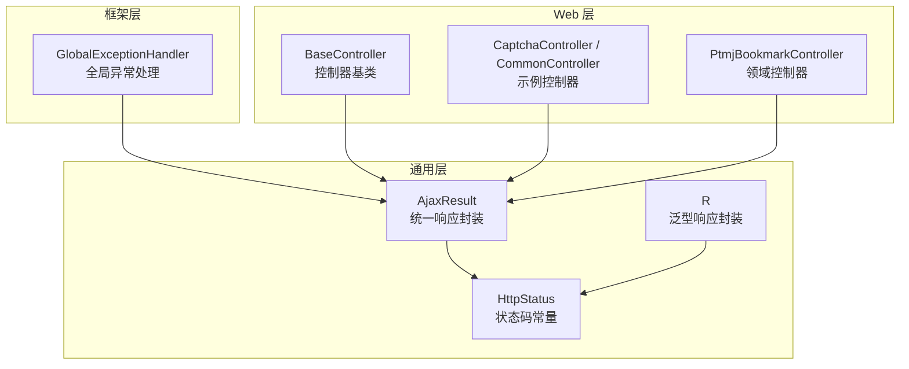
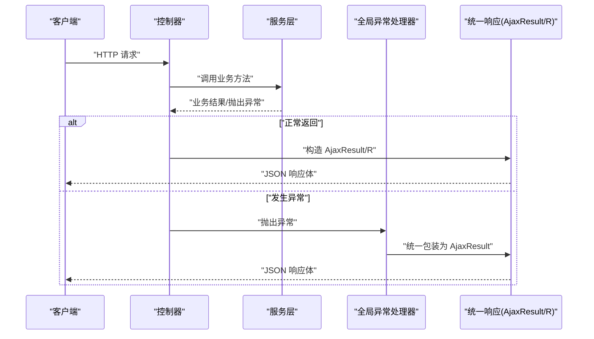
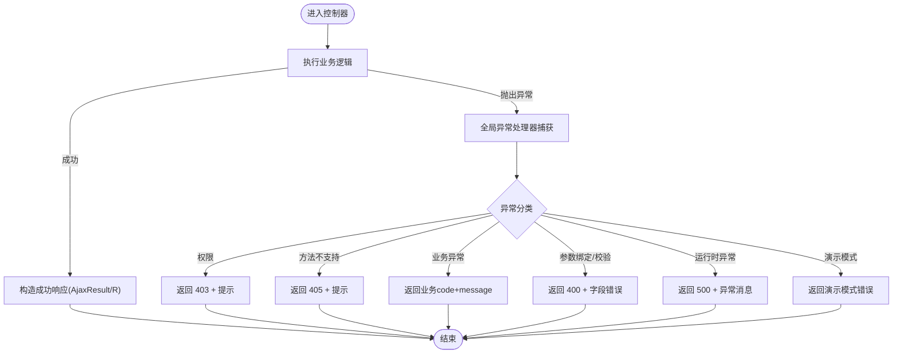
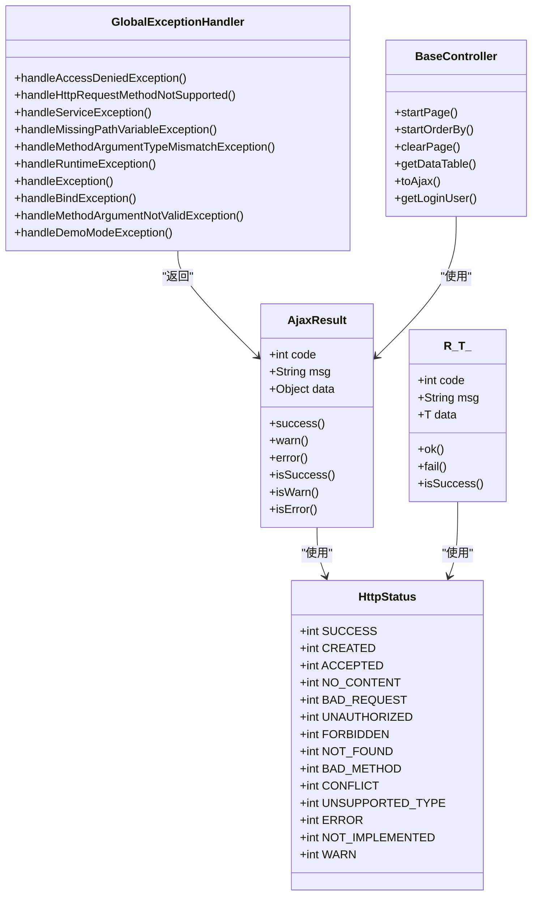

# API 设计原则与规范

<cite>
**本文引用的文件**   
- [AjaxResult.java](file://PezMax-Backend/ruoyi-common/src/main/java/com/ruoyi/common/core/domain/AjaxResult.java)
- [R.java](file://PezMax-Backend/ruoyi-common/src/main/java/com/ruoyi/common/core/domain/R.java)
- [HttpStatus.java](file://PezMax-Backend/ruoyi-common/src/main/java/com/ruoyi/common/constant/HttpStatus.java)
- [GlobalExceptionHandler.java](file://PezMax-Backend/ruoyi-framework/src/main/java/com/ruoyi/framework/web/exception/GlobalExceptionHandler.java)
- [BaseController.java](file://PezMax-Backend/ruoyi-common/src/main/java/com/ruoyi/common/core/controller/BaseController.java)
- [CaptchaController.java](file://PezMax-Backend/ruoyi-admin/src/main/java/com/ruoyi/web/controller/common/CaptchaController.java)
- [CommonController.java](file://PezMax-Backend/ruoyi-admin/src/main/java/com/ruoyi/web/controller/common/CommonController.java)
- [PtmjBookmarkController.java](file://PezMax-Backend/ruoyi-admin/src/main/java/com/ruoyi/web/controller/datum/PtmjBookmarkController.java)
</cite>

## 目录
1. [引言](#引言)
2. [项目结构](#项目结构)
3. [核心组件](#核心组件)
4. [架构总览](#架构总览)
5. [详细组件分析](#详细组件分析)
6. [依赖关系分析](#依赖关系分析)
7. [性能考虑](#性能考虑)
8. [故障排查指南](#故障排查指南)
9. [结论](#结论)
10. [附录](#附录)

## 引言
本规范面向后端 RESTful API 的设计与实现，统一约定 URL 命名、HTTP 方法使用、状态码定义、错误处理策略以及统一的响应体结构。重点说明：
- AjaxResult 与 R 两类响应对象的适用场景与字段语义
- HTTP 状态码与业务状态码的边界与映射
- 全局异常到统一响应的转换流程
- API 版本管理与向后兼容策略

## 项目结构
本项目采用分层模块化组织，API 相关的关键代码集中在以下位置：
- 通用响应与常量：ruoyi-common（AjaxResult、R、HttpStatus）
- 全局异常处理：ruoyi-framework（GlobalExceptionHandler）
- Web 控制器示例：ruoyi-admin（各 Controller）

图示来源
- [AjaxResult.java:1-217](file://PezMax-Backend/ruoyi-common/src/main/java/com/ruoyi/common/core/domain/AjaxResult.java#L1-L217)
- [R.java:1-116](file://PezMax-Backend/ruoyi-common/src/main/java/com/ruoyi/common/core/domain/R.java#L1-L116)
- [HttpStatus.java:1-95](file://PezMax-Backend/ruoyi-common/src/main/java/com/ruoyi/common/constant/HttpStatus.java#L1-L95)
- [GlobalExceptionHandler.java:1-146](file://PezMax-Backend/ruoyi-framework/src/main/java/com/ruoyi/framework/web/exception/GlobalExceptionHandler.java#L1-L146)
- [BaseController.java:1-203](file://PezMax-Backend/ruoyi-common/src/main/java/com/ruoyi/common/core/controller/BaseController.java#L1-L203)
- [CaptchaController.java:1-100](file://PezMax-Backend/ruoyi-admin/src/main/java/com/ruoyi/web/controller/common/CaptchaController.java#L1-L100)
- [CommonController.java:1-160](file://PezMax-Backend/ruoyi-admin/src/main/java/com/ruoyi/web/controller/common/CommonController.java#L1-L160)
- [PtmjBookmarkController.java:1-120](file://PezMax-Backend/ruoyi-admin/src/main/java/com/ruoyi/web/controller/datum/PtmjBookmarkController.java#L1-L120)

章节来源
- [AjaxResult.java:1-217](file://PezMax-Backend/ruoyi-common/src/main/java/com/ruoyi/common/core/domain/AjaxResult.java#L1-L217)
- [R.java:1-116](file://PezMax-Backend/ruoyi-common/src/main/java/com/ruoyi/common/core/domain/R.java#L1-L116)
- [HttpStatus.java:1-95](file://PezMax-Backend/ruoyi-common/src/main/java/com/ruoyi/common/constant/HttpStatus.java#L1-L95)
- [GlobalExceptionHandler.java:1-146](file://PezMax-Backend/ruoyi-framework/src/main/java/com/ruoyi/framework/web/exception/GlobalExceptionHandler.java#L1-L146)
- [BaseController.java:1-203](file://PezMax-Backend/ruoyi-common/src/main/java/com/ruoyi/common/core/controller/BaseController.java#L1-L203)
- [CaptchaController.java:1-100](file://PezMax-Backend/ruoyi-admin/src/main/java/com/ruoyi/web/controller/common/CaptchaController.java#L1-L100)
- [CommonController.java:1-160](file://PezMax-Backend/ruoyi-admin/src/main/java/com/ruoyi/web/controller/common/CommonController.java#L1-L160)
- [PtmjBookmarkController.java:1-120](file://PezMax-Backend/ruoyi-admin/src/main/java/com/ruoyi/web/controller/datum/PtmjBookmarkController.java#L1-L120)

## 核心组件
- AjaxResult：基于 Map 的统一响应对象，固定键名 code/msg/data，提供 success/warn/error 等便捷方法与判断方法。适用于大多数 JSON 接口返回。
- R<T>：泛型响应对象，包含 code/msg/data 三个字段，提供 ok/fail 等静态工厂方法，适合强类型数据返回。
- HttpStatus：集中定义常用状态码常量，包括成功、客户端错误、服务端错误及自定义 WARN 等。
- GlobalExceptionHandler：将各类异常转换为 AjaxResult，保证错误路径的一致性与可观测性。
- BaseController：为控制器提供分页、排序、用户上下文与 toAjax 等便捷方法，简化常见返回逻辑。

章节来源
- [AjaxResult.java:1-217](file://PezMax-Backend/ruoyi-common/src/main/java/com/ruoyi/common/core/domain/AjaxResult.java#L1-L217)
- [R.java:1-116](file://PezMax-Backend/ruoyi-common/src/main/java/com/ruoyi/common/core/domain/R.java#L1-L116)
- [HttpStatus.java:1-95](file://PezMax-Backend/ruoyi-common/src/main/java/com/ruoyi/common/constant/HttpStatus.java#L1-L95)
- [GlobalExceptionHandler.java:1-146](file://PezMax-Backend/ruoyi-framework/src/main/java/com/ruoyi/framework/web/exception/GlobalExceptionHandler.java#L1-L146)
- [BaseController.java:1-203](file://PezMax-Backend/ruoyi-common/src/main/java/com/ruoyi/common/core/controller/BaseController.java#L1-L203)

## 架构总览
RESTful API 请求从控制器进入，经参数校验、权限校验、业务处理后，通过 AjaxResult 或 R 返回；异常由全局处理器统一捕获并转为 AjaxResult。

图示来源
- [GlobalExceptionHandler.java:1-146](file://PezMax-Backend/ruoyi-framework/src/main/java/com/ruoyi/framework/web/exception/GlobalExceptionHandler.java#L1-L146)
- [AjaxResult.java:1-217](file://PezMax-Backend/ruoyi-common/src/main/java/com/ruoyi/common/core/domain/AjaxResult.java#L1-L217)
- [R.java:1-116](file://PezMax-Backend/ruoyi-common/src/main/java/com/ruoyi/common/core/domain/R.java#L1-L116)

## 详细组件分析

### 统一响应体规范：AjaxResult 与 R
- 字段约定
  - code：业务状态码（参考 HttpStatus）
  - msg：提示信息
  - data：业务数据（可为 null）
- 使用建议
  - 优先使用 AjaxResult 作为默认返回类型，便于快速构建成功/警告/错误响应
  - 需要强类型数据时可使用 R<T>，其内部同样遵循 code/msg/data 语义
- 典型用法
  - 成功：success()/success(data)/success(msg, data)
  - 警告：warn(msg)/warn(msg, data)
  - 错误：error()/error(msg)/error(code, msg)
  - 便捷判定：isSuccess()/isWarn()/isError()
  - R 类：ok()/ok(data)/fail()/fail(msg)/fail(code,msg)

章节来源
- [AjaxResult.java:1-217](file://PezMax-Backend/ruoyi-common/src/main/java/com/ruoyi/common/core/domain/AjaxResult.java#L1-L217)
- [R.java:1-116](file://PezMax-Backend/ruoyi-common/src/main/java/com/ruoyi/common/core/domain/R.java#L1-L116)

### HTTP 状态码定义与使用场景
- 成功类
  - 200：操作成功
  - 201：资源创建成功
  - 202：请求已接受（异步处理）
  - 204：无内容（删除成功等）
- 重定向与缓存
  - 301：永久移动
  - 303：查看其他
  - 304：未修改
- 客户端错误
  - 400：参数错误
  - 401：未认证
  - 403：禁止访问
  - 404：资源不存在
  - 405：方法不允许
  - 409：冲突
  - 415：不支持的媒体类型
- 服务端错误
  - 500：系统内部错误
  - 501：未实现
- 自定义
  - 601：系统警告消息（用于 warn 场景）

章节来源
- [HttpStatus.java:1-95](file://PezMax-Backend/ruoyi-common/src/main/java/com/ruoyi/common/constant/HttpStatus.java#L1-L95)

### 错误处理策略与全局异常映射
- 目标：所有异常最终都转换为 AjaxResult，确保前端一致解析
- 主要映射
  - 权限不足：返回 403 与提示
  - 方法不支持：返回 405 与提示
  - 业务异常：按异常携带的 code 与 message 返回
  - 参数绑定/校验失败：返回 400 与具体字段错误信息
  - 运行时未知异常：返回 500 与异常消息
  - 演示模式：返回特定错误提示
- 日志记录：每个异常分支均记录请求 URI 与异常详情，便于定位问题

图示来源
- [GlobalExceptionHandler.java:1-146](file://PezMax-Backend/ruoyi-framework/src/main/java/com/ruoyi/framework/web/exception/GlobalExceptionHandler.java#L1-L146)
- [AjaxResult.java:1-217](file://PezMax-Backend/ruoyi-common/src/main/java/com/ruoyi/common/core/domain/AjaxResult.java#L1-L217)

章节来源
- [GlobalExceptionHandler.java:1-146](file://PezMax-Backend/ruoyi-framework/src/main/java/com/ruoyi/framework/web/exception/GlobalExceptionHandler.java#L1-L146)

### RESTful 设计原则与 URL 命名约定
- 资源名词化：URL 使用复数名词表示集合，单数表示实例
- 层级清晰：子资源通过路径嵌套表达，如 /bookmarks/{id}/favorites
- 动词使用：避免在 URL 中出现动词，动作通过 HTTP 方法表达
- 查询参数：过滤、排序、分页通过查询参数传递
- 幂等与安全：GET/PUT/DELETE 应满足幂等性要求；POST 非幂等
- 示例（来自现有控制器）
  - GET /captchaImage：获取验证码图片
  - POST /upload：上传单个文件
  - POST /uploads：批量上传
  - GET /download/resource：下载资源
  - POST /bookmark/favorite：收藏书签
  - DELETE /desktop/bookmark/favorite/{userId}/{bookmarkId}：取消收藏

章节来源
- [CaptchaController.java:1-100](file://PezMax-Backend/ruoyi-admin/src/main/java/com/ruoyi/web/controller/common/CaptchaController.java#L1-L100)
- [CommonController.java:1-160](file://PezMax-Backend/ruoyi-admin/src/main/java/com/ruoyi/web/controller/common/CommonController.java#L1-L160)
- [PtmjBookmarkController.java:1-120](file://PezMax-Backend/ruoyi-admin/src/main/java/com/ruoyi/web/controller/datum/PtmjBookmarkController.java#L1-L120)

### HTTP 方法使用规范
- GET：读取资源，幂等且安全
- POST：创建资源或触发非幂等操作
- PUT：全量更新资源，幂等
- PATCH：部分更新资源，幂等
- DELETE：删除资源，幂等
- 当方法不被支持时，全局异常处理器会返回 405 与相应提示

章节来源
- [GlobalExceptionHandler.java:1-146](file://PezMax-Backend/ruoyi-framework/src/main/java/com/ruoyi/framework/web/exception/GlobalExceptionHandler.java#L1-L146)

### 状态码与业务码的协同
- HTTP 状态码：反映传输层与协议层的状态（如 401/403/404/405/500）
- 业务状态码：在响应体 code 中体现（如 200/601/自定义），用于区分业务成功/警告/失败
- 建议
  - 网络/协议错误优先使用 HTTP 状态码
  - 业务逻辑错误优先在响应体 code 中表达，并在必要时配合 HTTP 4xx/5xx
  - 警告场景使用 601，便于前端差异化展示

章节来源
- [HttpStatus.java:1-95](file://PezMax-Backend/ruoyi-common/src/main/java/com/ruoyi/common/constant/HttpStatus.java#L1-L95)
- [AjaxResult.java:1-217](file://PezMax-Backend/ruoyi-common/src/main/java/com/ruoyi/common/core/domain/AjaxResult.java#L1-L217)

### 控制器基类与分页/排序辅助
- BaseController 提供：
  - startPage/startOrderBy/clearPage：分页与排序生命周期管理
  - getDataTable：将列表与总数包装为表格数据响应
  - toAjax：根据布尔/整型结果快速返回成功/失败
  - 登录用户信息获取：getLoginUser/getUserId/getDeptId/getUsername

章节来源
- [BaseController.java:1-203](file://PezMax-Backend/ruoyi-common/src/main/java/com/ruoyi/common/core/controller/BaseController.java#L1-L203)

### API 版本管理与向后兼容
- 版本策略
  - URL 前缀版本：/api/v1/...、/api/v2/...
  - 头部版本控制：Accept-Version 或 X-API-Version
- 兼容性保证
  - 新增字段：保持向后兼容，旧客户端忽略新字段
  - 废弃字段：保留一段时间并提供迁移指引
  - 行为变更：通过新版本发布，旧版本继续维护
  - 文档与变更日志：明确标注破坏性变更与替代方案

[本节为概念性说明，不直接分析具体文件]

## 依赖关系分析
- AjaxResult 依赖 HttpStatus 常量
- R 依赖 HttpStatus 常量
- GlobalExceptionHandler 依赖 AjaxResult 进行统一返回
- BaseController 依赖 AjaxResult 与 HttpStatus 提供便捷方法
- 控制器依赖 BaseController 与统一响应对象

图示来源
- [AjaxResult.java:1-217](file://PezMax-Backend/ruoyi-common/src/main/java/com/ruoyi/common/core/domain/AjaxResult.java#L1-L217)
- [R.java:1-116](file://PezMax-Backend/ruoyi-common/src/main/java/com/ruoyi/common/core/domain/R.java#L1-L116)
- [HttpStatus.java:1-95](file://PezMax-Backend/ruoyi-common/src/main/java/com/ruoyi/common/constant/HttpStatus.java#L1-L95)
- [GlobalExceptionHandler.java:1-146](file://PezMax-Backend/ruoyi-framework/src/main/java/com/ruoyi/framework/web/exception/GlobalExceptionHandler.java#L1-L146)
- [BaseController.java:1-203](file://PezMax-Backend/ruoyi-common/src/main/java/com/ruoyi/common/core/controller/BaseController.java#L1-L203)

章节来源
- [AjaxResult.java:1-217](file://PezMax-Backend/ruoyi-common/src/main/java/com/ruoyi/common/core/domain/AjaxResult.java#L1-L217)
- [R.java:1-116](file://PezMax-Backend/ruoyi-common/src/main/java/com/ruoyi/common/core/domain/R.java#L1-L116)
- [HttpStatus.java:1-95](file://PezMax-Backend/ruoyi-common/src/main/java/com/ruoyi/common/constant/HttpStatus.java#L1-L95)
- [GlobalExceptionHandler.java:1-146](file://PezMax-Backend/ruoyi-framework/src/main/java/com/ruoyi/framework/web/exception/GlobalExceptionHandler.java#L1-L146)
- [BaseController.java:1-203](file://PezMax-Backend/ruoyi-common/src/main/java/com/ruoyi/common/core/controller/BaseController.java#L1-L203)

## 性能考虑
- 减少不必要的序列化：仅在必要字段上返回数据，避免大对象透传
- 分页与排序：使用 BaseController 的分页与排序工具，避免全表加载
- 异常路径优化：对高频异常增加针对性提示，降低前端重试风暴
- 缓存策略：对只读热点数据引入缓存，降低数据库压力

[本节为通用指导，不直接分析具体文件]

## 故障排查指南
- 常见问题
  - 401/403：检查鉴权配置与权限注解
  - 400：核对参数绑定与校验注解，关注字段错误信息
  - 405：确认请求方法与路由匹配
  - 500：查看全局异常处理器日志，定位具体异常堆栈
- 定位步骤
  - 查看请求 URI 与参数
  - 检查全局异常处理器的日志输出
  - 对照 HttpStatus 与业务码，确认是协议层还是业务层问题

章节来源
- [GlobalExceptionHandler.java:1-146](file://PezMax-Backend/ruoyi-framework/src/main/java/com/ruoyi/framework/web/exception/GlobalExceptionHandler.java#L1-L146)

## 结论
通过统一响应体（AjaxResult/R）、集中状态码（HttpStatus）与全局异常处理（GlobalExceptionHandler），本项目实现了稳定一致的 API 契约。结合规范的 RESTful 设计与版本管理策略，可在保障向后兼容的前提下持续演进。

## 附录
- 示例接口参考（仅列出路径与方法，不包含具体实现）
  - 验证码：GET /captchaImage
  - 文件上传：POST /upload、POST /uploads
  - 资源下载：GET /download/resource
  - 书签收藏：POST /bookmark/favorite、DELETE /desktop/bookmark/favorite/{userId}/{bookmarkId}

章节来源
- [CaptchaController.java:1-100](file://PezMax-Backend/ruoyi-admin/src/main/java/com/ruoyi/web/controller/common/CaptchaController.java#L1-L100)
- [CommonController.java:1-160](file://PezMax-Backend/ruoyi-admin/src/main/java/com/ruoyi/web/controller/common/CommonController.java#L1-L160)
- [PtmjBookmarkController.java:1-120](file://PezMax-Backend/ruoyi-admin/src/main/java/com/ruoyi/web/controller/datum/PtmjBookmarkController.java#L1-L120)