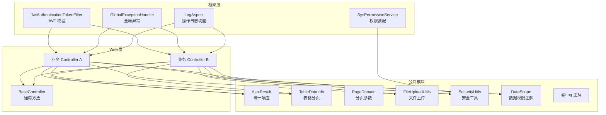
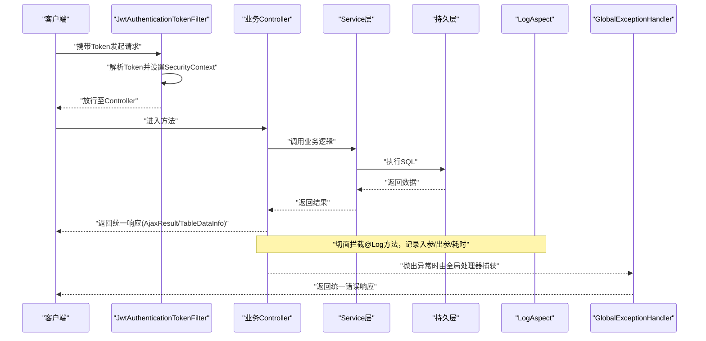
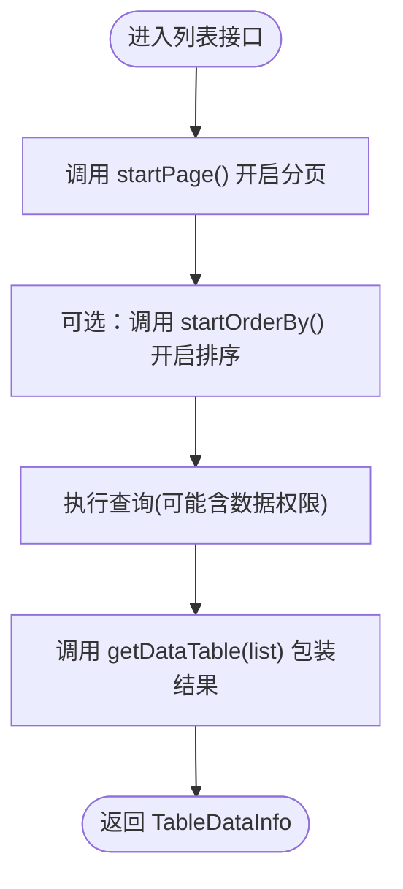
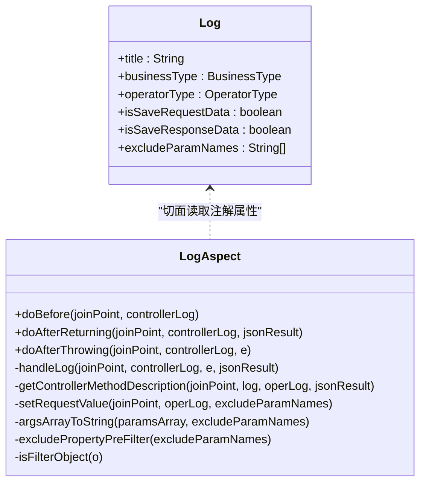
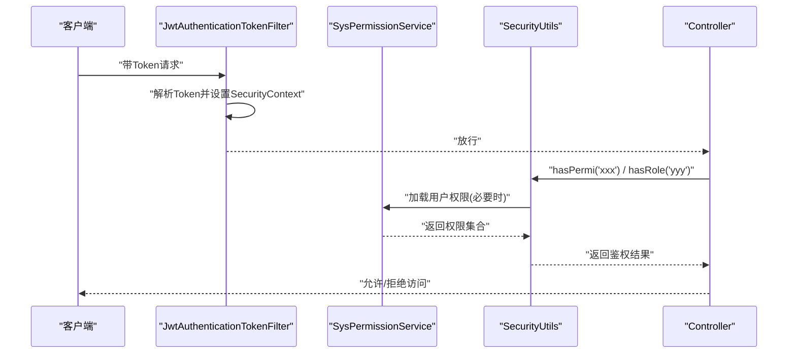
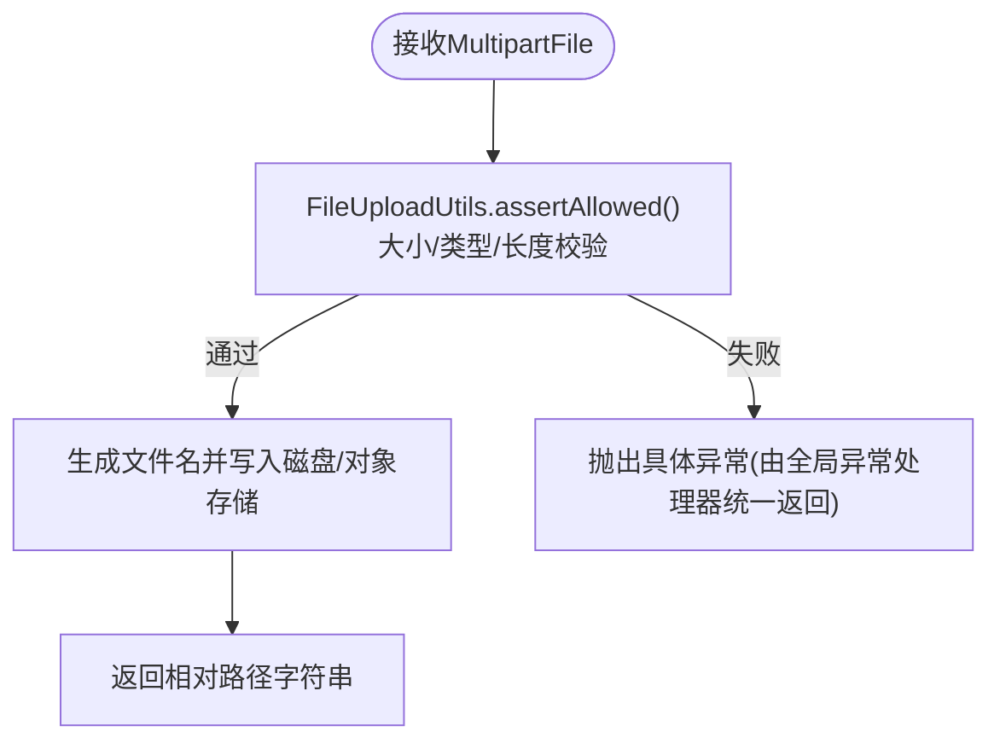
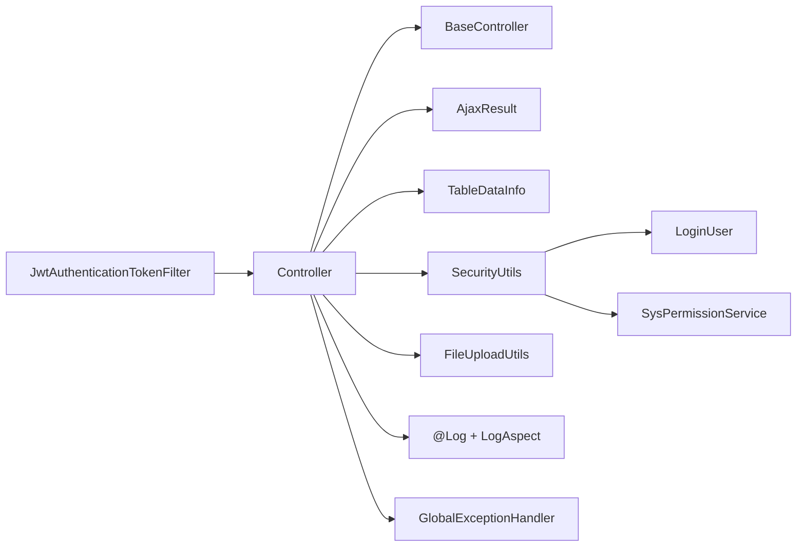

# Controller 层开发规范

<cite>
**本文引用的文件**   
- [BaseController.java](file://PezMax-Backend/ruoyi-common/src/main/java/com/ruoyi/common/core/controller/BaseController.java)
- [GlobalExceptionHandler.java](file://PezMax-Backend/ruoyi-framework/src/main/java/com/ruoyi/framework/web/exception/GlobalExceptionHandler.java)
- [Log.java](file://PezMax-Backend/ruoyi-common/src/main/java/com/ruoyi/common/annotation/Log.java)
- [LogAspect.java](file://PezMax-Backend/ruoyi-framework/src/main/java/com/ruoyi/framework/aspectj/LogAspect.java)
- [AjaxResult.java](file://PezMax-Backend/ruoyi-common/src/main/java/com/ruoyi/common/core/domain/AjaxResult.java)
- [TableDataInfo.java](file://PezMax-Backend/ruoyi-common/src/main/java/com/ruoyi/common/core/page/TableDataInfo.java)
- [JwtAuthenticationTokenFilter.java](file://PezMax-Backend/ruoyi-framework/src/main/java/com/ruoyi/framework/security/filter/JwtAuthenticationTokenFilter.java)
- [DataScope.java](file://PezMax-Backend/ruoyi-common/src/main/java/com/ruoyi/common/annotation/DataScope.java)
- [SecurityUtils.java](file://PezMax-Backend/ruoyi-common/src/main/java/com/ruoyi/common/utils/SecurityUtils.java)
- [SysPermissionService.java](file://PezMax-Backend/ruoyi-framework/src/main/java/com/ruoyi/framework/web/service/SysPermissionService.java)
- [LoginUser.java](file://PezMax-Backend/ruoyi-common/src/main/java/com/ruoyi/common/core/domain/model/LoginUser.java)
- [FileUploadUtils.java](file://PezMax-Backend/ruoyi-common/src/main/java/com/ruoyi/common/utils/file/FileUploadUtils.java)
- [PageDomain.java](file://PezMax-Backend/ruoyi-common/src/main/java/com/ruoyi/common/core/page/PageDomain.java)
</cite>

## 目录
1. [引言](#引言)
2. [项目结构](#项目结构)
3. [核心组件](#核心组件)
4. [架构总览](#架构总览)
5. [详细组件分析](#详细组件分析)
6. [依赖关系分析](#依赖关系分析)
7. [性能与可观测性](#性能与可观测性)
8. [故障排查指南](#故障排查指南)
9. [结论](#结论)
10. [附录：Controller 最佳实践清单](#附录controller-最佳实践清单)

## 引言
本规范面向后端 Controller 层的开发与维护，明确职责边界、统一交互契约、标准化异常处理与日志记录，并给出权限控制（RBAC 与数据权限）的集成方式。同时覆盖请求参数绑定、文件上传、分页查询等常见场景的最佳实践，并提供“代码片段路径”以便快速定位实现细节。

## 项目结构
本项目采用分层架构，Controller 位于 Web 层，通过 BaseController 提供通用能力；框架层负责安全、异常、日志切面等横切关注点；公共模块提供统一响应体、分页模型、工具类等。

图表来源
- [BaseController.java:1-203](file://PezMax-Backend/ruoyi-common/src/main/java/com/ruoyi/common/core/controller/BaseController.java#L1-L203)
- [GlobalExceptionHandler.java:1-146](file://PezMax-Backend/ruoyi-framework/src/main/java/com/ruoyi/framework/web/exception/GlobalExceptionHandler.java#L1-L146)
- [LogAspect.java:1-265](file://PezMax-Backend/ruoyi-framework/src/main/java/com/ruoyi/framework/aspectj/LogAspect.java#L1-L265)
- [JwtAuthenticationTokenFilter.java:1-45](file://PezMax-Backend/ruoyi-framework/src/main/java/com/ruoyi/framework/security/filter/JwtAuthenticationTokenFilter.java#L1-L45)
- [SysPermissionService.java:1-90](file://PezMax-Backend/ruoyi-framework/src/main/java/com/ruoyi/framework/web/service/SysPermissionService.java#L1-L90)
- [AjaxResult.java:1-217](file://PezMax-Backend/ruoyi-common/src/main/java/com/ruoyi/common/core/domain/AjaxResult.java#L1-L217)
- [TableDataInfo.java:1-86](file://PezMax-Backend/ruoyi-common/src/main/java/com/ruoyi/common/core/page/TableDataInfo.java#L1-L86)
- [PageDomain.java:1-102](file://PezMax-Backend/ruoyi-common/src/main/java/com/ruoyi/common/core/page/PageDomain.java#L1-L102)
- [FileUploadUtils.java:1-261](file://PezMax-Backend/ruoyi-common/src/main/java/com/ruoyi/common/utils/file/FileUploadUtils.java#L1-L261)
- [SecurityUtils.java:1-189](file://PezMax-Backend/ruoyi-common/src/main/java/com/ruoyi/common/utils/SecurityUtils.java#L1-L189)
- [DataScope.java:1-34](file://PezMax-Backend/ruoyi-common/src/main/java/com/ruoyi/common/annotation/DataScope.java#L1-L34)
- [Log.java:1-52](file://PezMax-Backend/ruoyi-common/src/main/java/com/ruoyi/common/annotation/Log.java#L1-L52)

章节来源
- [BaseController.java:1-203](file://PezMax-Backend/ruoyi-common/src/main/java/com/ruoyi/common/core/controller/BaseController.java#L1-L203)
- [GlobalExceptionHandler.java:1-146](file://PezMax-Backend/ruoyi-framework/src/main/java/com/ruoyi/framework/web/exception/GlobalExceptionHandler.java#L1-L146)
- [LogAspect.java:1-265](file://PezMax-Backend/ruoyi-framework/src/main/java/com/ruoyi/framework/aspectj/LogAspect.java#L1-L265)
- [JwtAuthenticationTokenFilter.java:1-45](file://PezMax-Backend/ruoyi-framework/src/main/java/com/ruoyi/framework/security/filter/JwtAuthenticationTokenFilter.java#L1-L45)
- [SysPermissionService.java:1-90](file://PezMax-Backend/ruoyi-framework/src/main/java/com/ruoyi/framework/web/service/SysPermissionService.java#L1-L90)
- [AjaxResult.java:1-217](file://PezMax-Backend/ruoyi-common/src/main/java/com/ruoyi/common/core/domain/AjaxResult.java#L1-L217)
- [TableDataInfo.java:1-86](file://PezMax-Backend/ruoyi-common/src/main/java/com/ruoyi/common/core/page/TableDataInfo.java#L1-L86)
- [PageDomain.java:1-102](file://PezMax-Backend/ruoyi-common/src/main/java/com/ruoyi/common/core/page/PageDomain.java#L1-L102)
- [FileUploadUtils.java:1-261](file://PezMax-Backend/ruoyi-common/src/main/java/com/ruoyi/common/utils/file/FileUploadUtils.java#L1-L261)
- [SecurityUtils.java:1-189](file://PezMax-Backend/ruoyi-common/src/main/java/com/ruoyi/common/utils/SecurityUtils.java#L1-L189)
- [DataScope.java:1-34](file://PezMax-Backend/ruoyi-common/src/main/java/com/ruoyi/common/annotation/DataScope.java#L1-L34)
- [Log.java:1-52](file://PezMax-Backend/ruoyi-common/src/main/java/com/ruoyi/common/annotation/Log.java#L1-L52)

## 核心组件
- BaseController：提供日期转换、分页启动/清理、排序构建、统一响应封装、用户信息获取等通用能力。
- GlobalExceptionHandler：集中捕获并规范化各类异常为统一响应体。
- Log 注解 + LogAspect：基于注解的操作日志切面，自动采集请求参数、响应结果、耗时、IP、用户信息等。
- AjaxResult / TableDataInfo：统一的响应结构与分页表格数据结构。
- JwtAuthenticationTokenFilter：从 Token 解析登录用户并注入到 SecurityContext。
- SysPermissionService：根据角色与菜单装配权限集合，供后续鉴权使用。
- SecurityUtils：便捷访问当前用户、角色、权限的工具类。
- DataScope：数据权限过滤注解，配合切面在 SQL 层追加部门/用户维度限制。
- FileUploadUtils：文件上传的统一工具，包含大小、类型、命名策略等校验与存储。
- PageDomain：分页与排序参数模型。

章节来源
- [BaseController.java:1-203](file://PezMax-Backend/ruoyi-common/src/main/java/com/ruoyi/common/core/controller/BaseController.java#L1-L203)
- [GlobalExceptionHandler.java:1-146](file://PezMax-Backend/ruoyi-framework/src/main/java/com/ruoyi/framework/web/exception/GlobalExceptionHandler.java#L1-L146)
- [Log.java:1-52](file://PezMax-Backend/ruoyi-common/src/main/java/com/ruoyi/common/annotation/Log.java#L1-L52)
- [LogAspect.java:1-265](file://PezMax-Backend/ruoyi-framework/src/main/java/com/ruoyi/framework/aspectj/LogAspect.java#L1-L265)
- [AjaxResult.java:1-217](file://PezMax-Backend/ruoyi-common/src/main/java/com/ruoyi/common/core/domain/AjaxResult.java#L1-L217)
- [TableDataInfo.java:1-86](file://PezMax-Backend/ruoyi-common/src/main/java/com/ruoyi/common/core/page/TableDataInfo.java#L1-L86)
- [JwtAuthenticationTokenFilter.java:1-45](file://PezMax-Backend/ruoyi-framework/src/main/java/com/ruoyi/framework/security/filter/JwtAuthenticationTokenFilter.java#L1-L45)
- [SysPermissionService.java:1-90](file://PezMax-Backend/ruoyi-framework/src/main/java/com/ruoyi/framework/web/service/SysPermissionService.java#L1-L90)
- [SecurityUtils.java:1-189](file://PezMax-Backend/ruoyi-common/src/main/java/com/ruoyi/common/utils/SecurityUtils.java#L1-L189)
- [DataScope.java:1-34](file://PezMax-Backend/ruoyi-common/src/main/java/com/ruoyi/common/annotation/DataScope.java#L1-L34)
- [FileUploadUtils.java:1-261](file://PezMax-Backend/ruoyi-common/src/main/java/com/ruoyi/common/utils/file/FileUploadUtils.java#L1-L261)
- [PageDomain.java:1-102](file://PezMax-Backend/ruoyi-common/src/main/java/com/ruoyi/common/core/page/PageDomain.java#L1-L102)

## 架构总览
下图展示一次受保护的接口调用在框架中的关键流转：过滤器完成认证，控制器执行业务，切面记录日志，异常被全局处理器统一收敛。

图表来源
- [JwtAuthenticationTokenFilter.java:1-45](file://PezMax-Backend/ruoyi-framework/src/main/java/com/ruoyi/framework/security/filter/JwtAuthenticationTokenFilter.java#L1-L45)
- [LogAspect.java:1-265](file://PezMax-Backend/ruoyi-framework/src/main/java/com/ruoyi/framework/aspectj/LogAspect.java#L1-L265)
- [GlobalExceptionHandler.java:1-146](file://PezMax-Backend/ruoyi-framework/src/main/java/com/ruoyi/framework/web/exception/GlobalExceptionHandler.java#L1-L146)
- [AjaxResult.java:1-217](file://PezMax-Backend/ruoyi-common/src/main/java/com/ruoyi/common/core/domain/AjaxResult.java#L1-L217)
- [TableDataInfo.java:1-86](file://PezMax-Backend/ruoyi-common/src/main/java/com/ruoyi/common/core/page/TableDataInfo.java#L1-L86)

## 详细组件分析

### 统一响应与分页
- 统一响应体 AjaxResult：提供 success/warn/error 等静态工厂方法，便于 Controller 直接返回。
- 表格分页 TableDataInfo：用于列表接口返回 rows 与 total，结合 PageHelper 使用。
- BaseController.getDataTable：将 List 包装为 TableDataInfo，简化分页返回。

章节来源
- [AjaxResult.java:1-217](file://PezMax-Backend/ruoyi-common/src/main/java/com/ruoyi/common/core/domain/AjaxResult.java#L1-L217)
- [TableDataInfo.java:1-86](file://PezMax-Backend/ruoyi-common/src/main/java/com/ruoyi/common/core/page/TableDataInfo.java#L1-L86)
- [BaseController.java:82-91](file://PezMax-Backend/ruoyi-common/src/main/java/com/ruoyi/common/core/controller/BaseController.java#L82-L91)

### 分页与排序最佳实践
- 在 Controller 中调用 startPage() 开启分页，startOrderBy() 开启排序，clearPage() 清理上下文。
- 分页参数来自前端 PageDomain 约定的字段，支持合理化处理与多列排序。
- 列表查询后使用 getDataTable(list) 返回标准分页结构。

图表来源
- [BaseController.java:53-77](file://PezMax-Backend/ruoyi-common/src/main/java/com/ruoyi/common/core/controller/BaseController.java#L53-L77)
- [BaseController.java:82-91](file://PezMax-Backend/ruoyi-common/src/main/java/com/ruoyi/common/core/controller/BaseController.java#L82-L91)
- [PageDomain.java:1-102](file://PezMax-Backend/ruoyi-common/src/main/java/com/ruoyi/common/core/page/PageDomain.java#L1-L102)

章节来源
- [BaseController.java:53-91](file://PezMax-Backend/ruoyi-common/src/main/java/com/ruoyi/common/core/controller/BaseController.java#L53-L91)
- [PageDomain.java:1-102](file://PezMax-Backend/ruoyi-common/src/main/java/com/ruoyi/common/core/page/PageDomain.java#L1-L102)

### 参数验证与绑定
- 推荐使用 JSR-303/JSR-380 注解（如 @Valid、@NotBlank、@NotNull、@Size 等）在 DTO 上声明约束。
- 在 Controller 方法参数前加 @Valid 触发校验；若失败，将由全局异常处理器统一返回错误消息。
- 对于表单提交或复杂对象，建议定义独立的 DTO 并使用 @Valid 进行校验。

章节来源
- [GlobalExceptionHandler.java:118-135](file://PezMax-Backend/ruoyi-framework/src/main/java/com/ruoyi/framework/web/exception/GlobalExceptionHandler.java#L118-L135)

### 统一异常处理
- 全局异常处理器已覆盖权限拒绝、HTTP 方法不支持、业务异常、参数绑定异常、类型不匹配、演示模式异常及未知异常等。
- 所有异常均转换为 AjaxResult，确保前后端一致的错误语义。

章节来源
- [GlobalExceptionHandler.java:1-146](file://PezMax-Backend/ruoyi-framework/src/main/java/com/ruoyi/framework/web/exception/GlobalExceptionHandler.java#L1-L146)

### 日志记录标准化
- 在需要审计的方法上使用 @Log 注解，配置 title、businessType、operatorType、是否保存请求/响应、排除字段等。
- LogAspect 会在方法前后收集 IP、URL、耗时、入参、出参等信息，并异步落库。
- 敏感字段（如密码相关）默认排除，避免泄露。

图表来源
- [Log.java:1-52](file://PezMax-Backend/ruoyi-common/src/main/java/com/ruoyi/common/annotation/Log.java#L1-L52)
- [LogAspect.java:1-265](file://PezMax-Backend/ruoyi-framework/src/main/java/com/ruoyi/framework/aspectj/LogAspect.java#L1-L265)

章节来源
- [Log.java:1-52](file://PezMax-Backend/ruoyi-common/src/main/java/com/ruoyi/common/annotation/Log.java#L1-L52)
- [LogAspect.java:1-265](file://PezMax-Backend/ruoyi-framework/src/main/java/com/ruoyi/framework/aspectj/LogAspect.java#L1-L265)

### 权限控制集成（RBAC）
- 认证流程：JwtAuthenticationTokenFilter 从请求中解析 Token，校验有效性后将 LoginUser 注入到 SecurityContext。
- 权限装配：SysPermissionService 根据用户角色与菜单装配权限集合，供后续鉴权使用。
- 工具类：SecurityUtils 提供 hasPermi、hasRole、isAdmin 等便捷方法，Controller 可直接使用。
- 建议在 Controller 方法中使用 Spring Security 注解（如 @PreAuthorize）或自定义注解进行方法级授权。

图表来源
- [JwtAuthenticationTokenFilter.java:1-45](file://PezMax-Backend/ruoyi-framework/src/main/java/com/ruoyi/framework/security/filter/JwtAuthenticationTokenFilter.java#L1-L45)
- [SysPermissionService.java:1-90](file://PezMax-Backend/ruoyi-framework/src/main/java/com/ruoyi/framework/web/service/SysPermissionService.java#L1-L90)
- [SecurityUtils.java:1-189](file://PezMax-Backend/ruoyi-common/src/main/java/com/ruoyi/common/utils/SecurityUtils.java#L1-L189)
- [LoginUser.java:1-279](file://PezMax-Backend/ruoyi-common/src/main/java/com/ruoyi/common/core/domain/model/LoginUser.java#L1-L279)

章节来源
- [JwtAuthenticationTokenFilter.java:1-45](file://PezMax-Backend/ruoyi-framework/src/main/java/com/ruoyi/framework/security/filter/JwtAuthenticationTokenFilter.java#L1-L45)
- [SysPermissionService.java:1-90](file://PezMax-Backend/ruoyi-framework/src/main/java/com/ruoyi/framework/web/service/SysPermissionService.java#L1-L90)
- [SecurityUtils.java:1-189](file://PezMax-Backend/ruoyi-common/src/main/java/com/ruoyi/common/utils/SecurityUtils.java#L1-L189)
- [LoginUser.java:1-279](file://PezMax-Backend/ruoyi-common/src/main/java/com/ruoyi/common/core/domain/model/LoginUser.java#L1-L279)

### 数据权限控制（按部门/用户）
- 在需要数据权限控制的 Service 方法上使用 @DataScope 注解，指定部门/用户表别名与权限字符。
- 数据权限切面会依据当前用户的角色与权限，动态拼接 SQL 条件，限制可见范围。
- 适用于“仅查看本部门数据”、“仅查看本人数据”等场景。

章节来源
- [DataScope.java:1-34](file://PezMax-Backend/ruoyi-common/src/main/java/com/ruoyi/common/annotation/DataScope.java#L1-L34)

### 文件上传处理
- 使用 MultipartFile 接收文件，调用 FileUploadUtils.upload(...) 进行校验与存储。
- 内置校验包括文件大小、扩展名白名单、文件名长度限制；支持自定义命名策略。
- 返回相对路径字符串，便于后续持久化与访问。

图表来源
- [FileUploadUtils.java:186-224](file://PezMax-Backend/ruoyi-common/src/main/java/com/ruoyi/common/utils/file/FileUploadUtils.java#L186-L224)
- [FileUploadUtils.java:122-139](file://PezMax-Backend/ruoyi-common/src/main/java/com/ruoyi/common/utils/file/FileUploadUtils.java#L122-L139)
- [GlobalExceptionHandler.java:1-146](file://PezMax-Backend/ruoyi-framework/src/main/java/com/ruoyi/framework/web/exception/GlobalExceptionHandler.java#L1-L146)

章节来源
- [FileUploadUtils.java:1-261](file://PezMax-Backend/ruoyi-common/src/main/java/com/ruoyi/common/utils/file/FileUploadUtils.java#L1-L261)
- [GlobalExceptionHandler.java:1-146](file://PezMax-Backend/ruoyi-framework/src/main/java/com/ruoyi/framework/web/exception/GlobalExceptionHandler.java#L1-L146)

### 完整示例（以“代码片段路径”形式）
以下为典型 Controller 方法的实现要点与对应源码位置，便于对照落地：
- 列表分页查询
  - 开启分页与排序：[BaseController.java:53-69](file://PezMax-Backend/ruoyi-common/src/main/java/com/ruoyi/common/core/controller/BaseController.java#L53-L69)
  - 包装分页结果：[BaseController.java:82-91](file://PezMax-Backend/ruoyi-common/src/main/java/com/ruoyi/common/core/controller/BaseController.java#L82-L91)
  - 分页参数模型：[PageDomain.java:1-102](file://PezMax-Backend/ruoyi-common/src/main/java/com/ruoyi/common/core/page/PageDomain.java#L1-L102)
- 新增/修改/删除
  - 统一成功/失败响应：[AjaxResult.java:67-171](file://PezMax-Backend/ruoyi-common/src/main/java/com/ruoyi/common/core/domain/AjaxResult.java#L67-L171)
  - 影响行数转结果：[BaseController.java:147-161](file://PezMax-Backend/ruoyi-common/src/main/java/com/ruoyi/common/core/controller/BaseController.java#L147-L161)
- 参数校验
  - 校验失败统一处理：[GlobalExceptionHandler.java:118-135](file://PezMax-Backend/ruoyi-framework/src/main/java/com/ruoyi/framework/web/exception/GlobalExceptionHandler.java#L118-L135)
- 文件上传
  - 上传入口与校验：[FileUploadUtils.java:102-139](file://PezMax-Backend/ruoyi-common/src/main/java/com/ruoyi/common/utils/file/FileUploadUtils.java#L102-L139)
- 权限判断
  - 权限/角色工具方法：[SecurityUtils.java:144-186](file://PezMax-Backend/ruoyi-common/src/main/java/com/ruoyi/common/utils/SecurityUtils.java#L144-L186)
- 操作日志
  - 注解定义与切面处理：[Log.java:1-52](file://PezMax-Backend/ruoyi-common/src/main/java/com/ruoyi/common/annotation/Log.java#L1-L52), [LogAspect.java:59-140](file://PezMax-Backend/ruoyi-framework/src/main/java/com/ruoyi/framework/aspectj/LogAspect.java#L59-L140)

## 依赖关系分析
- Controller 依赖 BaseController 提供的通用能力，依赖 AjaxResult/TableDataInfo 作为统一响应。
- 安全链路：JwtAuthenticationTokenFilter -> SecurityContext -> SecurityUtils -> SysPermissionService。
- 日志链路：@Log -> LogAspect -> 异步落库。
- 异常链路：业务/系统异常 -> GlobalExceptionHandler -> AjaxResult。

图表来源
- [BaseController.java:1-203](file://PezMax-Backend/ruoyi-common/src/main/java/com/ruoyi/common/core/controller/BaseController.java#L1-L203)
- [AjaxResult.java:1-217](file://PezMax-Backend/ruoyi-common/src/main/java/com/ruoyi/common/core/domain/AjaxResult.java#L1-L217)
- [TableDataInfo.java:1-86](file://PezMax-Backend/ruoyi-common/src/main/java/com/ruoyi/common/core/page/TableDataInfo.java#L1-L86)
- [SecurityUtils.java:1-189](file://PezMax-Backend/ruoyi-common/src/main/java/com/ruoyi/common/utils/SecurityUtils.java#L1-L189)
- [LoginUser.java:1-279](file://PezMax-Backend/ruoyi-common/src/main/java/com/ruoyi/common/core/domain/model/LoginUser.java#L1-L279)
- [SysPermissionService.java:1-90](file://PezMax-Backend/ruoyi-framework/src/main/java/com/ruoyi/framework/web/service/SysPermissionService.java#L1-L90)
- [FileUploadUtils.java:1-261](file://PezMax-Backend/ruoyi-common/src/main/java/com/ruoyi/common/utils/file/FileUploadUtils.java#L1-L261)
- [Log.java:1-52](file://PezMax-Backend/ruoyi-common/src/main/java/com/ruoyi/common/annotation/Log.java#L1-L52)
- [LogAspect.java:1-265](file://PezMax-Backend/ruoyi-framework/src/main/java/com/ruoyi/framework/aspectj/LogAspect.java#L1-L265)
- [GlobalExceptionHandler.java:1-146](file://PezMax-Backend/ruoyi-framework/src/main/java/com/ruoyi/framework/web/exception/GlobalExceptionHandler.java#L1-L146)
- [JwtAuthenticationTokenFilter.java:1-45](file://PezMax-Backend/ruoyi-framework/src/main/java/com/ruoyi/framework/security/filter/JwtAuthenticationTokenFilter.java#L1-L45)

## 性能与可观测性
- 分页查询务必开启分页，避免全表扫描；合理使用排序与过滤条件。
- 日志切面默认异步落库，避免阻塞主流程；注意控制入参与出参大小，避免大对象序列化开销。
- 文件上传需限制大小与类型，防止恶意资源占用。
- 统一响应体减少分支判断，提升可读性与一致性。

## 故障排查指南
- 权限不足（403）：检查用户角色与权限装配是否正确，确认方法是否具备所需权限。
- 参数校验失败：检查 DTO 上的校验注解与方法参数是否添加 @Valid。
- 类型不匹配：检查 URL 路径变量或查询参数类型是否与目标方法签名一致。
- 文件上传失败：检查文件大小、扩展名白名单、存储目录权限。
- 日志缺失：确认方法是否标注 @Log，且切面生效。

章节来源
- [GlobalExceptionHandler.java:1-146](file://PezMax-Backend/ruoyi-framework/src/main/java/com/ruoyi/framework/web/exception/GlobalExceptionHandler.java#L1-L146)
- [LogAspect.java:1-265](file://PezMax-Backend/ruoyi-framework/src/main/java/com/ruoyi/framework/aspectj/LogAspect.java#L1-L265)
- [FileUploadUtils.java:186-224](file://PezMax-Backend/ruoyi-common/src/main/java/com/ruoyi/common/utils/file/FileUploadUtils.java#L186-L224)

## 结论
遵循本规范可实现 Controller 层的高内聚、低耦合与强一致性：统一响应、统一异常、统一日志、统一权限与数据权限、统一分页与文件上传。通过注解与切面降低样板代码，提高可维护性与可观测性。

## 附录：Controller 最佳实践清单
- 继承 BaseController，复用分页、排序、响应与用户信息获取方法。
- 使用 DTO + @Valid 进行参数校验，避免在 Controller 中手写校验逻辑。
- 列表接口返回 TableDataInfo，新增/修改/删除返回 AjaxResult。
- 对关键方法标注 @Log，合理设置 isSaveRequestData/isSaveResponseData/excludeParamNames。
- 使用 SecurityUtils.hasPermi/hasRole 进行方法内二次校验，或在方法级使用 Spring Security 注解。
- 涉及数据隔离的查询，在 Service 层使用 @DataScope 注解。
- 文件上传使用 FileUploadUtils，严格限制大小与类型。
- 不要吞异常，尽量抛出 ServiceException 或业务异常，交由全局异常处理器统一处理。