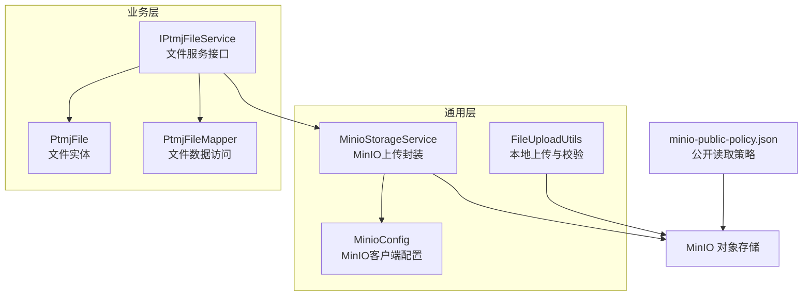
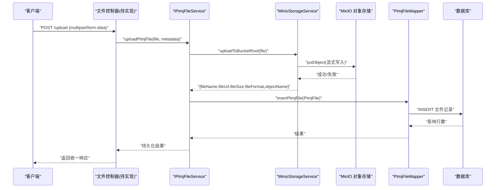
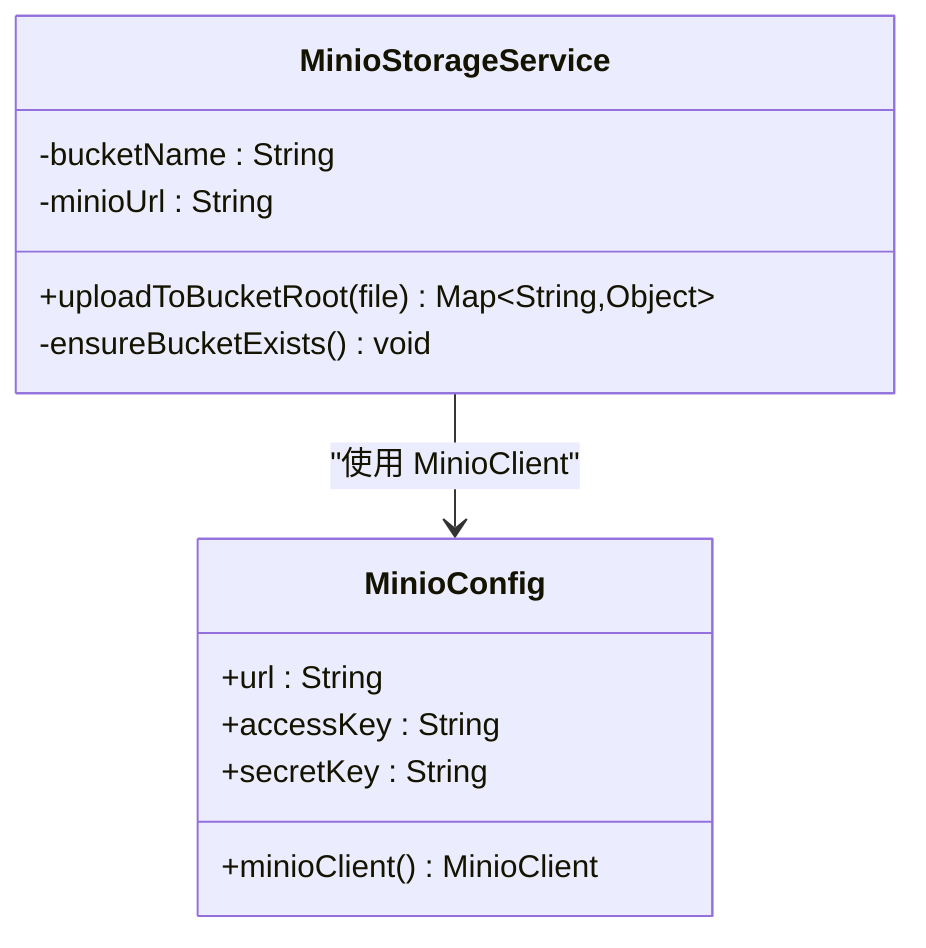
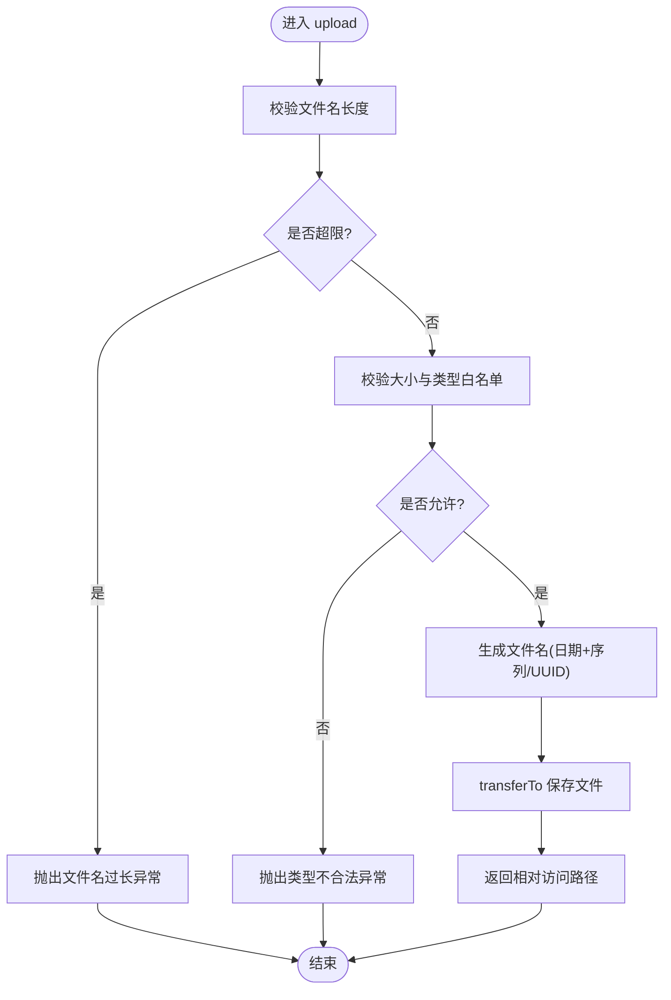
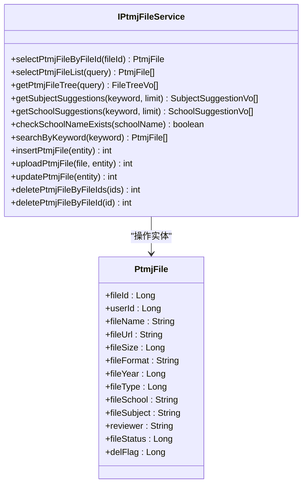
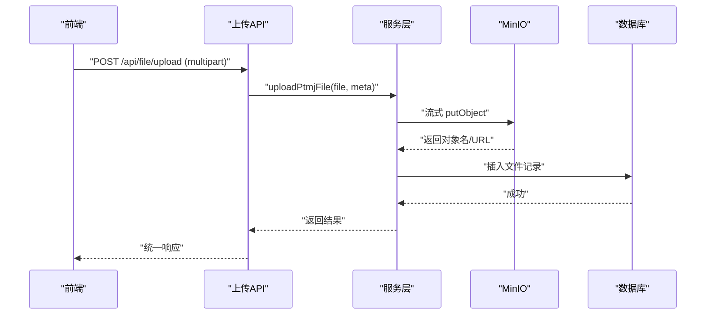
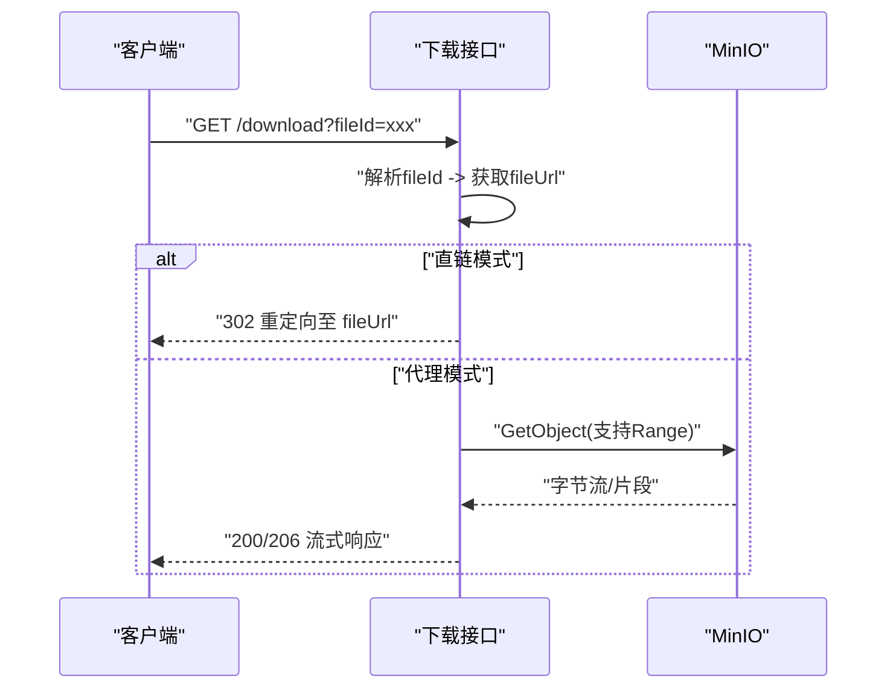
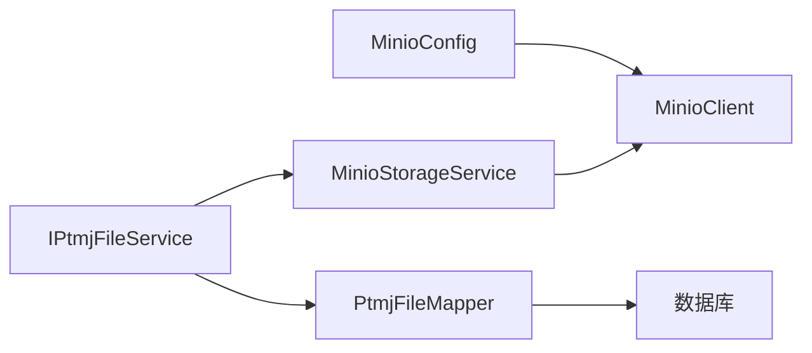

# 文件上传下载接口

<cite>
**本文引用的文件**
- [MinioConfig.java](file://PezMax-Backend/ruoyi-common/src/main/java/com/ruoyi/common/config/MinioConfig.java)
- [MinioStorageService.java](file://PezMax-Backend/ruoyi-common/src/main/java/com/ruoyi/common/utils/file/MinioStorageService.java)
- [FileUploadUtils.java](file://PezMax-Backend/ruoyi-common/src/main/java/com/ruoyi/common/utils/file/FileUploadUtils.java)
- [minio-public-policy.json](file://PezMax-Backend/ptmj-datum/src/main/resources/minio-public-policy.json)
- [IPtmjFileService.java](file://PezMax-Backend/ptmj-datum/src/main/java/com/ptmj/datum/service/IPtmjFileService.java)
- [PtmjFile.java](file://PezMax-Backend/ptmj-datum/src/main/java/com/ptmj/datum/domain/PtmjFile.java)
- [PtmjFileMapper.java](file://PezMax-Backend/ptmj-datum/src/main/java/com/ptmj/datum/mapper/PtmjFileMapper.java)
</cite>

## 目录
1. [简介](#简介)
2. [项目结构](#项目结构)
3. [核心组件](#核心组件)
4. [架构总览](#架构总览)
5. [详细组件分析](#详细组件分析)
6. [依赖分析](#依赖分析)
7. [性能考虑](#性能考虑)
8. [故障排查指南](#故障排查指南)
9. [结论](#结论)
10. [附录](#附录)

## 简介
本文件面向“文件上传下载接口”的文档化与实现说明，覆盖以下要点：
- 单文件上传、多文件上传、大文件分片上传的处理方式与扩展建议
- MinIO 对象存储集成配置、存储空间管理与访问权限控制
- 文件下载接口的实现方案（流式下载、断点续传、预览）
- 文件大小限制、类型校验、安全扫描等安全措施
- 性能优化建议与最佳实践

## 项目结构
本项目采用分层架构，与文件上传下载相关的关键代码位于通用工具层与业务领域层：
- 通用配置与工具
  - MinIO 客户端配置：MinioConfig
  - MinIO 存储服务封装：MinioStorageService
  - 本地文件上传工具（含大小/类型校验）：FileUploadUtils
- 业务领域
  - 文件实体模型：PtmjFile
  - 文件服务接口（含上传入口）：IPtmjFileService
  - 文件数据访问映射：PtmjFileMapper
- 资源策略
  - MinIO 公开读取策略模板：minio-public-policy.json

图表来源
- [MinioConfig.java:1-28](file://PezMax-Backend/ruoyi-common/src/main/java/com/ruoyi/common/config/MinioConfig.java#L1-L28)
- [MinioStorageService.java:1-88](file://PezMax-Backend/ruoyi-common/src/main/java/com/ruoyi/common/utils/file/MinioStorageService.java#L1-L88)
- [FileUploadUtils.java:1-261](file://PezMax-Backend/ruoyi-common/src/main/java/com/ruoyi/common/utils/file/FileUploadUtils.java#L1-L261)
- [IPtmjFileService.java:1-119](file://PezMax-Backend/ptmj-datum/src/main/java/com/ptmj/datum/service/IPtmjFileService.java#L1-L119)
- [PtmjFile.java:1-224](file://PezMax-Backend/ptmj-datum/src/main/java/com/ptmj/datum/domain/PtmjFile.java#L1-L224)
- [PtmjFileMapper.java:1-111](file://PezMax-Backend/ptmj-datum/src/main/java/com/ptmj/datum/mapper/PtmjFileMapper.java#L1-L111)
- [minio-public-policy.json:1-17](file://PezMax-Backend/ptmj-datum/src/main/resources/minio-public-policy.json#L1-L17)

章节来源
- [MinioConfig.java:1-28](file://PezMax-Backend/ruoyi-common/src/main/java/com/ruoyi/common/config/MinioConfig.java#L1-L28)
- [MinioStorageService.java:1-88](file://PezMax-Backend/ruoyi-common/src/main/java/com/ruoyi/common/utils/file/MinioStorageService.java#L1-L88)
- [FileUploadUtils.java:1-261](file://PezMax-Backend/ruoyi-common/src/main/java/com/ruoyi/common/utils/file/FileUploadUtils.java#L1-L261)
- [IPtmjFileService.java:1-119](file://PezMax-Backend/ptmj-datum/src/main/java/com/ptmj/datum/service/IPtmjFileService.java#L1-L119)
- [PtmjFile.java:1-224](file://PezMax-Backend/ptmj-datum/src/main/java/com/ptmj/datum/domain/PtmjFile.java#L1-L224)
- [PtmjFileMapper.java:1-111](file://PezMax-Backend/ptmj-datum/src/main/java/com/ptmj/datum/mapper/PtmjFileMapper.java#L1-L111)
- [minio-public-policy.json:1-17](file://PezMax-Backend/ptmj-datum/src/main/resources/minio-public-policy.json#L1-L17)

## 核心组件
- MinIO 客户端配置
  - 通过配置项注入端点、访问密钥与密钥，构建 MinioClient Bean，供存储服务使用。
- MinIO 存储服务
  - 提供桶存在性检查与自动创建；将 MultipartFile 以流式方式写入桶根目录；返回文件名、URL、大小、格式、对象名等信息。
- 本地文件上传工具
  - 提供默认大小限制、文件名长度限制、MIME/后缀白名单校验；支持自定义命名或系统生成命名；生成可访问路径前缀。
- 文件服务接口
  - 定义文件查询、树聚合、联想推荐、新增、批量删除以及“上传并新增”等业务能力。
- 文件实体与数据访问
  - PtmjFile 描述文件元信息（名称、URL、大小、格式、年份、类型、学校、科目、审核状态等）。
  - PtmjFileMapper 提供增删改查、关键词搜索、统计等数据访问方法。

章节来源
- [MinioConfig.java:1-28](file://PezMax-Backend/ruoyi-common/src/main/java/com/ruoyi/common/config/MinioConfig.java#L1-L28)
- [MinioStorageService.java:1-88](file://PezMax-Backend/ruoyi-common/src/main/java/com/ruoyi/common/utils/file/MinioStorageService.java#L1-L88)
- [FileUploadUtils.java:1-261](file://PezMax-Backend/ruoyi-common/src/main/java/com/ruoyi/common/utils/file/FileUploadUtils.java#L1-L261)
- [IPtmjFileService.java:1-119](file://PezMax-Backend/ptmj-datum/src/main/java/com/ptmj/datum/service/IPtmjFileService.java#L1-L119)
- [PtmjFile.java:1-224](file://PezMax-Backend/ptmj-datum/src/main/java/com/ptmj/datum/domain/PtmjFile.java#L1-L224)
- [PtmjFileMapper.java:1-111](file://PezMax-Backend/ptmj-datum/src/main/java/com/ptmj/datum/mapper/PtmjFileMapper.java#L1-L111)

## 架构总览
下图展示从控制器到存储层的典型调用链（以“上传并新增”为例）：

图表来源
- [IPtmjFileService.java:86-93](file://PezMax-Backend/ptmj-datum/src/main/java/com/ptmj/datum/service/IPtmjFileService.java#L86-L93)
- [MinioStorageService.java:35-77](file://PezMax-Backend/ruoyi-common/src/main/java/com/ruoyi/common/utils/file/MinioStorageService.java#L35-L77)
- [PtmjFileMapper.java:64-69](file://PezMax-Backend/ptmj-datum/src/main/java/com/ptmj/datum/mapper/PtmjFileMapper.java#L64-L69)

## 详细组件分析

### MinIO 集成与配置
- 客户端初始化
  - 通过配置项 minio.url、minio.accessKey、minio.secretKey 构建 MinioClient Bean。
- 桶管理
  - 上传前检查桶是否存在，不存在则自动创建。
- 上传流程
  - 清理原始文件名中的路径分隔符，提取扩展名；生成唯一 objectName；设置 contentType；以流式 PutObject 写入桶根目录；拼接可访问 URL。
- 访问策略
  - 提供公开读取策略模板，允许匿名 GetObject 与 GetBucketLocation，便于直接浏览器访问。

图表来源
- [MinioConfig.java:1-28](file://PezMax-Backend/ruoyi-common/src/main/java/com/ruoyi/common/config/MinioConfig.java#L1-L28)
- [MinioStorageService.java:1-88](file://PezMax-Backend/ruoyi-common/src/main/java/com/ruoyi/common/utils/file/MinioStorageService.java#L1-L88)

章节来源
- [MinioConfig.java:1-28](file://PezMax-Backend/ruoyi-common/src/main/java/com/ruoyi/common/config/MinioConfig.java#L1-L28)
- [MinioStorageService.java:1-88](file://PezMax-Backend/ruoyi-common/src/main/java/com/ruoyi/common/utils/file/MinioStorageService.java#L1-L88)
- [minio-public-policy.json:1-17](file://PezMax-Backend/ptmj-datum/src/main/resources/minio-public-policy.json#L1-L17)

### 本地文件上传工具（含校验）
- 功能要点
  - 默认最大文件大小、默认文件名长度上限
  - 支持按白名单校验扩展名/MIME
  - 支持日期目录+序列号或UUID命名
  - 生成相对访问路径前缀
- 异常处理
  - 超大小、非法扩展名、文件名过长等抛出对应异常

图表来源
- [FileUploadUtils.java:102-139](file://PezMax-Backend/ruoyi-common/src/main/java/com/ruoyi/common/utils/file/FileUploadUtils.java#L102-L139)
- [FileUploadUtils.java:186-224](file://PezMax-Backend/ruoyi-common/src/main/java/com/ruoyi/common/utils/file/FileUploadUtils.java#L186-L224)

章节来源
- [FileUploadUtils.java:1-261](file://PezMax-Backend/ruoyi-common/src/main/java/com/ruoyi/common/utils/file/FileUploadUtils.java#L1-261)

### 文件服务接口与实体
- 接口能力
  - 查询、树聚合、联想推荐、新增、批量删除、上传并新增
- 实体字段
  - 包含文件ID、用户ID、名称、URL、大小、格式、年份、类型、学校、科目、审核人、状态、删除标记等

图表来源
- [IPtmjFileService.java:1-119](file://PezMax-Backend/ptmj-datum/src/main/java/com/ptmj/datum/service/IPtmjFileService.java#L1-L119)
- [PtmjFile.java:1-224](file://PezMax-Backend/ptmj-datum/src/main/java/com/ptmj/datum/domain/PtmjFile.java#L1-L224)

章节来源
- [IPtmjFileService.java:1-119](file://PezMax-Backend/ptmj-datum/src/main/java/com/ptmj/datum/service/IPtmjFileService.java#L1-L119)
- [PtmjFile.java:1-224](file://PezMax-Backend/ptmj-datum/src/main/java/com/ptmj/datum/domain/PtmjFile.java#L1-L224)

### 文件上传接口实现原理
- 单文件上传
  - 控制器接收 multipart/form-data，调用服务层 uploadPtmjFile，服务内部委托 MinioStorageService.uploadToBucketRoot 完成流式上传，随后持久化文件元信息。
- 多文件上传
  - 建议在控制器层循环调用同一上传逻辑，或在服务层增加批量方法，逐条执行上传与持久化，并汇总结果。
- 大文件分片上传（建议方案）
  - 前端切分为固定大小分片，依次 POST 携带分片序号与总片数；服务端对每个分片追加写入临时对象；全部完成后合并为最终对象，再更新元信息。
  - 注意并发与幂等：使用唯一任务ID关联分片，合并后清理临时分片。

图表来源
- [IPtmjFileService.java:86-93](file://PezMax-Backend/ptmj-datum/src/main/java/com/ptmj/datum/service/IPtmjFileService.java#L86-L93)
- [MinioStorageService.java:35-77](file://PezMax-Backend/ruoyi-common/src/main/java/com/ruoyi/common/utils/file/MinioStorageService.java#L35-L77)

章节来源
- [IPtmjFileService.java:86-93](file://PezMax-Backend/ptmj-datum/src/main/java/com/ptmj/datum/service/IPtmjFileService.java#L86-L93)
- [MinioStorageService.java:35-77](file://PezMax-Backend/ruoyi-common/src/main/java/com/ruoyi/common/utils/file/MinioStorageService.java#L35-L77)

### 文件下载接口实现
- 流式下载
  - 根据 fileUrl 直连 MinIO 或通过后端代理流式输出，避免在应用服务器落盘。
- 断点续传
  - 服务端需支持 Range 请求头，按字节范围读取对象片段并返回 206 Partial Content。
- 文件预览
  - 针对图片、PDF、文本等类型，设置合适的 Content-Type 与 Content-Disposition，浏览器可直接预览；其他类型强制下载。

[本图为概念流程图，无需图表来源]

### 安全措施与合规
- 大小与类型限制
  - 使用 FileUploadUtils 的默认大小与白名单校验，防止超大与恶意类型上传。
- 安全扫描（建议）
  - 在上传成功后异步触发病毒扫描与内容检测，失败则标记文件不可用或删除。
- 访问控制
  - 结合 minio-public-policy.json 控制公开读；如需私有，改为签名URL访问并在网关层鉴权。
- 输入清洗
  - 对文件名进行规范化与长度限制，避免路径穿越与超长攻击。

章节来源
- [FileUploadUtils.java:186-224](file://PezMax-Backend/ruoyi-common/src/main/java/com/ruoyi/common/utils/file/FileUploadUtils.java#L186-L224)
- [minio-public-policy.json:1-17](file://PezMax-Backend/ptmj-datum/src/main/resources/minio-public-policy.json#L1-L17)

## 依赖分析
- 组件耦合
  - MinioStorageService 依赖 MinioClient（由 MinioConfig 提供），与 MinIO 强耦合；与上层服务松耦合，仅暴露上传方法。
  - 文件服务接口依赖存储服务与数据访问层，职责清晰。
- 外部依赖
  - MinIO SDK、Spring Web（MultipartFile）、Apache Commons IO（文件名处理）。

图表来源
- [MinioConfig.java:1-28](file://PezMax-Backend/ruoyi-common/src/main/java/com/ruoyi/common/config/MinioConfig.java#L1-L28)
- [MinioStorageService.java:1-88](file://PezMax-Backend/ruoyi-common/src/main/java/com/ruoyi/common/utils/file/MinioStorageService.java#L1-L88)
- [IPtmjFileService.java:1-119](file://PezMax-Backend/ptmj-datum/src/main/java/com/ptmj/datum/service/IPtmjFileService.java#L1-L119)
- [PtmjFileMapper.java:1-111](file://PezMax-Backend/ptmj-datum/src/main/java/com/ptmj/datum/mapper/PtmjFileMapper.java#L1-L111)

章节来源
- [MinioConfig.java:1-28](file://PezMax-Backend/ruoyi-common/src/main/java/com/ruoyi/common/config/MinioConfig.java#L1-L28)
- [MinioStorageService.java:1-88](file://PezMax-Backend/ruoyi-common/src/main/java/com/ruoyi/common/utils/file/MinioStorageService.java#L1-L88)
- [IPtmjFileService.java:1-119](file://PezMax-Backend/ptmj-datum/src/main/java/com/ptmj/datum/service/IPtmjFileService.java#L1-L119)
- [PtmjFileMapper.java:1-111](file://PezMax-Backend/ptmj-datum/src/main/java/com/ptmj/datum/mapper/PtmjFileMapper.java#L1-L111)

## 性能考虑
- 流式上传/下载
  - 使用 InputStream 流式写入/读取，避免全量加载到内存。
- 连接池与超时
  - 合理配置 MinIO 客户端连接池、读写超时与重试策略。
- 并发与限流
  - 对上传接口实施速率限制与队列化，保护下游存储。
- CDN 与缓存
  - 静态资源经 CDN 加速，减少源站压力；对热点文件启用边缘缓存。
- 分片与并行
  - 大文件分片并行上传，提升吞吐；合并阶段串行保证一致性。
- 压缩与转码
  - 对图片/视频在服务端按需转码与压缩，降低带宽占用。

[本节为通用指导，无需章节来源]

## 故障排查指南
- 常见错误
  - 文件大小超限：检查默认大小限制与业务阈值。
  - 类型不合法：核对白名单与 MIME 类型。
  - 桶不存在：确认 ensureBucketExists 逻辑与权限。
  - 网络/认证失败：检查 MinIO 端点、AK/SK 与网络连通性。
- 定位步骤
  - 查看上传返回值与日志；验证 MinIO 控制台对象是否存在；核对策略文件是否生效。
- 恢复建议
  - 对于分片上传失败，保留分片并支持重试；对于部分写入，提供幂等合并。

章节来源
- [FileUploadUtils.java:186-224](file://PezMax-Backend/ruoyi-common/src/main/java/com/ruoyi/common/utils/file/FileUploadUtils.java#L186-L224)
- [MinioStorageService.java:79-86](file://PezMax-Backend/ruoyi-common/src/main/java/com/ruoyi/common/utils/file/MinioStorageService.java#L79-L86)

## 结论
当前代码已具备 MinIO 集成与基础上传能力，并提供本地上传工具用于校验与路径生成。建议在此基础上完善控制器层接口、下载与预览能力、分片上传与断点续传、安全扫描与访问控制策略，并结合性能优化手段保障高可用与高吞吐。

[本节为总结，无需章节来源]

## 附录
- 关键配置项（示例键名）
  - minio.url：MinIO 服务地址
  - minio.accessKey：访问密钥
  - minio.secretKey：密钥
  - minio.bucketName：目标桶名
- 策略文件
  - minio-public-policy.json：公开读取策略模板，按需替换桶名占位符后生效

章节来源
- [MinioConfig.java:11-26](file://PezMax-Backend/ruoyi-common/src/main/java/com/ruoyi/common/config/MinioConfig.java#L11-L26)
- [MinioStorageService.java:27-31](file://PezMax-Backend/ruoyi-common/src/main/java/com/ruoyi/common/utils/file/MinioStorageService.java#L27-L31)
- [minio-public-policy.json:1-17](file://PezMax-Backend/ptmj-datum/src/main/resources/minio-public-policy.json#L1-L17)