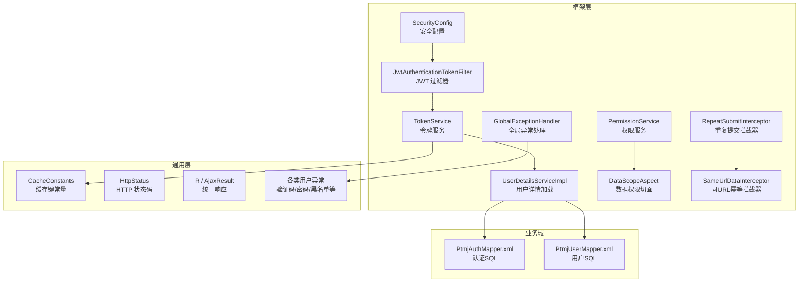
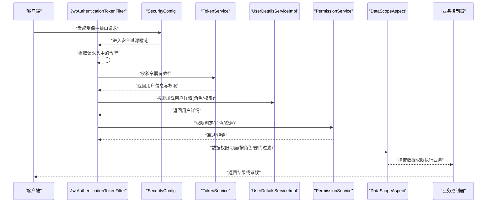
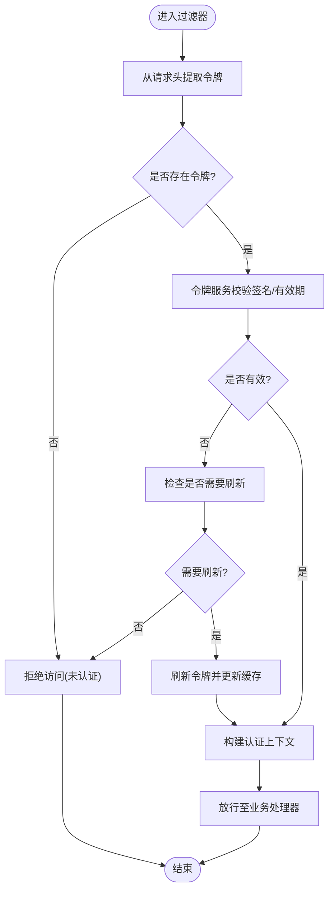
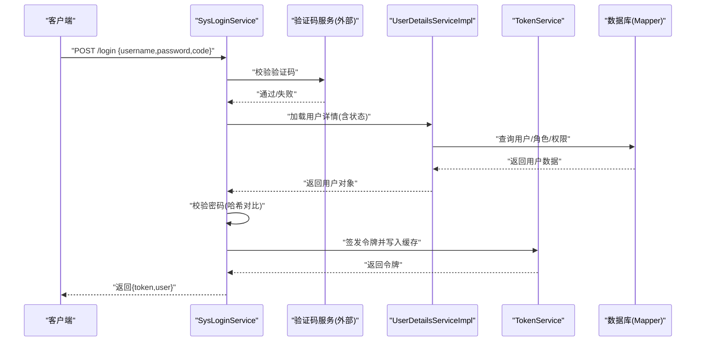
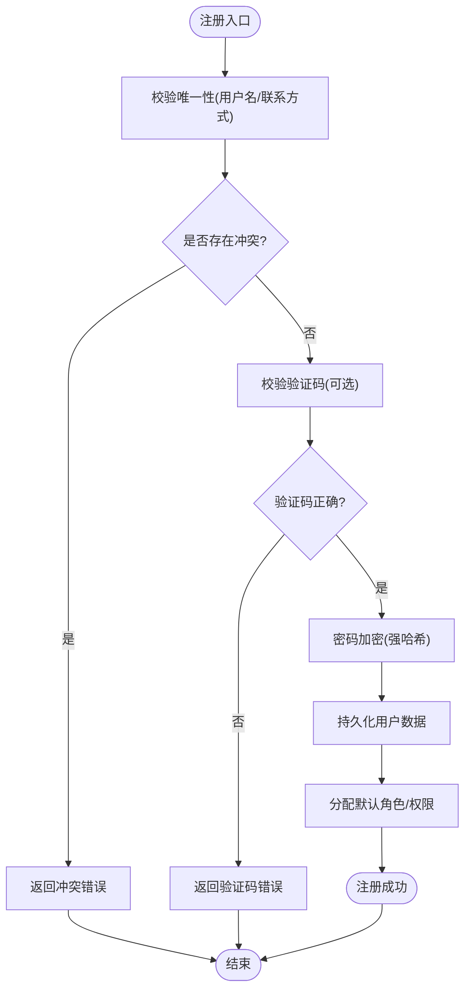
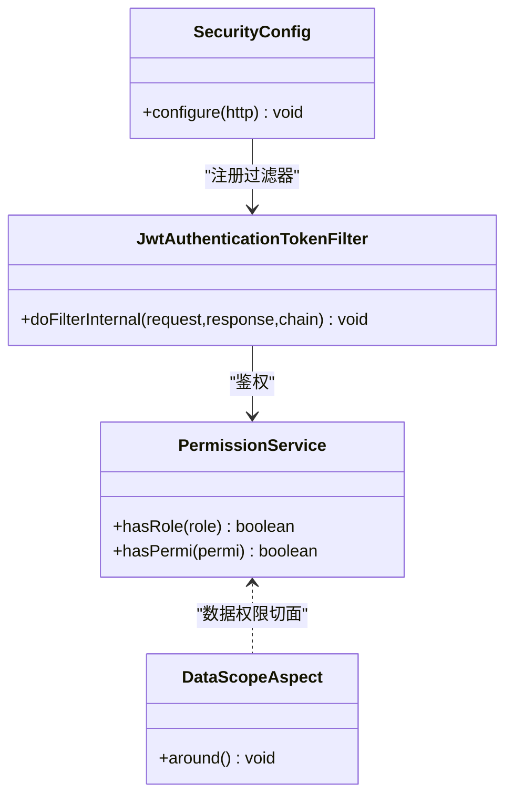
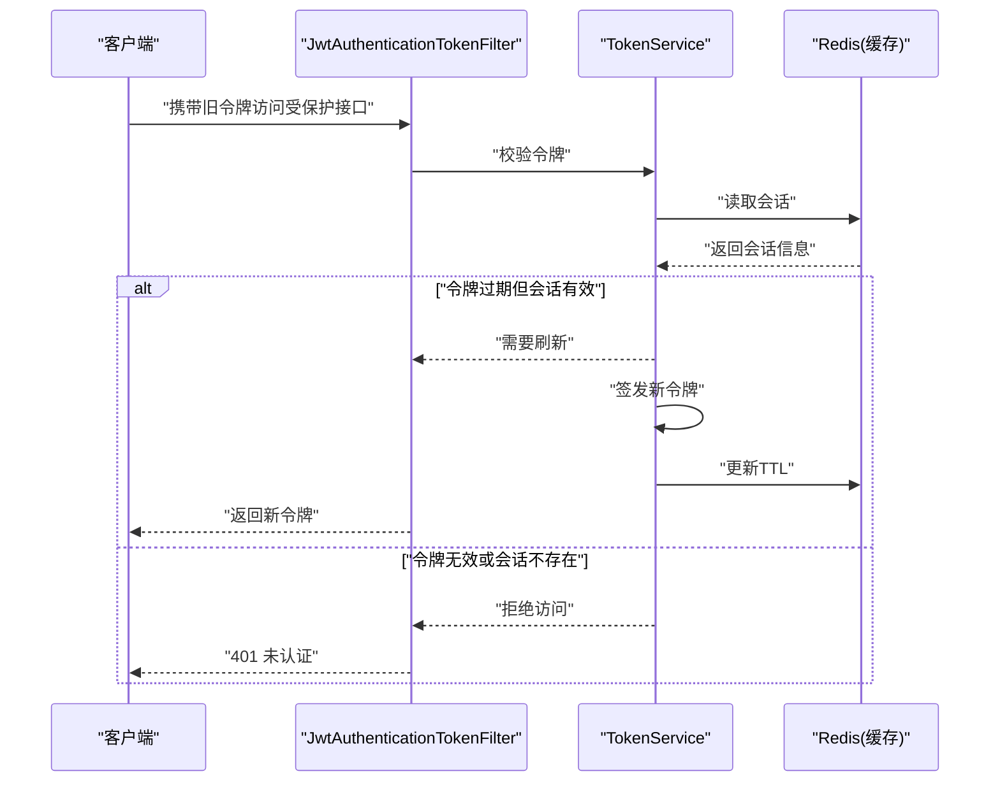
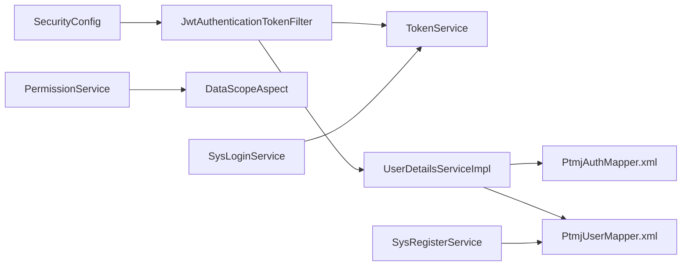

# 认证授权接口

<cite>
**本文引用的文件**   
- [JwtAuthenticationTokenFilter.java](file://PezMax-Backend/ruoyi-framework/src/main/java/com/ruoyi/framework/security/filter/JwtAuthenticationTokenFilter.java)
- [TokenService.java](file://PezMax-Backend/ruoyi-framework/src/main/java/com/ruoyi/framework/web/service/TokenService.java)
- [SysLoginService.java](file://PezMax-Backend/ruoyi-framework/src/main/java/com/ruoyi/framework/web/service/SysLoginService.java)
- [SysRegisterService.java](file://PezMax-Backend/ruoyi-framework/src/main/java/com/ruoyi/framework/web/service/SysRegisterService.java)
- [SecurityConfig.java](file://PezMax-Backend/ruoyi-framework/src/main/java/com/ruoyi/framework/config/SecurityConfig.java)
- [UserDetailsServiceImpl.java](file://PezMax-Backend/ruoyi-framework/src/main/java/com/ruoyi/framework/web/service/UserDetailsServiceImpl.java)
- [PermissionService.java](file://PezMax-Backend/ruoyi-framework/src/main/java/com/ruoyi/framework/web/service/PermissionService.java)
- [DataScopeAspect.java](file://PezMax-Backend/ruoyi-framework/src/main/java/com/ruoyi/framework/aspectj/DataScopeAspect.java)
- [RepeatSubmitInterceptor.java](file://PezMax-Backend/ruoyi-framework/src/main/java/com/ruoyi/framework/interceptor/RepeatSubmitInterceptor.java)
- [SameUrlDataInterceptor.java](file://PezMax-Backend/ruoyi-framework/src/main/java/com/ruoyi/framework/interceptor/impl/SameUrlDataInterceptor.java)
- [GlobalExceptionHandler.java](file://PezMax-Backend/ruoyi-framework/src/main/java/com/ruoyi/framework/web/exception/GlobalExceptionHandler.java)
- [CaptchaException.java](file://PezMax-Backend/ruoyi-common/src/main/java/com/ruoyi/common/exception/user/CaptchaException.java)
- [CaptchaExpireException.java](file://PezMax-Backend/ruoyi-common/src/main/java/com/ruoyi/common/exception/user/CaptchaExpireException.java)
- [UserPasswordNotMatchException.java](file://PezMax-Backend/ruoyi-common/src/main/java/com/ruoyi/common/exception/user/UserPasswordNotMatchException.java)
- [BlackListException.java](file://PezMax-Backend/ruoyi-common/src/main/java/com/ruoyi/common/exception/user/BlackListException.java)
- [CacheConstants.java](file://PezMax-Backend/ruoyi-common/src/main/java/com/ruoyi/common/constant/CacheConstants.java)
- [HttpStatus.java](file://PezMax-Backend/ruoyi-common/src/main/java/com/ruoyi/common/constant/HttpStatus.java)
- [R.java](file://PezMax-Backend/ruoyi-common/src/main/java/com/ruoyi/common/core/domain/R.java)
- [AjaxResult.java](file://PezMax-Backend/ruoyi-common/src/main/java/com/ruoyi/common/core/domain/AjaxResult.java)
- [PtmjAuthMapper.xml](file://PezMax-Backend/ptmj-datum/src/main/resources/mapper/datum/PtmjAuthMapper.xml)
- [PtmjUserMapper.xml](file://PezMax-Backend/ptmj-datum/src/main/resources/mapper/datum/PtmjUserMapper.xml)
</cite>

## 目录
1. [简介](#简介)
2. [项目结构](#项目结构)
3. [核心组件](#核心组件)
4. [架构总览](#架构总览)
5. [详细组件分析](#详细组件分析)
6. [依赖关系分析](#依赖关系分析)
7. [性能考虑](#性能考虑)
8. [故障排查指南](#故障排查指南)
9. [结论](#结论)
10. [附录](#附录)

## 简介
本文件面向后端与前端开发者，系统化说明本项目中的认证与授权机制，重点覆盖：
- JWT 令牌认证机制：令牌的生成、校验、刷新与登出流程
- 用户登录与注册接口：密码加密存储、验证码校验、用户状态管理
- 权限控制：角色权限检查、数据权限过滤、接口访问控制
- 安全最佳实践：令牌安全、会话管理、防重放攻击等
- 调用示例与错误处理方案

## 项目结构
认证授权相关能力主要分布在以下模块：
- ruoyi-framework：安全配置、过滤器、服务层（登录、注册、令牌、权限）
- ruoyi-common：通用常量、异常、响应体封装
- ptmj-datum：业务域的数据映射（如认证相关的 SQL）

图表来源
- [SecurityConfig.java](file://PezMax-Backend/ruoyi-framework/src/main/java/com/ruoyi/framework/config/SecurityConfig.java)
- [JwtAuthenticationTokenTokenFilter.java](file://PezMax-Backend/ruoyi-framework/src/main/java/com/ruoyi/framework/security/filter/JwtAuthenticationTokenFilter.java)
- [TokenService.java](file://PezMax-Backend/ruoyi-framework/src/main/java/com/ruoyi/framework/web/service/TokenService.java)
- [UserDetailsServiceImpl.java](file://PezMax-Backend/ruoyi-framework/src/main/java/com/ruoyi/framework/web/service/UserDetailsServiceImpl.java)
- [PermissionService.java](file://PezMax-Backend/ruoyi-framework/src/main/java/com/ruoyi/framework/web/service/PermissionService.java)
- [DataScopeAspect.java](file://PezMax-Backend/ruoyi-framework/src/main/java/com/ruoyi/framework/aspectj/DataScopeAspect.java)
- [RepeatSubmitInterceptor.java](file://PezMax-Backend/ruoyi-framework/src/main/java/com/ruoyi/framework/interceptor/RepeatSubmitInterceptor.java)
- [SameUrlDataInterceptor.java](file://PezMax-Backend/ruoyi-framework/src/main/java/com/ruoyi/framework/interceptor/impl/SameUrlDataInterceptor.java)
- [GlobalExceptionHandler.java](file://PezMax-Backend/ruoyi-framework/src/main/java/com/ruoyi/framework/web/exception/GlobalExceptionHandler.java)
- [CacheConstants.java](file://PezMax-Backend/ruoyi-common/src/main/java/com/ruoyi/common/constant/CacheConstants.java)
- [HttpStatus.java](file://PezMax-Backend/ruoyi-common/src/main/java/com/ruoyi/common/constant/HttpStatus.java)
- [R.java](file://PezMax-Backend/ruoyi-common/src/main/java/com/ruoyi/common/core/domain/R.java)
- [AjaxResult.java](file://PezMax-Backend/ruoyi-common/src/main/java/com/ruoyi/common/core/domain/AjaxResult.java)
- [PtmjAuthMapper.xml](file://PezMax-Backend/ptmj-datum/src/main/resources/mapper/datum/PtmjAuthMapper.xml)
- [PtmjUserMapper.xml](file://PezMax-Backend/ptmj-datum/src/main/resources/mapper/datum/PtmjUserMapper.xml)

章节来源
- [SecurityConfig.java](file://PezMax-Backend/ruoyi-framework/src/main/java/com/ruoyi/framework/config/SecurityConfig.java)
- [JwtAuthenticationTokenFilter.java](file://PezMax-Backend/ruoyi-framework/src/main/java/com/ruoyi/framework/security/filter/JwtAuthenticationTokenFilter.java)
- [TokenService.java](file://PezMax-Backend/ruoyi-framework/src/main/java/com/ruoyi/framework/web/service/TokenService.java)
- [UserDetailsServiceImpl.java](file://PezMax-Backend/ruoyi-framework/src/main/java/com/ruoyi/framework/web/service/UserDetailsServiceImpl.java)
- [PermissionService.java](file://PezMax-Backend/ruoyi-framework/src/main/java/com/ruoyi/framework/web/service/PermissionService.java)
- [DataScopeAspect.java](file://PezMax-Backend/ruoyi-framework/src/main/java/com/ruoyi/framework/aspectj/DataScopeAspect.java)
- [RepeatSubmitInterceptor.java](file://PezMax-Backend/ruoyi-framework/src/main/java/com/ruoyi/framework/interceptor/RepeatSubmitInterceptor.java)
- [SameUrlDataInterceptor.java](file://PezMax-Backend/ruoyi-framework/src/main/java/com/ruoyi/framework/interceptor/impl/SameUrlDataInterceptor.java)
- [GlobalExceptionHandler.java](file://PezMax-Backend/ruoyi-framework/src/main/java/com/ruoyi/framework/web/exception/GlobalExceptionHandler.java)
- [CacheConstants.java](file://PezMax-Backend/ruoyi-common/src/main/java/com/ruoyi/common/constant/CacheConstants.java)
- [HttpStatus.java](file://PezMax-Backend/ruoyi-common/src/main/java/com/ruoyi/common/constant/HttpStatus.java)
- [R.java](file://PezMax-Backend/ruoyi-common/src/main/java/com/ruoyi/common/core/domain/R.java)
- [AjaxResult.java](file://PezMax-Backend/ruoyi-common/src/main/java/com/ruoyi/common/core/domain/AjaxResult.java)
- [PtmjAuthMapper.xml](file://PezMax-Backend/ptmj-datum/src/main/resources/mapper/datum/PtmjAuthMapper.xml)
- [PtmjUserMapper.xml](file://PezMax-Backend/ptmj-datum/src/main/resources/mapper/datum/PtmjUserMapper.xml)

## 核心组件
- 安全配置与安全过滤器
  - SecurityConfig：定义白名单、鉴权规则、跨域、异常处理入口等
  - JwtAuthenticationTokenFilter：从请求头解析并验证 JWT，构建认证上下文
- 令牌服务
  - TokenService：负责令牌签发、校验、续期、删除（登出）、Redis 中会话维护
- 用户与权限
  - UserDetailsServiceImpl：根据用户名加载用户、角色、权限集合
  - PermissionService：提供 hasRole、hasPermi 等权限判断方法
  - DataScopeAspect：基于注解实现数据权限范围过滤
- 登录与注册
  - SysLoginService：登录流程（验证码校验、密码校验、签发令牌、记录登录日志）
  - SysRegisterService：注册流程（唯一性校验、密码加密、初始化用户信息）
- 拦截器与异常
  - RepeatSubmitInterceptor / SameUrlDataInterceptor：防止重复提交与幂等控制
  - GlobalExceptionHandler：统一异常转响应，返回标准错误码与消息
- 通用常量与响应
  - CacheConstants：缓存键前缀、过期时间等
  - HttpStatus：HTTP 状态码
  - R / AjaxResult：统一响应结构

章节来源
- [SecurityConfig.java](file://PezMax-Backend/ruoyi-framework/src/main/java/com/ruoyi/framework/config/SecurityConfig.java)
- [JwtAuthenticationTokenFilter.java](file://PezMax-Backend/ruoyi-framework/src/main/java/com/ruoyi/framework/security/filter/JwtAuthenticationTokenFilter.java)
- [TokenService.java](file://PezMax-Backend/ruoyi-framework/src/main/java/com/ruoyi/framework/web/service/TokenService.java)
- [UserDetailsServiceImpl.java](file://PezMax-Backend/ruoyi-framework/src/main/java/com/ruoyi/framework/web/service/UserDetailsServiceImpl.java)
- [PermissionService.java](file://PezMax-Backend/ruoyi-framework/src/main/java/com/ruoyi/framework/web/service/PermissionService.java)
- [DataScopeAspect.java](file://PezMax-Backend/ruoyi-framework/src/main/java/com/ruoyi/framework/aspectj/DataScopeAspect.java)
- [SysLoginService.java](file://PezMax-Backend/ruoyi-framework/src/main/java/com/ruoyi/framework/web/service/SysLoginService.java)
- [SysRegisterService.java](file://PezMax-Backend/ruoyi-framework/src/main/java/com/ruoyi/framework/web/service/SysRegisterService.java)
- [RepeatSubmitInterceptor.java](file://PezMax-Backend/ruoyi-framework/src/main/java/com/ruoyi/framework/interceptor/RepeatSubmitInterceptor.java)
- [SameUrlDataInterceptor.java](file://PezMax-Backend/ruoyi-framework/src/main/java/com/ruoyi/framework/interceptor/impl/SameUrlDataInterceptor.java)
- [GlobalExceptionHandler.java](file://PezMax-Backend/ruoyi-framework/src/main/java/com/ruoyi/framework/web/exception/GlobalExceptionHandler.java)
- [CacheConstants.java](file://PezMax-Backend/ruoyi-common/src/main/java/com/ruoyi/common/constant/CacheConstants.java)
- [HttpStatus.java](file://PezMax-Backend/ruoyi-common/src/main/java/com/ruoyi/common/constant/HttpStatus.java)
- [R.java](file://PezMax-Backend/ruoyi-common/src/main/java/com/ruoyi/common/core/domain/R.java)
- [AjaxResult.java](file://PezMax-Backend/ruoyi-common/src/main/java/com/ruoyi/common/core/domain/AjaxResult.java)

## 架构总览
下图展示了典型请求在认证与授权链路中的流转过程。

图表来源
- [SecurityConfig.java](file://PezMax-Backend/ruoyi-framework/src/main/java/com/ruoyi/framework/config/SecurityConfig.java)
- [JwtAuthenticationTokenFilter.java](file://PezMax-Backend/ruoyi-framework/src/main/java/com/ruoyi/framework/security/filter/JwtAuthenticationTokenFilter.java)
- [TokenService.java](file://PezMax-Backend/ruoyi-framework/src/main/java/com/ruoyi/framework/web/service/TokenService.java)
- [UserDetailsServiceImpl.java](file://PezMax-Backend/ruoyi-framework/src/main/java/com/ruoyi/framework/web/service/UserDetailsServiceImpl.java)
- [PermissionService.java](file://PezMax-Backend/ruoyi-framework/src/main/java/com/ruoyi/framework/web/service/PermissionService.java)
- [DataScopeAspect.java](file://PezMax-Backend/ruoyi-framework/src/main/java/com/ruoyi/framework/aspectj/DataScopeAspect.java)

## 详细组件分析

### JWT 令牌认证机制
- 令牌生成
  - 登录成功后由登录服务调用令牌服务签发令牌，并将用户会话写入缓存（含过期时间）
- 令牌校验
  - 每次请求经安全过滤器时，从请求头提取令牌，交由令牌服务进行签名、时效与存在性校验
- 令牌刷新
  - 若令牌即将过期或已过期但会话仍在缓存中，可触发刷新逻辑，更新缓存 TTL 并返回新令牌
- 令牌登出
  - 登出接口删除缓存中的会话，使旧令牌失效；同时可清理本地存储的令牌

图表来源
- [JwtAuthenticationTokenFilter.java](file://PezMax-Backend/ruoyi-framework/src/main/java/com/ruoyi/framework/security/filter/JwtAuthenticationTokenFilter.java)
- [TokenService.java](file://PezMax-Backend/ruoyi-framework/src/main/java/com/ruoyi/framework/web/service/TokenService.java)
- [CacheConstants.java](file://PezMax-Backend/ruoyi-common/src/main/java/com/ruoyi/common/constant/CacheConstants.java)

章节来源
- [JwtAuthenticationTokenFilter.java](file://PezMax-Backend/ruoyi-framework/src/main/java/com/ruoyi/framework/security/filter/JwtAuthenticationTokenFilter.java)
- [TokenService.java](file://PezMax-Backend/ruoyi-framework/src/main/java/com/ruoyi/framework/web/service/TokenService.java)
- [CacheConstants.java](file://PezMax-Backend/ruoyi-common/src/main/java/com/ruoyi/common/constant/CacheConstants.java)

### 用户登录接口
- 输入参数
  - 用户名、密码、验证码（可选，取决于开关）
- 处理流程
  - 校验验证码（若开启）
  - 校验用户存在性与状态
  - 校验密码（使用安全哈希算法）
  - 签发令牌并写入缓存
  - 记录登录日志
- 输出
  - 成功：返回令牌及必要用户信息
  - 失败：返回具体错误码与消息（如验证码错误、密码不匹配、账号锁定等）

图表来源
- [SysLoginService.java](file://PezMax-Backend/ruoyi-framework/src/main/java/com/ruoyi/framework/web/service/SysLoginService.java)
- [UserDetailsServiceImpl.java](file://PezMax-Backend/ruoyi-framework/src/main/java/com/ruoyi/framework/web/service/UserDetailsServiceImpl.java)
- [TokenService.java](file://PezMax-Backend/ruoyi-framework/src/main/java/com/ruoyi/framework/web/service/TokenService.java)
- [PtmjAuthMapper.xml](file://PezMax-Backend/ptmj-datum/src/main/resources/mapper/datum/PtmjAuthMapper.xml)
- [PtmjUserMapper.xml](file://PezMax-Backend/ptmj-datum/src/main/resources/mapper/datum/PtmjUserMapper.xml)

章节来源
- [SysLoginService.java](file://PezMax-Backend/ruoyi-framework/src/main/java/com/ruoyi/framework/web/service/SysLoginService.java)
- [UserDetailsServiceImpl.java](file://PezMax-Backend/ruoyi-framework/src/main/java/com/ruoyi/framework/web/service/UserDetailsServiceImpl.java)
- [TokenService.java](file://PezMax-Backend/ruoyi-framework/src/main/java/com/ruoyi/framework/web/service/TokenService.java)
- [PtmjAuthMapper.xml](file://PezMax-Backend/ptmj-datum/src/main/resources/mapper/datum/PtmjAuthMapper.xml)
- [PtmjUserMapper.xml](file://PezMax-Backend/ptmj-datum/src/main/resources/mapper/datum/PtmjUserMapper.xml)

### 用户注册接口
- 输入参数
  - 用户名、密码、邮箱/手机号（视需求）、验证码（可选）
- 处理流程
  - 校验唯一性（用户名/邮箱/手机）
  - 校验验证码（若开启）
  - 密码加密存储（使用强哈希算法）
  - 创建用户并赋予默认角色/权限
- 输出
  - 成功：返回注册结果
  - 失败：返回具体错误原因（如用户名已存在、验证码错误等）

图表来源
- [SysRegisterService.java](file://PezMax-Backend/ruoyi-framework/src/main/java/com/ruoyi/framework/web/service/SysRegisterService.java)
- [PtmjUserMapper.xml](file://PezMax-Backend/ptmj-datum/src/main/resources/mapper/datum/PtmjUserMapper.xml)

章节来源
- [SysRegisterService.java](file://PezMax-Backend/ruoyi-framework/src/main/java/com/ruoyi/framework/web/service/SysRegisterService.java)
- [PtmjUserMapper.xml](file://PezMax-Backend/ptmj-datum/src/main/resources/mapper/datum/PtmjUserMapper.xml)

### 权限控制接口
- 角色权限检查
  - 通过权限服务判断当前用户是否具备指定角色或资源权限
- 数据权限过滤
  - 基于数据权限切面，自动为查询注入部门/组织范围条件
- 接口访问控制
  - 通过安全配置定义白名单与受保护路径，结合注解控制访问级别

图表来源
- [PermissionService.java](file://PezMax-Backend/ruoyi-framework/src/main/java/com/ruoyi/framework/web/service/PermissionService.java)
- [DataScopeAspect.java](file://PezMax-Backend/ruoyi-framework/src/main/java/com/ruoyi/framework/aspectj/DataScopeAspect.java)
- [SecurityConfig.java](file://PezMax-Backend/ruoyi-framework/src/main/java/com/ruoyi/framework/config/SecurityConfig.java)
- [JwtAuthenticationTokenFilter.java](file://PezMax-Backend/ruoyi-framework/src/main/java/com/ruoyi/framework/security/filter/JwtAuthenticationTokenFilter.java)

章节来源
- [PermissionService.java](file://PezMax-Backend/ruoyi-framework/src/main/java/com/ruoyi/framework/web/service/PermissionService.java)
- [DataScopeAspect.java](file://PezMax-Backend/ruoyi-framework/src/main/java/com/ruoyi/framework/aspectj/DataScopeAspect.java)
- [SecurityConfig.java](file://PezMax-Backend/ruoyi-framework/src/main/java/com/ruoyi/framework/config/SecurityConfig.java)
- [JwtAuthenticationTokenFilter.java](file://PezMax-Backend/ruoyi-framework/src/main/java/com/ruoyi/framework/security/filter/JwtAuthenticationTokenFilter.java)

### 令牌刷新与登出流程
- 刷新
  - 当检测到令牌即将过期或已过期但会话仍有效时，重新签发令牌并更新缓存 TTL
- 登出
  - 删除缓存中的会话，使令牌立即失效；客户端应清除本地令牌

图表来源
- [JwtAuthenticationTokenFilter.java](file://PezMax-Backend/ruoyi-framework/src/main/java/com/ruoyi/framework/security/filter/JwtAuthenticationTokenFilter.java)
- [TokenService.java](file://PezMax-Backend/ruoyi-framework/src/main/java/com/ruoyi/framework/web/service/TokenService.java)
- [CacheConstants.java](file://PezMax-Backend/ruoyi-common/src/main/java/com/ruoyi/common/constant/CacheConstants.java)

章节来源
- [JwtAuthenticationTokenFilter.java](file://PezMax-Backend/ruoyi-framework/src/main/java/com/ruoyi/framework/security/filter/JwtAuthenticationTokenFilter.java)
- [TokenService.java](file://PezMax-Backend/ruoyi-framework/src/main/java/com/ruoyi/framework/web/service/TokenService.java)
- [CacheConstants.java](file://PezMax-Backend/ruoyi-common/src/main/java/com/ruoyi/common/constant/CacheConstants.java)

### 安全最佳实践
- 令牌安全
  - 使用强随机密钥与合理过期策略；服务端侧校验签名与有效期
  - 将敏感字段最小化放入令牌载荷
- 会话管理
  - 使用 Redis 集中管理会话，支持单点登录与强制下线
  - 设置合理的 TTL 与滑动续期策略
- 防重放攻击
  - 对关键写操作启用重复提交拦截器与同 URL 幂等拦截器
  - 必要时引入请求签名与时间戳校验
- 密码安全
  - 使用强哈希算法（如 BCrypt）存储密码，禁止明文
- 访问控制
  - 明确白名单与受保护路径；细粒度到资源级权限
  - 数据权限通过切面自动注入，避免遗漏

章节来源
- [RepeatSubmitInterceptor.java](file://PezMax-Backend/ruoyi-framework/src/main/java/com/ruoyi/framework/interceptor/RepeatSubmitInterceptor.java)
- [SameUrlDataInterceptor.java](file://PezMax-Backend/ruoyi-framework/src/main/java/com/ruoyi/framework/interceptor/impl/SameUrlDataInterceptor.java)
- [SecurityConfig.java](file://PezMax-Backend/ruoyi-framework/src/main/java/com/ruoyi/framework/config/SecurityConfig.java)
- [TokenService.java](file://PezMax-Backend/ruoyi-framework/src/main/java/com/ruoyi/framework/web/service/TokenService.java)
- [CacheConstants.java](file://PezMax-Backend/ruoyi-common/src/main/java/com/ruoyi/common/constant/CacheConstants.java)

## 依赖关系分析
- 组件耦合
  - 安全过滤器依赖令牌服务与用户详情服务
  - 权限服务与数据权限切面配合完成资源与数据范围控制
  - 登录/注册服务依赖用户详情服务与 Mapper 层
- 外部依赖
  - Redis 用于会话与验证码缓存
  - 数据库用于用户、角色、权限与审计日志

图表来源
- [JwtAuthenticationTokenFilter.java](file://PezMax-Backend/ruoyi-framework/src/main/java/com/ruoyi/framework/security/filter/JwtAuthenticationTokenFilter.java)
- [TokenService.java](file://PezMax-Backend/ruoyi-framework/src/main/java/com/ruoyi/framework/web/service/TokenService.java)
- [UserDetailsServiceImpl.java](file://PezMax-Backend/ruoyi-framework/src/main/java/com/ruoyi/framework/web/service/UserDetailsServiceImpl.java)
- [PermissionService.java](file://PezMax-Backend/ruoyi-framework/src/main/java/com/ruoyi/framework/web/service/PermissionService.java)
- [DataScopeAspect.java](file://PezMax-Backend/ruoyi-framework/src/main/java/com/ruoyi/framework/aspectj/DataScopeAspect.java)
- [SecurityConfig.java](file://PezMax-Backend/ruoyi-framework/src/main/java/com/ruoyi/framework/config/SecurityConfig.java)
- [SysLoginService.java](file://PezMax-Backend/ruoyi-framework/src/main/java/com/ruoyi/framework/web/service/SysLoginService.java)
- [SysRegisterService.java](file://PezMax-Backend/ruoyi-framework/src/main/java/com/ruoyi/framework/web/service/SysRegisterService.java)
- [PtmjAuthMapper.xml](file://PezMax-Backend/ptmj-datum/src/main/resources/mapper/datum/PtmjAuthMapper.xml)
- [PtmjUserMapper.xml](file://PezMax-Backend/ptmj-datum/src/main/resources/mapper/datum/PtmjUserMapper.xml)

章节来源
- [JwtAuthenticationTokenFilter.java](file://PezMax-Backend/ruoyi-framework/src/main/java/com/ruoyi/framework/security/filter/JwtAuthenticationTokenFilter.java)
- [TokenService.java](file://PezMax-Backend/ruoyi-framework/src/main/java/com/ruoyi/framework/web/service/TokenService.java)
- [UserDetailsServiceImpl.java](file://PezMax-Backend/ruoyi-framework/src/main/java/com/ruoyi/framework/web/service/UserDetailsServiceImpl.java)
- [PermissionService.java](file://PezMax-Backend/ruoyi-framework/src/main/java/com/ruoyi/framework/web/service/PermissionService.java)
- [DataScopeAspect.java](file://PezMax-Backend/ruoyi-framework/src/main/java/com/ruoyi/framework/aspectj/DataScopeAspect.java)
- [SecurityConfig.java](file://PezMax-Backend/ruoyi-framework/src/main/java/com/ruoyi/framework/config/SecurityConfig.java)
- [SysLoginService.java](file://PezMax-Backend/ruoyi-framework/src/main/java/com/ruoyi/framework/web/service/SysLoginService.java)
- [SysRegisterService.java](file://PezMax-Backend/ruoyi-framework/src/main/java/com/ruoyi/framework/web/service/SysRegisterService.java)
- [PtmjAuthMapper.xml](file://PezMax-Backend/ptmj-datum/src/main/resources/mapper/datum/PtmjAuthMapper.xml)
- [PtmjUserMapper.xml](file://PezMax-Backend/ptmj-datum/src/main/resources/mapper/datum/PtmjUserMapper.xml)

## 性能考虑
- 令牌校验尽量无状态，减少数据库访问；用户详情与权限建议缓存
- 使用 Redis 管理会话，注意 TTL 与批量清理策略
- 数据权限切面应避免复杂 SQL，合理使用索引与分页
- 验证码与限流相关缓存键需合理命名与过期时间，避免热点键

[本节为通用指导，无需源码引用]

## 故障排查指南
- 常见错误类型
  - 验证码错误/过期：返回验证码相关异常
  - 密码不匹配：返回密码校验异常
  - 账号被拉黑：返回黑名单异常
  - 未认证/未授权：返回 HTTP 401/403
- 统一异常处理
  - 全局异常处理器捕获业务异常与系统异常，转换为统一响应格式
- 定位步骤
  - 检查请求头是否携带正确的令牌
  - 查看 Redis 中会话是否存在且未过期
  - 核对用户状态与角色/权限配置
  - 关注全局异常处理器的日志输出

章节来源
- [CaptchaException.java](file://PezMax-Backend/ruoyi-common/src/main/java/com/ruoyi/common/exception/user/CaptchaException.java)
- [CaptchaExpireException.java](file://PezMax-Backend/ruoyi-common/src/main/java/com/ruoyi/common/exception/user/CaptchaExpireException.java)
- [UserPasswordNotMatchException.java](file://PezMax-Backend/ruoyi-common/src/main/java/com/ruoyi/common/exception/user/UserPasswordNotMatchException.java)
- [BlackListException.java](file://PezMax-Backend/ruoyi-common/src/main/java/com/ruoyi/common/exception/user/BlackListException.java)
- [GlobalExceptionHandler.java](file://PezMax-Backend/ruoyi-framework/src/main/java/com/ruoyi/framework/web/exception/GlobalExceptionHandler.java)
- [HttpStatus.java](file://PezMax-Backend/ruoyi-common/src/main/java/com/ruoyi/common/constant/HttpStatus.java)
- [R.java](file://PezMax-Backend/ruoyi-common/src/main/java/com/ruoyi/common/core/domain/R.java)
- [AjaxResult.java](file://PezMax-Backend/ruoyi-common/src/main/java/com/ruoyi/common/core/domain/AjaxResult.java)

## 结论
本项目采用“过滤器+令牌服务+权限服务+数据权限切面”的分层设计，实现了完整的认证与授权闭环。通过统一的异常处理与拦截器，提升了安全性与健壮性。建议在后续迭代中持续优化令牌刷新策略、权限缓存与数据权限 SQL 性能，并结合监控与审计完善可观测性。

[本节为总结，无需源码引用]

## 附录
- 统一响应体
  - R / AjaxResult：包含状态码、消息与数据字段
- 常用常量
  - CacheConstants：缓存键前缀与过期时间
  - HttpStatus：HTTP 状态码参考

章节来源
- [R.java](file://PezMax-Backend/ruoyi-common/src/main/java/com/ruoyi/common/core/domain/R.java)
- [AjaxResult.java](file://PezMax-Backend/ruoyi-common/src/main/java/com/ruoyi/common/core/domain/AjaxResult.java)
- [CacheConstants.java](file://PezMax-Backend/ruoyi-common/src/main/java/com/ruoyi/common/constant/CacheConstants.java)
- [HttpStatus.java](file://PezMax-Backend/ruoyi-common/src/main/java/com/ruoyi/common/constant/HttpStatus.java)