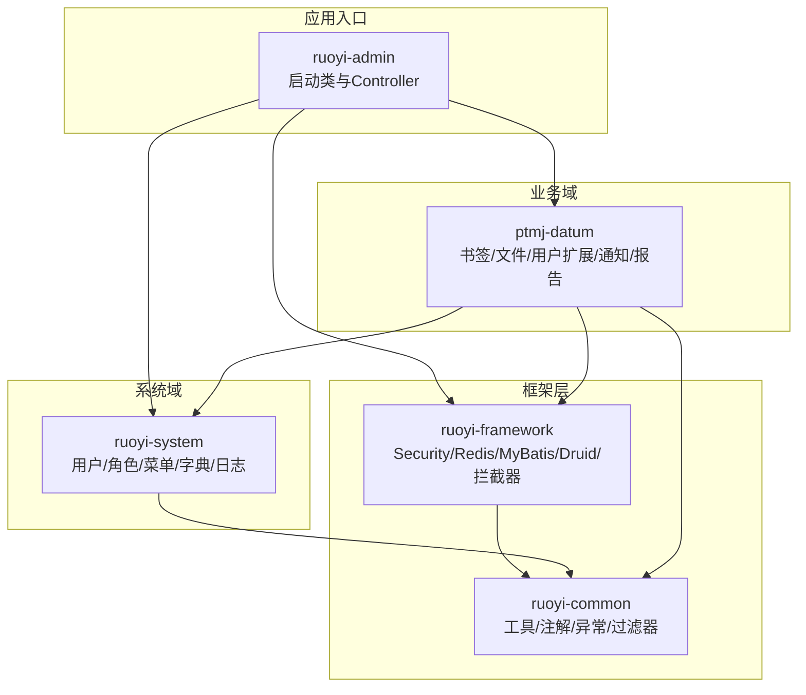
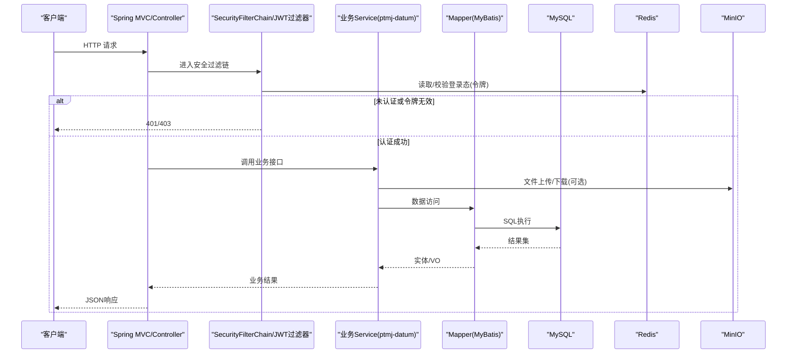
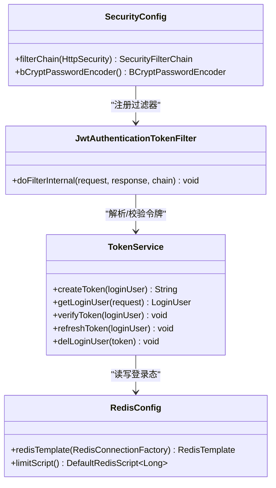
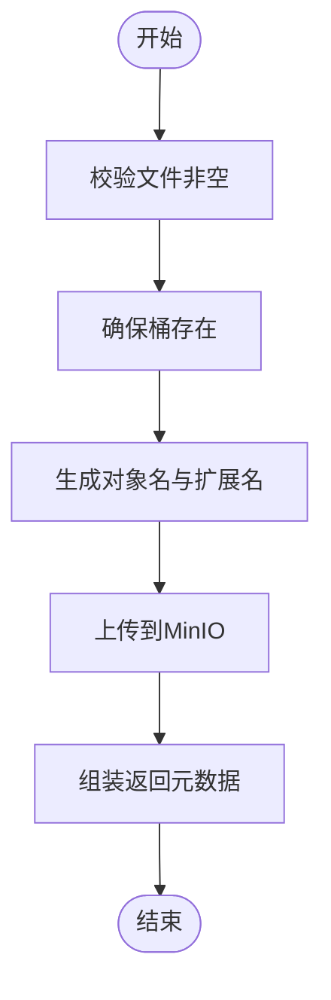
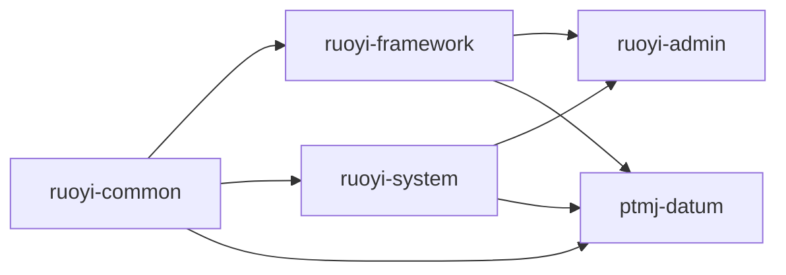

# 后端开发指南

<cite>
**本文引用的文件**   
- [README.md](file://PezMax-Backend/README.md)
- [pom.xml](file://PezMax-Backend/pom.xml)
- [RuoYiApplication.java](file://PezMax-Backend/ruoyi-admin/src/main/java/com/ruoyi/RuoYiApplication.java)
- [ptmj-datum/pom.xml](file://PezMax-Backend/ptmj-datum/pom.xml)
- [ruoyi-common/pom.xml](file://PezMax-Backend/ruoyi-common/pom.xml)
- [ruoyi-framework/pom.xml](file://PezMax-Backend/ruoyi-framework/pom.xml)
- [ruoyi-system/pom.xml](file://PezMax-Backend/ruoyi-system/pom.xml)
- [SecurityConfig.java](file://PezMax-Backend/ruoyi-framework/src/main/java/com/ruoyi/framework/config/SecurityConfig.java)
- [TokenService.java](file://PezMax-Backend/ruoyi-framework/src/main/java/com/ruoyi/framework/web/service/TokenService.java)
- [RedisConfig.java](file://PezMax-Backend/ruoyi-framework/src/main/java/com/ruoyi/framework/config/RedisConfig.java)
- [MinioStorageService.java](file://PezMax-Backend/ruoyi-common/src/main/java/com/ruoyi/common/utils/file/MinioStorageService.java)
</cite>

## 目录
1. [简介](#简介)
2. [项目结构](#项目结构)
3. [核心组件](#核心组件)
4. [架构总览](#架构总览)
5. [详细组件分析](#详细组件分析)
6. [依赖关系分析](#依赖关系分析)
7. [性能考虑](#性能考虑)
8. [故障排查指南](#故障排查指南)
9. [结论](#结论)
10. [附录](#附录)

## 简介
本指南面向基于 Spring Boot 4.0.3 的后端团队，围绕多模块 Maven 工程与分层架构，系统阐述各模块职责、安全认证体系、权限控制机制、文件管理方案以及开发与排障最佳实践。项目以 RuoYi-Vue 为底座进行深度定制，提供书签、文件、用户、通知、统计等核心业务能力，并通过 MinIO 实现对象存储，结合 Redis 完成缓存与令牌管理。

## 项目结构
整体采用多模块组织：
- ruoyi-common：通用工具、注解、异常、配置、过滤器、序列化、文件与签名工具等
- ruoyi-framework：框架级配置（Web、AOP、Druid、Captcha、MyBatis、Redis、Security、拦截器、全局异常等）
- ruoyi-system：系统基础管理（用户、角色、菜单、字典、日志等）
- ptmj-datum：核心业务领域（书签、文件、用户扩展、通知、报告、安全相关等）
- ruoyi-admin：应用启动入口与控制器层
- ruoyi-quartz：定时任务
- ruoyi-generator：代码生成

图表来源
- [pom.xml:177-185](file://PezMax-Backend/pom.xml#L177-L185)
- [RuoYiApplication.java:13-15](file://PezMax-Backend/ruoyi-admin/src/main/java/com/ruoyi/RuoYiApplication.java#L13-L15)

章节来源
- [README.md:13-22](file://PezMax-Backend/README.md#L13-L22)
- [pom.xml:177-185](file://PezMax-Backend/pom.xml#L177-L185)

## 核心组件
- 启动与扫描
  - 应用主类排除默认数据源自动装配，并扩大包扫描范围至业务域 com.ptmj，确保业务模块可被正确发现。
- 安全与认证
  - 基于 Spring Security + JWT + Redis 的无状态认证；支持匿名访问白名单、方法级授权注解。
- 令牌服务
  - TokenService 负责令牌签发、解析、刷新与过期续期，登录态信息落盘 Redis。
- 缓存与限流
  - RedisTemplate 统一序列化策略；内置 Lua 脚本用于分布式限流。
- 文件存储
  - MinIO 客户端封装，提供桶存在性检查与上传返回元数据。

章节来源
- [RuoYiApplication.java:13-15](file://PezMax-Backend/ruoyi-admin/src/main/java/com/ruoyi/RuoYiApplication.java#L13-L15)
- [SecurityConfig.java:27-131](file://PezMax-Backend/ruoyi-framework/src/main/java/com/ruoyi/framework/config/SecurityConfig.java#L27-L131)
- [TokenService.java:31-233](file://PezMax-Backend/ruoyi-framework/src/main/java/com/ruoyi/framework/web/service/TokenService.java#L31-L233)
- [RedisConfig.java:17-71](file://PezMax-Backend/ruoyi-framework/src/main/java/com/ruoyi/framework/config/RedisConfig.java#L17-L71)
- [MinioStorageService.java:21-88](file://PezMax-Backend/ruoyi-common/src/main/java/com/ruoyi/common/utils/file/MinioStorageService.java#L21-L88)

## 架构总览
下图展示从请求进入、鉴权、业务处理到持久化的典型链路，以及关键外部依赖（Redis、MinIO）。

图表来源
- [SecurityConfig.java:85-120](file://PezMax-Backend/ruoyi-framework/src/main/java/com/ruoyi/framework/config/SecurityConfig.java#L85-L120)
- [TokenService.java:62-106](file://PezMax-Backend/ruoyi-framework/src/main/java/com/ruoyi/framework/web/service/TokenService.java#L62-L106)
- [MinioStorageService.java:35-77](file://PezMax-Backend/ruoyi-common/src/main/java/com/ruoyi/common/utils/file/MinioStorageService.java#L35-L77)

## 详细组件分析

### 安全与认证体系
- 安全配置要点
  - 禁用 CSRF，使用无状态会话策略
  - 通过 PermitAllUrlProperties 注入匿名访问白名单
  - 注册 JWT 过滤器在 UsernamePasswordAuthenticationFilter 之前
  - 启用方法级安全注解
- 令牌流程
  - 创建令牌时写入用户标识与用户名，并将登录态存入 Redis
  - 每次请求解析令牌并从 Redis 获取完整用户上下文
  - 接近过期时自动续期，避免频繁重新登录

图表来源
- [SecurityConfig.java:85-131](file://PezMax-Backend/ruoyi-framework/src/main/java/com/ruoyi/framework/config/SecurityConfig.java#L85-L131)
- [TokenService.java:114-155](file://PezMax-Backend/ruoyi-framework/src/main/java/com/ruoyi/framework/web/service/TokenService.java#L114-L155)
- [RedisConfig.java:22-41](file://PezMax-Backend/ruoyi-framework/src/main/java/com/ruoyi/framework/config/RedisConfig.java#L22-L41)

章节来源
- [SecurityConfig.java:27-131](file://PezMax-Backend/ruoyi-framework/src/main/java/com/ruoyi/framework/config/SecurityConfig.java#L27-L131)
- [TokenService.java:31-233](file://PezMax-Backend/ruoyi-framework/src/main/java/com/ruoyi/framework/web/service/TokenService.java#L31-L233)
- [RedisConfig.java:17-71](file://PezMax-Backend/ruoyi-framework/src/main/java/com/ruoyi/framework/config/RedisConfig.java#L17-L71)

### 文件管理系统（MinIO）
- 能力概览
  - 自动创建桶（若不存在）
  - 上传文件并返回文件名、URL、大小、格式、对象名
  - 内容类型推断与路径规范化
- 设计建议
  - 大文件建议使用分片上传与断点续传（可在 Service 层编排）
  - 对敏感文件采用私有桶+临时签名链接
  - 结合业务表记录文件元数据与归属关系

图表来源
- [MinioStorageService.java:35-77](file://PezMax-Backend/ruoyi-common/src/main/java/com/ruoyi/common/utils/file/MinioStorageService.java#L35-L77)

章节来源
- [MinioStorageService.java:21-88](file://PezMax-Backend/ruoyi-common/src/main/java/com/ruoyi/common/utils/file/MinioStorageService.java#L21-L88)

### 分层架构与开发规范
- Controller 层
  - 仅做参数校验、路由映射与响应包装；不承载复杂业务逻辑
  - RESTful 风格：资源名词复数、HTTP 动词语义清晰
- Service 层
  - 聚合多个 Mapper 调用，编排事务边界与缓存策略
  - 对外暴露领域用例，保持幂等性与一致性
- Mapper 层
  - 专注 SQL 映射与分页查询；复杂条件拼装在 XML 中维护
- Domain 层
  - 实体模型与数据库表一一对应；DTO/VO 用于接口契约
- 命名与包结构
  - 按“功能域”划分包，如 datum 下的 user、file、bookmark 等子域
  - 统一异常与返回体封装，便于前端一致处理

章节来源
- [ptmj-datum/pom.xml:19-22](file://PezMax-Backend/ptmj-datum/pom.xml#L19-L22)

### 核心业务功能说明
- 书签管理
  - 支持收藏、分类、分享与封面抓取（由上层调度或异步任务触发）
- 文件管理
  - 上传、下载、在线预览；结合 MinIO 与 LibreOffice 转换（文档预览）
- 用户体系
  - 用户等级、积分、个人空间；与系统用户模型解耦扩展
- 互动通知
  - 系统消息、审核结果推送；可结合 WebSocket 或轮询
- 数据统计
  - 热门排行、活跃度统计；借助 Redis 计数与定时汇总

章节来源
- [README.md:23-29](file://PezMax-Backend/README.md#L23-L29)

## 依赖关系分析
Maven 模块依赖方向自下而上：common → framework/system → datum/admin。顶层 pom 统一管理版本与依赖。

图表来源
- [pom.xml:177-185](file://PezMax-Backend/pom.xml#L177-L185)
- [ruoyi-common/pom.xml:1-136](file://PezMax-Backend/ruoyi-common/pom.xml#L1-L136)
- [ruoyi-framework/pom.xml:1-64](file://PezMax-Backend/ruoyi-framework/pom.xml#L1-L64)
- [ruoyi-system/pom.xml:1-28](file://PezMax-Backend/ruoyi-system/pom.xml#L1-L28)
- [ptmj-datum/pom.xml:1-51](file://PezMax-Backend/ptmj-datum/pom.xml#L1-L51)

章节来源
- [pom.xml:1-234](file://PezMax-Backend/pom.xml#L1-L234)

## 性能考虑
- 连接池与SQL
  - 使用 Druid 监控与优化慢查询；合理设置连接池大小与超时
- 缓存与限流
  - 热点数据入 Redis；使用 Lua 脚本实现原子限流，避免竞争
- 令牌续期
  - 近过期自动续期减少重复登录，注意并发场景下的锁与幂等
- 文件上传
  - 大文件分片上传、并行合并；对象存储直传与回调更新元数据
- 序列化
  - 统一 FastJSON2 序列化，减少 GC 压力与网络开销

[本节为通用指导，无需源码引用]

## 故障排查指南
- 认证失败
  - 检查 JWT 过滤器是否生效、白名单配置是否正确、Redis 连通性
- 令牌失效
  - 核对过期时间、续期逻辑与 Redis Key 前缀
- 文件上传失败
  - 确认 MinIO 服务可用、桶策略公开读、Content-Type 正确
- 限流触发
  - 查看 Redis 限流脚本返回值与键过期时间

章节来源
- [SecurityConfig.java:85-120](file://PezMax-Backend/ruoyi-framework/src/main/java/com/ruoyi/framework/config/SecurityConfig.java#L85-L120)
- [TokenService.java:62-106](file://PezMax-Backend/ruoyi-framework/src/main/java/com/ruoyi/framework/web/service/TokenService.java#L62-L106)
- [RedisConfig.java:43-71](file://PezMax-Backend/ruoyi-framework/src/main/java/com/ruoyi/framework/config/RedisConfig.java#L43-L71)
- [MinioStorageService.java:79-86](file://PezMax-Backend/ruoyi-common/src/main/java/com/ruoyi/common/utils/file/MinioStorageService.java#L79-L86)

## 结论
本项目在多模块分层基础上，构建了以 Spring Security + JWT + Redis 为核心的安全体系，并以 MinIO 作为对象存储支撑文件管理。遵循分层与领域驱动的组织方式，有助于提升可维护性与可扩展性。建议在后续迭代中完善接口契约、增强错误码与可观测性，并对热点路径引入更细粒度的缓存与限流策略。

[本节为总结性内容，无需源码引用]

## 附录
- 快速开始与环境
  - Docker Compose 一键部署，端口开放说明见 README
  - 本地调试需初始化数据库脚本并修改数据库连接配置
- 构建与发布
  - 使用 Maven 插件与 Spring Boot 打包；Docker 镜像构建前需 clean package

章节来源
- [README.md:45-74](file://PezMax-Backend/README.md#L45-L74)
- [pom.xml:188-207](file://PezMax-Backend/pom.xml#L188-L207)