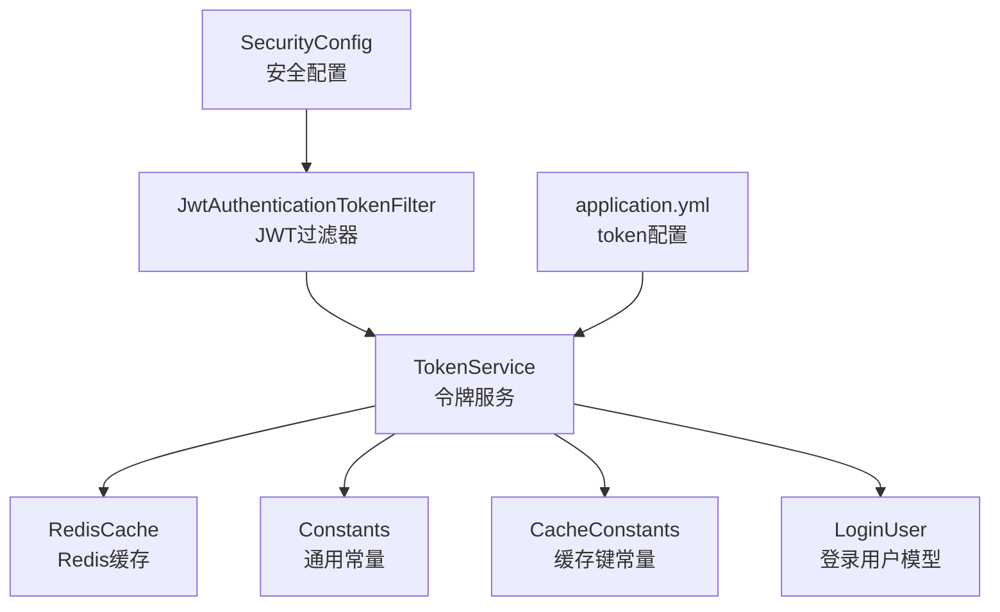
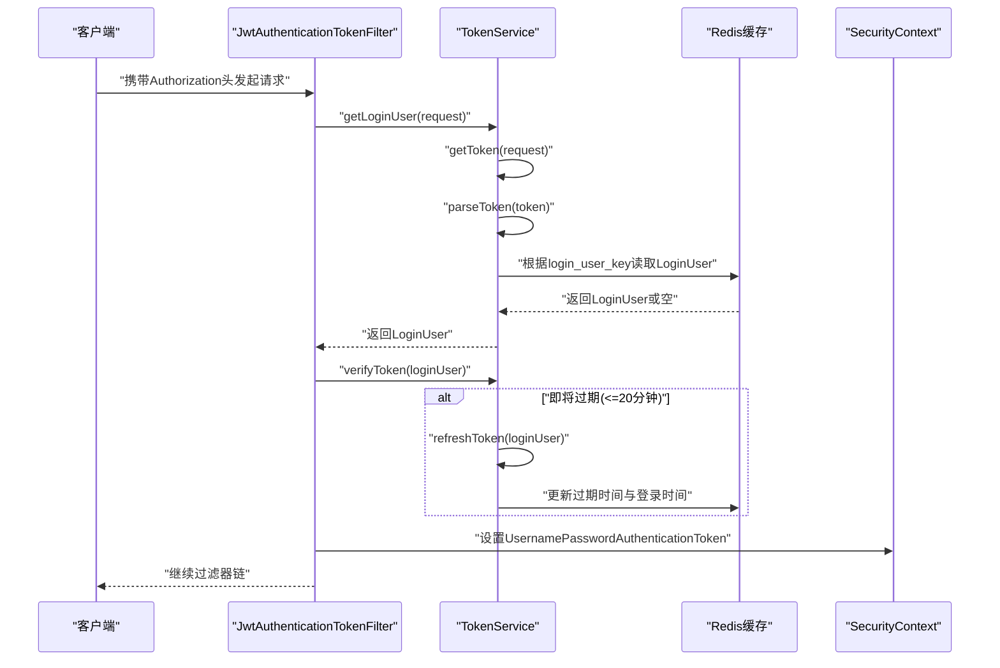
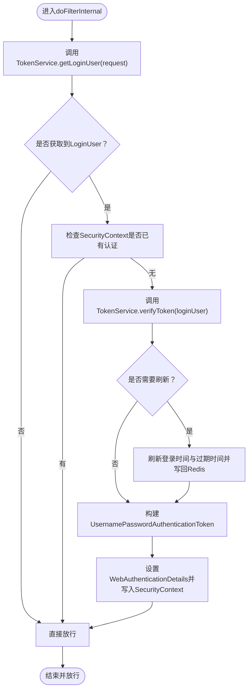
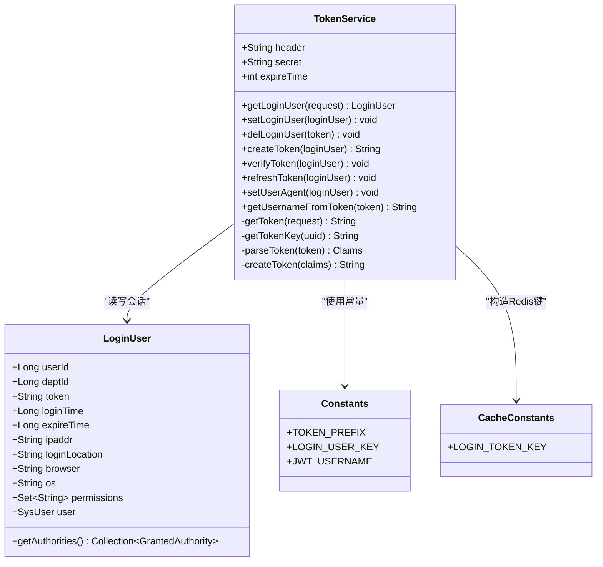
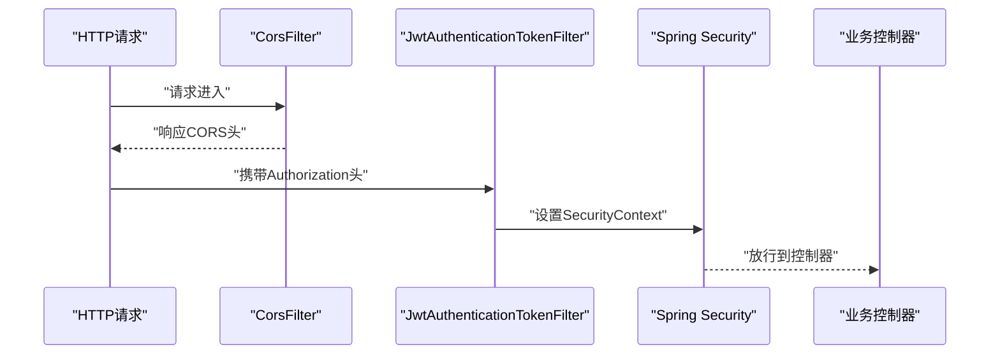
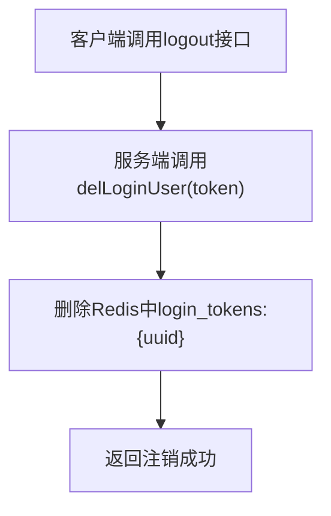
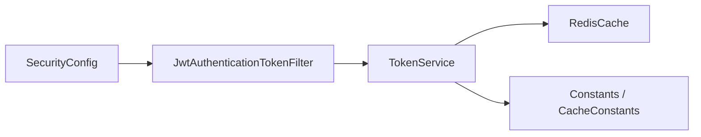

# JWT令牌认证机制

<cite>
**本文引用的文件**   
- [JwtAuthenticationTokenFilter.java](file://PezMax-Backend/ruoyi-framework/src/main/java/com/ruoyi/framework/security/filter/JwtAuthenticationTokenFilter.java)
- [TokenService.java](file://PezMax-Backend/ruoyi-framework/src/main/java/com/ruoyi/framework/web/service/TokenService.java)
- [SecurityConfig.java](file://PezMax-Backend/ruoyi-framework/src/main/java/com/ruoyi/framework/config/SecurityConfig.java)
- [application.yml](file://PezMax-Backend/ruoyi-admin/src/main/resources/application.yml)
- [CacheConstants.java](file://PezMax-Backend/ruoyi-common/src/main/java/com/ruoyi/common/constant/CacheConstants.java)
- [Constants.java](file://PezMax-Backend/ruoyi-common/src/main/java/com/ruoyi/common/constant/Constants.java)
- [LoginUser.java](file://PezMax-Backend/ruoyi-common/src/main/java/com/ruoyi/common/core/domain/model/LoginUser.java)
</cite>

## 目录
1. [简介](#简介)
2. [项目结构](#项目结构)
3. [核心组件](#核心组件)
4. [架构总览](#架构总览)
5. [详细组件分析](#详细组件分析)
6. [依赖关系分析](#依赖关系分析)
7. [性能考虑](#性能考虑)
8. [故障排查指南](#故障排查指南)
9. [结论](#结论)
10. [附录](#附录)

## 简介
本文件围绕后端模块的JWT令牌认证机制，系统性解析令牌的生成、验证与刷新流程，涵盖载荷结构设计、签名算法与安全考量；深入说明JwtAuthenticationTokenFilter过滤器在请求拦截、令牌解析、用户信息提取与安全上下文设置中的工作原理；文档化TokenService的核心方法（创建、验证、过期处理、黑名单管理）；并提供自定义配置与扩展点实现指南。

## 项目结构
与JWT认证相关的关键代码分布在以下包与文件中：
- 安全配置与过滤器链：SecurityConfig
- 请求级JWT过滤器：JwtAuthenticationTokenFilter
- 令牌服务：TokenService
- 常量与缓存键：Constants、CacheConstants
- 登录用户模型：LoginUser
- 应用配置：application.yml（包含token相关配置项）

图示来源
- [SecurityConfig.java:86-120](file://PezMax-Backend/ruoyi-framework/src/main/java/com/ruoyi/framework/config/SecurityConfig.java#L86-L120)
- [JwtAuthenticationTokenFilter.java:31-43](file://PezMax-Backend/ruoyi-framework/src/main/java/com/ruoyi/framework/security/filter/JwtAuthenticationTokenFilter.java#L31-L43)
- [TokenService.java:62-83](file://PezMax-Backend/ruoyi-framework/src/main/java/com/ruoyi/framework/web/service/TokenService.java#L62-L83)
- [application.yml:96-102](file://PezMax-Backend/ruoyi-admin/src/main/resources/application.yml#L96-L102)

章节来源
- [SecurityConfig.java:86-120](file://PezMax-Backend/ruoyi-framework/src/main/java/com/ruoyi/framework/config/SecurityConfig.java#L86-L120)
- [JwtAuthenticationTokenFilter.java:31-43](file://PezMax-Backend/ruoyi-framework/src/main/java/com/ruoyi/framework/security/filter/JwtAuthenticationTokenFilter.java#L31-L43)
- [TokenService.java:62-83](file://PezMax-Backend/ruoyi-framework/src/main/java/com/ruoyi/framework/web/service/TokenService.java#L62-L83)
- [application.yml:96-102](file://PezMax-Backend/ruoyi-admin/src/main/resources/application.yml#L96-L102)

## 核心组件
- JwtAuthenticationTokenFilter：在每个请求中执行一次，负责从请求头解析令牌、调用TokenService获取并校验用户信息，并将认证对象写入SecurityContext。
- TokenService：封装JWT的创建、解析、刷新与过期策略，维护登录态在Redis中的缓存，提供黑名单删除能力。
- SecurityConfig：注册过滤器链、定义匿名访问白名单、将JWT过滤器插入到Spring Security过滤器链中。
- LoginUser：承载用户身份、权限集合及登录会话元数据（如IP、UA、过期时间等）。
- Constants/CacheConstants：定义令牌前缀、Claims键名、Redis键前缀等常量。
- application.yml：提供token.header、token.secret、token.expireTime等可配置项。

章节来源
- [JwtAuthenticationTokenFilter.java:24-44](file://PezMax-Backend/ruoyi-framework/src/main/java/com/ruoyi/framework/security/filter/JwtAuthenticationTokenFilter.java#L24-L44)
- [TokenService.java:31-55](file://PezMax-Backend/ruoyi-framework/src/main/java/com/ruoyi/framework/web/service/TokenService.java#L31-L55)
- [SecurityConfig.java:27-30](file://PezMax-Backend/ruoyi-framework/src/main/java/com/ruoyi/framework/config/SecurityConfig.java#L27-L30)
- [LoginUser.java:19-76](file://PezMax-Backend/ruoyi-common/src/main/java/com/ruoyi/common/core/domain/model/LoginUser.java#L19-L76)
- [Constants.java:99-136](file://PezMax-Backend/ruoyi-common/src/main/java/com/ruoyi/common/constant/Constants.java#L99-L136)
- [CacheConstants.java:10-14](file://PezMax-Backend/ruoyi-common/src/main/java/com/ruoyi/common/constant/CacheConstants.java#L10-L14)
- [application.yml:96-102](file://PezMax-Backend/ruoyi-admin/src/main/resources/application.yml#L96-L102)

## 架构总览
下图展示了从HTTP请求进入，到JWT过滤、令牌解析、用户信息加载与安全上下文设置的完整链路。

图示来源
- [JwtAuthenticationTokenFilter.java:31-43](file://PezMax-Backend/ruoyi-framework/src/main/java/com/ruoyi/framework/security/filter/JwtAuthenticationTokenFilter.java#L31-L43)
- [TokenService.java:62-83](file://PezMax-Backend/ruoyi-framework/src/main/java/com/ruoyi/framework/web/service/TokenService.java#L62-L83)
- [TokenService.java:133-141](file://PezMax-Backend/ruoyi-framework/src/main/java/com/ruoyi/framework/web/service/TokenService.java#L133-L141)
- [TokenService.java:148-155](file://PezMax-Backend/ruoyi-framework/src/main/java/com/ruoyi/framework/web/service/TokenService.java#L148-L155)

## 详细组件分析

### JwtAuthenticationTokenFilter过滤器工作原理
- 请求拦截：继承OncePerRequestFilter，确保每个请求仅执行一次。
- 令牌解析：通过TokenService.getLoginUser(request)从请求头中提取并解析令牌，再从Redis中恢复LoginUser。
- 用户信息提取：若成功获取LoginUser且当前SecurityContext未设置认证，则进行后续处理。
- 过期检查与刷新：调用TokenService.verifyToken(loginUser)，若剩余有效期不足20分钟，自动刷新。
- 上下文设置：构建UsernamePasswordAuthenticationToken并注入WebAuthenticationDetails，随后写入SecurityContextHolder。
- 放行：无论是否认证成功，均调用chain.doFilter继续后续过滤器链。

图示来源
- [JwtAuthenticationTokenFilter.java:31-43](file://PezMax-Backend/ruoyi-framework/src/main/java/com/ruoyi/framework/security/filter/JwtAuthenticationTokenFilter.java#L31-L43)
- [TokenService.java:133-141](file://PezMax-Backend/ruoyi-framework/src/main/java/com/ruoyi/framework/web/service/TokenService.java#L133-L141)

章节来源
- [JwtAuthenticationTokenFilter.java:24-44](file://PezMax-Backend/ruoyi-framework/src/main/java/com/ruoyi/framework/security/filter/JwtAuthenticationTokenFilter.java#L24-L44)

### TokenService核心方法详解
- 令牌创建 createToken(LoginUser)
  - 生成唯一token标识，附加至LoginUser。
  - 采集用户代理、IP、地理位置、浏览器与操作系统信息。
  - 将token与用户名写入Claims，并使用HS512签名生成JWT。
  - 同时刷新Redis中的登录态（见refreshToken）。
- 令牌解析 getLoginUser(HttpServletRequest)
  - 从请求头按配置的header名称读取令牌，去除Bearer前缀。
  - 解析JWT得到Claims，取出login_user_key对应的UUID。
  - 使用Redis键前缀+UUID作为key，从Redis中读取LoginUser。
- 令牌验证 verifyToken(LoginUser)
  - 比较当前时间与expireTime，若剩余时间小于等于20分钟，触发刷新。
- 刷新令牌 refreshToken(LoginUser)
  - 更新loginTime与expireTime，并以expireTime为TTL将LoginUser写入Redis。
- 删除登录态 delLoginUser(String token)
  - 基于token计算Redis键并删除，用于退出或黑名单场景。
- 辅助方法
  - setUserAgent：填充登录会话元数据。
  - getToken/getTokenKey：令牌提取与Redis键构造。
  - parseToken/createToken：底层JWTS解析与签发。
  - getUsernameFromToken：从Subject字段获取用户名。

图示来源
- [TokenService.java:114-125](file://PezMax-Backend/ruoyi-framework/src/main/java/com/ruoyi/framework/web/service/TokenService.java#L114-L125)
- [TokenService.java:62-83](file://PezMax-Backend/ruoyi-framework/src/main/java/com/ruoyi/framework/web/service/TokenService.java#L62-L83)
- [TokenService.java:133-141](file://PezMax-Backend/ruoyi-framework/src/main/java/com/ruoyi/framework/web/service/TokenService.java#L133-L141)
- [TokenService.java:148-155](file://PezMax-Backend/ruoyi-framework/src/main/java/com/ruoyi/framework/web/service/TokenService.java#L148-L155)
- [TokenService.java:178-184](file://PezMax-Backend/ruoyi-framework/src/main/java/com/ruoyi/framework/web/service/TokenService.java#L178-L184)
- [TokenService.java:192-198](file://PezMax-Backend/ruoyi-framework/src/main/java/com/ruoyi/framework/web/service/TokenService.java#L192-L198)
- [TokenService.java:218-226](file://PezMax-Backend/ruoyi-framework/src/main/java/com/ruoyi/framework/web/service/TokenService.java#L218-L226)
- [TokenService.java:228-231](file://PezMax-Backend/ruoyi-framework/src/main/java/com/ruoyi/framework/web/service/TokenService.java#L228-L231)
- [LoginUser.java:19-76](file://PezMax-Backend/ruoyi-common/src/main/java/com/ruoyi/common/core/domain/model/LoginUser.java#L19-L76)
- [Constants.java:99-136](file://PezMax-Backend/ruoyi-common/src/main/java/com/ruoyi/common/constant/Constants.java#L99-L136)
- [CacheConstants.java:10-14](file://PezMax-Backend/ruoyi-common/src/main/java/com/ruoyi/common/constant/CacheConstants.java#L10-L14)

章节来源
- [TokenService.java:114-125](file://PezMax-Backend/ruoyi-framework/src/main/java/com/ruoyi/framework/web/service/TokenService.java#L114-L125)
- [TokenService.java:62-83](file://PezMax-Backend/ruoyi-framework/src/main/java/com/ruoyi/framework/web/service/TokenService.java#L62-L83)
- [TokenService.java:133-141](file://PezMax-Backend/ruoyi-framework/src/main/java/com/ruoyi/framework/web/service/TokenService.java#L133-L141)
- [TokenService.java:148-155](file://PezMax-Backend/ruoyi-framework/src/main/java/com/ruoyi/framework/web/service/TokenService.java#L148-L155)
- [TokenService.java:178-184](file://PezMax-Backend/ruoyi-framework/src/main/java/com/ruoyi/framework/web/service/TokenService.java#L178-L184)
- [TokenService.java:192-198](file://PezMax-Backend/ruoyi-framework/src/main/java/com/ruoyi/framework/web/service/TokenService.java#L192-L198)
- [TokenService.java:218-226](file://PezMax-Backend/ruoyi-framework/src/main/java/com/ruoyi/framework/web/service/TokenService.java#L218-L226)
- [TokenService.java:228-231](file://PezMax-Backend/ruoyi-framework/src/main/java/com/ruoyi/framework/web/service/TokenService.java#L228-L231)
- [LoginUser.java:19-76](file://PezMax-Backend/ruoyi-common/src/main/java/com/ruoyi/common/core/domain/model/LoginUser.java#L19-L76)
- [Constants.java:99-136](file://PezMax-Backend/ruoyi-common/src/main/java/com/ruoyi/common/constant/Constants.java#L99-L136)
- [CacheConstants.java:10-14](file://PezMax-Backend/ruoyi-common/src/main/java/com/ruoyi/common/constant/CacheConstants.java#L10-L14)

### 载荷结构与签名算法
- 载荷设计
  - login_user_key：对应Redis中存储的登录态键值（UUID），用于快速定位Redis中的LoginUser。
  - sub（subject）：用户名，便于直接从JWT中获取用户标识。
- 签名算法
  - HS512：对称签名算法，使用配置文件中的secret进行签名与验签。
- 安全建议
  - secret需足够长且随机，避免硬编码在源码中。
  - 建议结合HTTPS传输，防止中间人攻击。
  - 定期轮换密钥时，需考虑旧令牌的平滑过渡策略。

章节来源
- [TokenService.java:114-125](file://PezMax-Backend/ruoyi-framework/src/main/java/com/ruoyi/framework/web/service/TokenService.java#L114-L125)
- [TokenService.java:178-184](file://PezMax-Backend/ruoyi-framework/src/main/java/com/ruoyi/framework/web/service/TokenService.java#L178-L184)
- [application.yml:96-102](file://PezMax-Backend/ruoyi-admin/src/main/resources/application.yml#L96-L102)

### 过滤器链集成与白名单
- 过滤器插入位置：在UsernamePasswordAuthenticationFilter之前插入JwtAuthenticationTokenFilter，确保先完成JWT认证。
- 匿名访问白名单：登录、注册、验证码、静态资源、Swagger与Druid等路径允许匿名访问。
- 跨域支持：CorsFilter在JWT过滤器之前执行，保证预检请求正常处理。

图示来源
- [SecurityConfig.java:114-118](file://PezMax-Backend/ruoyi-framework/src/main/java/com/ruoyi/framework/config/SecurityConfig.java#L114-L118)
- [SecurityConfig.java:100-111](file://PezMax-Backend/ruoyi-framework/src/main/java/com/ruoyi/framework/config/SecurityConfig.java#L100-L111)

章节来源
- [SecurityConfig.java:86-120](file://PezMax-Backend/ruoyi-framework/src/main/java/com/ruoyi/framework/config/SecurityConfig.java#L86-L120)

### 黑名单管理与注销流程
- 黑名单能力
  - 通过TokenService.delLoginUser(token)删除Redis中的登录态，使已签发令牌失效。
  - 适用于强制下线、异常退出、风控封禁等场景。
- 注销流程
  - 由SecurityConfig注册的LogoutSuccessHandler处理/logout请求，通常配合delLoginUser实现服务端会话清理。

图示来源
- [TokenService.java:99-106](file://PezMax-Backend/ruoyi-framework/src/main/java/com/ruoyi/framework/web/service/TokenService.java#L99-L106)
- [SecurityConfig.java:113-113](file://PezMax-Backend/ruoyi-framework/src/main/java/com/ruoyi/framework/config/SecurityConfig.java#L113-L113)

章节来源
- [TokenService.java:99-106](file://PezMax-Backend/ruoyi-framework/src/main/java/com/ruoyi/framework/web/service/TokenService.java#L99-L106)
- [SecurityConfig.java:113-113](file://PezMax-Backend/ruoyi-framework/src/main/java/com/ruoyi/framework/config/SecurityConfig.java#L113-L113)

## 依赖关系分析
- 组件耦合
  - JwtAuthenticationTokenFilter依赖TokenService进行令牌解析与会话恢复。
  - TokenService依赖RedisCache进行会话持久化，依赖Constants与CacheConstants进行键与常量管理。
  - SecurityConfig集中管理过滤器链顺序与匿名访问策略。
- 外部依赖
  - JJWT库用于JWT的构建与解析。
  - Redis用于分布式会话存储与过期控制。
- 潜在风险
  - 若Redis不可用，登录态无法恢复，导致鉴权失败。
  - secret泄露会导致JWT被伪造，需严格保护。

图示来源
- [JwtAuthenticationTokenFilter.java:27-28](file://PezMax-Backend/ruoyi-framework/src/main/java/com/ruoyi/framework/security/filter/JwtAuthenticationTokenFilter.java#L27-L28)
- [TokenService.java:54-55](file://PezMax-Backend/ruoyi-framework/src/main/java/com/ruoyi/framework/web/service/TokenService.java#L54-L55)
- [SecurityConfig.java:46-47](file://PezMax-Backend/ruoyi-framework/src/main/java/com/ruoyi/framework/config/SecurityConfig.java#L46-L47)

章节来源
- [JwtAuthenticationTokenFilter.java:27-28](file://PezMax-Backend/ruoyi-framework/src/main/java/com/ruoyi/framework/security/filter/JwtAuthenticationTokenFilter.java#L27-L28)
- [TokenService.java:54-55](file://PezMax-Backend/ruoyi-framework/src/main/java/com/ruoyi/framework/web/service/TokenService.java#L54-L55)
- [SecurityConfig.java:46-47](file://PezMax-Backend/ruoyi-framework/src/main/java/com/ruoyi/framework/config/SecurityConfig.java#L46-L47)

## 性能考虑
- 近过期自动刷新：在剩余有效期≤20分钟时刷新，减少频繁重新登录，降低前端交互成本。
- Redis键空间优化：以login_tokens:{uuid}为键，避免在JWT中存储大量敏感信息，提升解析效率。
- 线程与连接池：合理配置Redis连接池参数，避免高并发下阻塞。
- 日志与监控：对异常解析与Redis操作增加告警，便于快速定位问题。

[本节为通用指导，不直接分析具体文件]

## 故障排查指南
- 常见错误
  - 令牌缺失或格式错误：检查请求头Authorization是否携带Bearer前缀。
  - 签名校验失败：核对token.secret是否与部署环境一致。
  - 会话丢失：确认Redis可用性与键是否存在。
  - 频繁刷新：检查token.expireTime配置是否过小。
- 定位步骤
  - 查看过滤器日志输出，确认是否进入getLoginUser与verifyToken。
  - 检查Redis中login_tokens:{uuid}是否存在且未过期。
  - 对比application.yml中的token配置与服务端实际生效值。

章节来源
- [TokenService.java:62-83](file://PezMax-Backend/ruoyi-framework/src/main/java/com/ruoyi/framework/web/service/TokenService.java#L62-L83)
- [application.yml:96-102](file://PezMax-Backend/ruoyi-admin/src/main/resources/application.yml#L96-L102)

## 结论
本项目采用“JWT+Redis”的无状态认证方案：JWT仅承载最小必要信息，登录态与会话元数据存储在Redis中，既保证了横向扩展能力，又提供了灵活的过期与黑名单管理能力。通过过滤器链前置校验与近过期自动刷新策略，兼顾了安全性与用户体验。建议在关键生产环境中强化密钥管理、启用HTTPS、完善监控与审计，以提升整体安全水位。

[本节为总结性内容，不直接分析具体文件]

## 附录

### 自定义JWT配置选项
- token.header：请求头名称，默认Authorization。
- token.secret：签名密钥，务必使用强随机字符串。
- token.expireTime：令牌有效期（分钟），默认30。

章节来源
- [application.yml:96-102](file://PezMax-Backend/ruoyi-admin/src/main/resources/application.yml#L96-L102)

### 扩展点与最佳实践
- 扩展载荷字段：可在createToken中添加自定义Claims，并在getLoginUser中按需读取。
- 多设备隔离：利用LoginUser中的token与UA/IP信息，实现设备级会话管理。
- 动态权限：结合LoginUser.permissions与Spring Security注解实现细粒度授权。
- 灰度密钥轮换：引入版本化密钥与兼容期，逐步淘汰旧密钥。

章节来源
- [TokenService.java:114-125](file://PezMax-Backend/ruoyi-framework/src/main/java/com/ruoyi/framework/web/service/TokenService.java#L114-L125)
- [LoginUser.java:19-76](file://PezMax-Backend/ruoyi-common/src/main/java/com/ruoyi/common/core/domain/model/LoginUser.java#L19-L76)