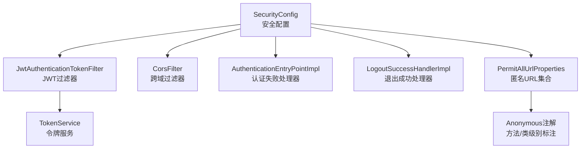
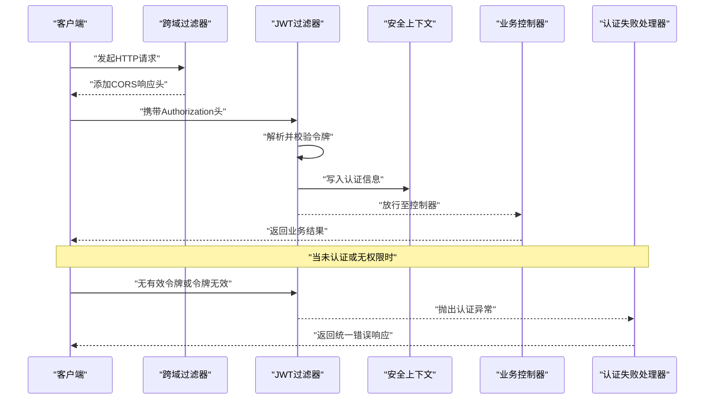
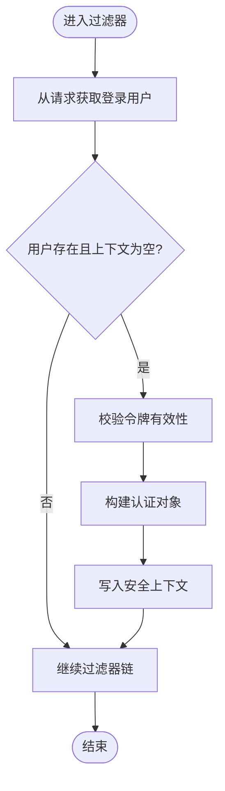
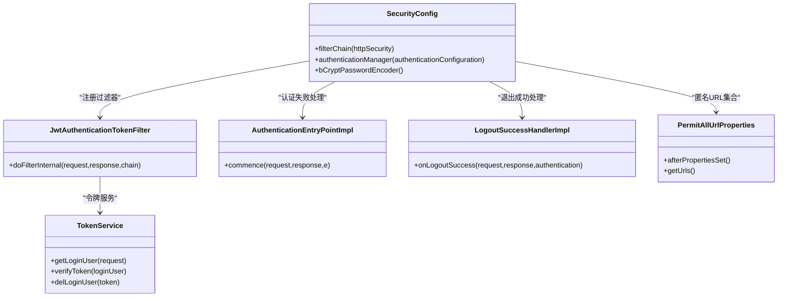

# Spring Security配置与过滤器链

<cite>
**本文引用的文件**   
- [SecurityConfig.java](file://PezMax-Backend/ruoyi-framework/src/main/java/com/ruoyi/framework/config/SecurityConfig.java)
- [JwtAuthenticationTokenFilter.java](file://PezMax-Backend/ruoyi-framework/src/main/java/com/ruoyi/framework/security/filter/JwtAuthenticationTokenFilter.java)
- [AuthenticationEntryPointImpl.java](file://PezMax-Backend/ruoyi-framework/src/main/java/com/ruoyi/framework/security/handle/AuthenticationEntryPointImpl.java)
- [LogoutSuccessHandlerImpl.java](file://PezMax-Backend/ruoyi-framework/src/main/java/com/ruoyi/framework/security/handle/LogoutSuccessHandlerImpl.java)
- [PermitAllUrlProperties.java](file://PezMax-Backend/ruoyi-framework/src/main/java/com/ruoyi/framework/config/properties/PermitAllUrlProperties.java)
- [Anonymous.java](file://PezMax-Backend/ruoyi-common/src/main/java/com/ruoyi/common/annotation/Anonymous.java)
- [TokenService.java](file://PezMax-Backend/ruoyi-framework/src/main/java/com/ruoyi/framework/web/service/TokenService.java)
- [GlobalExceptionHandler.java](file://PezMax-Backend/ruoyi-framework/src/main/java/com/ruoyi/framework/web/exception/GlobalExceptionHandler.java)
</cite>

## 目录
1. [简介](#简介)
2. [项目结构](#项目结构)
3. [核心组件](#核心组件)
4. [架构总览](#架构总览)
5. [详细组件分析](#详细组件分析)
6. [依赖关系分析](#依赖关系分析)
7. [性能考虑](#性能考虑)
8. [故障排查指南](#故障排查指南)
9. [结论](#结论)
10. [附录](#附录)

## 简介
本文件聚焦于后端安全子系统的配置与实现，围绕Spring Security的过滤器链构建、匿名访问策略、跨域处理与安全响应头设置进行系统化说明。同时覆盖基于方法与URL级别的权限控制注解使用方式（@PreAuthorize、@Secured），以及认证失败处理、退出登录流程与自定义异常处理的落地方案。文末提供安全策略定制与扩展的最佳实践建议，帮助读者在现有工程基础上快速、安全地演进。

## 项目结构
本项目采用模块化组织，安全相关能力集中在框架层模块中：
- 安全配置入口位于框架层的配置类，负责启用方法级安全、注册过滤器链、配置匿名访问与跨域等。
- JWT令牌校验通过自定义过滤器完成，并在请求上下文中注入认证信息。
- 认证失败与退出成功分别由独立处理器统一返回标准响应格式。
- 匿名访问URL支持两种来源：静态白名单与基于注解的动态扫描。

图表来源
- [SecurityConfig.java:86-120](file://PezMax-Backend/ruoyi-framework/src/main/java/com/ruoyi/framework/config/SecurityConfig.java#L86-L120)
- [JwtAuthenticationTokenFilter.java:30-43](file://PezMax-Backend/ruoyi-framework/src/main/java/com/ruoyi/framework/security/filter/JwtAuthenticationTokenFilter.java#L30-L43)
- [AuthenticationEntryPointImpl.java:26-33](file://PezMax-Backend/ruoyi-framework/src/main/java/com/ruoyi/framework/security/handle/AuthenticationEntryPointImpl.java#L26-L33)
- [LogoutSuccessHandlerImpl.java:38-52](file://PezMax-Backend/ruoyi-framework/src/main/java/com/ruoyi/framework/security/handle/LogoutSuccessHandlerImpl.java#L38-L52)
- [PermitAllUrlProperties.java:39-57](file://PezMax-Backend/ruoyi-framework/src/main/java/com/ruoyi/framework/config/properties/PermitAllUrlProperties.java#L39-L57)
- [TokenService.java](file://PezMax-Backend/ruoyi-framework/src/main/java/com/ruoyi/framework/web/service/TokenService.java)

章节来源
- [SecurityConfig.java:27-130](file://PezMax-Backend/ruoyi-framework/src/main/java/com/ruoyi/framework/config/SecurityConfig.java#L27-L130)
- [PermitAllUrlProperties.java:27-75](file://PezMax-Backend/ruoyi-framework/src/main/java/com/ruoyi/framework/config/properties/PermitAllUrlProperties.java#L27-L75)

## 核心组件
- 安全配置中心：集中管理过滤器链、会话策略、匿名访问规则、跨域与安全响应头等。
- JWT过滤器：从请求中提取并校验令牌，将用户上下文写入安全上下文。
- 匿名URL收集器：启动时扫描控制器与方法上的匿名注解，动态生成可匿名访问的路径集合。
- 认证失败处理器：对未认证或无权限的请求返回统一的错误响应。
- 退出成功处理器：清理令牌缓存并记录退出日志，返回统一的成功响应。
- 令牌服务：提供获取、校验与删除用户令牌的能力。

章节来源
- [SecurityConfig.java:64-130](file://PezMax-Backend/ruoyi-framework/src/main/java/com/ruoyi/framework/config/SecurityConfig.java#L64-L130)
- [JwtAuthenticationTokenFilter.java:24-44](file://PezMax-Backend/ruoyi-framework/src/main/java/com/ruoyi/framework/security/filter/JwtAuthenticationTokenFilter.java#L24-L44)
- [PermitAllUrlProperties.java:27-75](file://PezMax-Backend/ruoyi-framework/src/main/java/com/ruoyi/framework/config/properties/PermitAllUrlProperties.java#L27-L75)
- [AuthenticationEntryPointImpl.java:21-34](file://PezMax-Backend/ruoyi-framework/src/main/java/com/ruoyi/framework/security/handle/AuthenticationEntryPointImpl.java#L21-L34)
- [LogoutSuccessHandlerImpl.java:27-53](file://PezMax-Backend/ruoyi-framework/src/main/java/com/ruoyi/framework/security/handle/LogoutSuccessHandlerImpl.java#L27-L53)
- [TokenService.java](file://PezMax-Backend/ruoyi-framework/src/main/java/com/ruoyi/framework/web/service/TokenService.java)

## 架构总览
下图展示了典型请求进入后的安全处理流程：跨域过滤器优先执行，随后是JWT过滤器完成身份解析与上下文注入，最终交由业务控制器；若发生认证失败，则由认证失败处理器统一响应。

图表来源
- [SecurityConfig.java:86-120](file://PezMax-Backend/ruoyi-framework/src/main/java/com/ruoyi/framework/config/SecurityConfig.java#L86-L120)
- [JwtAuthenticationTokenFilter.java:30-43](file://PezMax-Backend/ruoyi-framework/src/main/java/com/ruoyi/framework/security/filter/JwtAuthenticationTokenFilter.java#L30-L43)
- [AuthenticationEntryPointImpl.java:26-33](file://PezMax-Backend/ruoyi-framework/src/main/java/com/ruoyi/framework/security/handle/AuthenticationEntryPointImpl.java#L26-L33)

## 详细组件分析

### SecurityConfig 安全配置详解
- 方法级安全启用：开启@PreAuthorize与@Secured注解支持。
- 过滤器链构建要点：
  - 禁用CSRF（无状态会话）。
  - 配置安全响应头（如禁用缓存、帧选项）。
  - 配置认证失败处理器。
  - 会话策略为无状态。
  - 授权规则：
    - 动态匿名URL：来自匿名注解扫描结果。
    - 静态匿名URL：登录、注册、验证码、密码找回相关接口、静态资源、文档与监控页面。
    - 其余请求均需认证。
  - 过滤器顺序：
    - 先跨域过滤器，再JWT过滤器，最后Logout过滤器。
  - 退出登录：配置退出路径与成功处理器。
- 密码编码器：提供BCryptPasswordEncoder Bean。

章节来源
- [SecurityConfig.java:27-130](file://PezMax-Backend/ruoyi-framework/src/main/java/com/ruoyi/framework/config/SecurityConfig.java#L27-L130)

#### 匿名访问URL的来源与匹配
- 静态白名单：在配置类中直接声明允许匿名访问的路径。
- 动态扫描：启动时扫描所有控制器与方法上的匿名注解，提取映射路径并将路径变量替换为通配符后加入白名单。
- 匹配优先级：按注册顺序匹配，建议将更具体的路径放在前面。

章节来源
- [SecurityConfig.java:99-111](file://PezMax-Backend/ruoyi-framework/src/main/java/com/ruoyi/framework/config/SecurityConfig.java#L99-L111)
- [PermitAllUrlProperties.java:39-57](file://PezMax-Backend/ruoyi-framework/src/main/java/com/ruoyi/framework/config/properties/PermitAllUrlProperties.java#L39-L57)
- [Anonymous.java](file://PezMax-Backend/ruoyi-common/src/main/java/com/ruoyi/common/annotation/Anonymous.java)

#### 跨域与安全响应头
- 跨域：通过独立的跨域过滤器在JWT过滤器之前执行，确保预检请求与带凭据请求均能正确处理。
- 安全响应头：关闭缓存、限制iframe嵌入等，增强基础安全性。

章节来源
- [SecurityConfig.java:92-98](file://PezMax-Backend/ruoyi-framework/src/main/java/com/ruoyi/framework/config/SecurityConfig.java#L92-L98)
- [SecurityConfig.java:116-118](file://PezMax-Backend/ruoyi-framework/src/main/java/com/ruoyi/framework/config/SecurityConfig.java#L116-L118)

### JWT过滤器与令牌服务
- 职责：从请求中解析令牌，调用令牌服务验证有效性，并将认证对象写入安全上下文。
- 关键点：
  - 仅当存在有效用户且当前安全上下文为空时才注入。
  - 校验通过后，构造包含权限信息的认证对象。
  - 保持无状态，不依赖服务器端会话。

图表来源
- [JwtAuthenticationTokenFilter.java:30-43](file://PezMax-Backend/ruoyi-framework/src/main/java/com/ruoyi/framework/security/filter/JwtAuthenticationTokenFilter.java#L30-L43)
- [TokenService.java](file://PezMax-Backend/ruoyi-framework/src/main/java/com/ruoyi/framework/web/service/TokenService.java)

章节来源
- [JwtAuthenticationTokenFilter.java:24-44](file://PezMax-Backend/ruoyi-framework/src/main/java/com/ruoyi/framework/security/filter/JwtAuthenticationTokenFilter.java#L24-L44)
- [TokenService.java](file://PezMax-Backend/ruoyi-framework/src/main/java/com/ruoyi/framework/web/service/TokenService.java)

### 认证失败处理
- 触发条件：未认证或无权限访问受保护资源。
- 行为：返回统一的状态码与消息体，便于前端统一处理。
- 集成点：在安全配置中注册为认证失败处理器。

章节来源
- [SecurityConfig.java:95-96](file://PezMax-Backend/ruoyi-framework/src/main/java/com/ruoyi/framework/config/SecurityConfig.java#L95-L96)
- [AuthenticationEntryPointImpl.java:26-33](file://PezMax-Backend/ruoyi-framework/src/main/java/com/ruoyi/framework/security/handle/AuthenticationEntryPointImpl.java#L26-L33)

### 退出登录处理
- 触发条件：访问配置的退出路径。
- 行为：
  - 根据请求获取当前用户令牌并删除缓存中的登录信息。
  - 异步记录退出日志。
  - 返回统一的成功响应。
- 集成点：在安全配置中注册退出路径与成功处理器。

章节来源
- [SecurityConfig.java:112-113](file://PezMax-Backend/ruoyi-framework/src/main/java/com/ruoyi/framework/config/SecurityConfig.java#L112-L113)
- [LogoutSuccessHandlerImpl.java:38-52](file://PezMax-Backend/ruoyi-framework/src/main/java/com/ruoyi/framework/security/handle/LogoutSuccessHandlerImpl.java#L38-L52)

### 基于方法与URL级别的权限控制
- URL级别：
  - 静态白名单：在安全配置中声明允许匿名访问的路径。
  - 动态白名单：在控制器或方法上标注匿名注解，启动时自动纳入白名单。
- 方法级别：
  - @PreAuthorize：基于SpEL表达式进行细粒度权限判断，适合复杂条件。
  - @Secured：基于角色字符串进行简单角色判定，适合粗粒度控制。
- 最佳实践：
  - 优先使用@PreAuthorize表达业务语义，@Secured用于快速角色开关。
  - 结合数据权限切面与全局异常处理器，形成完整的安全闭环。

章节来源
- [SecurityConfig.java:27-27](file://PezMax-Backend/ruoyi-framework/src/main/java/com/ruoyi/framework/config/SecurityConfig.java#L27-L27)
- [PermitAllUrlProperties.java:39-57](file://PezMax-Backend/ruoyi-framework/src/main/java/com/ruoyi/framework/config/properties/PermitAllUrlProperties.java#L39-L57)
- [Anonymous.java](file://PezMax-Backend/ruoyi-common/src/main/java/com/ruoyi/common/annotation/Anonymous.java)

### 自定义异常处理
- 全局异常处理器：统一捕获业务异常、参数校验异常、安全异常等，返回一致的结构化响应。
- 建议：
  - 针对安全相关异常（如未认证、无权限）单独分类处理，便于前端差异化提示。
  - 避免泄露敏感信息，统一错误码与消息模板。

章节来源
- [GlobalExceptionHandler.java](file://PezMax-Backend/ruoyi-framework/src/main/java/com/ruoyi/framework/web/exception/GlobalExceptionHandler.java)

## 依赖关系分析
- SecurityConfig依赖：
  - JwtAuthenticationTokenFilter：在UsernamePasswordAuthenticationFilter之前执行。
  - CorsFilter：在JWT过滤器与Logout过滤器之前执行。
  - AuthenticationEntryPointImpl：作为认证失败处理器。
  - LogoutSuccessHandlerImpl：作为退出成功处理器。
  - PermitAllUrlProperties：提供匿名URL集合。
- JwtAuthenticationTokenFilter依赖：
  - TokenService：用于获取与校验用户令牌。
- 启动期扫描：
  - PermitAllUrlProperties在初始化阶段扫描控制器与方法上的匿名注解，生成匿名URL列表。

图表来源
- [SecurityConfig.java:86-130](file://PezMax-Backend/ruoyi-framework/src/main/java/com/ruoyi/framework/config/SecurityConfig.java#L86-L130)
- [JwtAuthenticationTokenFilter.java:24-44](file://PezMax-Backend/ruoyi-framework/src/main/java/com/ruoyi/framework/security/filter/JwtAuthenticationTokenFilter.java#L24-L44)
- [AuthenticationEntryPointImpl.java:21-34](file://PezMax-Backend/ruoyi-framework/src/main/java/com/ruoyi/framework/security/handle/AuthenticationEntryPointImpl.java#L21-L34)
- [LogoutSuccessHandlerImpl.java:27-53](file://PezMax-Backend/ruoyi-framework/src/main/java/com/ruoyi/framework/security/handle/LogoutSuccessHandlerImpl.java#L27-L53)
- [PermitAllUrlProperties.java:27-75](file://PezMax-Backend/ruoyi-framework/src/main/java/com/ruoyi/framework/config/properties/PermitAllUrlProperties.java#L27-L75)
- [TokenService.java](file://PezMax-Backend/ruoyi-framework/src/main/java/com/ruoyi/framework/web/service/TokenService.java)

章节来源
- [SecurityConfig.java:86-130](file://PezMax-Backend/ruoyi-framework/src/main/java/com/ruoyi/framework/config/SecurityConfig.java#L86-L130)
- [JwtAuthenticationTokenFilter.java:24-44](file://PezMax-Backend/ruoyi-framework/src/main/java/com/ruoyi/framework/security/filter/JwtAuthenticationTokenFilter.java#L24-L44)
- [PermitAllUrlProperties.java:27-75](file://PezMax-Backend/ruoyi-framework/src/main/java/com/ruoyi/framework/config/properties/PermitAllUrlProperties.java#L27-L75)

## 性能考虑
- 无状态会话：减少服务端会话存储压力，提升水平扩展能力。
- 过滤器顺序优化：跨域与JWT校验前置，避免不必要的业务处理。
- 令牌校验成本：合理设置令牌有效期与刷新策略，降低频繁校验开销。
- 匿名URL扫描：仅在应用启动时执行一次，避免运行时反射带来的额外消耗。

[本节为通用指导，无需源码引用]

## 故障排查指南
- 常见问题定位：
  - 401未认证：检查是否携带有效令牌、令牌是否过期、匿名URL是否正确配置。
  - 403无权限：检查方法级注解与权限表达式、角色与权限分配是否正确。
  - 跨域失败：确认跨域过滤器已正确注册且允许源、方法与头字段。
  - 退出失败：检查退出路径与成功处理器是否生效，令牌是否被正确清理。
- 建议手段：
  - 增加关键路径日志（如令牌解析、权限判定、异常处理）。
  - 使用全局异常处理器统一输出结构化错误信息，便于前端展示与问题追踪。

章节来源
- [AuthenticationEntryPointImpl.java:26-33](file://PezMax-Backend/ruoyi-framework/src/main/java/com/ruoyi/framework/security/handle/AuthenticationEntryPointImpl.java#L26-L33)
- [LogoutSuccessHandlerImpl.java:38-52](file://PezMax-Backend/ruoyi-framework/src/main/java/com/ruoyi/framework/security/handle/LogoutSuccessHandlerImpl.java#L38-L52)
- [GlobalExceptionHandler.java](file://PezMax-Backend/ruoyi-framework/src/main/java/com/ruoyi/framework/web/exception/GlobalExceptionHandler.java)

## 结论
本项目的安全体系以无状态JWT为核心，通过灵活的匿名URL机制与强大的方法级注解支持，实现了URL与方法双维度的权限控制。配合统一的认证失败与退出成功处理、跨域与安全响应头配置，形成了完整、可扩展的安全基线。建议在后续迭代中持续完善权限模型与审计日志，并结合全局异常处理提升用户体验与可观测性。

[本节为总结性内容，无需源码引用]

## 附录
- 常用注解参考：
  - @PreAuthorize：基于SpEL表达式的方法级权限控制。
  - @Secured：基于角色的方法级权限控制。
  - @Anonymous：标记控制器或方法允许匿名访问。
- 扩展建议：
  - 引入数据权限切面，实现行级数据隔离。
  - 增加操作审计与风险告警，提升安全运营能力。
  - 对敏感接口增加速率限制与防重放机制。

[本节为概念性内容，无需源码引用]