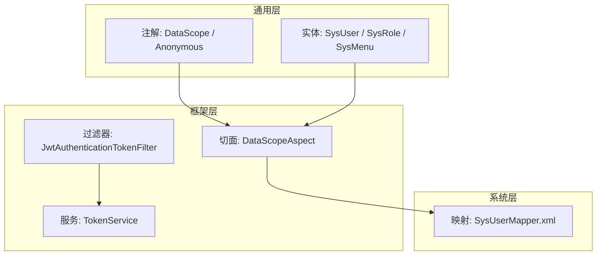
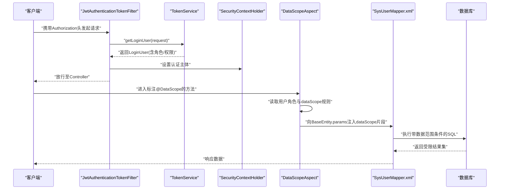
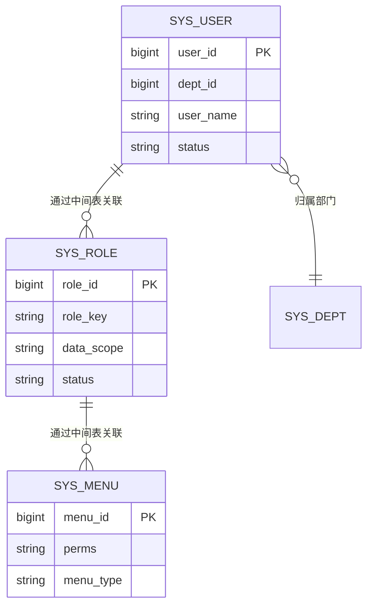
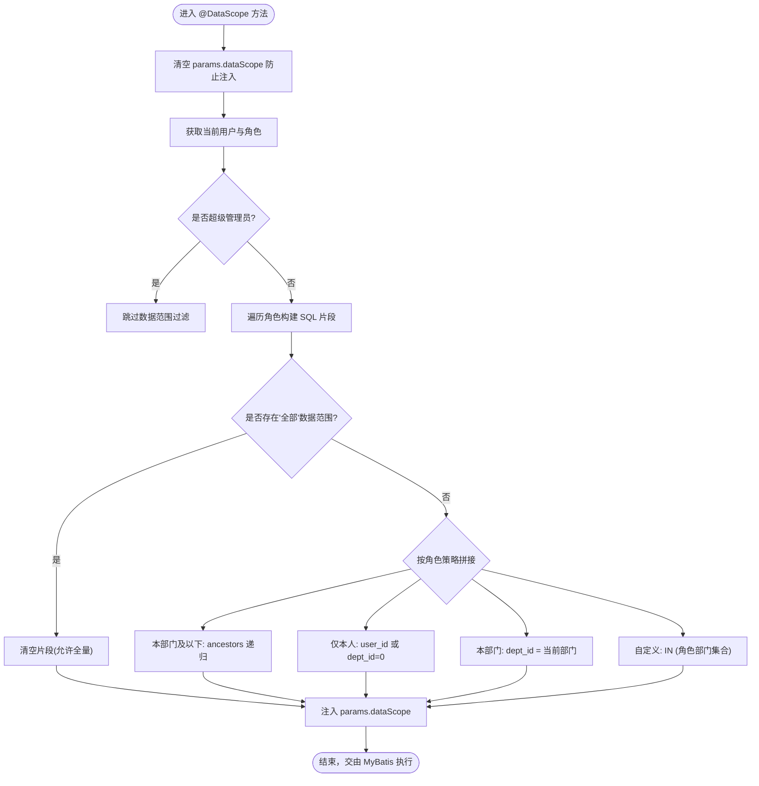
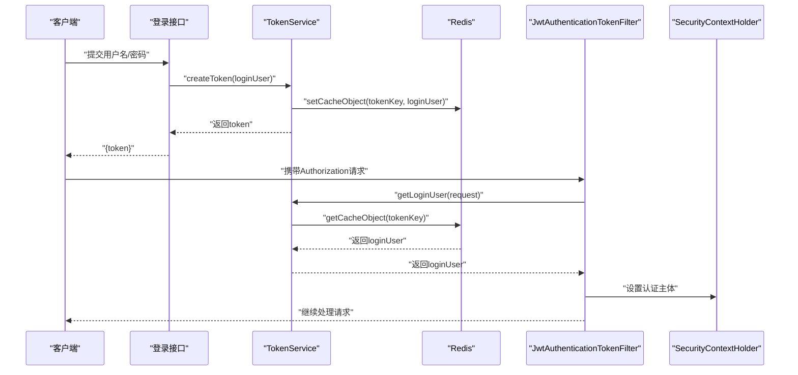
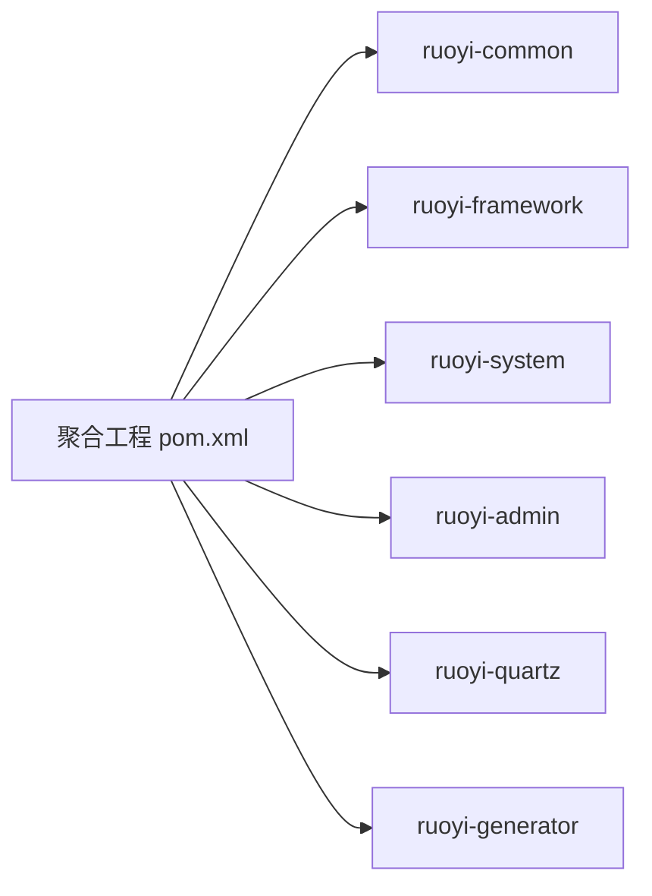

# 基于角色的访问控制(RBAC)

<cite>
**本文引用的文件**   
- [pom.xml](file://PezMax-Backend/pom.xml)
- [DataScope.java](file://PezMax-Backend/ruoyi-common/src/main/java/com/ruoyi/common/annotation/DataScope.java)
- [Anonymous.java](file://PezMax-Backend/ruoyi-common/src/main/java/com/ruoyi/common/annotation/Anonymous.java)
- [DataScopeAspect.java](file://PezMax-Backend/ruoyi-framework/src/main/java/com/ruoyi/framework/aspectj/DataScopeAspect.java)
- [JwtAuthenticationTokenFilter.java](file://PezMax-Backend/ruoyi-framework/src/main/java/com/ruoyi/framework/security/filter/JwtAuthenticationTokenFilter.java)
- [TokenService.java](file://PezMax-Backend/ruoyi-framework/src/main/java/com/ruoyi/framework/web/service/TokenService.java)
- [SysUser.java](file://PezMax-Backend/ruoyi-common/src/main/java/com/ruoyi/common/core/domain/entity/SysUser.java)
- [SysRole.java](file://PezMax-Backend/ruoyi-common/src/main/java/com/ruoyi/common/core/domain/entity/SysRole.java)
- [SysMenu.java](file://PezMax-Backend/ruoyi-common/src/main/java/com/ruoyi/common/core/domain/entity/SysMenu.java)
- [SysUserMapper.xml](file://PezMax-Backend/ruoyi-system/src/main/resources/mapper/system/SysUserMapper.xml)
</cite>

## 目录
1. [引言](#引言)
2. [项目结构](#项目结构)
3. [核心组件](#核心组件)
4. [架构总览](#架构总览)
5. [详细组件分析](#详细组件分析)
6. [依赖分析](#依赖分析)
7. [性能考虑](#性能考虑)
8. [故障排查指南](#故障排查指南)
9. [结论](#结论)
10. [附录](#附录)

## 引言
本文件围绕项目的基于角色的访问控制（RBAC）体系，系统化梳理用户-角色-权限三层模型、数据表结构与业务逻辑实现；深入解析自定义注解@DataScope与@Anonymous的设计与使用；完整文档化从登录到接口调用的权限校验流程；并提供动态加载、缓存策略与性能优化方案及最佳实践。

## 项目结构
后端采用多模块分层组织：
- 通用层（common）：定义实体、常量、注解、工具类
- 框架层（framework）：安全过滤器、AOP切面、服务基础设施
- 系统层（system）：系统域对象、映射与持久化
- 管理端（admin）：启动入口与控制器
- 其他模块：定时任务、代码生成等

图表来源
- [DataScope.java:1-34](file://PezMax-Backend/ruoyi-common/src/main/java/com/ruoyi/common/annotation/DataScope.java#L1-L34)
- [Anonymous.java:1-20](file://PezMax-Backend/ruoyi-common/src/main/java/com/ruoyi/common/annotation/Anonymous.java#L1-L20)
- [SysUser.java:1-337](file://PezMax-Backend/ruoyi-common/src/main/java/com/ruoyi/common/core/domain/entity/SysUser.java#L1-L337)
- [SysRole.java:1-242](file://PezMax-Backend/ruoyi-common/src/main/java/com/ruoyi/common/core/domain/entity/SysRole.java#L1-L242)
- [SysMenu.java:1-275](file://PezMax-Backend/ruoyi-common/src/main/java/com/ruoyi/common/core/domain/entity/SysMenu.java#L1-L275)
- [JwtAuthenticationTokenFilter.java:1-45](file://PezMax-Backend/ruoyi-framework/src/main/java/com/ruoyi/framework/security/filter/JwtAuthenticationTokenFilter.java#L1-L45)
- [TokenService.java:1-233](file://PezMax-Backend/ruoyi-framework/src/main/java/com/ruoyi/framework/web/service/TokenService.java#L1-L233)
- [DataScopeAspect.java:1-185](file://PezMax-Backend/ruoyi-framework/src/main/java/com/ruoyi/framework/aspectj/DataScopeAspect.java#L1-L185)
- [SysUserMapper.xml:1-227](file://PezMax-Backend/ruoyi-system/src/main/resources/mapper/system/SysUserMapper.xml#L1-L227)

章节来源
- [pom.xml:177-185](file://PezMax-Backend/pom.xml#L177-L185)

## 核心组件
- 实体模型
  - 用户：包含部门、角色集合等上下文信息，用于权限判定与数据范围过滤
  - 角色：承载数据范围、状态、权限集合等
  - 菜单：承载权限标识perms，用于按钮级权限控制
- 自定义注解
  - @DataScope：声明方法的数据权限范围，支持部门/用户别名与权限字符匹配
  - @Anonymous：声明匿名访问，跳过鉴权
- 安全与令牌
  - JwtAuthenticationTokenFilter：请求进入时解析并注入认证主体
  - TokenService：创建/刷新/验证JWT，维护Redis中的会话
- 数据权限切面
  - DataScopeAspect：根据当前用户角色与@DataScope配置，拼接SQL片段注入查询条件
- 持久化映射
  - SysUserMapper.xml：在列表查询中通过${params.dataScope}注入数据范围条件

章节来源
- [SysUser.java:85-96](file://PezMax-Backend/ruoyi-common/src/main/java/com/ruoyi/common/core/domain/entity/SysUser.java#L85-L96)
- [SysRole.java:38-66](file://PezMax-Backend/ruoyi-common/src/main/java/com/ruoyi/common/core/domain/entity/SysRole.java#L38-L66)
- [SysMenu.java:63-65](file://PezMax-Backend/ruoyi-common/src/main/java/com/ruoyi/common/core/domain/entity/SysMenu.java#L63-L65)
- [DataScope.java:1-34](file://PezMax-Backend/ruoyi-common/src/main/java/com/ruoyi/common/annotation/DataScope.java#L1-L34)
- [Anonymous.java:1-20](file://PezMax-Backend/ruoyi-common/src/main/java/com/ruoyi/common/annotation/Anonymous.java#L1-L20)
- [JwtAuthenticationTokenFilter.java:1-45](file://PezMax-Backend/ruoyi-framework/src/main/java/com/ruoyi/framework/security/filter/JwtAuthenticationTokenFilter.java#L1-L45)
- [TokenService.java:1-233](file://PezMax-Backend/ruoyi-framework/src/main/java/com/ruoyi/framework/web/service/TokenService.java#L1-L233)
- [DataScopeAspect.java:1-185](file://PezMax-Backend/ruoyi-framework/src/main/java/com/ruoyi/framework/aspectj/DataScopeAspect.java#L1-L185)
- [SysUserMapper.xml:60-87](file://PezMax-Backend/ruoyi-system/src/main/resources/mapper/system/SysUserMapper.xml#L60-L87)

## 架构总览
下图展示一次受保护接口的调用链路：过滤器解析JWT并建立认证上下文，随后AOP拦截带有@DataScope的方法，按角色数据范围拼装SQL片段，最终由MyBatis执行带条件的查询。

图表来源
- [JwtAuthenticationTokenFilter.java:30-43](file://PezMax-Backend/ruoyi-framework/src/main/java/com/ruoyi/framework/security/filter/JwtAuthenticationTokenFilter.java#L30-L43)
- [TokenService.java:62-83](file://PezMax-Backend/ruoyi-framework/src/main/java/com/ruoyi/framework/web/service/TokenService.java#L62-L83)
- [DataScopeAspect.java:59-80](file://PezMax-Backend/ruoyi-framework/src/main/java/com/ruoyi/framework/aspectj/DataScopeAspect.java#L59-L80)
- [SysUserMapper.xml:85-87](file://PezMax-Backend/ruoyi-system/src/main/resources/mapper/system/SysUserMapper.xml#L85-L87)

## 详细组件分析

### 用户-角色-权限模型与关系
- 用户-角色：一对多（一个用户可拥有多个角色）
- 角色-权限：多对多（角色关联菜单/按钮的权限标识）
- 用户-部门：用于数据范围过滤（本部门/本部门及以下/仅本人）
- 角色数据范围：全部/自定义/本部门/本部门及以下/仅本人

说明
- 权限字符串存储在菜单的perms字段，角色聚合后形成用户的权限集合
- 数据范围由角色的data_scope决定，结合用户deptId进行SQL片段拼接

章节来源
- [SysUser.java:85-96](file://PezMax-Backend/ruoyi-common/src/main/java/com/ruoyi/common/core/domain/entity/SysUser.java#L85-L96)
- [SysRole.java:38-66](file://PezMax-Backend/ruoyi-common/src/main/java/com/ruoyi/common/core/domain/entity/SysRole.java#L38-L66)
- [SysMenu.java:63-65](file://PezMax-Backend/ruoyi-common/src/main/java/com/ruoyi/common/core/domain/entity/SysMenu.java#L63-L65)

### 自定义注解设计与用法
- @DataScope
  - 作用点：方法级别
  - 关键属性：deptAlias、userAlias、permission
  - 行为：触发数据权限过滤，将SQL片段注入查询参数
- @Anonymous
  - 作用点：方法或类型
  - 行为：标记为匿名访问，通常配合白名单跳过鉴权

章节来源
- [DataScope.java:1-34](file://PezMax-Backend/ruoyi-common/src/main/java/com/ruoyi/common/annotation/DataScope.java#L1-L34)
- [Anonymous.java:1-20](file://PezMax-Backend/ruoyi-common/src/main/java/com/ruoyi/common/annotation/Anonymous.java#L1-L20)

### 数据权限切面实现原理
- 前置拦截：在进入目标方法前清理并计算dataScope片段
- 权限字符匹配：若指定permission，则仅当角色包含该权限时才生效
- 数据范围策略：
  - 全部：不追加条件
  - 自定义：按角色配置的部门ID集合构造IN子句
  - 本部门：限定dept_id等于当前用户部门
  - 本部门及以下：利用ancestors递归包含子部门
  - 仅本人：限定user_id或兜底dept_id=0避免查全表
- 注入位置：将片段写入BaseEntity.params.dataScope，供XML中使用${params.dataScope}拼接

图表来源
- [DataScopeAspect.java:59-183](file://PezMax-Backend/ruoyi-framework/src/main/java/com/ruoyi/framework/aspectj/DataScopeAspect.java#L59-L183)
- [SysUserMapper.xml:85-87](file://PezMax-Backend/ruoyi-system/src/main/resources/mapper/system/SysUserMapper.xml#L85-L87)

章节来源
- [DataScopeAspect.java:1-185](file://PezMax-Backend/ruoyi-framework/src/main/java/com/ruoyi/framework/aspectj/DataScopeAspect.java#L1-L185)
- [SysUserMapper.xml:60-87](file://PezMax-Backend/ruoyi-system/src/main/resources/mapper/system/SysUserMapper.xml#L60-L87)

### 登录与鉴权流程（JWT + 过滤器）
- 登录成功后生成JWT并写入Redis，返回token给前端
- 每次请求携带Authorization头，过滤器解析token并从Redis恢复LoginUser
- 将认证主体放入SecurityContext，后续组件可通过工具类获取
- verifyToken在接近过期时自动刷新有效期

图表来源
- [TokenService.java:114-155](file://PezMax-Backend/ruoyi-framework/src/main/java/com/ruoyi/framework/web/service/TokenService.java#L114-L155)
- [JwtAuthenticationTokenFilter.java:30-43](file://PezMax-Backend/ruoyi-framework/src/main/java/com/ruoyi/framework/security/filter/JwtAuthenticationTokenFilter.java#L30-L43)

章节来源
- [TokenService.java:1-233](file://PezMax-Backend/ruoyi-framework/src/main/java/com/ruoyi/framework/web/service/TokenService.java#L1-L233)
- [JwtAuthenticationTokenFilter.java:1-45](file://PezMax-Backend/ruoyi-framework/src/main/java/com/ruoyi/framework/security/filter/JwtAuthenticationTokenFilter.java#L1-L45)

### 权限动态加载与缓存策略
- 动态加载
  - 用户登录后，服务端根据用户角色聚合其权限集合（如菜单perms），随登录响应下发前端
  - 前端据此渲染菜单与按钮，并在路由守卫中进行页面级权限控制
- 缓存策略
  - 登录态缓存：TokenService将LoginUser以token为键存入Redis，附带过期时间
  - 近过期刷新：verifyToken在剩余有效期不足阈值时刷新Redis中的过期时间
  - 建议扩展：将“用户-权限”映射缓存于Redis，键名可按用户ID或token派生，减少重复查询

章节来源
- [TokenService.java:133-155](file://PezMax-Backend/ruoyi-framework/src/main/java/com/ruoyi/framework/web/service/TokenService.java#L133-L155)

### 数据表结构与关键字段
- sys_user：用户基本信息、部门ID、状态、删除标志、登录信息等
- sys_role：角色名称、角色键、排序、数据范围、状态、删除标志等
- sys_menu：菜单层级、路径、组件、类型（目录/菜单/按钮）、可见性、状态、权限标识perms等
- 关联关系：用户-角色、角色-菜单通过中间表维护（具体映射见系统层mapper）

章节来源
- [SysUser.java:26-96](file://PezMax-Backend/ruoyi-common/src/main/java/com/ruoyi/common/core/domain/entity/SysUser.java#L26-L96)
- [SysRole.java:22-66](file://PezMax-Backend/ruoyi-common/src/main/java/com/ruoyi/common/core/domain/entity/SysRole.java#L22-L66)
- [SysMenu.java:21-70](file://PezMax-Backend/ruoyi-common/src/main/java/com/ruoyi/common/core/domain/entity/SysMenu.java#L21-L70)

## 依赖分析
- 模块依赖
  - 顶层聚合模块引入各子模块（admin、framework、system、quartz、generator、common）
- 运行时依赖
  - JWT库用于令牌签发与校验
  - Redis用于会话与权限缓存
  - MyBatis+PageHelper用于分页与SQL组装
  - Spring Security相关组件用于认证上下文管理

图表来源
- [pom.xml:177-185](file://PezMax-Backend/pom.xml#L177-L185)

章节来源
- [pom.xml:1-234](file://PezMax-Backend/pom.xml#L1-L234)

## 性能考虑
- 数据权限SQL拼接
  - 避免多次IN拼接：当存在多个自定义数据范围角色时，合并role_id集合一次性IN查询
  - 合理使用别名：deptAlias/userAlias确保条件精准命中索引列
- 缓存命中
  - 登录态与权限映射优先走Redis，降低数据库压力
  - 合理设置过期时间与刷新阈值，平衡一致性与性能
- 查询优化
  - 在dept_id、ancestors、user_id等高频过滤列上建立合适索引
  - 避免在大数据量场景下使用复杂递归函数，必要时引入物化路径或冗余祖先字段

[本节为通用指导，无需源码引用]

## 故障排查指南
- 未登录或token无效
  - 检查Authorization头格式与TokenService解析逻辑
  - 确认Redis中对应tokenKey是否存在且未过期
- 数据权限为空或不生效
  - 确认方法是否正确标注@DataScope，且传入的BaseEntity参数不为空
  - 检查角色data_scope值与deptAlias/userAlias配置是否匹配
  - 查看Mapper XML中是否正确使用${params.dataScope}拼接
- 匿名接口仍被拦截
  - 确认接口或类是否标注@Anonymous，以及安全白名单是否包含该路径

章节来源
- [JwtAuthenticationTokenFilter.java:30-43](file://PezMax-Backend/ruoyi-framework/src/main/java/com/ruoyi/framework/security/filter/JwtAuthenticationTokenFilter.java#L30-L43)
- [TokenService.java:62-83](file://PezMax-Backend/ruoyi-framework/src/main/java/com/ruoyi/framework/web/service/TokenService.java#L62-L83)
- [DataScopeAspect.java:172-183](file://PezMax-Backend/ruoyi-framework/src/main/java/com/ruoyi/framework/aspectj/DataScopeAspect.java#L172-L183)
- [SysUserMapper.xml:85-87](file://PezMax-Backend/ruoyi-system/src/main/resources/mapper/system/SysUserMapper.xml#L85-L87)

## 结论
本项目实现了完整的RBAC能力：以用户-角色-权限为核心，结合自定义注解与AOP实现细粒度的数据权限控制；通过JWT与Redis完成无状态认证与会话管理；在Mapper层以参数注入方式灵活拼接数据范围条件。建议在现有基础上进一步完善权限缓存、审计日志与异常统一处理，以提升可观测性与可维护性。

[本节为总结，无需源码引用]

## 附录
- 最佳实践
  - 明确权限粒度：菜单级与按钮级分离，按钮级使用perms标识
  - 谨慎使用“全部数据范围”，仅在必要场景启用
  - 为数据范围常用字段建立索引，提升查询效率
  - 对敏感操作增加二次确认与审计记录
- 常见问题
  - 数据范围未生效：检查BaseEntity参数传递与params.dataScope注入
  - 匿名接口被拦截：确认@Anonymous与安全白名单配置
  - 权限变更未实时生效：刷新前端权限缓存与服务端权限缓存

[本节为补充说明，无需源码引用]