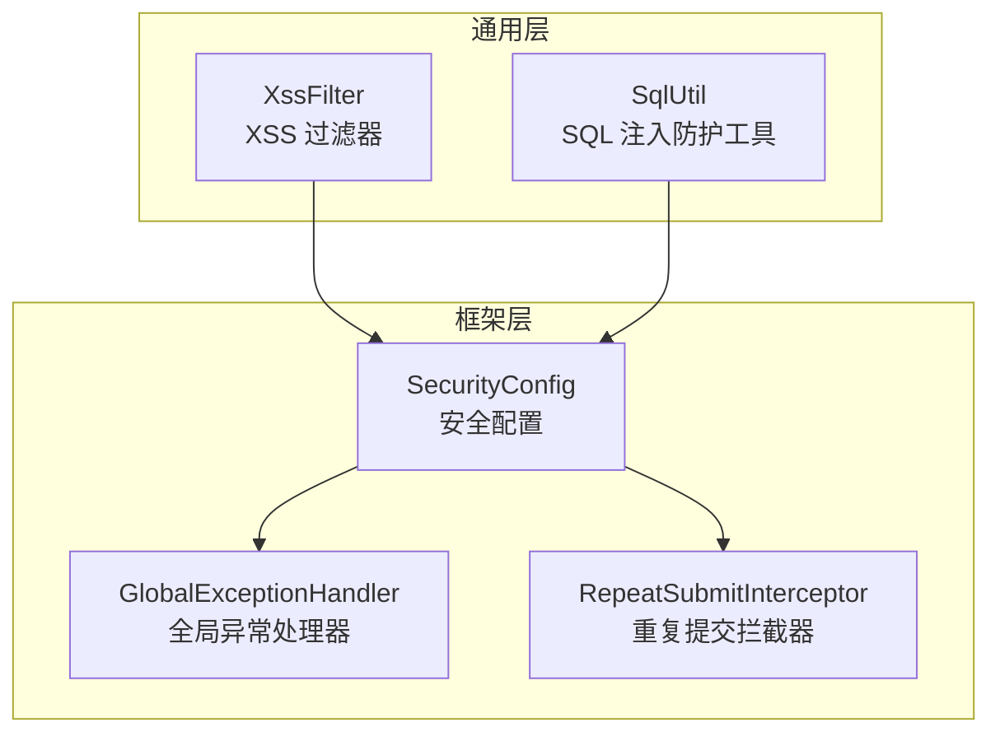
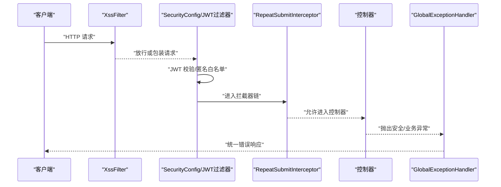
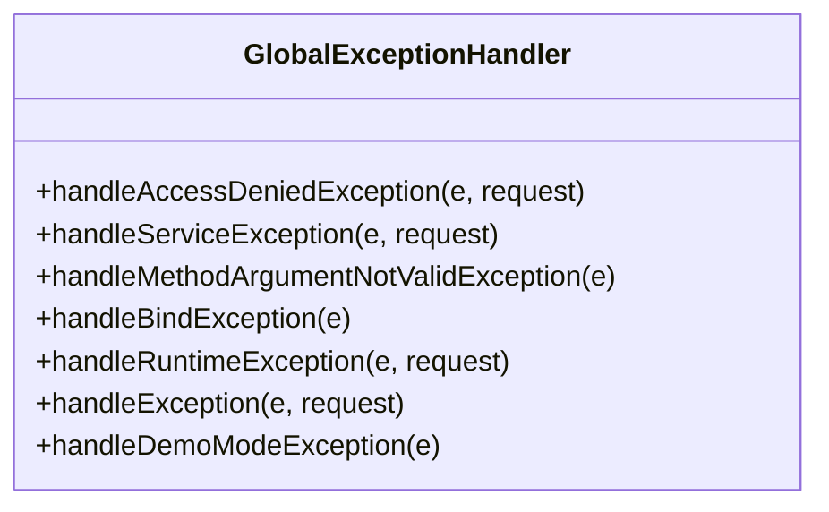
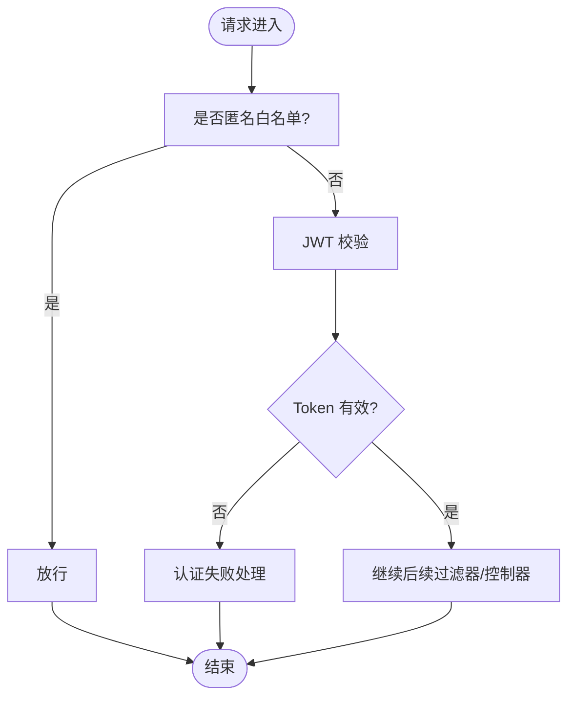
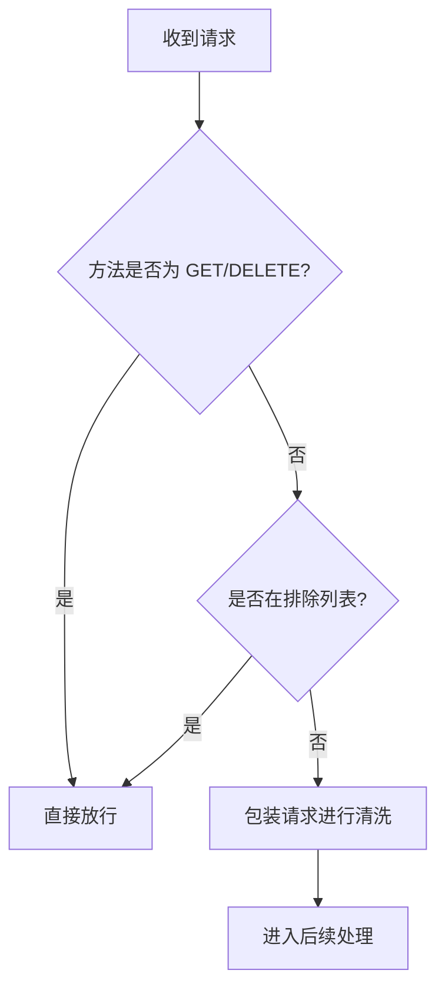
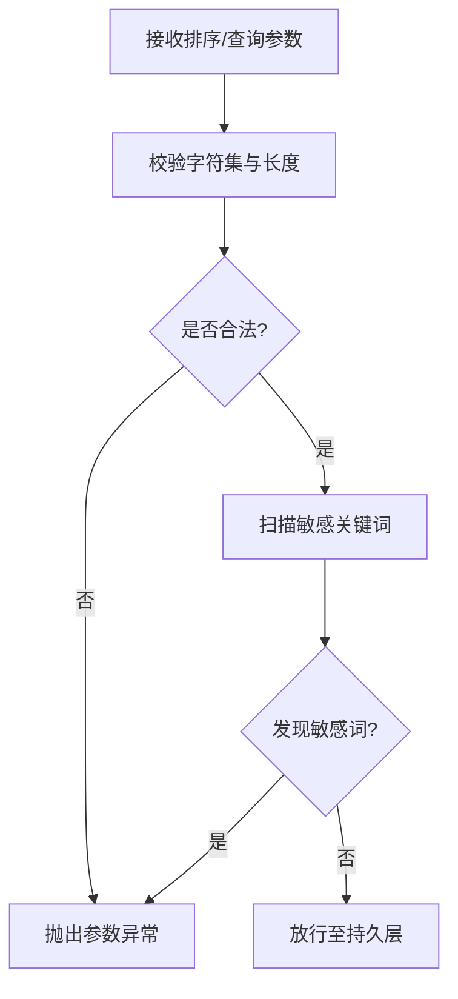
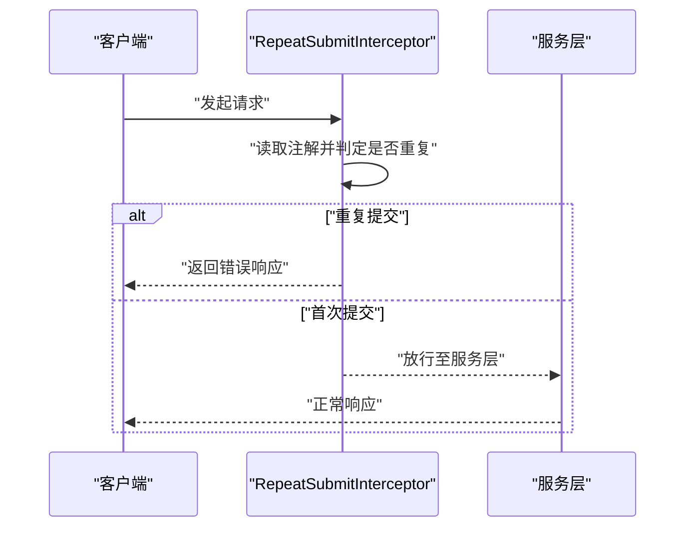
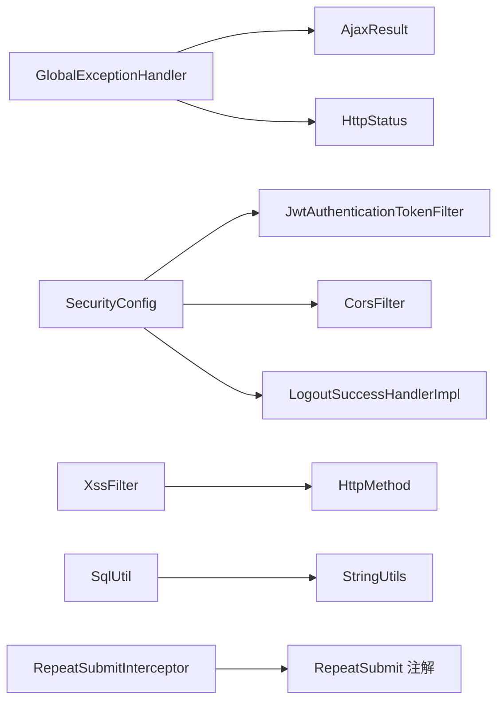

# 安全异常处理与防护

<cite>
**本文引用的文件**   
- [GlobalExceptionHandler.java](file://PezMax-Backend/ruoyi-framework/src/main/java/com/ruoyi/framework/web/exception/GlobalExceptionHandler.java)
- [SecurityConfig.java](file://PezMax-Backend/ruoyi-framework/src/main/java/com/ruoyi/framework/config/SecurityConfig.java)
- [XssFilter.java](file://PezMax-Backend/ruoyi-common/src/main/java/com/ruoyi/common/filter/XssFilter.java)
- [SqlUtil.java](file://PezMax-Backend/ruoyi-common/src/main/java/com/ruoyi/common/utils/sql/SqlUtil.java)
- [RepeatSubmitInterceptor.java](file://PezMax-Backend/ruoyi-framework/src/main/java/com/ruoyi/framework/interceptor/RepeatSubmitInterceptor.java)
</cite>

## 目录
1. [简介](#简介)
2. [项目结构](#项目结构)
3. [核心组件](#核心组件)
4. [架构总览](#架构总览)
5. [详细组件分析](#详细组件分析)
6. [依赖关系分析](#依赖关系分析)
7. [性能考虑](#性能考虑)
8. [故障排查指南](#故障排查指南)
9. [结论](#结论)
10. [附录](#附录)

## 简介
本文件聚焦于后端的安全异常处理与安全防护体系，围绕以下目标展开：
- 统一捕获和处理认证失败、权限不足、验证码错误等安全相关异常
- 全局异常处理器实现：异常分类、错误码定义与响应格式标准化
- 安全防护措施：XSS 攻击防护、SQL 注入防护、CSRF 防护、重放攻击防护的实现原理与实践
- 安全漏洞检测与修复的实践指南

## 项目结构
本项目采用分层模块化架构，安全能力主要分布在框架层与通用层：
- 框架层（ruoyi-framework）：负责 Spring Security 配置、全局异常处理、拦截器与过滤器集成
- 通用层（ruoyi-common）：提供 XSS 过滤、SQL 注入防护工具、通用响应体与常量等

图表来源
- [SecurityConfig.java:86-120](file://PezMax-Backend/ruoyi-framework/src/main/java/com/ruoyi/framework/config/SecurityConfig.java#L86-L120)
- [GlobalExceptionHandler.java:27-145](file://PezMax-Backend/ruoyi-framework/src/main/java/com/ruoyi/framework/web/exception/GlobalExceptionHandler.java#L27-L145)
- [XssFilter.java:22-75](file://PezMax-Backend/ruoyi-common/src/main/java/com/ruoyi/common/filter/XssFilter.java#L22-L75)
- [SqlUtil.java:11-72](file://PezMax-Backend/ruoyi-common/src/main/java/com/ruoyi/common/utils/sql/SqlUtil.java#L11-L72)
- [RepeatSubmitInterceptor.java:19-56](file://PezMax-Backend/ruoyi-framework/src/main/java/com/ruoyi/framework/interceptor/RepeatSubmitInterceptor.java#L19-L56)

章节来源
- [SecurityConfig.java:86-120](file://PezMax-Backend/ruoyi-framework/src/main/java/com/ruoyi/framework/config/SecurityConfig.java#L86-L120)
- [GlobalExceptionHandler.java:27-145](file://PezMax-Backend/ruoyi-framework/src/main/java/com/ruoyi/framework/web/exception/GlobalExceptionHandler.java#L27-L145)
- [XssFilter.java:22-75](file://PezMax-Backend/ruoyi-common/src/main/java/com/ruoyi/common/filter/XssFilter.java#L22-L75)
- [SqlUtil.java:11-72](file://PezMax-Backend/ruoyi-common/src/main/java/com/ruoyi/common/utils/sql/SqlUtil.java#L11-L72)
- [RepeatSubmitInterceptor.java:19-56](file://PezMax-Backend/ruoyi-framework/src/main/java/com/ruoyi/framework/interceptor/RepeatSubmitInterceptor.java#L19-L56)

## 核心组件
- 全局异常处理器：集中处理认证、鉴权、业务与服务异常，统一返回标准响应体
- 安全配置：基于无状态会话的 JWT 认证流程、匿名访问白名单、跨域与退出处理
- XSS 过滤器：对请求参数进行清洗，排除 GET/DELETE 与指定白名单路径
- SQL 注入防护工具：校验排序字段与敏感关键词，阻断常见注入模式
- 重复提交拦截器：通过注解控制幂等性，防止重放攻击

章节来源
- [GlobalExceptionHandler.java:27-145](file://PezMax-Backend/ruoyi-framework/src/main/java/com/ruoyi/framework/web/exception/GlobalExceptionHandler.java#L27-L145)
- [SecurityConfig.java:86-120](file://PezMax-Backend/ruoyi-framework/src/main/java/com/ruoyi/framework/config/SecurityConfig.java#L86-L120)
- [XssFilter.java:22-75](file://PezMax-Backend/ruoyi-common/src/main/java/com/ruoyi/common/filter/XssFilter.java#L22-L75)
- [SqlUtil.java:11-72](file://PezMax-Backend/ruoyi-common/src/main/java/com/ruoyi/common/utils/sql/SqlUtil.java#L11-L72)
- [RepeatSubmitInterceptor.java:19-56](file://PezMax-Backend/ruoyi-framework/src/main/java/com/ruoyi/framework/interceptor/RepeatSubmitInterceptor.java#L19-L56)

## 架构总览
下图展示了从请求进入、安全校验到异常处理的完整链路。

图表来源
- [XssFilter.java:44-68](file://PezMax-Backend/ruoyi-common/src/main/java/com/ruoyi/common/filter/XssFilter.java#L44-L68)
- [SecurityConfig.java:86-120](file://PezMax-Backend/ruoyi-framework/src/main/java/com/ruoyi/framework/config/SecurityConfig.java#L86-L120)
- [RepeatSubmitInterceptor.java:22-45](file://PezMax-Backend/ruoyi-framework/src/main/java/com/ruoyi/framework/interceptor/RepeatSubmitInterceptor.java#L22-L45)
- [GlobalExceptionHandler.java:35-145](file://PezMax-Backend/ruoyi-framework/src/main/java/com/ruoyi/framework/web/exception/GlobalExceptionHandler.java#L35-L145)

## 详细组件分析

### 全局异常处理器（统一安全异常处理）
- 职责
  - 统一捕获并处理认证失败、权限不足、方法不支持、参数绑定/校验异常、演示模式异常、运行时异常等
  - 将异常转换为统一的 AjaxResult 响应体，便于前端一致化处理
- 关键异常类型与处理策略
  - 权限不足：记录请求 URI 与错误信息，返回禁止访问提示
  - 业务异常：优先使用异常携带的错误码，否则返回默认错误码
  - 参数不匹配：清理输入值后返回友好提示
  - 未知运行时异常与系统异常：记录日志并返回通用错误
  - 演示模式：直接拒绝操作
- 建议扩展
  - 增加验证码错误、账号锁定、密码重试超限等安全类异常的专用处理器
  - 为不同异常类别定义更细粒度的错误码，便于前端差异化提示

图表来源
- [GlobalExceptionHandler.java:35-145](file://PezMax-Backend/ruoyi-framework/src/main/java/com/ruoyi/framework/web/exception/GlobalExceptionHandler.java#L35-L145)

章节来源
- [GlobalExceptionHandler.java:35-145](file://PezMax-Backend/ruoyi-framework/src/main/java/com/ruoyi/framework/web/exception/GlobalExceptionHandler.java#L35-L145)

### 安全配置（认证与授权）
- 无状态会话：禁用 CSRF，基于 Token 的无状态会话
- 匿名访问白名单：登录、注册、验证码、静态资源、文档与监控接口
- 认证失败处理：自定义未认证入口处理器
- 过滤器链顺序：CORS -> JWT -> Logout
- 密码加密：BCrypt 强哈希

图表来源
- [SecurityConfig.java:86-120](file://PezMax-Backend/ruoyi-framework/src/main/java/com/ruoyi/framework/config/SecurityConfig.java#L86-L120)

章节来源
- [SecurityConfig.java:86-120](file://PezMax-Backend/ruoyi-framework/src/main/java/com/ruoyi/framework/config/SecurityConfig.java#L86-L120)

### XSS 攻击防护
- 过滤策略
  - 仅对非 GET/DELETE 的请求进行参数清洗
  - 支持通过初始化参数配置排除路径
  - 使用包装请求对象对参数进行清洗后再进入后续处理
- 适用场景
  - 表单提交、文件上传元数据、富文本以外的普通文本输入
- 注意事项
  - 对于需要保留 HTML 的场景，应结合输出端转义与内容白名单策略

图表来源
- [XssFilter.java:44-68](file://PezMax-Backend/ruoyi-common/src/main/java/com/ruoyi/common/filter/XssFilter.java#L44-L68)

章节来源
- [XssFilter.java:22-75](file://PezMax-Backend/ruoyi-common/src/main/java/com/ruoyi/common/filter/XssFilter.java#L22-L75)

### SQL 注入防护
- 防护手段
  - 限制排序字段字符集与长度，避免拼接非法 SQL
  - 关键字黑名单检查，识别常见注入片段
- 使用建议
  - 所有用户可控的排序、查询条件均应经 SqlUtil 校验
  - 数据库连接层使用预编译语句，避免字符串拼接

图表来源
- [SqlUtil.java:31-70](file://PezMax-Backend/ruoyi-common/src/main/java/com/ruoyi/common/utils/sql/SqlUtil.java#L31-L70)

章节来源
- [SqlUtil.java:11-72](file://PezMax-Backend/ruoyi-common/src/main/java/com/ruoyi/common/utils/sql/SqlUtil.java#L11-L72)

### 重复提交与重放攻击防护
- 机制
  - 通过注解标记需防重复提交的接口
  - 在拦截器中根据具体实现判断是否重复提交，若重复则直接返回错误响应
- 实践建议
  - 针对写操作接口添加防重复注解
  - 结合唯一键、幂等令牌或分布式锁进一步保障一致性

图表来源
- [RepeatSubmitInterceptor.java:22-45](file://PezMax-Backend/ruoyi-framework/src/main/java/com/ruoyi/framework/interceptor/RepeatSubmitInterceptor.java#L22-L45)

章节来源
- [RepeatSubmitInterceptor.java:19-56](file://PezMax-Backend/ruoyi-framework/src/main/java/com/ruoyi/framework/interceptor/RepeatSubmitInterceptor.java#L19-L56)

## 依赖关系分析
- 全局异常处理器依赖统一响应体与 HTTP 状态码常量
- 安全配置依赖 JWT 过滤器、跨域过滤器与匿名访问白名单属性
- XSS 过滤器依赖 HTTP 方法与排除路径配置
- SQL 注入工具依赖字符串工具与异常工具
- 重复提交拦截器依赖注解与统一响应体

图表来源
- [GlobalExceptionHandler.java:27-145](file://PezMax-Backend/ruoyi-framework/src/main/java/com/ruoyi/framework/web/exception/GlobalExceptionHandler.java#L27-L145)
- [SecurityConfig.java:86-120](file://PezMax-Backend/ruoyi-framework/src/main/java/com/ruoyi/framework/config/SecurityConfig.java#L86-L120)
- [XssFilter.java:22-75](file://PezMax-Backend/ruoyi-common/src/main/java/com/ruoyi/common/filter/XssFilter.java#L22-L75)
- [SqlUtil.java:11-72](file://PezMax-Backend/ruoyi-common/src/main/java/com/ruoyi/common/utils/sql/SqlUtil.java#L11-L72)
- [RepeatSubmitInterceptor.java:19-56](file://PezMax-Backend/ruoyi-framework/src/main/java/com/ruoyi/framework/interceptor/RepeatSubmitInterceptor.java#L19-L56)

章节来源
- [GlobalExceptionHandler.java:27-145](file://PezMax-Backend/ruoyi-framework/src/main/java/com/ruoyi/framework/web/exception/GlobalExceptionHandler.java#L27-L145)
- [SecurityConfig.java:86-120](file://PezMax-Backend/ruoyi-framework/src/main/java/com/ruoyi/framework/config/SecurityConfig.java#L86-L120)
- [XssFilter.java:22-75](file://PezMax-Backend/ruoyi-common/src/main/java/com/ruoyi/common/filter/XssFilter.java#L22-L75)
- [SqlUtil.java:11-72](file://PezMax-Backend/ruoyi-common/src/main/java/com/ruoyi/common/utils/sql/SqlUtil.java#L11-L72)
- [RepeatSubmitInterceptor.java:19-56](file://PezMax-Backend/ruoyi-framework/src/main/java/com/ruoyi/framework/interceptor/RepeatSubmitInterceptor.java#L19-L56)

## 性能考虑
- 全局异常处理：避免在异常分支中进行重型计算；尽量复用消息格式化逻辑
- XSS 过滤：仅在必要时包装请求，减少不必要的对象创建
- SQL 注入校验：正则与关键词扫描应在合理阈值内，避免过长参数导致性能问题
- 重复提交拦截：在高并发下建议使用高性能存储（如 Redis）作为去重依据

## 故障排查指南
- 认证失败
  - 现象：未携带或无效 Token 时返回未认证错误
  - 排查：确认 JWT 过滤器是否生效、白名单是否正确、Token 生成与校验逻辑
- 权限不足
  - 现象：访问受限接口返回禁止访问
  - 排查：检查角色/权限分配、接口注解与白名单配置
- 参数校验失败
  - 现象：返回参数不匹配或绑定异常
  - 排查：核对入参类型、校验注解与全局异常处理器返回信息
- XSS 误拦截
  - 现象：合法输入被清洗或拒绝
  - 排查：确认排除路径与方法策略，必要时调整过滤范围
- SQL 注入误报
  - 现象：合法排序或查询条件被拒绝
  - 排查：检查 SqlUtil 规则与业务输入规范，优化正则与关键词集合

章节来源
- [GlobalExceptionHandler.java:35-145](file://PezMax-Backend/ruoyi-framework/src/main/java/com/ruoyi/framework/web/exception/GlobalExceptionHandler.java#L35-L145)
- [SecurityConfig.java:86-120](file://PezMax-Backend/ruoyi-framework/src/main/java/com/ruoyi/framework/config/SecurityConfig.java#L86-L120)
- [XssFilter.java:44-68](file://PezMax-Backend/ruoyi-common/src/main/java/com/ruoyi/common/filter/XssFilter.java#L44-L68)
- [SqlUtil.java:31-70](file://PezMax-Backend/ruoyi-common/src/main/java/com/ruoyi/common/utils/sql/SqlUtil.java#L31-L70)

## 结论
本项目已具备较为完善的安全基础能力：全局异常统一处理、基于 JWT 的无状态认证、XSS 过滤、SQL 注入防护与重复提交拦截。建议在现有基础上进一步完善验证码错误、账号锁定等安全异常的统一处理，并结合审计日志与告警机制提升可观测性与风险处置效率。

## 附录
- 安全最佳实践清单
  - 对所有用户输入进行严格校验与最小化信任原则
  - 使用预编译语句与 ORM 参数绑定，杜绝 SQL 拼接
  - 对敏感信息进行脱敏与加密存储
  - 启用速率限制与防重放策略，保护关键接口
  - 定期开展安全扫描与渗透测试，及时修复漏洞