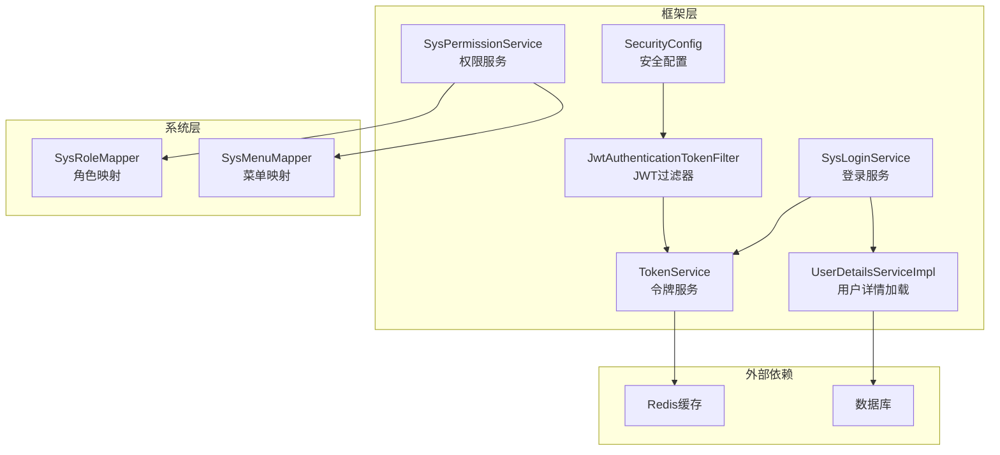
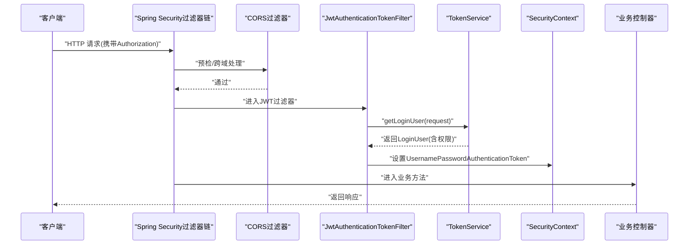
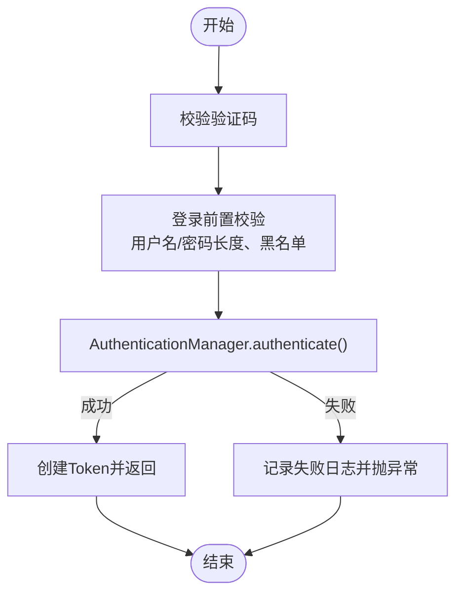
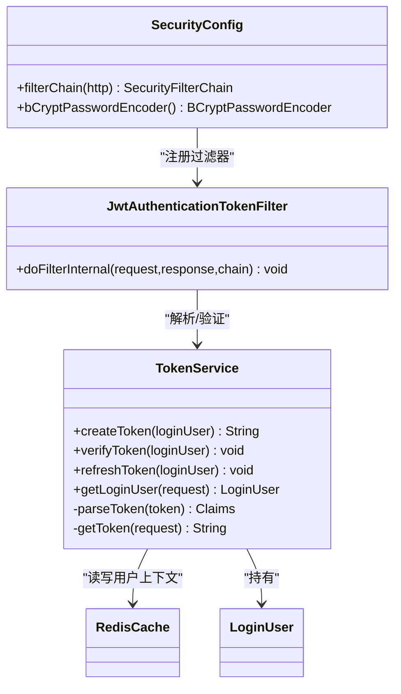
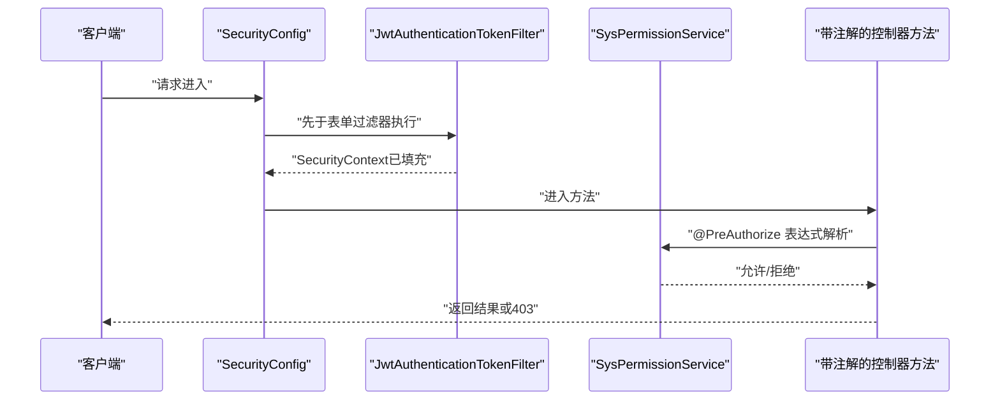
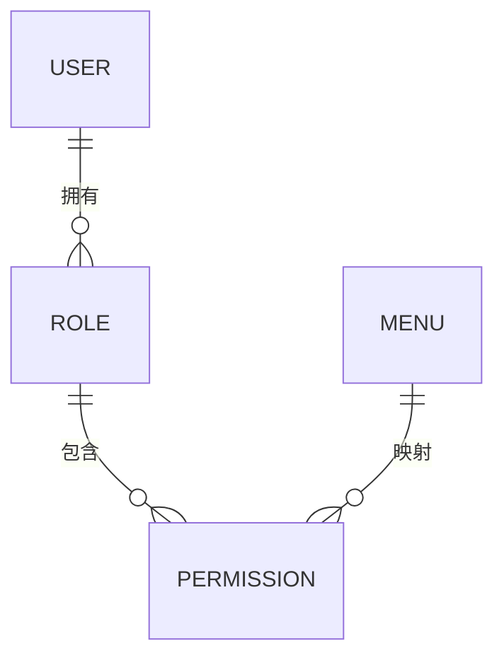
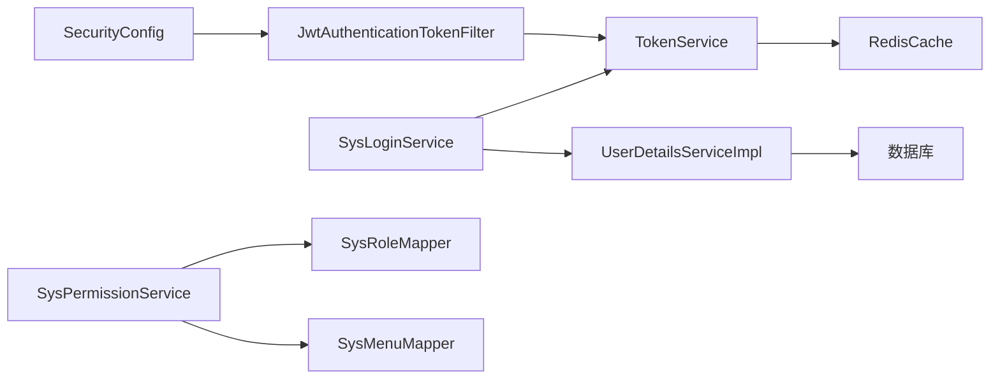

# 安全认证与授权

<cite>
**本文引用的文件**   
- [SecurityConfig.java](file://PezMax-Backend/ruoyi-framework/src/main/java/com/ruoyi/framework/config/SecurityConfig.java)
- [JwtAuthenticationTokenFilter.java](file://PezMax-Backend/ruoyi-framework/src/main/java/com/ruoyi/framework/security/filter/JwtAuthenticationTokenFilter.java)
- [TokenService.java](file://PezMax-Backend/ruoyi-framework/src/main/java/com/ruoyi/framework/web/service/TokenService.java)
- [SysLoginService.java](file://PezMax-Backend/ruoyi-framework/src/main/java/com/ruoyi/framework/web/service/SysLoginService.java)
- [UserDetailsServiceImpl.java](file://PezMax-Backend/ruoyi-framework/src/main/java/com/ruoyi/framework/web/service/UserDetailsServiceImpl.java)
- [SysPermissionService.java](file://PezMax-Backend/ruoyi-framework/src/main/java/com/ruoyi/framework/web/service/SysPermissionService.java)
- [SysRoleMapper.java](file://PezMax-Backend/ruoyi-system/src/main/java/com/ruoyi/system/mapper/SysRoleMapper.java)
- [SysMenuMapper.java](file://PezMax-Backend/ruoyi-system/src/main/java/com/ruoyi/system/mapper/SysMenuMapper.java)
</cite>

## 目录
1. [简介](#简介)
2. [项目结构](#项目结构)
3. [核心组件](#核心组件)
4. [架构总览](#架构总览)
5. [详细组件分析](#详细组件分析)
6. [依赖关系分析](#依赖关系分析)
7. [性能与安全特性](#性能与安全特性)
8. [故障排查指南](#故障排查指南)
9. [结论](#结论)
10. [附录](#附录)

## 简介
本文件围绕基于 Spring Security + JWT 的无状态认证与授权体系，系统性解析用户登录流程、令牌生成与验证、权限拦截器实现原理，以及基于角色的访问控制（RBAC）模型。文档同时覆盖密码加密存储、会话管理策略、防重放攻击等安全实践，并提供自定义认证逻辑扩展点与权限注解使用方式说明，帮助读者快速理解并落地生产级安全方案。

## 项目结构
本项目采用模块化分层：
- 框架层（ruoyi-framework）：承载 Spring Security 配置、JWT 过滤器、Token 服务、登录校验、权限服务等通用能力。
- 系统层（ruoyi-system）：提供 RBAC 数据访问接口（角色、菜单等）。
- 业务模块（ptmj-datum 等）：面向具体业务的领域对象与服务。
- 前端（ruoyi-ui / PezMax-Desktop）：负责调用后端认证接口、维护本地 Token 并在请求头携带。

图表来源
- [SecurityConfig.java:86-120](file://PezMax-Backend/ruoyi-framework/src/main/java/com/ruoyi/framework/config/SecurityConfig.java#L86-L120)
- [JwtAuthenticationTokenFilter.java:31-43](file://PezMax-Backend/ruoyi-framework/src/main/java/com/ruoyi/framework/security/filter/JwtAuthenticationTokenFilter.java#L31-L43)
- [TokenService.java:62-83](file://PezMax-Backend/ruoyi-framework/src/main/java/com/ruoyi/framework/web/service/TokenService.java#L62-L83)
- [SysLoginService.java:63-100](file://PezMax-Backend/ruoyi-framework/src/main/java/com/ruoyi/framework/web/service/SysLoginService.java#L63-L100)
- [SysPermissionService.java](file://PezMax-Backend/ruoyi-framework/src/main/java/com/ruoyi/framework/web/service/SysPermissionService.java)
- [SysRoleMapper.java](file://PezMax-Backend/ruoyi-system/src/main/java/com/ruoyi/system/mapper/SysRoleMapper.java)
- [SysMenuMapper.java](file://PezMax-Backend/ruoyi-system/src/main/java/com/ruoyi/system/mapper/SysMenuMapper.java)

章节来源
- [SecurityConfig.java:86-120](file://PezMax-Backend/ruoyi-framework/src/main/java/com/ruoyi/framework/config/SecurityConfig.java#L86-L120)
- [JwtAuthenticationTokenFilter.java:31-43](file://PezMax-Backend/ruoyi-framework/src/main/java/com/ruoyi/framework/security/filter/JwtAuthenticationTokenFilter.java#L31-L43)
- [TokenService.java:62-83](file://PezMax-Backend/ruoyi-framework/src/main/java/com/ruoyi/framework/web/service/TokenService.java#L62-L83)
- [SysLoginService.java:63-100](file://PezMax-Backend/ruoyi-framework/src/main/java/com/ruoyi/framework/web/service/SysLoginService.java#L63-L100)

## 核心组件
- 安全配置（SecurityConfig）
  - 禁用 CSRF、设置无状态会话、注册匿名白名单路径、注入 JWT 过滤器与退出处理器、启用方法级安全注解。
- JWT 过滤器（JwtAuthenticationTokenFilter）
  - 从请求头提取 Token，解析并加载用户信息到 SecurityContext，完成鉴权前置。
- 令牌服务（TokenService）
  - 负责创建、解析、刷新、删除 Token；将用户上下文持久化至 Redis；支持近过期自动续期。
- 登录服务（SysLoginService）
  - 验证码校验、登录前置检查、委托 AuthenticationManager 进行认证、记录登录日志、签发 Token。
- 用户详情服务（UserDetailsServiceImpl）
  - 根据用户名加载用户、角色与权限集合，供认证管理器校验密码与构建认证主体。
- 权限服务（SysPermissionService）
  - 提供权限判断能力，支撑 @PreAuthorize/@Secured 等方法级鉴权。

章节来源
- [SecurityConfig.java:86-120](file://PezMax-Backend/ruoyi-framework/src/main/java/com/ruoyi/framework/config/SecurityConfig.java#L86-L120)
- [JwtAuthenticationTokenFilter.java:31-43](file://PezMax-Backend/ruoyi-framework/src/main/java/com/ruoyi/framework/security/filter/JwtAuthenticationTokenFilter.java#L31-L43)
- [TokenService.java:114-125](file://PezMax-Backend/ruoyi-framework/src/main/java/com/ruoyi/framework/web/service/TokenService.java#L114-L125)
- [SysLoginService.java:63-100](file://PezMax-Backend/ruoyi-framework/src/main/java/com/ruoyi/framework/web/service/SysLoginService.java#L63-L100)
- [UserDetailsServiceImpl.java](file://PezMax-Backend/ruoyi-framework/src/main/java/com/ruoyi/framework/web/service/UserDetailsServiceImpl.java)
- [SysPermissionService.java](file://PezMax-Backend/ruoyi-framework/src/main/java/com/ruoyi/framework/web/service/SysPermissionService.java)

## 架构总览
下图展示一次受保护接口的完整调用链：客户端携带 Token 发起请求，CORS 过滤器放行后进入 JWT 过滤器，解析并填充 SecurityContext，随后由 Spring Security 基于方法注解或 URL 规则执行鉴权。

图表来源
- [SecurityConfig.java:114-118](file://PezMax-Backend/ruoyi-framework/src/main/java/com/ruoyi/framework/config/SecurityConfig.java#L114-L118)
- [JwtAuthenticationTokenFilter.java:31-43](file://PezMax-Backend/ruoyi-framework/src/main/java/com/ruoyi/framework/security/filter/JwtAuthenticationTokenFilter.java#L31-L43)
- [TokenService.java:62-83](file://PezMax-Backend/ruoyi-framework/src/main/java/com/ruoyi/framework/web/service/TokenService.java#L62-L83)

## 详细组件分析

### 用户登录流程（含验证码与黑名单）
- 入口：登录服务接收用户名、密码、验证码与唯一标识。
- 步骤：
  1) 验证码校验：若开启验证码，则从缓存读取并比对，失败记录日志并抛出异常。
  2) 登录前置校验：检查用户名/密码长度、IP 黑名单等。
  3) 认证：构造 UsernamePasswordAuthenticationToken，委托 AuthenticationManager 认证，内部会调用 UserDetailsServiceImpl 加载用户及权限。
  4) 成功：记录登录信息，生成并返回 Token。
  5) 失败：记录失败原因并抛出对应异常。

图表来源
- [SysLoginService.java:63-100](file://PezMax-Backend/ruoyi-framework/src/main/java/com/ruoyi/framework/web/service/SysLoginService.java#L63-L100)
- [SysLoginService.java:110-129](file://PezMax-Backend/ruoyi-framework/src/main/java/com/ruoyi/framework/web/service/SysLoginService.java#L110-L129)
- [SysLoginService.java:136-165](file://PezMax-Backend/ruoyi-framework/src/main/java/com/ruoyi/framework/web/service/SysLoginService.java#L136-L165)
- [UserDetailsServiceImpl.java](file://PezMax-Backend/ruoyi-framework/src/main/java/com/ruoyi/framework/web/service/UserDetailsServiceImpl.java)

章节来源
- [SysLoginService.java:63-100](file://PezMax-Backend/ruoyi-framework/src/main/java/com/ruoyi/framework/web/service/SysLoginService.java#L63-L100)
- [SysLoginService.java:110-129](file://PezMax-Backend/ruoyi-framework/src/main/java/com/ruoyi/framework/web/service/SysLoginService.java#L110-L129)
- [SysLoginService.java:136-165](file://PezMax-Backend/ruoyi-framework/src/main/java/com/ruoyi/framework/web/service/SysLoginService.java#L136-L165)

### 令牌生成与验证（无状态会话）
- 生成：
  - 为当前登录用户分配 UUID 作为 Token 值，写入 LoginUser 并记录 UA/IP/OS 等信息。
  - 将 LoginUser 以 key=LOGIN_TOKEN_KEY+uuid 的形式存入 Redis，过期时间等于 Token 有效期。
  - 使用 HS512 算法签名，Claims 中包含用户标识与用户名，返回 Token。
- 验证：
  - 过滤器从请求头按配置键获取 Token，去除前缀后解析 Claims。
  - 从 Redis 取出 LoginUser，若接近过期（剩余不足 20 分钟），则刷新过期时间并回写 Redis。
  - 将 UsernamePasswordAuthenticationToken 放入 SecurityContext，后续鉴权基于此上下文。
- 无状态设计：
  - 会话策略设置为 STATELESS，服务端不保存 Session，所有状态在 Redis 中维护。

图表来源
- [TokenService.java:114-125](file://PezMax-Backend/ruoyi-framework/src/main/java/com/ruoyi/framework/web/service/TokenService.java#L114-L125)
- [TokenService.java:133-141](file://PezMax-Backend/ruoyi-framework/src/main/java/com/ruoyi/framework/web/service/TokenService.java#L133-L141)
- [TokenService.java:148-155](file://PezMax-Backend/ruoyi-framework/src/main/java/com/ruoyi/framework/web/service/TokenService.java#L148-L155)
- [TokenService.java:62-83](file://PezMax-Backend/ruoyi-framework/src/main/java/com/ruoyi/framework/web/service/TokenService.java#L62-L83)
- [JwtAuthenticationTokenFilter.java:31-43](file://PezMax-Backend/ruoyi-framework/src/main/java/com/ruoyi/framework/security/filter/JwtAuthenticationTokenFilter.java#L31-L43)
- [SecurityConfig.java:86-120](file://PezMax-Backend/ruoyi-framework/src/main/java/com/ruoyi/framework/config/SecurityConfig.java#L86-L120)

章节来源
- [TokenService.java:114-125](file://PezMax-Backend/ruoyi-framework/src/main/java/com/ruoyi/framework/web/service/TokenService.java#L114-L125)
- [TokenService.java:133-141](file://PezMax-Backend/ruoyi-framework/src/main/java/com/ruoyi/framework/web/service/TokenService.java#L133-L141)
- [TokenService.java:148-155](file://PezMax-Backend/ruoyi-framework/src/main/java/com/ruoyi/framework/web/service/TokenService.java#L148-L155)
- [JwtAuthenticationTokenFilter.java:31-43](file://PezMax-Backend/ruoyi-framework/src/main/java/com/ruoyi/framework/security/filter/JwtAuthenticationTokenFilter.java#L31-L43)
- [SecurityConfig.java:86-120](file://PezMax-Backend/ruoyi-framework/src/main/java/com/ruoyi/framework/config/SecurityConfig.java#L86-L120)

### 权限拦截器与方法级鉴权
- URL 级鉴权：
  - 通过 permitAllUrl 白名单与静态资源放行，其余请求需认证。
- 方法级鉴权：
  - 启用 @EnableMethodSecurity，支持 @PreAuthorize、@Secured 等注解。
  - 权限判定依赖 SysPermissionService 提供的权限集合与表达式解析。
- 认证上下文：
  - 过滤器将包含 authorities 的 UsernamePasswordAuthenticationToken 置入 SecurityContext，供后续鉴权使用。

图表来源
- [SecurityConfig.java:86-120](file://PezMax-Backend/ruoyi-framework/src/main/java/com/ruoyi/framework/config/SecurityConfig.java#L86-L120)
- [JwtAuthenticationTokenFilter.java:31-43](file://PezMax-Backend/ruoyi-framework/src/main/java/com/ruoyi/framework/security/filter/JwtAuthenticationTokenFilter.java#L31-L43)
- [SysPermissionService.java](file://PezMax-Backend/ruoyi-framework/src/main/java/com/ruoyi/framework/web/service/SysPermissionService.java)

章节来源
- [SecurityConfig.java:86-120](file://PezMax-Backend/ruoyi-framework/src/main/java/com/ruoyi/framework/config/SecurityConfig.java#L86-L120)
- [SysPermissionService.java](file://PezMax-Backend/ruoyi-framework/src/main/java/com/ruoyi/framework/web/service/SysPermissionService.java)

### RBAC 模型（用户-角色-权限）
- 概念关系：
  - 用户拥有多个角色，角色关联多个权限（如菜单/按钮/接口标识）。
  - 权限通常以字符串形式（如“system:user:list”）参与表达式匹配。
- 数据访问：
  - 角色与菜单相关的数据访问通过 SysRoleMapper、SysMenuMapper 暴露。
- 权限装配：
  - UserDetailsServiceImpl 在加载用户时，查询其角色与权限，封装进 LoginUser 的 authorities，供方法级鉴权使用。

图表来源
- [SysRoleMapper.java](file://PezMax-Backend/ruoyi-system/src/main/java/com/ruoyi/system/mapper/SysRoleMapper.java)
- [SysMenuMapper.java](file://PezMax-Backend/ruoyi-system/src/main/java/com/ruoyi/system/mapper/SysMenuMapper.java)
- [UserDetailsServiceImpl.java](file://PezMax-Backend/ruoyi-framework/src/main/java/com/ruoyi/framework/web/service/UserDetailsServiceImpl.java)

章节来源
- [SysRoleMapper.java](file://PezMax-Backend/ruoyi-system/src/main/java/com/ruoyi/system/mapper/SysRoleMapper.java)
- [SysMenuMapper.java](file://PezMax-Backend/ruoyi-system/src/main/java/com/ruoyi/system/mapper/SysMenuMapper.java)
- [UserDetailsServiceImpl.java](file://PezMax-Backend/ruoyi-framework/src/main/java/com/ruoyi/framework/web/service/UserDetailsServiceImpl.java)

### 密码加密存储与校验
- 加密算法：
  - 使用 BCryptPasswordEncoder 进行强散列哈希加密。
- 校验过程：
  - 登录时由 AuthenticationManager 委托 UserDetailsService 加载用户，再与输入密码进行 BCrypt 校验。
- 建议：
  - 禁止明文存储密码；定期评估盐值与强度参数；对敏感操作二次确认。

章节来源
- [SecurityConfig.java:125-129](file://PezMax-Backend/ruoyi-framework/src/main/java/com/ruoyi/framework/config/SecurityConfig.java#L125-L129)
- [SysLoginService.java:70-90](file://PezMax-Backend/ruoyi-framework/src/main/java/com/ruoyi/framework/web/service/SysLoginService.java#L70-L90)

### 会话管理与续期策略
- 无状态会话：
  - 全局禁用 CSRF，会话策略设为 STATELESS，避免服务器端 Session 开销。
- 近过期续期：
  - 当 Token 剩余有效期小于 20 分钟时，自动刷新过期时间并更新 Redis 中的用户上下文，提升用户体验。
- 登出清理：
  - 登出时删除 Redis 中对应的用户上下文，使 Token 失效。

章节来源
- [SecurityConfig.java:88-98](file://PezMax-Backend/ruoyi-framework/src/main/java/com/ruoyi/framework/config/SecurityConfig.java#L88-L98)
- [TokenService.java:133-141](file://PezMax-Backend/ruoyi-framework/src/main/java/com/ruoyi/framework/web/service/TokenService.java#L133-L141)
- [TokenService.java:99-106](file://PezMax-Backend/ruoyi-framework/src/main/java/com/ruoyi/framework/web/service/TokenService.java#L99-L106)

### 防重放攻击与重复提交防护
- 请求级防重放（建议）：
  - 在网关或应用层引入一次性随机数（Nonce）、时间戳（Timestamp）与签名（Signature），服务端校验时间窗口与去重缓存。
- 重复提交拦截：
  - 通过 RepeatSubmitInterceptor 与 SameUrlDataInterceptor 防止短时间内重复提交相同数据。
- 验证码与黑名单：
  - 登录阶段强制验证码校验与 IP 黑名单限制，降低暴力破解与自动化攻击风险。

章节来源
- [SysLoginService.java:110-129](file://PezMax-Backend/ruoyi-framework/src/main/java/com/ruoyi/framework/web/service/SysLoginService.java#L110-L129)
- [SysLoginService.java:158-165](file://PezMax-Backend/ruoyi-framework/src/main/java/com/ruoyi/framework/web/service/SysLoginService.java#L158-L165)

### 自定义认证逻辑扩展点
- 自定义用户详情加载：
  - 实现 UserDetailsServiceImpl 的加载逻辑，按需扩展用户属性、动态权限计算。
- 自定义认证提供者：
  - 扩展 AuthenticationProvider，接入第三方认证源（如短信、OAuth、企业微信等）。
- 自定义鉴权决策：
  - 重写 AccessDecisionManager 或基于 @PreAuthorize 表达式结合 SysPermissionService 实现细粒度控制。
- 自定义退出与异常处理：
  - 替换 LogoutSuccessHandlerImpl 与 AuthenticationEntryPointImpl，统一返回格式与行为。

章节来源
- [UserDetailsServiceImpl.java](file://PezMax-Backend/ruoyi-framework/src/main/java/com/ruoyi/framework/web/service/UserDetailsServiceImpl.java)
- [SysPermissionService.java](file://PezMax-Backend/ruoyi-framework/src/main/java/com/ruoyi/framework/web/service/SysPermissionService.java)
- [SecurityConfig.java:96-118](file://PezMax-Backend/ruoyi-framework/src/main/java/com/ruoyi/framework/config/SecurityConfig.java#L96-L118)

### 权限注解使用方法
- 常用注解：
  - @PreAuthorize：在方法执行前进行权限表达式校验。
  - @Secured：基于角色名进行简单角色校验。
- 表达式示例（示意）：
  - 基于权限字符串：hasAuthority('system:user:add')
  - 基于角色：hasRole('admin')
- 注意事项：
  - 确保用户上下文中包含正确的 authorities；表达式中的权限字符串需与数据一致。

章节来源
- [SecurityConfig.java:27-27](file://PezMax-Backend/ruoyi-framework/src/main/java/com/ruoyi/framework/config/SecurityConfig.java#L27-L27)
- [SysPermissionService.java](file://PezMax-Backend/ruoyi-framework/src/main/java/com/ruoyi/framework/web/service/SysPermissionService.java)

## 依赖关系分析
- 组件耦合：
  - SecurityConfig 集中编排过滤器链与策略，低耦合高内聚。
  - JwtAuthenticationTokenFilter 仅依赖 TokenService，职责单一。
  - TokenService 依赖 RedisCache 与常量工具类，关注令牌生命周期。
  - SysLoginService 组合 TokenService、AuthenticationManager、UserService 等，承担登录编排。
- 外部依赖：
  - Redis：用于存储登录态与验证码。
  - 数据库：用户、角色、菜单等基础数据。
- 潜在循环依赖：
  - 当前结构未见明显循环依赖；如需扩展，注意保持单向依赖。

图表来源
- [SecurityConfig.java:86-120](file://PezMax-Backend/ruoyi-framework/src/main/java/com/ruoyi/framework/config/SecurityConfig.java#L86-L120)
- [JwtAuthenticationTokenFilter.java:31-43](file://PezMax-Backend/ruoyi-framework/src/main/java/com/ruoyi/framework/security/filter/JwtAuthenticationTokenFilter.java#L31-L43)
- [TokenService.java:62-83](file://PezMax-Backend/ruoyi-framework/src/main/java/com/ruoyi/framework/web/service/TokenService.java#L62-L83)
- [SysLoginService.java:63-100](file://PezMax-Backend/ruoyi-framework/src/main/java/com/ruoyi/framework/web/service/SysLoginService.java#L63-L100)
- [SysPermissionService.java](file://PezMax-Backend/ruoyi-framework/src/main/java/com/ruoyi/framework/web/service/SysPermissionService.java)
- [SysRoleMapper.java](file://PezMax-Backend/ruoyi-system/src/main/java/com/ruoyi/system/mapper/SysRoleMapper.java)
- [SysMenuMapper.java](file://PezMax-Backend/ruoyi-system/src/main/java/com/ruoyi/system/mapper/SysMenuMapper.java)

章节来源
- [SecurityConfig.java:86-120](file://PezMax-Backend/ruoyi-framework/src/main/java/com/ruoyi/framework/config/SecurityConfig.java#L86-L120)
- [JwtAuthenticationTokenFilter.java:31-43](file://PezMax-Backend/ruoyi-framework/src/main/java/com/ruoyi/framework/security/filter/JwtAuthenticationTokenFilter.java#L31-L43)
- [TokenService.java:62-83](file://PezMax-Backend/ruoyi-framework/src/main/java/com/ruoyi/framework/web/service/TokenService.java#L62-L83)
- [SysLoginService.java:63-100](file://PezMax-Backend/ruoyi-framework/src/main/java/com/ruoyi/framework/web/service/SysLoginService.java#L63-L100)

## 性能与安全特性
- 性能
  - 无状态设计减少服务器内存占用；Redis 缓存用户上下文，降低数据库压力。
  - 近过期续期减少频繁重新登录，提升用户体验。
- 安全
  - BCrypt 强散列密码存储；HS512 签名保证 Token 完整性。
  - 关闭 CSRF、严格白名单与匿名访问控制。
  - 登录阶段验证码与 IP 黑名单，有效抵御暴力破解与自动化攻击。
  - 建议在网关层增加请求签名与时间戳校验，增强防重放能力。

[本节为通用指导，无需源码引用]

## 故障排查指南
- 常见问题
  - 401 未认证：检查 Authorization 头是否携带正确前缀与 Token；确认 Redis 中是否存在对应用户上下文。
  - 403 无权限：检查用户 authorities 是否包含所需权限；确认 @PreAuthorize 表达式与权限字符串一致。
  - 登录失败：查看验证码是否过期、用户名/密码长度是否符合要求、IP 是否在黑名单。
- 定位手段
  - 观察登录日志（成功/失败）；核对 Redis 中验证码与用户上下文键值；检查 Token 签名与过期时间。
  - 针对重复提交问题，核查 RepeatSubmitInterceptor 与 SameUrlDataInterceptor 的配置与命中情况。

章节来源
- [SysLoginService.java:110-129](file://PezMax-Backend/ruoyi-framework/src/main/java/com/ruoyi/framework/web/service/SysLoginService.java#L110-L129)
- [SysLoginService.java:136-165](file://PezMax-Backend/ruoyi-framework/src/main/java/com/ruoyi/framework/web/service/SysLoginService.java#L136-L165)
- [TokenService.java:62-83](file://PezMax-Backend/ruoyi-framework/src/main/java/com/ruoyi/framework/web/service/TokenService.java#L62-L83)

## 结论
本项目基于 Spring Security + JWT 构建了无状态、可扩展的安全体系：通过过滤器链与 TokenService 实现统一的认证与续期，借助 RBAC 与方法级注解实现灵活的授权控制。配合 BCrypt 密码加密、验证码与黑名单机制，整体具备较好的安全性与可运维性。建议在网关层补充签名与时间戳校验，进一步完善防重放与抗攻击能力。

[本节为总结性内容，无需源码引用]

## 附录
- 关键配置项（示意）
  - token.header：请求头中 Token 的键名
  - token.secret：JWT 签名密钥
  - token.expireTime：Token 有效期（分钟）
- 扩展建议
  - 多租户场景下，可在 Claims 中附加租户标识，并在权限服务中做租户隔离。
  - 审计与风控：结合异步日志与风控规则，对异常登录与高频访问进行告警与阻断。

[本节为补充说明，无需源码引用]