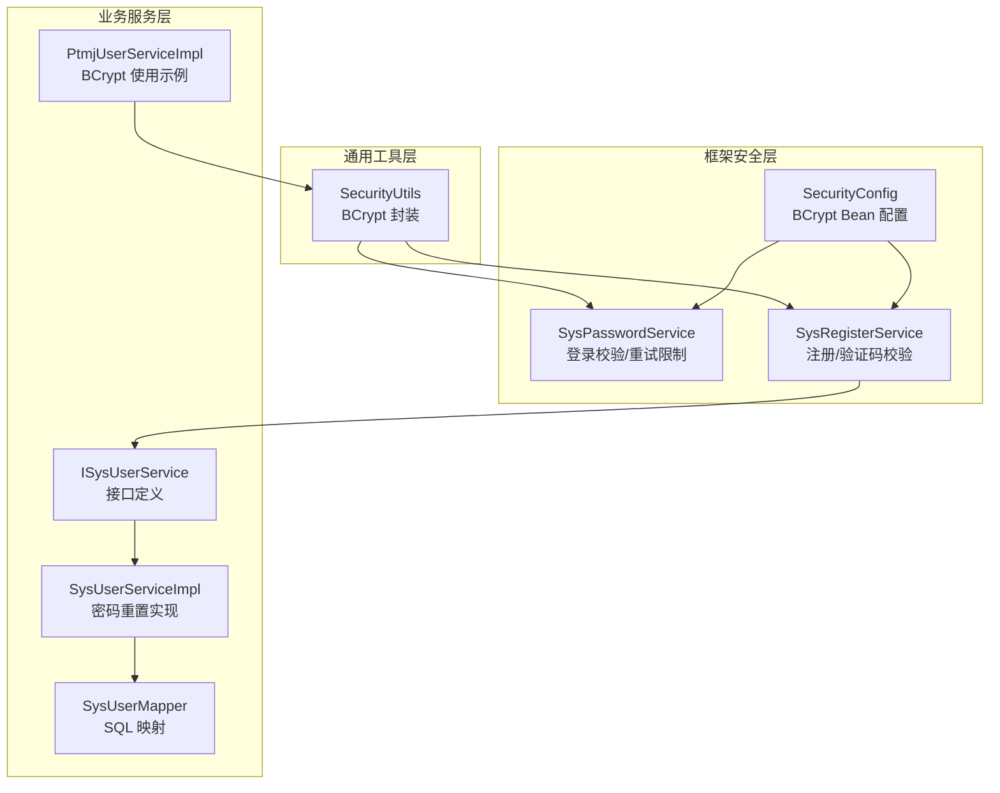
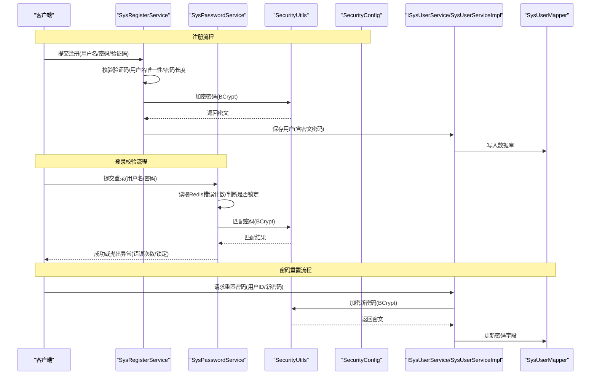
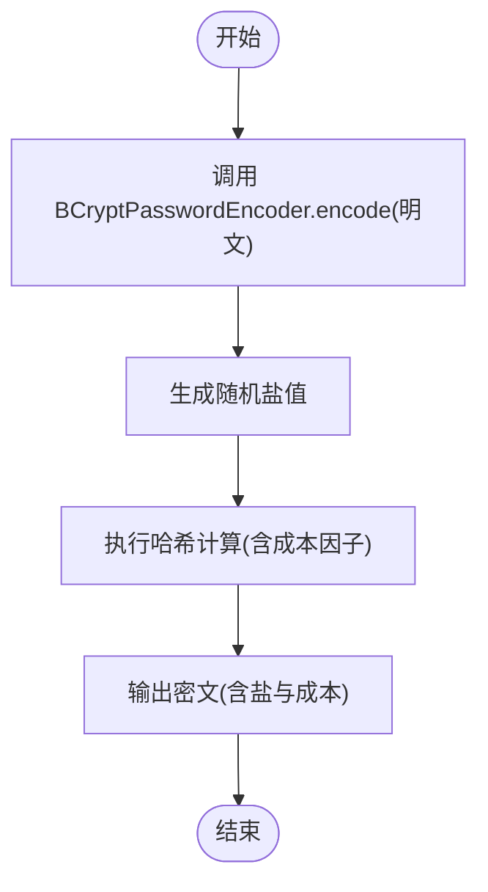
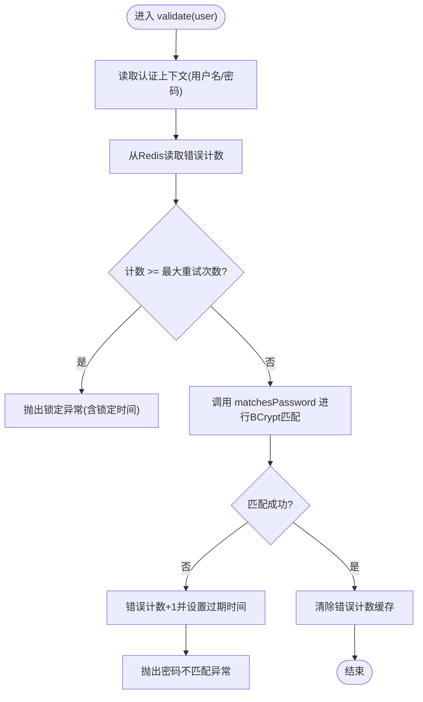
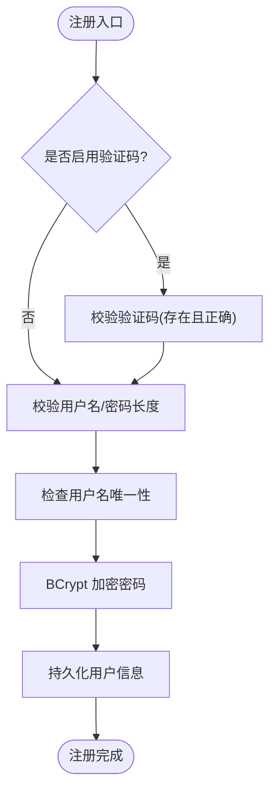
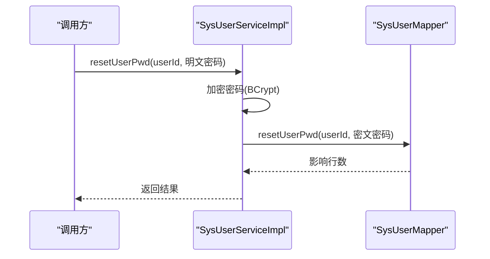
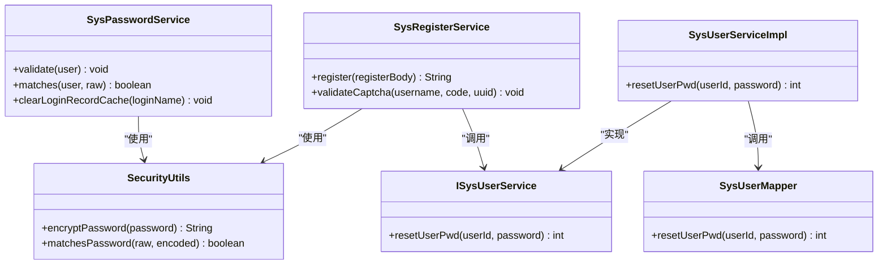

# 密码安全与加密存储

<cite>
**本文引用的文件**   
- [SysPasswordService.java](file://PezMax-Backend/ruoyi-framework/src/main/java/com/ruoyi/framework/web/service/SysPasswordService.java)
- [SysRegisterService.java](file://PezMax-Backend/ruoyi-framework/src/main/java/com/ruoyi/framework/web/service/SysRegisterService.java)
- [SecurityUtils.java](file://PezMax-Backend/ruoyi-common/src/main/java/com/ruoyi/common/utils/SecurityUtils.java)
- [SecurityConfig.java](file://PezMax-Backend/ruoyi-framework/src/main/java/com/ruoyi/framework/config/SecurityConfig.java)
- [ISysUserService.java](file://PezMax-Backend/ruoyi-system/src/main/java/com/ruoyi/system/service/ISysUserService.java)
- [SysUserServiceImpl.java](file://PezMax-Backend/ruoyi-system/src/main/java/com/ruoyi/system/service/impl/SysUserServiceImpl.java)
- [SysUserMapper.java](file://PezMax-Backend/ruoyi-system/src/main/java/com/ruoyi/system/mapper/SysUserMapper.java)
- [PtmjUserServiceImpl.java](file://PezMax-Backend/ptmj-datum/src/main/java/com/ptmj/datum/service/impl/PtmjUserServiceImpl.java)
</cite>

## 目录
1. [简介](#简介)
2. [项目结构](#项目结构)
3. [核心组件](#核心组件)
4. [架构总览](#架构总览)
5. [详细组件分析](#详细组件分析)
6. [依赖关系分析](#依赖关系分析)
7. [性能考量](#性能考量)
8. [故障排查指南](#故障排查指南)
9. [结论](#结论)
10. [附录](#附录)

## 简介
本文件聚焦于项目的密码安全与加密存储方案，围绕以下目标展开：
- 解析 BCrypt 密码加密算法的选择原因与实现细节（盐值生成、哈希计算、密码验证流程）
- 说明密码注册、重置、修改与登录验证的业务逻辑
- 文档化密码强度校验规则、历史密码检查与防暴力破解策略
- 提供密码安全的最佳实践（传输加密、存储安全、审计日志）

## 项目结构
本项目采用分层架构，密码相关能力分布在通用工具层、框架安全层与业务服务层：
- 通用工具层：提供 BCrypt 的封装方法（加密与匹配）
- 框架安全层：提供登录密码校验、重试限制、验证码校验等
- 业务服务层：提供用户注册、密码重置等具体业务流程

图表来源
- [SecurityUtils.java:92-115](file://PezMax-Backend/ruoyi-common/src/main/java/com/ruoyi/common/utils/SecurityUtils.java#L92-L115)
- [SysPasswordService.java:44-85](file://PezMax-Backend/ruoyi-framework/src/main/java/com/ruoyi/framework/web/service/SysPasswordService.java#L44-L85)
- [SysRegisterService.java:42-93](file://PezMax-Backend/ruoyi-framework/src/main/java/com/ruoyi/framework/web/service/SysRegisterService.java#L42-L93)
- [SecurityConfig.java:125-127](file://PezMax-Backend/ruoyi-framework/src/main/java/com/ruoyi/framework/config/SecurityConfig.java#L125-L127)
- [ISysUserService.java:189](file://PezMax-Backend/ruoyi-system/src/main/java/com/ruoyi/system/service/ISysUserService.java#L189)
- [SysUserServiceImpl.java:390-392](file://PezMax-Backend/ruoyi-system/src/main/java/com/ruoyi/system/service/impl/SysUserServiceImpl.java#L390-L392)
- [SysUserMapper.java:105](file://PezMax-Backend/ruoyi-system/src/main/java/com/ruoyi/system/mapper/SysUserMapper.java#L105)
- [PtmjUserServiceImpl.java:65-67](file://PezMax-Backend/ptmj-datum/src/main/java/com/ptmj/datum/service/impl/PtmjUserServiceImpl.java#L65-L67)

章节来源
- [SecurityUtils.java:92-115](file://PezMax-Backend/ruoyi-common/src/main/java/com/ruoyi/common/utils/SecurityUtils.java#L92-L115)
- [SysPasswordService.java:44-85](file://PezMax-Backend/ruoyi-framework/src/main/java/com/ruoyi/framework/web/service/SysPasswordService.java#L44-L85)
- [SysRegisterService.java:42-93](file://PezMax-Backend/ruoyi-framework/src/main/java/com/ruoyi/framework/web/service/SysRegisterService.java#L42-L93)
- [SecurityConfig.java:125-127](file://PezMax-Backend/ruoyi-framework/src/main/java/com/ruoyi/framework/config/SecurityConfig.java#L125-L127)
- [ISysUserService.java:189](file://PezMax-Backend/ruoyi-system/src/main/java/com/ruoyi/system/service/ISysUserService.java#L189)
- [SysUserServiceImpl.java:390-392](file://PezMax-Backend/ruoyi-system/src/main/java/com/ruoyi/system/service/impl/SysUserServiceImpl.java#L390-L392)
- [SysUserMapper.java:105](file://PezMax-Backend/ruoyi-system/src/main/java/com/ruoyi/system/mapper/SysUserMapper.java#L105)
- [PtmjUserServiceImpl.java:65-67](file://PezMax-Backend/ptmj-datum/src/main/java/com/ptmj/datum/service/impl/PtmjUserServiceImpl.java#L65-L67)

## 核心组件
- SecurityUtils：提供 BCrypt 的加密与匹配静态方法，内部通过 Spring Security 的 BCryptPasswordEncoder 完成工作。
- SysPasswordService：负责登录时的密码校验、错误次数统计与账户锁定控制，基于 Redis 缓存计数并支持可配置的最大重试次数与锁定时间。
- SysRegisterService：负责注册流程中的验证码校验、用户名唯一性检查、密码长度校验以及将明文密码加密后持久化。
- SecurityConfig：集中声明 BCryptPasswordEncoder Bean，确保全局一致的加密策略。
- ISysUserService / SysUserServiceImpl / SysUserMapper：提供密码重置接口与服务实现，最终通过 Mapper 更新数据库中的密码字段。
- PtmjUserServiceImpl：在特定业务场景中直接使用 BCryptPasswordEncoder 进行密码或密保答案的加密。

章节来源
- [SecurityUtils.java:92-115](file://PezMax-Backend/ruoyi-common/src/main/java/com/ruoyi/common/utils/SecurityUtils.java#L92-L115)
- [SysPasswordService.java:27-85](file://PezMax-Backend/ruoyi-framework/src/main/java/com/ruoyi/framework/web/service/SysPasswordService.java#L27-L85)
- [SysRegisterService.java:42-93](file://PezMax-Backend/ruoyi-framework/src/main/java/com/ruoyi/framework/web/service/SysRegisterService.java#L42-L93)
- [SecurityConfig.java:125-127](file://PezMax-Backend/ruoyi-framework/src/main/java/com/ruoyi/framework/config/SecurityConfig.java#L125-L127)
- [ISysUserService.java:189](file://PezMax-Backend/ruoyi-system/src/main/java/com/ruoyi/system/service/ISysUserService.java#L189)
- [SysUserServiceImpl.java:390-392](file://PezMax-Backend/ruoyi-system/src/main/java/com/ruoyi/system/service/impl/SysUserServiceImpl.java#L390-L392)
- [SysUserMapper.java:105](file://PezMax-Backend/ruoyi-system/src/main/java/com/ruoyi/system/mapper/SysUserMapper.java#L105)
- [PtmjUserServiceImpl.java:65-67](file://PezMax-Backend/ptmj-datum/src/main/java/com/ptmj/datum/service/impl/PtmjUserServiceImpl.java#L65-L67)

## 架构总览
下图展示了从前端到后端的核心密码处理链路，包括注册、登录校验与密码重置的关键路径。

图表来源
- [SysRegisterService.java:42-93](file://PezMax-Backend/ruoyi-framework/src/main/java/com/ruoyi/framework/web/service/SysRegisterService.java#L42-L93)
- [SecurityUtils.java:92-115](file://PezMax-Backend/ruoyi-common/src/main/java/com/ruoyi/common/utils/SecurityUtils.java#L92-L115)
- [SysPasswordService.java:44-85](file://PezMax-Backend/ruoyi-framework/src/main/java/com/ruoyi/framework/web/service/SysPasswordService.java#L44-L85)
- [ISysUserService.java:189](file://PezMax-Backend/ruoyi-system/src/main/java/com/ruoyi/system/service/ISysUserService.java#L189)
- [SysUserServiceImpl.java:390-392](file://PezMax-Backend/ruoyi-system/src/main/java/com/ruoyi/system/service/impl/SysUserServiceImpl.java#L390-L392)
- [SysUserMapper.java:105](file://PezMax-Backend/ruoyi-system/src/main/java/com/ruoyi/system/mapper/SysUserMapper.java#L105)

## 详细组件分析

### BCrypt 密码加密与验证
- 选择原因
  - BCrypt 内置随机盐值，避免彩虹表攻击
  - 自适应成本因子，便于随硬件升级调整计算开销
  - 成熟稳定，Spring Security 原生支持
- 实现细节
  - 加密：SecurityUtils.encryptPassword 调用 BCryptPasswordEncoder.encode，自动生成盐值并输出包含盐与成本的密文字符串
  - 验证：SecurityUtils.matchesPassword 调用 BCryptPasswordEncoder.matches，从密文中提取盐与成本进行比对
  - 全局配置：SecurityConfig 中声明 BCryptPasswordEncoder Bean，保证一致性与可测试性
- 复杂度与安全性
  - 时间复杂度由成本因子决定，可通过配置提升以抵御暴力破解
  - 空间复杂度为常数级（密文固定格式）
  - 抗碰撞与抗预计算能力强，适合长期存储

图表来源
- [SecurityUtils.java:92-102](file://PezMax-Backend/ruoyi-common/src/main/java/com/ruoyi/common/utils/SecurityUtils.java#L92-L102)
- [SecurityConfig.java:125-127](file://PezMax-Backend/ruoyi-framework/src/main/java/com/ruoyi/framework/config/SecurityConfig.java#L125-L127)

章节来源
- [SecurityUtils.java:92-115](file://PezMax-Backend/ruoyi-common/src/main/java/com/ruoyi/common/utils/SecurityUtils.java#L92-L115)
- [SecurityConfig.java:125-127](file://PezMax-Backend/ruoyi-framework/src/main/java/com/ruoyi/framework/config/SecurityConfig.java#L125-L127)

### 登录密码校验与防暴力破解
- 校验流程
  - 从认证上下文获取用户名与明文密码
  - 读取 Redis 中该用户的错误尝试次数
  - 若达到最大重试次数，抛出“超过重试上限”异常并携带锁定时间
  - 否则调用 SecurityUtils.matchesPassword 进行 BCrypt 匹配
  - 失败则递增错误计数并设置过期时间；成功则清除错误计数
- 关键配置
  - user.password.maxRetryCount：最大重试次数
  - user.password.lockTime：锁定时间（分钟）
- 风险缓解
  - 通过 Redis 计数与过期机制防止瞬时爆破
  - 结合验证码与账号锁定进一步降低自动化攻击成功率

图表来源
- [SysPasswordService.java:44-85](file://PezMax-Backend/ruoyi-framework/src/main/java/com/ruoyi/framework/web/service/SysPasswordService.java#L44-L85)
- [SecurityUtils.java:111-115](file://PezMax-Backend/ruoyi-common/src/main/java/com/ruoyi/common/utils/SecurityUtils.java#L111-L115)

章节来源
- [SysPasswordService.java:27-85](file://PezMax-Backend/ruoyi-framework/src/main/java/com/ruoyi/framework/web/service/SysPasswordService.java#L27-L85)
- [SecurityUtils.java:111-115](file://PezMax-Backend/ruoyi-common/src/main/java/com/ruoyi/common/utils/SecurityUtils.java#L111-L115)

### 注册与密码强度校验
- 注册流程
  - 可选开启验证码校验（基于 Redis 的验证码键值对）
  - 校验用户名与密码非空及长度范围
  - 检查用户名唯一性
  - 使用 SecurityUtils.encryptPassword 对密码进行 BCrypt 加密后保存
- 密码强度规则
  - 当前实现仅做长度约束（最小/最大长度），未包含字符集复杂度要求
  - 建议后续扩展：大小写字母、数字、特殊字符组合，以及常见弱口令黑名单

图表来源
- [SysRegisterService.java:42-93](file://PezMax-Backend/ruoyi-framework/src/main/java/com/ruoyi/framework/web/service/SysRegisterService.java#L42-L93)
- [SecurityUtils.java:92-102](file://PezMax-Backend/ruoyi-common/src/main/java/com/ruoyi/common/utils/SecurityUtils.java#L92-L102)

章节来源
- [SysRegisterService.java:42-93](file://PezMax-Backend/ruoyi-framework/src/main/java/com/ruoyi/framework/web/service/SysRegisterService.java#L42-L93)
- [SecurityUtils.java:92-102](file://PezMax-Backend/ruoyi-common/src/main/java/com/ruoyi/common/utils/SecurityUtils.java#L92-L102)

### 密码重置与修改
- 接口与服务
  - ISysUserService 定义 resetUserPwd(userId, password)
  - SysUserServiceImpl 实现该方法，调用 Mapper 更新数据库
- 数据流
  - 调用方在服务层对明文密码进行 BCrypt 加密
  - 通过 SysUserMapper.resetUserPwd 执行 SQL 更新
- 注意
  - 请确保传入的密码已在服务层完成加密，避免明文落库

图表来源
- [ISysUserService.java:189](file://PezMax-Backend/ruoyi-system/src/main/java/com/ruoyi/system/service/ISysUserService.java#L189)
- [SysUserServiceImpl.java:390-392](file://PezMax-Backend/ruoyi-system/src/main/java/com/ruoyi/system/service/impl/SysUserServiceImpl.java#L390-L392)
- [SysUserMapper.java:105](file://PezMax-Backend/ruoyi-system/src/main/java/com/ruoyi/system/mapper/SysUserMapper.java#L105)

章节来源
- [ISysUserService.java:189](file://PezMax-Backend/ruoyi-system/src/main/java/com/ruoyi/system/service/ISysUserService.java#L189)
- [SysUserServiceImpl.java:390-392](file://PezMax-Backend/ruoyi-system/src/main/java/com/ruoyi/system/service/impl/SysUserServiceImpl.java#L390-L392)
- [SysUserMapper.java:105](file://PezMax-Backend/ruoyi-system/src/main/java/com/ruoyi/system/mapper/SysUserMapper.java#L105)

### 业务场景中的 BCrypt 使用示例
- PtmjUserServiceImpl 在特定业务中注入并使用 BCryptPasswordEncoder，用于密码或密保答案的加密，体现统一的安全策略在多模块复用。

章节来源
- [PtmjUserServiceImpl.java:65-67](file://PezMax-Backend/ptmj-datum/src/main/java/com/ptmj/datum/service/impl/PtmjUserServiceImpl.java#L65-L67)

## 依赖关系分析
- 组件耦合
  - SecurityUtils 被 SysPasswordService 与 SysRegisterService 共同依赖，形成松耦合的加密能力中心
  - SysPasswordService 依赖 RedisCache 进行错误计数与锁定管理
  - SysRegisterService 依赖 ISysUserService 完成用户注册
  - SysUserServiceImpl 依赖 SysUserMapper 完成密码更新
- 外部依赖
  - Spring Security 的 BCryptPasswordEncoder 作为底层加密实现
  - Redis 作为分布式错误计数与验证码存储介质

图表来源
- [SecurityUtils.java:92-115](file://PezMax-Backend/ruoyi-common/src/main/java/com/ruoyi/common/utils/SecurityUtils.java#L92-L115)
- [SysPasswordService.java:44-85](file://PezMax-Backend/ruoyi-framework/src/main/java/com/ruoyi/framework/web/service/SysPasswordService.java#L44-L85)
- [SysRegisterService.java:42-93](file://PezMax-Backend/ruoyi-framework/src/main/java/com/ruoyi/framework/web/service/SysRegisterService.java#L42-L93)
- [ISysUserService.java:189](file://PezMax-Backend/ruoyi-system/src/main/java/com/ruoyi/system/service/ISysUserService.java#L189)
- [SysUserServiceImpl.java:390-392](file://PezMax-Backend/ruoyi-system/src/main/java/com/ruoyi/system/service/impl/SysUserServiceImpl.java#L390-L392)
- [SysUserMapper.java:105](file://PezMax-Backend/ruoyi-system/src/main/java/com/ruoyi/system/mapper/SysUserMapper.java#L105)

章节来源
- [SecurityUtils.java:92-115](file://PezMax-Backend/ruoyi-common/src/main/java/com/ruoyi/common/utils/SecurityUtils.java#L92-L115)
- [SysPasswordService.java:44-85](file://PezMax-Backend/ruoyi-framework/src/main/java/com/ruoyi/framework/web/service/SysPasswordService.java#L44-L85)
- [SysRegisterService.java:42-93](file://PezMax-Backend/ruoyi-framework/src/main/java/com/ruoyi/framework/web/service/SysRegisterService.java#L42-L93)
- [ISysUserService.java:189](file://PezMax-Backend/ruoyi-system/src/main/java/com/ruoyi/system/service/ISysUserService.java#L189)
- [SysUserServiceImpl.java:390-392](file://PezMax-Backend/ruoyi-system/src/main/java/com/ruoyi/system/service/impl/SysUserServiceImpl.java#L390-L392)
- [SysUserMapper.java:105](file://PezMax-Backend/ruoyi-system/src/main/java/com/ruoyi/system/mapper/SysUserMapper.java#L105)

## 性能考量
- BCrypt 成本因子
  - 根据服务器 CPU 能力与合规要求调优，平衡用户体验与安全强度
- 登录校验路径
  - 每次登录均触发一次 BCrypt 匹配，建议在热点路径上避免重复创建编码器实例（当前 SecurityUtils 每次调用新建实例，可考虑优化为单例或共享 Bean）
- 缓存与锁
  - 使用 Redis 记录错误次数与验证码，需关注缓存命中率与过期策略
  - 合理设置锁定时间与最大重试次数，避免误伤正常用户

[本节为通用指导，无需源码引用]

## 故障排查指南
- 登录频繁失败导致锁定
  - 检查 user.password.maxRetryCount 与 user.password.lockTime 配置
  - 确认 Redis 中对应键是否存在且未提前过期
  - 核对 SecurityUtils.matchesPassword 的输入是否为明文与密文的正确配对
- 注册失败
  - 检查验证码开关与 Redis 中验证码键值是否正确
  - 确认用户名唯一性校验与长度规则是否符合预期
- 密码重置无效
  - 确认服务层已对明文密码进行 BCrypt 加密后再调用 Mapper
  - 检查 Mapper 的 SQL 是否覆盖正确的用户记录

章节来源
- [SysPasswordService.java:27-85](file://PezMax-Backend/ruoyi-framework/src/main/java/com/ruoyi/framework/web/service/SysPasswordService.java#L27-L85)
- [SysRegisterService.java:42-93](file://PezMax-Backend/ruoyi-framework/src/main/java/com/ruoyi/framework/web/service/SysRegisterService.java#L42-L93)
- [SysUserServiceImpl.java:390-392](file://PezMax-Backend/ruoyi-system/src/main/java/com/ruoyi/system/service/impl/SysUserServiceImpl.java#L390-L392)

## 结论
- 本项目采用 BCrypt 作为密码存储算法，具备自动盐值与抗彩虹表能力，并通过 SecurityUtils 统一封装
- 登录路径引入基于 Redis 的错误计数与锁定机制，有效缓解暴力破解
- 注册流程包含验证码与长度校验，但尚未实现复杂的密码强度规则与历史密码检查
- 建议后续完善：
  - 密码强度规则（字符集复杂度、弱口令黑名单）
  - 历史密码检查（禁止近期重复使用）
  - 统一的 BCrypt 编码器 Bean 复用，减少对象创建开销
  - 全链路审计日志（注册、登录、重置等关键事件）

[本节为总结，无需源码引用]

## 附录
- 传输加密
  - 全站强制 HTTPS，禁用明文 HTTP
  - 敏感头与 Cookie 设置 Secure、HttpOnly、SameSite
- 存储安全
  - 仅存储 BCrypt 密文，禁止明文或可逆加密
  - 数据库字段使用足够长度的字符串类型，避免截断
- 审计日志
  - 记录注册、登录成功/失败、密码重置等关键操作的用户标识、IP、时间戳与结果
  - 日志脱敏，避免记录明文密码或完整令牌

[本节为通用指导，无需源码引用]