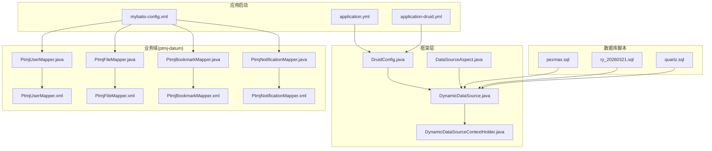
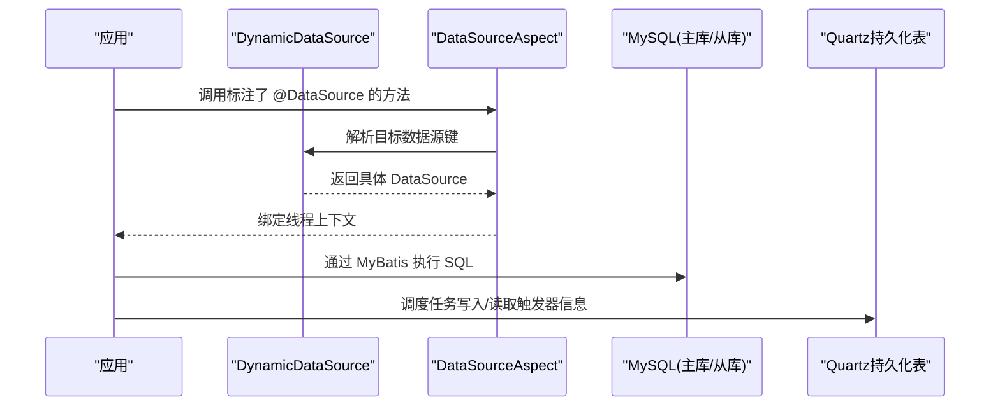
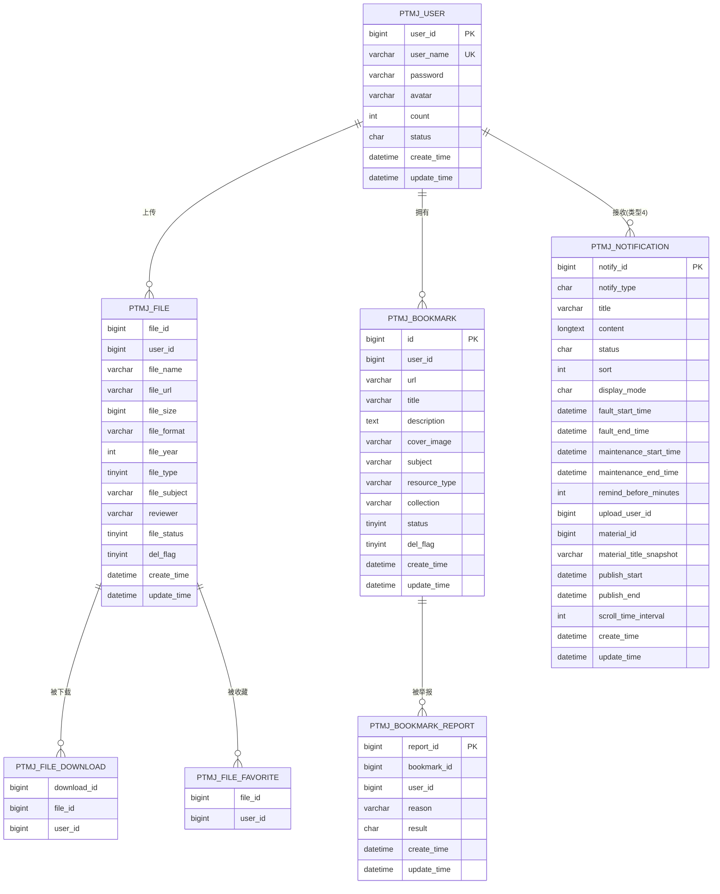
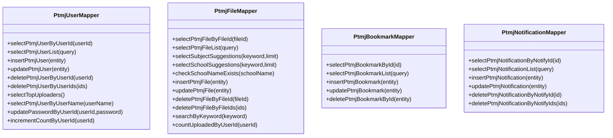
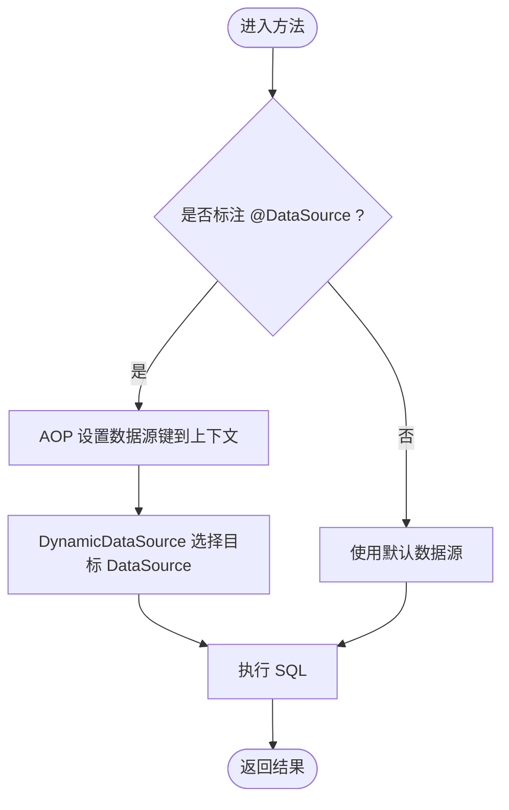
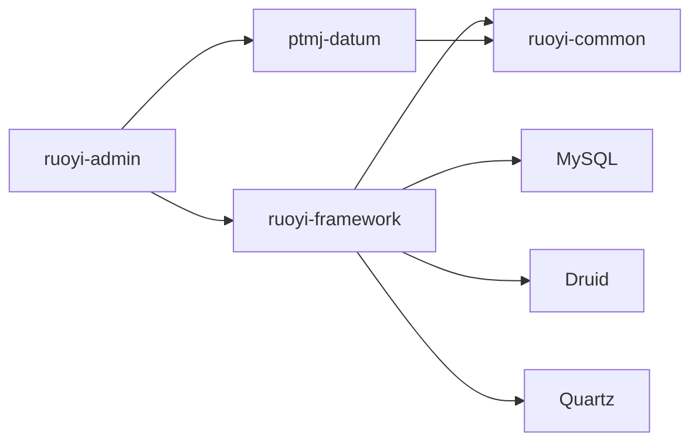

# 数据库设计与操作

<cite>
**本文引用的文件**
- [pezmax.sql](file://PezMax-Backend/sql/pezmax.sql)
- [ry_20260321.sql](file://PezMax-Backend/sql/ry_20260321.sql)
- [quartz.sql](file://PezMax-Backend/sql/quartz.sql)
- [application.yml](file://PezMax-Backend/ruoyi-admin/src/main/resources/application.yml)
- [application-druid.yml](file://PezMax-Backend/ruoyi-admin/src/main/resources/application-druid.yml)
- [mybatis-config.xml](file://PezMax-Backend/ruoyi-admin/src/main/resources/mybatis/mybatis-config.xml)
- [DruidConfig.java](file://PezMax-Backend/ruoyi-framework/src/main/java/com/ruoyi/framework/config/DruidConfig.java)
- [DataSourceAspect.java](file://PezMax-Backend/ruoyi-framework/src/main/java/com/ruoyi/framework/aspectj/DataSourceAspect.java)
- [DynamicDataSource.java](file://PezMax-Backend/ruoyi-framework/src/main/java/com/ruoyi/framework/datasource/DynamicDataSource.java)
- [DynamicDataSourceContextHolder.java](file://PezMax-Backend/ruoyi-framework/src/main/java/com/ruoyi/framework/datasource/DynamicDataSourceContextHolder.java)
- [PtmjUserMapper.java](file://PezMax-Backend/ptmj-datum/src/main/java/com/ptmj/datum/mapper/PtmjUserMapper.java)
- [PtmjFileMapper.java](file://PezMax-Backend/ptmj-datum/src/main/java/com/ptmj/datum/mapper/PtmjFileMapper.java)
- [PtmjBookmarkMapper.java](file://PezMax-Backend/ptmj-datum/src/main/java/com/ptmj/datum/mapper/PtmjBookmarkMapper.java)
- [PtmjNotificationMapper.java](file://PezMax-Backend/ptmj-datum/src/main/java/com/ptmj/datum/mapper/PtmjNotificationMapper.java)
- [PtmjUserMapper.xml](file://PezMax-Backend/ptmj-datum/src/main/resources/mapper/datum/PtmjUserMapper.xml)
- [PtmjFileMapper.xml](file://PezMax-Backend/ptmj-datum/src/main/resources/mapper/datum/PtmjFileMapper.xml)
- [PtmjBookmarkMapper.xml](file://PezMax-Backend/ptmj-datum/src/main/resources/mapper/datum/PtmjBookmarkMapper.xml)
- [PtmjNotificationMapper.xml](file://PezMax-Backend/ptmj-datum/src/main/resources/mapper/datum/PtmjNotificationMapper.xml)
</cite>

## 目录
1. [简介](#简介)
2. [项目结构](#项目结构)
3. [核心组件](#核心组件)
4. [架构总览](#架构总览)
5. [详细组件分析](#详细组件分析)
6. [依赖分析](#依赖分析)
7. [性能考虑](#性能考虑)
8. [故障排查指南](#故障排查指南)
9. [结论](#结论)
10. [附录](#附录)

## 简介
本指南聚焦于 MySQL 数据库的表结构设计、索引与关联关系，以及基于 MyBatis 的数据访问层实现。文档覆盖以下方面：
- 核心业务表（文件、用户、书签、通知等）字段定义、索引设计、关联关系
- Mapper 接口设计与 XML 映射文件编写要点、动态 SQL 使用技巧
- 数据库连接池配置、事务管理策略与多数据源切换
- 性能优化建议与数据迁移脚本管理与版本控制最佳实践

## 项目结构
后端采用若依框架分层组织，数据库相关资源集中在 sql 目录；MyBatis 配置文件位于 ruoyi-admin 模块；业务实体与 Mapper 位于 ptmj-datum 模块；连接池与多数据源在 ruoyi-framework 中实现。

图表来源
- [application.yml](file://PezMax-Backend/ruoyi-admin/src/main/resources/application.yml)
- [application-druid.yml](file://PezMax-Backend/ruoyi-admin/src/main/resources/application-druid.yml)
- [mybatis-config.xml](file://PezMax-Backend/ruoyi-admin/src/main/resources/mybatis/mybatis-config.xml)
- [DruidConfig.java](file://PezMax-Backend/ruoyi-framework/src/main/java/com/ruoyi/framework/config/DruidConfig.java)
- [DynamicDataSource.java](file://PezMax-Backend/ruoyi-framework/src/main/java/com/ruoyi/framework/datasource/DynamicDataSource.java)
- [DynamicDataSourceContextHolder.java](file://PezMax-Backend/ruoyi-framework/src/main/java/com/ruoyi/framework/datasource/DynamicDataSourceContextHolder.java)
- [DataSourceAspect.java](file://PezMax-Backend/ruoyi-framework/src/main/java/com/ruoyi/framework/aspectj/DataSourceAspect.java)
- [PtmjUserMapper.java](file://PezMax-Backend/ptmj-datum/src/main/java/com/ptmj/datum/mapper/PtmjUserMapper.java)
- [PtmjFileMapper.java](file://PezMax-Backend/ptmj-datum/src/main/java/com/ptmj/datum/mapper/PtmjFileMapper.java)
- [PtmjBookmarkMapper.java](file://PezMax-Backend/ptmj-datum/src/main/java/com/ptmj/datum/mapper/PtmjBookmarkMapper.java)
- [PtmjNotificationMapper.java](file://PezMax-Backend/ptmj-datum/src/main/java/com/ptmj/datum/mapper/PtmjNotificationMapper.java)
- [PtmjUserMapper.xml](file://PezMax-Backend/ptmj-datum/src/main/resources/mapper/datum/PtmjUserMapper.xml)
- [PtmjFileMapper.xml](file://PezMax-Backend/ptmj-datum/src/main/resources/mapper/datum/PtmjFileMapper.xml)
- [PtmjBookmarkMapper.xml](file://PezMax-Backend/ptmj-datum/src/main/resources/mapper/datum/PtmjBookmarkMapper.xml)
- [PtmjNotificationMapper.xml](file://PezMax-Backend/ptmj-datum/src/main/resources/mapper/datum/PtmjNotificationMapper.xml)
- [pezmax.sql](file://PezMax-Backend/sql/pezmax.sql)
- [ry_20260321.sql](file://PezMax-Backend/sql/ry_20260321.sql)
- [quartz.sql](file://PezMax-Backend/sql/quartz.sql)

章节来源
- [application.yml](file://PezMax-Backend/ruoyi-admin/src/main/resources/application.yml)
- [application-druid.yml](file://PezMax-Backend/ruoyi-admin/src/main/resources/application-druid.yml)
- [mybatis-config.xml](file://PezMax-Backend/ruoyi-admin/src/main/resources/mybatis/mybatis-config.xml)
- [pezmax.sql](file://PezMax-Backend/sql/pezmax.sql)
- [ry_20260321.sql](file://PezMax-Backend/sql/ry_20260321.sql)
- [quartz.sql](file://PezMax-Backend/sql/quartz.sql)

## 核心组件
- 数据模型与映射
  - 实体类：PtmjUser、PtmjFile、PtmjBookmark、PtmjNotification 等
  - Mapper 接口：PtmjUserMapper、PtmjFileMapper、PtmjBookmarkMapper、PtmjNotificationMapper
  - XML 映射：对应 Mapper 的 SQL 定义与动态条件拼装
- 数据源与连接池
  - Druid 连接池配置与监控
  - 多数据源动态切换（@DataSource 注解 + AOP）
- 定时任务持久化
  - Quartz 表结构与初始化脚本

章节来源
- [PtmjUserMapper.java](file://PezMax-Backend/ptmj-datum/src/main/java/com/ptmj/datum/mapper/PtmjUserMapper.java)
- [PtmjFileMapper.java](file://PezMax-Backend/ptmj-datum/src/main/java/com/ptmj/datum/mapper/PtmjFileMapper.java)
- [PtmjBookmarkMapper.java](file://PezMax-Backend/ptmj-datum/src/main/java/com/ptmj/datum/mapper/PtmjBookmarkMapper.java)
- [PtmjNotificationMapper.java](file://PezMax-Backend/ptmj-datum/src/main/java/com/ptmj/datum/mapper/PtmjNotificationMapper.java)
- [PtmjUserMapper.xml](file://PezMax-Backend/ptmj-datum/src/main/resources/mapper/datum/PtmjUserMapper.xml)
- [PtmjFileMapper.xml](file://PezMax-Backend/ptmj-datum/src/main/resources/mapper/datum/PtmjFileMapper.xml)
- [PtmjBookmarkMapper.xml](file://PezMax-Backend/ptmj-datum/src/main/resources/mapper/datum/PtmjBookmarkMapper.xml)
- [PtmjNotificationMapper.xml](file://PezMax-Backend/ptmj-datum/src/main/resources/mapper/datum/PtmjNotificationMapper.xml)
- [DruidConfig.java](file://PezMax-Backend/ruoyi-framework/src/main/java/com/ruoyi/framework/config/DruidConfig.java)
- [DynamicDataSource.java](file://PezMax-Backend/ruoyi-framework/src/main/java/com/ruoyi/framework/datasource/DynamicDataSource.java)
- [DynamicDataSourceContextHolder.java](file://PezMax-Backend/ruoyi-framework/src/main/java/com/ruoyi/framework/datasource/DynamicDataSourceContextHolder.java)
- [DataSourceAspect.java](file://PezMax-Backend/ruoyi-framework/src/main/java/com/ruoyi/framework/aspectj/DataSourceAspect.java)
- [quartz.sql](file://PezMax-Backend/sql/quartz.sql)

## 架构总览
下图展示从应用配置到数据库访问的整体链路，包括多数据源选择与 MyBatis 映射执行路径。

图表来源
- [DynamicDataSource.java](file://PezMax-Backend/ruoyi-framework/src/main/java/com/ruoyi/framework/datasource/DynamicDataSource.java)
- [DynamicDataSourceContextHolder.java](file://PezMax-Backend/ruoyi-framework/src/main/java/com/ruoyi/framework/datasource/DynamicDataSourceContextHolder.java)
- [DataSourceAspect.java](file://PezMax-Backend/ruoyi-framework/src/main/java/com/ruoyi/framework/aspectj/DataSourceAspect.java)
- [quartz.sql](file://PezMax-Backend/sql/quartz.sql)

## 详细组件分析

### 数据模型与索引设计
- 用户表 ptmj_user
  - 主键：user_id
  - 唯一索引：user_name
  - 常用查询：按用户名登录校验、状态筛选
- 文件表 ptmj_file
  - 复合主键：file_id, user_id
  - 索引：idx_upload_user_id、idx_file_year、idx_file_type、idx_file_status、idx_del_flag
  - 扩展字段：file_school（用于学校维度检索）
- 书签表 ptmj_bookmark
  - 主键：id
  - 索引：idx_bookmark_user_id、idx_bookmark_subject、idx_bookmark_resource_type、idx_bookmark_collection、idx_bookmark_status、idx_bookmark_del_flag、idx_bookmark_create_time
- 通知表 ptmj_notification
  - 主键：notify_id
  - 唯一索引：uk_material_notify（避免重复下架通知）
  - 组合索引：idx_notify_type_status、idx_target-user、idx_publish（时间范围查询）
- 下载/收藏/举报等辅助表
  - ptmj_file_download、ptmj_file_favorite、ptmj_bookmark_report 等提供行为记录与统计支撑

图表来源
- [pezmax.sql](file://PezMax-Backend/sql/pezmax.sql)

章节来源
- [pezmax.sql](file://PezMax-Backend/sql/pezmax.sql)

### MyBatis 数据访问层实现
- Mapper 接口设计
  - 统一命名规范：selectXxxByXxx、insertXxx、updateXxx、deleteXxxByXxx
  - 复杂查询使用对象作为入参，结合 XML 动态条件
  - 多参数场景使用 @Param 明确绑定
- XML 映射文件编写
  - 使用 <if>/<where>/<foreach> 构建动态 SQL
  - 分页与排序通过 PageHelper 或自定义 SQL 片段
  - 结果集映射使用 resultMap 处理复杂类型与别名
- 典型方法示例（以路径引用代替代码）
  - 用户：根据用户名查询、更新密码、计数+1
    - [PtmjUserMapper.java](file://PezMax-Backend/ptmj-datum/src/main/java/com/ptmj/datum/mapper/PtmjUserMapper.java)
    - [PtmjUserMapper.xml](file://PezMax-Backend/ptmj-datum/src/main/resources/mapper/datum/PtmjUserMapper.xml)
  - 文件：关键词搜索、学科/学校联想、计数统计
    - [PtmjFileMapper.java](file://PezMax-Backend/ptmj-datum/src/main/java/com/ptmj/datum/mapper/PtmjFileMapper.java)
    - [PtmjFileMapper.xml](file://PezMax-Backend/ptmj-datum/src/main/resources/mapper/datum/PtmjFileMapper.xml)
  - 书签：CRUD 与逻辑删除
    - [PtmjBookmarkMapper.java](file://PezMax-Backend/ptmj-datum/src/main/java/com/ptmj/datum/mapper/PtmjBookmarkMapper.java)
    - [PtmjBookmarkMapper.xml](file://PezMax-Backend/ptmj-datum/src/main/resources/mapper/datum/PtmjBookmarkMapper.xml)
  - 通知：CRUD 与批量删除
    - [PtmjNotificationMapper.java](file://PezMax-Backend/ptmj-datum/src/main/java/com/ptmj/datum/mapper/PtmjNotificationMapper.java)
    - [PtmjNotificationMapper.xml](file://PezMax-Backend/ptmj-datum/src/main/resources/mapper/datum/PtmjNotificationMapper.xml)

图表来源
- [PtmjUserMapper.java](file://PezMax-Backend/ptmj-datum/src/main/java/com/ptmj/datum/mapper/PtmjUserMapper.java)
- [PtmjFileMapper.java](file://PezMax-Backend/ptmj-datum/src/main/java/com/ptmj/datum/mapper/PtmjFileMapper.java)
- [PtmjBookmarkMapper.java](file://PezMax-Backend/ptmj-datum/src/main/java/com/ptmj/datum/mapper/PtmjBookmarkMapper.java)
- [PtmjNotificationMapper.java](file://PezMax-Backend/ptmj-datum/src/main/java/com/ptmj/datum/mapper/PtmjNotificationMapper.java)

章节来源
- [PtmjUserMapper.java](file://PezMax-Backend/ptmj-datum/src/main/java/com/ptmj/datum/mapper/PtmjUserMapper.java)
- [PtmjFileMapper.java](file://PezMax-Backend/ptmj-datum/src/main/java/com/ptmj/datum/mapper/PtmjFileMapper.java)
- [PtmjBookmarkMapper.java](file://PezMax-Backend/ptmj-datum/src/main/java/com/ptmj/datum/mapper/PtmjBookmarkMapper.java)
- [PtmjNotificationMapper.java](file://PezMax-Backend/ptmj-datum/src/main/java/com/ptmj/datum/mapper/PtmjNotificationMapper.java)
- [PtmjUserMapper.xml](file://PezMax-Backend/ptmj-datum/src/main/resources/mapper/datum/PtmjUserMapper.xml)
- [PtmjFileMapper.xml](file://PezMax-Backend/ptmj-datum/src/main/resources/mapper/datum/PtmjFileMapper.xml)
- [PtmjBookmarkMapper.xml](file://PezMax-Backend/ptmj-datum/src/main/resources/mapper/datum/PtmjBookmarkMapper.xml)
- [PtmjNotificationMapper.xml](file://PezMax-Backend/ptmj-datum/src/main/resources/mapper/datum/PtmjNotificationMapper.xml)

### 数据库连接池与多数据源
- 连接池配置
  - 通过 application.yml 与 application-druid.yml 集中管理数据源、Druid 监控与连接池参数
- 多数据源切换
  - DynamicDataSource 负责根据上下文选择具体 DataSource
  - DynamicDataSourceContextHolder 维护线程级数据源键
  - DataSourceAspect 拦截 @DataSource 注解并设置上下文
- 事务管理
  - 建议在 Service 层声明式事务，确保跨 Mapper 调用的原子性
  - 在多数据源场景下，注意同一事务内数据源一致性

图表来源
- [application.yml](file://PezMax-Backend/ruoyi-admin/src/main/resources/application.yml)
- [application-druid.yml](file://PezMax-Backend/ruoyi-admin/src/main/resources/application-druid.yml)
- [DruidConfig.java](file://PezMax-Backend/ruoyi-framework/src/main/java/com/ruoyi/framework/config/DruidConfig.java)
- [DynamicDataSource.java](file://PezMax-Backend/ruoyi-framework/src/main/java/com/ruoyi/framework/datasource/DynamicDataSource.java)
- [DynamicDataSourceContextHolder.java](file://PezMax-Backend/ruoyi-framework/src/main/java/com/ruoyi/framework/datasource/DynamicDataSourceContextHolder.java)
- [DataSourceAspect.java](file://PezMax-Backend/ruoyi-framework/src/main/java/com/ruoyi/framework/aspectj/DataSourceAspect.java)

章节来源
- [application.yml](file://PezMax-Backend/ruoyi-admin/src/main/resources/application.yml)
- [application-druid.yml](file://PezMax-Backend/ruoyi-admin/src/main/resources/application-druid.yml)
- [DruidConfig.java](file://PezMax-Backend/ruoyi-framework/src/main/java/com/ruoyi/framework/config/DruidConfig.java)
- [DynamicDataSource.java](file://PezMax-Backend/ruoyi-framework/src/main/java/com/ruoyi/framework/datasource/DynamicDataSource.java)
- [DynamicDataSourceContextHolder.java](file://PezMax-Backend/ruoyi-framework/src/main/java/com/ruoyi/framework/datasource/DynamicDataSourceContextHolder.java)
- [DataSourceAspect.java](file://PezMax-Backend/ruoyi-framework/src/main/java/com/ruoyi/framework/aspectj/DataSourceAspect.java)

### 定时任务持久化（Quartz）
- 使用 quartz.sql 初始化调度所需表结构
- 支持 Cron 触发器、简单触发器、已触发记录、锁机制等
- 与业务表解耦，便于集群部署与任务恢复

章节来源
- [quartz.sql](file://PezMax-Backend/sql/quartz.sql)

## 依赖分析
- 模块耦合
  - ptmj-datum 依赖 ruoyi-common（基础实体、工具）、ruoyi-framework（数据源、AOP、配置）
  - ruoyi-admin 聚合各模块并提供应用入口与资源配置
- 外部依赖
  - MySQL 驱动、Druid 连接池、Quartz 调度器
- 潜在循环依赖
  - 通过 Mapper 接口与 XML 解耦，降低直接类间耦合风险

图表来源
- [application.yml](file://PezMax-Backend/ruoyi-admin/src/main/resources/application.yml)
- [application-druid.yml](file://PezMax-Backend/ruoyi-admin/src/main/resources/application-druid.yml)
- [DruidConfig.java](file://PezMax-Backend/ruoyi-framework/src/main/java/com/ruoyi/framework/config/DruidConfig.java)
- [quartz.sql](file://PezMax-Backend/sql/quartz.sql)

章节来源
- [application.yml](file://PezMax-Backend/ruoyi-admin/src/main/resources/application.yml)
- [application-druid.yml](file://PezMax-Backend/ruoyi-admin/src/main/resources/application-druid.yml)
- [DruidConfig.java](file://PezMax-Backend/ruoyi-framework/src/main/java/com/ruoyi/framework/config/DruidConfig.java)
- [quartz.sql](file://PezMax-Backend/sql/quartz.sql)

## 性能考虑
- 索引策略
  - 高频查询字段建立单列或组合索引（如用户名校验、文件状态与年份、通知类型与状态、发布时间范围）
  - 避免过度索引导致写放大
- SQL 优化
  - 使用 EXPLAIN 分析执行计划，优先走索引
  - 减少 SELECT *，按需取列
  - 合理使用 LIMIT 与分页
- 连接池调优
  - 根据并发与慢查询情况调整最大连接数、空闲回收、超时时间
  - 开启 Druid 监控定位热点 SQL
- 读写分离与缓存
  - 对读多写少场景可引入二级缓存或 Redis 缓存热点数据
  - 多数据源下谨慎跨库事务

[本节为通用指导，不直接分析具体文件]

## 故障排查指南
- 常见错误
  - 数据源切换失败：检查 @DataSource 注解值与 DynamicDataSource 注册
  - 事务未生效：确认 Service 层方法是否被代理且未自调用
  - SQL 语法错误：核对 XML 中的动态条件与参数绑定
- 定位手段
  - 启用 Druid SQL 监控查看慢查询与异常堆栈
  - 使用日志输出关键参数与执行耗时
  - 针对定时任务问题，检查 Quartz 表状态与触发器记录

章节来源
- [application-druid.yml](file://PezMax-Backend/ruoyi-admin/src/main/resources/application-druid.yml)
- [DynamicDataSource.java](file://PezMax-Backend/ruoyi-framework/src/main/java/com/ruoyi/framework/datasource/DynamicDataSource.java)
- [DataSourceAspect.java](file://PezMax-Backend/ruoyi-framework/src/main/java/com/ruoyi/framework/aspectj/DataSourceAspect.java)
- [quartz.sql](file://PezMax-Backend/sql/quartz.sql)

## 结论
本项目围绕若依框架实现了清晰的分层与数据访问模式，核心业务表具备合理的索引与关联设计。通过 Druid 与多数据源能力，系统具备良好的可扩展性与可观测性。建议在后续迭代中持续完善动态 SQL 的可维护性、强化事务边界与性能回归测试，并规范化数据迁移流程。

[本节为总结，不直接分析具体文件]

## 附录

### 数据迁移脚本管理与版本控制最佳实践
- 脚本组织
  - 将初始建库脚本与增量变更脚本分目录存放，命名包含版本号与变更说明
  - 参考现有脚本：
    - 业务库初始化：[pezmax.sql](file://PezMax-Backend/sql/pezmax.sql)
    - 系统库初始化：[ry_20260321.sql](file://PezMax-Backend/sql/ry_20260321.sql)
    - 调度库初始化：[quartz.sql](file://PezMax-Backend/sql/quartz.sql)
- 版本控制
  - 每个变更提交附带对应的 SQL 文件与回滚脚本
  - 在 CI 中增加脚本语法校验与幂等性检查（如 IF NOT EXISTS、IF EXISTS）
- 发布流程
  - 预发环境先行验证，记录执行时间与影响行数
  - 生产发布前进行备份与回滚演练

章节来源
- [pezmax.sql](file://PezMax-Backend/sql/pezmax.sql)
- [ry_20260321.sql](file://PezMax-Backend/sql/ry_20260321.sql)
- [quartz.sql](file://PezMax-Backend/sql/quartz.sql)