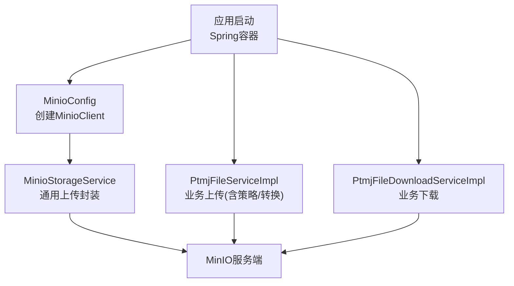
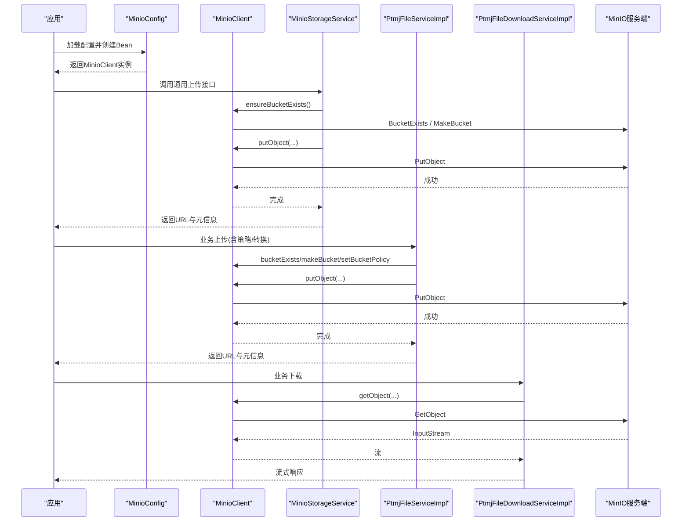
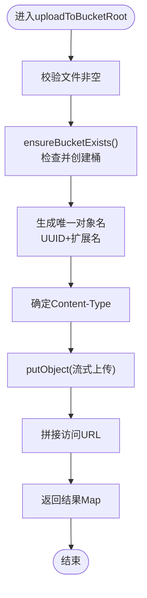
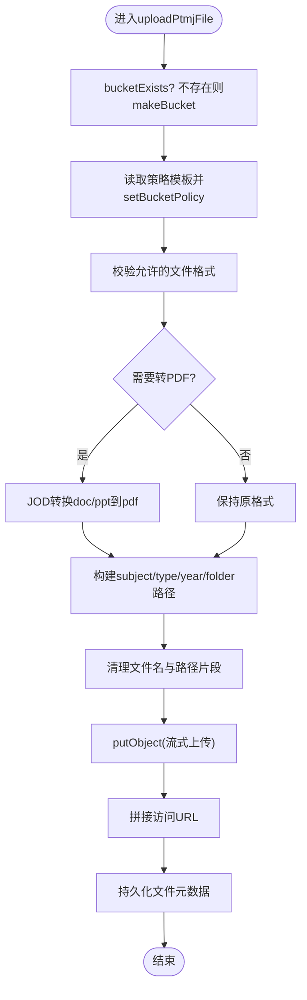
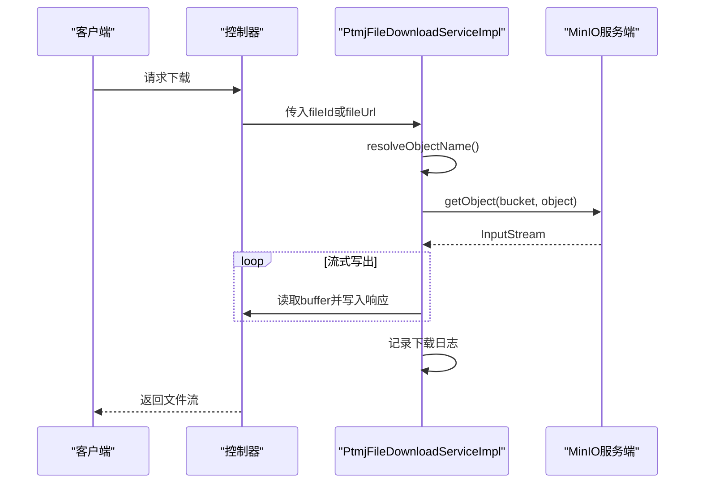
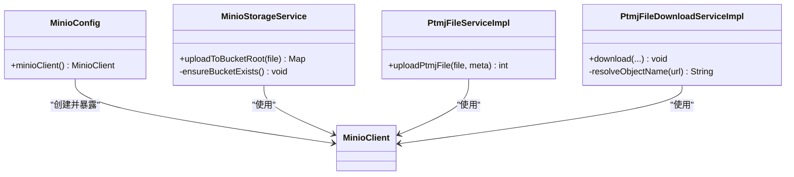

# MinIO存储集成

<cite>
**本文引用的文件列表**
- [MinioConfig.java](file://PezMax-Backend/ruoyi-common/src/main/java/com/ruoyi/common/config/MinioConfig.java)
- [MinioStorageService.java](file://PezMax-Backend/ruoyi-common/src/main/java/com/ruoyi/common/utils/file/MinioStorageService.java)
- [application.yml](file://PezMax-Backend/ruoyi-admin/src/main/resources/application.yml)
- [minio-public-policy.json](file://PezMax-Backend/ptmj-datum/src/main/resources/minio-public-policy.json)
- [PtmjFileServiceImpl.java](file://PezMax-Backend/ptmj-datum/src/main/java/com/ptmj/datum/service/impl/PtmjFileServiceImpl.java)
- [PtmjFileDownloadServiceImpl.java](file://PezMax-Backend/ptmj-datum/src/main/java/com/ptmj/datum/service/impl/PtmjFileDownloadServiceImpl.java)
</cite>

## 目录
1. [简介](#简介)
2. [项目结构](#项目结构)
3. [核心组件](#核心组件)
4. [架构总览](#架构总览)
5. [详细组件分析](#详细组件分析)
6. [依赖关系分析](#依赖关系分析)
7. [性能与优化](#性能与优化)
8. [故障排查指南](#故障排查指南)
9. [结论](#结论)
10. [附录](#附录)

## 简介
本文件面向在项目中集成和使用 MinIO 对象存储的开发者，聚焦于以下目标：
- 深入解析 MinioStorageService 的实现细节（连接配置、桶管理、上传下载）
- 说明 MinIO 客户端初始化、连接池、超时等关键参数
- 文档化文件访问策略配置（公共桶与私有桶）
- 提供大文件分片上传、断点续传、并发上传的性能优化方案
- 总结错误处理、重试策略与监控日志的最佳实践

## 项目结构
本项目采用多模块结构，MinIO 相关代码主要分布在通用工具层与业务服务层：
- 通用配置与工具
  - MinIO 客户端 Bean 定义：MinioConfig
  - 通用上传封装：MinioStorageService
- 业务实现
  - 文件上传流程（含公开策略设置、路径组织、格式转换）：PtmjFileServiceImpl
  - 文件下载流程（流式响应、下载记录）：PtmjFileDownloadServiceImpl
- 配置与策略
  - 应用配置（包含 MinIO 基础配置项）：application.yml
  - 公开读取策略模板：minio-public-policy.json

图表来源
- [MinioConfig.java:1-28](file://PezMax-Backend/ruoyi-common/src/main/java/com/ruoyi/common/config/MinioConfig.java#L1-L28)
- [MinioStorageService.java:1-88](file://PezMax-Backend/ruoyi-common/src/main/java/com/ruoyi/common/utils/file/MinioStorageService.java#L1-L88)
- [PtmjFileServiceImpl.java:390-556](file://PezMax-Backend/ptmj-datum/src/main/java/com/ptmj/datum/service/impl/PtmjFileServiceImpl.java#L390-L556)
- [PtmjFileDownloadServiceImpl.java:105-135](file://PezMax-Backend/ptmj-datum/src/main/java/com/ptmj/datum/service/impl/PtmjFileDownloadServiceImpl.java#L105-L135)

章节来源
- [MinioConfig.java:1-28](file://PezMax-Backend/ruoyi-common/src/main/java/com/ruoyi/common/config/MinioConfig.java#L1-L28)
- [MinioStorageService.java:1-88](file://PezMax-Backend/ruoyi-common/src/main/java/com/ruoyi/common/utils/file/MinioStorageService.java#L1-L88)
- [application.yml:149-155](file://PezMax-Backend/ruoyi-admin/src/main/resources/application.yml#L149-L155)
- [minio-public-policy.json:1-17](file://PezMax-Backend/ptmj-datum/src/main/resources/minio-public-policy.json#L1-L17)
- [PtmjFileServiceImpl.java:390-556](file://PezMax-Backend/ptmj-datum/src/main/java/com/ptmj/datum/service/impl/PtmjFileServiceImpl.java#L390-L556)
- [PtmjFileDownloadServiceImpl.java:105-135](file://PezMax-Backend/ptmj-datum/src/main/java/com/ptmj/datum/service/impl/PtmjFileDownloadServiceImpl.java#L105-L135)

## 核心组件
- MinioConfig：负责从配置中读取 MinIO 端点、凭据并构建 MinioClient Bean。
- MinioStorageService：提供通用的“根目录上传”能力，自动确保桶存在、生成唯一对象名、返回访问 URL 及元信息。
- PtmjFileServiceImpl：业务级上传入口，包含桶策略设置、文件类型校验、Office 转 PDF、路径组织、内容类型设置等。
- PtmjFileDownloadServiceImpl：业务级下载入口，支持多种 URL 解析方式，流式写出到响应，并记录下载行为。

章节来源
- [MinioConfig.java:1-28](file://PezMax-Backend/ruoyi-common/src/main/java/com/ruoyi/common/config/MinioConfig.java#L1-L28)
- [MinioStorageService.java:1-88](file://PezMax-Backend/ruoyi-common/src/main/java/com/ruoyi/common/utils/file/MinioStorageService.java#L1-L88)
- [PtmjFileServiceImpl.java:390-556](file://PezMax-Backend/ptmj-datum/src/main/java/com/ptmj/datum/service/impl/PtmjFileServiceImpl.java#L390-L556)
- [PtmjFileDownloadServiceImpl.java:105-135](file://PezMax-Backend/ptmj-datum/src/main/java/com/ptmj/datum/service/impl/PtmjFileDownloadServiceImpl.java#L105-L135)

## 架构总览
下图展示了从 Spring 容器初始化到 MinIO 客户端使用的主干流程，以及上传与下载的关键调用链。

图表来源
- [MinioConfig.java:1-28](file://PezMax-Backend/ruoyi-common/src/main/java/com/ruoyi/common/config/MinioConfig.java#L1-L28)
- [MinioStorageService.java:1-88](file://PezMax-Backend/ruoyi-common/src/main/java/com/ruoyi/common/utils/file/MinioStorageService.java#L1-L88)
- [PtmjFileServiceImpl.java:390-556](file://PezMax-Backend/ptmj-datum/src/main/java/com/ptmj/datum/service/impl/PtmjFileServiceImpl.java#L390-L556)
- [PtmjFileDownloadServiceImpl.java:105-135](file://PezMax-Backend/ptmj-datum/src/main/java/com/ptmj/datum/service/impl/PtmjFileDownloadServiceImpl.java#L105-L135)

## 详细组件分析

### MinioConfig：客户端初始化与配置
- 功能要点
  - 从 application.yml 读取 minio.url、minio.accessKey、minio.secretKey
  - 通过 builder 构建 MinioClient 并注册为 Spring Bean
- 关键参数
  - endpoint：MinIO API 地址
  - credentials：访问密钥对
- 扩展建议
  - 可在此处增加网络超时、重试、连接池等高级配置（见“性能与优化”）

章节来源
- [MinioConfig.java:1-28](file://PezMax-Backend/ruoyi-common/src/main/java/com/ruoyi/common/config/MinioConfig.java#L1-L28)
- [application.yml:149-155](file://PezMax-Backend/ruoyi-admin/src/main/resources/application.yml#L149-L155)

### MinioStorageService：通用上传封装
- 功能要点
  - 自动确保桶存在（不存在则创建）
  - 生成唯一对象名（UUID + 扩展名），保留原始文件名用于展示
  - 设置正确的 Content-Type
  - 返回包含 fileName、fileUrl、fileSize、fileFormat、objectName 的结果
- 关键方法
  - uploadToBucketRoot(MultipartFile)
  - ensureBucketExists()
- 注意事项
  - 当前实现将文件直接写入桶根目录；如需按业务维度组织目录，建议使用业务服务中的路径构造逻辑

图表来源
- [MinioStorageService.java:35-86](file://PezMax-Backend/ruoyi-common/src/main/java/com/ruoyi/common/utils/file/MinioStorageService.java#L35-L86)

章节来源
- [MinioStorageService.java:1-88](file://PezMax-Backend/ruoyi-common/src/main/java/com/ruoyi/common/utils/file/MinioStorageService.java#L1-L88)

### PtmjFileServiceImpl：业务上传与访问策略
- 功能要点
  - 首次上传时检测桶是否存在，若不存在则创建并设置公开读策略
  - 支持 Office/PPT 转换为 PDF（需 LibreOffice 服务可用）
  - 根据科目、类型、年份、文件夹等维度组织对象路径
  - 针对 txt/md 强制 text/plain; charset=utf-8，便于浏览器直渲染
  - 返回可直接访问的 URL
- 关键流程
  - 桶策略设置：读取 minio-public-policy.json 模板，替换占位符后 setBucketPolicy
  - 上传：putObject 流式写入
  - URL 构造：minioUrl/bucket/objectName

图表来源
- [PtmjFileServiceImpl.java:390-556](file://PezMax-Backend/ptmj-datum/src/main/java/com/ptmj/datum/service/impl/PtmjFileServiceImpl.java#L390-L556)
- [minio-public-policy.json:1-17](file://PezMax-Backend/ptmj-datum/src/main/resources/minio-public-policy.json#L1-L17)

章节来源
- [PtmjFileServiceImpl.java:390-556](file://PezMax-Backend/ptmj-datum/src/main/java/com/ptmj/datum/service/impl/PtmjFileServiceImpl.java#L390-L556)
- [minio-public-policy.json:1-17](file://PezMax-Backend/ptmj-datum/src/main/resources/minio-public-policy.json#L1-L17)

### PtmjFileDownloadServiceImpl：业务下载
- 功能要点
  - 支持通过 fileId 或 fileUrl 解析对象名
  - 流式读取 MinIO 对象并写入 HTTP 响应
  - 记录下载行为（用户、时间等）
- 关键方法
  - resolveObjectName(fileUrl)：兼容多种 URL 格式
  - 下载主流程：getObject 获取输入流，循环写出至响应输出流

图表来源
- [PtmjFileDownloadServiceImpl.java:105-135](file://PezMax-Backend/ptmj-datum/src/main/java/com/ptmj/datum/service/impl/PtmjFileDownloadServiceImpl.java#L105-L135)
- [PtmjFileDownloadServiceImpl.java:211-258](file://PezMax-Backend/ptmj-datum/src/main/java/com/ptmj/datum/service/impl/PtmjFileDownloadServiceImpl.java#L211-L258)

章节来源
- [PtmjFileDownloadServiceImpl.java:105-135](file://PezMax-Backend/ptmj-datum/src/main/java/com/ptmj/datum/service/impl/PtmjFileDownloadServiceImpl.java#L105-L135)
- [PtmjFileDownloadServiceImpl.java:211-258](file://PezMax-Backend/ptmj-datum/src/main/java/com/ptmj/datum/service/impl/PtmjFileDownloadServiceImpl.java#L211-L258)

## 依赖关系分析
- 组件耦合
  - MinioStorageService 依赖 MinioClient（由 MinioConfig 提供）
  - 业务服务 PtmjFileServiceImpl 与 PtmjFileDownloadServiceImpl 直接注入并使用 MinioClient
- 外部依赖
  - MinIO Java SDK（PutObjectArgs、GetObjectArgs、BucketExistsArgs、MakeBucketArgs、SetBucketPolicyArgs 等）
  - 可选：LibreOffice/JODConverter（用于 Office/PPT 转 PDF）

图表来源
- [MinioConfig.java:1-28](file://PezMax-Backend/ruoyi-common/src/main/java/com/ruoyi/common/config/MinioConfig.java#L1-L28)
- [MinioStorageService.java:1-88](file://PezMax-Backend/ruoyi-common/src/main/java/com/ruoyi/common/utils/file/MinioStorageService.java#L1-L88)
- [PtmjFileServiceImpl.java:390-556](file://PezMax-Backend/ptmj-datum/src/main/java/com/ptmj/datum/service/impl/PtmjFileServiceImpl.java#L390-L556)
- [PtmjFileDownloadServiceImpl.java:105-135](file://PezMax-Backend/ptmj-datum/src/main/java/com/ptmj/datum/service/impl/PtmjFileDownloadServiceImpl.java#L105-L135)

章节来源
- [MinioConfig.java:1-28](file://PezMax-Backend/ruoyi-common/src/main/java/com/ruoyi/common/config/MinioConfig.java#L1-L28)
- [MinioStorageService.java:1-88](file://PezMax-Backend/ruoyi-common/src/main/java/com/ruoyi/common/utils/file/MinioStorageService.java#L1-L88)
- [PtmjFileServiceImpl.java:390-556](file://PezMax-Backend/ptmj-datum/src/main/java/com/ptmj/datum/service/impl/PtmjFileServiceImpl.java#L390-L556)
- [PtmjFileDownloadServiceImpl.java:105-135](file://PezMax-Backend/ptmj-datum/src/main/java/com/ptmj/datum/service/impl/PtmjFileDownloadServiceImpl.java#L105-L135)

## 性能与优化

### 客户端初始化与连接池、超时
- 现状
  - MinioConfig 仅设置了 endpoint 与 credentials，未显式配置超时与连接池
- 建议增强
  - 在 MinioClient.builder() 上增加：
    - 连接超时、读写超时、请求重试次数
    - 底层 HTTP 客户端连接池大小（最大空闲、最大活跃、等待超时）
  - 示例思路（概念性描述）
    - 设置 connectTimeout、readTimeout、writeTimeout
    - 启用指数退避重试，限制最大重试次数
    - 调整连接池 max-idle/max-active/max-wait 以匹配并发场景

[本节为通用指导，不直接分析具体文件]

### 大文件分片上传与断点续传
- 现状
  - 现有实现使用单对象 putObject 流式上传，未实现分片与断点续传
- 推荐方案
  - 分片上传流程
    - 初始化分片任务（InitiateMultipartUpload）
    - 计算分片大小与数量，并行上传各分片（UploadPart）
    - 合并分片（CompleteMultipartUpload）
  - 断点续传
    - 本地持久化分片状态（已上传分片号、ETag、偏移量）
    - 失败重试时跳过已完成分片，继续剩余部分
  - 并发控制
    - 使用线程池限制并发度，避免打满网络/磁盘
    - 动态调整分片大小（如 5~100MB）平衡吞吐与内存占用

[本节为通用指导，不直接分析具体文件]

### 并发上传与下载优化
- 上传
  - 结合分片上传提升吞吐
  - 合理设置 Tomcat 线程数与 multipart 大小限制（参考 application.yml）
- 下载
  - 当前已采用流式写出，避免一次性加载到大内存
  - 可增加 Range 请求支持以实现断点续传下载

[本节为通用指导，不直接分析具体文件]

## 故障排查指南
- 常见问题定位
  - 无法连接 MinIO：检查 endpoint、accessKey、secretKey 是否正确
  - 桶不存在：确认 ensureBucketExists 是否执行成功
  - 权限不足：确认桶策略是否设置为公开读或具备相应权限
  - 下载失败：检查 URL 解析逻辑是否能正确提取 objectName
- 建议措施
  - 在关键节点添加结构化日志（上传开始/结束、异常堆栈、耗时）
  - 对网络异常实施重试（带退避），对幂等操作进行去重
  - 对大文件上传/下载增加进度回调与超时保护

章节来源
- [PtmjFileDownloadServiceImpl.java:211-258](file://PezMax-Backend/ptmj-datum/src/main/java/com/ptmj/datum/service/impl/PtmjFileDownloadServiceImpl.java#L211-L258)
- [PtmjFileServiceImpl.java:390-556](file://PezMax-Backend/ptmj-datum/src/main/java/com/ptmj/datum/service/impl/PtmjFileServiceImpl.java#L390-L556)

## 结论
- 当前实现提供了稳定的 MinIO 客户端初始化与基础上传/下载能力
- 业务上传已支持公开桶策略与 Office/PPT 转 PDF，满足常见预览需求
- 建议在客户端层面完善超时与连接池配置，并在业务层引入分片上传与断点续传以提升大文件处理能力
- 强化错误处理、重试与监控日志，有助于快速定位问题与保障稳定性

[本节为总结性内容，不直接分析具体文件]

## 附录

### 配置清单（application.yml 中与 MinIO 相关的键）
- minio.url：MinIO API 地址
- minio.accessKey：访问密钥
- minio.secretKey：密钥
- minio.bucketName：默认使用的桶名称

章节来源
- [application.yml:149-155](file://PezMax-Backend/ruoyi-admin/src/main/resources/application.yml#L149-L155)

### 公开桶策略模板（minio-public-policy.json）
- 作用：允许匿名读取桶内对象，适用于公开资源访问
- 关键点：
  - 允许 s3:GetBucketLocation 与 s3:GetObject
  - 通过占位符 {bucketName} 动态替换为实际桶名

章节来源
- [minio-public-policy.json:1-17](file://PezMax-Backend/ptmj-datum/src/main/resources/minio-public-policy.json#L1-L17)