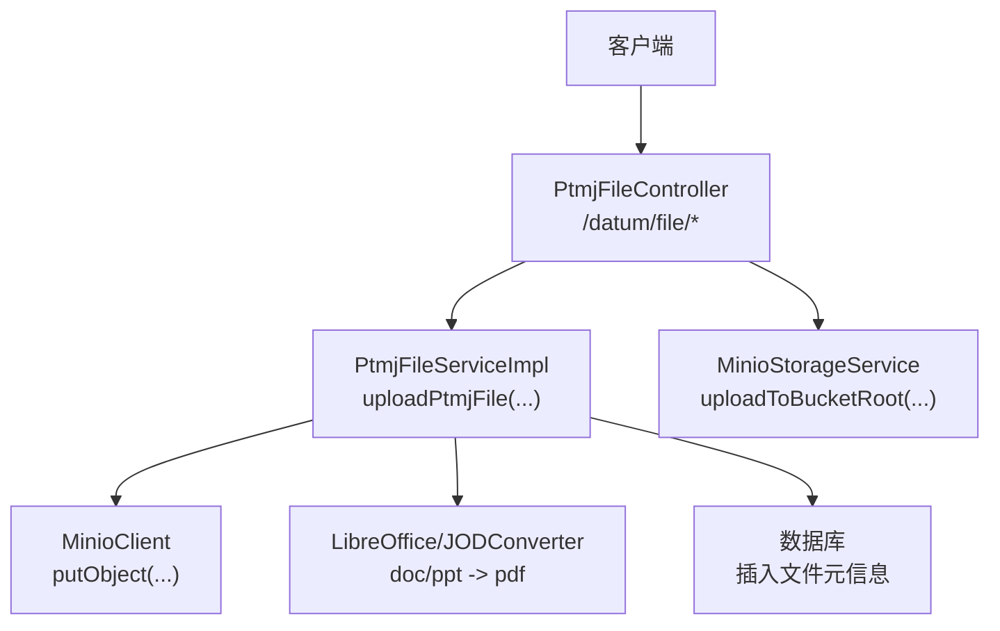
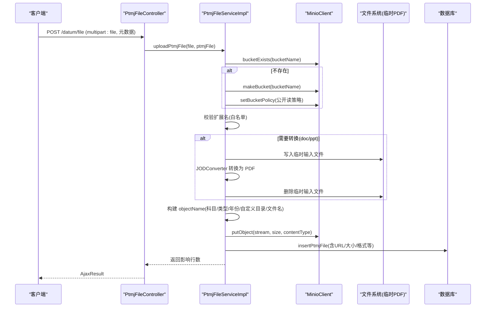
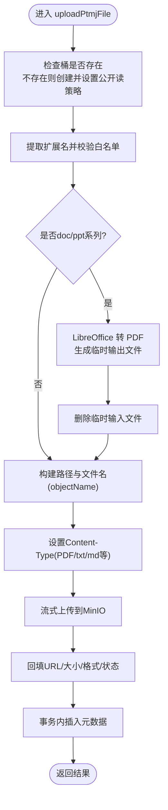
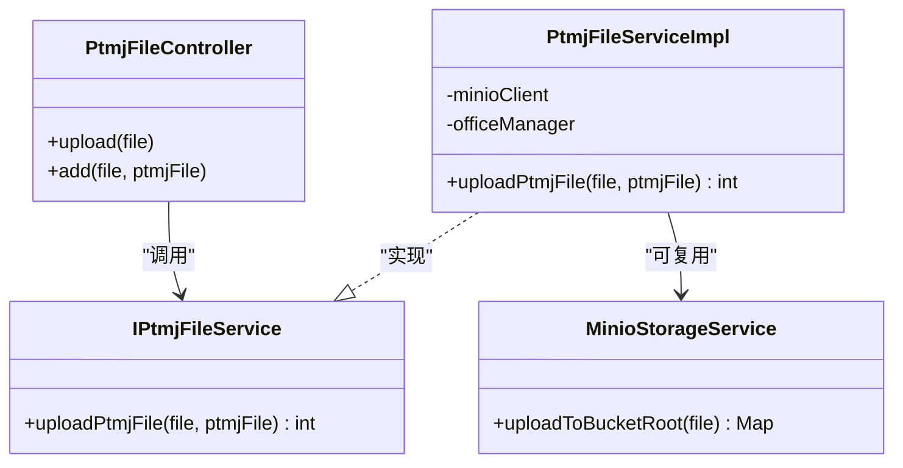

# 文件上传下载

<cite>
**本文引用的文件**
- [PtmjFileController.java](file://PezMax-Backend/ruoyi-admin/src/main/java/com/ruoyi/web/controller/datum/PtmjFileController.java)
- [IPtmjFileService.java](file://PezMax-Backend/ptmj-datum/src/main/java/com/ptmj/datum/service/IPtmjFileService.java)
- [PtmjFileServiceImpl.java](file://PezMax-Backend/ptmj-datum/src/main/java/com/ptmj/datum/service/impl/PtmjFileServiceImpl.java)
- [MinioStorageService.java](file://PezMax-Backend/ruoyi-common/src/main/java/com/ruoyi/common/utils/file/MinioStorageService.java)
- [minio-public-policy.json](file://PezMax-Backend/ptmj-datum/src/main/resources/minio-public-policy.json)
- [application.yml](file://PezMax-Backend/ruoyi-admin/src/main/resources/application.yml)
</cite>

## 目录
1. [简介](#简介)
2. [项目结构](#项目结构)
3. [核心组件](#核心组件)
4. [架构总览](#架构总览)
5. [详细组件分析](#详细组件分析)
6. [依赖关系分析](#依赖关系分析)
7. [性能与并发](#性能与并发)
8. [故障排查指南](#故障排查指南)
9. [结论](#结论)
10. [附录](#附录)

## 简介
本文件围绕“试卷文件”的上传与下载能力，重点解析 uploadPtmjFile 方法的实现逻辑，包括：
- 文件验证、格式检查、大小限制策略（可扩展）
- 安全处理流程（白名单、路径清理、MIME类型设置；病毒扫描为扩展建议）
- 文件命名规则、路径生成策略、版本控制机制
- 流式上传处理、内存优化、并发控制要点
- 文件类型白名单配置、扩展名验证、MIME类型检测方案
- 上传进度跟踪、错误码定义、异常处理的完整示例说明

## 项目结构
后端采用分层架构：
- 控制器层：接收HTTP请求，参数校验与日志记录
- 服务层：业务编排（存储桶初始化、格式校验、LibreOffice转换、对象存储写入、元数据持久化）
- 通用工具：MinIO客户端封装（根目录上传）
- 资源：MinIO桶公开读取策略模板

图示来源
- [PtmjFileController.java:78-92](file://PezMax-Backend/ruoyi-admin/src/main/java/com/ruoyi/web/controller/datum/PtmjFileController.java#L78-L92)
- [PtmjFileServiceImpl.java:388-556](file://PezMax-Backend/ptmj-datum/src/main/java/com/ptmj/datum/service/impl/PtmjFileServiceImpl.java#L388-L556)
- [MinioStorageService.java:35-77](file://PezMax-Backend/ruoyi-common/src/main/java/com/ruoyi/common/utils/file/MinioStorageService.java#L35-L77)

章节来源
- [PtmjFileController.java:58-92](file://PezMax-Backend/ruoyi-admin/src/main/java/com/ruoyi/web/controller/datum/PtmjFileController.java#L58-L92)
- [PtmjFileServiceImpl.java:388-556](file://PezMax-Backend/ptmj-datum/src/main/java/com/ptmj/datum/service/impl/PtmjFileServiceImpl.java#L388-L556)
- [MinioStorageService.java:1-88](file://PezMax-Backend/ruoyi-common/src/main/java/com/ruoyi/common/utils/file/MinioStorageService.java#L1-L88)

## 核心组件
- PtmjFileController：提供 /datum/file/upload 与 /datum/file 等接口，转发至服务层。
- IPtmjFileService / PtmjFileServiceImpl：实现 uploadPtmjFile 的核心流程，包含：
  - 桶存在性检查与公开策略设置
  - 允许格式白名单校验
  - doc/ppt 系列自动转 PDF（通过 LibreOffice + JODConverter）
  - 路径与文件名清洗、对象名构造
  - 流式上传到 MinIO，并设置合适的 Content-Type
  - 元数据回填与入库
- MinioStorageService：提供便捷方法 uploadToBucketRoot，用于简单场景上传到桶根目录。
- minio-public-policy.json：桶创建后自动应用公开读策略模板。

章节来源
- [PtmjFileController.java:186-192](file://PezMax-Backend/ruoyi-admin/src/main/java/com/ruoyi/web/controller/datum/PtmjFileController.java#L186-L192)
- [IPtmjFileService.java:85-93](file://PezMax-Backend/ptmj-datum/src/main/java/com/ptmj/datum/service/IPtmjFileService.java#L85-L93)
- [PtmjFileServiceImpl.java:388-556](file://PezMax-Backend/ptmj-datum/src/main/java/com/ptmj/datum/service/impl/PtmjFileServiceImpl.java#L388-L556)
- [MinioStorageService.java:35-77](file://PezMax-Backend/ruoyi-common/src/main/java/com/ruoyi/common/utils/file/MinioStorageService.java#L35-L77)
- [minio-public-policy.json:1-17](file://PezMax-Backend/ptmj-datum/src/main/resources/minio-public-policy.json#L1-L17)

## 架构总览
以下序列图展示一次标准“新增试卷文件”的调用链：

图示来源
- [PtmjFileController.java:186-192](file://PezMax-Backend/ruoyi-admin/src/main/java/com/ruoyi/web/controller/datum/PtmjFileController.java#L186-L192)
- [PtmjFileServiceImpl.java:388-556](file://PezMax-Backend/ptmj-datum/src/main/java/com/ptmj/datum/service/impl/PtmjFileServiceImpl.java#L388-L556)
- [minio-public-policy.json:1-17](file://PezMax-Backend/ptmj-datum/src/main/resources/minio-public-policy.json#L1-L17)

## 详细组件分析

### uploadPtmjFile 方法详解
该方法负责“上传+元数据入库”的完整流程，关键步骤如下：

- 桶初始化与策略
  - 若桶不存在则创建，并加载 minio-public-policy.json 模板，将 {bucketName} 替换后设置为公开读策略，便于直接通过URL访问与预览。
- 格式白名单校验
  - 从配置项读取允许扩展名列表，对原始文件名进行扩展名提取与匹配，不在白名单内直接抛出异常。
- 文档转PDF（可选）
  - 当扩展名为 doc/docx/ppt/pptx 时，使用本地 LibreOffice（JODConverter）将源文件转换为 PDF。
  - 转换前需确保 LibreOffice 进程已启动（@PostConstruct 初始化），否则抛出异常。
  - 转换完成后删除临时输入文件，并将后续上传流切换为生成的 PDF 文件流。
- 路径与文件名处理
  - 科目、类型、年份构成基础路径；支持 remark 字段作为自定义子目录（仅以 / 或 \ 分隔，内部非法字符会被替换为下划线）。
  - 文件名保留扩展名，并对基础名进行非法字符清洗，最终拼接为 objectName。
- 流式上传与MIME类型
  - 使用 InputStream 流式上传，避免大文件占用过多堆内存。
  - 根据实际格式设置 Content-Type：PDF 强制 application/pdf；txt/md 强制 text/plain; charset=utf-8，以便浏览器原生渲染与滚动。
- 元数据回填与入库
  - 计算最终文件大小（若为转换后的PDF则取PDF大小），填充 URL、格式、状态等字段后执行插入。
  - 事务注解保证失败回滚。

图示来源
- [PtmjFileServiceImpl.java:388-556](file://PezMax-Backend/ptmj-datum/src/main/java/com/ptmj/datum/service/impl/PtmjFileServiceImpl.java#L388-L556)
- [minio-public-policy.json:1-17](file://PezMax-Backend/ptmj-datum/src/main/resources/minio-public-policy.json#L1-L17)

章节来源
- [PtmjFileServiceImpl.java:388-556](file://PezMax-Backend/ptmj-datum/src/main/java/com/ptmj/datum/service/impl/PtmjFileServiceImpl.java#L388-L556)

### 文件命名规则与路径生成策略
- 基础路径：subject/type/year/
  - subject：来自文件元数据，为空时使用默认值
  - type：由 type-map 配置映射得到，未命中时使用默认类型
  - year：在最小年份与当前年份之间，越界则回退到当前年份
- 自定义目录：remark 字段支持多级目录，仅以 / 或 \ 分隔，内部非法字符被替换为下划线
- 文件名：保留扩展名，基础名进行非法字符清洗，统一小写扩展名
- 对象名拼接：subject/type/year/[folder]/safeFileName

章节来源
- [PtmjFileServiceImpl.java:463-498](file://PezMax-Backend/ptmj-datum/src/main/java/com/ptmj/datum/service/impl/PtmjFileServiceImpl.java#L463-L498)

### 版本控制机制
- 当前实现未内置版本控制。如需版本化，可在 objectName 中追加版本号或时间戳后缀，并在元数据中记录版本信息。
- 建议在 service 层增加版本策略开关与冲突处理（覆盖/重命名/归档旧版本）。

[本节为概念性说明，不直接分析具体文件]

### 流式上传与内存优化
- 使用 InputStream 流式上传，避免一次性加载到内存
- 转换后的 PDF 通过 FileInputStream 流式上传，减少中间拷贝
- 建议结合连接池与超时配置，提升稳定性

章节来源
- [PtmjFileServiceImpl.java:510-538](file://PezMax-Backend/ptmj-datum/src/main/java/com/ptmj/datum/service/impl/PtmjFileServiceImpl.java#L510-L538)

### 并发控制
- 当前方法无显式并发锁。高并发场景建议：
  - 针对同一用户或同一目录加分布式锁，避免同名冲突
  - 对 LibreOffice 转换任务引入队列与限流，防止进程过载
  - 对 MinIO 写入进行重试与幂等设计

[本节为通用建议，不直接分析具体文件]

### 安全处理流程
- 白名单校验：基于 allow-format 配置，拒绝非预期扩展名
- 路径清洗：sanitizePath 去除非法字符，防止目录穿越
- MIME类型：按实际格式设置，避免浏览器误判
- 病毒扫描：当前未集成，建议接入外部扫描服务（如 ClamAV）在上传前后进行扫描，失败则拒绝入库或删除对象

章节来源
- [PtmjFileServiceImpl.java:414-421](file://PezMax-Backend/ptmj-datum/src/main/java/com/ptmj/datum/service/impl/PtmjFileServiceImpl.java#L414-L421)
- [PtmjFileServiceImpl.java:152-156](file://PezMax-Backend/ptmj-datum/src/main/java/com/ptmj/datum/service/impl/PtmjFileServiceImpl.java#L152-L156)
- [PtmjFileServiceImpl.java:519-525](file://PezMax-Backend/ptmj-datum/src/main/java/com/ptmj/datum/service/impl/PtmjFileServiceImpl.java#L519-L525)

### 文件类型白名单、扩展名验证与MIME类型检测
- 白名单来源：ptmj.file.allow-format（逗号分隔）
- 扩展名验证：从原始文件名提取扩展名并与白名单比对
- MIME类型检测：
  - 优先使用 MultipartFile.getContentType()
  - 对特定格式强制覆盖（PDF、txt/md）
  - 可进一步引入 Magic Number 检测增强准确性

章节来源
- [PtmjFileServiceImpl.java:81-82](file://PezMax-Backend/ptmj-datum/src/main/java/com/ptmj/datum/service/impl/PtmjFileServiceImpl.java#L81-L82)
- [PtmjFileServiceImpl.java:414-421](file://PezMax-Backend/ptmj-datum/src/main/java/com/ptmj/datum/service/impl/PtmjFileServiceImpl.java#L414-L421)
- [PtmjFileServiceImpl.java:519-525](file://PezMax-Backend/ptmj-datum/src/main/java/com/ptmj/datum/service/impl/PtmjFileServiceImpl.java#L519-L525)

### 上传进度跟踪
- 当前未实现服务端进度上报。建议方案：
  - 前端分片上传，每片完成后上报进度
  - 服务端维护分片状态与合并任务，返回累计进度
  - 或使用 MinIO SDK 的分块上传 API 配合回调

[本节为通用建议，不直接分析具体文件]

### 错误码定义与异常处理
- 当前方法抛出运行时异常，上层统一包装为 AjaxResult
- 建议定义结构化错误码，例如：
  - FILE_FORMAT_NOT_ALLOWED：格式不在白名单
  - LIBREOFFICE_NOT_RUNNING：转换服务不可用
  - MINIO_BUCKET_CREATE_FAILED：桶创建失败
  - UPLOAD_STREAM_ERROR：上传流异常
  - PATH_INVALID：路径非法
- 在控制器层捕获并返回标准化响应体

章节来源
- [PtmjFileController.java:186-192](file://PezMax-Backend/ruoyi-admin/src/main/java/com/ruoyi/web/controller/datum/PtmjFileController.java#L186-L192)
- [PtmjFileServiceImpl.java:422-426](file://PezMax-Backend/ptmj-datum/src/main/java/com/ptmj/datum/service/impl/PtmjFileServiceImpl.java#L422-L426)

### 下载能力说明
- 由于桶策略设置为公开读，可通过直链访问：{minioUrl}/{bucketName}/{objectName}
- 控制器未暴露专用下载接口，可直接GET访问URL
- 如需鉴权下载，可增加签名URL或网关鉴权

章节来源
- [PtmjFileServiceImpl.java:540-541](file://PezMax-Backend/ptmj-datum/src/main/java/com/ptmj/datum/service/impl/PtmjFileServiceImpl.java#L540-L541)
- [minio-public-policy.json:1-17](file://PezMax-Backend/ptmj-datum/src/main/resources/minio-public-policy.json#L1-L17)

## 依赖关系分析
- 控制器依赖服务接口与服务实现
- 服务实现依赖：
  - MinioClient（对象存储）
  - LocalOfficeManager（LibreOffice 进程管理）
  - 数据库Mapper（元数据持久化）
  - 配置项（MinIO地址、桶名、允许格式、类型映射、默认值等）

图示来源
- [PtmjFileController.java:58-92](file://PezMax-Backend/ruoyi-admin/src/main/java/com/ruoyi/web/controller/datum/PtmjFileController.java#L58-L92)
- [IPtmjFileService.java:85-93](file://PezMax-Backend/ptmj-datum/src/main/java/com/ptmj/datum/service/IPtmjFileService.java#L85-L93)
- [PtmjFileServiceImpl.java:388-556](file://PezMax-Backend/ptmj-datum/src/main/java/com/ptmj/datum/service/impl/PtmjFileServiceImpl.java#L388-L556)
- [MinioStorageService.java:35-77](file://PezMax-Backend/ruoyi-common/src/main/java/com/ruoyi/common/utils/file/MinioStorageService.java#L35-L77)

章节来源
- [PtmjFileController.java:58-92](file://PezMax-Backend/ruoyi-admin/src/main/java/com/ruoyi/web/controller/datum/PtmjFileController.java#L58-L92)
- [IPtmjFileService.java:1-119](file://PezMax-Backend/ptmj-datum/src/main/java/com/ptmj/datum/service/IPtmjFileService.java#L1-L119)
- [PtmjFileServiceImpl.java:1-130](file://PezMax-Backend/ptmj-datum/src/main/java/com/ptmj/datum/service/impl/PtmjFileServiceImpl.java#L1-L130)
- [MinioStorageService.java:1-88](file://PezMax-Backend/ruoyi-common/src/main/java/com/ruoyi/common/utils/file/MinioStorageService.java#L1-L88)

## 性能与并发
- 流式上传降低内存峰值
- LibreOffice 转换可能成为瓶颈，建议：
  - 独立进程池与限流
  - 异步转换+消息队列
  - 缓存转换结果（相同输入去重）
- MinIO 写入建议启用连接池与重试
- 大文件建议分片上传与断点续传

[本节为通用建议，不直接分析具体文件]

## 故障排查指南
- 桶策略未生效
  - 检查 minio-public-policy.json 模板是否正确加载与替换
- LibreOffice 未运行
  - 确认 office-home 配置正确，服务启动日志是否正常
- 格式不被允许
  - 检查 allow-format 配置是否包含目标扩展名
- 路径非法导致上传失败
  - 检查 sanitizePath 清洗逻辑与 remark 目录结构
- 浏览器无法预览 txt/md
  - 确认 Content-Type 是否为 text/plain; charset=utf-8

章节来源
- [PtmjFileServiceImpl.java:111-130](file://PezMax-Backend/ptmj-datum/src/main/java/com/ptmj/datum/service/impl/PtmjFileServiceImpl.java#L111-L130)
- [PtmjFileServiceImpl.java:414-426](file://PezMax-Backend/ptmj-datum/src/main/java/com/ptmj/datum/service/impl/PtmjFileServiceImpl.java#L414-L426)
- [PtmjFileServiceImpl.java:519-525](file://PezMax-Backend/ptmj-datum/src/main/java/com/ptmj/datum/service/impl/PtmjFileServiceImpl.java#L519-L525)
- [minio-public-policy.json:1-17](file://PezMax-Backend/ptmj-datum/src/main/resources/minio-public-policy.json#L1-L17)

## 结论
uploadPtmjFile 实现了从白名单校验、文档转换、路径与文件名清洗、流式上传到元数据入库的完整链路。系统具备较好的可扩展性，可按需加入病毒扫描、进度上报、版本控制与更严格的MIME检测。建议在高并发与大数据量场景下完善限流、队列与监控告警。

[本节为总结性内容，不直接分析具体文件]

## 附录

### 配置项参考
- minio.url：MinIO 服务地址
- minio.bucketName：对象存储桶名
- ptmj.file.office-home：LibreOffice 安装路径
- ptmj.file.allow-format：允许的文件扩展名（逗号分隔）
- ptmj.file.min-year：年份下限
- ptmj.file.type-map：类型ID到名称的映射（逗号分隔键值对）
- ptmj.file.default-type：默认类型
- ptmj.file.default-subject：默认学科

章节来源
- [PtmjFileServiceImpl.java:72-94](file://PezMax-Backend/ptmj-datum/src/main/java/com/ptmj/datum/service/impl/PtmjFileServiceImpl.java#L72-L94)
- [application.yml:1-200](file://PezMax-Backend/ruoyi-admin/src/main/resources/application.yml#L1-L200)

### 示例代码片段路径
- 控制器上传入口
  - [PtmjFileController.java:186-192](file://PezMax-Backend/ruoyi-admin/src/main/java/com/ruoyi/web/controller/datum/PtmjFileController.java#L186-L192)
- 服务层上传主流程
  - [PtmjFileServiceImpl.java:388-556](file://PezMax-Backend/ptmj-datum/src/main/java/com/ptmj/datum/service/impl/PtmjFileServiceImpl.java#L388-L556)
- 根目录上传工具方法
  - [MinioStorageService.java:35-77](file://PezMax-Backend/ruoyi-common/src/main/java/com/ruoyi/common/utils/file/MinioStorageService.java#L35-L77)
- 桶公开读策略模板
  - [minio-public-policy.json:1-17](file://PezMax-Backend/ptmj-datum/src/main/resources/minio-public-policy.json#L1-L17)