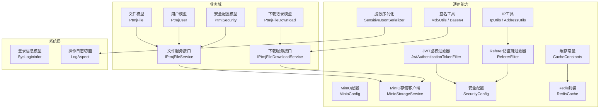
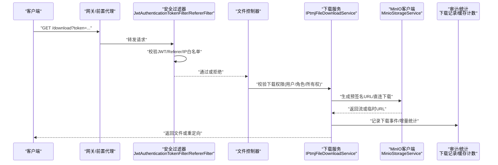
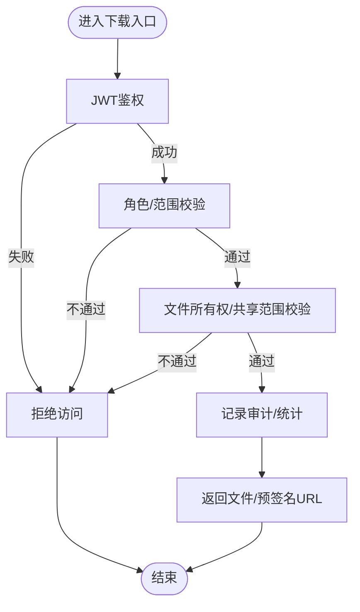
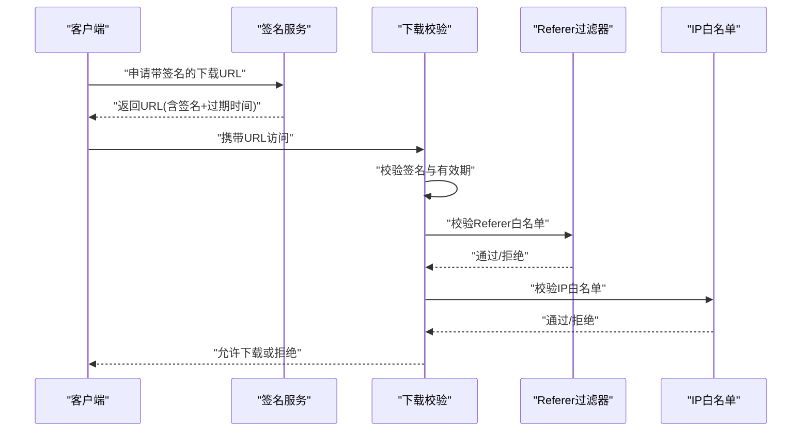
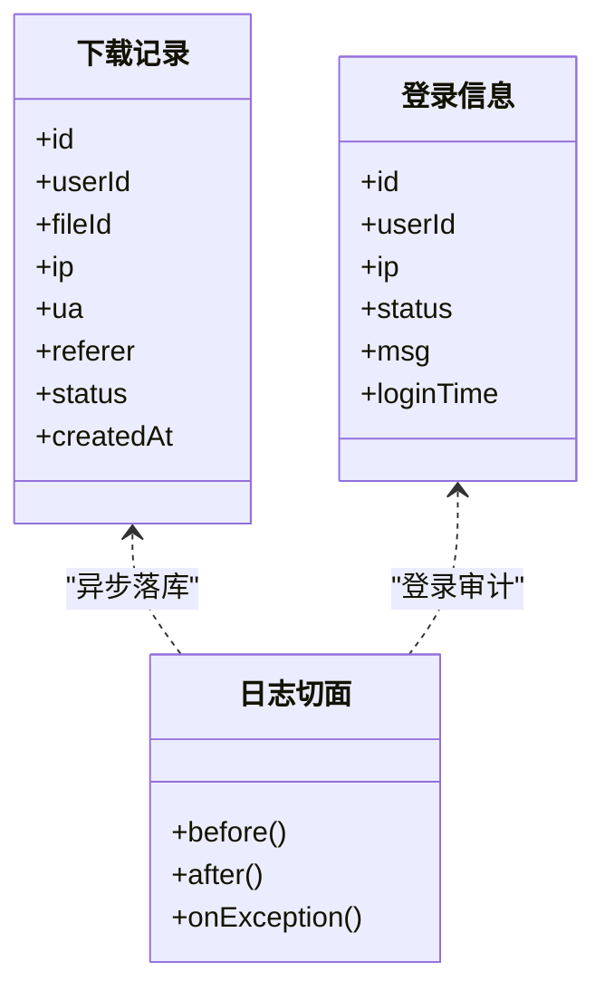
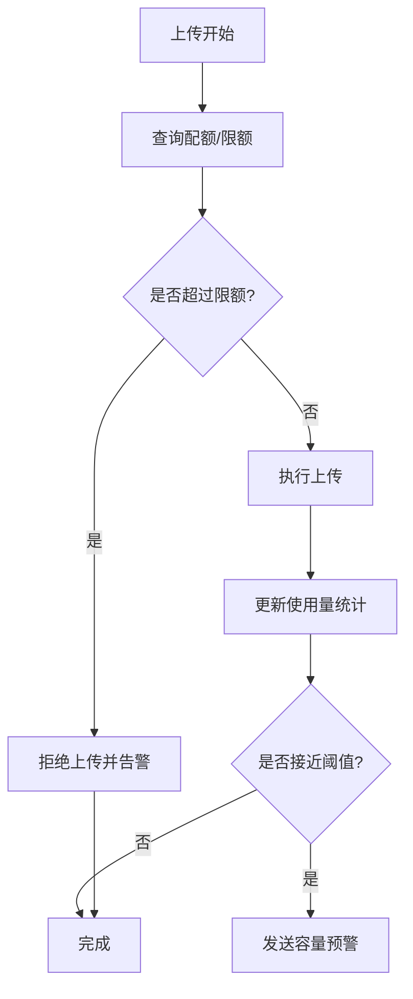
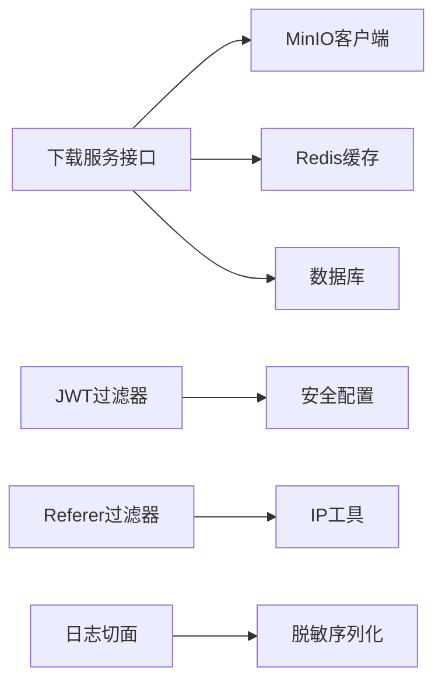

# 文件安全与访问控制

<cite>
**本文引用的文件**   
- [PtmjFile.java](file://PezMax-Backend/ptmj-datum/src/main/java/com/ptmj/datum/domain/PtmjFile.java)
- [PtmjFileDownload.java](file://PezMax-Backend/ptmj-datum/src/main/java/com/ptmj/datum/domain/PtmjFileDownload.java)
- [PtmjUser.java](file://PezMax-Backend/ptmj-datum/src/main/java/com/ptmj/datum/domain/PtmjUser.java)
- [PtmjSecurity.java](file://PezMax-Backend/ptmj-datum/src/main/java/com/ptmj/datum/domain/PtmjSecurity.java)
- [IPtmjFileService.java](file://PezMax-Backend/ptmj-datum/src/main/java/com/ptmj/datum/service/IPtmjFileService.java)
- [IPtmjFileDownloadService.java](file://PezMax-Backend/ptmj-datum/src/main/java/com/ptmj/datum/service/IPtmjFileDownloadService.java)
- [MinioStorageService.java](file://PezMax-Backend/ruoyi-common/src/main/java/com/ruoyi/common/utils/file/MinioStorageService.java)
- [MinioConfig.java](file://PezMax-Backend/ruoyi-common/src/main/java/com/ruoyi/common/config/MinioConfig.java)
- [minio-public-policy.json](file://PezMax-Backend/ptmj-datum/src/main/resources/minio-public-policy.json)
- [JwtAuthenticationTokenFilter.java](file://PezMax-Backend/ruoyi-framework/src/main/java/com/ruoyi/framework/security/filter/JwtAuthenticationTokenFilter.java)
- [SecurityConfig.java](file://PezMax-Backend/ruoyi-framework/src/main/java/com/ruoyi/framework/config/SecurityConfig.java)
- [SysLogininfor.java](file://PezMax-Backend/ruoyi-system/src/main/java/com/ruoyi/system/domain/SysLogininfor.java)
- [LogAspect.java](file://PezMax-Backend/ruoyi-framework/src/main/java/com/ruoyi/framework/aspectj/LogAspect.java)
- [RefererFilter.java](file://PezMax-Backend/ruoyi-common/src/main/java/com/ruoyi/common/filter/RefererFilter.java)
- [IpUtils.java](file://PezMax-Backend/ruoyi-common/src/main/java/com/ruoyi/common/utils/ip/IpUtils.java)
- [AddressUtils.java](file://PezMax-Backend/ruoyi-common/src/main/java/com/ruoyi/common/utils/ip/AddressUtils.java)
- [Md5Utils.java](file://PezMax-Backend/ruoyi-common/src/main/java/com/ruoyi/common/utils/sign/Md5Utils.java)
- [Base64.java](file://PezMax-Backend/ruoyi-common/src/main/java/com/ruoyi/common/utils/sign/Base64.java)
- [SensitiveJsonSerializer.java](file://PezMax-Backend/ruoyi-common/src/main/java/com/ruoyi/common/config/serializer/SensitiveJsonSerializer.java)
- [DesensitizedType.java](file://PezMax-Backend/ruoyi-common/src/main/java/com/ruoyi/common/enums/DesensitizedType.java)
- [CacheConstants.java](file://PezMax-Backend/ruoyi-common/src/main/java/com/ruoyi/common/constant/CacheConstants.java)
- [RedisCache.java](file://PezMax-Backend/ruoyi-common/src/main/java/com/ruoyi/common/core/redis/RedisCache.java)
- [PtmjFileRankCacheService.java](file://PezMax-Backend/ptmj-datum/src/main/java/com/ptmj/datum/service/PtmjFileRankCacheService.java)
- [PtmjFileTreeCacheService.java](file://PezMax-Backend/ptmj-datum/src/main/java/com/ptmj/datum/service/PtmjFileTreeCacheService.java)
- [application.yml](file://PezMax-Backend/ruoyi-admin/src/main/resources/application.yml)
- [application-druid.yml](file://PezMax-Backend/ruoyi-admin/src/main/resources/application-druid.yml)
</cite>

## 目录
1. [简介](#简介)
2. [项目结构](#项目结构)
3. [核心组件](#核心组件)
4. [架构总览](#架构总览)
5. [详细组件分析](#详细组件分析)
6. [依赖关系分析](#依赖关系分析)
7. [性能考量](#性能考量)
8. [故障排查指南](#故障排查指南)
9. [结论](#结论)
10. [附录](#附录)

## 简介
本文件面向“文件安全与访问控制”主题，围绕以下目标展开：
- 文件下载权限验证机制：用户身份认证、角色权限检查、文件所有权校验。
- 防盗链实现方案：URL签名生成、有效期控制、来源（Referer）校验与IP白名单过滤。
- 访问审计日志记录：下载统计、访问追踪、异常行为检测。
- 存储配额管理：使用量统计、容量预警策略。
- 敏感数据保护：加密存储、传输加密、访问日志脱敏的最佳实践。

## 项目结构
本项目采用多模块后端架构，与安全相关的关键位置包括：
- 领域模型与接口：文件、下载记录、用户、安全配置等实体与服务接口。
- 通用能力：安全过滤器、鉴权配置、工具类（签名、IP、脱敏）、缓存封装、MinIO客户端配置。
- 系统层：登录信息、操作日志切面、全局异常处理等。
- 前端：Electron/Web 应用侧的下载插件与请求拦截器（用于携带令牌、触发下载）。

图表来源
- [PtmjFile.java](file://PezMax-Backend/ptmj-datum/src/main/java/com/ptmj/datum/domain/PtmjFile.java)
- [PtmjFileDownload.java](file://PezMax-Backend/ptmj-datum/src/main/java/com/ptmj/datum/domain/PtmjFileDownload.java)
- [PtmjUser.java](file://PezMax-Backend/ptmj-datum/src/main/java/com/ptmj/datum/domain/PtmjUser.java)
- [PtmjSecurity.java](file://PezMax-Backend/ptmj-datum/src/main/java/com/ptmj/datum/domain/PtmjSecurity.java)
- [IPtmjFileService.java](file://PezMax-Backend/ptmj-datum/src/main/java/com/ptmj/datum/service/IPtmjFileService.java)
- [IPtmjFileDownloadService.java](file://PezMax-Backend/ptmj-datum/src/main/java/com/ptmj/datum/service/IPtmjFileDownloadService.java)
- [MinioConfig.java](file://PezMax-Backend/ruoyi-common/src/main/java/com/ruoyi/common/config/MinioConfig.java)
- [MinioStorageService.java](file://PezMax-Backend/ruoyi-common/src/main/java/com/ruoyi/common/utils/file/MinioStorageService.java)
- [JwtAuthenticationTokenFilter.java](file://PezMax-Backend/ruoyi-framework/src/main/java/com/ruoyi/framework/security/filter/JwtAuthenticationTokenFilter.java)
- [SecurityConfig.java](file://PezMax-Backend/ruoyi-framework/src/main/java/com/ruoyi/framework/config/SecurityConfig.java)
- [RefererFilter.java](file://PezMax-Backend/ruoyi-common/src/main/java/com/ruoyi/common/filter/RefererFilter.java)
- [IpUtils.java](file://PezMax-Backend/ruoyi-common/src/main/java/com/ruoyi/common/utils/ip/IpUtils.java)
- [AddressUtils.java](file://PezMax-Backend/ruoyi-common/src/main/java/com/ruoyi/common/utils/ip/AddressUtils.java)
- [Md5Utils.java](file://PezMax-Backend/ruoyi-common/src/main/java/com/ruoyi/common/utils/sign/Md5Utils.java)
- [Base64.java](file://PezMax-Backend/ruoyi-common/src/main/java/com/ruoyi/common/utils/sign/Base64.java)
- [SensitiveJsonSerializer.java](file://PezMax-Backend/ruoyi-common/src/main/java/com/ruoyi/common/config/serializer/SensitiveJsonSerializer.java)
- [CacheConstants.java](file://PezMax-Backend/ruoyi-common/src/main/java/com/ruoyi/common/constant/CacheConstants.java)
- [RedisCache.java](file://PezMax-Backend/ruoyi-common/src/main/java/com/ruoyi/common/core/redis/RedisCache.java)

章节来源
- [PtmjFile.java](file://PezMax-Backend/ptmj-datum/src/main/java/com/ptmj/datum/domain/PtmjFile.java)
- [PtmjFileDownload.java](file://PezMax-Backend/ptmj-datum/src/main/java/com/ptmj/datum/domain/PtmjFileDownload.java)
- [PtmjUser.java](file://PezMax-Backend/ptmj-datum/src/main/java/com/ptmj/datum/domain/PtmjUser.java)
- [PtmjSecurity.java](file://PezMax-Backend/ptmj-datum/src/main/java/com/ptmj/datum/domain/PtmjSecurity.java)
- [IPtmjFileService.java](file://PezMax-Backend/ptmj-datum/src/main/java/com/ptmj/datum/service/IPtmjFileService.java)
- [IPtmjFileDownloadService.java](file://PezMax-Backend/ptmj-datum/src/main/java/com/ptmj/datum/service/IPtmjFileDownloadService.java)
- [MinioConfig.java](file://PezMax-Backend/ruoyi-common/src/main/java/com/ruoyi/common/config/MinioConfig.java)
- [MinioStorageService.java](file://PezMax-Backend/ruoyi-common/src/main/java/com/ruoyi/common/utils/file/MinioStorageService.java)
- [JwtAuthenticationTokenFilter.java](file://PezMax-Backend/ruoyi-framework/src/main/java/com/ruoyi/framework/security/filter/JwtAuthenticationTokenFilter.java)
- [SecurityConfig.java](file://PezMax-Backend/ruoyi-framework/src/main/java/com/ruoyi/framework/config/SecurityConfig.java)
- [RefererFilter.java](file://PezMax-Backend/ruoyi-common/src/main/java/com/ruoyi/common/filter/RefererFilter.java)
- [IpUtils.java](file://PezMax-Backend/ruoyi-common/src/main/java/com/ruoyi/common/utils/ip/IpUtils.java)
- [AddressUtils.java](file://PezMax-Backend/ruoyi-common/src/main/java/com/ruoyi/common/utils/ip/AddressUtils.java)
- [Md5Utils.java](file://PezMax-Backend/ruoyi-common/src/main/java/com/ruoyi/common/utils/sign/Md5Utils.java)
- [Base64.java](file://PezMax-Backend/ruoyi-common/src/main/java/com/ruoyi/common/utils/sign/Base64.java)
- [SensitiveJsonSerializer.java](file://PezMax-Backend/ruoyi-common/src/main/java/com/ruoyi/common/config/serializer/SensitiveJsonSerializer.java)
- [CacheConstants.java](file://PezMax-Backend/ruoyi-common/src/main/java/com/ruoyi/common/constant/CacheConstants.java)
- [RedisCache.java](file://PezMax-Backend/ruoyi-common/src/main/java/com/ruoyi/common/core/redis/RedisCache.java)

## 核心组件
- 文件与下载模型
  - 文件实体：包含文件元数据、归属者、可见性、存储桶路径等字段，用于权限判定与审计。
  - 下载记录实体：记录每次下载的发起者、时间、来源IP、结果状态等，支撑审计与统计。
  - 用户与安全配置实体：承载用户身份、角色、组织/学校维度等信息，以及安全策略参数。
- 服务接口
  - 文件服务接口：提供文件查询、列表、树形结构、排名等能力，通常结合缓存提升性能。
  - 下载服务接口：负责下载前鉴权、签名生成、限流、计数与审计落库。
- 存储与配置
  - MinIO配置：连接端点、凭据、默认桶、读写策略等。
  - MinIO客户端：上传、下载、预签名URL生成、对象元数据读取等。
- 安全与鉴权
  - JWT过滤器：解析并校验令牌，建立当前用户上下文。
  - 安全配置：放行/拦截规则、跨域、CORS、静态资源策略。
  - Referer过滤器：防盗链基础校验。
  - IP工具：获取真实客户端IP、地理位置解析。
  - 签名工具：MD5/Base64，用于URL签名计算。
- 审计与脱敏
  - 登录信息模型：记录登录成功/失败、IP、UA等。
  - 日志切面：统一记录控制器方法调用、耗时、入参出参（可脱敏）。
  - 脱敏序列化：对敏感字段进行输出脱敏。
- 缓存
  - 缓存常量：定义键空间前缀、过期策略。
  - Redis封装：统一存取、TTL设置、原子计数等。

章节来源
- [PtmjFile.java](file://PezMax-Backend/ptmj-datum/src/main/java/com/ptmj/datum/domain/PtmjFile.java)
- [PtmjFileDownload.java](file://PezMax-Backend/ptmj-datum/src/main/java/com/ptmj/datum/domain/PtmjFileDownload.java)
- [PtmjUser.java](file://PezMax-Backend/ptmj-datum/src/main/java/com/ptmj/datum/domain/PtmjUser.java)
- [PtmjSecurity.java](file://PezMax-Backend/ptmj-datum/src/main/java/com/ptmj/datum/domain/PtmjSecurity.java)
- [IPtmjFileService.java](file://PezMax-Backend/ptmj-datum/src/main/java/com/ptmj/datum/service/IPtmjFileService.java)
- [IPtmjFileDownloadService.java](file://PezMax-Backend/ptmj-datum/src/main/java/com/ptmj/datum/service/IPtmjFileDownloadService.java)
- [MinioConfig.java](file://PezMax-Backend/ruoyi-common/src/main/java/com/ruoyi/common/config/MinioConfig.java)
- [MinioStorageService.java](file://PezMax-Backend/ruoyi-common/src/main/java/com/ruoyi/common/utils/file/MinioStorageService.java)
- [JwtAuthenticationTokenFilter.java](file://PezMax-Backend/ruoyi-framework/src/main/java/com/ruoyi/framework/security/filter/JwtAuthenticationTokenFilter.java)
- [SecurityConfig.java](file://PezMax-Backend/ruoyi-framework/src/main/java/com/ruoyi/framework/config/SecurityConfig.java)
- [RefererFilter.java](file://PezMax-Backend/ruoyi-common/src/main/java/com/ruoyi/common/filter/RefererFilter.java)
- [IpUtils.java](file://PezMax-Backend/ruoyi-common/src/main/java/com/ruoyi/common/utils/ip/IpUtils.java)
- [AddressUtils.java](file://PezMax-Backend/ruoyi-common/src/main/java/com/ruoyi/common/utils/ip/AddressUtils.java)
- [Md5Utils.java](file://PezMax-Backend/ruoyi-common/src/main/java/com/ruoyi/common/utils/sign/Md5Utils.java)
- [Base64.java](file://PezMax-Backend/ruoyi-common/src/main/java/com/ruoyi/common/utils/sign/Base64.java)
- [SysLogininfor.java](file://PezMax-Backend/ruoyi-system/src/main/java/com/ruoyi/system/domain/SysLogininfor.java)
- [LogAspect.java](file://PezMax-Backend/ruoyi-framework/src/main/java/com/ruoyi/framework/aspectj/LogAspect.java)
- [SensitiveJsonSerializer.java](file://PezMax-Backend/ruoyi-common/src/main/java/com/ruoyi/common/config/serializer/SensitiveJsonSerializer.java)
- [DesensitizedType.java](file://PezMax-Backend/ruoyi-common/src/main/java/com/ruoyi/common/enums/DesensitizedType.java)
- [CacheConstants.java](file://PezMax-Backend/ruoyi-common/src/main/java/com/ruoyi/common/constant/CacheConstants.java)
- [RedisCache.java](file://PezMax-Backend/ruoyi-common/src/main/java/com/ruoyi/common/core/redis/RedisCache.java)

## 架构总览
下图展示了从浏览器到存储的完整访问链路，涵盖鉴权、防盗链、签名、审计与存储。

图表来源
- [JwtAuthenticationTokenFilter.java](file://PezMax-Backend/ruoyi-framework/src/main/java/com/ruoyi/framework/security/filter/JwtAuthenticationTokenFilter.java)
- [SecurityConfig.java](file://PezMax-Backend/ruoyi-framework/src/main/java/com/ruoyi/framework/config/SecurityConfig.java)
- [RefererFilter.java](file://PezMax-Backend/ruoyi-common/src/main/java/com/ruoyi/common/filter/RefererFilter.java)
- [IPtmjFileDownloadService.java](file://PezMax-Backend/ptmj-datum/src/main/java/com/ptmj/datum/service/IPtmjFileDownloadService.java)
- [MinioStorageService.java](file://PezMax-Backend/ruoyi-common/src/main/java/com/ruoyi/common/utils/file/MinioStorageService.java)

## 详细组件分析

### 下载权限验证机制
- 用户身份认证
  - 通过JWT过滤器解析令牌，建立当前用户上下文；未认证请求直接拒绝。
- 角色权限检查
  - 基于用户角色与资源标签（如公开/私有/组织内）进行判定；支持按组织/学校维度隔离。
- 文件所有权验证
  - 对比当前用户ID与文件所有者ID；非所有者需具备显式授权或处于共享范围。
- 下载流程要点
  - 先鉴权后落盘：在返回内容前完成权限校验与审计记录。
  - 防重放：下载令牌一次性或短时效，避免重复利用。

图表来源
- [JwtAuthenticationTokenFilter.java](file://PezMax-Backend/ruoyi-framework/src/main/java/com/ruoyi/framework/security/filter/JwtAuthenticationTokenFilter.java)
- [IPtmjFileDownloadService.java](file://PezMax-Backend/ptmj-datum/src/main/java/com/ptmj/datum/service/IPtmjFileDownloadService.java)
- [PtmjFile.java](file://PezMax-Backend/ptmj-datum/src/main/java/com/ptmj/datum/domain/PtmjFile.java)
- [PtmjUser.java](file://PezMax-Backend/ptmj-datum/src/main/java/com/ptmj/datum/domain/PtmjUser.java)

章节来源
- [JwtAuthenticationTokenFilter.java](file://PezMax-Backend/ruoyi-framework/src/main/java/com/ruoyi/framework/security/filter/JwtAuthenticationTokenFilter.java)
- [IPtmjFileDownloadService.java](file://PezMax-Backend/ptmj-datum/src/main/java/com/ptmj/datum/service/IPtmjFileDownloadService.java)
- [PtmjFile.java](file://PezMax-Backend/ptmj-datum/src/main/java/com/ptmj/datum/domain/PtmjFile.java)
- [PtmjUser.java](file://PezMax-Backend/ptmj-datum/src/main/java/com/ptmj/datum/domain/PtmjUser.java)

### 防盗链实现方案
- URL签名生成
  - 将关键参数（文件标识、用户ID、时间戳、随机串）与密钥进行哈希，得到签名值，附加到URL中。
- 有效期控制
  - 在URL中包含过期时间，服务端校验当前时间与过期时间的差值，防止长期有效链接泄露。
- Referer校验
  - 通过Referer过滤器校验来源域名是否在白名单，阻断外部站点直接引用。
- IP白名单过滤
  - 提取客户端真实IP，与白名单匹配；必要时结合地理位置解析进行风控。

图表来源
- [Md5Utils.java](file://PezMax-Backend/ruoyi-common/src/main/java/com/ruoyi/common/utils/sign/Md5Utils.java)
- [Base64.java](file://PezMax-Backend/ruoyi-common/src/main/java/com/ruoyi/common/utils/sign/Base64.java)
- [RefererFilter.java](file://PezMax-Backend/ruoyi-common/src/main/java/com/ruoyi/common/filter/RefererFilter.java)
- [IpUtils.java](file://PezMax-Backend/ruoyi-common/src/main/java/com/ruoyi/common/utils/ip/IpUtils.java)
- [AddressUtils.java](file://PezMax-Backend/ruoyi-common/src/main/java/com/ruoyi/common/utils/ip/AddressUtils.java)

章节来源
- [Md5Utils.java](file://PezMax-Backend/ruoyi-common/src/main/java/com/ruoyi/common/utils/sign/Md5Utils.java)
- [Base64.java](file://PezMax-Backend/ruoyi-common/src/main/java/com/ruoyi/common/utils/sign/Base64.java)
- [RefererFilter.java](file://PezMax-Backend/ruoyi-common/src/main/java/com/ruoyi/common/filter/RefererFilter.java)
- [IpUtils.java](file://PezMax-Backend/ruoyi-common/src/main/java/com/ruoyi/common/utils/ip/IpUtils.java)
- [AddressUtils.java](file://PezMax-Backend/ruoyi-common/src/main/java/com/ruoyi/common/utils/ip/AddressUtils.java)

### 文件访问审计日志记录
- 下载统计
  - 每次成功下载写入下载记录表，并更新缓存中的累计次数，便于排行榜与趋势分析。
- 访问追踪
  - 记录用户ID、时间、来源IP、User-Agent、Referer、文件ID、结果码等。
- 异常行为检测
  - 基于高频访问、异常IP段、异常UA、频繁失败等指标进行告警与封禁。

图表来源
- [PtmjFileDownload.java](file://PezMax-Backend/ptmj-datum/src/main/java/com/ptmj/datum/domain/PtmjFileDownload.java)
- [SysLogininfor.java](file://PezMax-Backend/ruoyi-system/src/main/java/com/ruoyi/system/domain/SysLogininfor.java)
- [LogAspect.java](file://PezMax-Backend/ruoyi-framework/src/main/java/com/ruoyi/framework/aspectj/LogAspect.java)

章节来源
- [PtmjFileDownload.java](file://PezMax-Backend/ptmj-datum/src/main/java/com/ptmj/datum/domain/PtmjFileDownload.java)
- [SysLogininfor.java](file://PezMax-Backend/ruoyi-system/src/main/java/com/ruoyi/system/domain/SysLogininfor.java)
- [LogAspect.java](file://PezMax-Backend/ruoyi-framework/src/main/java/com/ruoyi/framework/aspectj/LogAspect.java)

### 存储配额管理与容量预警
- 使用量统计
  - 以用户/组织为维度聚合已用空间，定期汇总至统计表或缓存。
- 容量预警
  - 当使用量接近阈值时触发告警；支持软限制（提示）与硬限制（拒绝上传）。
- 实现策略
  - 在上传成功后累加用量；在删除/覆盖时扣减用量；通过定时任务刷新统计。
  - 结合MinIO桶级别策略与对象元数据进行一致性校验。

[此图为概念流程图，无需图表来源]

### 敏感文件加密与传输安全
- 存储加密
  - 对敏感文件在服务端进行加密后再写入MinIO；或启用MinIO服务端加密（SSE）策略。
- 传输加密
  - 全站HTTPS，强制TLS；内部服务间通信使用mTLS或受信任网络。
- 访问日志脱敏
  - 对日志中的手机号、邮箱、身份证等字段进行脱敏输出，避免敏感信息泄露。

章节来源
- [MinioConfig.java](file://PezMax-Backend/ruoyi-common/src/main/java/com/ruoyi/common/config/MinioConfig.java)
- [MinioStorageService.java](file://PezMax-Backend/ruoyi-common/src/main/java/com/ruoyi/common/utils/file/MinioStorageService.java)
- [SensitiveJsonSerializer.java](file://PezMax-Backend/ruoyi-common/src/main/java/com/ruoyi/common/config/serializer/SensitiveJsonSerializer.java)
- [DesensitizedType.java](file://PezMax-Backend/ruoyi-common/src/main/java/com/ruoyi/common/enums/DesensitizedType.java)

## 依赖关系分析
- 组件耦合
  - 下载服务依赖MinIO客户端、缓存、审计记录；鉴权过滤器依赖安全配置与用户上下文。
- 外部依赖
  - MinIO对象存储、Redis缓存、数据库持久化。
- 潜在循环依赖
  - 服务层应避免反向依赖基础设施层；通过接口解耦。

图表来源
- [IPtmjFileDownloadService.java](file://PezMax-Backend/ptmj-datum/src/main/java/com/ptmj/datum/service/IPtmjFileDownloadService.java)
- [MinioStorageService.java](file://PezMax-Backend/ruoyi-common/src/main/java/com/ruoyi/common/utils/file/MinioStorageService.java)
- [RedisCache.java](file://PezMax-Backend/ruoyi-common/src/main/java/com/ruoyi/common/core/redis/RedisCache.java)
- [JwtAuthenticationTokenFilter.java](file://PezMax-Backend/ruoyi-framework/src/main/java/com/ruoyi/framework/security/filter/JwtAuthenticationTokenFilter.java)
- [SecurityConfig.java](file://PezMax-Backend/ruoyi-framework/src/main/java/com/ruoyi/framework/config/SecurityConfig.java)
- [RefererFilter.java](file://PezMax-Backend/ruoyi-common/src/main/java/com/ruoyi/common/filter/RefererFilter.java)
- [IpUtils.java](file://PezMax-Backend/ruoyi-common/src/main/java/com/ruoyi/common/utils/ip/IpUtils.java)
- [LogAspect.java](file://PezMax-Backend/ruoyi-framework/src/main/java/com/ruoyi/framework/aspectj/LogAspect.java)
- [SensitiveJsonSerializer.java](file://PezMax-Backend/ruoyi-common/src/main/java/com/ruoyi/common/config/serializer/SensitiveJsonSerializer.java)

章节来源
- [IPtmjFileDownloadService.java](file://PezMax-Backend/ptmj-datum/src/main/java/com/ptmj/datum/service/IPtmjFileDownloadService.java)
- [MinioStorageService.java](file://PezMax-Backend/ruoyi-common/src/main/java/com/ruoyi/common/utils/file/MinioStorageService.java)
- [RedisCache.java](file://PezMax-Backend/ruoyi-common/src/main/java/com/ruoyi/common/core/redis/RedisCache.java)
- [JwtAuthenticationTokenFilter.java](file://PezMax-Backend/ruoyi-framework/src/main/java/com/ruoyi/framework/security/filter/JwtAuthenticationTokenFilter.java)
- [SecurityConfig.java](file://PezMax-Backend/ruoyi-framework/src/main/java/com/ruoyi/framework/config/SecurityConfig.java)
- [RefererFilter.java](file://PezMax-Backend/ruoyi-common/src/main/java/com/ruoyi/common/filter/RefererFilter.java)
- [IpUtils.java](file://PezMax-Backend/ruoyi-common/src/main/java/com/ruoyi/common/utils/ip/IpUtils.java)
- [LogAspect.java](file://PezMax-Backend/ruoyi-framework/src/main/java/com/ruoyi/framework/aspectj/LogAspect.java)
- [SensitiveJsonSerializer.java](file://PezMax-Backend/ruoyi-common/src/main/java/com/ruoyi/common/config/serializer/SensitiveJsonSerializer.java)

## 性能考量
- 缓存优先
  - 文件树、排行榜等热点数据使用Redis缓存，降低DB压力。
- 预签名URL
  - 大文件下载建议返回预签名URL，由客户端直连MinIO，减少后端带宽占用。
- 异步审计
  - 审计记录与统计更新采用异步写入，避免阻塞主流程。
- 限流与熔断
  - 针对下载接口实施限流，防止恶意刷取；对下游存储进行熔断保护。

章节来源
- [PtmjFileRankCacheService.java](file://PezMax-Backend/ptmj-datum/src/main/java/com/ptmj/datum/service/PtmjFileRankCacheService.java)
- [PtmjFileTreeCacheService.java](file://PezMax-Backend/ptmj-datum/src/main/java/com/ptmj/datum/service/PtmjFileTreeCacheService.java)
- [CacheConstants.java](file://PezMax-Backend/ruoyi-common/src/main/java/com/ruoyi/common/constant/CacheConstants.java)
- [RedisCache.java](file://PezMax-Backend/ruoyi-common/src/main/java/com/ruoyi/common/core/redis/RedisCache.java)

## 故障排查指南
- 鉴权失败
  - 检查JWT令牌是否过期、签名是否正确、安全配置放行规则是否包含下载接口。
- 防盗链拦截
  - 确认Referer是否匹配白名单、IP是否在白名单、签名是否包含正确的时间戳与随机串。
- 下载失败
  - 核对MinIO连接配置、桶策略、对象是否存在、预签名URL是否失效。
- 审计缺失
  - 检查日志切面是否生效、异步队列是否正常、数据库写入是否成功。
- 配额异常
  - 核对用量统计逻辑、删除/覆盖场景的扣减、定时任务是否运行。

章节来源
- [JwtAuthenticationTokenFilter.java](file://PezMax-Backend/ruoyi-framework/src/main/java/com/ruoyi/framework/security/filter/JwtAuthenticationTokenFilter.java)
- [SecurityConfig.java](file://PezMax-Backend/ruoyi-framework/src/main/java/com/ruoyi/framework/config/SecurityConfig.java)
- [RefererFilter.java](file://PezMax-Backend/ruoyi-common/src/main/java/com/ruoyi/common/filter/RefererFilter.java)
- [MinioConfig.java](file://PezMax-Backend/ruoyi-common/src/main/java/com/ruoyi/common/config/MinioConfig.java)
- [MinioStorageService.java](file://PezMax-Backend/ruoyi-common/src/main/java/com/ruoyi/common/utils/file/MinioStorageService.java)
- [LogAspect.java](file://PezMax-Backend/ruoyi-framework/src/main/java/com/ruoyi/framework/aspectj/LogAspect.java)

## 结论
通过JWT鉴权、角色与所有权校验、URL签名与有效期控制、Referer与IP白名单等多层防护，配合完善的审计日志与脱敏策略，可实现稳健的文件安全与访问控制体系。结合缓存与预签名下载，可在保障安全的同时获得良好的性能体验。配额管理与容量预警则有助于资源的可持续运营。

## 附录
- 配置项参考
  - 应用主配置：[application.yml](file://PezMax-Backend/ruoyi-admin/src/main/resources/application.yml)
  - 数据库连接配置：[application-druid.yml](file://PezMax-Backend/ruoyi-admin/src/main/resources/application-druid.yml)
  - MinIO公共策略示例：[minio-public-policy.json](file://PezMax-Backend/ptmj-datum/src/main/resources/minio-public-policy.json)

章节来源
- [application.yml](file://PezMax-Backend/ruoyi-admin/src/main/resources/application.yml)
- [application-druid.yml](file://PezMax-Backend/ruoyi-admin/src/main/resources/application-druid.yml)
- [minio-public-policy.json](file://PezMax-Backend/ptmj-datum/src/main/resources/minio-public-policy.json)