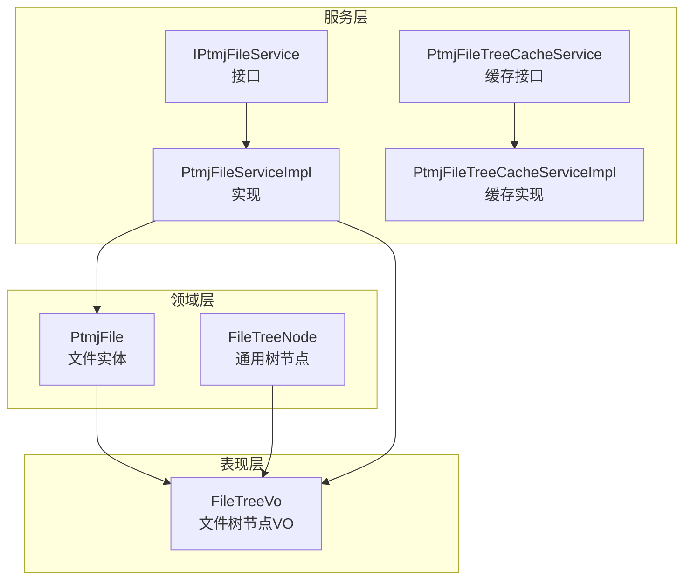
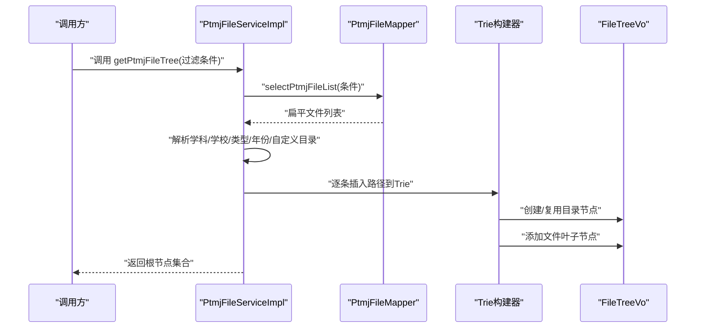
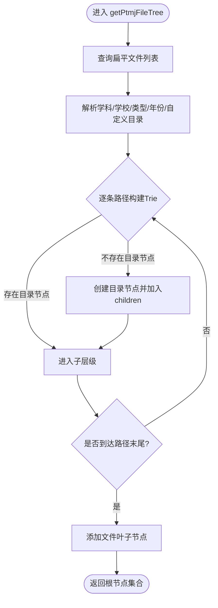
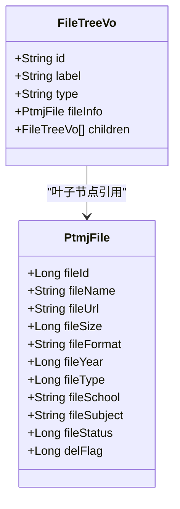
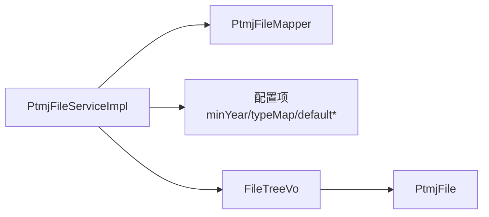

# 文件树结构

<cite>
**本文引用的文件**
- [PtmjFileServiceImpl.java](file://PezMax-Backend/ptmj-datum/src/main/java/com/ptmj/datum/service/impl/PtmjFileServiceImpl.java)
- [IPtmjFileService.java](file://PezMax-Backend/ptmj-datum/src/main/java/com/ptmj/datum/service/IPtmjFileService.java)
- [PtmjFileTreeCacheService.java](file://PezMax-Backend/ptmj-datum/src/main/java/com/ptmj/datum/service/PtmjFileTreeCacheService.java)
- [PtmjFileTreeCacheServiceImpl.java](file://PezMax-Backend/ptmj-datum/src/main/java/com/ptmj/datum/service/impl/PtmjFileTreeCacheServiceImpl.java)
- [FileTreeVo.java](file://PezMax-Backend/ptmj-datum/src/main/java/com/ptmj/datum/domain/vo/FileTreeVo.java)
- [FileTreeNode.java](file://PezMax-Backend/ptmj-datum/src/main/java/com/ptmj/datum/domain/FileTreeNode.java)
- [PtmjFile.java](file://PezMax-Backend/ptmj-datum/src/main/java/com/ptmj/datum/domain/PtmjFile.java)
</cite>

## 目录
1. [简介](#简介)
2. [项目结构](#项目结构)
3. [核心组件](#核心组件)
4. [架构总览](#架构总览)
5. [详细组件分析](#详细组件分析)
6. [依赖分析](#依赖分析)
7. [性能考虑](#性能考虑)
8. [故障排查指南](#故障排查指南)
9. [结论](#结论)
10. [附录](#附录)

## 简介
本文件围绕“文件树结构”展开，聚焦于后端服务中按学科→学校→类型→年份（可扩展自定义目录）的三级/四级聚合逻辑，深入解析 getPtmjFileTree 方法的实现原理、FileTreeVo 数据模型设计、节点关系映射与层级遍历算法。同时文档化文件分类体系（科目分类标准、文件类型定义、时间维度组织方式），并提供文件树缓存策略、性能优化方案、大数据量下的分页加载思路，以及文件搜索联想功能的关键词匹配与排序规则说明。

## 项目结构
与文件树相关的核心代码位于 ptmj-datum 模块：
- 领域模型：PtmjFile（文件实体）、FileTreeNode（通用树节点）
- 视图对象：FileTreeVo（文件树节点 VO）
- 业务服务：IPtmjFileService 接口与 PtmjFileServiceImpl 实现（包含 getPtmjFileTree 方法）
- 缓存接口：PtmjFileTreeCacheService 及其实现类（用于文件树缓存）

图表来源
- [PtmjFile.java](file://PezMax-Backend/ptmj-datum/src/main/java/com/ptmj/datum/domain/PtmjFile.java)
- [FileTreeNode.java](file://PezMax-Backend/ptmj-datum/src/main/java/com/ptmj/datum/domain/FileTreeNode.java)
- [FileTreeVo.java](file://PezMax-Backend/ptmj-datum/src/main/java/com/ptmj/datum/domain/vo/FileTreeVo.java)
- [IPtmjFileService.java](file://PezMax-Backend/ptmj-datum/src/main/java/com/ptmj/datum/service/IPtmjFileService.java)
- [PtmjFileServiceImpl.java](file://PezMax-Backend/ptmj-datum/src/main/java/com/ptmj/datum/service/impl/PtmjFileServiceImpl.java)
- [PtmjFileTreeCacheService.java](file://PezMax-Backend/ptmj-datum/src/main/java/com/ptmj/datum/service/PtmjFileTreeCacheService.java)
- [PtmjFileTreeCacheServiceImpl.java](file://PezMax-Backend/ptmj-datum/src/main/java/com/ptmj/datum/service/impl/PtmjFileTreeCacheServiceImpl.java)

章节来源
- [PtmjFileServiceImpl.java:281-352](file://PezMax-Backend/ptmj-datum/src/main/java/com/ptmj/datum/service/impl/PtmjFileServiceImpl.java#L281-L352)
- [IPtmjFileService.java:40-40](file://PezMax-Backend/ptmj-datum/src/main/java/com/ptmj/datum/service/IPtmjFileService.java#L40-L40)
- [PtmjFileTreeCacheService.java:3-10](file://PezMax-Backend/ptmj-datum/src/main/java/com/ptmj/datum/service/PtmjFileTreeCacheService.java#L3-L10)
- [PtmjFileTreeCacheServiceImpl.java:18-18](file://PezMax-Backend/ptmj-datum/src/main/java/com/ptmj/datum/service/impl/PtmjFileTreeCacheServiceImpl.java#L18-L18)
- [FileTreeVo.java:1-88](file://PezMax-Backend/ptmj-datum/src/main/java/com/ptmj/datum/domain/vo/FileTreeVo.java#L1-L88)
- [FileTreeNode.java:1-16](file://PezMax-Backend/ptmj-datum/src/main/java/com/ptmj/datum/domain/FileTreeNode.java#L1-L16)
- [PtmjFile.java:1-224](file://PezMax-Backend/ptmj-datum/src/main/java/com/ptmj/datum/domain/PtmjFile.java#L1-L224)

## 核心组件
- FileTreeVo：文件树节点 VO，包含 id、label、type（folder/file）、children 列表，以及叶子节点时携带的 fileInfo（PtmjFile）。
- PtmjFile：文件实体，包含学科、学校、类型、年份、文件名、URL、格式、状态等字段，是树构建的数据源。
- IPtmjFileService / PtmjFileServiceImpl：提供 getPtmjFileTree 方法，负责将扁平文件集合聚合成树形结构。
- PtmjFileTreeCacheService / 实现：提供获取和清空文件树缓存的能力，便于在高频读取场景下提升性能。

章节来源
- [FileTreeVo.java:1-88](file://PezMax-Backend/ptmj-datum/src/main/java/com/ptmj/datum/domain/vo/FileTreeVo.java#L1-L88)
- [PtmjFile.java:1-224](file://PezMax-Backend/ptmj-datum/src/main/java/com/ptmj/datum/domain/PtmjFile.java#L1-L224)
- [IPtmjFileService.java:40-40](file://PezMax-Backend/ptmj-datum/src/main/java/com/ptmj/datum/service/IPtmjFileService.java#L40-L40)
- [PtmjFileServiceImpl.java:281-352](file://PezMax-Backend/ptmj-datum/src/main/java/com/ptmj/datum/service/impl/PtmjFileServiceImpl.java#L281-L352)
- [PtmjFileTreeCacheService.java:3-10](file://PezMax-Backend/ptmj-datum/src/main/java/com/ptmj/datum/service/PtmjFileTreeCacheService.java#L3-L10)

## 架构总览
文件树构建流程从服务层开始，查询扁平文件列表后，基于学科→学校→类型→年份（及可选自定义目录）进行路径组装，随后动态构建 Trie 风格的树结构，最终返回根节点集合。

图表来源
- [PtmjFileServiceImpl.java:281-352](file://PezMax-Backend/ptmj-datum/src/main/java/com/ptmj/datum/service/impl/PtmjFileServiceImpl.java#L281-L352)

## 详细组件分析

### 文件树聚合算法（getPtmjFileTree）
- 输入：可选过滤条件的 PtmjFile 对象
- 步骤：
  - 查询所有符合条件的扁平文件列表
  - 解析基础四层路径：学科、学校、类型（通过配置映射）、年份（校验范围并回退默认值）
  - 解析额外自定义目录（remark 字段，以斜杠分隔）
  - 使用 Trie 风格动态构建：为每个路径段生成唯一节点 ID，查找或创建目录节点，进入下一层级
  - 遍历结束后，将当前文件作为叶子节点挂入最后一级 children
- 输出：根级 FileTreeVo 列表

图表来源
- [PtmjFileServiceImpl.java:281-352](file://PezMax-Backend/ptmj-datum/src/main/java/com/ptmj/datum/service/impl/PtmjFileServiceImpl.java#L281-L352)

章节来源
- [PtmjFileServiceImpl.java:281-352](file://PezMax-Backend/ptmj-datum/src/main/java/com/ptmj/datum/service/impl/PtmjFileServiceImpl.java#L281-L352)

### FileTreeVo 数据模型与节点关系
- 节点类型：
  - folder：目录节点，包含 children 列表
  - file：文件叶子节点，包含 fileInfo（PtmjFile）
- 节点标识：
  - id：字符串型唯一标识（目录节点由路径段哈希拼接，文件节点以“file-文件ID”形式）
  - label：展示名称（目录名或文件名）
- 层级关系：
  - 通过 children 形成树状结构
  - 叶子节点不再生成 children，而是携带完整文件信息

图表来源
- [FileTreeVo.java:1-88](file://PezMax-Backend/ptmj-datum/src/main/java/com/ptmj/datum/domain/vo/FileTreeVo.java#L1-L88)
- [PtmjFile.java:1-224](file://PezMax-Backend/ptmj-datum/src/main/java/com/ptmj/datum/domain/PtmjFile.java#L1-L224)

章节来源
- [FileTreeVo.java:1-88](file://PezMax-Backend/ptmj-datum/src/main/java/com/ptmj/datum/domain/vo/FileTreeVo.java#L1-L88)
- [PtmjFile.java:1-224](file://PezMax-Backend/ptmj-datum/src/main/java/com/ptmj/datum/domain/PtmjFile.java#L1-L224)

### 文件分类体系设计
- 学科（subject）：来源于 PtmjFile.fileSubject；为空时使用默认占位
- 学校（school）：来源于 PtmjFile.fileSchool；为空时使用默认占位
- 类型（type）：来源于 PtmjFile.fileType，通过配置映射为可读名称；未配置时使用默认类型
- 年份（year）：来源于 PtmjFile.fileYear，需满足最小年份与当前年份限制；否则回退默认年份
- 自定义目录（custom folders）：来源于 PtmjFile.remark，以斜杠分隔的多级目录，支持灵活扩展

章节来源
- [PtmjFileServiceImpl.java:281-352](file://PezMax-Backend/ptmj-datum/src/main/java/com/ptmj/datum/service/impl/PtmjFileServiceImpl.java#L281-L352)
- [PtmjFile.java:1-224](file://PezMax-Backend/ptmj-datum/src/main/java/com/ptmj/datum/domain/PtmjFile.java#L1-L224)

### 文件树缓存策略
- 缓存接口：PtmjFileTreeCacheService 提供 getFileTree() 与 clearCache()
- 典型策略建议：
  - 首次请求计算并写入缓存（如 Redis）
  - 后续请求直接读取缓存
  - 文件增删改后主动清理缓存键，保证一致性
  - 设置合理过期时间与容量上限，避免内存膨胀

章节来源
- [PtmjFileTreeCacheService.java:3-10](file://PezMax-Backend/ptmj-datum/src/main/java/com/ptmj/datum/service/PtmjFileTreeCacheService.java#L3-L10)
- [PtmjFileTreeCacheServiceImpl.java:18-18](file://PezMax-Backend/ptmj-datum/src/main/java/com/ptmj/datum/service/impl/PtmjFileTreeCacheServiceImpl.java#L18-L18)

### 大数据量下的分页与懒加载
- 服务端侧：
  - 对 getPtmjFileTree 增加分页参数（如 page、size），仅返回指定层级的部分节点
  - 对深层目录采用按需加载（点击展开再拉取子节点）
  - 对扁平列表查询增加索引与过滤条件，减少全表扫描
- 客户端侧：
  - 前端树组件支持虚拟滚动与懒加载
  - 对大分支进行折叠与增量渲染

[本节为通用指导，不涉及具体文件分析]

### 文件搜索联想功能（关键词匹配与排序）
- 关键词匹配：
  - 支持对文件名与学科名称进行模糊匹配
  - 空关键词时返回空结果或默认推荐
- 排序规则：
  - 学科命中优先排列（提高相关性）
  - 可结合最近更新时间或热度进行二次排序（如需）
- 联想推荐：
  - 提供学科与学校的联想接口，限制返回数量上限，避免过大响应

章节来源
- [PtmjFileServiceImpl.java:199-256](file://PezMax-Backend/ptmj-datum/src/main/java/com/ptmj/datum/service/impl/PtmjFileServiceImpl.java#L199-L256)

## 依赖分析
- 服务层依赖：
  - PtmjFileServiceImpl 依赖 PtmjFileMapper 进行数据访问
  - 依赖配置项（最小年份、类型映射、默认类型/学科等）
- 数据结构依赖：
  - FileTreeVo 依赖 PtmjFile（叶子节点）
  - 通用树节点 FileTreeNode 可作为替代或补充表示

图表来源
- [PtmjFileServiceImpl.java:281-352](file://PezMax-Backend/ptmj-datum/src/main/java/com/ptmj/datum/service/impl/PtmjFileServiceImpl.java#L281-L352)
- [FileTreeVo.java:1-88](file://PezMax-Backend/ptmj-datum/src/main/java/com/ptmj/datum/domain/vo/FileTreeVo.java#L1-L88)
- [PtmjFile.java:1-224](file://PezMax-Backend/ptmj-datum/src/main/java/com/ptmj/datum/domain/PtmjFile.java#L1-L224)

章节来源
- [PtmjFileServiceImpl.java:281-352](file://PezMax-Backend/ptmj-datum/src/main/java/com/ptmj/datum/service/impl/PtmjFileServiceImpl.java#L281-L352)
- [FileTreeVo.java:1-88](file://PezMax-Backend/ptmj-datum/src/main/java/com/ptmj/datum/domain/vo/FileTreeVo.java#L1-L88)
- [PtmjFile.java:1-224](file://PezMax-Backend/ptmj-datum/src/main/java/com/ptmj/datum/domain/PtmjFile.java#L1-L224)

## 性能考虑
- 查询优化：
  - 对常用过滤字段建立数据库索引（学科、学校、类型、年份）
  - 避免无条件的全表扫描，尽量传入过滤条件
- 构建优化：
  - 使用 Map 加速同层节点查找（当前实现为线性查找，可在大数据量下升级为 Map）
  - 预分配 children 列表容量，减少扩容开销
- 缓存优化：
  - 文件树结果缓存至 Redis，设置合理 TTL
  - 变更事件触发缓存失效，确保一致性
- 传输优化：
  - 对大体积树结构进行压缩（如 GZIP）
  - 前端采用懒加载与虚拟滚动，降低首屏压力

[本节为通用指导，不涉及具体文件分析]

## 故障排查指南
- 常见问题：
  - 类型映射缺失导致显示异常：检查配置项 type-map 是否正确
  - 年份越界导致回退默认值：确认 minYear 与当前年份范围
  - 自定义目录非法字符导致路径错误：注意 remark 字段的清洗与分隔符规范
- 定位建议：
  - 查看日志输出，确认 LibreOffice 转换与 MinIO 上传流程是否正常
  - 验证缓存键是否存在与是否被正确清理
  - 对树结构进行序列化打印，检查节点层级是否符合预期

章节来源
- [PtmjFileServiceImpl.java:281-352](file://PezMax-Backend/ptmj-datum/src/main/java/com/ptmj/datum/service/impl/PtmjFileServiceImpl.java#L281-L352)
- [PtmjFileTreeCacheService.java:3-10](file://PezMax-Backend/ptmj-datum/src/main/java/com/ptmj/datum/service/PtmjFileTreeCacheService.java#L3-L10)

## 结论
本文件系统梳理了文件树结构的实现与优化要点：以学科→学校→类型→年份为核心维度，结合自定义目录实现灵活的层级组织；通过 FileTreeVo 清晰表达节点关系；借助缓存与分页懒加载提升性能；并通过搜索联想增强用户体验。建议在大数据量场景下进一步引入 Map 加速查找、完善缓存失效机制与前端懒加载策略，以获得更稳定的性能表现。

## 附录
- 相关接口与方法路径：
  - 文件树构建：[PtmjFileServiceImpl.getPtmjFileTree:281-352](file://PezMax-Backend/ptmj-datum/src/main/java/com/ptmj/datum/service/impl/PtmjFileServiceImpl.java#L281-L352)
  - 文件树缓存接口：[PtmjFileTreeCacheService:3-10](file://PezMax-Backend/ptmj-datum/src/main/java/com/ptmj/datum/service/PtmjFileTreeCacheService.java#L3-L10)
  - 文件树节点 VO：[FileTreeVo:1-88](file://PezMax-Backend/ptmj-datum/src/main/java/com/ptmj/datum/domain/vo/FileTreeVo.java#L1-L88)
  - 文件实体：[PtmjFile:1-224](file://PezMax-Backend/ptmj-datum/src/main/java/com/ptmj/datum/domain/PtmjFile.java#L1-L224)
  - 通用树节点：[FileTreeNode:1-16](file://PezMax-Backend/ptmj-datum/src/main/java/com/ptmj/datum/domain/FileTreeNode.java#L1-L16)