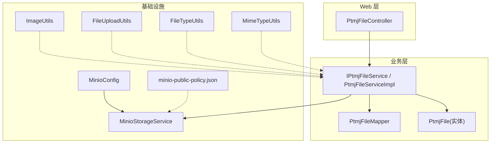
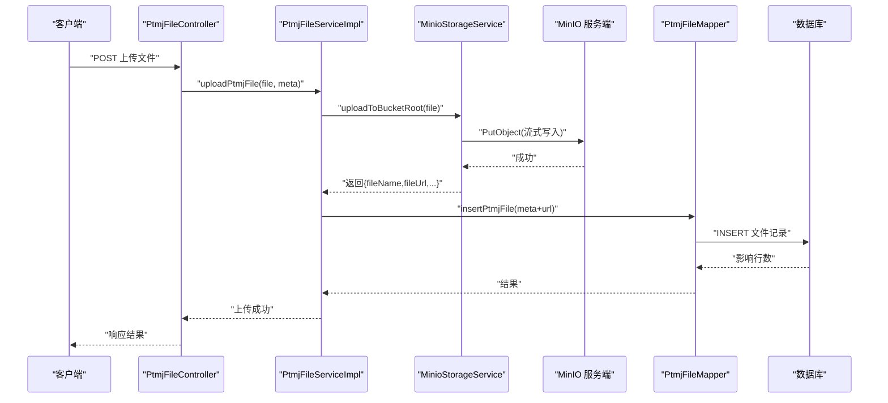
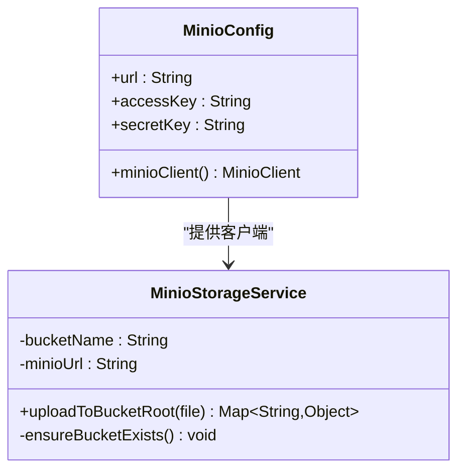
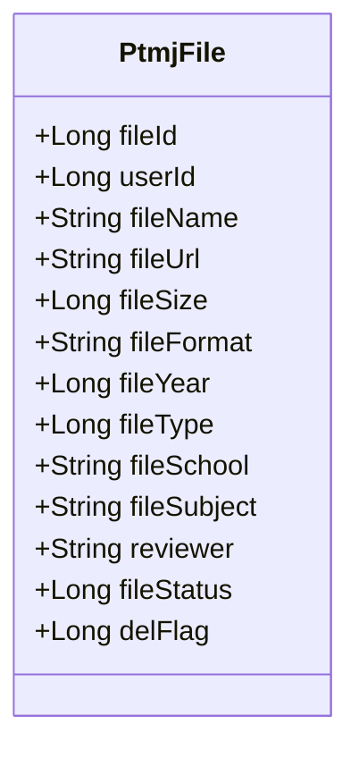
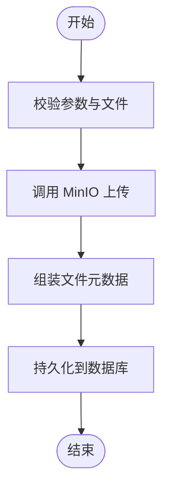
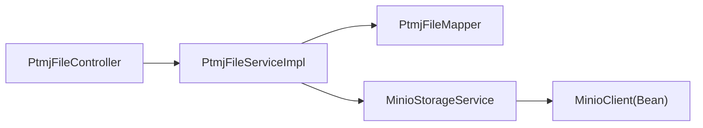
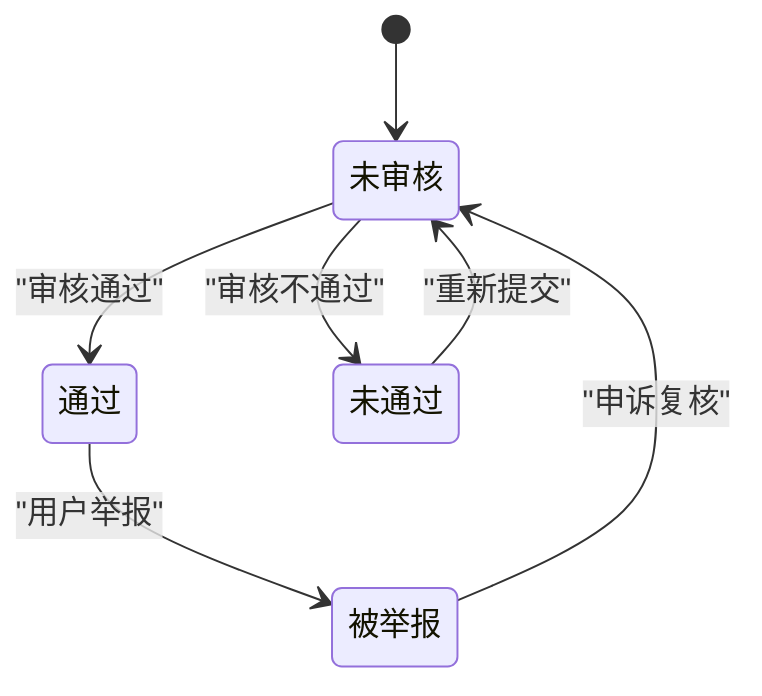

# 文件管理系统

<cite>
**本文引用的文件**   
- [MinioStorageService.java](file://PezMax-Backend/ruoyi-common/src/main/java/com/ruoyi/common/utils/file/MinioStorageService.java)
- [MinioConfig.java](file://PezMax-Backend/ruoyi-common/src/main/java/com/ruoyi/common/config/MinioConfig.java)
- [PtmjFile.java](file://PezMax-Backend/ptmj-datum/src/main/java/com/ptmj/datum/domain/PtmjFile.java)
- [IPtmjFileService.java](file://PezMax-Backend/ptmj-datum/src/main/java/com/ptmj/datum/service/IPtmjFileService.java)
- [PtmjFileServiceImpl.java](file://PezMax-Backend/ptmj-datum/src/main/java/com/ptmj/datum/service/impl/PtmjFileServiceImpl.java)
- [PtmjFileController.java](file://PezMax-Backend/ruoyi-admin/src/main/java/com/ruoyi/web/controller/datum/PtmjFileController.java)
- [PtmjFileMapper.java](file://PezMax-Backend/ptmj-datum/src/main/java/com/ptmj/datum/mapper/PtmjFileMapper.java)
- [minio-public-policy.json](file://PezMax-Backend/ptmj-datum/src/main/resources/minio-public-policy.json)
- [ImageUtils.java](file://PezMax-Backend/ruoyi-common/src/main/java/com/ruoyi/common/utils/file/ImageUtils.java)
- [FileUploadUtils.java](file://PezMax-Backend/ruoyi-common/src/main/java/com/ruoyi/common/utils/file/FileUploadUtils.java)
- [FileTypeUtils.java](file://PezMax-Backend/ruoyi-common/src/main/java/com/ruoyi/common/utils/file/FileTypeUtils.java)
- [MimeTypeUtils.java](file://PezMax-Backend/ruoyi-common/src/main/java/com/ruoyi/common/utils/file/MimeTypeUtils.java)
</cite>

## 目录
1. [简介](#简介)
2. [项目结构](#项目结构)
3. [核心组件](#核心组件)
4. [架构总览](#架构总览)
5. [详细组件分析](#详细组件分析)
6. [依赖关系分析](#依赖关系分析)
7. [性能考虑](#性能考虑)
8. [故障排查指南](#故障排查指南)
9. [结论](#结论)
10. [附录](#附录)

## 简介
本文件管理系统基于 RuoYi 后端框架，集成 MinIO 对象存储，提供文件上传、下载、元数据管理、审核流程与基础安全策略。当前实现聚焦于：
- 基于 MinIO 的直传与流式上传
- 文件元数据模型与持久化
- 公开桶策略（读）与访问控制基础
- 缩略图生成能力（工具类）
- 服务层接口与控制器入口

后续可扩展分片上传、断点续传、版本管理、防盗链、配额管理等高级特性。

## 项目结构
围绕“文件”相关的关键代码分布在以下模块：
- ruoyi-common：通用配置与工具（MinIO 客户端、图片处理、上传辅助等）
- ptmj-datum：业务领域（文件实体、服务接口与实现、数据映射）
- ruoyi-admin：Web 控制器（对外暴露 API）

图表来源
- [PtmjFileController.java](file://PezMax-Backend/ruoyi-admin/src/main/java/com/ruoyi/web/controller/datum/PtmjFileController.java)
- [IPtmjFileService.java](file://PezMax-Backend/ptmj-datum/src/main/java/com/ptmj/datum/service/IPtmjFileService.java)
- [PtmjFileServiceImpl.java](file://PezMax-Backend/ptmj-datum/src/main/java/com/ptmj/datum/service/impl/PtmjFileServiceImpl.java)
- [PtmjFileMapper.java](file://PezMax-Backend/ptmj-datum/src/main/java/com/ptmj/datum/mapper/PtmjFileMapper.java)
- [PtmjFile.java](file://PezMax-Backend/ptmj-datum/src/main/java/com/ptmj/datum/domain/PtmjFile.java)
- [MinioConfig.java](file://PezMax-Backend/ruoyi-common/src/main/java/com/ruoyi/common/config/MinioConfig.java)
- [MinioStorageService.java](file://PezMax-Backend/ruoyi-common/src/main/java/com/ruoyi/common/utils/file/MinioStorageService.java)
- [minio-public-policy.json](file://PezMax-Backend/ptmj-datum/src/main/resources/minio-public-policy.json)
- [ImageUtils.java](file://PezMax-Backend/ruoyi-common/src/main/java/com/ruoyi/common/utils/file/ImageUtils.java)
- [FileUploadUtils.java](file://PezMax-Backend/ruoyi-common/src/main/java/com/ruoyi/common/utils/file/FileUploadUtils.java)
- [FileTypeUtils.java](file://PezMax-Backend/ruoyi-common/src/main/java/com/ruoyi/common/utils/file/FileTypeUtils.java)
- [MimeTypeUtils.java](file://PezMax-Backend/ruoyi-common/src/main/java/com/ruoyi/common/utils/file/MimeTypeUtils.java)

章节来源
- [MinioConfig.java:1-28](file://PezMax-Backend/ruoyi-common/src/main/java/com/ruoyi/common/config/MinioConfig.java#L1-L28)
- [MinioStorageService.java:1-88](file://PezMax-Backend/ruoyi-common/src/main/java/com/ruoyi/common/utils/file/MinioStorageService.java#L1-L88)
- [PtmjFile.java:1-224](file://PezMax-Backend/ptmj-datum/src/main/java/com/ptmj/datum/domain/PtmjFile.java#L1-L224)
- [IPtmjFileService.java:1-119](file://PezMax-Backend/ptmj-datum/src/main/java/com/ptmj/datum/service/IPtmjFileService.java#L1-L119)
- [PtmjFileMapper.java:1-111](file://PezMax-Backend/ptmj-datum/src/main/java/com/ptmj/datum/mapper/PtmjFileMapper.java#L1-L111)
- [minio-public-policy.json:1-17](file://PezMax-Backend/ptmj-datum/src/main/resources/minio-public-policy.json#L1-L17)

## 核心组件
- MinIO 客户端与配置
  - 通过配置类注入 MinioClient，使用端点、AK/SK 初始化客户端。
  - 存储服务封装了桶存在性检查与根目录上传，返回文件名、URL、大小、格式、对象名等信息。
- 文件实体与元数据
  - 包含上传者、名称、URL、大小、格式、年份、类型、学校、科目、审核人、状态、删除标记等字段。
- 服务接口与实现
  - 提供查询、树形聚合、联想推荐、新增、批量删除、关键词搜索、上传并新增等能力。
- 控制器
  - 暴露 Web API，调用服务层完成上传、查询、审核等操作。
- 公共工具
  - 图片处理、上传辅助、类型与 MIME 工具为上传与缩略图生成提供支持。

章节来源
- [MinioConfig.java:1-28](file://PezMax-Backend/ruoyi-common/src/main/java/com/ruoyi/common/config/MinioConfig.java#L1-L28)
- [MinioStorageService.java:1-88](file://PezMax-Backend/ruoyi-common/src/main/java/com/ruoyi/common/utils/file/MinioStorageService.java#L1-L88)
- [PtmjFile.java:1-224](file://PezMax-Backend/ptmj-datum/src/main/java/com/ptmj/datum/domain/PtmjFile.java#L1-L224)
- [IPtmjFileService.java:1-119](file://PezMax-Backend/ptmj-datum/src/main/java/com/ptmj/datum/service/IPtmjFileService.java#L1-L119)
- [PtmjFileController.java](file://PezMax-Backend/ruoyi-admin/src/main/java/com/ruoyi/web/controller/datum/PtmjFileController.java)
- [ImageUtils.java](file://PezMax-Backend/ruoyi-common/src/main/java/com/ruoyi/common/utils/file/ImageUtils.java)
- [FileUploadUtils.java](file://PezMax-Backend/ruoyi-common/src/main/java/com/ruoyi/common/utils/file/FileUploadUtils.java)
- [FileTypeUtils.java](file://PezMax-Backend/ruoyi-common/src/main/java/com/ruoyi/common/utils/file/FileTypeUtils.java)
- [MimeTypeUtils.java](file://PezMax-Backend/ruoyi-common/src/main/java/com/ruoyi/common/utils/file/MimeTypeUtils.java)

## 架构总览
系统采用分层架构：Web 控制器 -> 业务服务 -> 数据映射 -> 数据库；同时通过存储服务对接 MinIO 对象存储。

图表来源
- [PtmjFileController.java](file://PezMax-Backend/ruoyi-admin/src/main/java/com/ruoyi/web/controller/datum/PtmjFileController.java)
- [PtmjFileServiceImpl.java](file://PezMax-Backend/ptmj-datum/src/main/java/com/ptmj/datum/service/impl/PtmjFileServiceImpl.java)
- [MinioStorageService.java:1-88](file://PezMax-Backend/ruoyi-common/src/main/java/com/ruoyi/common/utils/file/MinioStorageService.java#L1-L88)
- [PtmjFileMapper.java:1-111](file://PezMax-Backend/ptmj-datum/src/main/java/com/ptmj/datum/mapper/PtmjFileMapper.java#L1-L111)

## 详细组件分析

### MinIO 存储集成
- 客户端初始化
  - 从配置读取 endpoint、accessKey、secretKey，构建 MinioClient Bean。
- 上传流程
  - 校验文件非空，确保桶存在，生成唯一对象名（保留扩展名），设置 Content-Type，以流式方式 PutObject。
  - 拼接可访问 URL，返回统一数据结构（文件名、URL、大小、格式、对象名）。
- 桶策略
  - 提供公开读策略模板，允许匿名 GetObject，便于前端直接访问文件。

图表来源
- [MinioConfig.java:1-28](file://PezMax-Backend/ruoyi-common/src/main/java/com/ruoyi/common/config/MinioConfig.java#L1-L28)
- [MinioStorageService.java:1-88](file://PezMax-Backend/ruoyi-common/src/main/java/com/ruoyi/common/utils/file/MinioStorageService.java#L1-L88)

章节来源
- [MinioConfig.java:1-28](file://PezMax-Backend/ruoyi-common/src/main/java/com/ruoyi/common/config/MinioConfig.java#L1-L28)
- [MinioStorageService.java:1-88](file://PezMax-Backend/ruoyi-common/src/main/java/com/ruoyi/common/utils/file/MinioStorageService.java#L1-L88)
- [minio-public-policy.json:1-17](file://PezMax-Backend/ptmj-datum/src/main/resources/minio-public-policy.json#L1-L17)

### 文件实体与元数据模型
- 关键字段
  - 上传者、名称、URL、大小、格式、年份、类型、学校、科目、审核人、状态、删除标记。
- 用途
  - 承载文件元信息，支撑列表、树形聚合、检索、权限与审计。

图表来源
- [PtmjFile.java:1-224](file://PezMax-Backend/ptmj-datum/src/main/java/com/ptmj/datum/domain/PtmjFile.java#L1-L224)

章节来源
- [PtmjFile.java:1-224](file://PezMax-Backend/ptmj-datum/src/main/java/com/ptmj/datum/domain/PtmjFile.java#L1-L224)

### 服务层接口与实现
- 主要能力
  - 查询、树形聚合、联想推荐、新增、批量删除、关键词搜索、上传并新增。
- 上传并新增
  - 调用存储服务完成对象上传，获取 URL 后落库保存元数据。

图表来源
- [IPtmjFileService.java:1-119](file://PezMax-Backend/ptmj-datum/src/main/java/com/ptmj/datum/service/IPtmjFileService.java#L1-L119)
- [PtmjFileServiceImpl.java](file://PezMax-Backend/ptmj-datum/src/main/java/com/ptmj/datum/service/impl/PtmjFileServiceImpl.java)

章节来源
- [IPtmjFileService.java:1-119](file://PezMax-Backend/ptmj-datum/src/main/java/com/ptmj/datum/service/IPtmjFileService.java#L1-L119)
- [PtmjFileServiceImpl.java](file://PezMax-Backend/ptmj-datum/src/main/java/com/ptmj/datum/service/impl/PtmjFileServiceImpl.java)

### 控制器与 API 入口
- 职责
  - 接收 HTTP 请求，解析参数与文件，委托服务层处理，返回统一响应。
- 典型流程
  - 上传：接收 multipart/form-data，调用 uploadPtmjFile，返回结果。
  - 查询：根据条件或关键词检索，返回文件或树形结构。

章节来源
- [PtmjFileController.java](file://PezMax-Backend/ruoyi-admin/src/main/java/com/ruoyi/web/controller/datum/PtmjFileController.java)

### 缩略图生成
- 能力
  - 提供图像处理工具类，用于生成缩略图（如图片预览）。
- 集成建议
  - 在上传成功后，对图片类型触发异步缩略图生成，并将缩略图 URL 回写至元数据或独立表。

章节来源
- [ImageUtils.java](file://PezMax-Backend/ruoyi-common/src/main/java/com/ruoyi/common/utils/file/ImageUtils.java)

### 上传辅助与类型识别
- 上传辅助
  - 提供通用上传工具，支持大小限制、路径组织、重命名等。
- 类型与 MIME
  - 提供文件类型判断与 MIME 类型工具，配合上传流程进行校验与内容类型设置。

章节来源
- [FileUploadUtils.java](file://PezMax-Backend/ruoyi-common/src/main/java/com/ruoyi/common/utils/file/FileUploadUtils.java)
- [FileTypeUtils.java](file://PezMax-Backend/ruoyi-common/src/main/java/com/ruoyi/common/utils/file/FileTypeUtils.java)
- [MimeTypeUtils.java](file://PezMax-Backend/ruoyi-common/src/main/java/com/ruoyi/common/utils/file/MimeTypeUtils.java)

## 依赖关系分析
- 组件耦合
  - 控制器依赖服务接口；服务实现依赖 Mapper 与存储服务；存储服务依赖 MinIO 客户端。
- 外部依赖
  - MinIO SDK、Spring 配置、MyBatis 映射。
- 潜在风险
  - 若未引入分片/并发逻辑，大文件上传可能受限于内存与超时；需结合网关/容器超时与线程池配置。

图表来源
- [PtmjFileController.java](file://PezMax-Backend/ruoyi-admin/src/main/java/com/ruoyi/web/controller/datum/PtmjFileController.java)
- [PtmjFileServiceImpl.java](file://PezMax-Backend/ptmj-datum/src/main/java/com/ptmj/datum/service/impl/PtmjFileServiceImpl.java)
- [PtmjFileMapper.java:1-111](file://PezMax-Backend/ptmj-datum/src/main/java/com/ptmj/datum/mapper/PtmjFileMapper.java#L1-L111)
- [MinioStorageService.java:1-88](file://PezMax-Backend/ruoyi-common/src/main/java/com/ruoyi/common/utils/file/MinioStorageService.java#L1-L88)
- [MinioConfig.java:1-28](file://PezMax-Backend/ruoyi-common/src/main/java/com/ruoyi/common/config/MinioConfig.java#L1-L28)

## 性能考虑
- 流式处理
  - 上传采用流式 PutObject，避免一次性加载到内存，降低峰值内存占用。
- 并发控制
  - 针对高并发场景，合理配置 Tomcat/Netty 线程池与连接池，避免阻塞。
- 超时与重试
  - 调整网关与应用层超时时间，必要时增加网络重试与幂等设计。
- 缓存与索引
  - 对热门文件 URL 与元数据进行缓存；为常用查询字段建立索引以提升检索性能。
- 缩略图异步化
  - 将缩略图生成放入异步任务队列，避免阻塞主上传链路。

[本节为通用指导，不直接分析具体文件]

## 故障排查指南
- 上传失败
  - 检查 MinIO 端点、AK/SK 配置是否正确；确认桶是否存在且策略允许写入（当前策略仅开放读）。
- 无法访问文件
  - 确认 minio-public-policy.json 中 bucketName 占位符已替换为实际桶名；浏览器跨域与 Referer 白名单是否放行。
- 缩略图未生成
  - 检查 ImageUtils 调用时机与异常日志；确认图片类型与尺寸是否在支持范围内。
- 数据库写入失败
  - 核对事务边界与插入语句；查看 Mapper XML 与字段映射是否一致。

章节来源
- [MinioConfig.java:1-28](file://PezMax-Backend/ruoyi-common/src/main/java/com/ruoyi/common/config/MinioConfig.java#L1-L28)
- [MinioStorageService.java:1-88](file://PezMax-Backend/ruoyi-common/src/main/java/com/ruoyi/common/utils/file/MinioStorageService.java#L1-L88)
- [minio-public-policy.json:1-17](file://PezMax-Backend/ptmj-datum/src/main/resources/minio-public-policy.json#L1-L17)
- [PtmjFileMapper.java:1-111](file://PezMax-Backend/ptmj-datum/src/main/java/com/ptmj/datum/mapper/PtmjFileMapper.java#L1-L111)

## 结论
当前系统已完成基于 MinIO 的文件上传与元数据管理，具备公开读策略与缩略图工具基础。建议在后续迭代中补充分片上传、断点续传、版本管理与更细粒度的访问控制，并结合异步与缓存优化大文件处理体验。

[本节为总结，不直接分析具体文件]

## 附录

### 文件审核流程（概念）
- 状态定义
  - 未审核、通过、未通过、被举报。
- 流程建议
  - 上传后默认未审核；管理员审核通过后开放下载；未通过或被举报时隐藏或限制访问。

[此图为概念流程，不直接对应具体源码文件]

### 高级特性规划（概念）
- 分片上传与断点续传
  - 前端分片、后端合并、进度与状态持久化、失败重试。
- 版本管理
  - 同一对象名保留历史版本，支持回滚与对比。
- 防盗链与签名链接
  - 基于 Referer/域名白名单与临时签名 URL 控制访问。
- 存储配额
  - 按用户统计文件数/容量，超限拦截或提示升级。

[本节为概念说明，不直接分析具体文件]