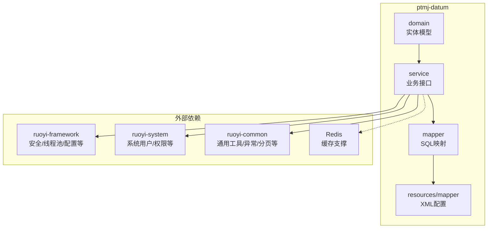
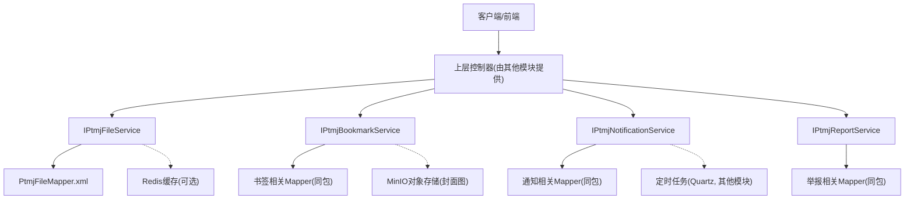
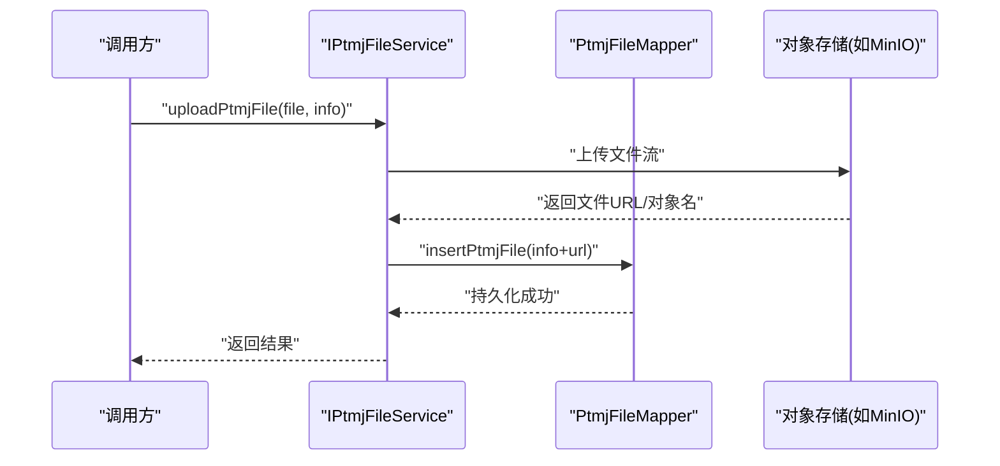
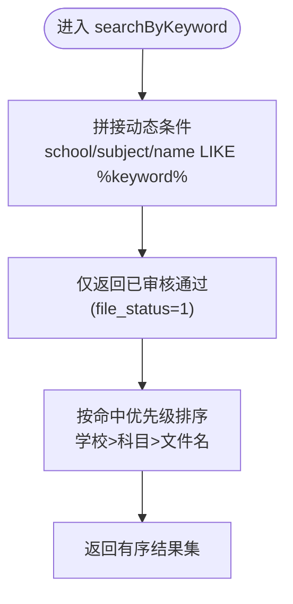
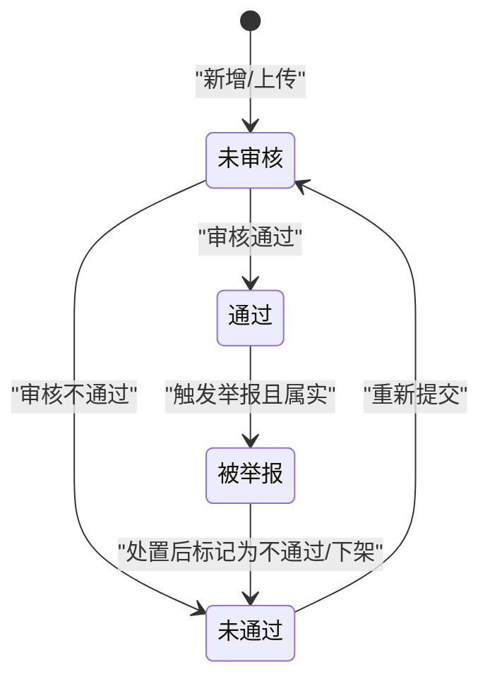
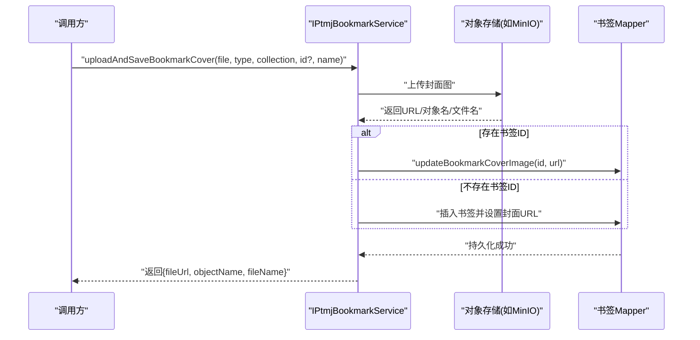
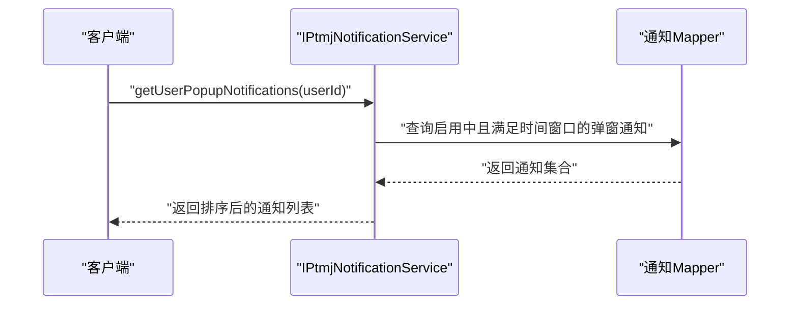
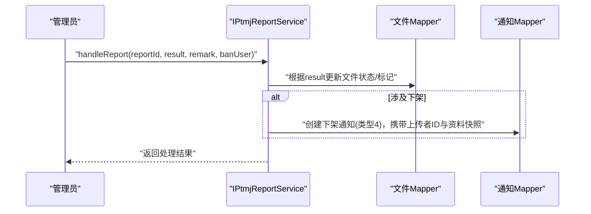
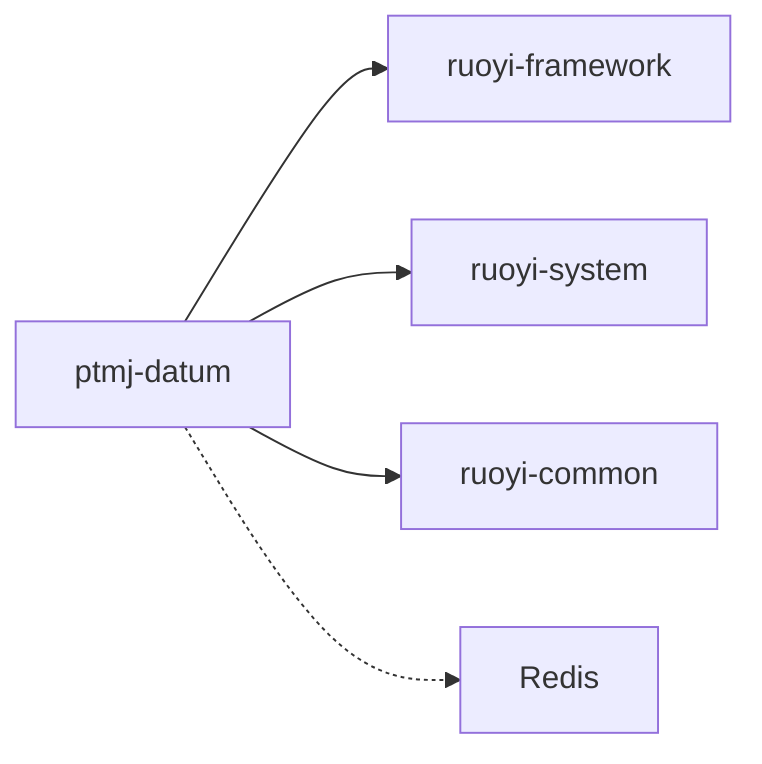

# ptmj-datum 业务数据模块

<cite>
**本文引用的文件**   
- [pom.xml](file://PezMax-Backend/ptmj-datum/pom.xml)
- [PtmjFile.java](file://PezMax-Backend/ptmj-datum/src/main/java/com/ptmj/datum/domain/PtmjFile.java)
- [PtmjBookmark.java](file://PezMax-Backend/ptmj-datum/src/main/java/com/ptmj/datum/domain/PtmjBookmark.java)
- [PtmjNotification.java](file://PezMax-Backend/ptmj-datum/src/main/java/com/ptmj/datum/domain/PtmjNotification.java)
- [PtmjReport.java](file://PezMax-Backend/ptmj-datum/src/main/java/com/ptmj/datum/domain/PtmjReport.java)
- [PtmjBookmarkFavorite.java](file://PezMax-Backend/ptmj-datum/src/main/java/com/ptmj/datum/domain/PtmjBookmarkFavorite.java)
- [PtmjFileDownload.java](file://PezMax-Backend/ptmj-datum/src/main/java/com/ptmj/datum/domain/PtmjFileDownload.java)
- [PtmjFileFavorite.java](file://PezMax-Backend/ptmj-datum/src/main/java/com/ptmj/datum/domain/PtmjFileFavorite.java)
- [PtmjBookmarkReport.java](file://PezMax-Backend/ptmj-datum/src/main/java/com/ptmj/datum/domain/PtmjBookmarkReport.java)
- [IPtmjFileService.java](file://PezMax-Backend/ptmj-datum/src/main/java/com/ptmj/datum/service/IPtmjFileService.java)
- [IPtmjBookmarkService.java](file://PezMax-Backend/ptmj-datum/src/main/java/com/ptmj/datum/service/IPtmjBookmarkService.java)
- [IPtmjNotificationService.java](file://PezMax-Backend/ptmj-datum/src/main/java/com/ptmj/datum/service/IPtmjNotificationService.java)
- [IPtmjReportService.java](file://PezMax-Backend/ptmj-datum/src/main/java/com/ptmj/datum/service/IPtmjReportService.java)
- [PtmjFileMapper.xml](file://PezMax-Backend/ptmj-datum/src/main/resources/mapper/datum/PtmjFileMapper.xml)
</cite>

## 目录
1. [简介](#简介)
2. [项目结构](#项目结构)
3. [核心组件](#核心组件)
4. [架构总览](#架构总览)
5. [详细组件分析](#详细组件分析)
6. [依赖分析](#依赖分析)
7. [性能考虑](#性能考虑)
8. [故障排查指南](#故障排查指南)
9. [结论](#结论)
10. [附录](#附录)

## 简介
本指南面向 ptmj-datum 业务数据模块的开发者与集成者，聚焦以下能力：
- 文件管理系统：上传下载、审核流程、版本控制（以状态与元数据为主）
- 书签管理系统：收藏分类、批量操作、标签管理（通过学科/专栏等维度组织）
- 通知推送系统：消息模板、定时任务、多渠道推送（基于通知类型与展示形态）
- 举报管理系统：内容审核、处理流程、统计分析（含文件与书签两类举报）

文档从领域模型、服务层设计、数据访问模式到业务流程编排进行系统化说明，并给出可落地的优化建议与排障指引。

## 项目结构
ptmj-datum 采用典型的分层结构：domain 定义领域实体，service 暴露业务能力接口，mapper 提供 SQL 映射；同时依赖通用框架与系统模块，以及 Redis 缓存支持。

图表来源
- [pom.xml:1-51](file://PezMax-Backend/ptmj-datum/pom.xml#L1-L51)

章节来源
- [pom.xml:1-51](file://PezMax-Backend/ptmj-datum/pom.xml#L1-L51)

## 核心组件
本节梳理四大子域的核心实体与服务边界，明确职责与交互契约。

- 文件域
  - 实体：PtmjFile（文件主信息）、PtmjFileDownload（下载记录）、PtmjFileFavorite（收藏关系）
  - 服务：IPtmjFileService（CRUD、树形聚合、联想推荐、关键词搜索、上传封装）
  - 数据访问：PtmjFileMapper.xml（动态条件查询、联想统计、关键词排序）

- 书签域
  - 实体：PtmjBookmark（书签主信息）、PtmjBookmarkFavorite（收藏关系）、PtmjBookmarkReport（举报）
  - 服务：IPtmjBookmarkService（CRUD、封面图上传与更新、组合上传保存）

- 通知域
  - 实体：PtmjNotification（通知模板/规则，含多种类型与展示形态）
  - 服务：IPtmjNotificationService（CRUD、按用户获取弹窗/滚动列表）

- 举报域
  - 实体：PtmjReport（文件举报）、PtmjBookmarkReport（书签举报）
  - 服务：IPtmjReportService（CRUD、处理流程方法 handleReport）

章节来源
- [PtmjFile.java:1-224](file://PezMax-Backend/ptmj-datum/src/main/java/com/ptmj/datum/domain/PtmjFile.java#L1-L224)
- [PtmjFileDownload.java:1-102](file://PezMax-Backend/ptmj-datum/src/main/java/com/ptmj/datum/domain/PtmjFileDownload.java#L1-L102)
- [PtmjFileFavorite.java:1-52](file://PezMax-Backend/ptmj-datum/src/main/java/com/ptmj/datum/domain/PtmjFileFavorite.java#L1-L52)
- [PtmjBookmark.java:1-218](file://PezMax-Backend/ptmj-datum/src/main/java/com/ptmj/datum/domain/PtmjBookmark.java#L1-L218)
- [PtmjBookmarkFavorite.java:1-49](file://PezMax-Backend/ptmj-datum/src/main/java/com/ptmj/datum/domain/PtmjBookmarkFavorite.java#L1-L49)
- [PtmjBookmarkReport.java:1-103](file://PezMax-Backend/ptmj-datum/src/main/java/com/ptmj/datum/domain/PtmjBookmarkReport.java#L1-L103)
- [PtmjNotification.java:1-300](file://PezMax-Backend/ptmj-datum/src/main/java/com/ptmj/datum/domain/PtmjNotification.java#L1-L300)
- [PtmjReport.java:1-103](file://PezMax-Backend/ptmj-datum/src/main/java/com/ptmj/datum/domain/PtmjReport.java#L1-L103)
- [IPtmjFileService.java:1-119](file://PezMax-Backend/ptmj-datum/src/main/java/com/ptmj/datum/service/IPtmjFileService.java#L1-L119)
- [IPtmjBookmarkService.java:1-89](file://PezMax-Backend/ptmj-datum/src/main/java/com/ptmj/datum/service/IPtmjBookmarkService.java#L1-L89)
- [IPtmjNotificationService.java:1-75](file://PezMax-Backend/ptmj-datum/src/main/java/com/ptmj/datum/service/IPtmjNotificationService.java#L1-L75)
- [IPtmjReportService.java:1-62](file://PezMax-Backend/ptmj-datum/src/main/java/com/ptmj/datum/service/IPtmjReportService.java#L1-L62)
- [PtmjFileMapper.xml:1-200](file://PezMax-Backend/ptmj-datum/src/main/resources/mapper/datum/PtmjFileMapper.xml#L1-L200)

## 架构总览
下图展示了 ptmj-datum 在整体系统中的位置与关键依赖关系。

图表来源
- [pom.xml:1-51](file://PezMax-Backend/ptmj-datum/pom.xml#L1-L51)
- [PtmjFileMapper.xml:1-200](file://PezMax-Backend/ptmj-datum/src/main/resources/mapper/datum/PtmjFileMapper.xml#L1-L200)

## 详细组件分析

### 文件管理系统
- 领域模型
  - PtmjFile：文件主信息，包含名称、URL、大小、格式、年份、类型、学校、科目、审核人、状态、删除标记等
  - PtmjFileDownload：下载流水，记录用户与时间
  - PtmjFileFavorite：收藏关系，文件与用户多对多

- 服务层设计
  - IPtmjFileService 提供：
    - 基础 CRUD
    - 文件树：按“科目 -> 类型 -> 年份”聚合
    - 联想推荐：学科/学校前缀匹配与计数排序
    - 关键词搜索：命中优先级排序（学校 > 科目 > 文件名）
    - 上传封装：uploadPtmjFile 统一入口（内部应结合对象存储与元数据写入）

- 数据访问模式
  - PtmjFileMapper.xml 实现：
    - 动态条件查询（模糊/精确）
    - 联想统计（GROUP BY + LIMIT）
    - 关键词搜索（CASE WHEN 排序）
    - 软删除过滤（del_flag）

- 典型流程：上传文件

图表来源
- [IPtmjFileService.java:86-93](file://PezMax-Backend/ptmj-datum/src/main/java/com/ptmj/datum/service/IPtmjFileService.java#L86-L93)
- [PtmjFileMapper.xml:96-136](file://PezMax-Backend/ptmj-datum/src/main/resources/mapper/datum/PtmjFileMapper.xml#L96-L136)

- 典型流程：关键词搜索

图表来源
- [IPtmjFileService.java:69-75](file://PezMax-Backend/ptmj-datum/src/main/java/com/ptmj/datum/service/IPtmjFileService.java#L69-L75)
- [PtmjFileMapper.xml:174-192](file://PezMax-Backend/ptmj-datum/src/main/resources/mapper/datum/PtmjFileMapper.xml#L174-L192)

- 审核流程与状态机

章节来源
- [PtmjFile.java:1-224](file://PezMax-Backend/ptmj-datum/src/main/java/com/ptmj/datum/domain/PtmjFile.java#L1-L224)
- [PtmjFileDownload.java:1-102](file://PezMax-Backend/ptmj-datum/src/main/java/com/ptmj/datum/domain/PtmjFileDownload.java#L1-L102)
- [PtmjFileFavorite.java:1-52](file://PezMax-Backend/ptmj-datum/src/main/java/com/ptmj/datum/domain/PtmjFileFavorite.java#L1-L52)
- [IPtmjFileService.java:1-119](file://PezMax-Backend/ptmj-datum/src/main/java/com/ptmj/datum/service/IPtmjFileService.java#L1-L119)
- [PtmjFileMapper.xml:1-200](file://PezMax-Backend/ptmj-datum/src/main/resources/mapper/datum/PtmjFileMapper.xml#L1-L200)

### 书签管理系统
- 领域模型
  - PtmjBookmark：书签主信息，包含链接、标题、描述、封面图、学科、资源类型、专栏、状态、删除标记、关键字段
  - PtmjBookmarkFavorite：收藏关系（书签-用户）
  - PtmjBookmarkReport：书签举报（原因、结果）

- 服务层设计
  - IPtmjBookmarkService 提供：
    - 基础 CRUD
    - 封面图上传：uploadBookmarkCover / uploadAndSaveBookmarkCover
    - 封面图更新：updateBookmarkCoverImage

- 典型流程：上传并保存封面图

图表来源
- [IPtmjBookmarkService.java:77-87](file://PezMax-Backend/ptmj-datum/src/main/java/com/ptmj/datum/service/IPtmjBookmarkService.java#L77-L87)
- [IPtmjBookmarkService.java:66-75](file://PezMax-Backend/ptmj-datum/src/main/java/com/ptmj/datum/service/IPtmjBookmarkService.java#L66-L75)

- 分类与标签管理
  - 使用 subject（学科）、collection（专栏）、resourceType（资源类型）作为多维组织方式
  - 可通过 keyword 字段进行统一模糊检索（标题或描述）

章节来源
- [PtmjBookmark.java:1-218](file://PezMax-Backend/ptmj-datum/src/main/java/com/ptmj/datum/domain/PtmjBookmark.java#L1-L218)
- [PtmjBookmarkFavorite.java:1-49](file://PezMax-Backend/ptmj-datum/src/main/java/com/ptmj/datum/domain/PtmjBookmarkFavorite.java#L1-L49)
- [PtmjBookmarkReport.java:1-103](file://PezMax-Backend/ptmj-datum/src/main/java/com/ptmj/datum/domain/PtmjBookmarkReport.java#L1-L103)
- [IPtmjBookmarkService.java:1-89](file://PezMax-Backend/ptmj-datum/src/main/java/com/ptmj/datum/service/IPtmjBookmarkService.java#L1-L89)

### 通知推送系统
- 领域模型
  - PtmjNotification：通知模板/规则，包含类型、标题、正文、启用状态、排序、展示形态（弹窗/滚动字幕），以及针对不同类型的时间窗口与提醒策略

- 服务层设计
  - IPtmjNotificationService 提供：
    - 基础 CRUD
    - 用户端弹窗通知：getUserPopupNotifications(userId)
    - 用户端滚动通知：getUserScrollNotifications()

- 典型流程：获取用户端弹窗通知

图表来源
- [IPtmjNotificationService.java:62-67](file://PezMax-Backend/ptmj-datum/src/main/java/com/ptmj/datum/service/IPtmjNotificationService.java#L62-L67)

- 多渠道推送与定时任务
  - 类型覆盖：版本更新、系统故障、系统维护、资料下架、日常滚动
  - 展示形态：弹窗、滚动字幕
  - 时间窗口：故障/维护的开始结束时间、提前提醒分钟数、滚动开始结束时间与间隔
  - 定时任务：可由上层 Quartz 模块驱动，周期性拉取并分发至各渠道（站内信、邮件、短信等）

章节来源
- [PtmjNotification.java:1-300](file://PezMax-Backend/ptmj-datum/src/main/java/com/ptmj/datum/domain/PtmjNotification.java#L1-L300)
- [IPtmjNotificationService.java:1-75](file://PezMax-Backend/ptmj-datum/src/main/java/com/ptmj/datum/service/IPtmjNotificationService.java#L1-L75)

### 举报管理系统
- 领域模型
  - PtmjReport：文件举报（文件ID、举报人、原因、结果）
  - PtmjBookmarkReport：书签举报（书签ID、举报人、原因、结果）

- 服务层设计
  - IPtmjReportService 提供：
    - 基础 CRUD
    - 处理流程：handleReport(reportId, result, remark, banUser)

- 典型流程：处理举报

图表来源
- [IPtmjReportService.java:61-62](file://PezMax-Backend/ptmj-datum/src/main/java/com/ptmj/datum/service/IPtmjReportService.java#L61-L62)
- [PtmjNotification.java:67-77](file://PezMax-Backend/ptmj-datum/src/main/java/com/ptmj/datum/domain/PtmjNotification.java#L67-L77)

- 统计分析
  - 可按举报结果、时间范围、对象类型（文件/书签）进行汇总
  - 建议结合报表视图或物化统计表提升查询性能

章节来源
- [PtmjReport.java:1-103](file://PezMax-Backend/ptmj-datum/src/main/java/com/ptmj/datum/domain/PtmjReport.java#L1-L103)
- [PtmjBookmarkReport.java:1-103](file://PezMax-Backend/ptmj-datum/src/main/java/com/ptmj/datum/domain/PtmjBookmarkReport.java#L1-L103)
- [IPtmjReportService.java:1-62](file://PezMax-Backend/ptmj-datum/src/main/java/com/ptmj/datum/service/IPtmjReportService.java#L1-L62)

## 依赖分析
- 模块依赖
  - ruoyi-framework：安全、线程池、全局异常、过滤器等
  - ruoyi-system：系统用户、权限、字典等
  - ruoyi-common：通用工具、分页、Excel、异常体系
  - spring-boot-starter-data-redis：缓存支撑（用于热点数据、联想词缓存等）

- 耦合与内聚
  - service 层仅依赖接口与通用组件，保持高内聚低耦合
  - mapper XML 集中管理 SQL，便于审计与优化
  - 实体类遵循 BaseEntity 扩展，统一审计字段

图表来源
- [pom.xml:23-49](file://PezMax-Backend/ptmj-datum/pom.xml#L23-L49)

章节来源
- [pom.xml:1-51](file://PezMax-Backend/ptmj-datum/pom.xml#L1-L51)

## 性能考虑
- 数据库层面
  - 关键词搜索使用 LIKE 模糊匹配，建议在 file_school、file_subject、file_name 建立合适索引
  - 联想推荐使用 GROUP BY + LIMIT，注意大表分组开销，必要时引入缓存或预聚合表
  - 软删除 del_flag 参与查询，确保索引覆盖常用过滤条件

- 缓存策略
  - 联想词（学科/学校）可缓存至 Redis，设置合理过期与失效策略
  - 热门文件树可按维度缓存，避免频繁聚合计算

- I/O 与对象存储
  - 封面图与大文件上传走对象存储，减少数据库压力
  - 下载记录异步落库，降低主流程延迟

- 并发与限流
  - 上传接口增加幂等与重复提交防护
  - 举报处理接口加锁，防止并发重复处置

[本节为通用指导，无需源码引用]

## 故障排查指南
- 常见问题定位
  - 上传失败：检查对象存储连通性与权限策略，确认返回 URL 是否合法
  - 搜索无结果：核对 file_status 过滤条件与索引命中情况
  - 通知未展示：校验时间窗口、displayMode 与 status 配置
  - 举报处理异常：确认 handleReport 的事务边界与下游联动（文件状态、通知生成）

- 日志与监控
  - 关键路径打印入参出参与耗时
  - 上报异常堆栈与上下文（用户ID、对象ID、操作类型）

[本节为通用指导，无需源码引用]

## 结论
ptmj-datum 围绕“文件-书签-通知-举报”四大子域构建，采用清晰的分层与接口契约，具备良好的可扩展性。通过合理的索引、缓存与对象存储策略，可在保证一致性的前提下获得良好性能。后续可进一步引入更完善的审计、统计与告警机制，以提升运营与运维效率。

[本节为总结性内容，无需源码引用]

## 附录
- 术语
  - 软删除：通过 del_flag 标记逻辑删除
  - 展示形态：通知的前端呈现方式（弹窗/滚动字幕）
  - 资源类型：书签的分类维度之一

[本节为补充说明，无需源码引用]