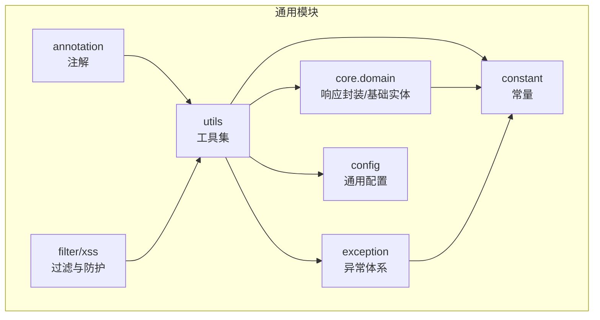
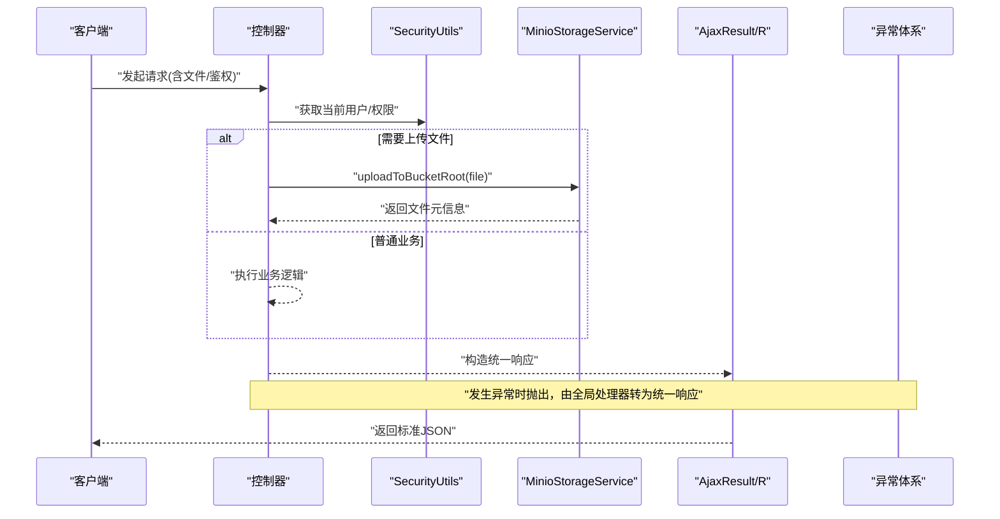
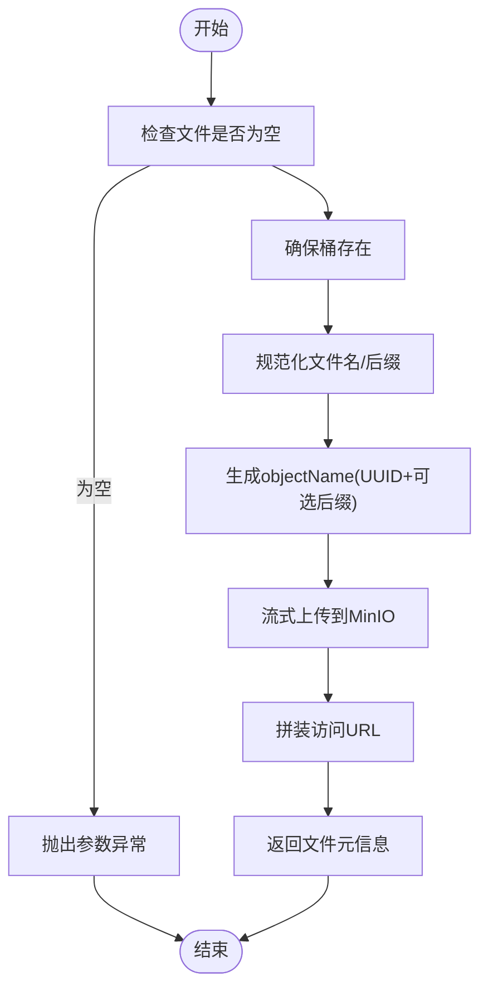
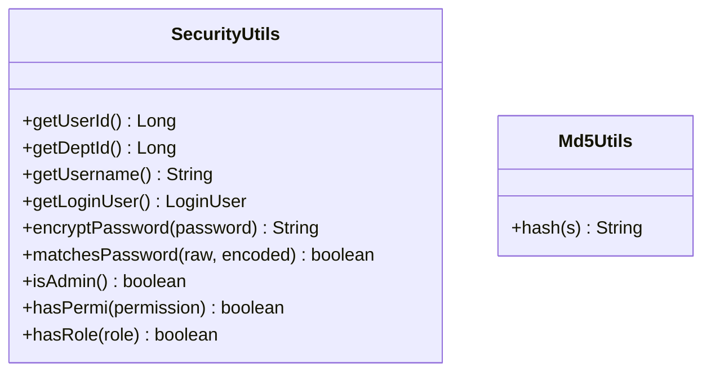
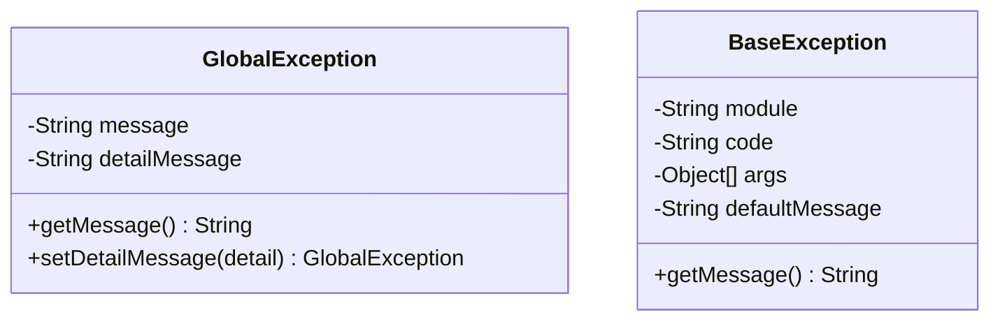
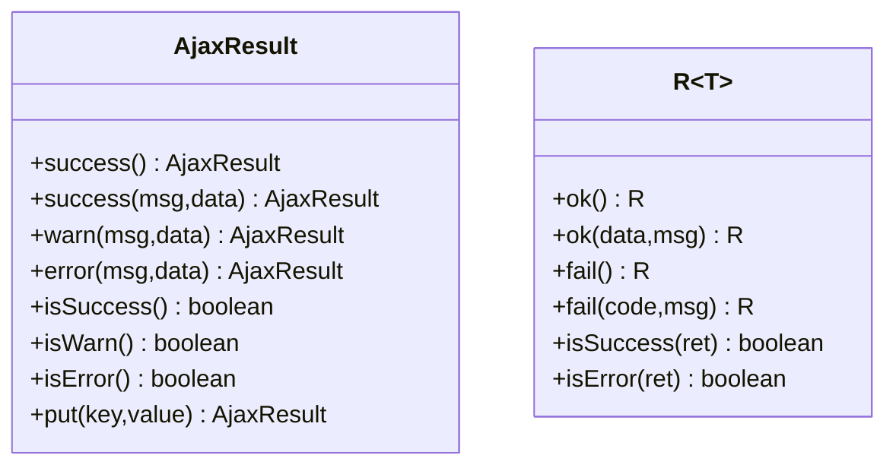
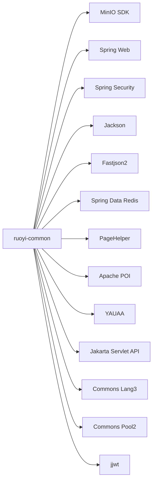

# ruoyi-common 通用模块

<cite>
**本文引用的文件**   
- [pom.xml](file://PezMax-Backend/ruoyi-common/pom.xml)
- [FileUploadUtils.java](file://PezMax-Backend/ruoyi-common/src/main/java/com/ruoyi/common/utils/file/FileUploadUtils.java)
- [MinioStorageService.java](file://PezMax-Backend/ruoyi-common/src/main/java/com/ruoyi/common/utils/file/MinioStorageService.java)
- [Md5Utils.java](file://PezMax-Backend/ruoyi-common/src/main/java/com/ruoyi/common/utils/sign/Md5Utils.java)
- [SecurityUtils.java](file://PezMax-Backend/ruoyi-common/src/main/java/com/ruoyi/common/utils/SecurityUtils.java)
- [AjaxResult.java](file://PezMax-Backend/ruoyi-common/src/main/java/com/ruoyi/common/core/domain/AjaxResult.java)
- [R.java](file://PezMax-Backend/ruoyi-common/src/main/java/com/ruoyi/common/core/domain/R.java)
- [GlobalException.java](file://PezMax-Backend/ruoyi-common/src/main/java/com/ruoyi/common/exception/GlobalException.java)
- [BaseException.java](file://PezMax-Backend/ruoyi-common/src/main/java/com/ruoyi/common/exception/base/BaseException.java)
- [StringUtils.java](file://PezMax-Backend/ruoyi-common/src/main/java/com/ruoyi/common/utils/StringUtils.java)
</cite>

## 目录
1. [简介](#简介)
2. [项目结构](#项目结构)
3. [核心组件](#核心组件)
4. [架构总览](#架构总览)
5. [详细组件分析](#详细组件分析)
6. [依赖分析](#依赖分析)
7. [性能考虑](#性能考虑)
8. [故障排查指南](#故障排查指南)
9. [结论](#结论)
10. [附录](#附录)

## 简介
本指南聚焦于 ruoyi-common 通用模块，系统性解析其工具类库与基础能力，包括：
- 文件处理：本地上传封装 MinIO 对象存储
- 安全工具：用户上下文、权限校验、密码加密、摘要算法
- 异常体系：全局异常与业务异常基类
- 响应封装：统一返回体 AjaxResult 与 R
- 字符串与文本：常用字符串处理扩展

目标是帮助开发者快速理解设计模式、掌握使用方法、遵循最佳实践，并指导自定义扩展与集成。

## 项目结构
ruoyi-common 作为通用依赖包，提供跨模块复用的工具、常量、配置、异常、响应封装等能力。其关键目录与职责如下：
- utils：通用工具（文件、安全、字符串、日期、HTTP、UUID、签名等）
- core.domain：统一响应体与基础实体
- exception：异常定义与全局异常
- config：通用配置（如 MinIO、应用配置）
- constant：常量定义（状态码、缓存键、系统常量等）
- annotation：通用注解（日志、数据权限、限流等）
- filter/xss：过滤器与 XSS 防护

[本节为概念性结构说明，不直接分析具体文件]

## 核心组件
- 文件处理
  - FileUploadUtils：本地文件上传封装，包含大小/类型校验、路径生成、命名策略等
  - MinioStorageService：基于 MinIO 的对象存储客户端封装，自动创建桶、上传并返回访问信息
- 安全工具
  - SecurityUtils：从 Spring Security 上下文获取当前用户、角色、权限；提供密码加密与匹配
  - Md5Utils：MD5 摘要计算工具
- 异常处理
  - GlobalException：全局异常载体，支持消息与明细
  - BaseException：带错误码与参数的业务异常基类，支持国际化参数化消息
- 响应封装
  - AjaxResult：基于 Map 的轻量统一响应体，提供成功/警告/错误便捷方法
  - R<T>：泛型统一响应体，适合 API 层返回
- 字符串处理
  - StringUtils：对 Apache Commons Lang3 的增强，提供空集合/Map/数组判断、格式化、驼峰/下划线转换、子串截取等

章节来源
- [FileUploadUtils.java:1-261](file://PezMax-Backend/ruoyi-common/src/main/java/com/ruoyi/common/utils/file/FileUploadUtils.java#L1-L261)
- [MinioStorageService.java:1-88](file://PezMax-Backend/ruoyi-common/src/main/java/com/ruoyi/common/utils/file/MinioStorageService.java#L1-L88)
- [SecurityUtils.java:1-189](file://PezMax-Backend/ruoyi-common/src/main/java/com/ruoyi/common/utils/SecurityUtils.java#L1-L189)
- [Md5Utils.java:1-68](file://PezMax-Backend/ruoyi-common/src/main/java/com/ruoyi/common/utils/sign/Md5Utils.java#L1-L68)
- [GlobalException.java:1-58](file://PezMax-Backend/ruoyi-common/src/main/java/com/ruoyi/common/exception/GlobalException.java#L1-L58)
- [BaseException.java:1-98](file://PezMax-Backend/ruoyi-common/src/main/java/com/ruoyi/common/exception/base/BaseException.java#L1-L98)
- [AjaxResult.java:1-217](file://PezMax-Backend/ruoyi-common/src/main/java/com/ruoyi/common/core/domain/AjaxResult.java#L1-L217)
- [R.java:1-116](file://PezMax-Backend/ruoyi-common/src/main/java/com/ruoyi/common/core/domain/R.java#L1-L116)
- [StringUtils.java:1-800](file://PezMax-Backend/ruoyi-common/src/main/java/com/ruoyi/common/utils/StringUtils.java#L1-L800)

## 架构总览
下图展示通用模块在典型请求中的协作关系：控制器使用响应封装与安全工具，调用文件服务或业务逻辑，异常由上层统一捕获并转换为统一响应。

图表来源
- [SecurityUtils.java:1-189](file://PezMax-Backend/ruoyi-common/src/main/java/com/ruoyi/common/utils/SecurityUtils.java#L1-L189)
- [MinioStorageService.java:1-88](file://PezMax-Backend/ruoyi-common/src/main/java/com/ruoyi/common/utils/file/MinioStorageService.java#L1-L88)
- [AjaxResult.java:1-217](file://PezMax-Backend/ruoyi-common/src/main/java/com/ruoyi/common/core/domain/AjaxResult.java#L1-L217)
- [R.java:1-116](file://PezMax-Backend/ruoyi-common/src/main/java/com/ruoyi/common/core/domain/R.java#L1-L116)
- [GlobalException.java:1-58](file://PezMax-Backend/ruoyi-common/src/main/java/com/ruoyi/common/exception/GlobalException.java#L1-L58)

## 详细组件分析

### 文件处理工具
- FileUploadUtils
  - 设计要点
    - 静态工具类，提供默认最大文件大小与文件名长度限制
    - 支持多种上传入口：默认目录、指定目录、允许扩展名、是否使用自定义命名
    - 内置断言校验：大小超限、非法扩展名、文件名过长
    - 路径与URL拼接：根据应用根目录生成相对资源路径前缀
  - 关键流程
    - 校验文件名长度 → 断言大小与扩展名 → 生成文件名（原文件名+序列 或 UUID）→ 写入磁盘 → 返回资源路径
  - 异常映射
    - 大小超限 → 文件尺寸异常
    - 扩展名非法 → 文件扩展名异常（区分图片/视频/媒体/Flash）
    - IO 异常 → 包装为 IO 异常
  - 使用建议
    - 通过 MimeTypeUtils 控制允许的文件类型
    - 结合业务设置合理的默认目录与命名策略
    - 注意并发场景下的目录创建与路径隔离

- MinioStorageService
  - 设计要点
    - 基于 MinIO SDK 的上传封装，自动确保桶存在
    - 以 UUID 作为 objectName，保留原始文件名与格式
    - 返回结构化结果：文件名、可访问 URL、大小、格式、objectName
  - 关键流程
    - 参数校验 → 确保桶存在 → 清理/规范化文件名 → 提取扩展名 → 生成 objectName → 上传 → 拼装访问 URL → 返回元信息
  - 使用建议
    - 合理配置 minio.bucketName 与 minio.url
    - 大文件上传建议使用分片或流式上传（当前实现已使用流）
    - 如需访问控制，可在 MinIO 侧配置桶策略

图表来源
- [MinioStorageService.java:1-88](file://PezMax-Backend/ruoyi-common/src/main/java/com/ruoyi/common/utils/file/MinioStorageService.java#L1-L88)

章节来源
- [FileUploadUtils.java:1-261](file://PezMax-Backend/ruoyi-common/src/main/java/com/ruoyi/common/utils/file/FileUploadUtils.java#L1-L261)
- [MinioStorageService.java:1-88](file://PezMax-Backend/ruoyi-common/src/main/java/com/ruoyi/common/utils/file/MinioStorageService.java#L1-L88)

### 安全工具类
- SecurityUtils
  - 设计要点
    - 从 Spring Security 上下文读取当前认证主体
    - 提供用户ID、部门ID、用户名、登录用户对象获取
    - 提供管理员判定、权限与角色匹配（支持通配符）
    - 提供 BCrypt 密码加密与匹配
  - 使用建议
    - 在需要鉴权的业务中优先使用 hasPermi/hasRole 进行细粒度控制
    - 避免在非 Web 线程直接使用 SecurityContext，必要时显式传递上下文
    - 密码相关操作应使用提供的加密/匹配方法，不要自行实现

- Md5Utils
  - 设计要点
    - 基于 MessageDigest 的 MD5 摘要
    - 输出十六进制字符串，异常时记录日志并回退
  - 使用建议
    - 仅用于非敏感数据的完整性校验或标识生成
    - 敏感数据请使用更安全的哈希方案（如加盐 SHA-256/BCrypt）

图表来源
- [SecurityUtils.java:1-189](file://PezMax-Backend/ruoyi-common/src/main/java/com/ruoyi/common/utils/SecurityUtils.java#L1-L189)
- [Md5Utils.java:1-68](file://PezMax-Backend/ruoyi-common/src/main/java/com/ruoyi/common/utils/sign/Md5Utils.java#L1-L68)

章节来源
- [SecurityUtils.java:1-189](file://PezMax-Backend/ruoyi-common/src/main/java/com/ruoyi/common/utils/SecurityUtils.java#L1-L189)
- [Md5Utils.java:1-68](file://PezMax-Backend/ruoyi-common/src/main/java/com/ruoyi/common/utils/sign/Md5Utils.java#L1-L68)

### 异常处理机制
- GlobalException
  - 设计要点
    - 承载 message 与 detailMessage，便于全局处理器统一转换
  - 使用建议
    - 在业务层抛出，由框架层统一捕获并转为统一响应

- BaseException
  - 设计要点
    - 支持 module/code/args/defaultMessage，结合 MessageUtils 实现参数化消息
  - 使用建议
    - 为不同模块定义清晰错误码，便于前端提示与日志追踪

图表来源
- [GlobalException.java:1-58](file://PezMax-Backend/ruoyi-common/src/main/java/com/ruoyi/common/exception/GlobalException.java#L1-L58)
- [BaseException.java:1-98](file://PezMax-Backend/ruoyi-common/src/main/java/com/ruoyi/common/exception/base/BaseException.java#L1-L98)

章节来源
- [GlobalException.java:1-58](file://PezMax-Backend/ruoyi-common/src/main/java/com/ruoyi/common/exception/GlobalException.java#L1-L58)
- [BaseException.java:1-98](file://PezMax-Backend/ruoyi-common/src/main/java/com/ruoyi/common/exception/base/BaseException.java#L1-L98)

### 响应封装
- AjaxResult
  - 设计要点
    - 继承 HashMap，提供 code/msg/data 三字段
    - 提供 success/warn/error 静态工厂方法与链式 put
  - 使用建议
    - 适合传统 MVC 风格接口返回

- R<T>
  - 设计要点
    - 泛型响应体，包含 code/msg/data
    - 提供 ok/fail 系列便捷方法与 isSuccess/isError 判定
  - 使用建议
    - 适合 RESTful API 或微服务间调用

图表来源
- [AjaxResult.java:1-217](file://PezMax-Backend/ruoyi-common/src/main/java/com/ruoyi/common/core/domain/AjaxResult.java#L1-L217)
- [R.java:1-116](file://PezMax-Backend/ruoyi-common/src/main/java/com/ruoyi/common/core/domain/R.java#L1-L116)

章节来源
- [AjaxResult.java:1-217](file://PezMax-Backend/ruoyi-common/src/main/java/com/ruoyi/common/core/domain/AjaxResult.java#L1-L217)
- [R.java:1-116](file://PezMax-Backend/ruoyi-common/src/main/java/com/ruoyi/common/core/domain/R.java#L1-L116)

### 字符串处理工具
- StringUtils
  - 设计要点
    - 基于 Apache Commons Lang3 的增强，提供大量空值/集合/数组判空
    - 提供格式化、子串截取、前后缀判断、大小写无关比较、命名转换（驼峰/下划线）
  - 使用建议
    - 统一使用 isNotEmpty/isEmpty 进行空值判断，避免 NPE
    - 使用 format 进行模板替换，提升可读性与可维护性
    - 命名转换用于数据库字段与 Java 属性之间的映射

章节来源
- [StringUtils.java:1-800](file://PezMax-Backend/ruoyi-common/src/main/java/com/ruoyi/common/utils/StringUtils.java#L1-L800)

## 依赖分析
ruoyi-common 的 Maven 依赖涵盖以下方面：
- 文件与IO：commons-io、MinIO SDK
- Web与安全：spring-web、spring-security
- JSON：jackson-databind、fastjson2
- 缓存：spring-boot-starter-data-redis、spring-boot-starter-cache
- 其他：pagehelper、poi-ooxml、yauaa、jakarta.servlet-api、commons-lang3、commons-pool2、JWT 等

图表来源
- [pom.xml:1-136](file://PezMax-Backend/ruoyi-common/pom.xml#L1-L136)

章节来源
- [pom.xml:1-136](file://PezMax-Backend/ruoyi-common/pom.xml#L1-L136)

## 性能考虑
- 文件上传
  - 本地上传：注意磁盘 I/O 与目录创建开销，建议按日期分目录，避免单目录过大
  - MinIO 上传：使用流式上传减少内存占用；合理设置超时与重试
- 安全工具
  - BCrypt 加解密成本较高，避免在热路径频繁调用；批量处理时复用编码器实例（若外部注入）
  - MD5 仅用于非敏感场景，避免在高并发热点路径滥用
- 字符串处理
  - 避免在循环中重复创建 Formatter 或正则对象；尽量复用常量与预编译对象
- 响应封装
  - 统一响应体序列化需关注字段数量与嵌套深度，避免不必要的对象图膨胀

[本节为通用性能建议，不直接分析具体文件]

## 故障排查指南
- 文件上传失败
  - 检查文件大小与类型是否在允许范围内
  - 确认目标目录是否存在且具备写入权限
  - MinIO 连接与桶策略是否正确
- 安全上下文缺失
  - 确认请求已通过认证过滤器
  - 非 Web 线程无法直接获取 SecurityContext，需显式传递
- 异常未正确返回
  - 确认全局异常处理器已启用并覆盖对应异常类型
  - 检查异常消息与错误码是否符合预期

章节来源
- [FileUploadUtils.java:1-261](file://PezMax-Backend/ruoyi-common/src/main/java/com/ruoyi/common/utils/file/FileUploadUtils.java#L1-L261)
- [MinioStorageService.java:1-88](file://PezMax-Backend/ruoyi-common/src/main/java/com/ruoyi/common/utils/file/MinioStorageService.java#L1-L88)
- [SecurityUtils.java:1-189](file://PezMax-Backend/ruoyi-common/src/main/java/com/ruoyi/common/utils/SecurityUtils.java#L1-L189)
- [GlobalException.java:1-58](file://PezMax-Backend/ruoyi-common/src/main/java/com/ruoyi/common/exception/GlobalException.java#L1-L58)

## 结论
ruoyi-common 提供了企业级后端开发所需的通用能力：统一的响应体、完善的异常体系、实用的文件与安全工具以及丰富的字符串处理能力。通过合理使用这些组件，可以显著提升代码一致性、可维护性与安全性。建议在项目中严格遵循既定的工具类使用规范，并结合业务场景进行适度扩展。

[本节为总结性内容，不直接分析具体文件]

## 附录
- 自定义扩展建议
  - 新增文件存储后端：参考 MinioStorageService 抽象出 StorageService 接口，实现多后端切换
  - 扩展响应体：在 R 基础上增加 traceId、timestamp 等通用字段
  - 扩展安全工具：增加 IP 白名单、设备指纹等维度校验
  - 扩展异常体系：为特定领域定义专用异常子类，配合全局处理器返回友好提示

[本节为概念性指导，不直接分析具体文件]