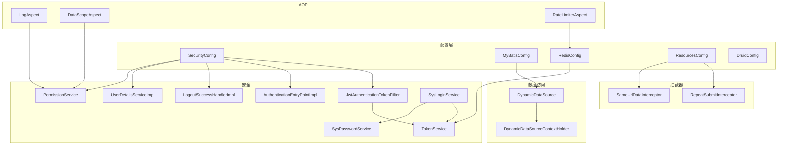
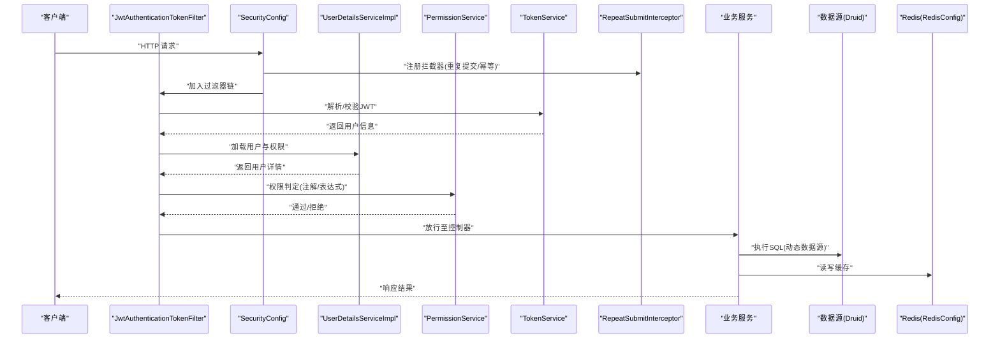
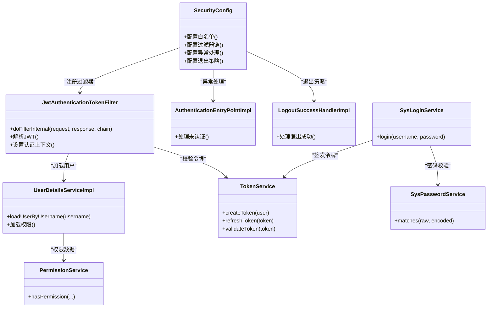
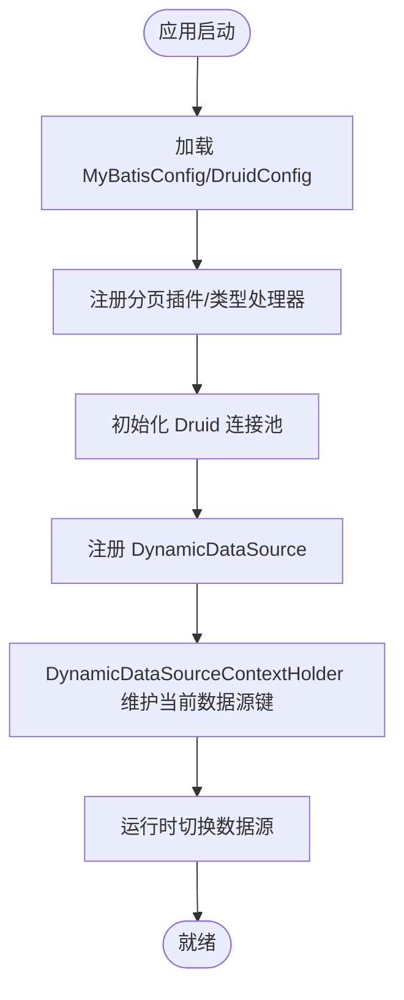
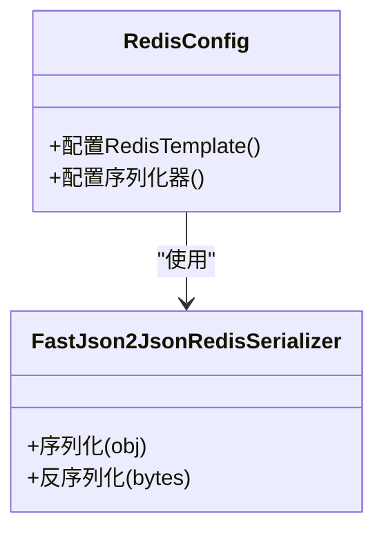
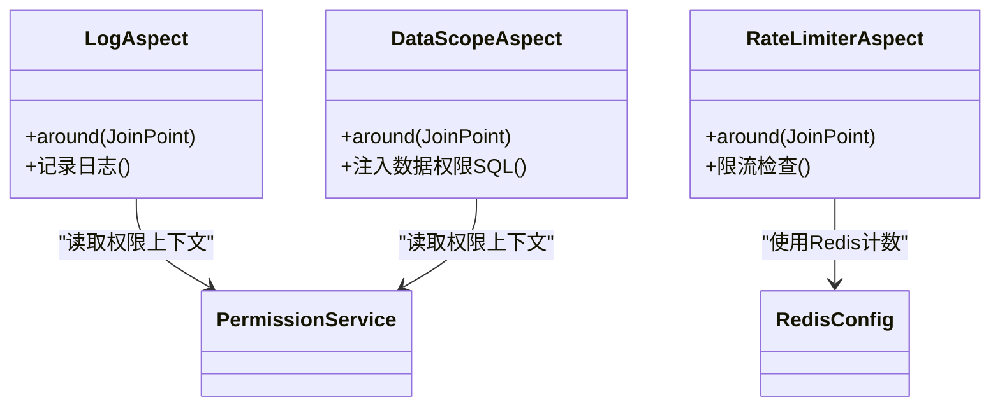
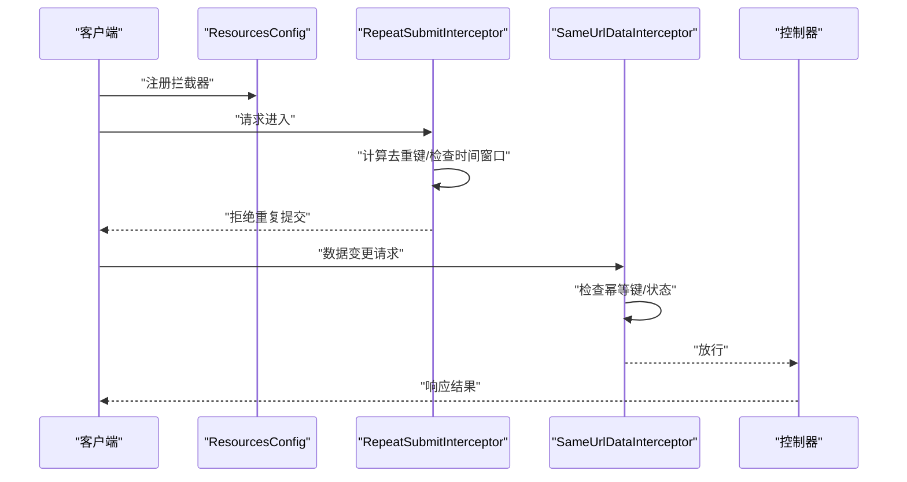
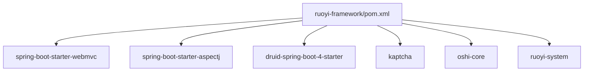

# ruoyi-framework 框架配置层

<cite>
**本文引用的文件**   
- [pom.xml](file://PezMax-Backend/ruoyi-framework/pom.xml)
- [SecurityConfig.java](file://PezMax-Backend/ruoyi-framework/src/main/java/com/ruoyi/framework/config/SecurityConfig.java)
- [JwtAuthenticationTokenFilter.java](file://PezMax-Backend/ruoyi-framework/src/main/java/com/ruoyi/framework/security/filter/JwtAuthenticationTokenFilter.java)
- [AuthenticationEntryPointImpl.java](file://PezMax-Backend/ruoyi-framework/src/main/java/com/ruoyi/framework/security/handle/AuthenticationEntryPointImpl.java)
- [LogoutSuccessHandlerImpl.java](file://PezMax-Backend/ruoyi-framework/src/main/java/com/ruoyi/framework/security/handle/LogoutSuccessHandlerImpl.java)
- [TokenService.java](file://PezMax-Backend/ruoyi-framework/src/main/java/com/ruoyi/framework/web/service/TokenService.java)
- [UserDetailsServiceImpl.java](file://PezMax-Backend/ruoyi-framework/src/main/java/com/ruoyi/framework/web/service/UserDetailsServiceImpl.java)
- [PermissionService.java](file://PezMax-Backend/ruoyi-framework/src/main/java/com/ruoyi/framework/web/service/PermissionService.java)
- [SysLoginService.java](file://PezMax-Backend/ruoyi-framework/src/main/java/com/ruoyi/framework/web/service/SysLoginService.java)
- [SysPasswordService.java](file://PezMax-Backend/ruoyi-framework/src/main/java/com/ruoyi/framework/web/service/SysPasswordService.java)
- [MyBatisConfig.java](file://PezMax-Backend/ruoyi-framework/src/main/java/com/ruoyi/framework/config/MyBatisConfig.java)
- [DruidConfig.java](file://PezMax-Backend/ruoyi-framework/src/main/java/com/ruoyi/framework/config/DruidConfig.java)
- [DynamicDataSource.java](file://PezMax-Backend/ruoyi-framework/src/main/java/com/ruoyi/framework/datasource/DynamicDataSource.java)
- [DynamicDataSourceContextHolder.java](file://PezMax-Backend/ruoyi-framework/src/main/java/com/ruoyi/framework/datasource/DynamicDataSourceContextHolder.java)
- [RedisConfig.java](file://PezMax-Backend/ruoyi-framework/src/main/java/com/ruoyi/framework/config/RedisConfig.java)
- [FastJson2JsonRedisSerializer.java](file://PezMax-Backend/ruoyi-framework/src/main/java/com/ruoyi/framework/config/FastJson2JsonRedisSerializer.java)
- [LogAspect.java](file://PezMax-Backend/ruoyi-framework/src/main/java/com/ruoyi/framework/aspectj/LogAspect.java)
- [DataScopeAspect.java](file://PezMax-Backend/ruoyi-framework/src/main/java/com/ruoyi/framework/aspectj/DataScopeAspect.java)
- [RateLimiterAspect.java](file://PezMax-Backend/ruoyi-framework/src/main/java/com/ruoyi/framework/aspectj/RateLimiterAspect.java)
- [RepeatSubmitInterceptor.java](file://PezMax-Backend/ruoyi-framework/src/main/java/com/ruoyi/framework/interceptor/RepeatSubmitInterceptor.java)
- [SameUrlDataInterceptor.java](file://PezMax-Backend/ruoyi-framework/src/main/java/com/ruoyi/framework/interceptor/impl/SameUrlDataInterceptor.java)
- [ResourcesConfig.java](file://PezMax-Backend/ruoyi-framework/src/main/java/com/ruoyi/framework/config/ResourcesConfig.java)
- [GlobalExceptionHandler.java](file://PezMax-Backend/ruoyi-framework/src/main/java/com/ruoyi/framework/web/exception/GlobalExceptionHandler.java)
</cite>

## 目录
1. [简介](#简介)
2. [项目结构](#项目结构)
3. [核心组件](#核心组件)
4. [架构总览](#架构总览)
5. [详细组件分析](#详细组件分析)
6. [依赖分析](#依赖分析)
7. [性能考虑](#性能考虑)
8. [故障排查指南](#故障排查指南)
9. [结论](#结论)
10. [附录](#附录)

## 简介
本指南聚焦于 ruoyi-framework 模块的配置层，系统性解析 Spring Boot 在安全、数据访问、缓存、AOP 与拦截器等方面的核心配置。内容覆盖：
- Spring Security 安全配置（认证授权、JWT 令牌管理）
- MyBatis 数据库配置（分页插件、类型处理器、动态数据源）
- Redis 缓存配置（序列化、连接池）
- AOP 切面配置（日志记录、权限控制、限流）
- 拦截器配置（重复提交、数据权限）

目标是帮助开发者理解各配置项的作用原理、参数说明与自定义扩展方法，以便在生产环境中进行调优与二次开发。

## 项目结构
ruoyi-framework 作为框架核心能力提供层，主要包含以下子包：
- config：Spring Boot 配置类集合（Security、MyBatis、Redis、资源映射等）
- security：安全过滤器、异常处理与登录登出处理器
- web/service：认证授权服务、令牌服务、用户详情服务等
- aspectj：AOP 切面（日志、数据权限、限流等）
- interceptor：请求拦截器（重复提交、同URL幂等）
- datasource：动态数据源切换实现

图表来源
- [SecurityConfig.java](file://PezMax-Backend/ruoyi-framework/src/main/java/com/ruoyi/framework/config/SecurityConfig.java)
- [JwtAuthenticationTokenFilter.java](file://PezMax-Backend/ruoyi-framework/src/main/java/com/ruoyi/framework/security/filter/JwtAuthenticationTokenFilter.java)
- [AuthenticationEntryPointImpl.java](file://PezMax-Backend/ruoyi-framework/src/main/java/com/ruoyi/framework/security/handle/AuthenticationEntryPointImpl.java)
- [LogoutSuccessHandlerImpl.java](file://PezMax-Backend/ruoyi-framework/src/main/java/com/ruoyi/framework/security/handle/LogoutSuccessHandlerImpl.java)
- [TokenService.java](file://PezMax-Backend/ruoyi-framework/src/main/java/com/ruoyi/framework/web/service/TokenService.java)
- [UserDetailsServiceImpl.java](file://PezMax-Backend/ruoyi-framework/src/main/java/com/ruoyi/framework/web/service/UserDetailsServiceImpl.java)
- [PermissionService.java](file://PezMax-Backend/ruoyi-framework/src/main/java/com/ruoyi/framework/web/service/PermissionService.java)
- [SysLoginService.java](file://PezMax-Backend/ruoyi-framework/src/main/java/com/ruoyi/framework/web/service/SysLoginService.java)
- [SysPasswordService.java](file://PezMax-Backend/ruoyi-framework/src/main/java/com/ruoyi/framework/web/service/SysPasswordService.java)
- [MyBatisConfig.java](file://PezMax-Backend/ruoyi-framework/src/main/java/com/ruoyi/framework/config/MyBatisConfig.java)
- [DruidConfig.java](file://PezMax-Backend/ruoyi-framework/src/main/java/com/ruoyi/framework/config/DruidConfig.java)
- [DynamicDataSource.java](file://PezMax-Backend/ruoyi-framework/src/main/java/com/ruoyi/framework/datasource/DynamicDataSource.java)
- [DynamicDataSourceContextHolder.java](file://PezMax-Backend/ruoyi-framework/src/main/java/com/ruoyi/framework/datasource/DynamicDataSourceContextHolder.java)
- [RedisConfig.java](file://PezMax-Backend/ruoyi-framework/src/main/java/com/ruoyi/framework/config/RedisConfig.java)
- [LogAspect.java](file://PezMax-Backend/ruoyi-framework/src/main/java/com/ruoyi/framework/aspectj/LogAspect.java)
- [DataScopeAspect.java](file://PezMax-Backend/ruoyi-framework/src/main/java/com/ruoyi/framework/aspectj/DataScopeAspect.java)
- [RateLimiterAspect.java](file://PezMax-Backend/ruoyi-framework/src/main/java/com/ruoyi/framework/aspectj/RateLimiterAspect.java)
- [RepeatSubmitInterceptor.java](file://PezMax-Backend/ruoyi-framework/src/main/java/com/ruoyi/framework/interceptor/RepeatSubmitInterceptor.java)
- [SameUrlDataInterceptor.java](file://PezMax-Backend/ruoyi-framework/src/main/java/com/ruoyi/framework/interceptor/impl/SameUrlDataInterceptor.java)
- [ResourcesConfig.java](file://PezMax-Backend/ruoyi-framework/src/main/java/com/ruoyi/framework/config/ResourcesConfig.java)

章节来源
- [pom.xml:1-64](file://PezMax-Backend/ruoyi-framework/pom.xml#L1-L64)

## 核心组件
本节概述配置层的关键组件及其职责：
- 安全配置：统一入口为 SecurityConfig，负责 URL 白名单、过滤器链、异常处理与退出策略；JWT 过滤器在认证阶段校验令牌并注入上下文；TokenService 负责令牌生成、刷新与过期管理；UserDetailsServiceImpl 加载用户与权限；PermissionService 提供注解式权限判断。
- 数据访问：MyBatisConfig 注册分页插件与类型处理器；DruidConfig 集成 Druid 监控与统计；DynamicDataSource 与 DynamicDataSourceContextHolder 实现运行时数据源切换。
- 缓存：RedisConfig 配置 RedisTemplate 与 FastJson2JsonRedisSerializer，确保对象序列化一致性与性能。
- AOP：LogAspect 记录业务日志；DataScopeAspect 基于注解注入数据权限 SQL；RateLimiterAspect 基于注解实现接口级限流。
- 拦截器：RepeatSubmitInterceptor 与 SameUrlDataInterceptor 防止重复提交与同 URL 幂等写入。

章节来源
- [SecurityConfig.java](file://PezMax-Backend/ruoyi-framework/src/main/java/com/ruoyi/framework/config/SecurityConfig.java)
- [JwtAuthenticationTokenFilter.java](file://PezMax-Backend/ruoyi-framework/src/main/java/com/ruoyi/framework/security/filter/JwtAuthenticationTokenFilter.java)
- [TokenService.java](file://PezMax-Backend/ruoyi-framework/src/main/java/com/ruoyi/framework/web/service/TokenService.java)
- [UserDetailsServiceImpl.java](file://PezMax-Backend/ruoyi-framework/src/main/java/com/ruoyi/framework/web/service/UserDetailsServiceImpl.java)
- [PermissionService.java](file://PezMax-Backend/ruoyi-framework/src/main/java/com/ruoyi/framework/web/service/PermissionService.java)
- [MyBatisConfig.java](file://PezMax-Backend/ruoyi-framework/src/main/java/com/ruoyi/framework/config/MyBatisConfig.java)
- [DruidConfig.java](file://PezMax-Backend/ruoyi-framework/src/main/java/com/ruoyi/framework/config/DruidConfig.java)
- [DynamicDataSource.java](file://PezMax-Backend/ruoyi-framework/src/main/java/com/ruoyi/framework/datasource/DynamicDataSource.java)
- [DynamicDataSourceContextHolder.java](file://PezMax-Backend/ruoyi-framework/src/main/java/com/ruoyi/framework/datasource/DynamicDataSourceContextHolder.java)
- [RedisConfig.java](file://PezMax-Backend/ruoyi-framework/src/main/java/com/ruoyi/framework/config/RedisConfig.java)
- [FastJson2JsonRedisSerializer.java](file://PezMax-Backend/ruoyi-framework/src/main/java/com/ruoyi/framework/config/FastJson2JsonRedisSerializer.java)
- [LogAspect.java](file://PezMax-Backend/ruoyi-framework/src/main/java/com/ruoyi/framework/aspectj/LogAspect.java)
- [DataScopeAspect.java](file://PezMax-Backend/ruoyi-framework/src/main/java/com/ruoyi/framework/aspectj/DataScopeAspect.java)
- [RateLimiterAspect.java](file://PezMax-Backend/ruoyi-framework/src/main/java/com/ruoyi/framework/aspectj/RateLimiterAspect.java)
- [RepeatSubmitInterceptor.java](file://PezMax-Backend/ruoyi-framework/src/main/java/com/ruoyi/framework/interceptor/RepeatSubmitInterceptor.java)
- [SameUrlDataInterceptor.java](file://PezMax-Backend/ruoyi-framework/src/main/java/com/ruoyi/framework/interceptor/impl/SameUrlDataInterceptor.java)
- [ResourcesConfig.java](file://PezMax-Backend/ruoyi-framework/src/main/java/com/ruoyi/framework/config/ResourcesConfig.java)

## 架构总览
下图展示了从 HTTP 请求进入，到安全校验、鉴权、业务执行、数据访问与缓存的完整链路。

图表来源
- [SecurityConfig.java](file://PezMax-Backend/ruoyi-framework/src/main/java/com/ruoyi/framework/config/SecurityConfig.java)
- [JwtAuthenticationTokenFilter.java](file://PezMax-Backend/ruoyi-framework/src/main/java/com/ruoyi/framework/security/filter/JwtAuthenticationTokenFilter.java)
- [TokenService.java](file://PezMax-Backend/ruoyi-framework/src/main/java/com/ruoyi/framework/web/service/TokenService.java)
- [UserDetailsServiceImpl.java](file://PezMax-Backend/ruoyi-framework/src/main/java/com/ruoyi/framework/web/service/UserDetailsServiceImpl.java)
- [PermissionService.java](file://PezMax-Backend/ruoyi-framework/src/main/java/com/ruoyi/framework/web/service/PermissionService.java)
- [RepeatSubmitInterceptor.java](file://PezMax-Backend/ruoyi-framework/src/main/java/com/ruoyi/framework/interceptor/RepeatSubmitInterceptor.java)
- [DruidConfig.java](file://PezMax-Backend/ruoyi-framework/src/main/java/com/ruoyi/framework/config/DruidConfig.java)
- [RedisConfig.java](file://PezMax-Backend/ruoyi-framework/src/main/java/com/ruoyi/framework/config/RedisConfig.java)

## 详细组件分析

### Spring Security 安全配置
- 作用原理
  - SecurityConfig 定义全局安全规则、白名单路径、异常处理与退出策略。
  - JwtAuthenticationTokenFilter 在认证阶段解析请求头中的 JWT，校验有效性后设置认证上下文。
  - AuthenticationEntryPointImpl 处理未认证或无权限时的统一响应。
  - LogoutSuccessHandlerImpl 处理登出成功后的清理与响应。
  - UserDetailsServiceImpl 根据用户名加载用户信息与角色/权限。
  - PermissionService 提供注解式权限判断（如 @PreAuthorize）。
  - TokenService 负责 JWT 的创建、刷新、过期管理与存储。
  - SysLoginService 与 SysPasswordService 封装登录流程与密码校验逻辑。

- 关键参数与扩展点
  - 白名单路径：在安全配置中排除匿名访问的资源。
  - 过滤器顺序：确保 JWT 过滤器位于合适位置，避免被其他过滤器短路。
  - 异常处理：自定义未认证/未授权响应格式。
  - 登出策略：清除会话、失效令牌、清理缓存。
  - 用户详情：可扩展加载部门、菜单、权限标识等。
  - 权限表达式：结合注解与表达式语言实现细粒度控制。
  - 令牌策略：可调整签发算法、有效期、刷新机制与黑名单。

- 自定义扩展建议
  - 新增白名单：在安全配置中添加匿名访问路径。
  - 自定义权限：扩展 PermissionService 以支持更复杂的权限模型。
  - 多端登录：在 TokenService 中增加设备维度令牌管理。
  - 审计增强：在过滤器前后记录认证事件。

图表来源
- [SecurityConfig.java](file://PezMax-Backend/ruoyi-framework/src/main/java/com/ruoyi/framework/config/SecurityConfig.java)
- [JwtAuthenticationTokenFilter.java](file://PezMax-Backend/ruoyi-framework/src/main/java/com/ruoyi/framework/security/filter/JwtAuthenticationTokenFilter.java)
- [AuthenticationEntryPointImpl.java](file://PezMax-Backend/ruoyi-framework/src/main/java/com/ruoyi/framework/security/handle/AuthenticationEntryPointImpl.java)
- [LogoutSuccessHandlerImpl.java](file://PezMax-Backend/ruoyi-framework/src/main/java/com/ruoyi/framework/security/handle/LogoutSuccessHandlerImpl.java)
- [UserDetailsServiceImpl.java](file://PezMax-Backend/ruoyi-framework/src/main/java/com/ruoyi/framework/web/service/UserDetailsServiceImpl.java)
- [PermissionService.java](file://PezMax-Backend/ruoyi-framework/src/main/java/com/ruoyi/framework/web/service/PermissionService.java)
- [TokenService.java](file://PezMax-Backend/ruoyi-framework/src/main/java/com/ruoyi/framework/web/service/TokenService.java)
- [SysLoginService.java](file://PezMax-Backend/ruoyi-framework/src/main/java/com/ruoyi/framework/web/service/SysLoginService.java)
- [SysPasswordService.java](file://PezMax-Backend/ruoyi-framework/src/main/java/com/ruoyi/framework/web/service/SysPasswordService.java)

章节来源
- [SecurityConfig.java](file://PezMax-Backend/ruoyi-framework/src/main/java/com/ruoyi/framework/config/SecurityConfig.java)
- [JwtAuthenticationTokenFilter.java](file://PezMax-Backend/ruoyi-framework/src/main/java/com/ruoyi/framework/security/filter/JwtAuthenticationTokenFilter.java)
- [AuthenticationEntryPointImpl.java](file://PezMax-Backend/ruoyi-framework/src/main/java/com/ruoyi/framework/security/handle/AuthenticationEntryPointImpl.java)
- [LogoutSuccessHandlerImpl.java](file://PezMax-Backend/ruoyi-framework/src/main/java/com/ruoyi/framework/security/handle/LogoutSuccessHandlerImpl.java)
- [TokenService.java](file://PezMax-Backend/ruoyi-framework/src/main/java/com/ruoyi/framework/web/service/TokenService.java)
- [UserDetailsServiceImpl.java](file://PezMax-Backend/ruoyi-framework/src/main/java/com/ruoyi/framework/web/service/UserDetailsServiceImpl.java)
- [PermissionService.java](file://PezMax-Backend/ruoyi-framework/src/main/java/com/ruoyi/framework/web/service/PermissionService.java)
- [SysLoginService.java](file://PezMax-Backend/ruoyi-framework/src/main/java/com/ruoyi/framework/web/service/SysLoginService.java)
- [SysPasswordService.java](file://PezMax-Backend/ruoyi-framework/src/main/java/com/ruoyi/framework/web/service/SysPasswordService.java)

### MyBatis 与数据库配置
- 作用原理
  - MyBatisConfig 注册分页插件与类型处理器，统一 SQL 行为与对象映射。
  - DruidConfig 集成 Druid 连接池与监控，便于性能分析与问题定位。
  - DynamicDataSource 与 DynamicDataSourceContextHolder 实现运行时数据源切换，支持多库或多租户场景。

- 关键参数与扩展点
  - 分页插件：配置默认页大小、最大限制、方言适配。
  - 类型处理器：自定义复杂类型映射（如 JSON、枚举）。
  - Druid 监控：启用 SQL 监控、慢查询统计、防火墙。
  - 动态数据源：按上下文选择数据源键，支持主从/多实例。

- 自定义扩展建议
  - 新增数据源：在 DynamicDataSource 注册新数据源键与路由规则。
  - 增强分页：添加审计字段自动填充或软删除过滤。
  - 连接池优化：根据负载调整最大连接数与超时时间。

图表来源
- [MyBatisConfig.java](file://PezMax-Backend/ruoyi-framework/src/main/java/com/ruoyi/framework/config/MyBatisConfig.java)
- [DruidConfig.java](file://PezMax-Backend/ruoyi-framework/src/main/java/com/ruoyi/framework/config/DruidConfig.java)
- [DynamicDataSource.java](file://PezMax-Backend/ruoyi-framework/src/main/java/com/ruoyi/framework/datasource/DynamicDataSource.java)
- [DynamicDataSourceContextHolder.java](file://PezMax-Backend/ruoyi-framework/src/main/java/com/ruoyi/framework/datasource/DynamicDataSourceContextHolder.java)

章节来源
- [MyBatisConfig.java](file://PezMax-Backend/ruoyi-framework/src/main/java/com/ruoyi/framework/config/MyBatisConfig.java)
- [DruidConfig.java](file://PezMax-Backend/ruoyi-framework/src/main/java/com/ruoyi/framework/config/DruidConfig.java)
- [DynamicDataSource.java](file://PezMax-Backend/ruoyi-framework/src/main/java/com/ruoyi/framework/datasource/DynamicDataSource.java)
- [DynamicDataSourceContextHolder.java](file://PezMax-Backend/ruoyi-framework/src/main/java/com/ruoyi/framework/datasource/DynamicDataSourceContextHolder.java)

### Redis 缓存配置
- 作用原理
  - RedisConfig 配置 RedisTemplate 与序列化器，确保对象存取的一致性与性能。
  - FastJson2JsonRedisSerializer 使用 Fastjson2 进行 JSON 序列化，提升吞吐与兼容性。

- 关键参数与扩展点
  - 序列化器：统一 Key/Value 序列化策略，避免乱码与兼容性问题。
  - 连接池：根据 Redis 部署模式调整连接数、超时与重试。
  - 过期策略：结合业务设置 TTL，避免脏读与内存膨胀。

- 自定义扩展建议
  - 自定义序列化：针对敏感字段脱敏或加密。
  - 缓存穿透防护：空值缓存、布隆过滤器。
  - 热点数据保护：本地缓存+分布式缓存二级架构。

图表来源
- [RedisConfig.java](file://PezMax-Backend/ruoyi-framework/src/main/java/com/ruoyi/framework/config/RedisConfig.java)
- [FastJson2JsonRedisSerializer.java](file://PezMax-Backend/ruoyi-framework/src/main/java/com/ruoyi/framework/config/FastJson2JsonRedisSerializer.java)

章节来源
- [RedisConfig.java](file://PezMax-Backend/ruoyi-framework/src/main/java/com/ruoyi/framework/config/RedisConfig.java)
- [FastJson2JsonRedisSerializer.java](file://PezMax-Backend/ruoyi-framework/src/main/java/com/ruoyi/framework/config/FastJson2JsonRedisSerializer.java)

### AOP 切面配置
- 作用原理
  - LogAspect：围绕方法执行记录入参、出参、耗时与异常，便于审计与排障。
  - DataScopeAspect：基于注解注入数据权限 SQL 片段，实现行级数据隔离。
  - RateLimiterAspect：基于注解对接口进行限流，保护系统稳定性。

- 关键参数与扩展点
  - 日志级别：区分 INFO/WARN/ERROR，避免过度日志影响性能。
  - 数据权限：支持按部门、角色、用户维度过滤。
  - 限流策略：固定窗口、滑动窗口、令牌桶等。

- 自定义扩展建议
  - 日志脱敏：对敏感字段进行掩码处理。
  - 权限细化：结合上下文动态拼接 SQL。
  - 限流持久化：将计数存入 Redis 实现集群共享。

图表来源
- [LogAspect.java](file://PezMax-Backend/ruoyi-framework/src/main/java/com/ruoyi/framework/aspectj/LogAspect.java)
- [DataScopeAspect.java](file://PezMax-Backend/ruoyi-framework/src/main/java/com/ruoyi/framework/aspectj/DataScopeAspect.java)
- [RateLimiterAspect.java](file://PezMax-Backend/ruoyi-framework/src/main/java/com/ruoyi/framework/aspectj/RateLimiterAspect.java)
- [PermissionService.java](file://PezMax-Backend/ruoyi-framework/src/main/java/com/ruoyi/framework/web/service/PermissionService.java)
- [RedisConfig.java](file://PezMax-Backend/ruoyi-framework/src/main/java/com/ruoyi/framework/config/RedisConfig.java)

章节来源
- [LogAspect.java](file://PezMax-Backend/ruoyi-framework/src/main/java/com/ruoyi/framework/aspectj/LogAspect.java)
- [DataScopeAspect.java](file://PezMax-Backend/ruoyi-framework/src/main/java/com/ruoyi/framework/aspectj/DataScopeAspect.java)
- [RateLimiterAspect.java](file://PezMax-Backend/ruoyi-framework/src/main/java/com/ruoyi/framework/aspectj/RateLimiterAspect.java)
- [PermissionService.java](file://PezMax-Backend/ruoyi-framework/src/main/java/com/ruoyi/framework/web/service/PermissionService.java)
- [RedisConfig.java](file://PezMax-Backend/ruoyi-framework/src/main/java/com/ruoyi/framework/config/RedisConfig.java)

### 拦截器配置（重复提交与幂等）
- 作用原理
  - RepeatSubmitInterceptor：检测短时间内相同请求，防止重复提交。
  - SameUrlDataInterceptor：对同 URL 的数据变更进行幂等控制，避免并发写入冲突。
  - ResourcesConfig：注册拦截器并配置匹配规则。

- 关键参数与扩展点
  - 去重键：基于请求路径、参数、用户标识组合生成唯一键。
  - 时间窗口：合理设置防抖间隔，兼顾用户体验与安全性。
  - 白名单：排除无需幂等的只读接口。

- 自定义扩展建议
  - 分布式锁：在集群环境下使用 Redis 锁保证幂等。
  - 幂等表：落库记录已处理请求，支持失败重试与补偿。

图表来源
- [ResourcesConfig.java](file://PezMax-Backend/ruoyi-framework/src/main/java/com/ruoyi/framework/config/ResourcesConfig.java)
- [RepeatSubmitInterceptor.java](file://PezMax-Backend/ruoyi-framework/src/main/java/com/ruoyi/framework/interceptor/RepeatSubmitInterceptor.java)
- [SameUrlDataInterceptor.java](file://PezMax-Backend/ruoyi-framework/src/main/java/com/ruoyi/framework/interceptor/impl/SameUrlDataInterceptor.java)

章节来源
- [ResourcesConfig.java](file://PezMax-Backend/ruoyi-framework/src/main/java/com/ruoyi/framework/config/ResourcesConfig.java)
- [RepeatSubmitInterceptor.java](file://PezMax-Backend/ruoyi-framework/src/main/java/com/ruoyi/framework/interceptor/RepeatSubmitInterceptor.java)
- [SameUrlDataInterceptor.java](file://PezMax-Backend/ruoyi-framework/src/main/java/com/ruoyi/framework/interceptor/impl/SameUrlDataInterceptor.java)

## 依赖分析
ruoyi-framework 的核心依赖包括 Web 容器、AOP、Druid 连接池、验证码与系统模块。这些依赖支撑了安全、数据访问、缓存与监控等能力。

图表来源
- [pom.xml:1-64](file://PezMax-Backend/ruoyi-framework/pom.xml#L1-L64)

章节来源
- [pom.xml:1-64](file://PezMax-Backend/ruoyi-framework/pom.xml#L1-L64)

## 性能考虑
- 安全
  - 减少不必要的权限计算，缓存用户权限。
  - 合理设置 JWT 有效期与刷新策略，降低频繁签发开销。
- 数据访问
  - 调整 Druid 连接池大小与超时，避免连接耗尽。
  - 使用分页插件限制单次查询量，避免大结果集拖慢响应。
- 缓存
  - 选择合适的序列化器，避免大对象序列化瓶颈。
  - 设置合理的 TTL，避免缓存雪崩与热点击穿。
- AOP 与拦截器
  - 控制日志级别与输出量，避免 I/O 成为瓶颈。
  - 限流策略采用轻量计数，必要时引入 Redis 分布式计数。

## 故障排查指南
- 常见问题
  - 未认证/未授权：检查 SecurityConfig 白名单与 JWT 过滤器顺序。
  - 令牌无效：确认 TokenService 的签名与过期策略是否一致。
  - 数据权限不生效：检查 DataScopeAspect 注解与权限上下文是否正确注入。
  - 重复提交：验证去重键生成逻辑与时间窗口设置。
  - 缓存异常：核对 Redis 连接与序列化器配置。
- 诊断工具
  - Druid 监控：查看 SQL 执行计划与慢查询。
  - 全局异常处理：GlobalExceptionHandler 统一错误响应格式。
  - 日志切面：通过 LogAspect 收集关键路径日志。

章节来源
- [GlobalExceptionHandler.java](file://PezMax-Backend/ruoyi-framework/src/main/java/com/ruoyi/framework/web/exception/GlobalExceptionHandler.java)
- [LogAspect.java](file://PezMax-Backend/ruoyi-framework/src/main/java/com/ruoyi/framework/aspectj/LogAspect.java)
- [DruidConfig.java](file://PezMax-Backend/ruoyi-framework/src/main/java/com/ruoyi/framework/config/DruidConfig.java)

## 结论
ruoyi-framework 的配置层提供了完善的安全、数据访问、缓存、AOP 与拦截器能力。通过合理配置与扩展，可在保证安全性的同时提升系统性能与可维护性。建议在上线前进行压测与监控，持续优化关键参数与策略。

## 附录
- 最佳实践
  - 白名单最小化：仅开放必要匿名接口。
  - 权限缓存：减少数据库压力。
  - 幂等设计：结合拦截器与持久化保障一致性。
  - 日志分级：生产环境关闭 DEBUG 日志。
  - 限流降级：保护核心接口与下游依赖。