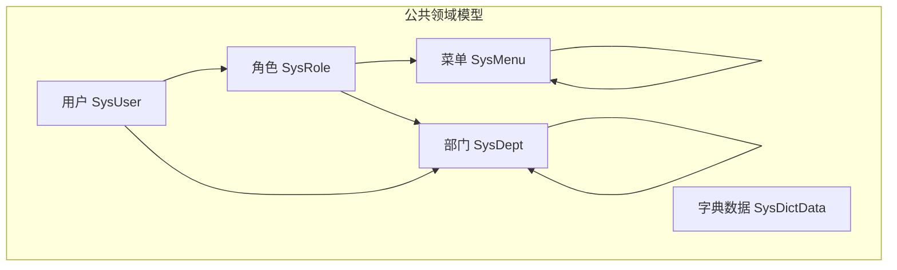
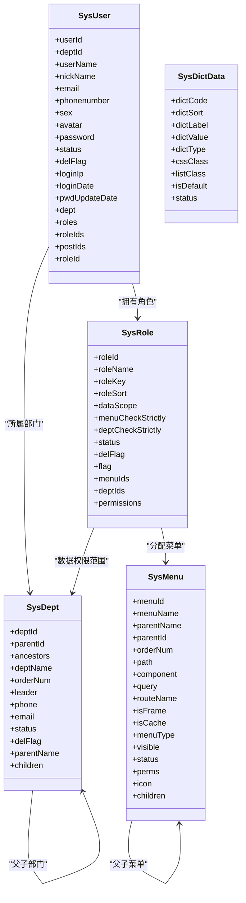
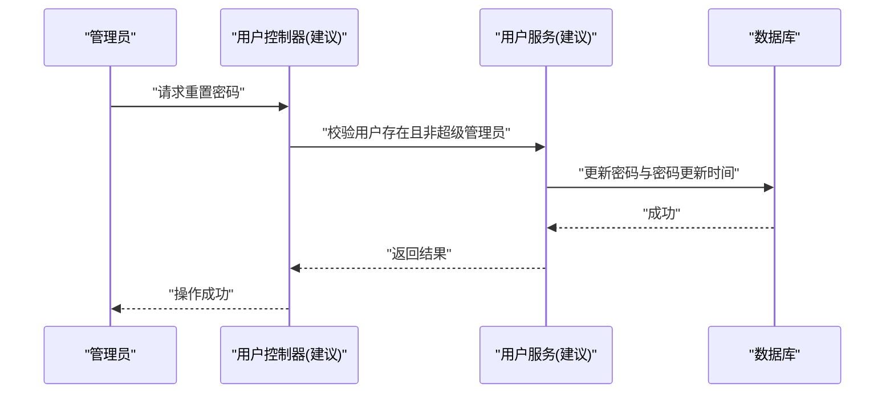
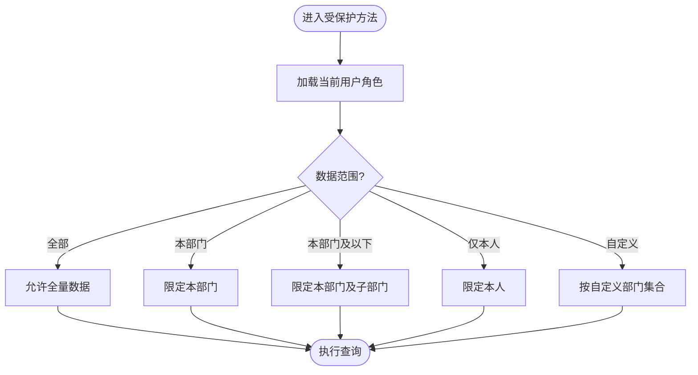
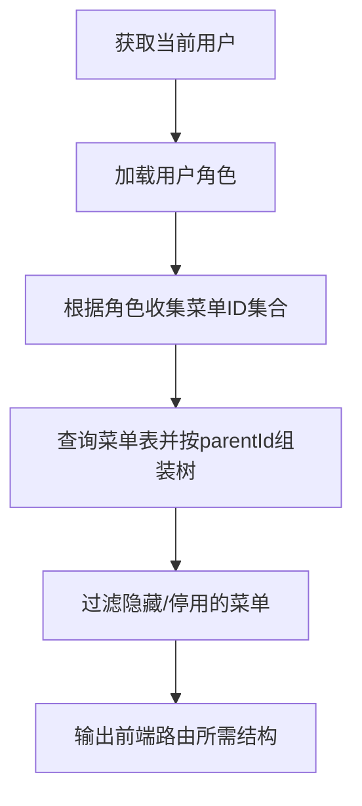
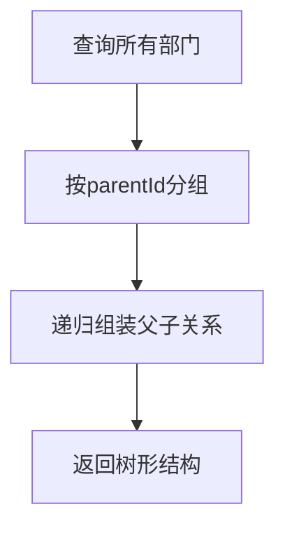
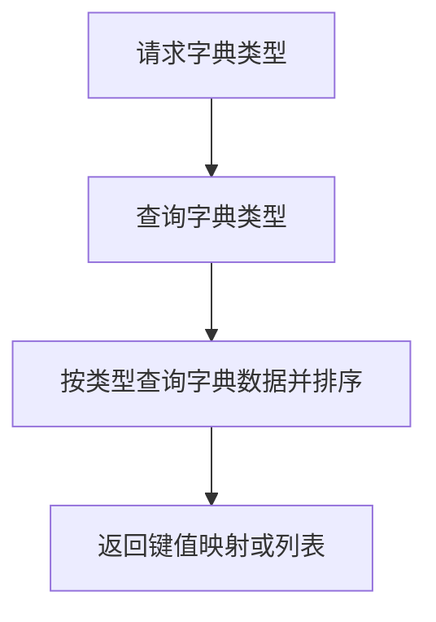
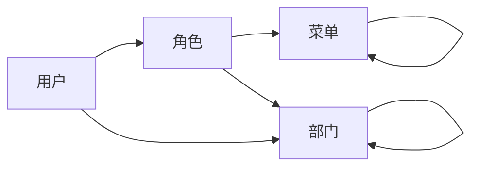

# ruoyi-system 系统管理模块

<cite>
**本文引用的文件**   
- [SysUser.java](file://PezMax-Backend/ruoyi-common/src/main/java/com/ruoyi/common/core/domain/entity/SysUser.java)
- [SysRole.java](file://PezMax-Backend/ruoyi-common/src/main/java/com/ruoyi/common/core/domain/entity/SysRole.java)
- [SysMenu.java](file://PezMax-Backend/ruoyi-common/src/main/java/com/ruoyi/common/core/domain/entity/SysMenu.java)
- [SysDept.java](file://PezMax-Backend/ruoyi-common/src/main/java/com/ruoyi/common/core/domain/entity/SysDept.java)
- [SysDictData.java](file://PezMax-Backend/ruoyi-common/src/main/java/com/ruoyi/common/core/domain/entity/SysDictData.java)
</cite>

## 目录
1. [简介](#简介)
2. [项目结构](#项目结构)
3. [核心组件](#核心组件)
4. [架构总览](#架构总览)
5. [详细组件分析](#详细组件分析)
6. [依赖关系分析](#依赖关系分析)
7. [性能考虑](#性能考虑)
8. [故障排查指南](#故障排查指南)
9. [结论](#结论)
10. [附录](#附录)

## 简介
本指南聚焦于 ruoyi-system 系统管理模块，围绕用户、角色权限、菜单、部门与字典等基础能力，给出面向开发者的实现说明。内容涵盖：
- 业务逻辑设计要点（如状态管理、数据权限）
- 接口定义建议（基于领域模型推导）
- 数据模型与字段约束
- 关键业务流程（登录鉴权、动态菜单生成、数据权限过滤）

为保证准确性，本文所有实体字段与校验规则均来源于仓库中的领域对象定义；涉及服务层与控制器层的细节以“建议”形式呈现，便于在现有基础上扩展落地。

## 项目结构
本项目采用多模块分层组织，系统管理相关的基础实体集中在公共模块的领域对象中，供上层 service/controller 复用。本次文档重点解析以下实体及其在系统管理中的作用：
- 用户：账号、状态、密码更新时间、最后登录信息、关联部门与角色
- 角色：角色标识、排序、数据范围、父子选择联动、状态
- 菜单：树形结构、路由与组件映射、缓存策略、可见性与类型
- 部门：层级关系（祖先链）、负责人、联系方式、状态
- 字典：键值对、默认项、样式类、状态

图表来源
- [SysUser.java](file://PezMax-Backend/ruoyi-common/src/main/java/com/ruoyi/common/core/domain/entity/SysUser.java)
- [SysRole.java](file://PezMax-Backend/ruoyi-common/src/main/java/com/ruoyi/common/core/domain/entity/SysRole.java)
- [SysMenu.java](file://PezMax-Backend/ruoyi-common/src/main/java/com/ruoyi/common/core/domain/entity/SysMenu.java)
- [SysDept.java](file://PezMax-Backend/ruoyi-common/src/main/java/com/ruoyi/common/core/domain/entity/SysDept.java)
- [SysDictData.java](file://PezMax-Backend/ruoyi-common/src/main/java/com/ruoyi/common/core/domain/entity/SysDictData.java)

章节来源
- [SysUser.java:1-337](file://PezMax-Backend/ruoyi-common/src/main/java/com/ruoyi/common/core/domain/entity/SysUser.java#L1-L337)
- [SysRole.java:1-242](file://PezMax-Backend/ruoyi-common/src/main/java/com/ruoyi/common/core/domain/entity/SysRole.java#L1-L242)
- [SysMenu.java:1-275](file://PezMax-Backend/ruoyi-common/src/main/java/com/ruoyi/common/core/domain/entity/SysMenu.java#L1-L275)
- [SysDept.java:1-204](file://PezMax-Backend/ruoyi-common/src/main/java/com/ruoyi/common/core/domain/entity/SysDept.java#L1-L204)
- [SysDictData.java:1-177](file://PezMax-Backend/ruoyi-common/src/main/java/com/ruoyi/common/core/domain/entity/SysDictData.java#L1-L177)

## 核心组件
本节从领域模型出发，梳理各实体的职责与关键字段，并据此推导常见接口与流程。

- 用户（SysUser）
  - 职责：承载用户主数据与登录态相关信息，维护与部门、角色的关联
  - 关键字段：用户ID、账号、昵称、邮箱、手机、性别、头像、密码、状态、删除标志、最后登录IP/时间、密码最后更新时间、部门、角色集合、岗位集合
  - 典型接口建议：用户列表查询、新增/修改/删除、重置密码、启用/停用、导入导出
  - 参考路径
    - [SysUser.java:26-96](file://PezMax-Backend/ruoyi-common/src/main/java/com/ruoyi/common/core/domain/entity/SysUser.java#L26-L96)
    - [SysUser.java:117-120](file://PezMax-Backend/ruoyi-common/src/main/java/com/ruoyi/common/core/domain/entity/SysUser.java#L117-L120)

- 角色（SysRole）
  - 职责：承载角色元数据与数据权限范围，维护与菜单、部门的关联
  - 关键字段：角色ID、名称、权限字符、排序、数据范围、父子选择联动开关、状态、删除标志、菜单组、部门组、权限集合
  - 典型接口建议：角色列表、新增/修改/删除、分配菜单、分配部门（数据权限）、启用/停用
  - 参考路径
    - [SysRole.java:22-66](file://PezMax-Backend/ruoyi-common/src/main/java/com/ruoyi/common/core/domain/entity/SysRole.java#L22-L66)
    - [SysRole.java:87-95](file://PezMax-Backend/ruoyi-common/src/main/java/com/ruoyi/common/core/domain/entity/SysRole.java#L87-L95)

- 菜单（SysMenu）
  - 职责：描述前端路由与按钮级权限，支持树形结构与外链/缓存配置
  - 关键字段：菜单ID、名称、父ID、排序、路由地址、组件路径、路由参数、路由名称、是否外链、是否缓存、类型（目录/菜单/按钮）、显示状态、状态、权限字符串、图标、子菜单
  - 典型接口建议：菜单树、按用户加载菜单、新增/修改/删除、启用/停用
  - 参考路径
    - [SysMenu.java:21-71](file://PezMax-Backend/ruoyi-common/src/main/java/com/ruoyi/common/core/domain/entity/SysMenu.java#L21-L71)

- 部门（SysDept）
  - 职责：组织架构树，支撑数据权限与用户归属
  - 关键字段：部门ID、父部门ID、祖级列表、名称、排序、负责人、电话、邮箱、状态、删除标志、父部门名称、子部门
  - 典型接口建议：部门树、新增/修改/删除、启用/停用、移动节点
  - 参考路径
    - [SysDept.java:22-57](file://PezMax-Backend/ruoyi-common/src/main/java/com/ruoyi/common/core/domain/entity/SysDept.java#L22-L57)

- 字典数据（SysDictData）
  - 职责：枚举型数据的集中管理，提供标签/键值/类型/默认/样式等
  - 关键字段：编码、排序、标签、键值、类型、样式属性、表格样式、是否默认、状态
  - 典型接口建议：字典类型列表、字典数据分页、新增/修改/删除、启用/停用
  - 参考路径
    - [SysDictData.java:21-54](file://PezMax-Backend/ruoyi-common/src/main/java/com/ruoyi/common/core/domain/entity/SysDictData.java#L21-L54)

章节来源
- [SysUser.java:1-337](file://PezMax-Backend/ruoyi-common/src/main/java/com/ruoyi/common/core/domain/entity/SysUser.java#L1-L337)
- [SysRole.java:1-242](file://PezMax-Backend/ruoyi-common/src/main/java/com/ruoyi/common/core/domain/entity/SysRole.java#L1-L242)
- [SysMenu.java:1-275](file://PezMax-Backend/ruoyi-common/src/main/java/com/ruoyi/common/core/domain/entity/SysMenu.java#L1-L275)
- [SysDept.java:1-204](file://PezMax-Backend/ruoyi-common/src/main/java/com/ruoyi/common/core/domain/entity/SysDept.java#L1-L204)
- [SysDictData.java:1-177](file://PezMax-Backend/ruoyi-common/src/main/java/com/ruoyi/common/core/domain/entity/SysDictData.java#L1-L177)

## 架构总览
下图展示系统管理模块的核心实体关系与交互方向，体现“用户-角色-菜单-部门-字典”的整体协作方式。

图表来源
- [SysUser.java:1-337](file://PezMax-Backend/ruoyi-common/src/main/java/com/ruoyi/common/core/domain/entity/SysUser.java#L1-L337)
- [SysRole.java:1-242](file://PezMax-Backend/ruoyi-common/src/main/java/com/ruoyi/common/core/domain/entity/SysRole.java#L1-L242)
- [SysMenu.java:1-275](file://PezMax-Backend/ruoyi-common/src/main/java/com/ruoyi/common/core/domain/entity/SysMenu.java#L1-L275)
- [SysDept.java:1-204](file://PezMax-Backend/ruoyi-common/src/main/java/com/ruoyi/common/core/domain/entity/SysDept.java#L1-L204)
- [SysDictData.java:1-177](file://PezMax-Backend/ruoyi-common/src/main/java/com/ruoyi/common/core/domain/entity/SysDictData.java#L1-L177)

## 详细组件分析

### 用户管理（用户CRUD、密码重置、状态管理）
- 业务要点
  - 用户状态：正常/停用，影响登录与访问控制
  - 密码安全：记录密码最后更新时间，用于强制改密策略
  - 登录审计：记录最后登录IP与时间
  - 关联关系：用户属于某部门，可拥有多个角色与岗位
- 建议接口
  - 用户分页查询、新增、修改、删除、批量删除
  - 重置密码、启用/停用
  - 导入/导出（结合 Excel 注解）
- 关键流程（密码重置）

章节来源
- [SysUser.java:57-76](file://PezMax-Backend/ruoyi-common/src/main/java/com/ruoyi/common/core/domain/entity/SysUser.java#L57-L76)
- [SysUser.java:60-73](file://PezMax-Backend/ruoyi-common/src/main/java/com/ruoyi/common/core/domain/entity/SysUser.java#L60-L73)
- [SysUser.java:78-96](file://PezMax-Backend/ruoyi-common/src/main/java/com/ruoyi/common/core/domain/entity/SysUser.java#L78-L96)

### 角色权限管理（角色分配、权限控制、数据权限）
- 业务要点
  - 角色标识与排序：用于界面展示与后端匹配
  - 数据范围：支持全部、自定义、本部门、本部门及以下、仅本人
  - 父子选择联动：菜单树与部门树的选择行为
  - 权限集合：由角色关联的菜单权限汇总得到
- 建议接口
  - 角色分页查询、新增、修改、删除、启用/停用
  - 分配菜单、分配部门（数据权限）
- 数据权限过滤流程（概念性）

章节来源
- [SysRole.java:38-40](file://PezMax-Backend/ruoyi-common/src/main/java/com/ruoyi/common/core/domain/entity/SysRole.java#L38-L40)
- [SysRole.java:42-46](file://PezMax-Backend/ruoyi-common/src/main/java/com/ruoyi/common/core/domain/entity/SysRole.java#L42-L46)
- [SysRole.java:58-66](file://PezMax-Backend/ruoyi-common/src/main/java/com/ruoyi/common/core/domain/entity/SysRole.java#L58-L66)

### 菜单管理（动态菜单、路由生成）
- 业务要点
  - 菜单类型：目录/菜单/按钮，分别对应不同粒度控制
  - 路由映射：path/component/query/routeName/isFrame/isCache
  - 可见性与状态：控制前端渲染与可用性
  - 权限标识：perms 用于按钮级控制
- 建议接口
  - 获取菜单树、按用户加载菜单、新增/修改/删除、启用/停用
- 动态菜单生成流程（概念性）

章节来源
- [SysMenu.java:21-71](file://PezMax-Backend/ruoyi-common/src/main/java/com/ruoyi/common/core/domain/entity/SysMenu.java#L21-L71)
- [SysMenu.java:54-65](file://PezMax-Backend/ruoyi-common/src/main/java/com/ruoyi/common/core/domain/entity/SysMenu.java#L54-L65)

### 部门管理（组织架构、层级关系）
- 业务要点
  - 层级关系：通过 parentId 与 ancestors 维护树形结构
  - 状态与软删：status/delFlag 控制可用性与删除
  - 负责人与联系方式：便于组织通讯录
- 建议接口
  - 部门树、新增/修改/删除、启用/停用、移动节点（需同步 ancestors）
- 部门树构建流程（概念性）

章节来源
- [SysDept.java:22-57](file://PezMax-Backend/ruoyi-common/src/main/java/com/ruoyi/common/core/domain/entity/SysDept.java#L22-L57)

### 字典管理（数据字典、枚举值管理）
- 业务要点
  - 字典类型与数据分离：type 作为分类键，数据项包含 label/value/sort/default/status
  - 默认项：isDefault 标记常用选项
  - 样式扩展：cssClass/listClass 支持前端差异化展示
- 建议接口
  - 字典类型列表、字典数据分页、新增/修改/删除、启用/停用
- 字典数据读取流程（概念性）

章节来源
- [SysDictData.java:21-54](file://PezMax-Backend/ruoyi-common/src/main/java/com/ruoyi/common/core/domain/entity/SysDictData.java#L21-L54)

## 依赖关系分析
- 耦合与内聚
  - 用户与角色、部门为多对一/多对多关系，建议在服务层进行聚合查询与缓存
  - 角色与菜单、部门为多对多关系，注意权限集合的合并与去重
  - 菜单与部门均为自引用树结构，查询时建议使用递归或祖先链优化
- 外部依赖
  - 字典数据通常被前端缓存，减少重复查询
  - 用户登录态与权限集合可放入缓存以提升鉴权性能

图表来源
- [SysUser.java:1-337](file://PezMax-Backend/ruoyi-common/src/main/java/com/ruoyi/common/core/domain/entity/SysUser.java#L1-L337)
- [SysRole.java:1-242](file://PezMax-Backend/ruoyi-common/src/main/java/com/ruoyi/common/core/domain/entity/SysRole.java#L1-L242)
- [SysMenu.java:1-275](file://PezMax-Backend/ruoyi-common/src/main/java/com/ruoyi/common/core/domain/entity/SysMenu.java#L1-L275)
- [SysDept.java:1-204](file://PezMax-Backend/ruoyi-common/src/main/java/com/ruoyi/common/core/domain/entity/SysDept.java#L1-L204)

## 性能考虑
- 菜单与字典数据适合缓存，降低频繁查询压力
- 用户权限集合可在登录后计算并缓存，避免每次鉴权都查库
- 部门树与菜单树的构建应使用祖先链或预计算，避免深层递归导致的性能问题
- 大数据量分页查询时，确保索引覆盖常用查询条件（如 status、delFlag、parentId、dictType）

## 故障排查指南
- 用户无法登录
  - 检查用户状态是否为停用
  - 确认密码是否正确以及密码更新时间是否符合策略
- 菜单不显示
  - 检查菜单可见性与状态
  - 确认用户是否具备该菜单对应的角色与权限
- 数据权限异常
  - 核对角色数据范围设置与用户所在部门
  - 验证自定义数据权限的部门集合是否正确
- 字典未生效
  - 检查字典类型是否存在、数据项是否启用
  - 确认前端使用的字典 key 与后端一致

## 结论
通过对用户、角色、菜单、部门与字典等核心实体的深入解析，可以清晰把握系统管理模块的数据模型与业务边界。在实际开发中，建议以服务层聚合这些实体，结合缓存与索引优化，形成稳定高效的系统管理能力。

## 附录
- 术语说明
  - 数据范围：角色维度控制数据可见性的策略
  - 权限标识：菜单或按钮级别的权限字符串
  - 祖级列表：部门树中从根到当前节点的完整路径
- 扩展建议
  - 引入操作日志与审计字段，完善合规要求
  - 增加敏感字段脱敏与加密传输
  - 完善单元测试与集成测试用例