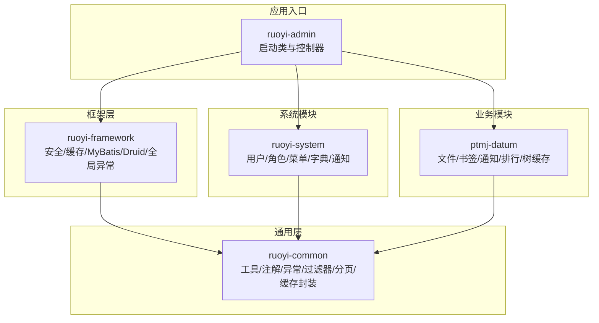
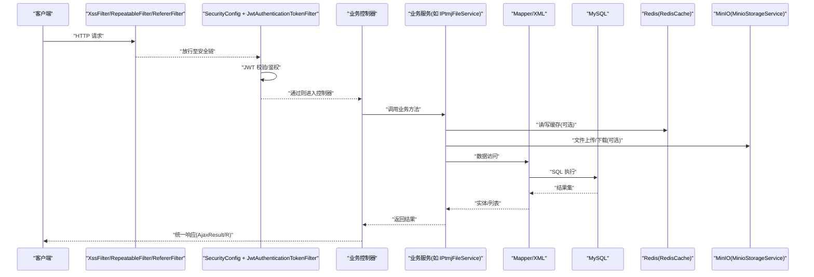
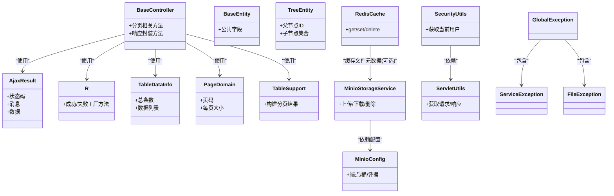
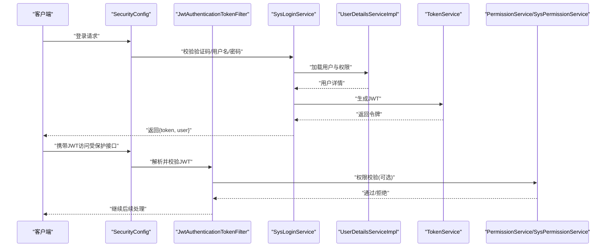
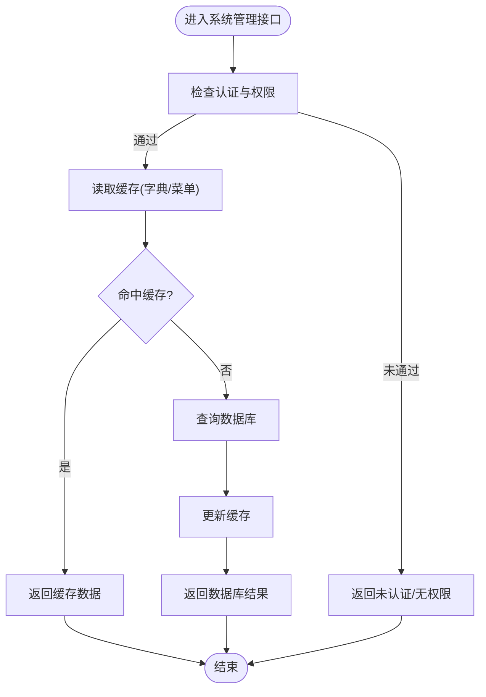
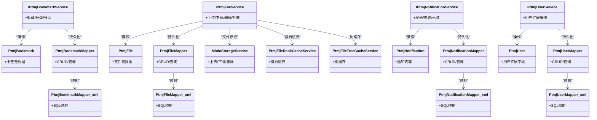
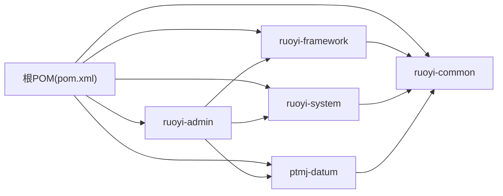

# 核心模块详解

<cite>
**本文引用的文件**   
- [README.md](file://PezMax-Backend/README.md)
- [pom.xml](file://PezMax-Backend/pom.xml)
- [ruoyi-common/pom.xml](file://PezMax-Backend/ruoyi-common/pom.xml)
- [ruoyi-framework/pom.xml](file://PezMax-Backend/ruoyi-framework/pom.xml)
- [ruoyi-system/pom.xml](file://PezMax-Backend/ruoyi-system/pom.xml)
- [ptmj-datum/pom.xml](file://PezMax-Backend/ptmj-datum/pom.xml)
- [application.yml](file://PezMax-Backend/ruoyi-admin/src/main/resources/application.yml)
- [application-druid.yml](file://PezMax-Backend/ruoyi-admin/src/main/resources/application-druid.yml)
- [mybatis-config.xml](file://PezMax-Backend/ruoyi-admin/src/main/resources/mybatis/mybatis-config.xml)
- [RuoYiApplication.java](file://PezMax-Backend/ruoyi-admin/src/main/java/com/ruoyi/RuoYiApplication.java)
- [SecurityConfig.java](file://PezMax-Backend/ruoyi-framework/src/main/java/com/ruoyi/framework/config/SecurityConfig.java)
- [MyBatisConfig.java](file://PezMax-Backend/ruoyi-framework/src/main/java/com/ruoyi/framework/config/MyBatisConfig.java)
- [RedisConfig.java](file://PezMax-Backend/ruoyi-framework/src/main/java/com/ruoyi/framework/config/RedisConfig.java)
- [FastJson2JsonRedisSerializer.java](file://PezMax-Backend/ruoyi-framework/src/main/java/com/ruoyi/framework/config/FastJson2JsonRedisSerializer.java)
- [FilterConfig.java](file://PezMax-Backend/ruoyi-framework/src/main/java/com/ruoyi/framework/config/FilterConfig.java)
- [DruidConfig.java](file://PezMax-Backend/ruoyi-framework/src/main/java/com/ruoyi/framework/config/DruidConfig.java)
- [ResourcesConfig.java](file://PezMax-Backend/ruoyi-framework/src/main/java/com/ruoyi/framework/config/ResourcesConfig.java)
- [GlobalExceptionHandler.java](file://PezMax-Backend/ruoyi-framework/src/main/java/com/ruoyi/framework/web/exception/GlobalExceptionHandler.java)
- [TokenService.java](file://PezMax-Backend/ruoyi-framework/src/main/java/com/ruoyi/framework/web/service/TokenService.java)
- [UserDetailsServiceImpl.java](file://PezMax-Backend/ruoyi-framework/src/main/java/com/ruoyi/framework/web/service/UserDetailsServiceImpl.java)
- [SysLoginService.java](file://PezMax-Backend/ruoyi-framework/src/main/java/com/ruoyi/framework/web/service/SysLoginService.java)
- [JwtAuthenticationTokenFilter.java](file://PezMax-Backend/ruoyi-framework/src/main/java/com/ruoyi/framework/security/filter/JwtAuthenticationTokenFilter.java)
- [AuthenticationEntryPointImpl.java](file://PezMax-Backend/ruoyi-framework/src/main/java/com/ruoyi/framework/security/handle/AuthenticationEntryPointImpl.java)
- [LogoutSuccessHandlerImpl.java](file://PezMax-Backend/ruoyi-framework/src/main/java/com/ruoyi/framework/security/handle/LogoutSuccessHandlerImpl.java)
- [PermissionService.java](file://PezMax-Backend/ruoyi-framework/src/main/java/com/ruoyi/framework/web/service/PermissionService.java)
- [SysPermissionService.java](file://PezMax-Backend/ruoyi-framework/src/main/java/com/ruoyi/framework/web/service/SysPermissionService.java)
- [BaseController.java](file://PezMax-Backend/ruoyi-common/src/main/java/com/ruoyi/common/core/controller/BaseController.java)
- [AjaxResult.java](file://PezMax-Backend/ruoyi-common/src/main/java/com/ruoyi/common/core/domain/AjaxResult.java)
- [R.java](file://PezMax-Backend/ruoyi-common/src/main/java/com/ruoyi/common/core/domain/R.java)
- [BaseEntity.java](file://PezMax-Backend/ruoyi-common/src/main/java/com/ruoyi/common/core/domain/BaseEntity.java)
- [TreeEntity.java](file://PezMax-Backend/ruoyi-common/src/main/java/com/ruoyi/common/core/domain/TreeEntity.java)
- [TableDataInfo.java](file://PezMax-Backend/ruoyi-common/src/main/java/com/ruoyi/common/core/page/TableDataInfo.java)
- [PageDomain.java](file://PezMax-Backend/ruoyi-common/src/main/java/com/ruoyi/common/core/page/PageDomain.java)
- [TableSupport.java](file://PezMax-Backend/ruoyi-common/src/main/java/com/ruoyi/common/core/page/TableSupport.java)
- [RedisCache.java](file://PezMax-Backend/ruoyi-common/src/main/java/com/ruoyi/common/core/redis/RedisCache.java)
- [MinioConfig.java](file://PezMax-Backend/ruoyi-common/src/main/java/com/ruoyi/common/config/MinioConfig.java)
- [RuoYiConfig.java](file://PezMax-Backend/ruoyi-common/src/main/java/com/ruoyi/common/config/RuoYiConfig.java)
- [FileUploadUtils.java](file://PezMax-Backend/ruoyi-common/src/main/java/com/ruoyi/common/utils/file/FileUploadUtils.java)
- [FileUtils.java](file://PezMax-Backend/ruoyi-common/src/main/java/com/ruoyi/common/utils/file/FileUtils.java)
- [ImageUtils.java](file://PezMax-Backend/ruoyi-common/src/main/java/com/ruoyi/common/utils/file/ImageUtils.java)
- [MimeTypeUtils.java](file://PezMax-Backend/ruoyi-common/src/main/java/com/ruoyi/common/utils/file/MimeTypeUtils.java)
- [MinioStorageService.java](file://PezMax-Backend/ruoyi-common/src/main/java/com/ruoyi/common/utils/file/MinioStorageService.java)
- [SecurityUtils.java](file://PezMax-Backend/ruoyi-common/src/main/java/com/ruoyi/common/utils/SecurityUtils.java)
- [ServletUtils.java](file://PezMax-Backend/ruoyi-common/src/main/java/com/ruoyi/common/utils/ServletUtils.java)
- [StringUtils.java](file://PezMax-Backend/ruoyi-common/src/main/java/com/ruoyi/common/utils/StringUtils.java)
- [ExceptionUtil.java](file://PezMax-Backend/ruoyi-common/src/main/java/com/ruoyi/common/utils/ExceptionUtil.java)
- [LogUtils.java](file://PezMax-Backend/ruoyi-common/src/main/java/com/ruoyi/common/utils/LogUtils.java)
- [GlobalException.java](file://PezMax-Backend/ruoyi-common/src/main/java/com/ruoyi/common/exception/GlobalException.java)
- [ServiceException.java](file://PezMax-Backend/ruoyi-common/src/main/java/com/ruoyi/common/exception/ServiceException.java)
- [FileException.java](file://PezMax-Backend/ruoyi-common/src/main/java/com/ruoyi/common/exception/file/FileException.java)
- [Anonymous.java](file://PezMax-Backend/ruoyi-common/src/main/java/com/ruoyi/common/annotation/Anonymous.java)
- [RepeatSubmit.java](file://PezMax-Backend/ruoyi-common/src/main/java/com/ruoyi/common/annotation/RepeatSubmit.java)
- [RateLimiter.java](file://PezMax-Backend/ruoyi-common/src/main/java/com/ruoyi/common/annotation/RateLimiter.java)
- [DataScope.java](file://PezMax-Backend/ruoyi-common/src/main/java/com/ruoyi/common/annotation/DataScope.java)
- [DataSource.java](file://PezMax-Backend/ruoyi-common/src/main/java/com/ruoyi/common/annotation/DataSource.java)
- [Log.java](file://PezMax-Backend/ruoyi-common/src/main/java/com/ruoyi/common/annotation/Log.java)
- [Sensitive.java](file://PezMax-Backend/ruoyi-common/src/main/java/com/ruoyi/common/annotation/Sensitive.java)
- [Excel.java](file://PezMax-Backend/ruoyi-common/src/main/java/com/ruoyi/common/annotation/Excel.java)
- [ExcelUtil.java](file://PezMax-Backend/ruoyi-common/src/main/java/com/ruoyi/common/utils/poi/ExcelUtil.java)
- [XssFilter.java](file://PezMax-Backend/ruoyi-common/src/main/java/com/ruoyi/common/filter/XssFilter.java)
- [RepeatableFilter.java](file://PezMax-Backend/ruoyi-common/src/main/java/com/ruoyi/common/filter/RepeatableFilter.java)
- [RefererFilter.java](file://PezMax-Backend/ruoyi-common/src/main/java/com/ruoyi/common/filter/RefererFilter.java)
- [CacheConstants.java](file://PezMax-Backend/ruoyi-common/src/main/java/com/ruoyi/common/constant/CacheConstants.java)
- [Constants.java](file://PezMax-Backend/ruoyi-common/src/main/java/com/ruoyi/common/constant/Constants.java)
- [HttpStatus.java](file://PezMax-Backend/ruoyi-common/src/main/java/com/ruoyi/common/constant/HttpStatus.java)
- [UserConstants.java](file://PezMax-Backend/ruoyi-common/src/main/java/com/ruoyi/common/constant/UserConstants.java)
- [PtmjSecurityConstant.java](file://PezMax-Backend/ruoyi-common/src/main/java/com/ruoyi/common/constant/PtmjSecurityConstant.java)
- [IPtmjUserService.java](file://PezMax-Backend/ptmj-datum/src/main/java/com/ptmj/datum/service/IPtmjUserService.java)
- [PtmjUser.java](file://PezMax-Backend/ptmj-datum/src/main/java/com/ptmj/datum/domain/PtmjUser.java)
- [PtmjUserMapper.java](file://PezMax-Backend/ptmj-datum/src/main/java/com/ptmj/datum/mapper/PtmjUserMapper.java)
- [PtmjUserMapper.xml](file://PezMax-Backend/ptmj-datum/src/main/resources/mapper/datum/PtmjUserMapper.xml)
- [IPtmjFileService.java](file://PezMax-Backend/ptmj-datum/src/main/java/com/ptmj/datum/service/IPtmjFileService.java)
- [PtmjFile.java](file://PezMax-Backend/ptmj-datum/src/main/java/com/ptmj/datum/domain/PtmjFile.java)
- [PtmjFileMapper.java](file://PezMax-Backend/ptmj-datum/src/main/java/com/ptmj/datum/mapper/PtmjFileMapper.java)
- [PtmjFileMapper.xml](file://PezMax-Backend/ptmj-datum/src/main/resources/mapper/datum/PtmjFileMapper.xml)
- [IPtmjBookmarkService.java](file://PezMax-Backend/ptmj-datum/src/main/java/com/ptmj/datum/service/IPtmjBookmarkService.java)
- [PtmjBookmark.java](file://PezMax-Backend/ptmj-datum/src/main/java/com/ptmj/datum/domain/PtmjBookmark.java)
- [PtmjBookmarkMapper.java](file://PezMax-Backend/ptmj-datum/src/main/java/com/ptmj/datum/mapper/PtmjBookmarkMapper.java)
- [PtmjBookmarkMapper.xml](file://PezMax-Backend/ptmj-datum/src/main/resources/mapper/datum/PtmjBookmarkMapper.xml)
- [IPtmjNotificationService.java](file://PezMax-Backend/ptmj-datum/src/main/java/com/ptmj/datum/service/IPtmjNotificationService.java)
- [PtmjNotification.java](file://PezMax-Backend/ptmj-datum/src/main/java/com/ptmj/datum/domain/PtmjNotification.java)
- [PtmjNotificationMapper.java](file://PezMax-Backend/ptmj-datum/src/main/java/com/ptmj/datum/mapper/PtmjNotificationMapper.java)
- [PtmjNotificationMapper.xml](file://PezMax-Backend/ptmj-datum/src/main/resources/mapper/datum/PtmjNotificationMapper.xml)
- [PtmjFileRankCacheService.java](file://PezMax-Backend/ptmj-datum/src/main/java/com/ptmj/datum/service/PtmjFileRankCacheService.java)
- [PtmjFileTreeCacheService.java](file://PezMax-Backend/ptmj-datum/src/main/java/com/ptmj/datum/service/PtmjFileTreeCacheService.java)
</cite>

## 目录
1. [简介](#简介)
2. [项目结构](#项目结构)
3. [核心组件](#核心组件)
4. [架构总览](#架构总览)
5. [详细组件分析](#详细组件分析)
6. [依赖分析](#依赖分析)
7. [性能考虑](#性能考虑)
8. [故障排查指南](#故障排查指南)
9. [结论](#结论)
10. [附录](#附录)

## 简介
本指南聚焦于后端核心模块，围绕以下四个方向展开：
- ruoyi-common 通用工具类库：文件处理、安全工具、异常处理、分页与缓存封装等。
- ruoyi-framework 框架配置层：Spring Security、MyBatis、Redis、Druid、全局异常与拦截器。
- ruoyi-system 系统管理模块：用户、角色、菜单、字典、通知等基础能力（以接口与领域模型为主）。
- ptmj-datum 业务数据模块：文件管理、书签管理、通知系统等核心业务。

目标读者包括需要二次开发、扩展功能或进行集成对接的工程师。文档提供分层解析、关键类关系图、调用序列图、流程图以及最佳实践建议。

## 项目结构
整体采用多模块 Maven 工程，顶层 pom.xml 统一管理版本与依赖，子模块职责清晰：
- ruoyi-common：通用注解、常量、工具、异常、过滤器、分页、缓存封装、对象存储配置等。
- ruoyi-framework：框架级配置与安全、Web 服务增强、权限校验、登录注册、令牌服务等。
- ruoyi-system：系统管理域（用户、角色、菜单、字典、日志、通知等）的领域模型与持久化映射。
- ptmj-datum：PezMax 核心业务（文件、书签、通知、用户扩展、排行榜与树形缓存等）。
- ruoyi-admin：应用启动入口与控制器集合。
- ruoyi-quartz、ruoyi-generator：定时任务与代码生成辅助模块。

图表来源
- [pom.xml:177-185](file://PezMax-Backend/pom.xml#L177-L185)
- [RuoYiApplication.java](file://PezMax-Backend/ruoyi-admin/src/main/java/com/ruoyi/RuoYiApplication.java)

章节来源
- [README.md:76-89](file://PezMax-Backend/README.md#L76-L89)
- [pom.xml:177-185](file://PezMax-Backend/pom.xml#L177-L185)

## 核心组件
本节从“通用层”到“框架层”，再到“系统模块”和“业务模块”，梳理关键类与职责边界。

- 通用层（ruoyi-common）
  - 统一响应与分页：AjaxResult、R、TableDataInfo、PageDomain、TableSupport。
  - 实体基类：BaseEntity、TreeEntity。
  - 安全与上下文：SecurityUtils、ServletUtils、常量 CacheConstants、UserConstants、HttpStatus。
  - 文件与对象存储：FileUploadUtils、FileUtils、ImageUtils、MimeTypeUtils、MinioStorageService、MinioConfig。
  - 缓存封装：RedisCache。
  - 异常体系：GlobalException、ServiceException、FileException 及若干细分异常。
  - 注解与切面支撑：@Anonymous、@RepeatSubmit、@RateLimiter、@DataScope、@DataSource、@Log、@Sensitive、@Excel。
  - 过滤器：XssFilter、RepeatableFilter、RefererFilter。
  - Excel 工具：ExcelUtil。

- 框架层（ruoyi-framework）
  - 安全配置：SecurityConfig、JwtAuthenticationTokenFilter、AuthenticationEntryPointImpl、LogoutSuccessHandlerImpl。
  - 认证授权服务：TokenService、UserDetailsServiceImpl、SysLoginService、PermissionService、SysPermissionService。
  - 数据访问：MyBatisConfig、DruidConfig、DynamicDataSource（动态数据源）、重复提交拦截器 RepeatSubmitInterceptor。
  - 缓存：RedisConfig、FastJson2JsonRedisSerializer。
  - Web 增强：ResourcesConfig、FilterConfig、全局异常处理器 GlobalExceptionHandler。

- 系统模块（ruoyi-system）
  - 领域模型与映射：用户、角色、菜单、字典、操作日志、登录信息、通知等实体与 Mapper XML。
  - 服务接口与实现：用户、角色、菜单、字典、通知等业务服务。

- 业务模块（ptmj-datum）
  - 领域模型：PtmjUser、PtmjFile、PtmjBookmark、PtmjNotification 等。
  - 服务接口：IPtmjUserService、IPtmjFileService、IPtmjBookmarkService、IPtmjNotificationService 等。
  - 缓存服务：PtmjFileRankCacheService、PtmjFileTreeCacheService。
  - 持久化映射：各 Mapper 接口与对应 XML。

章节来源
- [ruoyi-common/pom.xml](file://PezMax-Backend/ruoyi-common/pom.xml)
- [ruoyi-framework/pom.xml](file://PezMax-Backend/ruoyi-framework/pom.xml)
- [ruoyi-system/pom.xml](file://PezMax-Backend/ruoyi-system/pom.xml)
- [ptmj-datum/pom.xml](file://PezMax-Backend/ptmj-datum/pom.xml)

## 架构总览
下图展示请求在 Spring Boot 中的典型链路：过滤器 → 安全过滤器链 → 控制器 → 服务层 → MyBatis → 数据库；同时贯穿 Redis 缓存与 MinIO 对象存储。

图表来源
- [SecurityConfig.java](file://PezMax-Backend/ruoyi-framework/src/main/java/com/ruoyi/framework/config/SecurityConfig.java)
- [JwtAuthenticationTokenFilter.java](file://PezMax-Backend/ruoyi-framework/src/main/java/com/ruoyi/framework/security/filter/JwtAuthenticationTokenFilter.java)
- [RedisConfig.java](file://PezMax-Backend/ruoyi-framework/src/main/java/com/ruoyi/framework/config/RedisConfig.java)
- [RedisCache.java](file://PezMax-Backend/ruoyi-common/src/main/java/com/ruoyi/common/core/redis/RedisCache.java)
- [MinioConfig.java](file://PezMax-Backend/ruoyi-common/src/main/java/com/ruoyi/common/config/MinioConfig.java)
- [MinioStorageService.java](file://PezMax-Backend/ruoyi-common/src/main/java/com/ruoyi/common/utils/file/MinioStorageService.java)
- [MyBatisConfig.java](file://PezMax-Backend/ruoyi-framework/src/main/java/com/ruoyi/framework/config/MyBatisConfig.java)
- [application.yml](file://PezMax-Backend/ruoyi-admin/src/main/resources/application.yml)
- [application-druid.yml](file://PezMax-Backend/ruoyi-admin/src/main/resources/application-druid.yml)

## 详细组件分析

### 通用工具类库（ruoyi-common）
- 统一响应与分页
  - AjaxResult、R：对外统一返回体，便于前端一致化处理。
  - TableDataInfo、PageDomain、TableSupport：分页参数封装与表格数据组装。
- 实体基类与树形结构
  - BaseEntity：公共字段（创建时间、更新时间等）。
  - TreeEntity：树形节点基础结构，适用于菜单、目录等层级数据。
- 安全与上下文
  - SecurityUtils：获取当前用户、权限等信息。
  - ServletUtils：便捷获取请求/响应对象。
  - 常量：CacheConstants、UserConstants、HttpStatus、PtmjSecurityConstant 等。
- 文件与对象存储
  - FileUploadUtils、FileUtils、ImageUtils、MimeTypeUtils：文件校验、类型判断、图片处理等。
  - MinioStorageService、MinioConfig：MinIO 客户端与桶策略、端点、凭据等配置。
- 缓存封装
  - RedisCache：对 Redis 操作的简化封装，配合 FastJson2JsonRedisSerializer 序列化。
- 异常体系
  - GlobalException、ServiceException、FileException 等：定义业务异常与文件异常，结合全局异常处理器统一输出。
- 注解与切面
  - @Anonymous：匿名访问标记。
  - @RepeatSubmit：防重复提交。
  - @RateLimiter：限流。
  - @DataScope：数据权限范围。
  - @DataSource：动态数据源切换。
  - @Log：操作日志记录。
  - @Sensitive/@Excel：脱敏与导出。
- 过滤器
  - XssFilter、RepeatableFilter、RefererFilter：跨站脚本防护、请求体可重复读取、Referer 校验。
- Excel 工具
  - ExcelUtil：基于 POI 的导入导出封装。

图表来源
- [BaseController.java](file://PezMax-Backend/ruoyi-common/src/main/java/com/ruoyi/common/core/controller/BaseController.java)
- [AjaxResult.java](file://PezMax-Backend/ruoyi-common/src/main/java/com/ruoyi/common/core/domain/AjaxResult.java)
- [R.java](file://PezMax-Backend/ruoyi-common/src/main/java/com/ruoyi/common/core/domain/R.java)
- [BaseEntity.java](file://PezMax-Backend/ruoyi-common/src/main/java/com/ruoyi/common/core/domain/BaseEntity.java)
- [TreeEntity.java](file://PezMax-Backend/ruoyi-common/src/main/java/com/ruoyi/common/core/domain/TreeEntity.java)
- [TableDataInfo.java](file://PezMax-Backend/ruoyi-common/src/main/java/com/ruoyi/common/core/page/TableDataInfo.java)
- [PageDomain.java](file://PezMax-Backend/ruoyi-common/src/main/java/com/ruoyi/common/core/page/PageDomain.java)
- [TableSupport.java](file://PezMax-Backend/ruoyi-common/src/main/java/com/ruoyi/common/core/page/TableSupport.java)
- [RedisCache.java](file://PezMax-Backend/ruoyi-common/src/main/java/com/ruoyi/common/core/redis/RedisCache.java)
- [MinioConfig.java](file://PezMax-Backend/ruoyi-common/src/main/java/com/ruoyi/common/config/MinioConfig.java)
- [MinioStorageService.java](file://PezMax-Backend/ruoyi-common/src/main/java/com/ruoyi/common/utils/file/MinioStorageService.java)
- [SecurityUtils.java](file://PezMax-Backend/ruoyi-common/src/main/java/com/ruoyi/common/utils/SecurityUtils.java)
- [ServletUtils.java](file://PezMax-Backend/ruoyi-common/src/main/java/com/ruoyi/common/utils/ServletUtils.java)
- [GlobalException.java](file://PezMax-Backend/ruoyi-common/src/main/java/com/ruoyi/common/exception/GlobalException.java)
- [ServiceException.java](file://PezMax-Backend/ruoyi-common/src/main/java/com/ruoyi/common/exception/ServiceException.java)
- [FileException.java](file://PezMax-Backend/ruoyi-common/src/main/java/com/ruoyi/common/exception/file/FileException.java)

章节来源
- [ruoyi-common/pom.xml](file://PezMax-Backend/ruoyi-common/pom.xml)

### 框架配置层（ruoyi-framework）
- 安全与认证
  - SecurityConfig：定义白名单、JWT 过滤器链、未认证/无权限处理。
  - JwtAuthenticationTokenFilter：解析并校验 JWT，填充 SecurityContext。
  - AuthenticationEntryPointImpl / LogoutSuccessHandlerImpl：统一未认证与登出成功处理。
  - TokenService：令牌签发、刷新、过期控制。
  - UserDetailsServiceImpl：加载用户详情与权限。
  - SysLoginService：登录流程（验证码、密码校验、黑名单等）。
  - PermissionService / SysPermissionService：权限计算与校验。
- 数据访问与连接池
  - MyBatisConfig：扫描 Mapper、分页插件、驼峰映射等。
  - DruidConfig：连接池监控、慢 SQL 统计、初始化 SQL。
  - application.yml / application-druid.yml：数据源、Redis、MinIO、Swagger 等配置。
- 缓存
  - RedisConfig：序列化、键前缀、过期策略等。
  - FastJson2JsonRedisSerializer：JSON 序列化。
- Web 增强
  - ResourcesConfig：静态资源与跨域配置。
  - FilterConfig：自定义过滤器装配。
  - GlobalExceptionHandler：全局异常捕获与统一返回。

图表来源
- [SecurityConfig.java](file://PezMax-Backend/ruoyi-framework/src/main/java/com/ruoyi/framework/config/SecurityConfig.java)
- [JwtAuthenticationTokenFilter.java](file://PezMax-Backend/ruoyi-framework/src/main/java/com/ruoyi/framework/security/filter/JwtAuthenticationTokenFilter.java)
- [SysLoginService.java](file://PezMax-Backend/ruoyi-framework/src/main/java/com/ruoyi/framework/web/service/SysLoginService.java)
- [UserDetailsServiceImpl.java](file://PezMax-Backend/ruoyi-framework/src/main/java/com/ruoyi/framework/web/service/UserDetailsServiceImpl.java)
- [TokenService.java](file://PezMax-Backend/ruoyi-framework/src/main/java/com/ruoyi/framework/web/service/TokenService.java)
- [PermissionService.java](file://PezMax-Backend/ruoyi-framework/src/main/java/com/ruoyi/framework/web/service/PermissionService.java)
- [SysPermissionService.java](file://PezMax-Backend/ruoyi-framework/src/main/java/com/ruoyi/framework/web/service/SysPermissionService.java)

章节来源
- [ruoyi-framework/pom.xml](file://PezMax-Backend/ruoyi-framework/pom.xml)
- [application.yml](file://PezMax-Backend/ruoyi-admin/src/main/resources/application.yml)
- [application-druid.yml](file://PezMax-Backend/ruoyi-admin/src/main/resources/application-druid.yml)

### 系统管理模块（ruoyi-system）
- 领域模型与映射
  - 用户、角色、菜单、字典、操作日志、登录信息、通知等实体与对应的 Mapper XML。
- 服务接口与实现
  - 提供用户、角色、菜单、字典、通知等服务的 CRUD 与查询能力。
- 与框架层的协作
  - 通过 SecurityUtils 获取当前用户上下文。
  - 通过 RedisCache 缓存字典、菜单树等热点数据。
  - 通过 AjaxResult/R 统一返回。

章节来源
- [ruoyi-system/pom.xml](file://PezMax-Backend/ruoyi-system/pom.xml)

### 业务数据模块（ptmj-datum）
- 文件管理
  - 领域模型：PtmjFile。
  - 服务接口：IPtmjFileService。
  - 持久化：PtmjFileMapper 与 PtmjFileMapper.xml。
  - 存储：MinioStorageService 负责实际文件存取。
- 书签管理
  - 领域模型：PtmjBookmark。
  - 服务接口：IPtmjBookmarkService。
  - 持久化：PtmjBookmarkMapper 与 PtmjBookmarkMapper.xml。
- 通知系统
  - 领域模型：PtmjNotification。
  - 服务接口：IPtmjNotificationService。
  - 持久化：PtmjNotificationMapper 与 PtmjNotificationMapper.xml。
- 用户扩展
  - 领域模型：PtmjUser。
  - 服务接口：IPtmjUserService。
  - 持久化：PtmjUserMapper 与 PtmjUserMapper.xml。
- 缓存服务
  - PtmjFileRankCacheService：热门文件排行缓存。
  - PtmjFileTreeCacheService：文件树缓存。

图表来源
- [IPtmjFileService.java](file://PezMax-Backend/ptmj-datum/src/main/java/com/ptmj/datum/service/IPtmjFileService.java)
- [PtmjFile.java](file://PezMax-Backend/ptmj-datum/src/main/java/com/ptmj/datum/domain/PtmjFile.java)
- [PtmjFileMapper.java](file://PezMax-Backend/ptmj-datum/src/main/java/com/ptmj/datum/mapper/PtmjFileMapper.java)
- [PtmjFileMapper.xml](file://PezMax-Backend/ptmj-datum/src/main/resources/mapper/datum/PtmjFileMapper.xml)
- [IPtmjBookmarkService.java](file://PezMax-Backend/ptmj-datum/src/main/java/com/ptmj/datum/service/IPtmjBookmarkService.java)
- [PtmjBookmark.java](file://PezMax-Backend/ptmj-datum/src/main/java/com/ptmj/datum/domain/PtmjBookmark.java)
- [PtmjBookmarkMapper.java](file://PezMax-Backend/ptmj-datum/src/main/java/com/ptmj/datum/mapper/PtmjBookmarkMapper.java)
- [PtmjBookmarkMapper.xml](file://PezMax-Backend/ptmj-datum/src/main/resources/mapper/datum/PtmjBookmarkMapper.xml)
- [IPtmjNotificationService.java](file://PezMax-Backend/ptmj-datum/src/main/java/com/ptmj/datum/service/IPtmjNotificationService.java)
- [PtmjNotification.java](file://PezMax-Backend/ptmj-datum/src/main/java/com/ptmj/datum/domain/PtmjNotification.java)
- [PtmjNotificationMapper.java](file://PezMax-Backend/ptmj-datum/src/main/java/com/ptmj/datum/mapper/PtmjNotificationMapper.java)
- [PtmjNotificationMapper.xml](file://PezMax-Backend/ptmj-datum/src/main/resources/mapper/datum/PtmjNotificationMapper.xml)
- [IPtmjUserService.java](file://PezMax-Backend/ptmj-datum/src/main/java/com/ptmj/datum/service/IPtmjUserService.java)
- [PtmjUser.java](file://PezMax-Backend/ptmj-datum/src/main/java/com/ptmj/datum/domain/PtmjUser.java)
- [PtmjUserMapper.java](file://PezMax-Backend/ptmj-datum/src/main/java/com/ptmj/datum/mapper/PtmjUserMapper.java)
- [PtmjUserMapper.xml](file://PezMax-Backend/ptmj-datum/src/main/resources/mapper/datum/PtmjUserMapper.xml)
- [PtmjFileRankCacheService.java](file://PezMax-Backend/ptmj-datum/src/main/java/com/ptmj/datum/service/PtmjFileRankCacheService.java)
- [PtmjFileTreeCacheService.java](file://PezMax-Backend/ptmj-datum/src/main/java/com/ptmj/datum/service/PtmjFileTreeCacheService.java)

章节来源
- [ptmj-datum/pom.xml](file://PezMax-Backend/ptmj-datum/pom.xml)

## 依赖分析
顶层 pom.xml 通过 dependencyManagement 集中声明版本，并在 modules 中声明所有子模块。运行时依赖关系如下：
- ruoyi-admin 依赖 framework、system、datum、common。
- framework 依赖 common。
- system 依赖 common。
- datum 依赖 common。

图表来源
- [pom.xml:177-185](file://PezMax-Backend/pom.xml#L177-L185)

章节来源
- [pom.xml:1-234](file://PezMax-Backend/pom.xml#L1-L234)

## 性能考虑
- 缓存优先
  - 热点数据（字典、菜单树、文件树、排行榜）优先走 RedisCache，减少数据库压力。
  - 合理设置键前缀与过期策略，避免脏读与内存膨胀。
- 文件存储
  - 大文件上传建议使用分片与断点续传（可在业务层扩展），MinIO 支持高吞吐。
  - 图片缩略图与格式转换在上传阶段完成，降低预览成本。
- 数据库
  - 合理使用索引与分页（PageDomain + TableSupport），避免全表扫描。
  - 使用 Druid 监控慢 SQL，优化查询语句。
- 并发与限流
  - 使用 @RateLimiter 限制高频接口，防止雪崩。
  - 使用 @RepeatSubmit 防止表单重复提交。
- 序列化
  - Redis 使用 FastJson2JsonRedisSerializer，注意兼容性与性能权衡。

[本节为通用指导，不直接分析具体文件]

## 故障排查指南
- 全局异常处理
  - GlobalExceptionHandler 统一捕获异常并返回标准错误响应。
  - 常见异常：ServiceException、FileException、业务自定义异常。
- 安全相关问题
  - 未认证/无权限：AuthenticationEntryPointImpl 返回统一错误。
  - JWT 失效：检查 TokenService 的过期时间与刷新逻辑。
- 文件上传失败
  - 检查 MinioConfig 配置（端点、桶、凭据、策略）。
  - 检查 MimeTypeUtils 与 FileUploadUtils 的类型与大小限制。
- 缓存问题
  - 检查 RedisConfig 与 FastJson2JsonRedisSerializer 的序列化兼容性。
  - 确认键前缀与过期策略是否符合预期。
- 数据库连接
  - 检查 application-druid.yml 的连接串、账号密码、驱动类。
  - 使用 Druid 控制台查看连接池与慢 SQL。

章节来源
- [GlobalExceptionHandler.java](file://PezMax-Backend/ruoyi-framework/src/main/java/com/ruoyi/framework/web/exception/GlobalExceptionHandler.java)
- [GlobalException.java](file://PezMax-Backend/ruoyi-common/src/main/java/com/ruoyi/common/exception/GlobalException.java)
- [ServiceException.java](file://PezMax-Backend/ruoyi-common/src/main/java/com/ruoyi/common/exception/ServiceException.java)
- [FileException.java](file://PezMax-Backend/ruoyi-common/src/main/java/com/ruoyi/common/exception/file/FileException.java)
- [AuthenticationEntryPointImpl.java](file://PezMax-Backend/ruoyi-framework/src/main/java/com/ruoyi/framework/security/handle/AuthenticationEntryPointImpl.java)
- [TokenService.java](file://PezMax-Backend/ruoyi-framework/src/main/java/com/ruoyi/framework/web/service/TokenService.java)
- [MinioConfig.java](file://PezMax-Backend/ruoyi-common/src/main/java/com/ruoyi/common/config/MinioConfig.java)
- [MinioStorageService.java](file://PezMax-Backend/ruoyi-common/src/main/java/com/ruoyi/common/utils/file/MinioStorageService.java)
- [MimeTypeUtils.java](file://PezMax-Backend/ruoyi-common/src/main/java/com/ruoyi/common/utils/file/MimeTypeUtils.java)
- [FileUploadUtils.java](file://PezMax-Backend/ruoyi-common/src/main/java/com/ruoyi/common/utils/file/FileUploadUtils.java)
- [RedisConfig.java](file://PezMax-Backend/ruoyi-framework/src/main/java/com/ruoyi/framework/config/RedisConfig.java)
- [FastJson2JsonRedisSerializer.java](file://PezMax-Backend/ruoyi-framework/src/main/java/com/ruoyi/framework/config/FastJson2JsonRedisSerializer.java)
- [application-druid.yml](file://PezMax-Backend/ruoyi-admin/src/main/resources/application-druid.yml)

## 结论
本项目以 RuoYi-Vue 为基础，结合 PezMax 的业务需求，形成了清晰的模块化架构：
- 通用层提供稳定、可复用的工具与规范。
- 框架层统一安全、缓存、数据访问与异常处理。
- 系统模块提供基础管理能力。
- 业务模块聚焦文件、书签、通知等核心场景，并通过缓存与对象存储提升性能与可扩展性。

建议在扩展新功能时遵循现有分层与约定，充分利用注解与切面能力，保持代码的一致性与可维护性。

[本节为总结，不直接分析具体文件]

## 附录
- 快速开始与环境准备
  - Docker Compose 一键部署（MySQL、Redis、MinIO、Server）。
  - 本地开发需 JDK 17、Maven、MySQL 8.0、Redis，执行 sql/pezmax.sql 初始化数据库。
- 匿名访问说明
  - 部分查询接口（list、getInfo、tree）支持匿名访问，便于未登录用户浏览。
- 文件存储注意事项
  - 默认使用 MinIO，请确保桶策略允许公开读。

章节来源
- [README.md:45-95](file://PezMax-Backend/README.md#L45-L95)