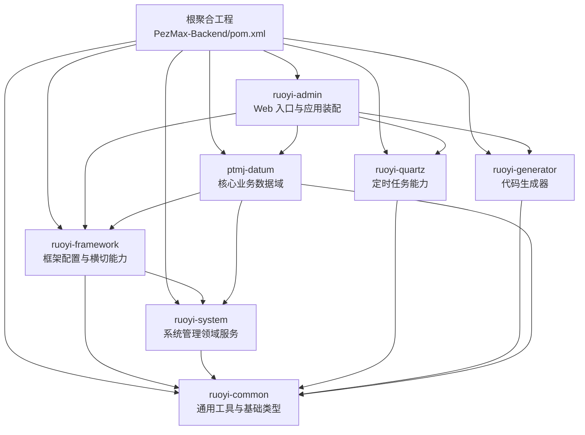
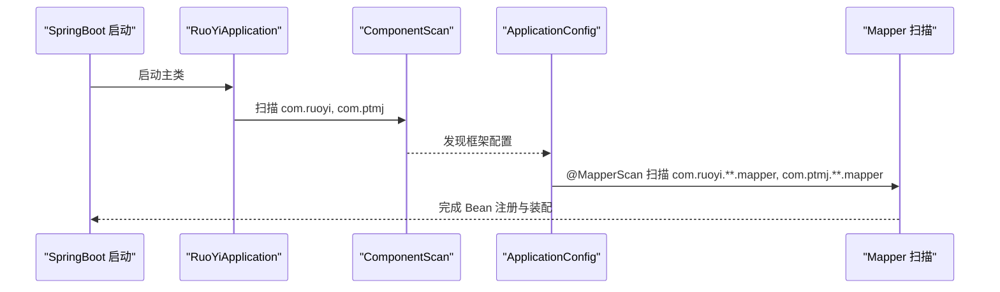
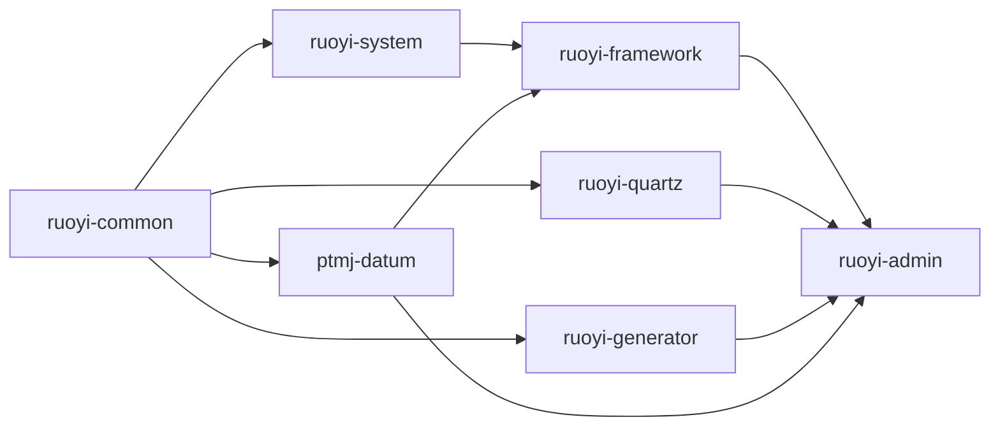

# 项目结构与模块划分

<cite>
**本文引用的文件列表**
- [pom.xml](file://PezMax-Backend/pom.xml)
- [ruoyi-admin/pom.xml](file://PezMax-Backend/ruoyi-admin/pom.xml)
- [ruoyi-common/pom.xml](file://PezMax-Backend/ruoyi-common/pom.xml)
- [ruoyi-framework/pom.xml](file://PezMax-Backend/ruoyi-framework/pom.xml)
- [ruoyi-system/pom.xml](file://PezMax-Backend/ruoyi-system/pom.xml)
- [ruoyi-quartz/pom.xml](file://PezMax-Backend/ruoyi-quartz/pom.xml)
- [ruoyi-generator/pom.xml](file://PezMax-Backend/ruoyi-generator/pom.xml)
- [ptmj-datum/pom.xml](file://PezMax-Backend/ptmj-datum/pom.xml)
- [RuoYiApplication.java](file://PezMax-Backend/ruoyi-admin/src/main/java/com/ruoyi/RuoYiApplication.java)
- [ApplicationConfig.java](file://PezMax-Backend/ruoyi-framework/src/main/java/com/ruoyi/framework/config/ApplicationConfig.java)
</cite>

## 目录
1. [简介](#简介)
2. [项目结构](#项目结构)
3. [核心组件](#核心组件)
4. [架构总览](#架构总览)
5. [详细组件分析](#详细组件分析)
6. [依赖关系分析](#依赖关系分析)
7. [性能与构建特性](#性能与构建特性)
8. [故障排查指南](#故障排查指南)
9. [结论](#结论)
10. [附录：新模块添加最佳实践](#附录新模块添加最佳实践)

## 简介
本项目采用基于 Maven 的多模块架构，围绕若依（RuoYi）体系进行扩展，新增 ptmj-datum 业务数据域。整体分层清晰、职责边界明确：通用工具层、框架配置层、系统管理域、定时任务、代码生成器以及业务数据域相互解耦，由主应用模块统一装配并启动。该设计有利于独立编译、按需引入、稳定演进与团队协作。

## 项目结构
后端根工程为聚合 POM，声明了所有子模块与公共依赖版本；各子模块通过各自的 pom.xml 声明自身依赖，形成稳定的依赖层次。

图表来源
- [pom.xml:177-185](file://PezMax-Backend/pom.xml#L177-L185)
- [ruoyi-admin/pom.xml:39-62](file://PezMax-Backend/ruoyi-admin/pom.xml#L39-L62)
- [ruoyi-framework/pom.xml:56-62](file://PezMax-Backend/ruoyi-framework/pom.xml#L56-L62)
- [ruoyi-system/pom.xml:18-26](file://PezMax-Backend/ruoyi-system/pom.xml#L18-L26)
- [ruoyi-quartz/pom.xml:18-32](file://PezMax-Backend/ruoyi-quartz/pom.xml#L18-L32)
- [ruoyi-generator/pom.xml:18-38](file://PezMax-Backend/ruoyi-generator/pom.xml#L18-L38)
- [ptmj-datum/pom.xml:23-49](file://PezMax-Backend/ptmj-datum/pom.xml#L23-L49)

章节来源
- [pom.xml:177-185](file://PezMax-Backend/pom.xml#L177-L185)

## 核心组件
- ruoyi-admin：应用启动与 Web 装配入口，负责打包可执行 Jar，集成 SpringDoc、数据库驱动，并装配框架、定时任务、代码生成与业务数据域。
- ruoyi-common：通用工具与基础类型，提供注解、常量、异常、工具类、分页、Redis 缓存封装、JSON/Excel/文件等通用能力。
- ruoyi-framework：框架配置与横切能力，包含 Web MVC、AOP、Druid、验证码、系统信息、全局异常处理、安全与拦截器等，并扫描 Mapper 包。
- ruoyi-system：系统管理领域服务，提供用户、角色、菜单、字典、日志等系统级功能。
- ruoyi-quartz：定时任务能力，提供任务调度、任务与日志的持久化与管理接口。
- ruoyi-generator：代码生成器，基于 Velocity 模板生成前后端代码。
- ptmj-datum：核心业务数据域，承载学习资料相关的数据模型、Mapper、Service 与缓存服务。

章节来源
- [ruoyi-admin/pom.xml:14-62](file://PezMax-Backend/ruoyi-admin/pom.xml#L14-L62)
- [ruoyi-common/pom.xml:14-134](file://PezMax-Backend/ruoyi-common/pom.xml#L14-L134)
- [ruoyi-framework/pom.xml:14-62](file://PezMax-Backend/ruoyi-framework/pom.xml#L14-L62)
- [ruoyi-system/pom.xml:14-26](file://PezMax-Backend/ruoyi-system/pom.xml#L14-L26)
- [ruoyi-quartz/pom.xml:14-32](file://PezMax-Backend/ruoyi-quartz/pom.xml#L14-L32)
- [ruoyi-generator/pom.xml:14-38](file://PezMax-Backend/ruoyi-generator/pom.xml#L14-L38)
- [ptmj-datum/pom.xml:19-49](file://PezMax-Backend/ptmj-datum/pom.xml#L19-L49)

## 架构总览
从运行时装配角度，应用启动时仅加载 com.ruoyi 与 com.ptmj 两个包下的组件，并通过框架层的 MapperScan 同时扫描系统域与业务域的 Mapper。

图表来源
- [RuoYiApplication.java:13-14](file://PezMax-Backend/ruoyi-admin/src/main/java/com/ruoyi/RuoYiApplication.java#L13-L14)
- [ApplicationConfig.java:16](file://PezMax-Backend/ruoyi-framework/src/main/java/com/ruoyi/framework/config/ApplicationConfig.java#L16)

章节来源
- [RuoYiApplication.java:13-14](file://PezMax-Backend/ruoyi-admin/src/main/java/com/ruoyi/RuoYiApplication.java#L13-L14)
- [ApplicationConfig.java:16](file://PezMax-Backend/ruoyi-framework/src/main/java/com/ruoyi/framework/config/ApplicationConfig.java#L16)

## 详细组件分析

### ruoyi-admin 主应用模块
- 职责边界
  - 作为唯一可执行入口，负责打包与运行。
  - 引入 SpringDoc、MySQL 驱动，装配框架、定时任务、代码生成与业务数据域。
- 关键要点
  - 排除默认数据源自动配置，使用自定义数据源配置。
  - 组件扫描范围覆盖 com.ruoyi 与 com.ptmj，确保业务域能被发现。
- 依赖关系
  - 依赖 ruoyi-framework、ruoyi-quartz、ruoyi-generator、ptmj-datum。

章节来源
- [ruoyi-admin/pom.xml:39-62](file://PezMax-Backend/ruoyi-admin/pom.xml#L39-L62)
- [RuoYiApplication.java:13-14](file://PezMax-Backend/ruoyi-admin/src/main/java/com/ruoyi/RuoYiApplication.java#L13-L14)

### ruoyi-common 通用工具模块
- 职责边界
  - 提供跨模块复用的注解、常量、异常、工具类、分页、Redis 缓存封装、JSON/Excel/文件等能力。
- 关键要点
  - 不依赖业务模块，保持纯工具属性。
  - 引入 Redis、Jackson、Fastjson2、POI、MinIO 等通用库。
- 依赖关系
  - 被其他模块广泛依赖，自身无业务耦合。

章节来源
- [ruoyi-common/pom.xml:14-134](file://PezMax-Backend/ruoyi-common/pom.xml#L14-L134)

### ruoyi-framework 框架配置模块
- 职责边界
  - 提供 Web MVC、AOP、Druid、验证码、系统信息、全局异常处理、安全与拦截器等横切能力。
  - 集中配置 MyBatis Mapper 扫描路径，支持多包扫描。
- 关键要点
  - 通过 @MapperScan 同时扫描系统域与业务域 mapper 包。
  - 依赖系统模块以复用系统实体与服务。
- 依赖关系
  - 依赖 ruoyi-system 与 ruoyi-common。

章节来源
- [ruoyi-framework/pom.xml:56-62](file://PezMax-Backend/ruoyi-framework/pom.xml#L56-L62)
- [ApplicationConfig.java:16](file://PezMax-Backend/ruoyi-framework/src/main/java/com/ruoyi/framework/config/ApplicationConfig.java#L16)

### ruoyi-system 系统管理模块
- 职责边界
  - 实现系统管理领域的实体、Mapper、Service 与资源，如用户、角色、菜单、字典、操作日志等。
- 关键要点
  - 仅依赖通用工具模块，避免反向依赖框架或业务域。
- 依赖关系
  - 依赖 ruoyi-common。

章节来源
- [ruoyi-system/pom.xml:18-26](file://PezMax-Backend/ruoyi-system/pom.xml#L18-L26)

### ruoyi-quartz 定时任务模块
- 职责边界
  - 提供 Quartz 任务调度能力，包括任务与日志的持久化与管理接口。
- 关键要点
  - 仅依赖通用工具模块与 Quartz Starter。
- 依赖关系
  - 依赖 ruoyi-common。

章节来源
- [ruoyi-quartz/pom.xml:18-32](file://PezMax-Backend/ruoyi-quartz/pom.xml#L18-L32)

### ruoyi-generator 代码生成器模块
- 职责边界
  - 基于 Velocity 模板生成前后端代码，辅助快速开发。
- 关键要点
  - 依赖通用工具与 Druid，便于读取元数据。
- 依赖关系
  - 依赖 ruoyi-common 与 Druid。

章节来源
- [ruoyi-generator/pom.xml:18-38](file://PezMax-Backend/ruoyi-generator/pom.xml#L18-L38)

### ptmj-datum 核心业务数据模块
- 职责边界
  - 承载学习资料相关的领域模型、Mapper、Service 与缓存服务，是业务能力的核心载体。
- 关键要点
  - 依赖框架层（获得横切能力）、系统层（复用系统实体与服务）、通用层（工具与基础类型）。
  - 引入 Redis 用于热点数据缓存。
- 依赖关系
  - 依赖 ruoyi-framework、ruoyi-system、ruoyi-common。

章节来源
- [ptmj-datum/pom.xml:23-49](file://PezMax-Backend/ptmj-datum/pom.xml#L23-L49)

## 依赖关系分析
- 依赖方向
  - 自底向上：common → system/quartz/generator/datum → framework → admin
  - 业务域 datum 直接依赖 framework/system/common，体现“业务域对框架与系统能力的复用”。
- 循环依赖检查
  - 未发现循环依赖；system 仅依赖 common，datum 依赖 framework/system/common，framework 依赖 system/common，admin 依赖 framework/quartz/generator/datum。
- 外部依赖治理
  - 根 POM 使用 dependencyManagement 统一管理第三方依赖版本，保证一致性。

图表来源
- [pom.xml:177-185](file://PezMax-Backend/pom.xml#L177-L185)
- [ruoyi-admin/pom.xml:39-62](file://PezMax-Backend/ruoyi-admin/pom.xml#L39-L62)
- [ruoyi-framework/pom.xml:56-62](file://PezMax-Backend/ruoyi-framework/pom.xml#L56-L62)
- [ruoyi-system/pom.xml:18-26](file://PezMax-Backend/ruoyi-system/pom.xml#L18-L26)
- [ruoyi-quartz/pom.xml:18-32](file://PezMax-Backend/ruoyi-quartz/pom.xml#L18-L32)
- [ruoyi-generator/pom.xml:18-38](file://PezMax-Backend/ruoyi-generator/pom.xml#L18-L38)
- [ptmj-datum/pom.xml:23-49](file://PezMax-Backend/ptmj-datum/pom.xml#L23-L49)

章节来源
- [pom.xml:38-175](file://PezMax-Backend/pom.xml#L38-L175)

## 性能与构建特性
- 构建产物
  - ruoyi-admin 使用 spring-boot-maven-plugin 重打包为可执行 Jar，便于部署。
- 编译与编码
  - 统一 Java 17 与 UTF-8 编码，提升一致性与兼容性。
- 依赖版本治理
  - 根 POM 通过 dependencyManagement 锁定第三方依赖版本，降低冲突风险。
- 扫描与装配
  - 通过限定 ComponentScan 与 MapperScan 的包路径，减少不必要的扫描开销。

章节来源
- [ruoyi-admin/pom.xml:66-90](file://PezMax-Backend/ruoyi-admin/pom.xml#L66-L90)
- [pom.xml:188-206](file://PezMax-Backend/pom.xml#L188-L206)
- [RuoYiApplication.java:13-14](file://PezMax-Backend/ruoyi-admin/src/main/java/com/ruoyi/RuoYiApplication.java#L13-L14)
- [ApplicationConfig.java:16](file://PezMax-Backend/ruoyi-framework/src/main/java/com/ruoyi/framework/config/ApplicationConfig.java#L16)

## 故障排查指南
- 启动失败：Bean 未找到
  - 确认 @ComponentScan 是否包含目标包（com.ruoyi 与 com.ptmj）。
  - 确认 Mapper 所在包是否在 @MapperScan 范围内。
- 数据源问题
  - 主类排除了默认 DataSourceAutoConfiguration，需确保自定义数据源配置生效。
- 模块依赖缺失
  - 在对应模块的 pom.xml 中补充依赖，并确保根 POM 的 dependencyManagement 已声明版本。

章节来源
- [RuoYiApplication.java:13-14](file://PezMax-Backend/ruoyi-admin/src/main/java/com/ruoyi/RuoYiApplication.java#L13-L14)
- [ApplicationConfig.java:16](file://PezMax-Backend/ruoyi-framework/src/main/java/com/ruoyi/framework/config/ApplicationConfig.java#L16)

## 结论
本项目的多模块划分遵循“通用→系统→框架→业务→应用”的分层原则，职责清晰、依赖单向、易于扩展。通过统一的依赖版本管理与明确的包扫描策略，既保证了模块化带来的可维护性，也兼顾了运行时的装配效率。

## 附录：新模块添加最佳实践
- 模块定位
  - 若为通用能力：新建 ruoyi-xxx-common 风格模块，仅依赖 ruoyi-common。
  - 若为领域服务：新建 xxx-domain 模块，依赖 ruoyi-framework、ruoyi-system、ruoyi-common。
  - 若为可选能力（如报表、监控）：新建独立模块，按需被 admin 引入。
- 依赖声明
  - 在根 POM 的 dependencyManagement 中声明版本，子模块仅引用 artifactId。
  - 在聚合模块中新增 <module> 条目，确保参与构建。
- 包与扫描
  - 若新增 Controller/Service/Mapper，确保其包路径被 @ComponentScan 与 @MapperScan 覆盖。
  - 建议将新模块的包纳入 com.ptmj 或 com.ruoyi 下已有命名空间，避免遗漏扫描。
- 配置与资源
  - 配置文件按环境拆分，避免硬编码；敏感信息走环境变量或配置中心。
  - 若涉及数据库表，提供 SQL 脚本并在文档中说明迁移顺序。
- 构建与发布
  - 非可执行模块 packaging 设为 jar；可执行模块使用 spring-boot-maven-plugin 重打包。
  - 本地验证：先 mvn clean install 根工程，再单独运行 ruoyi-admin。
- 注意事项
  - 禁止业务模块反向依赖 admin。
  - 谨慎引入大体积依赖，优先复用现有通用能力。
  - 控制 MapperScan 范围，避免扫描到无关包导致启动变慢。

章节来源
- [pom.xml:177-185](file://PezMax-Backend/pom.xml#L177-L185)
- [ruoyi-admin/pom.xml:39-62](file://PezMax-Backend/ruoyi-admin/pom.xml#L39-L62)
- [RuoYiApplication.java:13-14](file://PezMax-Backend/ruoyi-admin/src/main/java/com/ruoyi/RuoYiApplication.java#L13-L14)
- [ApplicationConfig.java:16](file://PezMax-Backend/ruoyi-framework/src/main/java/com/ruoyi/framework/config/ApplicationConfig.java#L16)