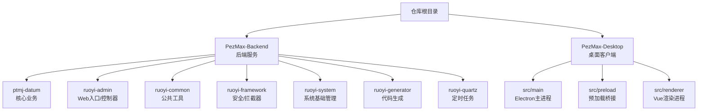
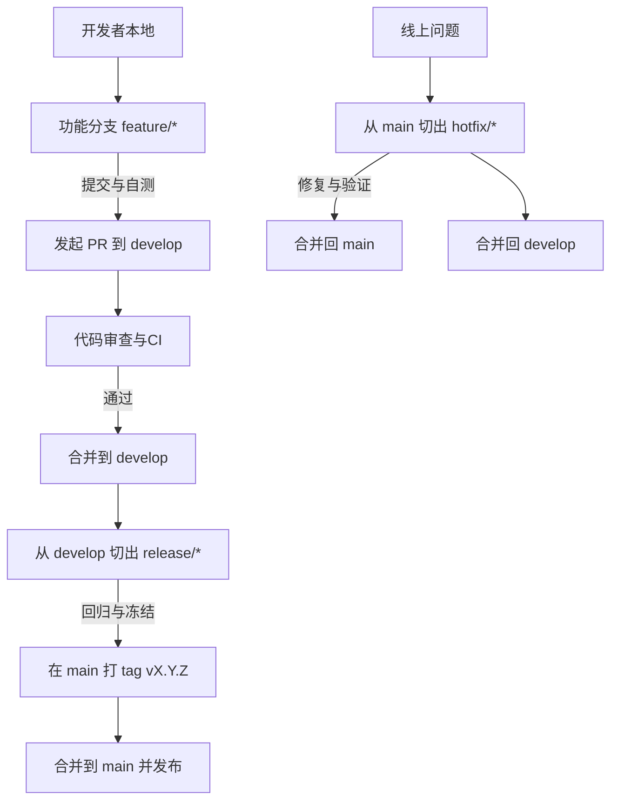
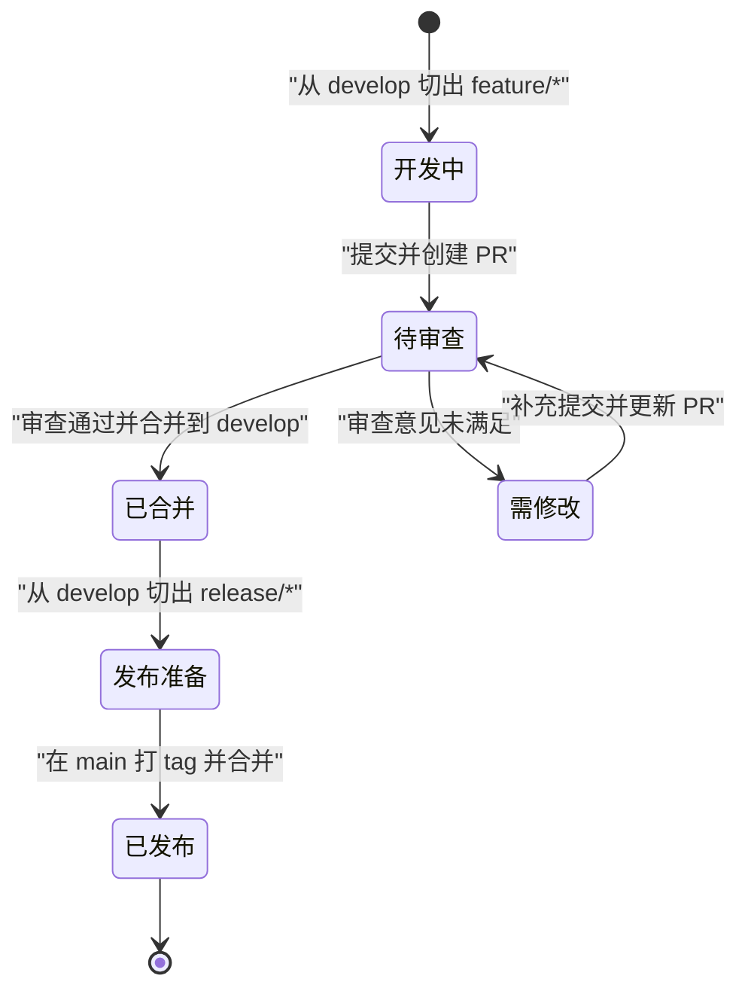
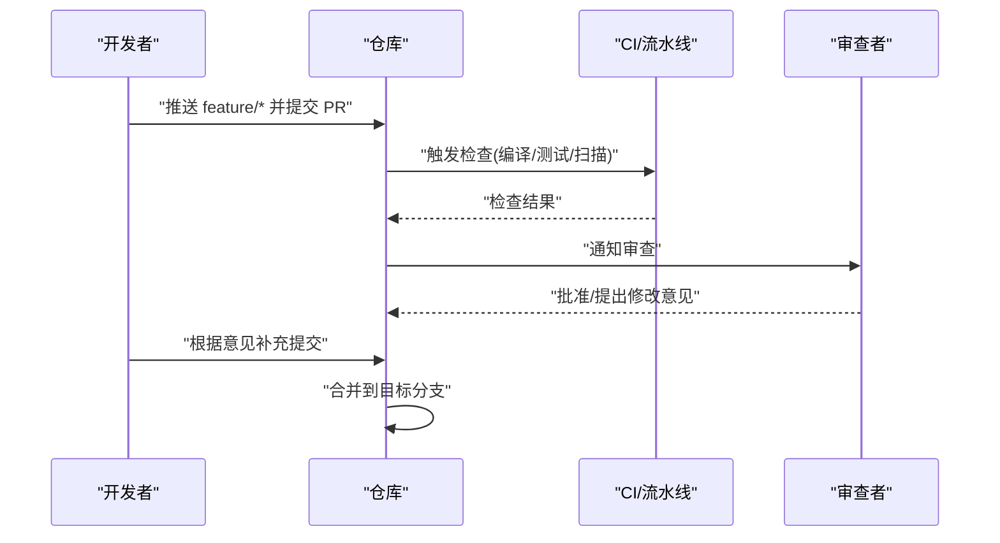
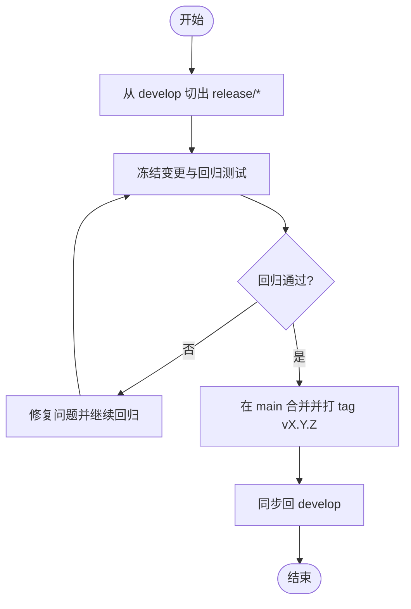
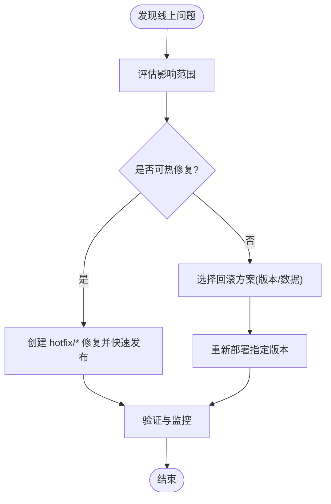
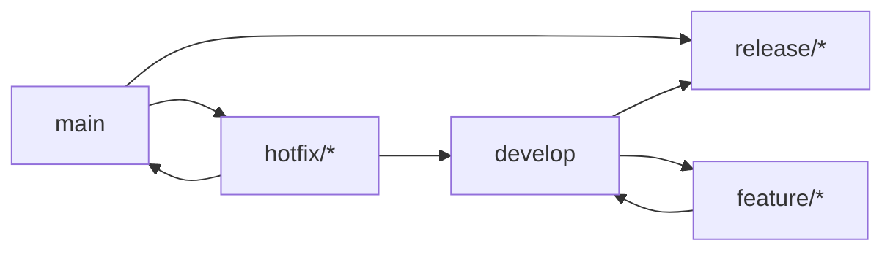

# Git工作流

<cite>
**本文引用的文件**   
- [PezMax-Backend/.gitignore](file://PezMax-Backend/.gitignore)
- [PezMax-Desktop/.gitignore](file://PezMax-Desktop/.gitignore)
- [PezMax-Backend/README.md](file://PezMax-Backend/README.md)
- [PezMax-Desktop/README.md](file://PezMax-Desktop/README.md)
</cite>

## 目录
1. [简介](#简介)
2. [项目结构](#项目结构)
3. [核心组件](#核心组件)
4. [架构总览](#架构总览)
5. [详细组件分析](#详细组件分析)
6. [依赖分析](#依赖分析)
7. [性能考虑](#性能考虑)
8. [故障排查指南](#故障排查指南)
9. [结论](#结论)
10. [附录](#附录)

## 简介
本规范面向 PezMax-One 仓库（包含后端与桌面端），旨在统一团队的 Git 协作方式与分支管理策略，明确提交信息、分支命名、标签与发布流程，并给出 Pull Request 审查要求与冲突解决策略。同时提供 .gitignore 配置说明，确保构建产物与本地环境文件不被纳入版本控制。

## 项目结构
仓库采用前后端分离的多模块组织：
- 后端：基于 Spring Boot 的模块化工程，包含业务模块、通用组件、框架层、系统管理与代码生成等子模块。
- 桌面端：基于 Electron + Vue 3 的跨平台客户端，包含主进程、预加载脚本与渲染进程。

**图示来源**
- [PezMax-Backend/README.md:76-89](file://PezMax-Backend/README.md#L76-L89)
- [PezMax-Desktop/README.md:80-94](file://PezMax-Desktop/README.md#L80-L94)

**章节来源**
- [PezMax-Backend/README.md:76-89](file://PezMax-Backend/README.md#L76-L89)
- [PezMax-Desktop/README.md:80-94](file://PezMax-Desktop/README.md#L80-L94)

## 核心组件
本节聚焦于与 Git 工作流直接相关的“组件”：分支模型、提交规范、PR 流程、标签与发布、回滚策略以及 .gitignore 配置要点。

- 分支模型
  - 主分支 main：稳定可发布的基线，仅接受来自 release 或 hotfix 的合并。
  - 开发分支 develop：集成日常开发成果，作为功能分支的合并目标。
  - 功能分支 feature/*：从 develop 切出，完成后合并回 develop。
  - 热修复分支 hotfix/*：从 main 切出，修复线上问题后合并回 main 与 develop。
  - 发布分支 release/*：从 develop 切出，用于冻结与回归测试，完成后打 tag 并入 main。

- 提交信息规范
  - 类型前缀：feat、fix、docs、style、refactor、perf、test、build、ci、chore、revert。
  - 格式：type(scope): subject
  - 规则：subject 简明扼要；必要时在正文补充动机与影响范围；避免无意义变更。

- 分支命名约定
  - feature/<描述>：新功能
  - fix/<描述>：缺陷修复（非紧急）
  - hotfix/<描述>：线上紧急修复
  - release/<版本号>：发布准备
  - 示例：feature/bookmark-tree、hotfix/minio-url-fix

- 标签管理策略
  - 语义化版本：vX.Y.Z（主.次.修订）
  - 发布打 tag：release 分支完成回归后，在 main 上打 tag 并推送。
  - 变更记录：结合 CHANGELOG 或文档更新记录。

- 代码合并流程（Pull Request）
  - 创建 PR：从功能分支到 develop（或 hotfix 到 main）。
  - 检查清单：CI 通过、自测通过、变更范围清晰、影响面评估。
  - 代码审查：至少一名 reviewer 批准；关注可读性、安全性与性能。
  - 合并策略：优先使用 squash merge 保持历史整洁；hotfix 可使用 rebase 保持线性。

- 冲突解决策略
  - 先拉取最新目标分支，再在本地进行 rebase 或 merge。
  - 逐文件审阅差异，保留必要注释；必要时与相关作者沟通。
  - 冲突解决后重新运行 CI 与本地验证。

- 版本发布流程
  - 从 develop 切出 release/X.Y.Z。
  - 冻结新增功能，仅允许 bug 修复与文档更新。
  - 回归通过后，在 main 合并并打 tag vX.Y.Z。
  - 同步至 develop，并更新发布说明。

- 回滚策略
  - 快速回滚：对已发布版本打 revert 提交并重新发布。
  - 指定版本恢复：通过 tag 检出并重新打包部署。
  - 数据回滚：配合数据库迁移脚本与备份策略执行。

- .gitignore 配置说明
  - 后端（Java/Maven/Docker）：忽略构建输出、IDE 配置、日志与临时文件；保留必要的 wrapper 与生成源码例外。
  - 桌面端（Node/Electron/Vue）：忽略 node_modules、dist/out、缓存与 IDE 特定文件。

**章节来源**
- [PezMax-Backend/.gitignore:1-48](file://PezMax-Backend/.gitignore#L1-L48)
- [PezMax-Desktop/.gitignore:1-9](file://PezMax-Desktop/.gitignore#L1-L9)

## 架构总览
下图展示团队在 GitHub/GitLab 上的典型协作路径与分支流转关系。

[此图为概念性流程图，不直接映射具体源文件]

## 详细组件分析

### 分支模型与生命周期
- 目的与边界
  - main：生产可用基线，禁止直接推送。
  - develop：集成分支，承载所有已评审的功能。
  - feature/*：短期存在，完成后即废弃。
  - release/*：发布候选，冻结变更。
  - hotfix/*：紧急修复，最小改动范围。

- 关键动作
  - 切分支：从对应上游分支 checkout。
  - 提交：遵循提交规范，小步快跑。
  - 合并：PR 审查通过后合并，保留审计线索。
  - 清理：合并后删除已合入的远程分支。

[此图为概念性状态图，不直接映射具体源文件]

### 提交信息与变更追踪
- 建议的提交类型与用途
  - feat：新功能
  - fix：缺陷修复
  - docs：文档更新
  - style：格式化与样式调整
  - refactor：重构
  - perf：性能优化
  - test：测试相关
  - build：构建系统与依赖更新
  - ci：CI/CD 配置
  - chore：杂项维护
  - revert：回退提交

- 最佳实践
  - 主题行不超过 72 字符，动词开头。
  - 正文解释“为什么”，而非“是什么”。
  - 关联 Issue/需求编号（如 #123）。

[本节为通用规范说明，不直接分析具体文件]

### Pull Request 流程与审查要求
- 前置条件
  - 本地 CI 通过（编译、单元测试、静态检查）。
  - 变更范围清晰，影响面评估到位。
  - 附带必要文档或更新说明。

- 审查要点
  - 正确性与健壮性
  - 可读性与可维护性
  - 安全与性能风险
  - 与现有架构的一致性

- 合并策略
  - 常规功能：squash merge，保持历史简洁。
  - 热修复：rebase 合并，便于定位问题。

[此图为概念性序列图，不直接映射具体源文件]

### 标签与版本发布
- 版本策略
  - 语义化版本 vX.Y.Z，主版本含破坏性变更，次版本新增特性，修订版本为兼容修复。
- 发布步骤
  - 从 develop 切出 release/*，冻结变更。
  - 回归通过后，在 main 合并并打 tag。
  - 同步至 develop，更新发布说明。

[此图为概念性流程图，不直接映射具体源文件]

### 回滚策略
- 应用回滚
  - 针对最近一次错误发布，创建 revert 提交并重新发布。
  - 或通过 tag 检出指定版本并重新打包部署。
- 数据回滚
  - 依据数据库迁移脚本与备份策略执行。
  - 回滚后验证关键业务流程。

[此图为概念性流程图，不直接映射具体源文件]

### .gitignore 配置说明
- 后端（Java/Maven/Docker）
  - 构建产物：target、build 目录等。
  - IDE 配置：.idea、*.iml、*.ipr 等。
  - 日志与临时文件：*.log、*.swp 等。
  - 例外：保留必要的 wrapper jar 与生成源码（如 */build/*.java）。

- 桌面端（Node/Electron/Vue）
  - 依赖与构建：node_modules、dist、out。
  - 缓存与系统文件：.eslintcache、.DS_Store、*.log*。
  - 自动导入声明：auto-imports.d.ts。

**章节来源**
- [PezMax-Backend/.gitignore:1-48](file://PezMax-Backend/.gitignore#L1-L48)
- [PezMax-Desktop/.gitignore:1-9](file://PezMax-Desktop/.gitignore#L1-L9)

## 依赖分析
- 分支耦合
  - feature/* 依赖 develop 的最新集成点。
  - release/* 依赖 develop 的稳定快照。
  - hotfix/* 依赖 main 的生产基线。
- 外部依赖
  - 后端依赖 MySQL、Redis、MinIO 等基础设施（由 Docker Compose 管理）。
  - 桌面端依赖 Node 环境与后端 API。

[此图为概念性依赖图，不直接映射具体源文件]

## 性能考虑
- 提交粒度：小而频繁的提交有助于减少冲突与提高审查效率。
- 分支长度：缩短 feature 分支生命周期，降低集成成本。
- 合并策略：合理使用 squash/rebase，保持历史清晰，提升后续回溯效率。
- 构建与缓存：利用 .gitignore 排除无关文件，减小仓库体积与传输开销。

[本节为通用指导，不直接分析具体文件]

## 故障排查指南
- 常见冲突场景
  - 多人并行修改同一文件：优先 rebase 到目标分支，逐段解决差异。
  - 合并后 CI 失败：检查本地环境与依赖一致性，复现并修复。
- 回滚操作
  - 应用回滚：通过 tag 或 revert 提交恢复到已知稳定版本。
  - 数据回滚：依据迁移脚本与备份执行，并在测试环境先行验证。
- 日志与证据
  - 收集提交哈希、分支名、时间线与错误日志，便于定位问题。

[本节为通用指导，不直接分析具体文件]

## 结论
通过统一的分支模型、提交规范、PR 流程与发布/回滚策略，团队可在保证质量的前提下高效协作。配合合理的 .gitignore 配置，可有效控制仓库规模与噪声，提升整体研发效率与稳定性。

## 附录
- 参考链接
  - 后端 README 中的技术栈与结构说明可作为理解项目边界的参考。
  - 桌面端 README 中的结构与构建说明有助于了解客户端侧的依赖与产物。

**章节来源**
- [PezMax-Backend/README.md:31-44](file://PezMax-Backend/README.md#L31-L44)
- [PezMax-Backend/README.md:76-89](file://PezMax-Backend/README.md#L76-L89)
- [PezMax-Desktop/README.md:42-53](file://PezMax-Desktop/README.md#L42-L53)
- [PezMax-Desktop/README.md:80-94](file://PezMax-Desktop/README.md#L80-L94)