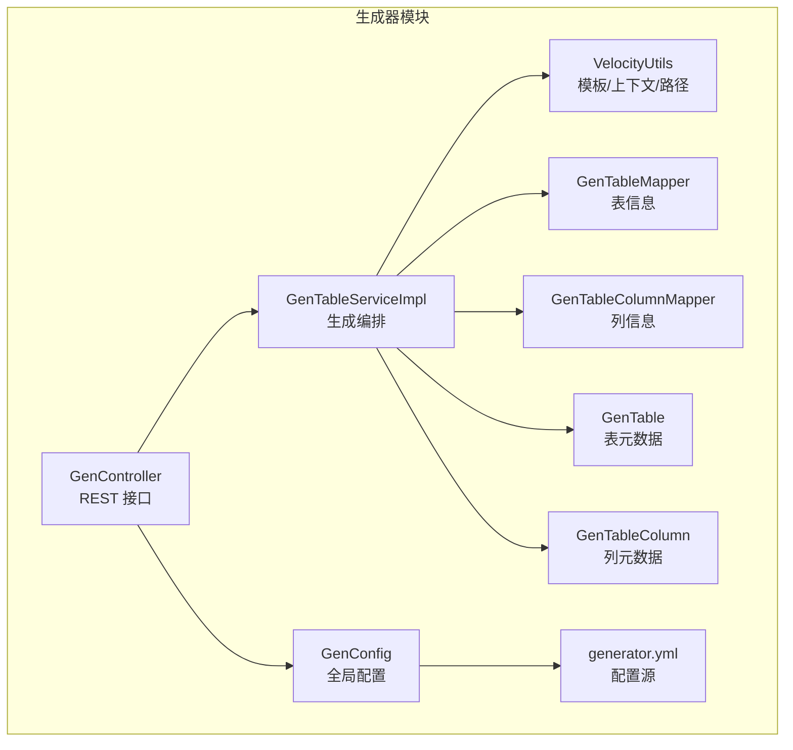
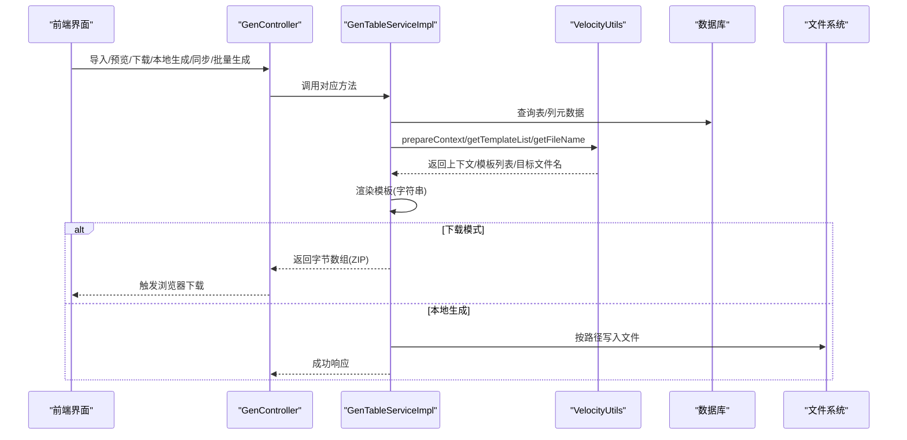
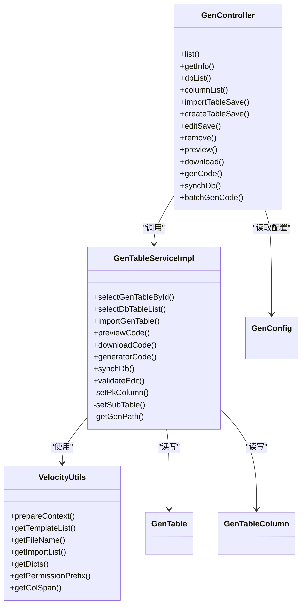

# 代码生成器

<cite>
**本文引用的文件**   
- [GenConfig.java](file://PezMax-Backend/ruoyi-generator/src/main/java/com/ruoyi/generator/config/GenConfig.java)
- [generator.yml](file://PezMax-Backend/ruoyi-generator/src/main/resources/generator.yml)
- [GenController.java](file://PezMax-Backend/ruoyi-generator/src/main/java/com/ruoyi/generator/controller/GenController.java)
- [IGenTableService.java](file://PezMax-Backend/ruoyi-generator/src/main/java/com/ruoyi/generator/service/IGenTableService.java)
- [GenTableServiceImpl.java](file://PezMax-Backend/ruoyi-generator/src/main/java/com/ruoyi/generator/service/GenTableServiceImpl.java)
- [VelocityUtils.java](file://PezMax-Backend/ruoyi-generator/src/main/java/com/ruoyi/generator/util/VelocityUtils.java)
- [GenTable.java](file://PezMax-Backend/ruoyi-generator/src/main/java/com/ruoyi/generator/domain/GenTable.java)
- [GenTableColumn.java](file://PezMax-Backend/ruoyi-generator/src/main/java/com/ruoyi/generator/domain/GenTableColumn.java)
</cite>

## 目录
1. [简介](#简介)
2. [项目结构](#项目结构)
3. [核心组件](#核心组件)
4. [架构总览](#架构总览)
5. [详细组件分析](#详细组件分析)
6. [依赖关系分析](#依赖关系分析)
7. [性能与并发特性](#性能与并发特性)
8. [故障排查指南](#故障排查指南)
9. [结论](#结论)
10. [附录：模板与字段映射规范](#附录模板与字段映射规范)

## 简介
本章节面向使用若依（RuoYi）代码生成器的开发者，系统讲解如何基于数据库表结构快速生成后端 Java 代码与前端页面。内容涵盖：
- 数据库表结构设计要求与命名规范
- 代码生成配置（generator.yml、包路径、前缀处理、覆盖策略等）
- 模板定制与字段映射规则
- 完整 CRUD 代码生成流程（实体类、Mapper、Service、Controller、前端页面）
- 自定义模板开发指南（Velocity 语法、数据模型访问、条件渲染）
- 批量生成、增量更新、代码覆盖处理等实用技巧

## 项目结构
代码生成器位于 ruoyi-generator 模块，主要包含控制器、服务层、领域模型、工具类与配置文件：
- 控制器：提供导入表结构、预览、下载、本地生成、同步、批量生成等接口
- 服务层：封装生成逻辑、模板渲染、ZIP 打包、写入磁盘等操作
- 领域模型：描述“业务表”和“字段”的元数据
- 工具类：负责 Velocity 上下文准备、模板列表选择、文件名计算、权限前缀、字典收集等
- 配置：读取 generator.yml 中的全局生成参数

图表来源
- [GenController.java](file://PezMax-Backend/ruoyi-generator/src/main/java/com/ruoyi/generator/controller/GenController.java)
- [GenTableServiceImpl.java](file://PezMax-Backend/ruoyi-generator/src/main/java/com/ruoyi/generator/service/GenTableServiceImpl.java)
- [VelocityUtils.java](file://PezMax-Backend/ruoyi-generator/src/main/java/com/ruoyi/generator/util/VelocityUtils.java)
- [GenConfig.java](file://PezMax-Backend/ruoyi-generator/src/main/java/com/ruoyi/generator/config/GenConfig.java)
- [generator.yml](file://PezMax-Backend/ruoyi-generator/src/main/resources/generator.yml)

章节来源
- [GenController.java](file://PezMax-Backend/ruoyi-generator/src/main/java/com/ruoyi/generator/controller/GenController.java)
- [GenTableServiceImpl.java](file://PezMax-Backend/ruoyi-generator/src/main/java/com/ruoyi/generator/service/GenTableServiceImpl.java)
- [VelocityUtils.java](file://PezMax-Backend/ruoyi-generator/src/main/java/com/ruoyi/generator/util/VelocityUtils.java)
- [GenConfig.java](file://PezMax-Backend/ruoyi-generator/src/main/java/com/ruoyi/generator/config/GenConfig.java)
- [generator.yml](file://PezMax-Backend/ruoyi-generator/src/main/resources/generator.yml)

## 核心组件
- GenController：暴露 /tool/gen 系列接口，支持导入、创建表、预览、下载、本地生成、同步、批量生成
- GenTableServiceImpl：实现生成主流程，包括上下文准备、模板选择、渲染、ZIP 打包、写入本地
- VelocityUtils：准备 VelocityContext、选择模板集合、计算输出文件名、权限前缀、字典集合、表单列宽等
- GenConfig + generator.yml：加载作者、包路径、是否去除表前缀、表前缀、是否允许覆盖到本地等全局参数
- GenTable / GenTableColumn：描述待生成表的元数据与字段属性，如是否主键、是否必填、查询方式、HTML 控件类型、字典类型等

章节来源
- [GenController.java](file://PezMax-Backend/ruoyi-generator/src/main/java/com/ruoyi/generator/controller/GenController.java)
- [GenTableServiceImpl.java](file://PezMax-Backend/ruoyi-generator/src/main/java/com/ruoyi/generator/service/GenTableServiceImpl.java)
- [VelocityUtils.java](file://PezMax-Backend/ruoyi-generator/src/main/java/com/ruoyi/generator/util/VelocityUtils.java)
- [GenConfig.java](file://PezMax-Backend/ruoyi-generator/src/main/java/com/ruoyi/generator/config/GenConfig.java)
- [generator.yml](file://PezMax-Backend/ruoyi-generator/src/main/resources/generator.yml)
- [GenTable.java](file://PezMax-Backend/ruoyi-generator/src/main/java/com/ruoyi/generator/domain/GenTable.java)
- [GenTableColumn.java](file://PezMax-Backend/ruoyi-generator/src/main/java/com/ruoyi/generator/domain/GenTableColumn.java)

## 架构总览
下图展示了从用户操作到最终代码产出的关键调用链与数据流。

图表来源
- [GenController.java](file://PezMax-Backend/ruoyi-generator/src/main/java/com/ruoyi/generator/controller/GenController.java)
- [GenTableServiceImpl.java](file://PezMax-Backend/ruoyi-generator/src/main/java/com/ruoyi/generator/service/GenTableServiceImpl.java)
- [VelocityUtils.java](file://PezMax-Backend/ruoyi-generator/src/main/java/com/ruoyi/generator/util/VelocityUtils.java)

## 详细组件分析

### 控制器层：GenController
- 功能要点
  - 列表与分页：查询已配置的生成任务与数据库表
  - 导入表结构：根据选中的表名批量导入元数据并初始化默认值
  - 创建表结构：解析 SQL 建表语句，执行后自动导入
  - 预览代码：将各模板渲染为文本，供前端展示
  - 下载代码：将多模板渲染结果打包为 ZIP 返回
  - 本地生成：在允许覆盖的前提下，直接写入项目源码目录
  - 同步数据库：对比当前元数据与真实库结构，增量更新字段
  - 批量生成：对多个表合并打包为一个 ZIP 下载
- 权限控制：通过注解进行权限校验，避免未授权访问
- 日志记录：关键操作记录审计日志

章节来源
- [GenController.java](file://PezMax-Backend/ruoyi-generator/src/main/java/com/ruoyi/generator/controller/GenController.java)

### 服务层：GenTableServiceImpl
- 核心职责
  - 组装上下文：设置主子表、主键列、菜单选项等
  - 模板渲染：根据模板类别与前端类型选择模板集，逐条渲染
  - 输出策略：下载模式返回 ZIP；本地生成模式写入磁盘
  - 同步策略：保留重要编辑项（如必填、显示类型），新增/删除列
  - 校验：树表/主子表场景的参数校验
- 关键流程
  - previewCode：渲染所有模板到内存，便于预览
  - downloadCode：单表或多表打包为 ZIP
  - generatorCode：跳过部分非源码模板，直接落盘
  - synchDb：对比库结构与元数据，增量更新
  - setPkColumn/setSubTable：补齐主键与子表信息
  - getGenPath：根据 genPath 决定输出根目录

章节来源
- [GenTableServiceImpl.java](file://PezMax-Backend/ruoyi-generator/src/main/java/com/ruoyi/generator/service/GenTableServiceImpl.java)
- [IGenTableService.java](file://PezMax-Backend/ruoyi-generator/src/main/java/com/ruoyi/generator/service/IGenTableService.java)

### 工具层：VelocityUtils
- 上下文准备：注入表名、类名、包名、模块名、业务名、作者、日期、权限前缀、字典集合、树/主子表相关变量等
- 模板选择：根据 tplCategory（crud/tree/sub）与 tplWebType（element-plus/element-plus-typescript）动态选择模板集合
- 文件名计算：根据模板类型推断输出路径与文件名（Java/Mapper/XML/SQL/Vue/TS 等）
- 其他辅助：包前缀、导入包集合、字典集合、表单列宽、展开列序号等

章节来源
- [VelocityUtils.java](file://PezMax-Backend/ruoyi-generator/src/main/java/com/ruoyi/generator/util/VelocityUtils.java)

### 配置层：GenConfig + generator.yml
- 配置项
  - author：作者
  - packageName：默认生成包路径
  - autoRemovePre：是否自动去除表前缀
  - tablePrefix：表前缀（可多个，逗号分隔）
  - allowOverwrite：是否允许本地覆盖生成
- 作用范围
  - 影响类名生成（是否去除前缀）、包路径、是否允许本地写入等

章节来源
- [GenConfig.java](file://PezMax-Backend/ruoyi-generator/src/main/java/com/ruoyi/generator/config/GenConfig.java)
- [generator.yml](file://PezMax-Backend/ruoyi-generator/src/main/resources/generator.yml)

### 领域模型：GenTable / GenTableColumn
- GenTable
  - 关键字段：表名、表注释、类名、模板类别、前端类型、包路径、模块名、业务名、功能名、作者、表单列数、生成方式、生成路径、主键列、子表、列集合、选项 JSON、树字段、上级菜单等
  - 便捷判断：是否树表、是否主子表、是否 CRUD、是否超级列
- GenTableColumn
  - 关键字段：列名、注释、类型、Java 类型、Java 字段名、是否主键/自增/必填、是否插入/编辑/列表/查询、查询方式、HTML 控件类型、字典类型、排序
  - 便捷判断：是否主键、是否自增、是否必填、是否插入/编辑/列表/查询、是否超级列、是否可用列、字典转换表达式

章节来源
- [GenTable.java](file://PezMax-Backend/ruoyi-generator/src/main/java/com/ruoyi/generator/domain/GenTable.java)
- [GenTableColumn.java](file://PezMax-Backend/ruoyi-generator/src/main/java/com/ruoyi/generator/domain/GenTableColumn.java)

## 依赖关系分析
- 控制器依赖服务层，服务层依赖 Mapper 与工具类
- 工具类不依赖持久层，仅做上下文与路径计算
- 配置类由 Spring 容器加载，服务层通过常量或配置项参与生成行为

图表来源
- [GenController.java](file://PezMax-Backend/ruoyi-generator/src/main/java/com/ruoyi/generator/controller/GenController.java)
- [GenTableServiceImpl.java](file://PezMax-Backend/ruoyi-generator/src/main/java/com/ruoyi/generator/service/GenTableServiceImpl.java)
- [VelocityUtils.java](file://PezMax-Backend/ruoyi-generator/src/main/java/com/ruoyi/generator/util/VelocityUtils.java)
- [GenConfig.java](file://PezMax-Backend/ruoyi-generator/src/main/java/com/ruoyi/generator/config/GenConfig.java)
- [GenTable.java](file://PezMax-Backend/ruoyi-generator/src/main/java/com/ruoyi/generator/domain/GenTable.java)
- [GenTableColumn.java](file://PezMax-Backend/ruoyi-generator/src/main/java/com/ruoyi/generator/domain/GenTableColumn.java)

## 性能与并发特性
- 批量生成采用 ZIP 流式写入，减少中间文件 IO，适合一次性导出多表
- 预览模式仅在内存中渲染，避免磁盘 IO，适合快速验证
- 本地生成模式会逐个模板写入文件，注意磁盘 I/O 与权限
- 同步数据库时采用流式对比与批量更新，尽量减少全量重建

[本节为通用指导，无需特定文件引用]

## 故障排查指南
- 无法本地生成
  - 检查是否开启 allowOverwrite 配置
  - 确认运行用户对目标目录有写权限
- 生成路径异常
  - 检查 genPath 是否为空或非法
  - 确认模板选择的 tplWebType 与期望一致
- 预览空白或报错
  - 检查模板是否存在且路径正确
  - 检查上下文变量是否齐全（如 treeCode、treeParentCode、treeName 等）
- 同步失败
  - 确认原表结构存在
  - 关注必填/显示类型等字段是否被保留
- 权限不足
  - 检查接口权限标识是否正确配置

章节来源
- [GenController.java](file://PezMax-Backend/ruoyi-generator/src/main/java/com/ruoyi/generator/controller/GenController.java)
- [GenTableServiceImpl.java](file://PezMax-Backend/ruoyi-generator/src/main/java/com/ruoyi/generator/service/GenTableServiceImpl.java)
- [GenConfig.java](file://PezMax-Backend/ruoyi-generator/src/main/java/com/ruoyi/generator/config/GenConfig.java)

## 结论
若依代码生成器以“元数据驱动 + Velocity 模板”为核心，提供了从数据库到前后端代码的一体化生成能力。通过合理的表结构设计、规范的字段标注与灵活的模板定制，可以高效产出可维护的 CRUD 代码，并在批量生成、增量同步、本地覆盖等方面具备良好的工程化体验。

[本节为总结性内容，无需特定文件引用]

## 附录：模板与字段映射规范

### 数据库表结构设计要求与命名规范
- 建议每个业务表具备唯一主键（推荐自增或雪花 ID）
- 表名建议使用小写下划线风格，配合 tablePrefix 与 autoRemovePre 控制类名生成
- 字段注释应清晰，必要时可在注释中使用“（值=含义）”形式以便字典转换
- 常用公共字段（如创建人、创建时间、更新人、更新时间、备注等）可通过“超级列”机制忽略或特殊处理

章节来源
- [GenTableColumn.java](file://PezMax-Backend/ruoyi-generator/src/main/java/com/ruoyi/generator/domain/GenTableColumn.java)
- [GenTable.java](file://PezMax-Backend/ruoyi-generator/src/main/java/com/ruoyi/generator/domain/GenTable.java)

### 代码生成配置（generator.yml）
- author：用于模板头部作者信息
- packageName：默认包路径，可按模块调整
- autoRemovePre：是否自动去除表前缀
- tablePrefix：表前缀（可多个，逗号分隔）
- allowOverwrite：是否允许本地覆盖生成

章节来源
- [generator.yml](file://PezMax-Backend/ruoyi-generator/src/main/resources/generator.yml)
- [GenConfig.java](file://PezMax-Backend/ruoyi-generator/src/main/java/com/ruoyi/generator/config/GenConfig.java)

### 模板定制与字段映射规则
- 模板选择
  - 后端模板：domain、mapper、service、serviceImpl、controller、xml、sql
  - 前端模板：api.js/ts、index.vue/index-tree.vue、ts 类型定义（当选择 TypeScript 模板）
- 上下文变量
  - 基础：tableName、className、businessName、moduleName、packageName、author、datetime 等
  - 权限：permissionPrefix
  - 字典：dicts（自动收集 select/radio/checkbox 的 dictType）
  - 树表：treeCode、treeParentCode、treeName、expandColumn
  - 主子表：subTable、subTableName、subTableFkName 等
- 字段映射
  - javaField、javaType、isPk、isIncrement、isRequired、isInsert、isEdit、isList、isQuery、queryType、htmlType、dictType、sort
  - 超级列过滤：BaseEntity/TreeEntity 相关字段默认不重复生成
  - 字典转换：可从注释中提取“（值=含义）”片段生成映射

章节来源
- [VelocityUtils.java](file://PezMax-Backend/ruoyi-generator/src/main/java/com/ruoyi/generator/util/VelocityUtils.java)
- [GenTable.java](file://PezMax-Backend/ruoyi-generator/src/main/java/com/ruoyi/generator/domain/GenTable.java)
- [GenTableColumn.java](file://PezMax-Backend/ruoyi-generator/src/main/java/com/ruoyi/generator/domain/GenTableColumn.java)

### 生成完整 CRUD 代码的步骤
- 导入表结构
  - 选择数据库表，指定前端模板类型（element-plus 或 element-plus-typescript）
  - 系统自动初始化表与列元数据
- 配置与微调
  - 设置包路径、模块名、业务名、功能名、作者、表单布局等
  - 按需调整字段属性（是否必填、查询方式、HTML 控件、字典类型等）
- 预览与下载
  - 预览各模板渲染结果，确认无误后下载 ZIP
- 本地生成（可选）
  - 开启 allowOverwrite 后，可直接写入项目源码目录
- 同步数据库（可选）
  - 对比真实库结构，增量更新字段，保留必要编辑项

章节来源
- [GenController.java](file://PezMax-Backend/ruoyi-generator/src/main/java/com/ruoyi/generator/controller/GenController.java)
- [GenTableServiceImpl.java](file://PezMax-Backend/ruoyi-generator/src/main/java/com/ruoyi/generator/service/GenTableServiceImpl.java)

### 自定义模板开发指南（Velocity）
- 数据模型访问
  - 通过 $table、$columns、$pkColumn、$dicts、$permissionPrefix 等变量访问上下文
- 条件渲染
  - 使用 if/else 判断 tplCategory、htmlType、isPk、isQuery 等
- 循环遍历
  - 遍历 $columns 生成字段相关逻辑
- 模板组织
  - 建议在 vm 目录下按语言/平台分类存放，并通过 VelocityUtils.getTemplateList 统一管理

章节来源
- [VelocityUtils.java](file://PezMax-Backend/ruoyi-generator/src/main/java/com/ruoyi/generator/util/VelocityUtils.java)

### 批量生成、增量更新与覆盖处理
- 批量生成
  - 传入多个表名，统一打包为 ZIP 下载
- 增量更新
  - 同步数据库时保留必填/显示类型等编辑项，新增/删除列
- 覆盖处理
  - 本地生成需开启 allowOverwrite，否则拒绝覆盖

章节来源
- [GenController.java](file://PezMax-Backend/ruoyi-generator/src/main/java/com/ruoyi/generator/controller/GenController.java)
- [GenTableServiceImpl.java](file://PezMax-Backend/ruoyi-generator/src/main/java/com/ruoyi/generator/service/GenTableServiceImpl.java)
- [GenConfig.java](file://PezMax-Backend/ruoyi-generator/src/main/java/com/ruoyi/generator/config/GenConfig.java)