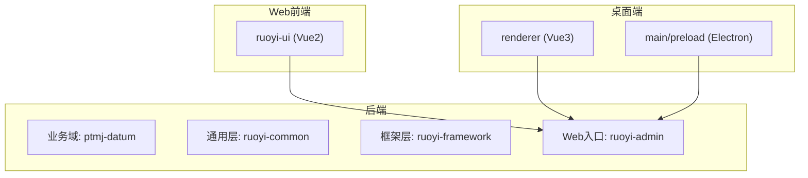
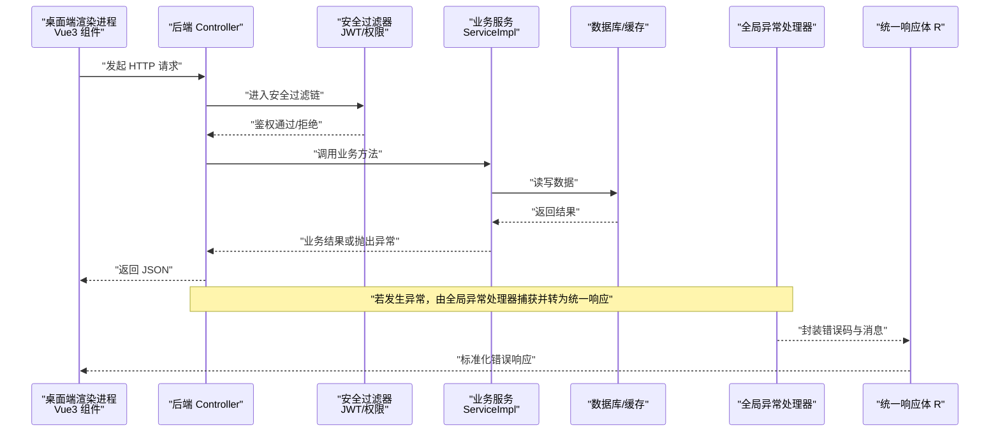
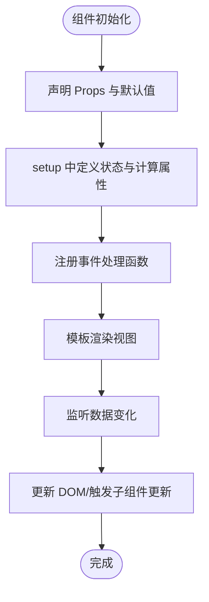
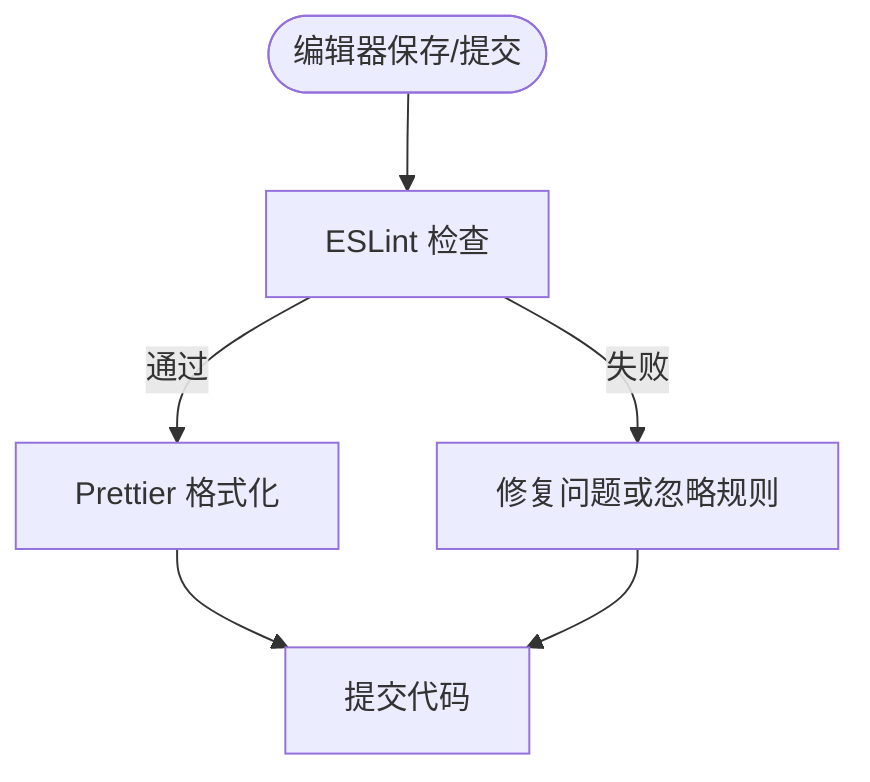
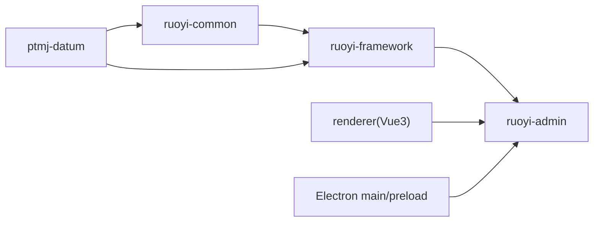

# 代码规范

<cite>
**本文引用的文件**   
- [PezMax-Backend/README.md](file://PezMax-Backend/README.md)
- [PezMax-Desktop/README.md](file://PezMax-Desktop/README.md)
- [PezMax-Desktop/eslint.config.mjs](file://PezMax-Desktop/eslint.config.mjs)
- [PezMax-Desktop/.eslintrc-auto-import.json](file://PezMax-Desktop/.eslintrc-auto-import.json)
- [PezMax-Desktop/.prettierrc.yaml](file://PezMax-Desktop/.prettierrc.yaml)
- [PezMax-Backend/ptmj-datum/src/main/java/com/ptmj/datum/domain/PtmjUser.java](file://PezMax-Backend/ptmj-datum/src/main/java/com/ptmj/datum/domain/PtmjUser.java)
- [PezMax-Backend/ptmj-datum/src/main/java/com/ptmj/datum/domain/PtmjFile.java](file://PezMax-Backend/ptmj-datum/src/main/java/com/ptmj/datum/domain/PtmjFile.java)
- [PezMax-Backend/ptmj-datum/src/main/java/com/ptmj/datum/service/impl/PtmjAuthServiceImpl.java](file://PezMax-Backend/ptmj-datum/src/main/java/com/ptmj/datum/service/impl/PtmjAuthServiceImpl.java)
- [PezMax-Backend/ruoyi-common/src/main/java/com/ruoyi/common/core/domain/R.java](file://PezMax-Backend/ruoyi-common/src/main/java/com/ruoyi/common/core/domain/R.java)
- [PezMax-Backend/ruoyi-framework/src/main/java/com/ruoyi/framework/web/exception/GlobalExceptionHandler.java](file://PezMax-Backend/ruoyi-framework/src/main/java/com/ruoyi/framework/web/exception/GlobalExceptionHandler.java)
- [PezMax-Backend/ruoyi-common/src/main/java/com/ruoyi/common/exception/ServiceException.java](file://PezMax-Backend/ruoyi-common/src/main/java/com/ruoyi/common/exception/ServiceException.java)
- [PezMax-Backend/ruoyi-common/src/main/java/com/ruoyi/common/annotation/Anonymous.java](file://PezMax-Backend/ruoyi-common/src/main/java/com/ruoyi/common/annotation/Anonymous.java)
- [PezMax-Backend/ruoyi-ui/src/components/SvgIcon/index.vue](file://PezMax-Backend/ruoyi-ui/src/components/SvgIcon/index.vue)
- [PezMax-Desktop/src/renderer/components/SvgIcon/index.vue](file://PezMax-Desktop/src/renderer/components/SvgIcon/index.vue)
</cite>

## 目录
1. [简介](#简介)
2. [项目结构](#项目结构)
3. [核心组件](#核心组件)
4. [架构总览](#架构总览)
5. [详细组件分析](#详细组件分析)
6. [依赖分析](#依赖分析)
7. [性能考虑](#性能考虑)
8. [故障排查指南](#故障排查指南)
9. [结论](#结论)
10. [附录](#附录)

## 简介
本规范旨在为 PezMax 全栈项目建立统一的编码标准，覆盖 Java、Vue 3 与 JavaScript/TypeScript 三大技术栈。内容包含命名约定、注释规范、异常处理、组件结构、Props/事件/样式组织、ESLint 与 Prettier 规则，以及 IDE 自动格式化与检查配置建议。文档同时提供“正例/反例”对照说明，帮助团队快速对齐风格并提升可维护性。

## 项目结构
本项目采用前后端分离与桌面端渲染进程的组合：
- 后端（Spring Boot）：基于 RuoYi 架构扩展，模块划分清晰，领域模型集中在 ptmj-datum，通用能力在 ruoyi-common 与 ruoyi-framework。
- Web 前端（ruoyi-ui）：传统 Vue 2 工程，作为后台管理界面。
- 桌面端（Electron + Vue 3）：渲染进程位于 src/renderer，遵循现代 Composition API 与 Vite 构建。



图表来源
- [PezMax-Backend/README.md](file://PezMax-Backend/README.md)
- [PezMax-Desktop/README.md](file://PezMax-Desktop/README.md)

章节来源
- [PezMax-Backend/README.md](file://PezMax-Backend/README.md)
- [PezMax-Desktop/README.md](file://PezMax-Desktop/README.md)

## 核心组件
本节聚焦于各语言的核心规范要点与落地位置，便于开发者快速定位参考实现。

- Java 编码规范
  - 类命名：领域实体以业务前缀+名词形式，如 PtmjUser、PtmjFile；VO/DTO 后缀明确区分用途。
  - 方法命名：动词+名词语义化，避免缩写；参数校验前置，失败快速返回。
  - 变量命名：局部变量小驼峰，常量全大写下划线分隔；布尔值使用 is/has/can 前缀。
  - 注释规范：类与方法需 Javadoc 说明职责、入参出参与异常；复杂逻辑行内注释解释“为什么”。
  - 异常处理：业务异常统一继承 ServiceException，控制器层通过全局异常处理器转换为统一响应体 R。
  - 安全注解：对外暴露接口按需标注匿名访问注解 @Anonymous，减少不必要的鉴权开销。

- Vue 3 组件开发规范（桌面端 renderer）
  - 组件结构：单文件组件按模板、脚本、样式三段式组织；优先使用 Composition API。
  - Props 定义：显式声明类型与默认值，必要时提供自定义校验函数。
  - 事件处理：事件名使用 kebab-case，回调命名 onXxx；避免在 computed 中产生副作用。
  - 样式组织：优先 scoped 样式，主题色与间距通过 CSS 变量统一管理。

- JavaScript/TypeScript 编写规范
  - ESLint：启用 Electron 官方推荐配置与 Vue 插件，关闭不兼容规则，统一全局符号。
  - Prettier：单引号、无分号、每行最大长度 100、4 空格缩进、末尾逗号 none、自动换行符。
  - 代码风格：严格类型提示，避免 any；异步操作使用 async/await；错误边界与用户提示一致。

章节来源
- [PezMax-Backend/ptmj-datum/src/main/java/com/ptmj/datum/domain/PtmjUser.java](file://PezMax-Backend/ptmj-datum/src/main/java/com/ptmj/datum/domain/PtmjUser.java)
- [PezMax-Backend/ptmj-datum/src/main/java/com/ptmj/datum/domain/PtmjFile.java](file://PezMax-Backend/ptmj-datum/src/main/java/com/ptmj/datum/domain/PtmjFile.java)
- [PezMax-Backend/ptmj-datum/src/main/java/com/ptmj/datum/service/impl/PtmjAuthServiceImpl.java](file://PezMax-Backend/ptmj-datum/src/main/java/com/ptmj/datum/service/impl/PtmjAuthServiceImpl.java)
- [PezMax-Backend/ruoyi-common/src/main/java/com/ruoyi/common/core/domain/R.java](file://PezMax-Backend/ruoyi-common/src/main/java/com/ruoyi/common/core/domain/R.java)
- [PezMax-Backend/ruoyi-common/src/main/java/com/ruoyi/common/exception/ServiceException.java](file://PezMax-Backend/ruoyi-common/src/main/java/com/ruoyi/common/exception/ServiceException.java)
- [PezMax-Backend/ruoyi-common/src/main/java/com/ruoyi/common/annotation/Anonymous.java](file://PezMax-Backend/ruoyi-common/src/main/java/com/ruoyi/common/annotation/Anonymous.java)
- [PezMax-Desktop/src/renderer/components/SvgIcon/index.vue](file://PezMax-Desktop/src/renderer/components/SvgIcon/index.vue)
- [PezMax-Desktop/eslint.config.mjs](file://PezMax-Desktop/eslint.config.mjs)
- [PezMax-Desktop/.eslintrc-auto-import.json](file://PezMax-Desktop/.eslintrc-auto-import.json)
- [PezMax-Desktop/.prettierrc.yaml](file://PezMax-Desktop/.prettierrc.yaml)

## 架构总览
下图展示从桌面端到后端的典型请求链路，体现安全拦截、异常转换与统一响应。



图表来源
- [PezMax-Backend/ruoyi-framework/src/main/java/com/ruoyi/framework/web/exception/GlobalExceptionHandler.java](file://PezMax-Backend/ruoyi-framework/src/main/java/com/ruoyi/framework/web/exception/GlobalExceptionHandler.java)
- [PezMax-Backend/ruoyi-common/src/main/java/com/ruoyi/common/core/domain/R.java](file://PezMax-Backend/ruoyi-common/src/main/java/com/ruoyi/common/core/domain/R.java)
- [PezMax-Backend/ptmj-datum/src/main/java/com/ptmj/datum/service/impl/PtmjAuthServiceImpl.java](file://PezMax-Backend/ptmj-datum/src/main/java/com/ptmj/datum/service/impl/PtmjAuthServiceImpl.java)

## 详细组件分析

### Java 编码规范细则
- 命名约定
  - 类：领域实体使用业务前缀（如 Ptmj*），VO/DTO 明确后缀（Vo/Dto）。
  - 方法：动词开头，语义清晰，避免过度抽象的短名。
  - 变量：小驼峰；布尔字段以 is/has/can 开头；常量全大写加下划线。
- 注释规范
  - 类与方法必须包含 Javadoc，说明职责、参数、返回值与可能抛出的异常。
  - 关键分支与边界条件添加行内注释，解释设计意图而非重复代码字面含义。
- 异常处理
  - 业务异常统一继承 ServiceException，携带错误码与消息。
  - 全局异常处理器将异常映射为统一响应体 R，保证前端一致性。
  - 对第三方调用进行异常包装与降级策略，避免级联失败。
- 安全与访问控制
  - 对外接口按需标注 @Anonymous，减少鉴权成本。
  - 敏感信息序列化时进行脱敏处理，避免日志泄露。

```mermaid
classDiagram
class PtmjUser {
"+字段 : 用户基本信息"
"+方法 : 基础CRUD相关"
}
class PtmjFile {
"+字段 : 文件元数据"
"+方法 : 上传/下载/预览相关"
}
class PtmjAuthServiceImpl {
"+方法 : 认证/授权逻辑"
}
class R {
"+字段 : code, msg, data"
"+静态方法 : 成功/失败封装"
}
class ServiceException {
"+字段 : errorCode, message"
"+构造 : 带错误码与消息"
}
class GlobalExceptionHandler {
"+方法 : 统一异常转R"
}
class Anonymous {
"<<注解>>"
}
PtmjUser <.. PtmjAuthServiceImpl : "被使用"
PtmjFile <.. PtmjAuthServiceImpl : "被使用"
PtmjAuthServiceImpl --> R : "返回统一响应"
GlobalExceptionHandler --> R : "封装错误响应"
PtmjAuthServiceImpl ..> Anonymous : "可选注解"
```

图表来源
- [PezMax-Backend/ptmj-datum/src/main/java/com/ptmj/datum/domain/PtmjUser.java](file://PezMax-Backend/ptmj-datum/src/main/java/com/ptmj/datum/domain/PtmjUser.java)
- [PezMax-Backend/ptmj-datum/src/main/java/com/ptmj/datum/domain/PtmjFile.java](file://PezMax-Backend/ptmj-datum/src/main/java/com/ptmj/datum/domain/PtmjFile.java)
- [PezMax-Backend/ptmj-datum/src/main/java/com/ptmj/datum/service/impl/PtmjAuthServiceImpl.java](file://PezMax-Backend/ptmj-datum/src/main/java/com/ptmj/datum/service/impl/PtmjAuthServiceImpl.java)
- [PezMax-Backend/ruoyi-common/src/main/java/com/ruoyi/common/core/domain/R.java](file://PezMax-Backend/ruoyi-common/src/main/java/com/ruoyi/common/core/domain/R.java)
- [PezMax-Backend/ruoyi-common/src/main/java/com/ruoyi/common/exception/ServiceException.java](file://PezMax-Backend/ruoyi-common/src/main/java/com/ruoyi/common/exception/ServiceException.java)
- [PezMax-Backend/ruoyi-framework/src/main/java/com/ruoyi/framework/web/exception/GlobalExceptionHandler.java](file://PezMax-Backend/ruoyi-framework/src/main/java/com/ruoyi/framework/web/exception/GlobalExceptionHandler.java)
- [PezMax-Backend/ruoyi-common/src/main/java/com/ruoyi/common/annotation/Anonymous.java](file://PezMax-Backend/ruoyi-common/src/main/java/com/ruoyi/common/annotation/Anonymous.java)

章节来源
- [PezMax-Backend/ptmj-datum/src/main/java/com/ptmj/datum/domain/PtmjUser.java](file://PezMax-Backend/ptmj-datum/src/main/java/com/ptmj/datum/domain/PtmjUser.java)
- [PezMax-Backend/ptmj-datum/src/main/java/com/ptmj/datum/domain/PtmjFile.java](file://PezMax-Backend/ptmj-datum/src/main/java/com/ptmj/datum/domain/PtmjFile.java)
- [PezMax-Backend/ptmj-datum/src/main/java/com/ptmj/datum/service/impl/PtmjAuthServiceImpl.java](file://PezMax-Backend/ptmj-datum/src/main/java/com/ptmj/datum/service/impl/PtmjAuthServiceImpl.java)
- [PezMax-Backend/ruoyi-common/src/main/java/com/ruoyi/common/core/domain/R.java](file://PezMax-Backend/ruoyi-common/src/main/java/com/ruoyi/common/core/domain/R.java)
- [PezMax-Backend/ruoyi-common/src/main/java/com/ruoyi/common/exception/ServiceException.java](file://PezMax-Backend/ruoyi-common/src/main/java/com/ruoyi/common/exception/ServiceException.java)
- [PezMax-Backend/ruoyi-framework/src/main/java/com/ruoyi/framework/web/exception/GlobalExceptionHandler.java](file://PezMax-Backend/ruoyi-framework/src/main/java/com/ruoyi/framework/web/exception/GlobalExceptionHandler.java)
- [PezMax-Backend/ruoyi-common/src/main/java/com/ruoyi/common/annotation/Anonymous.java](file://PezMax-Backend/ruoyi-common/src/main/java/com/ruoyi/common/annotation/Anonymous.java)

### Vue 3 组件开发规范细则
- 组件结构
  - 单文件组件按模板、脚本、样式三段式组织；保持单一职责。
  - 使用 defineComponent 包裹组件，利于类型推导与工具支持。
- Props 定义
  - 显式声明类型与默认值，必要时提供自定义校验函数。
  - 避免直接修改 props，通过事件向上通知变更。
- 事件处理
  - 事件名使用 kebab-case；回调命名 onXxx；避免在 computed 中产生副作用。
- 样式组织
  - 优先 scoped 样式；主题色、字号、间距通过 CSS 变量统一管理。
  - 复杂布局使用 Flex/Grid，避免深层嵌套。



图表来源
- [PezMax-Desktop/src/renderer/components/SvgIcon/index.vue](file://PezMax-Desktop/src/renderer/components/SvgIcon/index.vue)

章节来源
- [PezMax-Desktop/src/renderer/components/SvgIcon/index.vue](file://PezMax-Desktop/src/renderer/components/SvgIcon/index.vue)

### JavaScript/TypeScript 编写规范细则
- ESLint 配置
  - 使用 Electron 官方推荐配置与 Vue 插件；针对 .vue 文件启用 vue-eslint-parser。
  - 关闭与 Prettier 冲突的规则，统一全局符号（来自 auto-import 配置）。
- Prettier 规则
  - 单引号、无分号、每行最大长度 100、4 空格缩进、末尾逗号 none、自动换行符。
- 代码风格要求
  - 严格类型提示，避免 any；异步操作使用 async/await；错误边界与用户提示一致。
  - 模块化拆分，避免单文件过大；公共逻辑抽取至 utils。



图表来源
- [PezMax-Desktop/eslint.config.mjs](file://PezMax-Desktop/eslint.config.mjs)
- [PezMax-Desktop/.eslintrc-auto-import.json](file://PezMax-Desktop/.eslintrc-auto-import.json)
- [PezMax-Desktop/.prettierrc.yaml](file://PezMax-Desktop/.prettierrc.yaml)

章节来源
- [PezMax-Desktop/eslint.config.mjs](file://PezMax-Desktop/eslint.config.mjs)
- [PezMax-Desktop/.eslintrc-auto-import.json](file://PezMax-Desktop/.eslintrc-auto-import.json)
- [PezMax-Desktop/.prettierrc.yaml](file://PezMax-Desktop/.prettierrc.yaml)

### 正例与反例对照（示例路径）
- Java
  - 正例：领域实体类命名与字段语义清晰，方法具备 Javadoc 与参数校验。
    - 参考路径：[PtmjUser.java](file://PezMax-Backend/ptmj-datum/src/main/java/com/ptmj/datum/domain/PtmjUser.java)、[PtmjFile.java](file://PezMax-Backend/ptmj-datum/src/main/java/com/ptmj/datum/domain/PtmjFile.java)
  - 反例：方法过长且无注释、异常随意抛出未统一封装。
    - 改进建议：拆分方法、补充 Javadoc、使用 ServiceException 与 R 统一响应。
- Vue 3
  - 正例：defineComponent 包裹、Props 显式声明、事件命名规范。
    - 参考路径：[SvgIcon/index.vue（桌面端）](file://PezMax-Desktop/src/renderer/components/SvgIcon/index.vue)
  - 反例：computed 中产生副作用、直接修改 props。
    - 改进建议：使用 watch 或事件机制，保持单向数据流。
- JS/TS
  - 正例：ESLint 与 Prettier 协同工作，规则一致，自动格式化。
    - 参考路径：[eslint.config.mjs](file://PezMax-Desktop/eslint.config.mjs)、[.prettierrc.yaml](file://PezMax-Desktop/.prettierrc.yaml)
  - 反例：混用双引号与分号、缩进不一致。
    - 改进建议：遵循 Prettier 配置，IDE 开启保存时格式化。

章节来源
- [PezMax-Backend/ptmj-datum/src/main/java/com/ptmj/datum/domain/PtmjUser.java](file://PezMax-Backend/ptmj-datum/src/main/java/com/ptmj/datum/domain/PtmjUser.java)
- [PezMax-Backend/ptmj-datum/src/main/java/com/ptmj/datum/domain/PtmjFile.java](file://PezMax-Backend/ptmj-datum/src/main/java/com/ptmj/datum/domain/PtmjFile.java)
- [PezMax-Desktop/src/renderer/components/SvgIcon/index.vue](file://PezMax-Desktop/src/renderer/components/SvgIcon/index.vue)
- [PezMax-Desktop/eslint.config.mjs](file://PezMax-Desktop/eslint.config.mjs)
- [PezMax-Desktop/.prettierrc.yaml](file://PezMax-Desktop/.prettierrc.yaml)

## 依赖分析
- 组件耦合与内聚
  - 后端：业务域 ptmj-datum 依赖通用层 ruoyi-common 与框架层 ruoyi-framework，职责清晰、内聚度高。
  - 前端：桌面端 renderer 与 Electron main/preload 解耦，通过 IPC 通信；Web 前端 ruoyi-ui 独立部署。
- 外部依赖与集成点
  - Spring Security、JWT、Redis、MinIO、LibreOffice 等基础设施在后端集中配置。
  - 桌面端使用 Vite 构建，ESLint 与 Prettier 作为开发期工具。



图表来源
- [PezMax-Backend/README.md](file://PezMax-Backend/README.md)
- [PezMax-Desktop/README.md](file://PezMax-Desktop/README.md)

章节来源
- [PezMax-Backend/README.md](file://PezMax-Backend/README.md)
- [PezMax-Desktop/README.md](file://PezMax-Desktop/README.md)

## 性能考虑
- 后端
  - 合理分页与索引优化，避免 N+1 查询；热点数据使用 Redis 缓存。
  - 文件上传采用分片与断点续传，降低超时风险。
- 前端
  - 组件懒加载与路由懒加载，减少首屏体积。
  - 图片与 SVG 资源压缩与缓存策略，提升渲染速度。
- 桌面端
  - 主进程与渲染进程职责分离，避免阻塞 UI 线程。
  - IPC 通信批量传输，减少频繁往返。

## 故障排查指南
- 统一异常处理
  - 业务异常应继承 ServiceException，携带错误码与消息；全局异常处理器将其转换为统一响应体 R，确保前端一致的错误展示。
- 常见问题定位
  - 登录/鉴权失败：检查 JWT 过滤器与安全配置；确认 @Anonymous 注解使用范围。
  - 文件上传失败：核对 MinIO 桶策略与网络连通性；查看服务端日志与错误码。
  - 前端报错：打开浏览器控制台与 Network 面板，结合后端统一响应体定位错误原因。

章节来源
- [PezMax-Backend/ruoyi-common/src/main/java/com/ruoyi/common/exception/ServiceException.java](file://PezMax-Backend/ruoyi-common/src/main/java/com/ruoyi/common/exception/ServiceException.java)
- [PezMax-Backend/ruoyi-framework/src/main/java/com/ruoyi/framework/web/exception/GlobalExceptionHandler.java](file://PezMax-Backend/ruoyi-framework/src/main/java/com/ruoyi/framework/web/exception/GlobalExceptionHandler.java)
- [PezMax-Backend/ruoyi-common/src/main/java/com/ruoyi/common/core/domain/R.java](file://PezMax-Backend/ruoyi-common/src/main/java/com/ruoyi/common/core/domain/R.java)
- [PezMax-Backend/ruoyi-common/src/main/java/com/ruoyi/common/annotation/Anonymous.java](file://PezMax-Backend/ruoyi-common/src/main/java/com/ruoyi/common/annotation/Anonymous.java)

## 结论
通过统一的 Java、Vue 3 与 JS/TS 编码规范，配合 ESLint 与 Prettier 的自动化检查与格式化，可有效提升代码质量与团队协作效率。建议在 IDE 中启用保存时自动格式化与实时检查，并在 CI 流程中加入 lint 与 build 步骤，确保规范落地。

## 附录
- IDE 自动格式化与检查建议
  - VS Code
    - 安装 ESLint、Prettier、Vetur/Volar 插件。
    - 设置保存时运行 ESLint 与 Prettier；禁用编辑器自带格式化以避免冲突。
    - 启用 .editorconfig 与项目根配置，保持一致风格。
  - IntelliJ IDEA / WebStorm
    - 启用 ESLint 与 Prettier 插件；配置保存时自动格式化。
    - 导入项目 Prettier 配置，确保与命令行行为一致。
- 配置文件参考路径
  - ESLint 配置：[eslint.config.mjs](file://PezMax-Desktop/eslint.config.mjs)
  - 全局符号：[.eslintrc-auto-import.json](file://PezMax-Desktop/.eslintrc-auto-import.json)
  - Prettier 规则：[.prettierrc.yaml](file://PezMax-Desktop/.prettierrc.yaml)