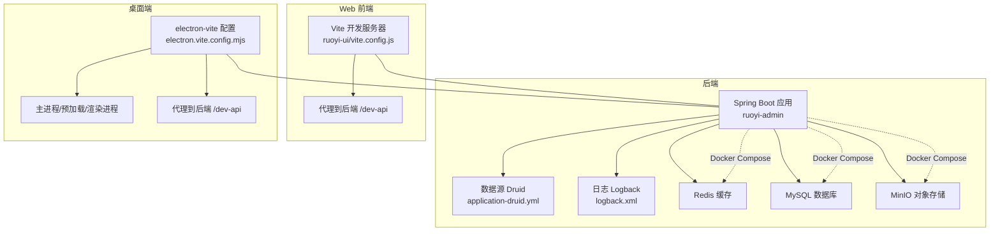
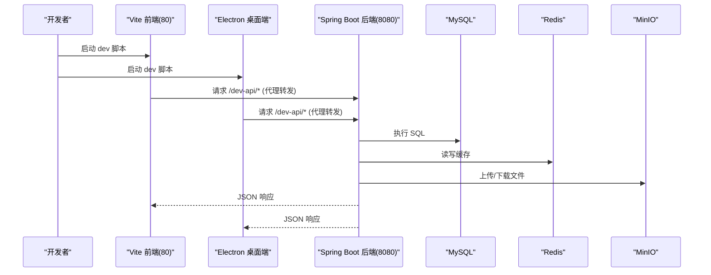
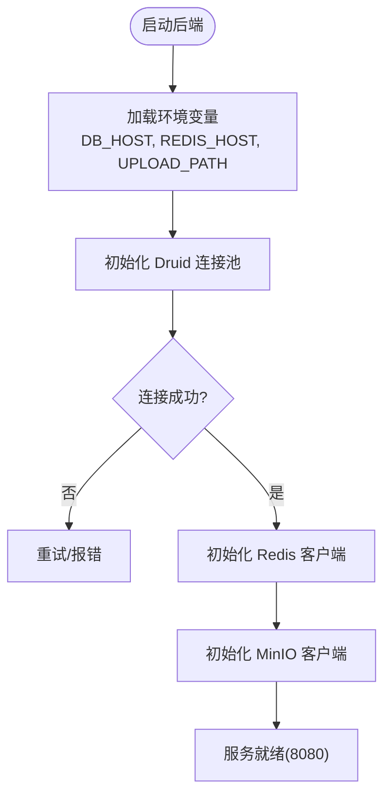
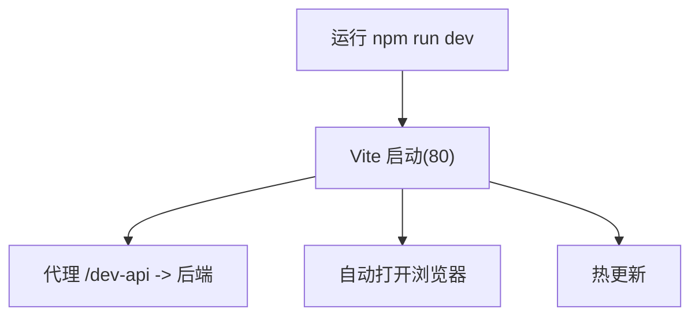
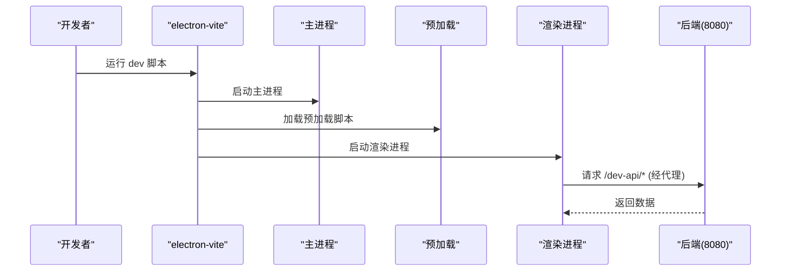
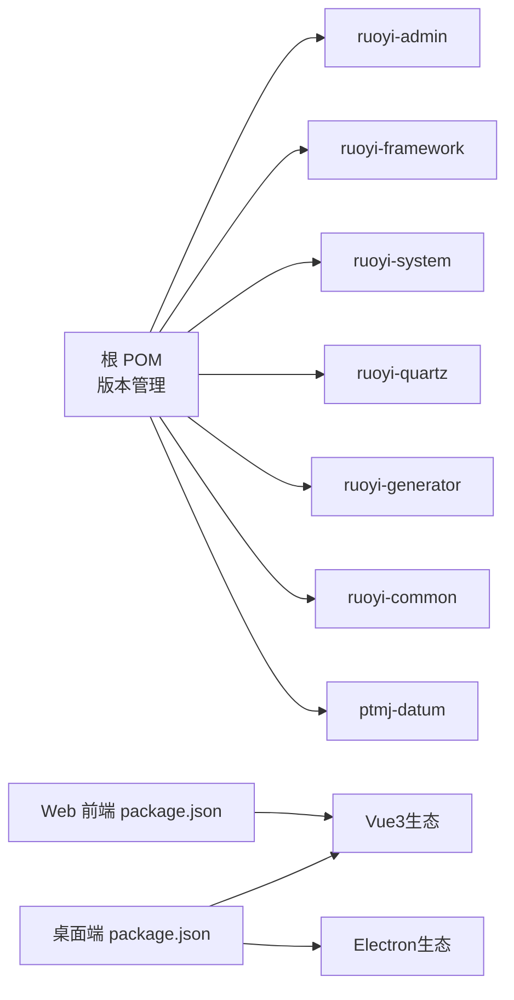

# 开发工具配置

<cite>
**本文引用的文件**   
- [pom.xml](file://PezMax-Backend/pom.xml)
- [application.yml](file://PezMax-Backend/ruoyi-admin/src/main/resources/application.yml)
- [application-druid.yml](file://PezMax-Backend/ruoyi-admin/src/main/resources/application-druid.yml)
- [logback.xml](file://PezMax-Backend/ruoyi-admin/src/main/resources/logback.xml)
- [compose.yaml](file://PezMax-Backend/compose.yaml)
- [vite.config.js](file://PezMax-Backend/ruoyi-ui/vite.config.js)
- [package.json（Web前端）](file://PezMax-Backend/ruoyi-ui/package.json)
- [electron.vite.config.mjs](file://PezMax-Desktop/electron.vite.config.mjs)
- [package.json（桌面端）](file://PezMax-Desktop/package.json)
</cite>

## 目录
1. [简介](#简介)
2. [项目结构](#项目结构)
3. [核心组件](#核心组件)
4. [架构总览](#架构总览)
5. [详细组件分析](#详细组件分析)
6. [依赖关系分析](#依赖关系分析)
7. [性能考虑](#性能考虑)
8. [故障排查指南](#故障排查指南)
9. [结论](#结论)
10. [附录](#附录)

## 简介
本文件面向开发者，提供 PezMax-One 项目的本地开发与调试环境配置与优化指南。内容覆盖：
- IDE 推荐与插件建议（IntelliJ IDEA、VS Code）
- 构建与依赖管理（Maven、npm、Vite/Electron-Vite）
- 环境变量与日志级别设置
- 后端断点调试、前端调试、Electron 进程调试方法
- 性能分析与内存泄漏检测
- 开发服务器优化与实用技巧

## 项目结构
本项目采用前后端分离 + Electron 桌面端的组合：
- 后端：基于 Spring Boot 的若依框架多模块工程（Maven），包含 admin、framework、system、quartz、generator、common、ptmj-datum 等模块
- Web 前端：Vue3 + Vite（位于 ruoyi-ui）
- 桌面端：Electron + Vue3 + electron-vite（位于 PezMax-Desktop）

图表来源
- [application.yml:1-162](file://PezMax-Backend/ruoyi-admin/src/main/resources/application.yml#L1-L162)
- [application-druid.yml:1-62](file://PezMax-Backend/ruoyi-admin/src/main/resources/application-druid.yml#L1-L62)
- [logback.xml:1-99](file://PezMax-Backend/ruoyi-admin/src/main/resources/logback.xml#L1-L99)
- [compose.yaml:1-84](file://PezMax-Backend/compose.yaml#L1-L84)
- [vite.config.js:1-80](file://PezMax-Backend/ruoyi-ui/vite.config.js#L1-L80)
- [electron.vite.config.mjs:1-121](file://PezMax-Desktop/electron.vite.config.mjs#L1-L121)

章节来源
- [pom.xml:1-234](file://PezMax-Backend/pom.xml#L1-L234)
- [application.yml:1-162](file://PezMax-Backend/ruoyi-admin/src/main/resources/application.yml#L1-L162)
- [application-druid.yml:1-62](file://PezMax-Backend/ruoyi-admin/src/main/resources/application-druid.yml#L1-L62)
- [logback.xml:1-99](file://PezMax-Backend/ruoyi-admin/src/main/resources/logback.xml#L1-L99)
- [compose.yaml:1-84](file://PezMax-Backend/compose.yaml#L1-L84)
- [vite.config.js:1-80](file://PezMax-Backend/ruoyi-ui/vite.config.js#L1-L80)
- [electron.vite.config.mjs:1-121](file://PezMax-Desktop/electron.vite.config.mjs#L1-L121)

## 核心组件
- 后端服务
  - 启动入口与模块：通过 Maven 聚合模块打包运行，默认端口 8080
  - 数据源：Druid 连接池，支持主从开关与监控面板
  - 缓存：Redis（Lettuce 客户端）
  - 对象存储：MinIO
  - 文档接口：SpringDoc/Swagger UI
  - 日志：Logback 按级别输出至控制台与文件
- Web 前端
  - Vite 开发服务器，端口 80，开启热更新
  - 代理 /dev-api 到后端地址，便于跨域调试
- 桌面端
  - electron-vite 统一构建 main/preload/renderer
  - 内置代理 /dev-api 与 /v3/api-docs 到后端
  - 支持多模式构建（client/admin）与环境变量注入

章节来源
- [application.yml:1-162](file://PezMax-Backend/ruoyi-admin/src/main/resources/application.yml#L1-L162)
- [application-druid.yml:1-62](file://PezMax-Backend/ruoyi-admin/src/main/resources/application-druid.yml#L1-L62)
- [logback.xml:1-99](file://PezMax-Backend/ruoyi-admin/src/main/resources/logback.xml#L1-L99)
- [vite.config.js:1-80](file://PezMax-Backend/ruoyi-ui/vite.config.js#L1-L80)
- [electron.vite.config.mjs:1-121](file://PezMax-Desktop/electron.vite.config.mjs#L1-L121)

## 架构总览
下图展示了开发环境下各组件交互关系与关键配置位置。

图表来源
- [vite.config.js:44-61](file://PezMax-Backend/ruoyi-ui/vite.config.js#L44-L61)
- [electron.vite.config.mjs:71-86](file://PezMax-Desktop/electron.vite.config.mjs#L71-L86)
- [application.yml:17-33](file://PezMax-Backend/ruoyi-admin/src/main/resources/application.yml#L17-L33)
- [application-druid.yml:1-62](file://PezMax-Backend/ruoyi-admin/src/main/resources/application-druid.yml#L1-L62)
- [compose.yaml:1-84](file://PezMax-Backend/compose.yaml#L1-L84)

## 详细组件分析

### 后端（Spring Boot + Maven）
- 构建与依赖
  - 使用 Maven 多模块管理，统一版本在根 pom.xml 中声明
  - 仓库指向阿里云镜像以提升拉取速度
- 运行与配置
  - 默认端口 8080，上下文路径 /
  - Redis 主机可通过环境变量 REDIS_HOST 覆盖
  - MinIO 地址、桶名、凭据在 application.yml 中配置
  - 日志级别在 application.yml 与 logback.xml 共同控制
- 数据源与监控
  - Druid 主库 URL 通过 DB_HOST 环境变量注入
  - 启用 StatViewServlet 与慢 SQL 记录，便于定位问题
- 容器化
  - compose.yaml 编排 MySQL、Redis、MinIO 与服务自身，健康检查保障启动顺序

图表来源
- [application.yml:71-94](file://PezMax-Backend/ruoyi-admin/src/main/resources/application.yml#L71-L94)
- [application-druid.yml:1-62](file://PezMax-Backend/ruoyi-admin/src/main/resources/application-druid.yml#L1-L62)
- [compose.yaml:55-79](file://PezMax-Backend/compose.yaml#L55-L79)

章节来源
- [pom.xml:1-234](file://PezMax-Backend/pom.xml#L1-L234)
- [application.yml:1-162](file://PezMax-Backend/ruoyi-admin/src/main/resources/application.yml#L1-L162)
- [application-druid.yml:1-62](file://PezMax-Backend/ruoyi-admin/src/main/resources/application-druid.yml#L1-L62)
- [logback.xml:1-99](file://PezMax-Backend/ruoyi-admin/src/main/resources/logback.xml#L1-L99)
- [compose.yaml:1-84](file://PezMax-Backend/compose.yaml#L1-L84)

### Web 前端（Vue3 + Vite）
- 开发服务器
  - 端口 80，自动打开浏览器
  - 代理 /dev-api 到后端 baseUrl，并透传 Swagger 文档路径
- 构建产物
  - 输出目录 dist，资源目录 assets，开启内联 sourcemap（开发）
- 依赖管理
  - package.json 定义运行时与开发时依赖，scripts 提供 dev/build/preview

图表来源
- [vite.config.js:44-61](file://PezMax-Backend/ruoyi-ui/vite.config.js#L44-L61)
- [package.json（Web前端）:1-55](file://PezMax-Backend/ruoyi-ui/package.json#L1-L55)

章节来源
- [vite.config.js:1-80](file://PezMax-Backend/ruoyi-ui/vite.config.js#L1-L80)
- [package.json（Web前端）:1-55](file://PezMax-Backend/ruoyi-ui/package.json#L1-L55)

### 桌面端（Electron + electron-vite）
- 开发模式
  - 通过 electron-vite dev 启动，支持 client/admin 两种认证入口模式
  - 代理 /dev-api 与 /v3/api-docs 到后端
- 构建与打包
  - 支持 unpack 与多平台打包脚本
  - 输出目录 out/renderer，资源目录 assets
- 环境变量
  - 通过 VITE_AUTH_ENTRY_MODE 切换入口；VITE_APP_TARGET_URL 可指定后端地址

图表来源
- [electron.vite.config.mjs:11-86](file://PezMax-Desktop/electron.vite.config.mjs#L11-L86)
- [package.json（桌面端）:1-78](file://PezMax-Desktop/package.json#L1-L78)

章节来源
- [electron.vite.config.mjs:1-121](file://PezMax-Desktop/electron.vite.config.mjs#L1-L121)
- [package.json（桌面端）:1-78](file://PezMax-Desktop/package.json#L1-L78)

## 依赖关系分析
- Maven 依赖
  - 根 pom.xml 统一管理 Spring Boot、MyBatis、Druid、Fastjson2、JWT、SpringDoc 等版本
  - 模块依赖包括 framework、system、quartz、generator、common、ptmj-datum
- 前端依赖
  - Web 前端与桌面端均使用 Vue3、Element Plus、Pinia、Axios、ECharts 等
  - 桌面端额外引入 sql.js、electron-updater 等能力

图表来源
- [pom.xml:1-234](file://PezMax-Backend/pom.xml#L1-L234)
- [package.json（Web前端）:1-55](file://PezMax-Backend/ruoyi-ui/package.json#L1-L55)
- [package.json（桌面端）:1-78](file://PezMax-Desktop/package.json#L1-L78)

章节来源
- [pom.xml:1-234](file://PezMax-Backend/pom.xml#L1-L234)
- [package.json（Web前端）:1-55](file://PezMax-Backend/ruoyi-ui/package.json#L1-L55)
- [package.json（桌面端）:1-78](file://PezMax-Desktop/package.json#L1-L78)

## 性能考虑
- 后端
  - Tomcat 线程池：max/min-spare 已配置，可根据压测结果调整
  - Druid 连接池：initialSize/minIdle/maxActive 可按并发量调优
  - Redis 连接池：min-idle/max-active 根据热点访问场景调整
  - 日志级别：开发阶段 debug，生产建议 info/warn
- 前端
  - Vite 开发服务器保持默认即可，按需开启 gzip 压缩插件（已在 Electron 配置中启用）
  - 大体积资源分包策略由 rollupOptions 控制 chunk 命名与大小告警阈值
- 桌面端
  - 仅构建时启用压缩，避免影响开发体验
  - 合理拆分路由与组件，减少首屏包体

[本节为通用指导，不直接分析具体文件]

## 故障排查指南
- 后端无法连接数据库
  - 检查环境变量 DB_HOST 是否正确，或 application-druid.yml 中的 url 是否匹配
  - 确认 Docker Compose 中 mysql 服务健康状态与端口映射
- 缓存不可用
  - 检查 REDIS_HOST 与端口，确保 Redis 服务可用
- 文件上传失败
  - 校验 MinIO 地址、桶名与凭据，确认 minio 服务健康
- 日志无输出或滚动失败
  - 检查 logback.xml 的日志目录权限与磁盘空间
  - 确认日志文件未被占用，避免跨文件系统重命名失败
- 前端代理无效
  - 确认 vite.config.js 中 baseUrl 与后端实际端口一致
  - 检查请求路径是否以 /dev-api 开头
- 桌面端代理无效
  - 检查 electron.vite.config.mjs 的 proxy 配置与 VITE_APP_TARGET_URL

章节来源
- [application-druid.yml:1-62](file://PezMax-Backend/ruoyi-admin/src/main/resources/application-druid.yml#L1-L62)
- [application.yml:71-94](file://PezMax-Backend/ruoyi-admin/src/main/resources/application.yml#L71-L94)
- [logback.xml:1-99](file://PezMax-Backend/ruoyi-admin/src/main/resources/logback.xml#L1-L99)
- [vite.config.js:44-61](file://PezMax-Backend/ruoyi-ui/vite.config.js#L44-L61)
- [electron.vite.config.mjs:71-86](file://PezMax-Desktop/electron.vite.config.mjs#L71-L86)
- [compose.yaml:1-84](file://PezMax-Backend/compose.yaml#L1-L84)

## 结论
通过统一的依赖管理与清晰的配置文件，本项目可在本地快速搭建后端、Web 前端与桌面端开发环境。结合合理的日志与监控配置、完善的代理与调试手段，能够显著提升开发与排障效率。建议在团队内共享本文档的环境变量与脚本约定，确保一致性。

## 附录

### IDE 与插件推荐
- IntelliJ IDEA
  - Lombok（如使用注解处理器）
  - MyBatisX（增强 Mapper/XML 导航与提示）
  - RestfulToolkit 或 Spring Assistant（辅助 REST 调试与项目创建）
  - Alibaba Java Coding Guidelines（代码规范扫描）
  - Maven Helper（依赖冲突分析）
- VS Code
  - Extension Pack for Java
  - Spring Boot Extension Pack
  - Vue - Official（语法高亮与智能提示）
  - ESLint、Prettier（代码风格统一）
  - GitLens（Git 增强）
  - Error Lens（行内错误提示）

[本节为通用建议，不直接分析具体文件]

### 环境变量与日志级别
- 后端环境变量
  - DB_HOST：MySQL 主机名或 IP
  - REDIS_HOST：Redis 主机名或 IP
  - UPLOAD_PATH：文件上传目录
  - JAVA_OPTS：JVM 参数（如堆大小）
- 前端环境变量
  - VITE_APP_ENV：构建环境标识
  - VITE_APP_TARGET_URL：后端基础地址（桌面端优先读取）
- 日志级别
  - application.yml 中 logging.level 控制包级别
  - logback.xml 中 root/logger 进一步细化输出目标与级别

章节来源
- [application.yml:34-39](file://PezMax-Backend/ruoyi-admin/src/main/resources/application.yml#L34-L39)
- [logback.xml:80-99](file://PezMax-Backend/ruoyi-admin/src/main/resources/logback.xml#L80-L99)
- [electron.vite.config.mjs:11-17](file://PezMax-Desktop/electron.vite.config.mjs#L11-L17)

### 构建与脚本
- 后端（Maven）
  - 清理与打包：mvn clean install
  - 运行：mvn spring-boot:run 或通过 IDE 启动 RuoYiApplication
- Web 前端（Vite）
  - 开发：npm run dev
  - 预览：npm run preview
- 桌面端（electron-vite）
  - 开发：npm run dev（默认 client 模式）
  - 构建：npm run build
  - 打包：npm run build:win / mac / linux

章节来源
- [package.json（Web前端）:8-13](file://PezMax-Backend/ruoyi-ui/package.json#L8-L13)
- [package.json（桌面端）:8-27](file://PezMax-Desktop/package.json#L8-L27)

### 调试技巧
- 后端断点调试
  - 在 IDE 中以 Debug 模式运行主类，设置断点后触发对应接口即可进入
  - 结合 Druid StatView 与慢 SQL 日志定位数据库瓶颈
- 前端调试
  - 使用浏览器开发者工具进行网络与源码调试
  - 利用 Vite 热更新即时验证修改
- Electron 进程调试
  - 主进程：在 IDE 中附加到 electron 进程或使用 --inspect 参数
  - 渲染进程：使用 Chrome DevTools 打开渲染页面进行调试
  - 预加载脚本：在渲染进程上下文中通过断点调试

[本节为通用指导，不直接分析具体文件]

### 性能分析与内存泄漏检测
- 后端
  - JVM 参数：-XX:+HeapDumpOnOutOfMemoryError -XX:HeapDumpPath=/home/ruoyi/logs
  - 工具：VisualVM、JProfiler、Arthas（在线诊断）
  - 指标：关注 GC 次数、堆使用率、线程阻塞情况
- 前端/桌面端
  - 使用 Chrome Performance/Memory 面板录制快照，查找未释放引用
  - 针对大列表/图片等资源，实施懒加载与去抖节流

[本节为通用指导，不直接分析具体文件]