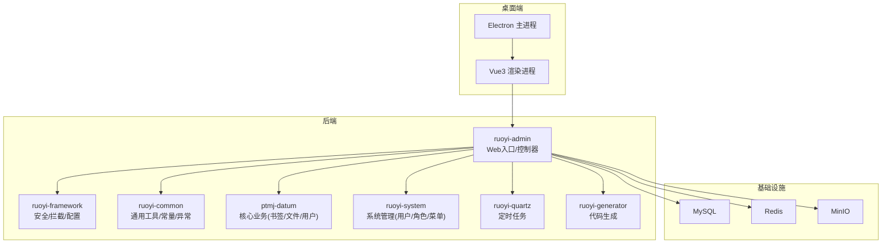
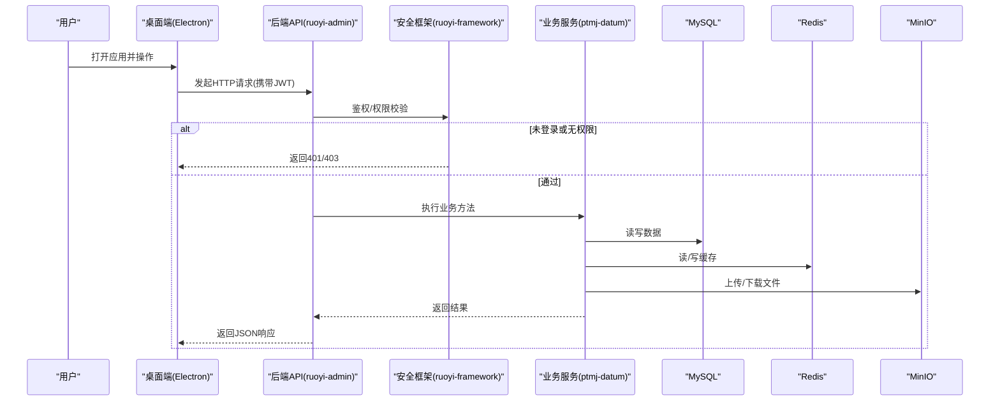
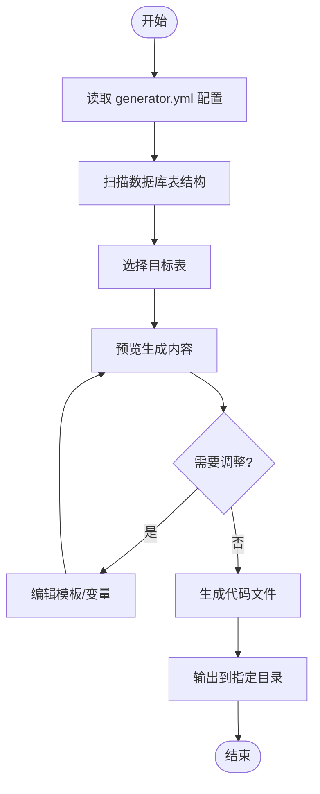
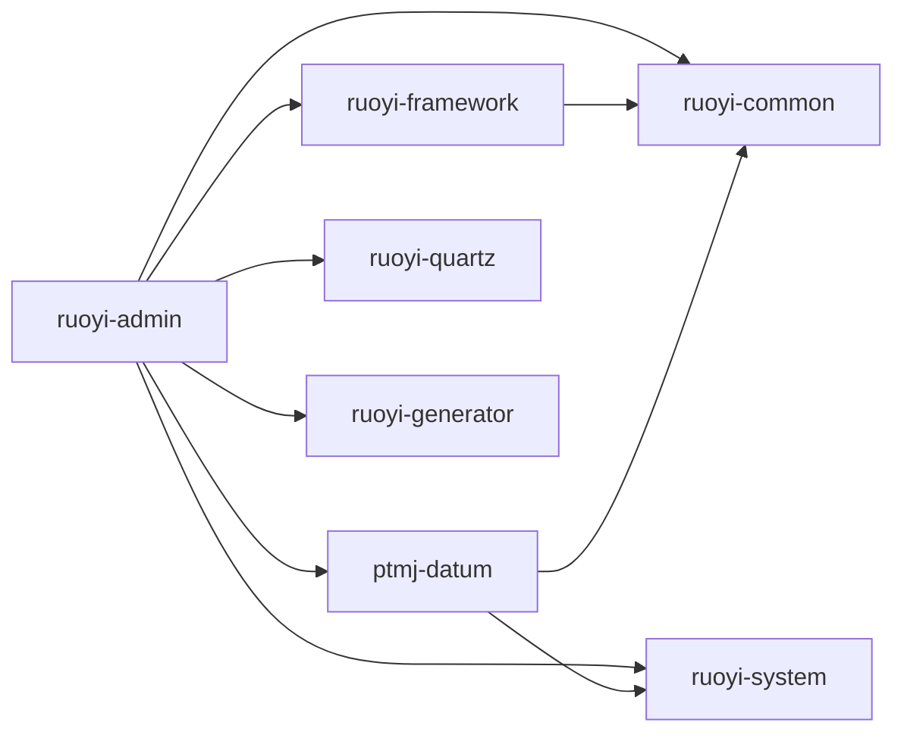

# 开发规范与工具

<cite>
**本文引用的文件**   
- [PezMax-Backend/README.md](file://PezMax-Backend/README.md)
- [PezMax-Desktop/README.md](file://PezMax-Desktop/README.md)
- [PezMax-Backend/pom.xml](file://PezMax-Backend/pom.xml)
- [PezMax-Backend/compose.yaml](file://PezMax-Backend/compose.yaml)
- [PezMax-Backend/Dockerfile](file://PezMax-Backend/Dockerfile)
- [PezMax-Backend/.github/workflows/FUNDING.yml](file://PezMax-Backend/.github/workflows/FUNDING.yml)
- [PezMax-Backend/ruoyi-admin/src/main/resources/application.yml](file://PezMax-Backend/ruoyi-admin/src/main/resources/application.yml)
- [PezMax-Backend/ruoyi-admin/src/main/resources/application-druid.yml](file://PezMax-Backend/ruoyi-admin/src/main/resources/application-druid.yml)
- [PezMax-Backend/ruoyi-framework/src/main/java/com/ruoyi/framework/config/SecurityConfig.java](file://PezMax-Backend/ruoyi-framework/src/main/java/com/ruoyi/framework/config/SecurityConfig.java)
- [PezMax-Backend/ruoyi-common/src/main/java/com/ruoyi/common/annotation/Anonymous.java](file://PezMax-Backend/ruoyi-common/src/main/java/com/ruoyi/common/annotation/Anonymous.java)
- [PezMax-Backend/ptmj-datum/src/main/java/com/ptmj/datum/domain/PtmjUser.java](file://PezMax-Backend/ptmj-datum/src/main/java/com/ptmj/datum/domain/PtmjUser.java)
- [PezMax-Backend/ptmj-datum/src/main/java/com/ptmj/datum/mapper/PtmjUserMapper.java](file://PezMax-Backend/ptmj-datum/src/main/java/com/ptmj/datum/mapper/PtmjUserMapper.java)
- [PezMax-Backend/ptmj-datum/src/main/java/com/ptmj/datum/service/IPtmjUserService.java](file://PezMax-Backend/ptmj-datum/src/main/java/com/ptmj/datum/service/IPtmjUserService.java)
- [PezMax-Backend/ruoyi-generator/src/main/resources/generator.yml](file://PezMax-Backend/ruoyi-generator/src/main/resources/generator.yml)
- [PezMax-Backend/ruoyi-generator/src/main/java/com/ruoyi/generator/controller/GenController.java](file://PezMax-Backend/ruoyi-generator/src/main/java/com/ruoyi/generator/controller/GenController.java)
- [PezMax-Backend/ruoyi-generator/src/main/java/com/ruoyi/generator/util/VelocityUtils.java](file://PezMax-Backend/ruoyi-generator/src/main/java/com/ruoyi/generator/util/VelocityUtils.java)
- [PezMax-Backend/sql/pezmax.sql](file://PezMax-Backend/sql/pezmax.sql)
- [PezMax-Backend/ruoyi-ui/package.json](file://PezMax-Backend/ruoyi-ui/package.json)
- [PezMax-Desktop/package.json](file://PezMax-Desktop/package.json)
- [PezMax-Desktop/eslint.config.mjs](file://PezMax-Desktop/eslint.config.mjs)
- [PezMax-Desktop/.prettierrc.yaml](file://PezMax-Desktop/.prettierrc.yaml)
- [PezMax-Desktop/electron.vite.config.mjs](file://PezMax-Desktop/electron.vite.config.mjs)
</cite>

## 目录
1. [简介](#简介)
2. [项目结构](#项目结构)
3. [核心组件](#核心组件)
4. [架构总览](#架构总览)
5. [详细组件分析](#详细组件分析)
6. [依赖分析](#依赖分析)
7. [性能考虑](#性能考虑)
8. [故障排查指南](#故障排查指南)
9. [结论](#结论)
10. [附录](#附录)

## 简介
本文件旨在为 PezMax 项目建立统一的开发规范与工具链配置，覆盖后端 Java、前端 Vue 3/JS/TS、Git 工作流、IDE 与插件、代码生成器、测试与持续集成等。文档基于仓库现有结构与配置进行梳理，确保可落地执行。

## 项目结构
本项目采用前后端分离与多模块组织：
- 后端（Spring Boot + RuoYi）：按业务域与通用能力拆分为多个 Maven 模块，提供 API、权限、缓存、对象存储、定时任务与代码生成能力。
- 桌面端（Electron + Vue 3 + Vite）：主进程负责窗口与 IPC，渲染进程承载 UI，通过预加载脚本桥接安全能力。
- 基础设施：Docker Compose 一键拉起 MySQL、Redis、MinIO 与后端服务；SQL 脚本用于初始化数据库。

图表来源
- [PezMax-Backend/README.md:76-89](file://PezMax-Backend/README.md#L76-L89)
- [PezMax-Backend/compose.yaml](file://PezMax-Backend/compose.yaml)

章节来源
- [PezMax-Backend/README.md:76-89](file://PezMax-Backend/README.md#L76-L89)
- [PezMax-Desktop/README.md:80-94](file://PezMax-Desktop/README.md#L80-L94)

## 核心组件
- 后端
  - 应用入口与控制器：位于 ruoyi-admin，暴露 REST API。
  - 框架层：ruoyi-framework 提供 Spring Security、过滤器、线程池、数据源切换、全局异常处理等。
  - 公共层：ruoyi-common 提供通用实体、分页、工具类、注解、异常体系等。
  - 业务域：ptmj-datum 实现书签、文件、通知、报告等核心业务。
  - 系统管理：ruoyi-system 提供用户、角色、菜单、字典等基础能力。
  - 定时任务：ruoyi-quartz 提供任务调度与日志。
  - 代码生成：ruoyi-generator 支持根据表结构生成 Entity/Mapper/Service/Controller/Vue/JS/TS/XML 等模板。
- 桌面端
  - Electron 主进程：窗口管理、IPC、自动更新。
  - 渲染进程：Vue 3 + Element Plus + Pinia + Vite，封装 API 调用与页面逻辑。
- 基础设施
  - Docker Compose 编排 MySQL、Redis、MinIO 与后端服务。
  - SQL 脚本完成数据库初始化。

章节来源
- [PezMax-Backend/README.md:13-22](file://PezMax-Backend/README.md#L13-L22)
- [PezMax-Backend/README.md:76-89](file://PezMax-Backend/README.md#L76-L89)
- [PezMax-Desktop/README.md:42-54](file://PezMax-Desktop/README.md#L42-L54)
- [PezMax-Desktop/README.md:80-94](file://PezMax-Desktop/README.md#L80-L94)

## 架构总览
下图展示从桌面端到后端的请求链路及关键组件交互。

图表来源
- [PezMax-Backend/ruoyi-framework/src/main/java/com/ruoyi/framework/config/SecurityConfig.java](file://PezMax-Backend/ruoyi-framework/src/main/java/com/ruoyi/framework/config/SecurityConfig.java)
- [PezMax-Backend/ptmj-datum/src/main/java/com/ptmj/datum/service/IPtmjUserService.java](file://PezMax-Backend/ptmj-datum/src/main/java/com/ptmj/datum/service/IPtmjUserService.java)
- [PezMax-Backend/ptmj-datum/src/main/java/com/ptmj/datum/mapper/PtmjUserMapper.java](file://PezMax-Backend/ptmj-datum/src/main/java/com/ptmj/datum/mapper/PtmjUserMapper.java)
- [PezMax-Backend/ptmj-datum/src/main/java/com/ptmj/datum/domain/PtmjUser.java](file://PezMax-Backend/ptmj-datum/src/main/java/com/ptmj/datum/domain/PtmjUser.java)

## 详细组件分析

### 代码风格规范
- Java 编码规范
  - 命名与包：遵循阿里巴巴 Java 开发手册约定，包名小写、类名大驼峰、方法与字段小驼峰。
  - 注释与文档：对外接口与方法需补充必要注释；复杂逻辑增加行内说明。
  - 异常与日志：统一使用 ruoyi-common 的异常体系；避免吞异常，记录关键上下文。
  - 事务与并发：明确事务边界；合理设置线程池参数，避免阻塞 IO。
  - 安全与敏感信息：禁止硬编码密钥；使用配置中心或环境变量注入。
- Vue 3 组件开发规范
  - 组件拆分：按功能域划分，单一职责，尽量复用。
  - 状态管理：使用 Pinia 管理跨组件状态，避免过度分散。
  - 路由与权限：结合路由守卫与权限指令控制访问。
  - 样式与主题：遵循设计令牌，保持深浅模式一致体验。
- JavaScript/TypeScript 编写规范
  - ESLint 规则：以仓库 eslint.config.mjs 为准，开启严格模式与常见错误检查。
  - Prettier 格式化：以 .prettierrc.yaml 为准，提交前统一格式化。
  - 类型优先：在可能的情况下使用 TypeScript，减少运行时错误。
  - 异步与错误：统一错误处理与重试策略，避免未捕获 Promise 拒绝。

章节来源
- [PezMax-Desktop/eslint.config.mjs](file://PezMax-Desktop/eslint.config.mjs)
- [PezMax-Desktop/.prettierrc.yaml](file://PezMax-Desktop/.prettierrc.yaml)
- [PezMax-Backend/ruoyi-common/src/main/java/com/ruoyi/common/exception/GlobalException.java](file://PezMax-Backend/ruoyi-common/src/main/java/com/ruoyi/common/exception/GlobalException.java)

### Git 工作流与分支管理
- 分支模型
  - main：稳定发布分支，仅接受合并后的变更。
  - develop：日常开发集成分支。
  - feature/*：功能分支，从 develop 切出，完成后合并回 develop。
  - hotfix/*：紧急修复分支，从 main 切出，修复后同时合并到 main 与 develop。
  - release/*：预发布分支，用于版本冻结与回归验证。
- 提交信息规范
  - 格式：type(scope): subject
  - type 建议：feat、fix、docs、style、refactor、test、chore、perf
  - 示例：feat(datum): 新增书签收藏接口
- 分支保护与审查
  - 启用分支保护，要求至少一名 Reviewer 批准。
  - 强制 CI 通过后方可合并。

[本节为概念性内容，不直接分析具体文件，故不附“章节来源”]

### IDE 与插件推荐
- 后端（Java/Spring Boot）
  - IntelliJ IDEA：安装 Lombok、MyBatisX、Alibaba Java Coding Guidelines、Maven Helper、SonarLint。
  - 运行配置：JDK 17、UTF-8、开启热部署（可选）。
- 前端（Vue 3/Electron）
  - VS Code：Volar、ESLint、Prettier、Auto Import、DotENV、EditorConfig。
  - 调试：Chrome DevTools 调试渲染进程；Node.js 调试主进程。
- 通用
  - EditorConfig：统一缩进、换行、编码。
  - GitLens：增强 Git 历史查看与对比。

[本节为概念性内容，不直接分析具体文件，故不附“章节来源”]

### 代码生成器使用方法
- 启动方式
  - 通过 GenController 提供的接口选择数据表，生成 Entity/Mapper/Service/Controller 以及前端 Vue/JS/TS/XML 模板。
- 模板与配置
  - generator.yml 定义生成路径、包名、作者、是否覆盖等。
  - VelocityUtils 负责模板渲染与输出。
- 典型流程
  - 准备数据库表结构 -> 导入元数据 -> 选择表 -> 预览/调整模板 -> 生成代码 -> 拷贝至对应模块。

图表来源
- [PezMax-Backend/ruoyi-generator/src/main/java/com/ruoyi/generator/controller/GenController.java](file://PezMax-Backend/ruoyi-generator/src/main/java/com/ruoyi/generator/controller/GenController.java)
- [PezMax-Backend/ruoyi-generator/src/main/resources/generator.yml](file://PezMax-Backend/ruoyi-generator/src/main/resources/generator.yml)
- [PezMax-Backend/ruoyi-generator/src/main/java/com/ruoyi/generator/util/VelocityUtils.java](file://PezMax-Backend/ruoyi-generator/src/main/java/com/ruoyi/generator/util/VelocityUtils.java)

章节来源
- [PezMax-Backend/ruoyi-generator/src/main/java/com/ruoyi/generator/controller/GenController.java](file://PezMax-Backend/ruoyi-generator/src/main/java/com/ruoyi/generator/controller/GenController.java)
- [PezMax-Backend/ruoyi-generator/src/main/resources/generator.yml](file://PezMax-Backend/ruoyi-generator/src/main/resources/generator.yml)
- [PezMax-Backend/ruoyi-generator/src/main/java/com/ruoyi/generator/util/VelocityUtils.java](file://PezMax-Backend/ruoyi-generator/src/main/java/com/ruoyi/generator/util/VelocityUtils.java)

### 单元测试与集成测试规范
- 后端
  - 使用 JUnit 5 + Mockito 进行单测；对 Service 层进行隔离测试。
  - 集成测试使用 @SpringBootTest 配合内存库或 Testcontainers。
  - 断言清晰，覆盖正常路径与异常分支。
- 前端
  - 使用 Vitest 对工具函数与组合式逻辑进行测试。
  - 对 API 调用进行 Mock，保证测试稳定性。
- 用例示例（路径指引）
  - 后端：参考业务 Service 所在目录，新建 XxxServiceTest。
  - 前端：参考 utils 或 store 模块，新建 *.spec.ts。

[本节为概念性内容，不直接分析具体文件，故不附“章节来源”]

### 代码审查清单
- 正确性与健壮性
  - 输入校验、空值处理、异常分支覆盖。
- 安全
  - 鉴权与权限控制、SQL 注入防护、敏感信息脱敏。
- 性能
  - N+1 查询、索引使用、缓存命中率、大对象传输策略。
- 可维护性
  - 命名清晰、注释充分、复杂度可控、依赖最小化。
- 可测试性
  - 单测覆盖率、Mock 合理性、集成测试场景完备。
- 文档与可观测性
  - 接口文档、错误码说明、日志埋点。

[本节为概念性内容，不直接分析具体文件，故不附“章节来源”]

### 性能测试方法
- 后端
  - 使用压测工具（如 JMeter/k6）模拟高并发请求，关注 QPS、RT、错误率与资源占用。
  - 针对热点接口进行专项优化（缓存、分页、批量写入）。
- 前端
  - 使用 Lighthouse/WebPageTest 评估首屏与交互性能。
  - 监控网络瀑布图，优化静态资源与接口响应。

[本节为概念性内容，不直接分析具体文件，故不附“章节来源”]

### 持续集成配置
- GitHub Actions
  - 当前仓库包含 FUNDING.yml，可作为 Actions 工作流的起点，后续可添加构建、测试、打包流水线。
- Docker 构建
  - 使用 Dockerfile 构建镜像，compose.yaml 编排服务，便于本地与 CI 环境一致性。
- 建议流水线步骤
  - 拉取代码 -> 安装依赖 -> 编译与单元/集成测试 -> 构建镜像 -> 推送镜像 -> 部署到测试环境。

章节来源
- [PezMax-Backend/.github/workflows/FUNDING.yml](file://PezMax-Backend/.github/workflows/FUNDING.yml)
- [PezMax-Backend/Dockerfile](file://PezMax-Backend/Dockerfile)
- [PezMax-Backend/compose.yaml](file://PezMax-Backend/compose.yaml)

## 依赖分析
- 后端模块依赖
  - ruoyi-admin 依赖 framework、common、system、datum、quartz、generator。
  - framework 依赖 common，提供安全、配置、拦截等横切能力。
  - datum 依赖 common 与 system，实现领域业务。
- 外部依赖
  - MySQL、Redis、MinIO 作为数据存储与缓存。
  - Spring Security、MyBatis、Druid、Fastjson2 等生态组件。

图表来源
- [PezMax-Backend/pom.xml](file://PezMax-Backend/pom.xml)

章节来源
- [PezMax-Backend/pom.xml](file://PezMax-Backend/pom.xml)

## 性能考虑
- 数据库
  - 合理使用索引，避免全表扫描；分页查询限制最大页大小。
  - 连接池参数调优（Druid），监控慢 SQL。
- 缓存
  - Redis 缓存热点数据，注意过期策略与一致性。
- 对象存储
  - MinIO 分片上传与直传策略，减少后端带宽压力。
- 前端
  - 路由懒加载、组件按需引入、图片压缩与 CDN。
  - 节流防抖、虚拟列表优化大数据渲染。

[本节为概念性内容，不直接分析具体文件，故不附“章节来源”]

## 故障排查指南
- 启动失败
  - 检查 application.yml 与 application-druid.yml 中的数据库、Redis、MinIO 配置。
  - 确认端口未被占用，防火墙放行。
- 鉴权问题
  - 检查 SecurityConfig 白名单与匿名访问注解（@Anonymous）是否正确配置。
- 文件上传/预览失败
  - 确认 MinIO 桶策略公开可读，客户端 URL 转换逻辑生效。
- 日志定位
  - 查看后端日志与容器日志，结合 TraceId 追踪请求链路。

章节来源
- [PezMax-Backend/ruoyi-admin/src/main/resources/application.yml](file://PezMax-Backend/ruoyi-admin/src/main/resources/application.yml)
- [PezMax-Backend/ruoyi-admin/src/main/resources/application-druid.yml](file://PezMax-Backend/ruoyi-admin/src/main/resources/application-druid.yml)
- [PezMax-Backend/ruoyi-framework/src/main/java/com/ruoyi/framework/config/SecurityConfig.java](file://PezMax-Backend/ruoyi-framework/src/main/java/com/ruoyi/framework/config/SecurityConfig.java)
- [PezMax-Backend/ruoyi-common/src/main/java/com/ruoyi/common/annotation/Anonymous.java](file://PezMax-Backend/ruoyi-common/src/main/java/com/ruoyi/common/annotation/Anonymous.java)

## 结论
本文档围绕 PezMax 项目的代码风格、Git 工作流、IDE 与插件、代码生成器、测试与持续集成等方面建立了统一规范与工具链配置。建议团队在迭代中持续完善自动化流水线与质量门禁，保障交付质量与效率。

## 附录
- 快速开始与环境初始化
  - 后端：执行 sql/pezmax.sql 初始化数据库，修改 application-druid.yml 连接信息，启动应用。
  - 桌面端：安装依赖后运行 dev 命令，按需配置生产环境变量。
- 常用脚本
  - 后端：mvn clean package、docker compose up -d。
  - 桌面端：npm run dev、npm run build:win。

章节来源
- [PezMax-Backend/README.md:69-74](file://PezMax-Backend/README.md#L69-L74)
- [PezMax-Backend/sql/pezmax.sql](file://PezMax-Backend/sql/pezmax.sql)
- [PezMax-Backend/ruoyi-admin/src/main/resources/application-druid.yml](file://PezMax-Backend/ruoyi-admin/src/main/resources/application-druid.yml)
- [PezMax-Desktop/README.md:62-76](file://PezMax-Desktop/README.md#L62-L76)
- [PezMax-Backend/compose.yaml](file://PezMax-Backend/compose.yaml)
- [PezMax-Backend/Dockerfile](file://PezMax-Backend/Dockerfile)