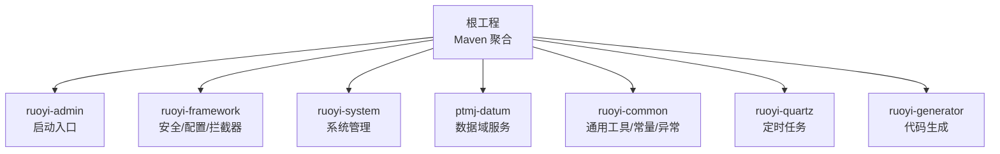
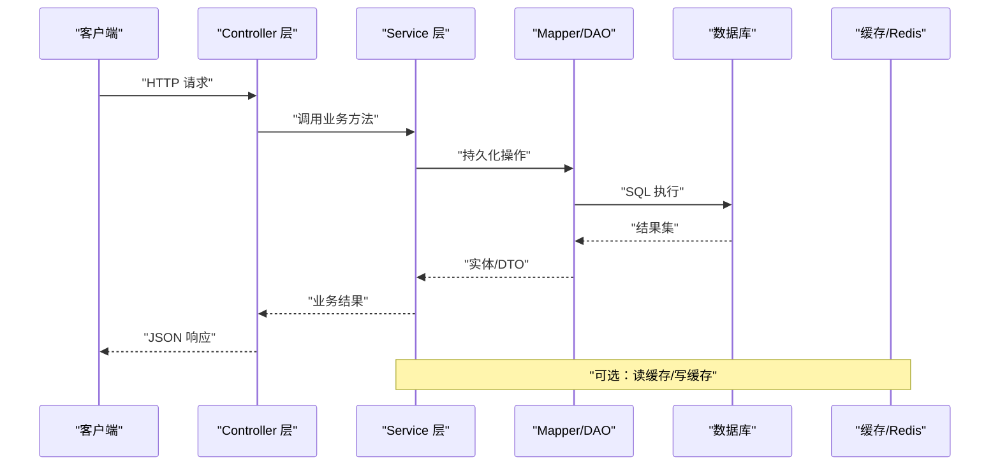
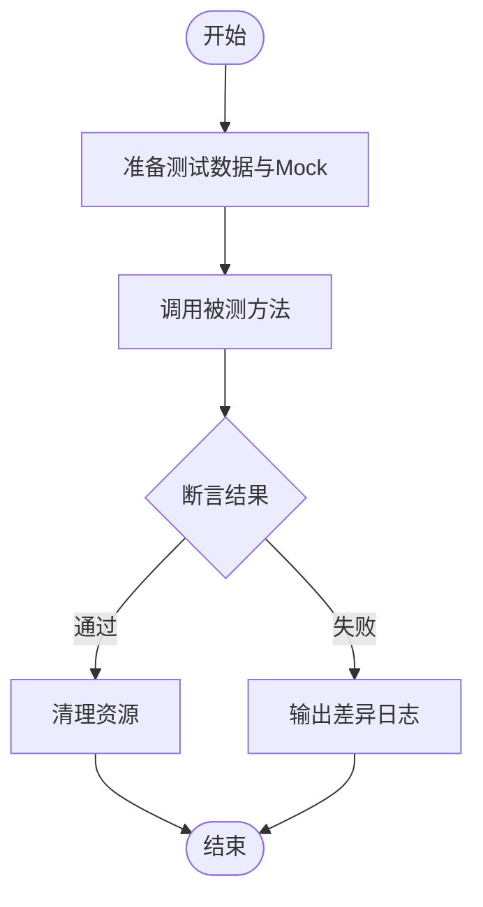
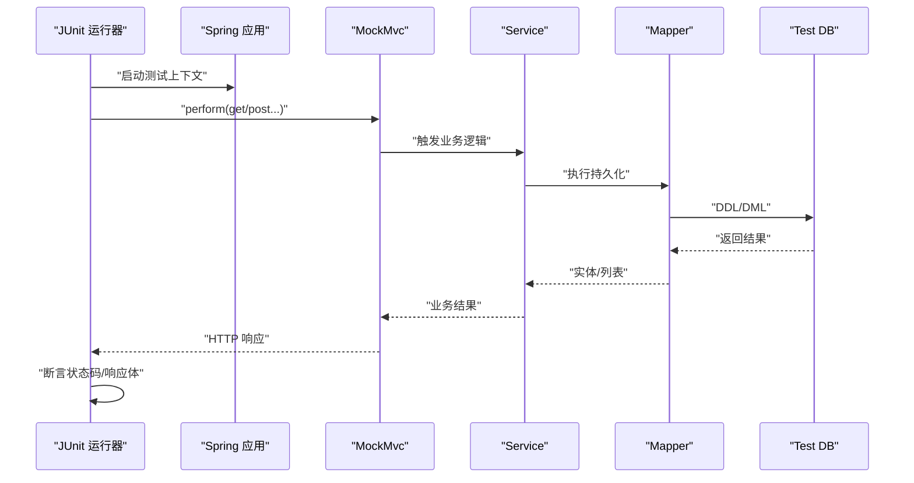
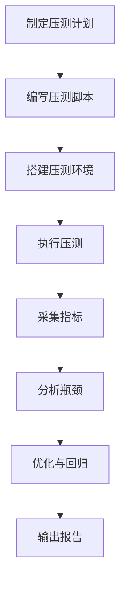
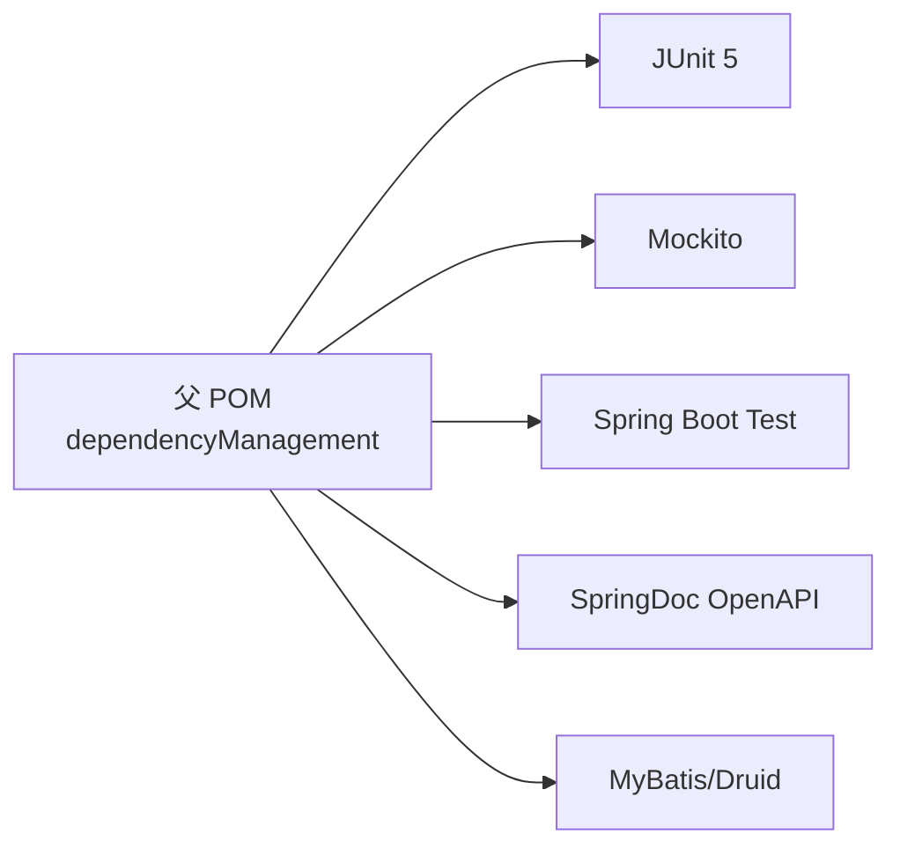
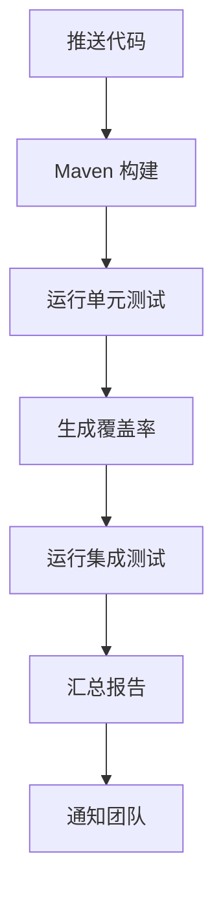

# 测试指南

<cite>
**本文引用的文件**   
- [pom.xml](file://PezMax-Backend/pom.xml)
- [FUNDING.yml](file://PezMax-Backend/.github/FUNDING.yml)
</cite>

## 目录
1. [引言](#引言)
2. [项目结构](#项目结构)
3. [核心组件](#核心组件)
4. [架构总览](#架构总览)
5. [详细组件分析](#详细组件分析)
6. [依赖分析](#依赖分析)
7. [性能考虑](#性能考虑)
8. [故障排查指南](#故障排查指南)
9. [结论](#结论)
10. [附录](#附录)

## 引言
本指南面向 PezMax-One 后端（基于 Spring Boot + MyBatis + Druid）的测试体系建设，目标是建立统一的单元测试、集成测试与性能测试策略与规范，覆盖用例编写、Mock 使用、断言选择、Spring Boot 测试注解、数据库与 API 接口测试、覆盖率要求、持续集成执行与报告生成，并提供常见业务场景的测试示例。

## 项目结构
后端采用多模块 Maven 工程，包含启动模块、框架层、系统模块、通用工具、定时任务、代码生成以及数据域模块等。当前仓库未包含任何现有测试类或测试配置文件，因此本指南提供从零开始的完整测试方案与落地建议。

**图表来源** 
- [pom.xml:177-185](file://PezMax-Backend/pom.xml#L177-L185)

**章节来源**
- [pom.xml:177-185](file://PezMax-Backend/pom.xml#L177-L185)

## 核心组件
- 测试分层与职责
  - 单元测试：聚焦 Service/Util/Domain 等无外部依赖或可 Mock 的单元；快速、稳定、隔离。
  - 集成测试：以 Spring 容器为上下文，验证 Controller → Service → Mapper → DB 的链路；使用内存库或 Testcontainers。
  - 端到端/API 测试：通过 RestTemplate/MockMvc/WebClient 发起 HTTP 请求，校验状态码、响应体与鉴权流程。
  - 性能测试：JMeter/Gatling/K6 进行压测，结合 Micrometer/Prometheus/Grafana 监控指标。
- 关键依赖与版本
  - Spring Boot 4.x、MyBatis-Spring-Boot、Druid、Fastjson2、JWT、SpringDoc OpenAPI 等由父 POM 统一管理。
  - 建议在子模块中显式声明 junit-jupiter、spring-boot-starter-test、testcontainers、jacoco 等测试依赖。

**章节来源**
- [pom.xml:15-35](file://PezMax-Backend/pom.xml#L15-L35)
- [pom.xml:38-175](file://PezMax-Backend/pom.xml#L38-L175)

## 架构总览
下图展示从客户端到后端的典型调用链，便于定位各层测试切入点。

[此图为概念性流程图，不直接映射具体源码文件]

## 详细组件分析

### 单元测试规范
- 命名与组织
  - 包路径与源码一致，如 com.ruoyi.xxx.service.impl 对应 test 下相同路径。
  - 类名 XxxTest，方法名 should_预期行为_when_条件_then_结果。
- JUnit 5 结构
  - @Test 标注用例；@BeforeEach/@AfterEach 准备与清理；@Nested 分组。
  - 使用 Assertions 进行断言，优先使用语义化断言（如 assertEquals、assertThat）。
- Mock 对象使用
  - Mockito 用于替换外部依赖（Mapper、Redis、HTTP 客户端等），配合 when(...).thenReturn(...) 和 verify(...)。
  - 对静态/第三方类可使用 MockitoExtension 或 PowerMockito（谨慎使用）。
- 断言方法选择
  - 基本类型/集合/字符串：assertEquals、assertIterableEquals、assertContains。
  - 异常：assertThrows。
  - 时间/异步：使用 awaitility 或线程同步辅助。
- 数据构造
  - 使用工厂方法或记录器构建测试数据，避免硬编码敏感信息。
- 覆盖率目标
  - 行覆盖率 ≥ 80%，分支覆盖率 ≥ 70%（可按模块逐步提升）。

[此图为概念性流程图，不直接映射具体源码文件]

### 集成测试规范（Spring Boot）
- 启动方式
  - @SpringBootTest 加载完整上下文；@AutoConfigureMockMvc 启用 MockMvc。
  - 针对仅部分组件的场景使用 @WebMvcTest/@DataJpaTest/@MybatisTest。
- 数据库测试
  - 推荐 Testcontainers 启动真实 MySQL/PostgreSQL，保证 SQL 兼容性。
  - 或使用 H2/HSQLDB 内存库，注意方言与特性差异。
  - 使用 @Transactional 在事务内回滚，确保用例间隔离。
- API 接口测试
  - 使用 MockMvc 发送请求并断言状态码、响应体、Header。
  - 鉴权相关：注入 SecurityContext 或携带 Token 模拟登录态。
- 配置与环境
  - 使用 application-test.yml 或 @TestPropertySource 覆盖配置。
  - 对外部服务（MinIO、短信、邮件）使用 TestContainer 或 Mock。

[此图为概念性流程图，不直接映射具体源码文件]

### 性能测试指导
- 工具选型
  - JMeter：图形化脚本、易于分享与回归。
  - Gatling：DSL 定义、高并发与细粒度指标。
  - K6：JavaScript 脚本、云原生友好。
- 指标与监控
  - 关注 QPS、RT（P50/P90/P99）、错误率、CPU/内存/GC、连接池使用率、慢查询。
  - 接入 Micrometer + Prometheus + Grafana，或平台自带监控。
- 瓶颈分析方法
  - 热点接口：按 URL 维度统计 RT 分布与错误率。
  - 数据库：慢查询日志、索引命中率、锁等待。
  - 中间件：Redis 命中率、网络 IO、线程池队列长度。
  - 应用：JFR/Arthas 抓取堆栈与火焰图。
- 压测策略
  - 阶梯加压、稳态压测、峰值压测、长稳压测。
  - 数据准备：预热、去重、随机化，避免缓存击穿。

[此图为概念性流程图，不直接映射具体源码文件]

### 常见业务场景测试用例示例
- 用户注册/登录
  - 正常注册、重复用户名、密码强度校验、验证码过期、登录成功/失败、Token 签发与刷新。
- 权限控制
  - 匿名访问、角色/权限不足、越权访问、跨租户数据隔离。
- 文件上传/下载
  - 大小限制、类型白名单、存储路径、URL 生成、断点续传（若支持）。
- 分页查询与排序
  - 页码边界、空结果、排序字段合法性、总数一致性。
- 定时任务
  - Cron 表达式正确性、任务幂等、失败重试与告警。
- 缓存一致性
  - 读写命中、失效策略、并发更新保护。

[本节为概念性内容，不直接分析具体文件]

## 依赖分析
- 测试相关依赖建议
  - 单元测试：junit-jupiter、mockito-core、assertj-core。
  - 集成测试：spring-boot-starter-test、testcontainers、h2（可选）。
  - 覆盖率：jacoco-maven-plugin。
  - API 文档：springdoc-openapi-starter-webmvc-ui（已引入）。
- 版本治理
  - 父 POM 使用 dependencyManagement 统一版本，子模块按需引入，避免版本冲突。

**图表来源** 
- [pom.xml:38-175](file://PezMax-Backend/pom.xml#L38-L175)

**章节来源**
- [pom.xml:38-175](file://PezMax-Backend/pom.xml#L38-L175)

## 性能考虑
- 测试数据规模：根据生产数据比例准备，避免过少导致误判。
- 资源隔离：压测环境与开发环境分离，避免相互干扰。
- 指标基线：建立性能基线与阈值，回归时自动对比。
- 成本与效率：CI 中仅跑轻量级单测与冒烟集成测试，全量压测在独立环境执行。

[本节为通用指导，不直接分析具体文件]

## 故障排查指南
- 常见问题
  - 端口占用：调整 server.port 或随机端口。
  - 数据库连接失败：检查 JDBC URL、账号密码、防火墙、字符集。
  - 鉴权失败：确认 Security 配置、Token 解析、白名单。
  - 缓存不可用：检查 Redis 连通性与序列化配置。
- 调试技巧
  - 开启 debug 日志与 SQL 日志。
  - 使用 @DirtiesContext 重置上下文。
  - 打印请求/响应摘要与关键参数。

[本节为通用指导，不直接分析具体文件]

## 结论
通过分层测试策略、严格的规范与自动化流水线，可在保证质量的同时提升交付效率。建议先补齐单测与基础集成测试，再逐步完善 API 与性能测试，最终形成“左移”的质量保障体系。

[本节为总结性内容，不直接分析具体文件]

## 附录

### 持续集成与自动化配置建议
- GitHub Actions
  - 触发条件：push/PR。
  - 步骤：安装 JDK、构建、运行单测、生成覆盖率、发布报告。
- Maven 插件
  - maven-surefire-plugin：执行测试。
  - jacoco-maven-plugin：生成覆盖率报告。
  - spring-boot-maven-plugin：打包与运行。
- 报告与归档
  - Surefire XML、JaCoCo HTML/XML、OpenAPI JSON/YAML。

[此图为概念性流程图，不直接映射具体源码文件]

### 覆盖率与门禁
- 最低门槛：行覆盖率 ≥ 80%，分支覆盖率 ≥ 70%。
- 门禁规则：低于阈值则 CI 失败，需修复后方可合并。

[本节为通用指导，不直接分析具体文件]

### 参考链接
- 赞助与支持信息见：
  - [FUNDING.yml](file://PezMax-Backend/.github/FUNDING.yml)

**章节来源**
- [FUNDING.yml:1-2](file://PezMax-Backend/.github/FUNDING.yml#L1-L2)