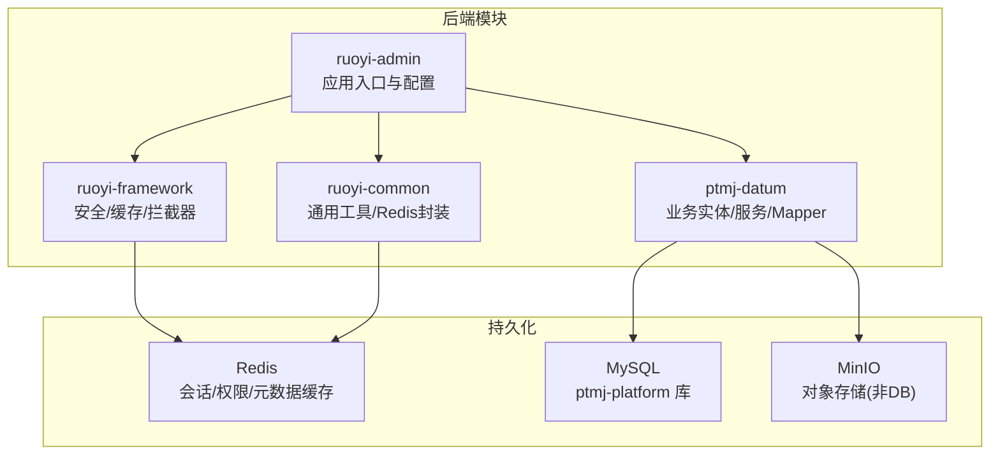
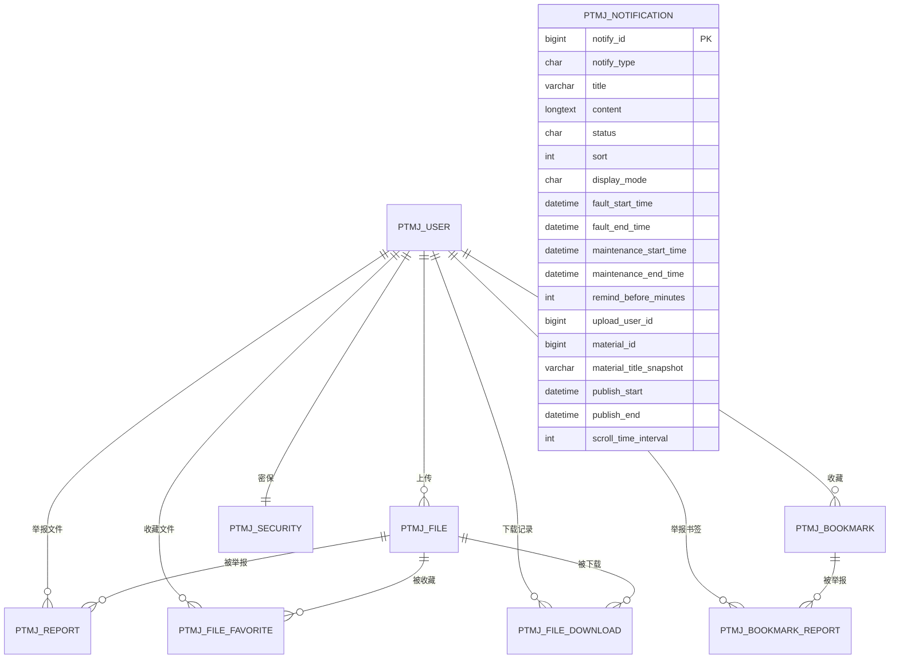
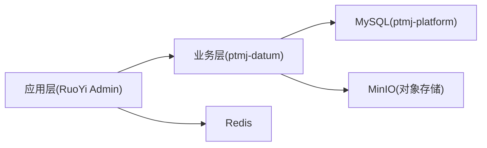
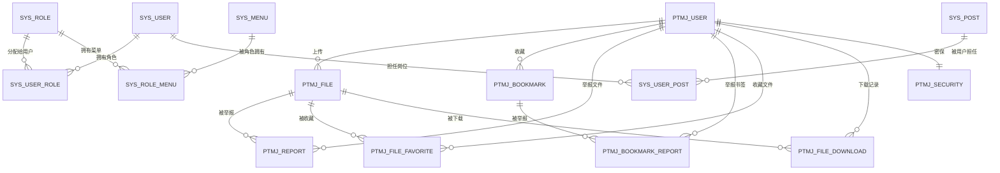

# 数据库设计

<cite>
**本文引用的文件**   
- [pezmax.sql](file://PezMax-Backend/sql/pezmax.sql)
- [ry_20260321.sql](file://PezMax-Backend/sql/ry_20260321.sql)
- [quartz.sql](file://PezMax-Backend/sql/quartz.sql)
- [alter_ptmj_file_add_school.sql](file://PezMax-Backend/sql/alter_ptmj_file_add_school.sql)
- [update_file_url_add_school.sql](file://PezMax-Backend/sql/update_file_url_add_school.sql)
- [rollback_file_url.sql](file://PezMax-Backend/sql/rollback_file_url.sql)
- [application.yml](file://PezMax-Backend/ruoyi-admin/src/main/resources/application.yml)
- [application-druid.yml](file://PezMax-Backend/ruoyi-admin/src/main/resources/application-druid.yml)
- [RedisConfig.java](file://PezMax-Backend/ruoyi-framework/src/main/java/com/ruoyi/framework/config/RedisConfig.java)
- [RedisCache.java](file://PezMax-Backend/ruoyi-common/src/main/java/com/ruoyi/common/core/redis/RedisCache.java)
</cite>

## 目录
1. [引言](#引言)
2. [项目结构](#项目结构)
3. [核心组件](#核心组件)
4. [架构总览](#架构总览)
5. [详细组件分析](#详细组件分析)
6. [依赖分析](#依赖分析)
7. [性能考虑](#性能考虑)
8. [故障排查指南](#故障排查指南)
9. [结论](#结论)
10. [附录](#附录)

## 引言
本文件为 PezMax 项目的数据库设计文档，聚焦 MySQL 表结构设计、关系与索引策略、初始化与迁移脚本执行顺序、以及 Redis 缓存使用场景与数据结构设计。同时提供数据字典、ER 关系图、示例数据建议、性能优化建议、备份恢复方案与监控指标，帮助读者快速理解并落地实施。

## 项目结构
本项目采用多模块后端（RuoYi 基础框架 + 业务模块 ptmj-datum），数据库相关脚本集中于 sql 目录；应用配置位于 ruoyi-admin 的 resources 下；Redis 配置与工具类位于 framework 与 common 模块。

图表来源
- [application.yml:1-162](file://PezMax-Backend/ruoyi-admin/src/main/resources/application.yml#L1-L162)
- [application-druid.yml:1-62](file://PezMax-Backend/ruoyi-admin/src/main/resources/application-druid.yml#L1-L62)
- [RedisConfig.java:1-71](file://PezMax-Backend/ruoyi-framework/src/main/java/com/ruoyi/framework/config/RedisConfig.java#L1-L71)
- [RedisCache.java:1-269](file://PezMax-Backend/ruoyi-common/src/main/java/com/ruoyi/common/core/redis/RedisCache.java#L1-L269)

章节来源
- [application.yml:1-162](file://PezMax-Backend/ruoyi-admin/src/main/resources/application.yml#L1-L162)
- [application-druid.yml:1-62](file://PezMax-Backend/ruoyi-admin/src/main/resources/application-druid.yml#L1-L62)

## 核心组件
- 业务域表：用户(ptmj_user)、文件(ptmj_file)、书签(ptmj_bookmark)、举报(ptmj_report, ptmj_bookmark_report)、收藏(ptmj_file_favorite)、下载(ptmj_file_download)、通知(ptmj_notification)、密保(ptmj_security)。
- 系统域表（RuoYi）：部门(sys_dept)、用户(sys_user)、角色(sys_role)、菜单(sys_menu)、岗位(sys_post)、字典(sys_dict_type/sys_dict_data)、参数(sys_config)、操作日志(sys_oper_log)、登录日志(sys_logininfor)、公告(sys_notice/sys_notice_read)、定时任务(sys_job/sys_job_log)、代码生成(gen_table/gen_table_column)。
- 调度器表（Quartz）：qrtz_* 系列表用于分布式任务调度。

章节来源
- [pezmax.sql:80-291](file://PezMax-Backend/sql/pezmax.sql#L80-L291)
- [ry_20260321.sql:1-722](file://PezMax-Backend/sql/ry_20260321.sql#L1-L722)
- [quartz.sql:1-174](file://PezMax-Backend/sql/quartz.sql#L1-L174)

## 架构总览
下图展示核心业务实体之间的关系及与系统能力（认证、权限、通知、调度）的交互。

图表来源
- [pezmax.sql:80-291](file://PezMax-Backend/sql/pezmax.sql#L80-L291)

## 详细组件分析

### 数据字典（核心业务表）
- 用户表 ptmj_user
  - 主键：user_id
  - 关键字段：user_name(唯一), password, avatar, count(上传数), status(账号状态), create_time, update_time
  - 约束：user_name 唯一索引
  - 用途：平台用户身份与基础信息
- 文件表 ptmj_file
  - 主键：file_id,user_id（复合主键）
  - 关键字段：file_name, file_url, file_size, file_format, file_year, file_type, file_subject, reviewer, file_status, del_flag, file_school(通过升级脚本添加)
  - 索引：upload_user_id, file_year, file_type, file_status, del_flag, file_school(可选)
  - 用途：学习资料元数据与审核状态
- 书签表 ptmj_bookmark
  - 主键：id
  - 关键字段：user_id, url, title, description, cover_image, subject, resource_type, collection, status, del_flag
  - 索引：user_id, subject, resource_type, collection, status, del_flag, create_time
  - 用途：外部资源书签管理
- 书签举报表 ptmj_bookmark_report
  - 主键：report_id
  - 关键字段：bookmark_id, user_id, reason, result
  - 约束：uk_user_bookmark(user_id, bookmark_id) 唯一
  - 索引：bookmark_id, user_id, result, create_time
- 文件举报表 ptmj_report
  - 主键：report_id
  - 关键字段：file_id, user_id, reason, result
- 收藏表 ptmj_file_favorite
  - 主键：file_id,user_id
  - 索引：user_id
- 下载表 ptmj_file_download
  - 主键：download_id,file_id,user_id
- 通知表 ptmj_notification
  - 主键：notify_id
  - 关键字段：notify_type, title, content, status, sort, display_mode, 时间字段(故障/维护/滚动), upload_user_id, material_id, material_title_snapshot
  - 约束：uk_material_notify(material_id)
  - 索引：idx_notify_type_status(type,status), idx_target-user(upload_user_id), idx_publish(publish_start,publish_end)
- 密保表 ptmj_security
  - 主键：id
  - 约束：uk_user_id(user_id)

章节来源
- [pezmax.sql:80-291](file://PezMax-Backend/sql/pezmax.sql#L80-L291)

### 系统域表（RuoYi）
- sys_user：系统管理员用户
- sys_role / sys_menu / sys_user_role / sys_role_menu / sys_dept / sys_user_post：RBAC 权限模型
- sys_dict_type / sys_dict_data：字典
- sys_config：系统参数
- sys_oper_log / sys_logininfor：审计日志
- sys_notice / sys_notice_read：公告与已读
- gen_table / gen_table_column：代码生成元数据

章节来源
- [ry_20260321.sql:1-722](file://PezMax-Backend/sql/ry_20260321.sql#L1-L722)

### Quartz 调度表
- qrtz_job_details / qrtz_triggers / qrtz_cron_triggers / qrtz_simple_triggers / qrtz_fired_triggers / qrtz_scheduler_state / qrtz_locks 等
- 用途：分布式任务调度、触发器、锁与状态

章节来源
- [quartz.sql:1-174](file://PezMax-Backend/sql/quartz.sql#L1-L174)

### 表关系与索引策略
- 一对多关系
  - 用户 -> 文件、书签、举报、收藏、下载、通知（目标用户）
  - 文件 -> 举报、收藏、下载
  - 书签 -> 举报
- 唯一性约束
  - 用户账号唯一
  - 同一用户对同一书签仅能举报一次
  - 同一资料仅一条下架通知
- 索引策略
  - 高频查询列建立单列或组合索引（如 user_id、status、create_time、type+status、publish_start+end）
  - 复合主键用于强一致的多对多关联（收藏、下载）
  - 针对时间范围查询建立前缀索引（publish_start,publish_end）

章节来源
- [pezmax.sql:80-291](file://PezMax-Backend/sql/pezmax.sql#L80-L291)

### 数据库初始化与迁移顺序
建议执行顺序：
1. 初始化 RuoYi 基础库表与字典、菜单、初始用户等
   - 参考：[ry_20260321.sql:1-722](file://PezMax-Backend/sql/ry_20260321.sql#L1-L722)
2. 初始化 Quartz 调度表
   - 参考：[quartz.sql:1-174](file://PezMax-Backend/sql/quartz.sql#L1-L174)
3. 初始化业务库表（ptmj_platform）
   - 参考：[pezmax.sql:1-799](file://PezMax-Backend/sql/pezmax.sql#L1-L799)
4. 增量变更
   - 为文件表增加学校字段：[alter_ptmj_file_add_school.sql:1-29](file://PezMax-Backend/sql/alter_ptmj_file_add_school.sql#L1-L29)
   - 更新 MinIO 路径包含学校层级：[update_file_url_add_school.sql:1-100](file://PezMax-Backend/sql/update_file_url_add_school.sql#L1-L100)
   - 如需回滚路径变更：[rollback_file_url.sql:1-44](file://PezMax-Backend/sql/rollback_file_url.sql#L1-L44)

章节来源
- [ry_20260321.sql:1-722](file://PezMax-Backend/sql/ry_20260321.sql#L1-L722)
- [quartz.sql:1-174](file://PezMax-Backend/sql/quartz.sql#L1-L174)
- [pezmax.sql:1-799](file://PezMax-Backend/sql/pezmax.sql#L1-L799)
- [alter_ptmj_file_add_school.sql:1-29](file://PezMax-Backend/sql/alter_ptmj_file_add_school.sql#L1-L29)
- [update_file_url_add_school.sql:1-100](file://PezMax-Backend/sql/update_file_url_add_school.sql#L1-L100)
- [rollback_file_url.sql:1-44](file://PezMax-Backend/sql/rollback_file_url.sql#L1-L44)

### 连接与序列化配置
- 数据源（Druid）
  - 驱动、主从配置、连接池参数、慢SQL统计、Web监控
  - 参考：[application-druid.yml:1-62](file://PezMax-Backend/ruoyi-admin/src/main/resources/application-druid.yml#L1-L62)
- Redis
  - 连接地址、端口、数据库索引、密码、超时、连接池
  - Key/Value 序列化：Key 使用 String，Value 使用 FastJson2
  - 限流 Lua 脚本注入
  - 参考：[application.yml:72-94](file://PezMax-Backend/ruoyi-admin/src/main/resources/application.yml#L72-L94)、[RedisConfig.java:1-71](file://PezMax-Backend/ruoyi-framework/src/main/java/com/ruoyi/framework/config/RedisConfig.java#L1-L71)

章节来源
- [application-druid.yml:1-62](file://PezMax-Backend/ruoyi-admin/src/main/resources/application-druid.yml#L1-L62)
- [application.yml:72-94](file://PezMax-Backend/ruoyi-admin/src/main/resources/application.yml#L72-L94)
- [RedisConfig.java:1-71](file://PezMax-Backend/ruoyi-framework/src/main/java/com/ruoyi/framework/config/RedisConfig.java#L1-L71)

## 依赖分析
- 模块耦合
  - ptmj-datum 依赖 RuoYi 基础能力（安全、缓存、分页、MyBatis）
  - 业务表与系统表解耦，通过 user_id 进行逻辑关联
- 外部依赖
  - MySQL：持久化
  - Redis：缓存与限流
  - MinIO：对象存储（文件内容）

图表来源
- [application.yml:149-162](file://PezMax-Backend/ruoyi-admin/src/main/resources/application.yml#L149-L162)
- [application-druid.yml:1-62](file://PezMax-Backend/ruoyi-admin/src/main/resources/application-druid.yml#L1-L62)
- [RedisConfig.java:1-71](file://PezMax-Backend/ruoyi-framework/src/main/java/com/ruoyi/framework/config/RedisConfig.java#L1-L71)

章节来源
- [application.yml:1-162](file://PezMax-Backend/ruoyi-admin/src/main/resources/application.yml#L1-L162)
- [application-druid.yml:1-62](file://PezMax-Backend/ruoyi-admin/src/main/resources/application-druid.yml#L1-L62)

## 性能考虑
- 索引优化
  - 针对高频过滤条件建立索引：user_id、status、del_flag、resource_type、subject、file_type、file_year、file_status、notify_type+status、publish_start+end
  - 组合索引优先于多个单列索引，减少回表
- 查询优化
  - 避免 SELECT *，按需返回字段
  - 大文本字段（content/description）尽量延迟加载
  - 分页查询使用覆盖索引减少回表
- 事务与锁
  - 批量写入分批次提交，降低锁持有时间
  - 高并发写场景关注行级锁竞争
- 读写分离与分库分表
  - 当前为单库，未来可按用户维度或时间维度拆分（如按年归档下载/日志）
- 连接池与超时
  - 根据 QPS 调整 Druid 最大连接数与等待超时
  - 合理设置 Redis 连接池大小与超时

## 故障排查指南
- 连接问题
  - 检查 application.yml 中 Redis 地址与端口，application-druid.yml 中 MySQL URL、用户名、密码与时区
- 序列化异常
  - 确认 RedisTemplate 的 Key/HashKey 使用 String 序列化，Value/HashValue 使用 FastJson2
- 限流失效
  - 校验 limitScript 是否正确注册与执行
- 迁移失败
  - 先执行 alter 脚本再执行路径更新脚本；必要时使用回滚脚本恢复
- 监控
  - 开启 Druid 慢 SQL 统计与 Web 控制台
  - 观察 Redis 命中率与内存占用

章节来源
- [application.yml:72-94](file://PezMax-Backend/ruoyi-admin/src/main/resources/application.yml#L72-L94)
- [application-druid.yml:43-62](file://PezMax-Backend/ruoyi-admin/src/main/resources/application-druid.yml#L43-L62)
- [RedisConfig.java:43-71](file://PezMax-Backend/ruoyi-framework/src/main/java/com/ruoyi/framework/config/RedisConfig.java#L43-L71)
- [update_file_url_add_school.sql:1-100](file://PezMax-Backend/sql/update_file_url_add_school.sql#L1-L100)
- [rollback_file_url.sql:1-44](file://PezMax-Backend/sql/rollback_file_url.sql#L1-L44)

## 结论
本设计围绕“用户-文件-书签-通知”核心域展开，结合 RuoYi 的系统能力与 Quartz 调度，形成可扩展的数据模型。通过合理的索引与迁移脚本，保障上线与演进的可控性。配合 Redis 缓存与 Druid 监控，可进一步提升性能与可观测性。

## 附录

### ER 关系图（含系统域）

图表来源
- [pezmax.sql:80-291](file://PezMax-Backend/sql/pezmax.sql#L80-L291)
- [ry_20260321.sql:1-722](file://PezMax-Backend/sql/ry_20260321.sql#L1-L722)

### 示例数据建议
- 用户：创建至少一个测试用户，启用正常状态
- 文件：上传若干不同学科、年份、类型的文件，设置未审核/通过状态
- 书签：添加若干外部学习资源，标注科目与类型
- 通知：创建一条滚动日常通知与一条维护通知，验证时间窗口与展示形态
- 收藏/下载：模拟用户收藏与下载行为，验证计数与去重

### 备份与恢复
- 全量备份
  - mysqldump --single-transaction --routines --triggers --events -h host -u user -p ptmj-platform > backup.sql
- 增量备份
  - 基于 binlog 的增量恢复（需开启 binlog）
- 恢复流程
  - 停止应用 -> 导入最新全量备份 -> 按顺序执行增量迁移脚本 -> 启动应用并验证关键接口

### 监控指标
- MySQL
  - 连接数、QPS/TPS、慢查询数量、锁等待、缓冲池命中率
- Redis
  - 命中率、内存使用率、命令耗时、持久化状态
- 应用
  - 接口响应时间、错误率、线程池使用率、GC 情况