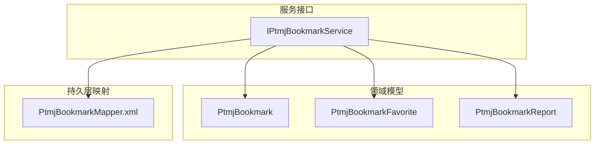
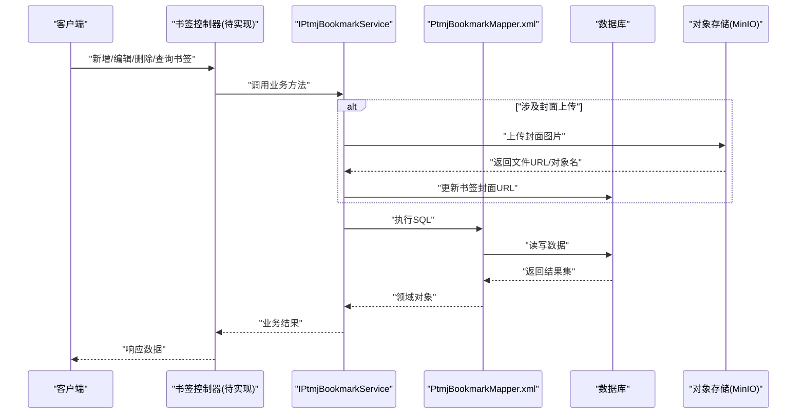
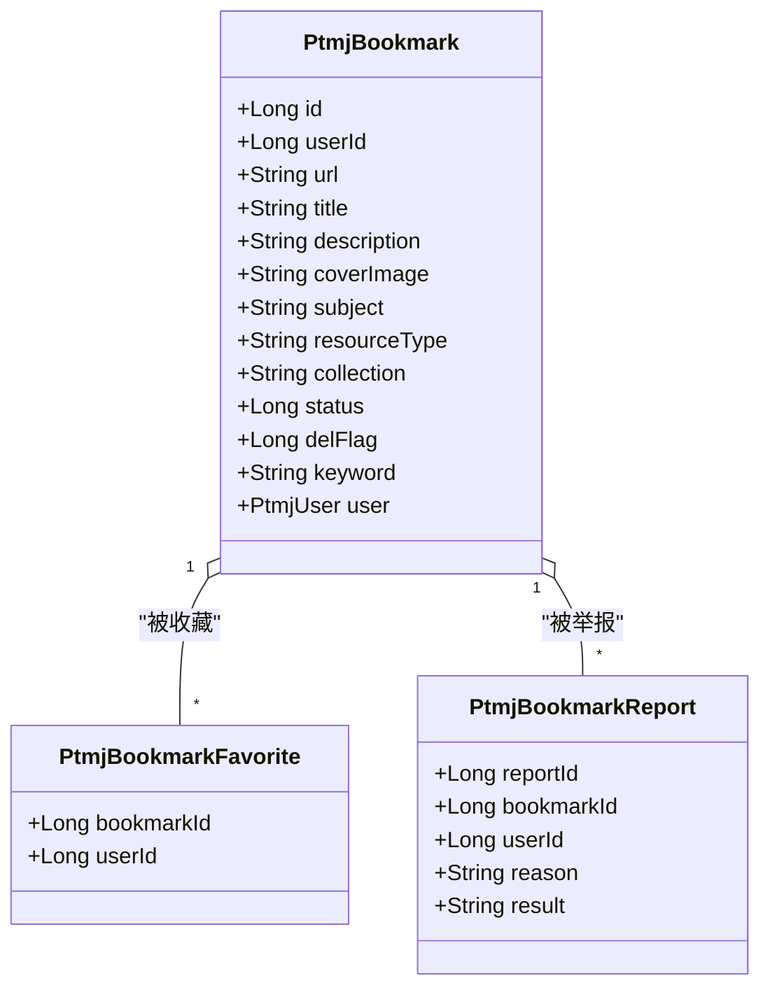
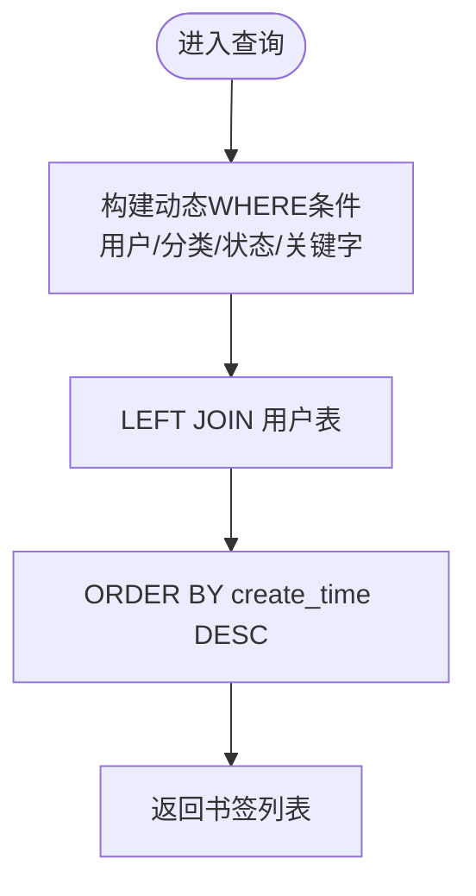
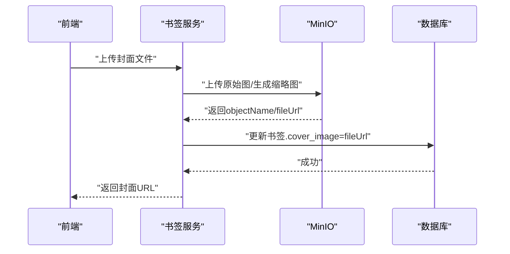
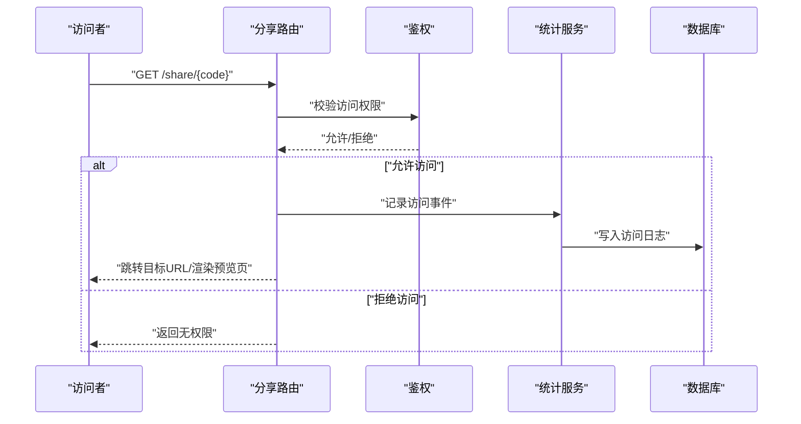
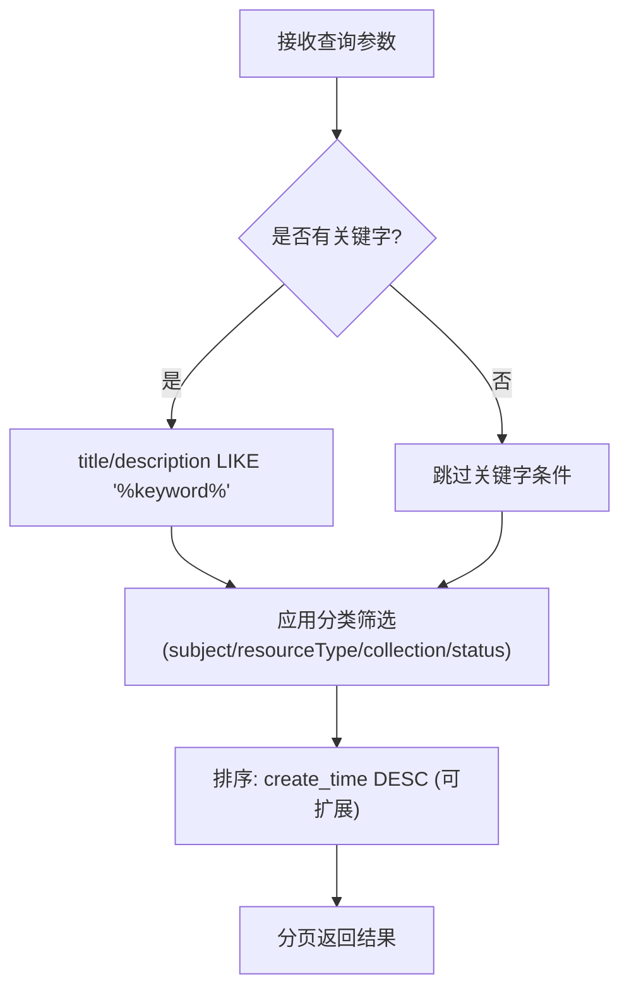
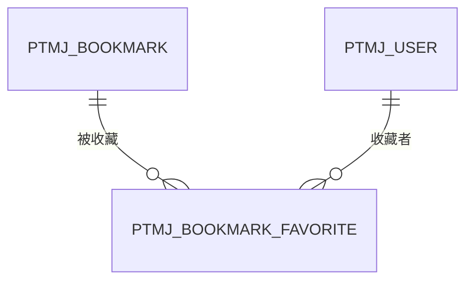
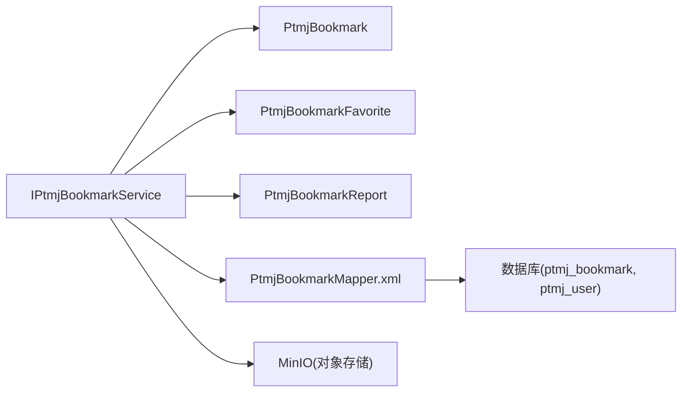

# 书签管理系统

<cite>
**本文引用的文件**   
- [PtmjBookmark.java](file://PezMax-Backend/ptmj-datum/src/main/java/com/ptmj/datum/domain/PtmjBookmark.java)
- [PtmjBookmarkMapper.xml](file://PezMax-Backend/ptmj-datum/src/main/resources/mapper/datum/PtmjBookmarkMapper.xml)
- [IPtmjBookmarkService.java](file://PezMax-Backend/ptmj-datum/src/main/java/com/ptmj/datum/service/IPtmjBookmarkService.java)
- [PtmjBookmarkFavorite.java](file://PezMax-Backend/ptmj-datum/src/main/java/com/ptmj/datum/domain/PtmjBookmarkFavorite.java)
- [PtmjBookmarkReport.java](file://PezMax-Backend/ptmj-datum/src/main/java/com/ptmj/datum/domain/PtmjBookmarkReport.java)
</cite>

## 目录
1. [简介](#简介)
2. [项目结构](#项目结构)
3. [核心组件](#核心组件)
4. [架构总览](#架构总览)
5. [详细组件分析](#详细组件分析)
6. [依赖关系分析](#依赖关系分析)
7. [性能考虑](#性能考虑)
8. [故障排查指南](#故障排查指南)
9. [结论](#结论)
10. [附录](#附录)

## 简介
本文件聚焦于 PezMax-One 的“书签管理”核心能力，围绕以下目标进行系统化技术文档化：
- 书签基础操作：添加、编辑、删除、分类（学科/资源类型/专栏）管理
- 封面自动抓取与存储：网页元数据提取、缩略图生成、MinIO 存储与缓存策略建议
- 分享机制：分享链接生成、访问权限控制、使用统计方案
- 搜索与过滤：关键词匹配、分类筛选、标签管理、排序规则
- 高级功能：导入导出、批量操作、收藏夹管理

说明：当前仓库中已提供书签领域模型、持久层映射与服务接口定义。部分实现（如封面抓取、分享统计、批量导入导出）在现有代码中未直接出现，本文基于已有接口与通用基础设施给出可落地的实现方案与建议。

## 项目结构
书签相关后端代码位于 ptmj-datum 模块，采用典型分层结构：
- 领域模型：PtmjBookmark、PtmjBookmarkFavorite、PtmjBookmarkReport
- 服务接口：IPtmjBookmarkService（包含封面上传与更新等扩展方法）
- 持久层映射：PtmjBookmarkMapper.xml（CRUD、条件查询、软删除）

图表来源
- [PtmjBookmark.java:1-218](file://PezMax-Backend/ptmj-datum/src/main/java/com/ptmj/datum/domain/PtmjBookmark.java#L1-L218)
- [PtmjBookmarkFavorite.java:1-49](file://PezMax-Backend/ptmj-datum/src/main/java/com/ptmj/datum/domain/PtmjBookmarkFavorite.java#L1-L49)
- [PtmjBookmarkReport.java:1-103](file://PezMax-Backend/ptmj-datum/src/main/java/com/ptmj/datum/domain/PtmjBookmarkReport.java#L1-L103)
- [IPtmjBookmarkService.java:1-89](file://PezMax-Backend/ptmj-datum/src/main/java/com/ptmj/datum/service/IPtmjBookmarkService.java#L1-L89)
- [PtmjBookmarkMapper.xml:1-125](file://PezMax-Backend/ptmj-datum/src/main/resources/mapper/datum/PtmjBookmarkMapper.xml#L1-L125)

章节来源
- [PtmjBookmark.java:1-218](file://PezMax-Backend/ptmj-datum/src/main/java/com/ptmj/datum/domain/PtmjBookmark.java#L1-L218)
- [PtmjBookmarkMapper.xml:1-125](file://PezMax-Backend/ptmj-datum/src/main/resources/mapper/datum/PtmjBookmarkMapper.xml#L1-L125)
- [IPtmjBookmarkService.java:1-89](file://PezMax-Backend/ptmj-datum/src/main/java/com/ptmj/datum/service/IPtmjBookmarkService.java#L1-L89)

## 核心组件
- 领域模型 PtmjBookmark
  - 字段覆盖：用户ID、URL、标题、描述、封面图、学科/分类、资源类型、所属专栏、状态、删除标记、统一关键字、关联用户信息
  - 作用：承载书签实体及其检索/展示所需的全部元数据
- 收藏模型 PtmjBookmarkFavorite
  - 字段：书签ID、收藏用户ID
  - 作用：记录用户对某书签的收藏关系
- 举报模型 PtmjBookmarkReport
  - 字段：被举报书签ID、举报用户ID、原因、审核结果
  - 作用：支撑内容治理与审核流程
- 服务接口 IPtmjBookmarkService
  - 标准 CRUD：按ID查询、列表查询、新增、修改、删除（软删除）
  - 封面能力：上传封面到 MinIO、更新书签封面 URL、上传并保存封面（含可选书签ID）
- 持久层映射 PtmjBookmarkMapper.xml
  - 支持按用户、学科、资源类型、专栏、状态、关键字模糊匹配（标题/描述）组合查询
  - 默认按创建时间倒序排列
  - 软删除：通过 del_flag 标记逻辑删除，同时限制仅能删除自身数据

章节来源
- [PtmjBookmark.java:1-218](file://PezMax-Backend/ptmj-datum/src/main/java/com/ptmj/datum/domain/PtmjBookmark.java#L1-L218)
- [PtmjBookmarkFavorite.java:1-49](file://PezMax-Backend/ptmj-datum/src/main/java/com/ptmj/datum/domain/PtmjBookmarkFavorite.java#L1-L49)
- [PtmjBookmarkReport.java:1-103](file://PezMax-Backend/ptmj-datum/src/main/java/com/ptmj/datum/domain/PtmjBookmarkReport.java#L1-L103)
- [IPtmjBookmarkService.java:1-89](file://PezMax-Backend/ptmj-datum/src/main/java/com/ptmj/datum/service/IPtmjBookmarkService.java#L1-L89)
- [PtmjBookmarkMapper.xml:1-125](file://PezMax-Backend/ptmj-datum/src/main/resources/mapper/datum/PtmjBookmarkMapper.xml#L1-L125)

## 架构总览
书签管理的后端调用链遵循“控制器 -> 服务接口 -> 持久层映射”的分层模式。当前仓库提供了服务接口与持久层映射，控制器层未在给定文件中体现，但可按标准 RuoYi 风格实现。

图表来源
- [IPtmjBookmarkService.java:1-89](file://PezMax-Backend/ptmj-datum/src/main/java/com/ptmj/datum/service/IPtmjBookmarkService.java#L1-L89)
- [PtmjBookmarkMapper.xml:1-125](file://PezMax-Backend/ptmj-datum/src/main/resources/mapper/datum/PtmjBookmarkMapper.xml#L1-L125)

## 详细组件分析

### 书签实体与数据模型
- 实体字段与用途
  - 标识与归属：id、userId
  - 内容与展示：url、title、description、coverImage
  - 分类与组织：subject（学科）、resourceType（资源类型）、collection（专栏）
  - 生命周期：status（启用/停用）、delFlag（软删除）
  - 检索辅助：keyword（用于前端或上层组装的模糊关键字）
  - 关联信息：user（作者头像、用户名等）
- 数据表映射
  - 主表：ptmj_bookmark
  - 关联用户：ptmj_user（左连接获取作者信息）
  - 软删除：del_flag=1 表示已删除；查询默认排除已删除记录
  - 排序：默认按 create_time 降序

图表来源
- [PtmjBookmark.java:1-218](file://PezMax-Backend/ptmj-datum/src/main/java/com/ptmj/datum/domain/PtmjBookmark.java#L1-L218)
- [PtmjBookmarkFavorite.java:1-49](file://PezMax-Backend/ptmj-datum/src/main/java/com/ptmj/datum/domain/PtmjBookmarkFavorite.java#L1-L49)
- [PtmjBookmarkReport.java:1-103](file://PezMax-Backend/ptmj-datum/src/main/java/com/ptmj/datum/domain/PtmjBookmarkReport.java#L1-L103)

章节来源
- [PtmjBookmark.java:1-218](file://PezMax-Backend/ptmj-datum/src/main/java/com/ptmj/datum/domain/PtmjBookmark.java#L1-L218)
- [PtmjBookmarkMapper.xml:1-125](file://PezMax-Backend/ptmj-datum/src/main/resources/mapper/datum/PtmjBookmarkMapper.xml#L1-L125)

### 书签增删改查与分类管理
- 新增
  - 输入：userId、url、title、description、coverImage、subject、resourceType、collection、status、remark 等
  - 输出：自增主键 id
- 修改
  - 支持更新：title、subject、resourceType、collection、status、description、coverImage、url 等
- 删除
  - 软删除：将 del_flag 置为 1，并限定仅能删除 own 数据（user_id 校验）
- 查询
  - 条件：userId、subject、resourceType、collection、status、keyword（标题/描述模糊）
  - 排序：create_time desc
  - 关联：左连接用户表，返回作者头像、用户名等

图表来源
- [PtmjBookmarkMapper.xml:44-58](file://PezMax-Backend/ptmj-datum/src/main/resources/mapper/datum/PtmjBookmarkMapper.xml#L44-L58)

章节来源
- [PtmjBookmarkMapper.xml:60-123](file://PezMax-Backend/ptmj-datum/src/main/resources/mapper/datum/PtmjBookmarkMapper.xml#L60-L123)

### 书签封面自动抓取与存储
- 能力边界
  - 当前接口提供：上传封面到 MinIO、更新书签封面 URL、上传并保存封面（可选书签ID）
  - 网页元数据抓取与缩略图生成：当前仓库未提供具体实现，可在服务层扩展
- 推荐实现方案
  - 元数据抓取：异步任务拉取网页 <title>/<meta description>/open graph 图片，失败回退至默认封面
  - 缩略图生成：服务端或边缘节点对原图裁剪/压缩，降低带宽与存储成本
  - 存储与缓存：MinIO 作为对象存储；CDN 加速访问；本地/Redis 缓存热门封面URL
  - 幂等与去重：以 URL+尺寸哈希命名对象，避免重复存储
  - 安全校验：限制文件大小/格式，防注入与恶意文件

图表来源
- [IPtmjBookmarkService.java:58-87](file://PezMax-Backend/ptmj-datum/src/main/java/com/ptmj/datum/service/IPtmjBookmarkService.java#L58-L87)

章节来源
- [IPtmjBookmarkService.java:58-87](file://PezMax-Backend/ptmj-datum/src/main/java/com/ptmj/datum/service/IPtmjBookmarkService.java#L58-L87)

### 书签分享机制
- 分享链接生成
  - 建议：为每个书签生成唯一分享短链（如 /share/{shortCode}），短码与书签ID映射存储
- 访问权限控制
  - 公开/私有：通过书签状态与可见性标志控制
  - 鉴权：匿名访问时校验是否允许公开分享；私有分享需携带一次性令牌或登录态
- 使用统计
  - 事件埋点：每次访问记录 ip、ua、时间、来源页面
  - 聚合指标：点击量、独立访客、地域分布、设备类型
  - 反作弊：频率限制、黑名单、验证码挑战

说明：分享路由与统计服务在当前仓库未提供具体实现，上述为落地建议。

### 搜索与过滤、标签管理与排序
- 关键词匹配
  - 当前实现：keyword 对 title/description 做 LIKE 模糊匹配
- 分类筛选
  - 支持按 subject、resourceType、collection、status 精确筛选
- 标签管理（建议）
  - 引入多值标签表（bookmark_tag、tag），支持一对多关系
  - 查询时通过中间表 JOIN 或 IN 子句过滤
- 排序规则
  - 默认：create_time desc
  - 可扩展：热度（访问量/收藏数）、评分、更新时间

图表来源
- [PtmjBookmarkMapper.xml:44-58](file://PezMax-Backend/ptmj-datum/src/main/resources/mapper/datum/PtmjBookmarkMapper.xml#L44-L58)

章节来源
- [PtmjBookmarkMapper.xml:44-58](file://PezMax-Backend/ptmj-datum/src/main/resources/mapper/datum/PtmjBookmarkMapper.xml#L44-L58)

### 收藏夹管理
- 数据结构
  - 收藏关系：PtmjBookmarkFavorite(bookmarkId, userId)
- 常用操作
  - 收藏/取消收藏：插入/删除对应关系，注意唯一约束防止重复
  - 我的收藏列表：按收藏时间或书签创建时间排序
  - 批量操作：批量加入收藏/移出收藏
- 权限与安全
  - 仅允许操作自己的收藏关系
  - 并发保护：使用唯一索引或乐观锁避免重复收藏

图表来源
- [PtmjBookmarkFavorite.java:1-49](file://PezMax-Backend/ptmj-datum/src/main/java/com/ptmj/datum/domain/PtmjBookmarkFavorite.java#L1-L49)

章节来源
- [PtmjBookmarkFavorite.java:1-49](file://PezMax-Backend/ptmj-datum/src/main/java/com/ptmj/datum/domain/PtmjBookmarkFavorite.java#L1-L49)

### 举报与治理
- 数据结构
  - 举报记录：PtmjBookmarkReport(bookmarkId, userId, reason, result)
- 流程建议
  - 提交举报：记录原因与举报人
  - 审核处理：管理员判定结果（未审核/属实/不属实）
  - 处置动作：根据结果对书签进行隐藏、下架或通知作者

章节来源
- [PtmjBookmarkReport.java:1-103](file://PezMax-Backend/ptmj-datum/src/main/java/com/ptmj/datum/domain/PtmjBookmarkReport.java#L1-L103)

### 导入导出与批量操作（建议）
- 导入
  - 支持 CSV/Excel 批量导入书签，解析后批量插入
  - 校验：URL 合法性、重复检测、分类字典映射
- 导出
  - 按筛选条件导出书签清单（含分类、封面URL等）
- 批量操作
  - 批量移动分类、批量启用/停用、批量删除（软删除）

说明：以上为通用能力建议，当前仓库未提供具体实现。

## 依赖关系分析
- 组件耦合
  - 服务接口依赖领域模型与持久层映射
  - 持久层映射依赖数据库表结构与用户表关联
- 外部依赖
  - MinIO：封面图片存储
  - Redis/缓存：热点封面URL缓存（建议）
  - 消息队列/定时任务：封面抓取与缩略图生成（建议）

图表来源
- [IPtmjBookmarkService.java:1-89](file://PezMax-Backend/ptmj-datum/src/main/java/com/ptmj/datum/service/IPtmjBookmarkService.java#L1-L89)
- [PtmjBookmarkMapper.xml:1-125](file://PezMax-Backend/ptmj-datum/src/main/resources/mapper/datum/PtmjBookmarkMapper.xml#L1-L125)

章节来源
- [IPtmjBookmarkService.java:1-89](file://PezMax-Backend/ptmj-datum/src/main/java/com/ptmj/datum/service/IPtmjBookmarkService.java#L1-L89)
- [PtmjBookmarkMapper.xml:1-125](file://PezMax-Backend/ptmj-datum/src/main/resources/mapper/datum/PtmjBookmarkMapper.xml#L1-L125)

## 性能考虑
- 查询优化
  - 合理使用索引：user_id、subject、resourceType、collection、status、create_time
  - 关键字模糊匹配尽量前置分类筛选，减少LIKE扫描范围
- 封面存储
  - 缩略图与源图分离，按需加载
  - CDN 缓存静态资源，降低源站压力
- 并发与一致性
  - 收藏/举报等写操作加唯一约束或分布式锁
  - 软删除避免物理删除导致的数据不一致
- 缓存策略
  - 热门书签详情与封面URL短期缓存
  - 统计指标增量聚合，定期汇总

[本节为通用指导，无需特定文件引用]

## 故障排查指南
- 常见问题定位
  - 查询结果为空：检查 del_flag 是否为 0、keyword 是否命中、分类条件是否过严
  - 删除失败：确认当前用户是否为书签所有者（user_id 校验）
  - 封面上传失败：检查 MinIO 配置、文件大小/类型限制、网络超时
- 日志与监控
  - 记录关键操作日志：新增/修改/删除、封面上传、分享访问
  - 监控指标：QPS、错误率、MinIO 存取耗时、数据库慢查询

章节来源
- [PtmjBookmarkMapper.xml:115-123](file://PezMax-Backend/ptmj-datum/src/main/resources/mapper/datum/PtmjBookmarkMapper.xml#L115-L123)
- [IPtmjBookmarkService.java:58-87](file://PezMax-Backend/ptmj-datum/src/main/java/com/ptmj/datum/service/IPtmjBookmarkService.java#L58-L87)

## 结论
本项目已具备书签管理的核心数据模型、持久层映射与服务接口，能够支撑基础的增删改查、分类筛选与软删除。封面上传与更新能力已暴露接口，便于后续接入 MinIO 与缩略图生成。分享、统计、标签、导入导出等高级能力可通过扩展服务层与新增数据表逐步完善。建议在上线前完成索引优化、缓存策略与监控告警配置，以提升系统稳定性与用户体验。

[本节为总结性内容，无需特定文件引用]

## 附录
- 术语
  - 软删除：通过标记位而非物理删除记录
  - 缩略图：对原图进行裁剪/压缩后的较小版本
  - 短链：指向长链接的简短访问路径
- 参考实现位置
  - 书签实体：[PtmjBookmark.java](file://PezMax-Backend/ptmj-datum/src/main/java/com/ptmj/datum/domain/PtmjBookmark.java)
  - 书签映射：[PtmjBookmarkMapper.xml](file://PezMax-Backend/ptmj-datum/src/main/resources/mapper/datum/PtmjBookmarkMapper.xml)
  - 书签服务接口：[IPtmjBookmarkService.java](file://PezMax-Backend/ptmj-datum/src/main/java/com/ptmj/datum/service/IPtmjBookmarkService.java)
  - 收藏实体：[PtmjBookmarkFavorite.java](file://PezMax-Backend/ptmj-datum/src/main/java/com/ptmj/datum/domain/PtmjBookmarkFavorite.java)
  - 举报实体：[PtmjBookmarkReport.java](file://PezMax-Backend/ptmj-datum/src/main/java/com/ptmj/datum/domain/PtmjBookmarkReport.java)