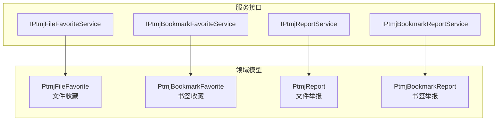
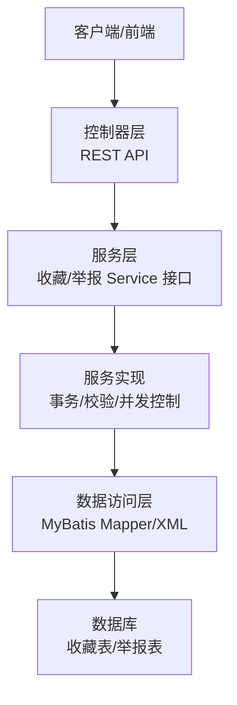
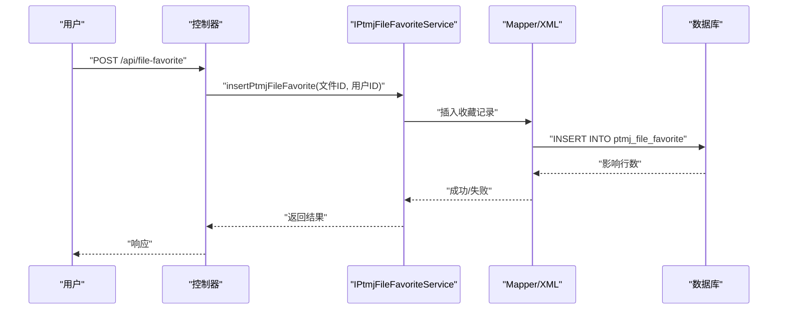
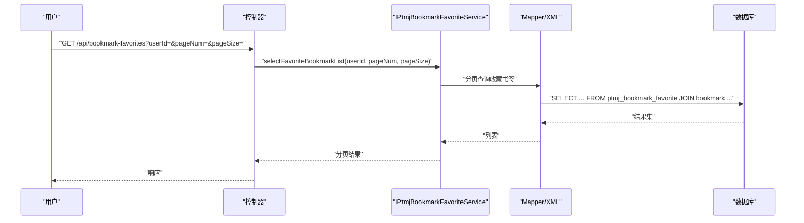
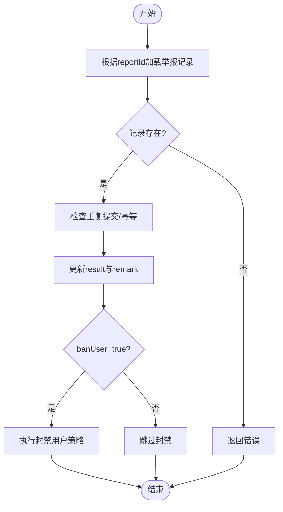
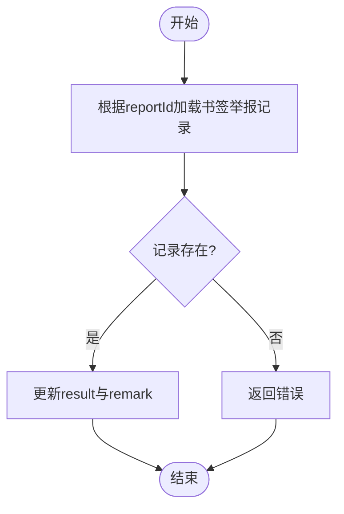
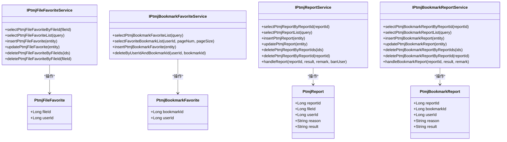
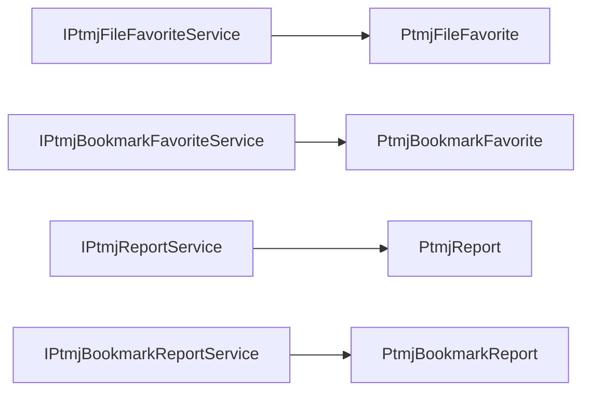
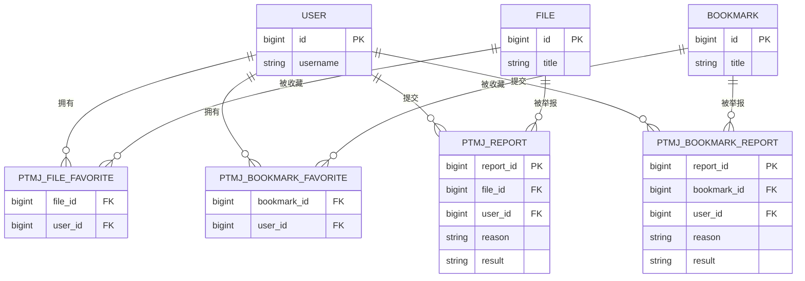

# 收藏举报系统

<cite>
**本文引用的文件**   
- [PtmjFileFavorite.java](file://PezMax-Backend/ptmj-datum/src/main/java/com/ptmj/datum/domain/PtmjFileFavorite.java)
- [PtmjBookmarkFavorite.java](file://PezMax-Backend/ptmj-datum/src/main/java/com/ptmj/datum/domain/PtmjBookmarkFavorite.java)
- [PtmjReport.java](file://PezMax-Backend/ptmj-datum/src/main/java/com/ptmj/datum/domain/PtmjReport.java)
- [PtmjBookmarkReport.java](file://PezMax-Backend/ptmj-datum/src/main/java/com/ptmj/datum/domain/PtmjBookmarkReport.java)
- [IPtmjFileFavoriteService.java](file://PezMax-Backend/ptmj-datum/src/main/java/com/ptmj/datum/service/IPtmjFileFavoriteService.java)
- [IPtmjBookmarkFavoriteService.java](file://PezMax-Backend/ptmj-datum/src/main/java/com/ptmj/datum/service/IPtmjBookmarkFavoriteService.java)
- [IPtmjReportService.java](file://PezMax-Backend/ptmj-datum/src/main/java/com/ptmj/datum/service/IPtmjReportService.java)
- [IPtmjBookmarkReportService.java](file://PezMax-Backend/ptmj-datum/src/main/java/com/ptmj/datum/service/IPtmjBookmarkReportService.java)
</cite>

## 目录
1. [简介](#简介)
2. [项目结构](#项目结构)
3. [核心组件](#核心组件)
4. [架构总览](#架构总览)
5. [详细组件分析](#详细组件分析)
6. [依赖分析](#依赖分析)
7. [性能考虑](#性能考虑)
8. [故障排查指南](#故障排查指南)
9. [结论](#结论)
10. [附录](#附录)

## 简介
本文件系统化梳理并文档化 PezMax-One 的“收藏”与“举报”子系统，覆盖以下目标：
- 收藏功能：文件收藏、书签收藏、收藏列表管理、批量操作等。
- 举报机制：内容举报、举报原因分类、审核流程、统计分析等。
- 数据模型：用户与收藏的关系映射、举报记录管理、状态流转等数据库设计要点。
- 业务逻辑：重复收藏处理、防刷机制、匿名举报支持等规则说明。
- 统计报表：收藏与举报的统计分析与报表生成实现细节。

## 项目结构
收藏与举报相关代码集中在后端模块 ptmj-datum 的 domain 与 service 层，分别定义实体模型与服务接口：
- 领域模型（domain）：文件收藏、书签收藏、文件举报、书签举报四类实体。
- 服务接口（service）：对应四个实体的 CRUD、查询、删除、批量删除以及审核处理接口。

图表来源
- [PtmjFileFavorite.java:1-52](file://PezMax-Backend/ptmj-datum/src/main/java/com/ptmj/datum/domain/PtmjFileFavorite.java#L1-L52)
- [PtmjBookmarkFavorite.java:1-49](file://PezMax-Backend/ptmj-datum/src/main/java/com/ptmj/datum/domain/PtmjBookmarkFavorite.java#L1-L49)
- [PtmjReport.java:1-103](file://PezMax-Backend/ptmj-datum/src/main/java/com/ptmj/datum/domain/PtmjReport.java#L1-L103)
- [PtmjBookmarkReport.java:1-103](file://PezMax-Backend/ptmj-datum/src/main/java/com/ptmj/datum/domain/PtmjBookmarkReport.java#L1-L103)
- [IPtmjFileFavoriteService.java:1-62](file://PezMax-Backend/ptmj-datum/src/main/java/com/ptmj/datum/service/IPtmjFileFavoriteService.java#L1-L62)
- [IPtmjBookmarkFavoriteService.java:1-20](file://PezMax-Backend/ptmj-datum/src/main/java/com/ptmj/datum/service/IPtmjBookmarkFavoriteService.java#L1-L20)
- [IPtmjReportService.java:1-62](file://PezMax-Backend/ptmj-datum/src/main/java/com/ptmj/datum/service/IPtmjReportService.java#L1-L62)
- [IPtmjBookmarkReportService.java:1-28](file://PezMax-Backend/ptmj-datum/src/main/java/com/ptmj/datum/service/IPtmjBookmarkReportService.java#L1-L28)

章节来源
- [PtmjFileFavorite.java:1-52](file://PezMax-Backend/ptmj-datum/src/main/java/com/ptmj/datum/domain/PtmjFileFavorite.java#L1-L52)
- [PtmjBookmarkFavorite.java:1-49](file://PezMax-Backend/ptmj-datum/src/main/java/com/ptmj/datum/domain/PtmjBookmarkFavorite.java#L1-L49)
- [PtmjReport.java:1-103](file://PezMax-Backend/ptmj-datum/src/main/java/com/ptmj/datum/domain/PtmjReport.java#L1-L103)
- [PtmjBookmarkReport.java:1-103](file://PezMax-Backend/ptmj-datum/src/main/java/com/ptmj/datum/domain/PtmjBookmarkReport.java#L1-L103)
- [IPtmjFileFavoriteService.java:1-62](file://PezMax-Backend/ptmj-datum/src/main/java/com/ptmj/datum/service/IPtmjFileFavoriteService.java#L1-L62)
- [IPtmjBookmarkFavoriteService.java:1-20](file://PezMax-Backend/ptmj-datum/src/main/java/com/ptmj/datum/service/IPtmjBookmarkFavoriteService.java#L1-L20)
- [IPtmjReportService.java:1-62](file://PezMax-Backend/ptmj-datum/src/main/java/com/ptmj/datum/service/IPtmjReportService.java#L1-L62)
- [IPtmjBookmarkReportService.java:1-28](file://PezMax-Backend/ptmj-datum/src/main/java/com/ptmj/datum/service/IPtmjBookmarkReportService.java#L1-L28)

## 核心组件
- 文件收藏（PtmjFileFavorite）
  - 字段：文件ID、用户ID；继承基础实体（含审计字段）。
  - 能力：新增、修改、查询、按主键删除、批量删除。
- 书签收藏（PtmjBookmarkFavorite）
  - 字段：书签ID、用户ID；继承基础实体。
  - 能力：条件查询、按用户分页获取收藏书签列表、新增、按用户+书签ID删除。
- 文件举报（PtmjReport）
  - 字段：举报ID、被举报文件ID、举报用户ID、原因、审核结果（未审核/属实/不属实）；继承基础实体。
  - 能力：CRUD、批量删除、审核处理（可联动封禁用户）。
- 书签举报（PtmjBookmarkReport）
  - 字段：举报ID、被举报书签ID、举报用户ID、原因、审核结果；继承基础实体。
  - 能力：CRUD、批量删除、审核处理。

章节来源
- [PtmjFileFavorite.java:1-52](file://PezMax-Backend/ptmj-datum/src/main/java/com/ptmj/datum/domain/PtmjFileFavorite.java#L1-L52)
- [PtmjBookmarkFavorite.java:1-49](file://PezMax-Backend/ptmj-datum/src/main/java/com/ptmj/datum/domain/PtmjBookmarkFavorite.java#L1-L49)
- [PtmjReport.java:1-103](file://PezMax-Backend/ptmj-datum/src/main/java/com/ptmj/datum/domain/PtmjReport.java#L1-L103)
- [PtmjBookmarkReport.java:1-103](file://PezMax-Backend/ptmj-datum/src/main/java/com/ptmj/datum/domain/PtmjBookmarkReport.java#L1-L103)
- [IPtmjFileFavoriteService.java:1-62](file://PezMax-Backend/ptmj-datum/src/main/java/com/ptmj/datum/service/IPtmjFileFavoriteService.java#L1-L62)
- [IPtmjBookmarkFavoriteService.java:1-20](file://PezMax-Backend/ptmj-datum/src/main/java/com/ptmj/datum/service/IPtmjBookmarkFavoriteService.java#L1-L20)
- [IPtmjReportService.java:1-62](file://PezMax-Backend/ptmj-datum/src/main/java/com/ptmj/datum/service/IPtmjReportService.java#L1-L62)
- [IPtmjBookmarkReportService.java:1-28](file://PezMax-Backend/ptmj-datum/src/main/java/com/ptmj/datum/service/IPtmjBookmarkReportService.java#L1-L28)

## 架构总览
收藏与举报子系统采用分层架构：Controller 层暴露 REST API，Service 层封装业务逻辑，Mapper/XML 负责持久化访问。实体模型承载数据语义，服务接口定义业务能力边界。

[本节为概念性架构图，无需图表来源]

## 详细组件分析

### 文件收藏组件
- 数据模型
  - 文件收藏实体包含文件ID与用户ID，用于建立“用户-文件”多对多关系。
- 服务能力
  - 提供按文件ID查询、条件列表查询、新增、修改、按文件ID删除、批量删除等能力。
- 典型调用序列（以“新增收藏”为例）

图表来源
- [IPtmjFileFavoriteService.java:1-62](file://PezMax-Backend/ptmj-datum/src/main/java/com/ptmj/datum/service/IPtmjFileFavoriteService.java#L1-L62)
- [PtmjFileFavorite.java:1-52](file://PezMax-Backend/ptmj-datum/src/main/java/com/ptmj/datum/domain/PtmjFileFavorite.java#L1-L52)

章节来源
- [IPtmjFileFavoriteService.java:1-62](file://PezMax-Backend/ptmj-datum/src/main/java/com/ptmj/datum/service/IPtmjFileFavoriteService.java#L1-L62)
- [PtmjFileFavorite.java:1-52](file://PezMax-Backend/ptmj-datum/src/main/java/com/ptmj/datum/domain/PtmjFileFavorite.java#L1-L52)

### 书签收藏组件
- 数据模型
  - 书签收藏实体包含书签ID与用户ID，用于建立“用户-书签”多对多关系。
- 服务能力
  - 提供条件查询、按用户分页获取收藏书签列表、新增、按用户+书签ID删除等能力。
- 典型调用序列（以“按用户分页获取收藏书签列表”为例）

图表来源
- [IPtmjBookmarkFavoriteService.java:1-20](file://PezMax-Backend/ptmj-datum/src/main/java/com/ptmj/datum/service/IPtmjBookmarkFavoriteService.java#L1-L20)
- [PtmjBookmarkFavorite.java:1-49](file://PezMax-Backend/ptmj-datum/src/main/java/com/ptmj/datum/domain/PtmjBookmarkFavorite.java#L1-L49)

章节来源
- [IPtmjBookmarkFavoriteService.java:1-20](file://PezMax-Backend/ptmj-datum/src/main/java/com/ptmj/datum/service/IPtmjBookmarkFavoriteService.java#L1-L20)
- [PtmjBookmarkFavorite.java:1-49](file://PezMax-Backend/ptmj-datum/src/main/java/com/ptmj/datum/domain/PtmjBookmarkFavorite.java#L1-L49)

### 文件举报组件
- 数据模型
  - 举报实体包含举报ID、被举报文件ID、举报用户ID、原因、审核结果（未审核/属实/不属实），继承基础实体（含审计字段）。
- 服务能力
  - 提供CRUD、批量删除、审核处理（支持是否封禁用户参数）。
- 审核处理流程图（handleReport）

图表来源
- [IPtmjReportService.java:1-62](file://PezMax-Backend/ptmj-datum/src/main/java/com/ptmj/datum/service/IPtmjReportService.java#L1-L62)
- [PtmjReport.java:1-103](file://PezMax-Backend/ptmj-datum/src/main/java/com/ptmj/datum/domain/PtmjReport.java#L1-L103)

章节来源
- [IPtmjReportService.java:1-62](file://PezMax-Backend/ptmj-datum/src/main/java/com/ptmj/datum/service/IPtmjReportService.java#L1-L62)
- [PtmjReport.java:1-103](file://PezMax-Backend/ptmj-datum/src/main/java/com/ptmj/datum/domain/PtmjReport.java#L1-L103)

### 书签举报组件
- 数据模型
  - 书签举报实体包含举报ID、被举报书签ID、举报用户ID、原因、审核结果，继承基础实体。
- 服务能力
  - 提供CRUD、批量删除、审核处理。
- 审核处理流程图（handleBookmarkReport）

图表来源
- [IPtmjBookmarkReportService.java:1-28](file://PezMax-Backend/ptmj-datum/src/main/java/com/ptmj/datum/service/IPtmjBookmarkReportService.java#L1-L28)
- [PtmjBookmarkReport.java:1-103](file://PezMax-Backend/ptmj-datum/src/main/java/com/ptmj/datum/domain/PtmjBookmarkReport.java#L1-L103)

章节来源
- [IPtmjBookmarkReportService.java:1-28](file://PezMax-Backend/ptmj-datum/src/main/java/com/ptmj/datum/service/IPtmjBookmarkReportService.java#L1-L28)
- [PtmjBookmarkReport.java:1-103](file://PezMax-Backend/ptmj-datum/src/main/java/com/ptmj/datum/domain/PtmjBookmarkReport.java#L1-L103)

### 类图（实体与服务接口关系）

图表来源
- [PtmjFileFavorite.java:1-52](file://PezMax-Backend/ptmj-datum/src/main/java/com/ptmj/datum/domain/PtmjFileFavorite.java#L1-L52)
- [IPtmjFileFavoriteService.java:1-62](file://PezMax-Backend/ptmj-datum/src/main/java/com/ptmj/datum/service/IPtmjFileFavoriteService.java#L1-L62)
- [PtmjBookmarkFavorite.java:1-49](file://PezMax-Backend/ptmj-datum/src/main/java/com/ptmj/datum/domain/PtmjBookmarkFavorite.java#L1-L49)
- [IPtmjBookmarkFavoriteService.java:1-20](file://PezMax-Backend/ptmj-datum/src/main/java/com/ptmj/datum/service/IPtmjBookmarkFavoriteService.java#L1-L20)
- [PtmjReport.java:1-103](file://PezMax-Backend/ptmj-datum/src/main/java/com/ptmj/datum/domain/PtmjReport.java#L1-L103)
- [IPtmjReportService.java:1-62](file://PezMax-Backend/ptmj-datum/src/main/java/com/ptmj/datum/service/IPtmjReportService.java#L1-L62)
- [PtmjBookmarkReport.java:1-103](file://PezMax-Backend/ptmj-datum/src/main/java/com/ptmj/datum/domain/PtmjBookmarkReport.java#L1-L103)
- [IPtmjBookmarkReportService.java:1-28](file://PezMax-Backend/ptmj-datum/src/main/java/com/ptmj/datum/service/IPtmjBookmarkReportService.java#L1-L28)

## 依赖分析
- 内聚性与耦合度
  - 每个实体与其服务接口一一对应，职责清晰，内聚性强。
  - 服务接口仅声明能力，具体实现位于 impl 包（不在本次引用范围内），通过接口降低耦合。
- 外部依赖
  - 实体继承基础实体，复用审计字段（创建人、创建时间、更新人、更新时间、备注等）。
  - 部分实体使用 Excel 注解，便于导出报表。
- 潜在循环依赖
  - 当前接口与实体之间无相互导入，未见循环依赖迹象。

图表来源
- [IPtmjFileFavoriteService.java:1-62](file://PezMax-Backend/ptmj-datum/src/main/java/com/ptmj/datum/service/IPtmjFileFavoriteService.java#L1-L62)
- [IPtmjBookmarkFavoriteService.java:1-20](file://PezMax-Backend/ptmj-datum/src/main/java/com/ptmj/datum/service/IPtmjBookmarkFavoriteService.java#L1-L20)
- [IPtmjReportService.java:1-62](file://PezMax-Backend/ptmj-datum/src/main/java/com/ptmj/datum/service/IPtmjReportService.java#L1-L62)
- [IPtmjBookmarkReportService.java:1-28](file://PezMax-Backend/ptmj-datum/src/main/java/com/ptmj/datum/service/IPtmjBookmarkReportService.java#L1-L28)
- [PtmjFileFavorite.java:1-52](file://PezMax-Backend/ptmj-datum/src/main/java/com/ptmj/datum/domain/PtmjFileFavorite.java#L1-L52)
- [PtmjBookmarkFavorite.java:1-49](file://PezMax-Backend/ptmj-datum/src/main/java/com/ptmj/datum/domain/PtmjBookmarkFavorite.java#L1-L49)
- [PtmjReport.java:1-103](file://PezMax-Backend/ptmj-datum/src/main/java/com/ptmj/datum/domain/PtmjReport.java#L1-L103)
- [PtmjBookmarkReport.java:1-103](file://PezMax-Backend/ptmj-datum/src/main/java/com/ptmj/datum/domain/PtmjBookmarkReport.java#L1-L103)

章节来源
- [IPtmjFileFavoriteService.java:1-62](file://PezMax-Backend/ptmj-datum/src/main/java/com/ptmj/datum/service/IPtmjFileFavoriteService.java#L1-L62)
- [IPtmjBookmarkFavoriteService.java:1-20](file://PezMax-Backend/ptmj-datum/src/main/java/com/ptmj/datum/service/IPtmjBookmarkFavoriteService.java#L1-L20)
- [IPtmjReportService.java:1-62](file://PezMax-Backend/ptmj-datum/src/main/java/com/ptmj/datum/service/IPtmjReportService.java#L1-L62)
- [IPtmjBookmarkReportService.java:1-28](file://PezMax-Backend/ptmj-datum/src/main/java/com/ptmj/datum/service/IPtmjBookmarkReportService.java#L1-L28)
- [PtmjFileFavorite.java:1-52](file://PezMax-Backend/ptmj-datum/src/main/java/com/ptmj/datum/domain/PtmjFileFavorite.java#L1-L52)
- [PtmjBookmarkFavorite.java:1-49](file://PezMax-Backend/ptmj-datum/src/main/java/com/ptmj/datum/domain/PtmjBookmarkFavorite.java#L1-L49)
- [PtmjReport.java:1-103](file://PezMax-Backend/ptmj-datum/src/main/java/com/ptmj/datum/domain/PtmjReport.java#L1-L103)
- [PtmjBookmarkReport.java:1-103](file://PezMax-Backend/ptmj-datum/src/main/java/com/ptmj/datum/domain/PtmjBookmarkReport.java#L1-L103)

## 性能考虑
- 索引建议
  - 收藏表：在（用户ID, 文件ID/书签ID）上建立唯一索引，避免重复收藏并提升查询效率。
  - 举报表：在（被举报对象ID）、（举报用户ID）、（审核结果）上建立索引，加速列表查询与统计。
- 分页与排序
  - 收藏列表查询已提供分页参数，建议在服务端进行合理排序与限制返回字段。
- 批量操作
  - 批量删除接口需保证事务一致性与原子性，避免部分成功导致的数据不一致。
- 缓存策略
  - 高频读取的收藏状态可引入本地或分布式缓存，减少热点行竞争。

[本节为通用性能建议，无需章节来源]

## 故障排查指南
- 常见问题定位
  - 重复收藏：检查唯一约束与幂等逻辑，确认插入前是否存在冲突。
  - 举报重复提交：在 handleReport 中增加幂等校验，防止同一用户短时间内重复提交。
  - 审核结果异常：核对 result 枚举值与转换逻辑，确保与前端展示一致。
- 日志与追踪
  - 在服务实现层记录关键步骤日志（入参、出参、异常堆栈），结合审计字段快速定位问题。
- 数据一致性
  - 批量删除与审核处理涉及多步操作时，务必使用事务包裹，必要时补偿重试。

[本节为通用排障建议，无需章节来源]

## 结论
本系统围绕“收藏”和“举报”两大核心能力，提供了清晰的实体模型与服务接口定义，具备完善的增删改查、分页查询、批量操作与审核处理能力。后续可在实现层补充幂等、限流、审计与统计报表等增强特性，以提升系统的健壮性与可观测性。

[本节为总结性内容，无需章节来源]

## 附录

### 数据模型设计要点（ER 关系）

[本节为概念性 ER 图，无需图表来源]

### 业务规则与最佳实践
- 重复收藏处理
  - 插入前检查唯一性，若已存在则返回“已收藏”提示或执行幂等更新。
- 举报防刷机制
  - 基于用户ID+被举报对象ID+时间窗口的去重策略，限制短时间内的重复提交。
- 匿名举报支持
  - 当 userId 为空时允许匿名举报，但需在风控层面加强验证（如设备指纹、IP 频次限制）。
- 审核状态流转
  - 未审核 → 属实/不属实；一旦审核完成，禁止再次变更，除非管理员撤销。
- 统计分析与报表
  - 提供按日/周/月的收藏量、举报量、审核通过率、热门被举报对象等指标。
  - 利用 Excel 注解导出报表，便于运营与合规团队分析。

[本节为通用业务规范，无需章节来源]