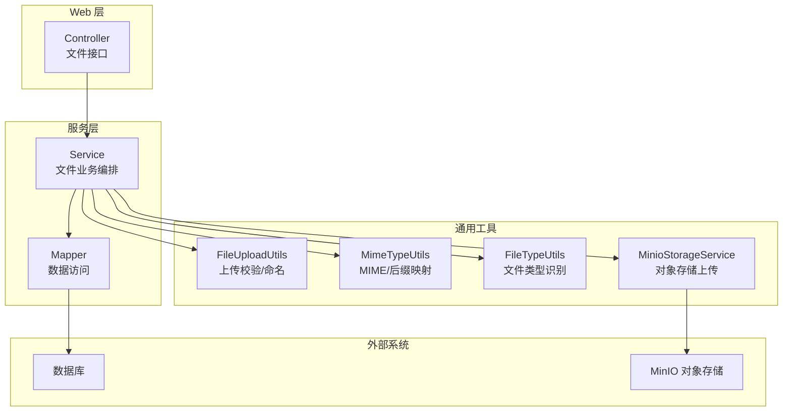
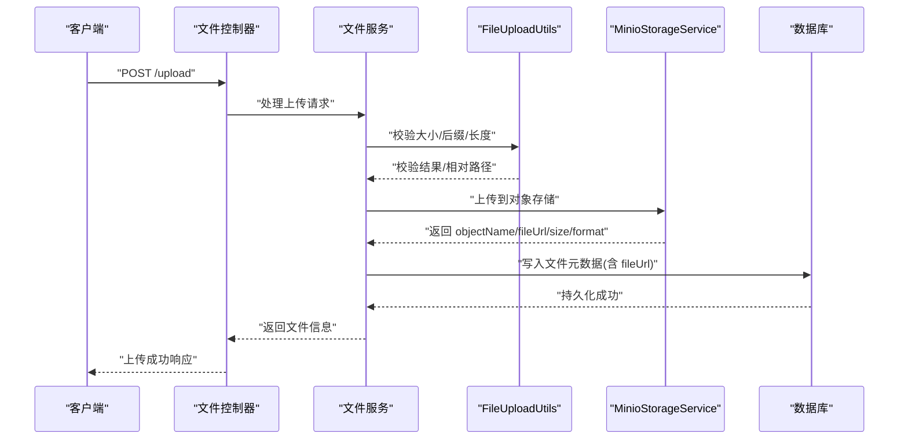
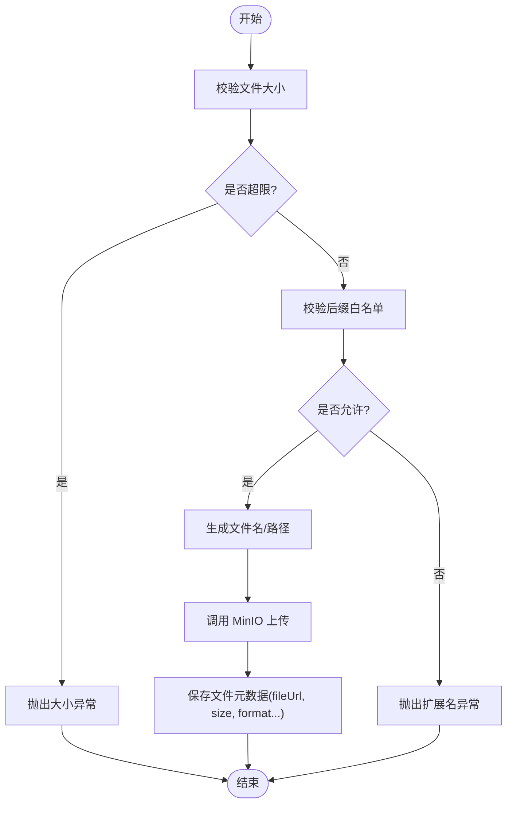
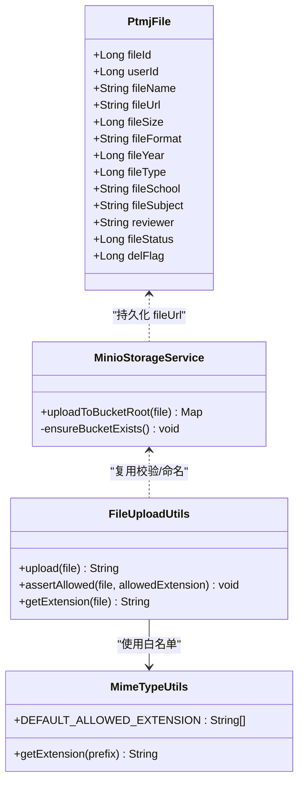
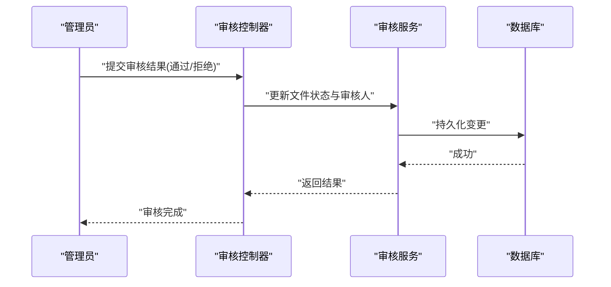
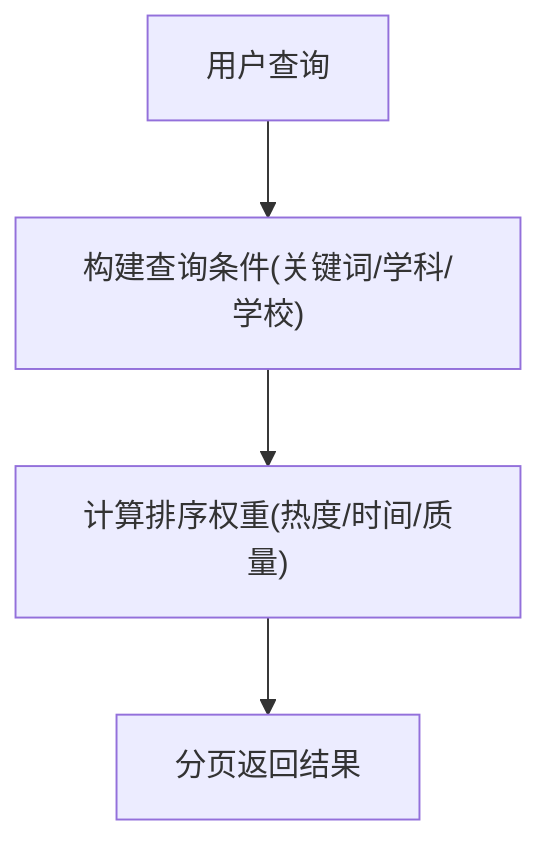
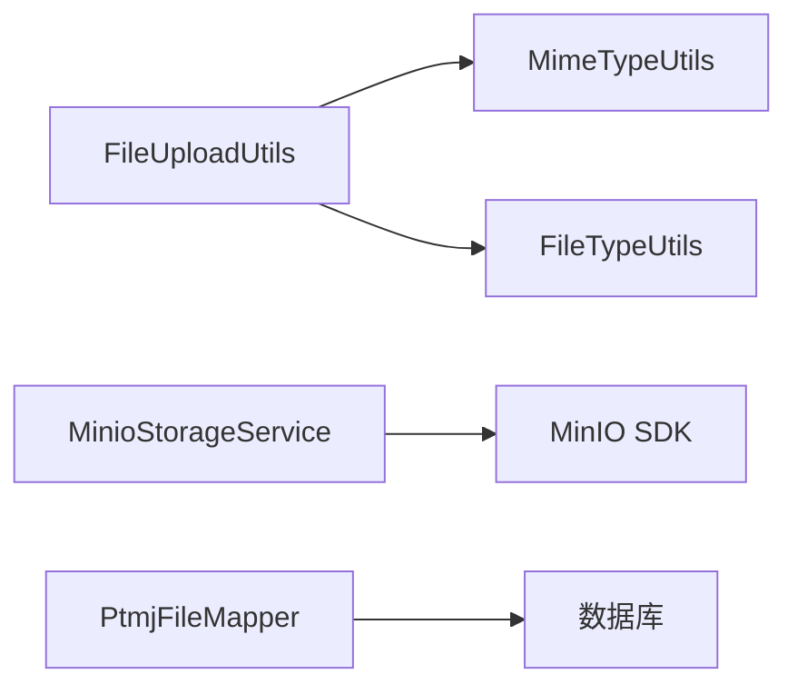

# 文件管理系统

<cite>
**本文引用的文件**   
- [PtmjFile.java](file://PezMax-Backend/ptmj-datum/src/main/java/com/ptmj/datum/domain/PtmjFile.java)
- [MinioStorageService.java](file://PezMax-Backend/ruoyi-common/src/main/java/com/ruoyi/common/utils/file/MinioStorageService.java)
- [FileUploadUtils.java](file://PezMax-Backend/ruoyi-common/src/main/java/com/ruoyi/common/utils/file/FileUploadUtils.java)
- [MimeTypeUtils.java](file://PezMax-Backend/ruoyi-common/src/main/java/com/ruoyi/common/utils/file/MimeTypeUtils.java)
- [FileTypeUtils.java](file://PezMax-Backend/ruoyi-common/src/main/java/com/ruoyi/common/utils/file/FileTypeUtils.java)
- [PtmjFileMapper.java](file://PezMax-Backend/ptmj-datum/src/main/java/com/ptmj/datum/mapper/PtmjFileMapper.java)
</cite>

## 目录
1. [简介](#简介)
2. [项目结构](#项目结构)
3. [核心组件](#核心组件)
4. [架构总览](#架构总览)
5. [详细组件分析](#详细组件分析)
6. [依赖关系分析](#依赖关系分析)
7. [性能考量](#性能考量)
8. [故障排查指南](#故障排查指南)
9. [结论](#结论)
10. [附录](#附录)

## 简介
本文件围绕 PezMax-One 的文件管理核心能力进行系统化文档化，重点覆盖：
- 多格式文件上传与下载（PDF、Word、Excel、图片等）
- 对象存储集成（MinIO）与访问 URL 生成
- 文件分类、版本控制、在线预览策略
- 文件审核流程（内容安全检测、人工审核、批量操作）
- 搜索与推荐（关键词、学科联想、学校联想、智能排序）
- 权限控制、下载次数统计、收藏与举报等扩展功能

说明：本节为总体概述，不直接分析具体代码文件。

## 项目结构
后端采用模块化分层组织，与文件管理相关的关键位置如下：
- 领域模型与持久层：ptmj-datum（实体、Mapper、Service）
- 通用工具与配置：ruoyi-common（文件上传、类型判断、MinIO 客户端封装等）
- Web 控制器与业务编排：ruoyi-admin（Controller 层，负责接口暴露与参数校验）
- 前端界面：ruoyi-ui / PezMax-Desktop（上传组件、列表展示、预览入口等）

图表来源
- [MinioStorageService.java:1-88](file://PezMax-Backend/ruoyi-common/src/main/java/com/ruoyi/common/utils/file/MinioStorageService.java#L1-L88)
- [FileUploadUtils.java:1-261](file://PezMax-Backend/ruoyi-common/src/main/java/com/ruoyi/common/utils/file/FileUploadUtils.java#L1-L261)
- [MimeTypeUtils.java:1-60](file://PezMax-Backend/ruoyi-common/src/main/java/com/ruoyi/common/utils/file/MimeTypeUtils.java#L1-L60)
- [FileTypeUtils.java:1-76](file://PezMax-Backend/ruoyi-common/src/main/java/com/ruoyi/common/utils/file/FileTypeUtils.java#L1-L76)
- [PtmjFileMapper.java](file://PezMax-Backend/ptmj-datum/src/main/java/com/ptmj/datum/mapper/PtmjFileMapper.java)

章节来源
- [PtmjFile.java:1-224](file://PezMax-Backend/ptmj-datum/src/main/java/com/ptmj/datum/domain/PtmjFile.java#L1-L224)
- [MinioStorageService.java:1-88](file://PezMax-Backend/ruoyi-common/src/main/java/com/ruoyi/common/utils/file/MinioStorageService.java#L1-L88)
- [FileUploadUtils.java:1-261](file://PezMax-Backend/ruoyi-common/src/main/java/com/ruoyi/common/utils/file/FileUploadUtils.java#L1-L261)
- [MimeTypeUtils.java:1-60](file://PezMax-Backend/ruoyi-common/src/main/java/com/ruoyi/common/utils/file/MimeTypeUtils.java#L1-L60)
- [FileTypeUtils.java:1-76](file://PezMax-Backend/ruoyi-common/src/main/java/com/ruoyi/common/utils/file/FileTypeUtils.java#L1-L76)
- [PtmjFileMapper.java](file://PezMax-Backend/ptmj-datum/src/main/java/com/ptmj/datum/mapper/PtmjFileMapper.java)

## 核心组件
- 文件领域模型 PtmjFile：承载文件元信息（名称、URL、大小、格式、年份、类型、学校、科目、审核人、状态、删除标记等），用于统一描述“试卷文件”的业务语义。
- MinIO 存储适配 MinioStorageService：封装桶存在性检查、直传对象、返回可访问的公开 URL 及基础元信息。
- 上传工具 FileUploadUtils：提供默认大小限制、文件名长度限制、白名单校验、路径构造与相对路径生成。
- MIME 与类型工具：MimeTypeUtils 定义允许的后缀集合与 MIME 映射；FileTypeUtils 支持基于字节头识别常见图片类型。
- 数据访问 PtmjFileMapper：面向 ptmj_file 表的增删改查与条件查询。

章节来源
- [PtmjFile.java:1-224](file://PezMax-Backend/ptmj-datum/src/main/java/com/ptmj/datum/domain/PtmjFile.java#L1-L224)
- [MinioStorageService.java:1-88](file://PezMax-Backend/ruoyi-common/src/main/java/com/ruoyi/common/utils/file/MinioStorageService.java#L1-L88)
- [FileUploadUtils.java:1-261](file://PezMax-Backend/ruoyi-common/src/main/java/com/ruoyi/common/utils/file/FileUploadUtils.java#L1-L261)
- [MimeTypeUtils.java:1-60](file://PezMax-Backend/ruoyi-common/src/main/java/com/ruoyi/common/utils/file/MimeTypeUtils.java#L1-L60)
- [FileTypeUtils.java:1-76](file://PezMax-Backend/ruoyi-common/src/main/java/com/ruoyi/common/utils/file/FileTypeUtils.java#L1-L76)
- [PtmjFileMapper.java](file://PezMax-Backend/ptmj-datum/src/main/java/com/ptmj/datum/mapper/PtmjFileMapper.java)

## 架构总览
整体采用“控制器 -> 服务 -> 工具/存储 -> 数据库/对象存储”的分层架构。上传链路中，文件先经通用上传工具完成合法性校验与命名，再交由 MinIO 直传并生成访问 URL；下载链路通过对象存储直出或经服务端代理输出。

图表来源
- [FileUploadUtils.java:1-261](file://PezMax-Backend/ruoyi-common/src/main/java/com/ruoyi/common/utils/file/FileUploadUtils.java#L1-L261)
- [MinioStorageService.java:1-88](file://PezMax-Backend/ruoyi-common/src/main/java/com/ruoyi/common/utils/file/MinioStorageService.java#L1-L88)
- [PtmjFile.java:1-224](file://PezMax-Backend/ptmj-datum/src/main/java/com/ptmj/datum/domain/PtmjFile.java#L1-L224)

## 详细组件分析

### 文件上传与下载机制
- 多格式支持
  - 默认允许后缀集合包含图片、Office、压缩、视频、PDF 等，便于覆盖常见教学资料场景。
  - 若未携带扩展名，可通过 Content-Type 推断后缀。
- 大文件切片上传与断点续传
  - 当前实现以单块直传为主，未内置分片与断点续传逻辑。可在控制器与服务层引入分片合并、MD5 校验与进度上报，结合对象存储的断点续传能力扩展。
- 进度监控
  - 当前未内置进度回调。可在前端使用 XMLHttpRequest.upload.onprogress 上报，后端通过 Redis 记录进度键值对，供轮询或 SSE 推送。
- 下载
  - 对象存储直链下载：通过生成的 fileUrl 直接访问。
  - 服务端代理下载：在控制器中读取对象流并写出，同时更新下载次数统计。

图表来源
- [FileUploadUtils.java:1-261](file://PezMax-Backend/ruoyi-common/src/main/java/com/ruoyi/common/utils/file/FileUploadUtils.java#L1-L261)
- [MimeTypeUtils.java:1-60](file://PezMax-Backend/ruoyi-common/src/main/java/com/ruoyi/common/utils/file/MimeTypeUtils.java#L1-L60)
- [MinioStorageService.java:1-88](file://PezMax-Backend/ruoyi-common/src/main/java/com/ruoyi/common/utils/file/MinioStorageService.java#L1-L88)

章节来源
- [FileUploadUtils.java:1-261](file://PezMax-Backend/ruoyi-common/src/main/java/com/ruoyi/common/utils/file/FileUploadUtils.java#L1-L261)
- [MimeTypeUtils.java:1-60](file://PezMax-Backend/ruoyi-common/src/main/java/com/ruoyi/common/utils/file/MimeTypeUtils.java#L1-L60)
- [MinioStorageService.java:1-88](file://PezMax-Backend/ruoyi-common/src/main/java/com/ruoyi/common/utils/file/MinioStorageService.java#L1-L88)

### 文件存储架构（MinIO 集成、分类、版本、预览）
- MinIO 集成
  - 自动创建桶（不存在则创建）。
  - 上传时生成唯一 objectName，保留原始扩展名，设置正确的 contentType。
  - 拼接 minioUrl + bucket + objectName 得到可直接访问的 fileUrl。
- 文件分类管理
  - 通过 PtmjFile.fileType、fileYear、fileSchool、fileSubject 等字段实现多维分类与检索。
- 版本控制
  - 当前未启用对象存储版本控制。建议在 MinIO 开启 Bucket Versioning，并在业务层维护版本号与回滚策略。
- 在线预览
  - PDF：浏览器原生支持或通过 iframe/embed 嵌入。
  - Office：建议转换为 PDF 后预览，或使用第三方转换服务。
  - 图片：直接渲染缩略图与原图。

图表来源
- [PtmjFile.java:1-224](file://PezMax-Backend/ptmj-datum/src/main/java/com/ptmj/datum/domain/PtmjFile.java#L1-L224)
- [MinioStorageService.java:1-88](file://PezMax-Backend/ruoyi-common/src/main/java/com/ruoyi/common/utils/file/MinioStorageService.java#L1-L88)
- [FileUploadUtils.java:1-261](file://PezMax-Backend/ruoyi-common/src/main/java/com/ruoyi/common/utils/file/FileUploadUtils.java#L1-L261)
- [MimeTypeUtils.java:1-60](file://PezMax-Backend/ruoyi-common/src/main/java/com/ruoyi/common/utils/file/MimeTypeUtils.java#L1-L60)

章节来源
- [PtmjFile.java:1-224](file://PezMax-Backend/ptmj-datum/src/main/java/com/ptmj/datum/domain/PtmjFile.java#L1-L224)
- [MinioStorageService.java:1-88](file://PezMax-Backend/ruoyi-common/src/main/java/com/ruoyi/common/utils/file/MinioStorageService.java#L1-L88)
- [FileUploadUtils.java:1-261](file://PezMax-Backend/ruoyi-common/src/main/java/com/ruoyi/common/utils/file/FileUploadUtils.java#L1-L261)
- [MimeTypeUtils.java:1-60](file://PezMax-Backend/ruoyi-common/src/main/java/com/ruoyi/common/utils/file/MimeTypeUtils.java#L1-L60)

### 文件审核流程（内容安全、人工审核、批量）
- 内容安全检测
  - 建议在上传成功后异步触发文本/图像/压缩包扫描任务，将结果落库并与 fileStatus 联动。
- 人工审核
  - 管理员后台查看待审列表，执行通过/拒绝，并记录 reviewer 与时间戳。
- 批量操作
  - 支持按筛选条件批量通过/拒绝，提升运营效率。

[本节为流程设计说明，未直接分析具体文件]

### 搜索与推荐系统（关键词、学科/学校联想、智能排序）
- 关键词搜索
  - 基于 PtmjFile.fileName、fileSubject、fileSchool 等字段进行模糊匹配。
- 学科/学校联想
  - 维护字典表或缓存常用学科与学校词频，输入时返回 TopN 候选。
- 智能排序
  - 综合热度（下载量）、时间衰减、质量评分（审核等级、举报率）计算权重排序。

[本节为算法设计说明，未直接分析具体文件]

### 权限控制、下载次数统计、收藏与举报
- 权限控制
  - 基于角色/数据范围拦截，仅允许有权限的用户访问特定文件或目录。
- 下载次数统计
  - 每次下载成功原子递增计数，支持按日/月聚合报表。
- 收藏与举报
  - 收藏：用户维度去重，支持取消收藏。
  - 举报：记录举报原因与证据，达到阈值触发自动下架或人工复核。

[本节为功能设计说明，未直接分析具体文件]

## 依赖关系分析
- 模块内耦合
  - 上传链路中，FileUploadUtils 与 MimeTypeUtils 强耦合于白名单与 MIME 映射；MinioStorageService 独立封装对象存储交互。
- 外部依赖
  - MinIO SDK 用于对象上传与桶管理。
  - 数据库用于文件元数据与审计信息持久化。
- 潜在循环依赖
  - 当前未发现循环依赖；建议保持“工具类无业务状态”的原则。

图表来源
- [FileUploadUtils.java:1-261](file://PezMax-Backend/ruoyi-common/src/main/java/com/ruoyi/common/utils/file/FileUploadUtils.java#L1-L261)
- [MimeTypeUtils.java:1-60](file://PezMax-Backend/ruoyi-common/src/main/java/com/ruoyi/common/utils/file/MimeTypeUtils.java#L1-L60)
- [FileTypeUtils.java:1-76](file://PezMax-Backend/ruoyi-common/src/main/java/com/ruoyi/common/utils/file/FileTypeUtils.java#L1-L76)
- [MinioStorageService.java:1-88](file://PezMax-Backend/ruoyi-common/src/main/java/com/ruoyi/common/utils/file/MinioStorageService.java#L1-L88)
- [PtmjFileMapper.java](file://PezMax-Backend/ptmj-datum/src/main/java/com/ptmj/datum/mapper/PtmjFileMapper.java)

章节来源
- [FileUploadUtils.java:1-261](file://PezMax-Backend/ruoyi-common/src/main/java/com/ruoyi/common/utils/file/FileUploadUtils.java#L1-L261)
- [MimeTypeUtils.java:1-60](file://PezMax-Backend/ruoyi-common/src/main/java/com/ruoyi/common/utils/file/MimeTypeUtils.java#L1-L60)
- [FileTypeUtils.java:1-76](file://PezMax-Backend/ruoyi-common/src/main/java/com/ruoyi/common/utils/file/FileTypeUtils.java#L1-L76)
- [MinioStorageService.java:1-88](file://PezMax-Backend/ruoyi-common/src/main/java/com/ruoyi/common/utils/file/MinioStorageService.java#L1-L88)
- [PtmjFileMapper.java](file://PezMax-Backend/ptmj-datum/src/main/java/com/ptmj/datum/mapper/PtmjFileMapper.java)

## 性能考量
- 上传
  - 避免在服务端中转大文件，优先直传对象存储；合理设置超时与线程池。
  - 对大文件建议后续引入分片上传与并发上传以提升吞吐。
- 下载
  - 优先使用对象存储直链；需要鉴权时采用短期签名链接或网关级鉴权。
- 存储
  - 对象存储桶开启版本控制与生命周期策略，降低冷数据成本。
- 索引与缓存
  - 高频搜索字段建立合适索引；热点文件元数据可入缓存加速。

[本节为通用优化建议，未直接分析具体文件]

## 故障排查指南
- 上传失败
  - 检查文件大小是否超过默认上限；确认后缀是否在白名单；核对 MinIO 连接与桶是否存在。
- 无法访问文件
  - 校验 fileUrl 拼接是否正确；确认对象存储桶策略是否为公开读或已签发临时链接。
- 类型识别异常
  - 当扩展名为空时，确保 Content-Type 正确；必要时使用 FileTypeUtils 基于字节头二次识别。

章节来源
- [FileUploadUtils.java:1-261](file://PezMax-Backend/ruoyi-common/src/main/java/com/ruoyi/common/utils/file/FileUploadUtils.java#L1-L261)
- [MinioStorageService.java:1-88](file://PezMax-Backend/ruoyi-common/src/main/java/com/ruoyi/common/utils/file/MinioStorageService.java#L1-L88)
- [FileTypeUtils.java:1-76](file://PezMax-Backend/ruoyi-common/src/main/java/com/ruoyi/common/utils/file/FileTypeUtils.java#L1-L76)

## 结论
本项目已具备稳定的文件上传、对象存储直传与基础元数据管理能力，并通过统一的领域模型支撑分类、审核与检索。后续可在分片上传、断点续传、内容安全扫描、智能排序与精细化权限方面持续演进，以满足更大规模与更复杂的教学资源管理场景。

[本节为总结性内容，未直接分析具体文件]

## 附录
- 关键实体字段参考
  - 文件标识、上传者、名称、URL、大小、格式、年份、类型、学校、科目、审核人、状态、删除标记等。
- 常用工具方法参考
  - 上传校验、后缀提取、MIME 映射、文件类型识别、MinIO 直传与 URL 生成。

章节来源
- [PtmjFile.java:1-224](file://PezMax-Backend/ptmj-datum/src/main/java/com/ptmj/datum/domain/PtmjFile.java#L1-L224)
- [FileUploadUtils.java:1-261](file://PezMax-Backend/ruoyi-common/src/main/java/com/ruoyi/common/utils/file/FileUploadUtils.java#L1-L261)
- [MimeTypeUtils.java:1-60](file://PezMax-Backend/ruoyi-common/src/main/java/com/ruoyi/common/utils/file/MimeTypeUtils.java#L1-L60)
- [FileTypeUtils.java:1-76](file://PezMax-Backend/ruoyi-common/src/main/java/com/ruoyi/common/utils/file/FileTypeUtils.java#L1-L76)
- [MinioStorageService.java:1-88](file://PezMax-Backend/ruoyi-common/src/main/java/com/ruoyi/common/utils/file/MinioStorageService.java#L1-L88)
- [PtmjFileMapper.java](file://PezMax-Backend/ptmj-datum/src/main/java/com/ptmj/datum/mapper/PtmjFileMapper.java)